# Arquitetura Geral

## Visão Geral
O sistema Igreja Carvalho é uma aplicação web construída em React,
utilizando Supabase como backend (Auth + Banco de Dados + Segurança).

### Fluxo macro do sistema
Este diagrama mostra o caminho de uma requisição autenticada: frontend aciona Supabase Auth, o Postgres aplica RLS e retorna dados filtrados. Referências: [`../adr/ADR-002-autenticacao-supabase.md`](../adr/ADR-002-autenticacao-supabase.md) e [`../adr/ADR-003-rls-e-modelo-permissoes.md`](../adr/ADR-003-rls-e-modelo-permissoes.md).

```mermaid
flowchart LR
    U[Usuário] -->|Browser| FE[Frontend (React + Vite)]
    FE -->|Credenciais| AUTH[Supabase Auth]
    FE -->|Queries| PG[Postgres]
    PG -->|Enforce| RLS[Row Level Security]
    RLS --> FE
```

## Componentes
- Frontend: React + Vite + Tailwind
- Backend: Supabase (Postgres + Auth)
- Segurança: Row Level Security (RLS)

## Diagrama
Visão resumida do caminho request → auth → dados, ligada ao manual e funcionalidades. Referências: [`../manual-usuario.md`](../manual-usuario.md) e [`../funcionalidades.md`](../funcionalidades.md).
```mermaid
flowchart LR
    User[Usuário] -->|Browser| Frontend[React + Vite]
    Frontend -->|Login| Auth[Supabase Auth]
    Frontend -->|Queries| DB[(Postgres)]
    DB -->|RLS| Policies[Políticas de Segurança]


---

# 🔐 Autenticação

## `docs/01-arquitetura/04-autenticacao.md`

```md
# Autenticação

O sistema utiliza Supabase Auth para controle de usuários e sessões.

## Fluxo
```mermaid
sequenceDiagram
    User->>Frontend: Login
    Frontend->>SupabaseAuth: Credenciais
    SupabaseAuth-->>Frontend: JWT
    Frontend->>DB: Requests autenticadas


---

# 🔐 Autenticação

## `docs/01-arquitetura/04-autenticacao.md`

```md
# Autenticação

O sistema utiliza Supabase Auth para controle de usuários e sessões.

## Fluxo
```mermaid
sequenceDiagram
    User->>Frontend: Login
    Frontend->>SupabaseAuth: Credenciais
    SupabaseAuth-->>Frontend: JWT
    Frontend->>DB: Requests autenticadas


---

# 🗄️ 02 — Backend (Supabase)

## `docs/02-backend-supabase/01-modelo-de-dados.md`

```md
# Modelo de Dados

O Supabase utiliza PostgreSQL como banco relacional.

## Entidades principais
- users (auth)
- pessoas
- perfis
- relacionamentos ministeriais

## Modelo Relacional
```mermaid
erDiagram
    USERS ||--o{ PESSOAS : possui
    PESSOAS ||--o{ PERFIS : assume


## `docs/02-backend-supabase/03-rls-politicas.md`

```md
# Políticas de Segurança (RLS)

O acesso aos dados é controlado por Row Level Security.

## Exemplo
- Usuário só visualiza dados da sua igreja
- Perfis definem permissões de escrita

## Fluxo
```mermaid
flowchart LR
    Request --> Auth
    Auth --> Role
    Role --> RLS
    RLS --> DB


## Visão de Autenticação (Supabase Auth)

- Usuários e sessões gerenciados via Supabase Auth (JWT).
- Frontend usa `supabase-js` e persiste sessão no `localStorage`.
- Papel/base (admin, tecnico, lider, membro) mapeado em `user_roles` e usado pelo RLS.

### Sequência de autenticação e uso do JWT
Diagrama resume login, refresh de sessão e uso do JWT nas queries. Referências: [`02-autenticacao-supabase.MD`](02-autenticacao-supabase.MD) e [`../adr/ADR-002-autenticacao-supabase.md`](../adr/ADR-002-autenticacao-supabase.md).

```mermaid
sequenceDiagram
    participant User
    participant Frontend
    participant SupabaseAuth as Supabase Auth
    participant DB

    User->>Frontend: Login (senha/magic link)
    Frontend->>SupabaseAuth: Credenciais
    SupabaseAuth-->>Frontend: JWT + refresh token
    Frontend->>DB: Query com JWT
    DB-->>Frontend: Dados filtrados por RLS
    Frontend->>SupabaseAuth: Refresh token (antes de expirar)
    SupabaseAuth-->>Frontend: Novo JWT
    Frontend->>DB: Novas queries com JWT renovado
```



```mermaid
sequenceDiagram
    participant User
    participant Frontend
    participant SupabaseAuth as Supabase Auth
    participant DB

    User->>Frontend: Cria sessão (login/signup)
    Frontend->>SupabaseAuth: Credenciais / Magic Link
    SupabaseAuth-->>Frontend: JWT + refresh token
    Frontend->>DB: Chamada autenticada (JWT)
    DB-->>Frontend: Dados filtrados por RLS
```

## Visão de Fluxo de Dados (Frontend → Supabase → RLS → DB)

Fluxo detalha a validação de sessão pelo client Supabase, checagem de claims para RLS e retorno filtrado. Referências: [`03-fluxo-de-dados.MD`](03-fluxo-de-dados.MD) e [`../adr/ADR-003-rls-e-modelo-permissoes.md`](../adr/ADR-003-rls-e-modelo-permissoes.md).

```mermaid
flowchart TD
    FE[Frontend (supabase-js)] -->|Query/RPC/Storage| EDGE[Supabase Edge/PostgREST]
    EDGE -->|Valida JWT + session| AUTH[Supabase Auth]
    EDGE -->|Claims (sub, role, igreja)| RLS[RLS Policies]
    RLS --> PG[(Postgres)]
    PG --> FE
```



```mermaid
flowchart TD
    U[Usuário] --> FE[Frontend React]
    FE -->|RPC/SQL/Storage| SB[Supabase Edge/API]
    SB -->|JWT claims| RLS[RLS Policies]
    RLS --> PG[(Postgres)]
    PG --> FE

    subgraph AuthZ
    RLS
    end
```

## Referências e Diagramas
- Diagramas relacionados: [`../diagramas/`](../diagramas/)
- Detalhe de autenticação: [`02-autenticacao-supabase.MD`](02-autenticacao-supabase.MD)
- Fluxo de dados detalhado: [`03-fluxo-de-dados.MD`](03-fluxo-de-dados.MD)
- RLS e segurança: [`04-rls-e-seguranca.MD`](04-rls-e-seguranca.MD)

---

## Módulo Financeiro (Visão Técnica)

### Objetivo
Prover controle financeiro com separação clara entre **Fato Gerador** (competência), **Fluxo de Caixa** (pagamentos) e **DRE** (resultado contábil), garantindo relatórios precisos e auditáveis.

---

## Módulo Pessoas / Membros (visão técnica)

### Como o frontend carrega e persiste dados

### Interação com Supabase

### Considerações de RLS / permissões / multi-tenant

### Diagramas relacionados
O módulo financeiro utiliza uma arquitetura de três camadas, conforme documentado no [ADR-001](../adr/ADR-001-separacao-fato-gerador-caixa-dre.md):

#### 1. Camada de Competência (Fato Gerador)
- **Tabelas**: `itens_reembolso`, `categorias_financeiras`, `fornecedores`
- **Função**: Registrar a natureza e o momento da decisão de gastar/receber
- **Acesso**: Controlado por RLS (apenas dados da própria igreja)
- **Operações no Frontend**:
  - `INSERT`: Registrar novo fato gerador (categoria, fornecedor, valor)
  - `UPDATE`: Reclassificar categoria ou ajustar competência
  - `DELETE`: Estornar fato gerador (requer justificativa)

#### 2. Camada de Caixa (Transações)
- **Tabelas**: `transacoes_financeiras`, `contas`, `formas_pagamento`
- **Função**: Registrar quando e como o dinheiro efetivamente movimentou
- **Acesso**: RLS filtra por `igreja_id` e role (tesoureiro/admin)
- **Operações no Frontend**:
  - `INSERT`: Criar transação de pagamento/recebimento
  - `UPDATE`: Confirmar pagamento, adicionar juros/multas/descontos
  - `DELETE`: Estornar pagamento (requer justificativa)

#### 3. Camada de Inteligência (DRE e Relatórios)
- **Views**: `view_contabil_unificada`, `view_dre_anual`
- **Função**: Cruzar competência + caixa para gerar relatórios
- **Acesso**: RLS automático via views (herdam políticas das tabelas base)
- **Operações no Frontend**:
  - `SELECT`: Consultar DRE, projeções, reconciliação
  - **Nenhuma escrita**: Views são read-only

### Integração com Supabase

#### Row Level Security (RLS)
Todas as tabelas financeiras aplicam RLS para garantir isolamento multi-igreja:

```sql
-- Exemplo de política (pseudo-código)
CREATE POLICY select_own_church ON transacoes_financeiras
FOR SELECT
USING (
  igreja_id = current_setting('request.jwt.claim.igreja_id')::uuid
);

CREATE POLICY insert_treasurer_only ON transacoes_financeiras
FOR INSERT
WITH CHECK (
  igreja_id = current_setting('request.jwt.claim.igreja_id')::uuid
  AND current_setting('request.jwt.claim.role') IN ('admin', 'tesoureiro')
);
```

**Papéis e Permissões**:
- `admin`: Acesso completo (CRUD em todas as camadas)
- `tesoureiro`: CRUD em transações e fatos geradores; leitura em relatórios
- `lider`: Leitura em relatórios de sua base ministerial
- `membro`: Sem acesso ao módulo financeiro (a menos que explicitamente autorizado)

#### Queries e RPCs
O frontend executa queries via Supabase Client (`@supabase/supabase-js`):

**Criar Fato Gerador**:
```typescript
const { data, error } = await supabase
  .from('itens_reembolso')
  .insert({
    categoria_id: categoriaId,
    fornecedor_id: fornecedorId,
    valor_original: 500.00,
    data_competencia: '2024-12-01',
    igreja_id: currentUser.igreja_id
  });
```

**Confirmar Pagamento**:
```typescript
const { data, error } = await supabase
  .from('transacoes_financeiras')
  .update({
    status: 'Pago',
    data_pagamento: '2024-12-10',
    juros: 0,
    descontos: 0
  })
  .eq('id', transacaoId);
```

**Consultar DRE (via View)**:
```typescript
const { data, error } = await supabase
  .from('view_dre_anual')
  .select('*')
  .eq('ano', 2024)
  .order('categoria');
```

**RPC para Reconciliação Bancária**:
```typescript
const { data, error } = await supabase
  .rpc('reconciliar_transacoes', {
    conta_id: contaId,
    extrato: [...] // Array de lançamentos do banco
  });
```

### Fluxos de Dados

#### Fluxo 1: Registro de Despesa
1. **Frontend**: Usuário preenche formulário e anexa NF
2. **Edge Function**: IA (Gemini) extrai dados da NF
3. **Frontend**: Chama `INSERT` em `itens_reembolso`
4. **RLS**: Valida `igreja_id` e role (tesoureiro/admin)
5. **Postgres**: Grava fato gerador
6. **Frontend**: Exibe confirmação

#### Fluxo 2: Pagamento e Conciliação
1. **Frontend**: Tesoureiro aprova e escolhe forma de pagamento
2. **Frontend**: Chama `INSERT` em `transacoes_financeiras`
3. **RLS**: Valida permissões
4. **Postgres**: Grava transação com status "Pendente"
5. **Backend**: Job agenda pagamento (se integrado com banco)
6. **Banco**: Processa pagamento e retorna extrato
7. **Frontend/RPC**: Chama `reconciliar_transacoes`
8. **Postgres**: Atualiza status para "Pago" e marca como conciliado

#### Fluxo 3: Geração do DRE
1. **Frontend**: Usuário acessa painel de DRE
2. **Frontend**: Chama `SELECT` em `view_dre_anual`
3. **RLS**: View herda políticas das tabelas base
4. **Postgres**: Executa query que cruza `itens_reembolso` + `transacoes_financeiras`
5. **Frontend**: Renderiza DRE formatado

### Processamento de Notas Fiscais (IA)

**Edge Function**: `process-invoice`
- **Trigger**: Upload de arquivo em bucket `transaction-attachments`
- **Processamento**:
  1. Lê imagem/PDF do Storage
  2. Envia para Gemini 2.5 Pro com prompt estruturado
  3. Extrai: fornecedor, valor, categoria sugerida, data
  4. Retorna JSON ao frontend
- **Acesso**: Função autenticada (valida JWT do usuário)

### Relacionamento com Modelo de Dados

Tabelas principais do módulo financeiro (conforme [`database-er-diagram.md`](../database-er-diagram.md)):

- `contas`: Contas bancárias/caixa
- `transacoes_financeiras`: Movimentações de caixa (foreign key para `contas`)
- `categorias_financeiras`: Classificação contábil (com seção DRE)
- `subcategorias_financeiras`: Detalhamento de categorias
- `fornecedores`: Cadastro de fornecedores/recebedores
- `formas_pagamento`: Formas de pagamento configuráveis
- `centros_custo`: Classificação por departamento
- `bases_ministeriais`: Segmentação por unidade ministerial

**Relacionamentos**:
- `transacoes_financeiras` → `contas` (1:N)
- `transacoes_financeiras` → `categorias_financeiras` (N:1)
- `transacoes_financeiras` → `fornecedores` (N:1)
- `itens_reembolso` → `transacoes_financeiras` (1:N) — um fato pode ter múltiplos pagamentos

### Segurança e Auditoria

#### RLS por Igreja
Todas as queries financeiras são filtradas por `igreja_id` automaticamente:
- Impede acesso cruzado entre igrejas
- Não requer lógica adicional no frontend
- Auditável via logs do Supabase

#### Estornos e Justificativas
- Estornos sempre gravam log em tabela `audit_log`
- Frontend força campo de justificativa (required)
- Apenas admin pode estornar lançamentos de outros tesoureiros

#### Permissões Granulares
Via `user_app_roles` e `module_permissions`:
- Tesoureiro A pode ter acesso apenas à base ministerial "Sede"
- Tesoureiro B pode ter acesso apenas à base "Filial"

### Performance e Escalabilidade

#### Índices
- `transacoes_financeiras(igreja_id, data_pagamento)`
- `itens_reembolso(igreja_id, data_competencia)`
- `categorias_financeiras(secao_dre)`

#### Views Materializadas (se necessário)
Para igrejas com alto volume (>100k transações/ano):
```sql
CREATE MATERIALIZED VIEW mv_dre_anual AS
SELECT ... FROM view_dre_anual;
REFRESH MATERIALIZED VIEW mv_dre_anual; -- Job noturno
```

---

## Módulo Kids (visão técnica)

### Frontend → Kids
- Páginas em `src/pages/kids/` (Dashboard, Scanner, Config, Diretório de Crianças, Turma Ativa) e componentes em `src/components/kids/` (ocupação de salas, alerta de ausentes, diálogo de observações).
- Operações via `supabase-js` para: `kids_checkins` (check-in/checkout), `kids_diario` (diário/observações) e view `view_kids_checkins_ativos` (check-ins abertos). A configuração de responsáveis autorizados ocorre em `familias` e é usada pelo app para definir o `responsavel_id` válido nas ações do Kids.

### Persistência (Supabase)
- Tabelas: `kids_checkins`, `kids_diario`, `familias`, `notifications`.
- Views: `view_kids_checkins_ativos` para leitura consolidada de check-ins ativos.
- Triggers/Functions: `notify_kids_diario()` (AFTER INSERT em `kids_diario`) e `notify_kids_checkout()` (AFTER UPDATE de `checkout_at` em `kids_checkins`) criam notificações.

### Segurança e permissões (guardians)
- RLS em `kids_checkins`: líderes/admin/secretaria podem gerenciar (ALL); responsáveis podem visualizar seus próprios registros e realizar checkout enquanto `checkout_at` estiver nulo.
- Autorização de responsáveis é modelada em `familias` (buscar pessoa → confirmar parentesco → selecionar crianças). O vínculo orienta o frontend a usar um `responsavel_id` consistente; o bloqueio efetivo é garantido pelas políticas RLS de `kids_checkins`/`view_kids_checkins_ativos`.

### Notificações
- DB triggers criam linhas em `notifications` para diário e checkout; Supabase Realtime entrega o evento ao frontend.
- O frontend assina `notifications` (Realtime) e usa a Notifications API do navegador para exibir push; deep links levam às telas do Kids.

### Diagramas relacionados
- Fluxo Kids: [`../diagramas/fluxo-kids.md`](../diagramas/fluxo-kids.md)
- Sequência de Notificações: [`../diagramas/sequencia-kids-notificacoes.md`](../diagramas/sequencia-kids-notificacoes.md)
- Permissões (Guardians): [`../diagramas/permissoes-kids-guardians.md`](../diagramas/permissoes-kids-guardians.md)

### Diagramas e Referências

- **Fluxo Completo**: [Diagrama de Fluxo Financeiro](../diagramas/fluxo-financeiro.md)
- **Sequência de Eventos**: [Diagrama de Sequência](../diagramas/sequencia-financeira.md)
- **Composição do DRE**: [Diagrama DRE](../diagramas/dre.md)
- **Decisão Arquitetural**: [ADR-001 - Separação Fato Gerador vs Caixa vs DRE](../adr/ADR-001-separacao-fato-gerador-caixa-dre.md)
- **Modelo de Dados**: [Database ER Diagram](../database-er-diagram.md) — Seção Financeiro
- **Funcionalidades**: [Documentação de Funcionalidades](../funcionalidades.md#2-módulo-financeiro)
- **Manual do Usuário**: [Guia Financeiro](../manual-usuario.md#4-módulo-financeiro)

---

# 👤 03 — Guia do Usuário (extraído)

## `docs/03-guia-do-usuario/03-tela-pessoas.md`

```md
# Tela Pessoas

## Objetivo
Gerenciar membros, líderes e pessoas relacionadas à igreja.

## Funcionalidades
- Listagem de pessoas
- Cadastro e edição
- Associação a perfis
- Busca e filtros

## Fluxo do Usuário
```mermaid
flowchart TD
    A[Acessar Tela Pessoas] --> B[Listar Pessoas]
    B --> C[Cadastrar / Editar]
    C --> D[Salvar]


📌 **Este conteúdo foi extraído e normalizado a partir de `AVALIACAO_TELA_PESSOAS.md`.**

---

# 🧾 04 — ADRs

## `docs/04-adrs/README.md`

```md
# ADRs — Architectural Decision Records

Registro das decisões arquiteturais do sistema.
