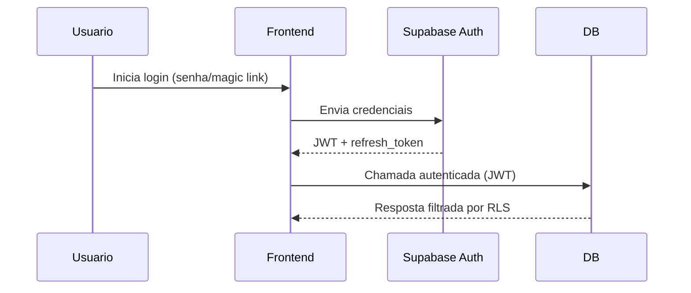

# Autenticacao Supabase

## Objetivo
Descrever como o Supabase Auth gerencia identidades, sessoes e papeis usados pelo RLS.

## Componentes
- Supabase Auth (JWT + refresh token)
- SDK `@supabase/supabase-js` no frontend (persistencia em `localStorage`)
- Tabelas de vinculo: `auth.users`, `public.user_profiles`, `public.user_roles`
- Papeis de negocio: `admin`, `tecnico`, `lider`, `membro` (claims no JWT)

## Fluxos Principais

### Login (senha ou magic link)

### Renovacao de token
- O SDK renova o JWT automaticamente com `refresh_token` antes de expirar.
- Em falha de refresh, usuario e redirecionado para login.

### Logout
- `supabase.auth.signOut()` limpa sessao local e invalida refresh token.

## Provisionamento e papeis
- Apos signup, job de onboarding associa o usuario a `user_profiles` e `user_roles`.
- Claims no JWT incluem `sub` (user id) e `role` (papel de negocio) consumidos pelo RLS.
- Admins podem atualizar papeis via painel (op transformacoes RPC dedicadas).

## Consideracoes de seguranca
- Sempre exigir conexoes HTTPS.
- Tokens armazenados apenas em `localStorage` (sem cookies) para evitar CSRF.
- Usar `auth.onAuthStateChange` para reagir a expiracao e logout.
- Rotas publicas nao devem chamar endpoints protegidos.

## Referencias
- ADR: `adr/ADR-002-autenticacao-supabase.md`
- Diagramas relacionados: `../diagramas/`
