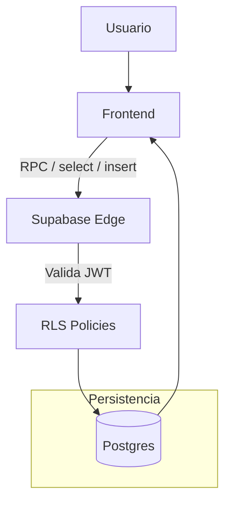

# Fluxo de Dados FE -> Supabase -> DB

## Objetivo
Mapear como dados trafegam entre frontend, Supabase Edge (Auth/PostgREST/Storage) e Postgres sob RLS.

## Camadas
- Frontend: React + `@supabase/supabase-js` (queries, RPC, storage).
- Supabase Edge: Auth, PostgREST, Functions/Edge (se aplicavel).
- Postgres: schemas `public` e `storage`, politicas RLS ativas.

## Fluxo Geral

## Padroes de acesso
- Preferir chamadas RPC para logica de negocio no banco quando houver regras complexas.
- Consultas diretas (select/insert/update) passam pelas mesmas politicas RLS.
- Uploads via Storage seguem politicas e buckets dedicados; guardar apenas URLs assinadas no app.

## Tratamento de erros
- Status 401: token ausente/expirado -> refazer login.
- Status 403: RLS bloqueou -> revisar papel e politica.
- Status 500: erro interno/RPC -> registrar e abrir issue.

## Observabilidade
- Ativar logs de auditoria no Postgres para acoes sensiveis (se disponivel).
- Correlacionar operacoes via `request_id` no frontend ao enviar em cabecalhos personalizados.

## Referencias
- Autenticacao: `02-autenticacao-supabase.MD`
- RLS: `04-rls-e-seguranca.MD`
- Diagramas: `../diagramas/`
