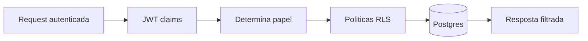

# RLS e Seguranca

## Objetivo
Descrever como o Row Level Security protege o banco de dados e como papeis sao aplicados.

## Principios
- Menor privilegio: politicas restringem linha a linha por igreja e papel.
- Separacao de papeis: `admin` > `tecnico` > `lider` > `membro` (leitura/escrita conforme necessidade).
- JWT como fonte de verdade: claims `sub` e `role` sao lidas nas politicas.

## Fluxo de autorizacao


## Estrutura e politicas
- Tabelas chave usam colunas `igreja_id` e `owner_id` para filtro por escopo.
- Politicas por operacao (select/insert/update/delete) verificam `auth.uid()` e `current_setting('request.jwt.claim.role')`.
- Views e RPC expostas respeitam as mesmas politicas.

## Exemplo de politica (pseudo-SQL)
```sql
create policy select_own_church on public.pessoas
for select
using (
  igreja_id = current_setting('request.jwt.claim.igreja_id', true)::uuid
);
```

## Storage
- Buckets separados por contexto sensivel; URLs assinadas para acesso temporario.
- Upload so e permitido a usuarios autenticados e dentro do bucket permitido ao papel.

## Boas praticas
- Ativar `ALTER TABLE ... ENABLE ROW LEVEL SECURITY` em todas as tabelas expostas.
- Auditar politicas em novas migracoes e vincular ao ADR correspondente.
- Testar politicas com usuarios de cada papel antes de liberar features.

## Referencias
- ADR: `adr/ADR-003-rls-e-modelo-permissoes.md`
- Autenticacao: `02-autenticacao-supabase.MD`
- Fluxo de dados: `03-fluxo-de-dados.MD`
