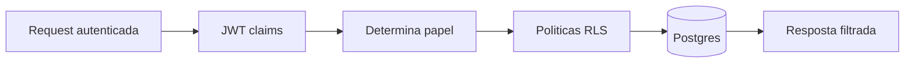

# RLS e Seguranca

## Objetivo
Descrever como o Row Level Security protege o banco de dados e como papeis sao aplicados.

## Principios
- Menor privilegio: politicas restringem linha a linha por igreja e papel.
- Separacao de papeis: `admin` > `tecnico` > `lider` > `membro` (leitura/escrita conforme necessidade).
- JWT como fonte de verdade: claims `sub` e `role` sao lidas nas politicas.

## Fluxo de autorizacao

```mermaid
flowchart LR
    Req[Request autenticada] --> JWT[JWT claims]
    JWT --> Role[Determina papel]
    Role --> RLS[Politicas RLS]
    RLS --> DB[(Postgres)]
    DB --> Resp[Resposta filtrada]
```

## Estrutura e politicas
- Tabelas chave usam colunas `igreja_id` e `owner_id` para filtro por escopo.
- Politicas por operacao (select/insert/update/delete) verificam `auth.uid()` e `current_setting('request.jwt.claim.role')`.
- Views e RPC expostas respeitam as mesmas politicas.

## Exemplo de politica (pseudo-SQL)
```sql
create policy select_own_church on public.pessoas
for select
using (
  igreja_id = current_setting('request.jwt.claim.igreja_id', true)::uuid
);
```

## Storage
- Buckets separados por contexto sensivel; URLs assinadas para acesso temporario.
- Upload so e permitido a usuarios autenticados e dentro do bucket permitido ao papel.

## Boas praticas
- Ativar `ALTER TABLE ... ENABLE ROW LEVEL SECURITY` em todas as tabelas expostas.
- Auditar politicas em novas migracoes e vincular ao ADR correspondente.
- Testar politicas com usuarios de cada papel antes de liberar features.

## GRANT como segunda camada (além de RLS) — módulo financeiro (F7, jul/2026)

RLS controla *quais linhas* um role enxerga/afeta; o `GRANT` de
INSERT/UPDATE/DELETE controla se o role pode sequer tentar a operação na
tabela. O CORE financeiro (`docs/arquitetura-financeiro.md` §7.1) usa RPCs
`SECURITY DEFINER` (`fin_*`) como única porta de escrita em
`transacoes_financeiras`, `transferencias_contas`, `extratos_bancarios` e
tabelas de conciliação — mas até jul/2026 essa regra valia só por convenção de
código: o role `authenticated` ainda tinha o `GRANT` de escrita herdado do
bootstrap padrão do Supabase. Migrations `20260713140000` (5 tabelas de
transferência/conciliação em lote/divisão) e `20260713160000`
(`transacoes_financeiras`/`extratos_bancarios`, depois de migrar os 13
call-sites de escrita direta que ainda restavam no frontend — ver
`docs/arquitetura-financeiro.md` §9.6) fecham essa lacuna: as **7 tabelas do
domínio financeiro** agora têm `REVOKE INSERT, UPDATE, DELETE ... FROM
authenticated, anon`. `SELECT` não foi tocado — RLS continua sendo a camada de
leitura. RPCs `SECURITY DEFINER` não são afetadas (rodam com o privilégio do
dono da função, não do chamador) — validado com harness real via `SET ROLE
authenticated` (não só `postgres` superuser), provando os dois lados: escrita
direta bloqueada e RPCs continuando a funcionar.

### Nova coluna em `extratos_bancarios` não muda o modelo de acesso (jul/2026)

Migration `20260717150000` (detecção de duplicata cross-canal Getnet×
Santander, `docs/arquitetura-financeiro.md` §9.12) adiciona
`extratos_bancarios.possivel_duplicata_de` (FK para outra linha da mesma
tabela) e estende a lógica interna de `fin_ingerir_extratos` — mas não
introduz nenhuma política de RLS nova nem muda o `GRANT` revogado acima: a
coluna é populada exclusivamente dentro da mesma RPC `SECURITY DEFINER` já
coberta pelo tenant/filial scoping existente (`fin_resolver_contexto`). A
decisão de "isso é duplicata" continua exigindo uma ação explícita do
tesoureiro via `fin_marcar_extrato_ignorado` (já auditada) — nenhuma escrita
automática de dados financeiros foi adicionada.

## Funcoes de Seguranca

| Funcao | Escopo | Descricao |
|--------|--------|-----------|
| `has_role(uuid, app_role)` | Global | Verifica papel do usuario |
| `has_role_in_igreja(uuid, app_role, uuid)` | Por Igreja | Verifica papel em igreja especifica |
| `has_filial_access(uuid, uuid)` | Por Filial | Valida acesso a filial via JWT |
| `get_current_user_igreja_id()` | Contexto | Retorna igreja_id do usuario atual |
| `get_jwt_igreja_id()` | JWT | Extrai igreja_id do token |
| `get_jwt_filial_id()` | JWT | Extrai filial_id do token |

## Hierarquia de Papeis (ADR-021)

```
super_admin (global)
  └── admin / admin_igreja (por tenant)
        └── admin_filial (por filial)
              └── pastor / lider / secretario / tecnico / tesoureiro
                    └── membro / basico
```

## Referencias
- ADR: `adr/ADR-003-rls-e-modelo-permissoes.md`
- ADR Multi-Tenant: `adr/ADR-021-multi-tenant-arquitetura.md`
- Controle de Isolamento: `../controle-multi-tenant.md`
- Autenticacao: `02-autenticacao-supabase.MD`
- Fluxo de dados: `03-fluxo-de-dados.MD`

---

## Inventário de Isolamento Multi-Tenant (fundido de controle-multi-tenant.md, snapshot 2026-01-04)

> ⚠️ Snapshot de jan/2026. Verificar contra migrations recentes antes de usar como referência de estado atual.
> Original em `docs/_archive/_fundidos/controle-multi-tenant.md`.

### Tabelas com isolamento completo (`igreja_id` + RLS)

`profiles`, `alteracoes_perfil_pendentes`, `familias`, `sentimentos_membros`, `notifications`, `tags_midias`, `midias`, `midia_tags`, `liturgias`, `categorias_financeiras`, `subcategorias_financeiras`, `formas_pagamento`, `contas`, `transacoes_financeiras`, `bases_ministeriais`, `centros_custo`, `fornecedores`, `onboarding_requests`, `user_roles`

### Tabelas globais (sem `igreja_id` — design intencional)

`app_config`, `app_permissions`, `app_roles`, `role_permissions`, `role_permissions_audit`, `edge_function_config`, `igrejas`, `filiais`

### Funções de segurança SQL

| Função | Escopo |
|---|---|
| `has_role(uuid, app_role)` | Global (compatibilidade) |
| `has_role_in_igreja(uuid, app_role, uuid)` | Por igreja |
| `has_filial_access(uuid, uuid)` | Por filial via JWT |
| `get_current_user_igreja_id()` | JWT → igreja_id |
| `get_jwt_igreja_id()` | JWT → igreja_id (raw) |

### Storage buckets com isolamento

| Bucket | Path isolado |
|---|---|
| `igreja-logo` | `{igreja_id}/logo.png` |
| `midias` | `{igreja_id}/{filial_id}/...` |
| `transaction-attachments` | `{igreja_id}/{transacao_id}/...` |
| `avatars` | `{user_id}/avatar.png` |

### Pendências (jan/2026)

- [ ] Validar edge functions usam `igreja_id` do contexto JWT (a confirmar)
- [ ] Revisar queries frontend que buscam `user_roles`
- [ ] Migrar dados legados sem `igreja_id` (se existirem)
