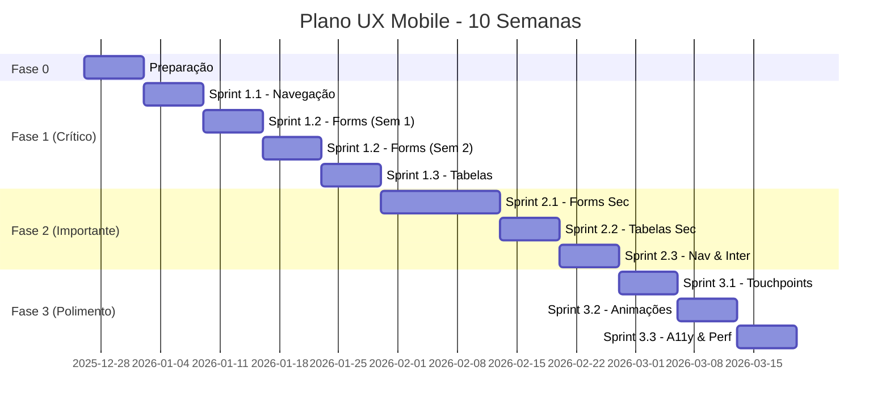

# 📱 PLANO DE AÇÃO: UX MOBILE E RESPONSIVIDADE
## Sistema Igreja Carvalho

**Data da Análise:** 25 de dezembro de 2025  
**Versão:** 1.0  
**Status:** Proposta Inicial  

---

## 📋 SUMÁRIO EXECUTIVO

### Contexto
Sistema possui **94 páginas** e **204 componentes** analisados. Identificamos problemas críticos de UX mobile que impactam a usabilidade em smartphones (iPhone/Android), tablets e diferentes viewports.

### Números da Análise
- ✅ **Componentes com boa implementação:** 4 (22% das tabelas)
- ⚠️ **Componentes com problemas:** 78+ arquivos identificados
- 🔴 **Problemas críticos (P0):** 15 issues
- 🟡 **Problemas altos (P1):** 22 issues
- 🟢 **Melhorias recomendadas (P2):** 18+ issues

### Categorias de Problemas
1. **Formulários** - 13 arquivos críticos
2. **Tabelas e Listagens** - 14 arquivos com problemas
3. **Navegação Mobile** - 10 pontos de falha
4. **Modais e Overlays** - 10 dialogs problemáticos
5. **Touchpoints** - Múltiplos componentes < 44px

---

## 🎯 OBJETIVOS DO PLANO

### Objetivo Geral
Garantir **total compatibilidade** e **excelente experiência de usuário** em:
- 📱 **iPhones** (iOS Safari, viewport 375px-428px)
- 🤖 **Androids** (Chrome Mobile, viewport 360px-412px)
- 📲 **Tablets** (iPad, Android tablets, 768px-1024px)
- 💻 **Desktop/Web** (1280px+)

### Metas Mensuráveis
- [ ] **100% dos formulários** responsivos e usáveis em mobile
- [ ] **Zero scroll horizontal** involuntário em mobile
- [ ] **Todos os botões** com mínimo 44x44px (touch-friendly)
- [ ] **Todas as tabelas** com alternativa mobile (cards/list)
- [ ] **Dialogs grandes** convertidos para Drawer em mobile
- [ ] **Navegação bottom bar** implementada para ações principais
- [ ] **Zero conflitos de z-index** entre overlays

---

## 📊 DIAGNÓSTICO DETALHADO

### 1. FORMULÁRIOS 📝

#### 🚨 Problemas Críticos (P0)

| Arquivo | Problema Principal | Impacto | Linhas |
|---------|-------------------|---------|--------|
| `TransacaoDialog.tsx` | Dialog 370 linhas sem Drawer mobile | Alto | 142 |
| `Membro.tsx` / `Visitante.tsx` | Grid de data 3 colunas sem responsivo | Alto | 255, 370 |
| `AgendamentoDialog.tsx` | Wizard 5 steps sem indicador visual | Alto | 67-70 |
| `NovaJornadaDialog.tsx` | Grid 2 colunas sem `sm:grid-cols-1` | Alto | 120-125 |
| `AdminPermissions.tsx` | Tabela matriz sem scroll adequado mobile | Alto | 685+ |

#### Padrões Problemáticos Encontrados
```tsx
// ❌ RUIM - Grid fixo sem responsivo
<div className="grid grid-cols-3 gap-2">
  <Select>Dia</Select>
  <Select>Mês</Select>
  <Select>Ano</Select>
</div>

// ✅ BOM - Grid responsivo
<div className="grid grid-cols-1 sm:grid-cols-3 gap-2">
  <Select>Dia</Select>
  <Select>Mês</Select>
  <Select>Ano</Select>
</div>
```

```tsx
// ❌ RUIM - Dialog grande sempre centralizado
<Dialog>
  <DialogContent className="max-w-lg max-h-[90vh]">
    {/* 300+ linhas de form */}
  </DialogContent>
</Dialog>

// ✅ BOM - Responsivo Dialog/Drawer
const isMobile = useIsMobile()
{isMobile ? (
  <Drawer>
    <DrawerContent className="max-h-[90vh]">
      {/* form */}
    </DrawerContent>
  </Drawer>
) : (
  <Dialog>
    <DialogContent className="max-w-lg">
      {/* form */}
    </DialogContent>
  </Dialog>
)}
```

#### Problemas Recorrentes
- **Dialog sem Drawer mobile:** 8+ arquivos
- **Grid multi-coluna sem responsivo:** 12+ arquivos  
- **Date pickers problemáticos:** 15+ formulários
- **Width fixo sem breakpoints:** 6+ componentes
- **Botões < 44px touch target:** 20+ formulários
- **Multi-step sem indicador:** 4 wizards
- **Validação só por toast:** 15+ forms
- **Select sem busca em listas longas:** 8+ selects
- **Calendar popover saindo da tela:** 10+ date pickers

---

### 2. TABELAS E LISTAGENS 📊

#### 🚨 Problemas Críticos (P0)

| Arquivo | Problema | Severidade | Solução |
|---------|----------|-----------|---------|
| `Escalas.tsx` | Sem overflow-x-auto, 13+ colunas | 🔴 Alta | Cards mobile + scroll |
| `AdminPermissions.tsx` | Matriz permissões ilegível mobile | 🔴 Alta | Interface simplificada |
| `Financas.tsx` (DRE) | Tabela 13 colunas sem alternativa | 🔴 Alta | Cards colapsáveis |
| `Contas.tsx` | 6 colunas sem scroll horizontal | 🟡 Média | Overflow + cards |

#### ✅ Boas Práticas Encontradas
```tsx
// ✅ Pessoas.tsx - Referência de implementação
<div className="w-full">
  {/* Desktop: Tabela */}
  <div className="hidden md:block overflow-x-auto">
    <Table className="min-w-[600px]">
      {/* conteúdo */}
    </Table>
  </div>
  
  {/* Mobile: Cards */}
  <div className="md:hidden space-y-3">
    {items.map(item => (
      <Card key={item.id}>
        {/* card content */}
      </Card>
    ))}
  </div>
</div>
```

#### Estatísticas
- **78% das tabelas** têm problemas mobile
- **4 tabelas** implementadas corretamente (Pessoas, Cultos, Jornadas, Intercessão)
- **14 tabelas** precisam de scroll ou alternativa
- **Zero indicadores visuais** de scroll horizontal nas tabelas

---

### 3. NAVEGAÇÃO MOBILE 🧭

#### 🚨 Problemas Críticos

##### 1. **Bottom Navigation Bar Ausente** 🔴
- Sistema depende **exclusivamente da sidebar lateral**
- Usuários mobile precisam abrir sidebar para navegação principal
- **Impacto:** Dificulta acesso rápido a funcionalidades principais

**Solução Proposta:**
```tsx
// components/layout/BottomNavBar.tsx
<nav className="fixed bottom-0 left-0 right-0 z-50 md:hidden bg-background border-t">
  <div className="flex justify-around items-center h-16">
    <NavItem icon={Home} label="Início" to="/" />
    <NavItem icon={Users} label="Pessoas" to="/pessoas" />
    <NavItem icon={MessageSquare} label="Oração" to="/intercessao" />
    <NavItem icon={Calendar} label="Agenda" to="/agenda" />
    <NavItem icon={Menu} label="Mais" onClick={openSidebar} />
  </div>
</nav>
```

##### 2. **Tabs Horizontais sem Scroll** 🔴
- **Escalas.tsx:** Grid 5 colunas fixo (linha 367)
- **Cultos.tsx:** Grid 4 colunas sem overflow (linha 295)
- **AdminPermissions.tsx:** Implementado corretamente ✅ (referência na linha 619)

##### 3. **Header Muito Alto em Mobile** 🟡
- `MainLayout.tsx` linha 43: `h-14 md:h-16` = 56px em mobile
- **Problema:** Consome espaço valioso em telas pequenas
- **Recomendação:** `h-12 md:h-16` = 48px mobile

##### 4. **Z-Index Conflicts** 🟡
- Sidebar: `z-50` (linha 38)
- Header: `z-40` (linha 42)
- Dialogs: `z-50` (conflito!)
- **Solução:** Hierarquia definida (50→60→70)

##### 5. **Breadcrumb Oculto em Mobile** 🟢
- `AppBreadcrumb.tsx` linha 59: `hidden md:block`
- Poderia ser útil com truncamento inteligente

---

### 4. MODAIS E OVERLAYS 🔲

#### 🚨 Problemas Críticos (P0)

| Componente | Problema | Impacto | Linha |
|------------|----------|---------|-------|
| `TransacaoDialog` | Dialog gigante sem mobile | 🔴 Alto | 142 |
| `NovaJornadaDialog` | Modais empilhados z-index | 🔴 Alto | 262, 499 |
| `CultoDialog` | Dialog 680 linhas sem scroll | 🔴 Alto | 374 |
| `RegistrarVisitanteDialog` | Drawer sem drag indicator | 🟡 Médio | 217 |

#### Problemas por Categoria
1. **Dialog → Drawer conversão:** 8 componentes
2. **Scroll interno inadequado:** 6 dialogs
3. **Z-index conflicts:** 4 casos
4. **Loading states ausentes:** 7 dialogs
5. **Multi-step sem progresso:** 4 wizards

#### Pattern Recomendado
```tsx
// lib/modal-manager.ts
export const MODAL_Z_INDEX = {
  base: 50,
  nested: 60,
  alert: 70,
  toast: 100,
}

// components/ResponsiveModal.tsx
<DialogContent className="max-w-lg max-h-[85vh] flex flex-col">
  <DialogHeader className="sticky top-0 bg-background z-10">
    {/* header */}
  </DialogHeader>
  
  <ScrollArea className="flex-1 px-6">
    {/* form fields */}
  </ScrollArea>
  
  <DialogFooter className="sticky bottom-0 bg-background border-t px-6 py-4">
    {/* actions sempre visíveis */}
  </DialogFooter>
</DialogContent>
```

---

### 5. TOUCHPOINTS E ESPAÇAMENTO 👆

#### Análise de Acessibilidade Touch

**Padrão Web (WCAG 2.1):**
- Mínimo: 44x44px para alvos touch
- Recomendado: 48x48px

**Encontrado no Sistema:**
- ❌ Botões com `h-6 w-6` (24px) - **Múltiplos arquivos**
- ❌ Ícones com `h-4 w-4` (16px) dentro de botões
- ⚠️ Botões com `h-8` (32px) - Abaixo do ideal
- ✅ Alguns botões com `h-10` (40px) - Próximo do ideal

**Componentes Problemáticos:**
```tsx
// AdminPermissions.tsx linha 702, 712, 767
<Button className="h-6 w-6">  // ❌ 24x24px - muito pequeno!
  <CheckCircle2 className="h-4 w-4" />
</Button>

// Correção recomendada
<Button className="h-11 w-11">  // ✅ 44x44px
  <CheckCircle2 className="h-5 w-5" />
</Button>
```

#### Espaçamento entre Elementos
- **Formulários:** Gaps de 2-4 (8-16px) são adequados
- **Listas:** Space-y-3 (12px) é o mínimo
- **Cards:** Gap-4 (16px) recomendado
- **Grupos de botões:** Gap-2 (8px) mínimo

---

## 🗺️ PLANO DE EXECUÇÃO EM FASES

### 📌 FASE 0: PREPARAÇÃO (1 semana)
**Objetivo:** Criar fundação para melhorias

#### Tarefas
- [ ] Criar hook `useResponsiveModal()` genérico
- [ ] Definir tokens de design mobile (spacing, touch sizes)
- [ ] Criar componente `ResponsiveTable` reutilizável
- [ ] Implementar `BottomNavBar` base (sem rotas)
- [ ] Documentar padrões em Storybook

**Entregas:**
- `hooks/use-responsive-modal.tsx`
- `components/layout/BottomNavBar.tsx`
- `components/responsive/ResponsiveTable.tsx`
- `lib/design-tokens.ts`
- `docs/MOBILE_PATTERNS.md`

---

### 🔴 FASE 1: CRÍTICO - USABILIDADE BÁSICA (2-3 semanas)

**Objetivo:** Tornar sistema **utilizável** em mobile para fluxos principais

#### Sprint 1.1 - Navegação (1 semana)
**Prioridade:** P0

- [ ] **Implementar Bottom Navigation Bar completo**
  - [ ] 5 itens principais: Home, Pessoas, Oração, Agenda, Menu
  - [ ] Indicador de tela ativa
  - [ ] Badge de notificações
  - [ ] Integrar com sidebar existente

- [ ] **Corrigir altura do header mobile**
  - [ ] Reduzir de 56px para 48px
  - [ ] Otimizar logo e espaçamentos

- [ ] **Padronizar z-index**
  - [ ] Atualizar todos modais para escala 50/60/70
  - [ ] Documentar hierarquia em arquivo CSS

**Arquivos Afetados:**
- `src/components/layout/MainLayout.tsx`
- `src/components/layout/BottomNavBar.tsx` (novo)
- `src/index.css` (z-index tokens)

---

#### Sprint 1.2 - Formulários Críticos (2 semanas)
**Prioridade:** P0

##### Semana 1 - Cadastros
- [ ] **Membro.tsx & Visitante.tsx**
  - [ ] Converter grids de data para `grid-cols-1 sm:grid-cols-3`
  - [ ] Adicionar validação inline
  - [ ] Melhorar indicadores de etapas
  - [ ] Testar em iPhone SE (375px) e Android (360px)

- [ ] **TransacaoDialog.tsx**
  - [ ] Converter para `useResponsiveModal`
  - [ ] Drawer em mobile, Dialog em desktop
  - [ ] Scroll interno adequado
  - [ ] Sticky footer com botões

##### Semana 2 - Wizards
- [ ] **AgendamentoDialog.tsx**
  - [ ] Adicionar progress stepper visual
  - [ ] Melhorar navegação entre etapas
  - [ ] Validação por etapa

- [ ] **NovaJornadaDialog.tsx**
  - [ ] Corrigir grids sem responsivo
  - [ ] Resolver modais empilhados (z-index)

**Critérios de Aceite:**
- ✅ Formulários preenchíveis em iPhone SE (375px)
- ✅ Todos os campos visíveis sem zoom
- ✅ Botões com mínimo 44x44px
- ✅ Validação clara e imediata

---

#### Sprint 1.3 - Tabelas Críticas (1 semana)
**Prioridade:** P0

- [ ] **Escalas.tsx**
  - [ ] Criar versão mobile com cards colapsáveis
  - [ ] Toggle Desktop/Mobile view
  - [ ] Indicador de scroll horizontal

- [ ] **AdminPermissions.tsx**
  - [ ] Interface simplificada mobile (já tem scroll, melhorar UX)
  - [ ] Filtros em accordion
  - [ ] Botões maiores

- [ ] **Financas.tsx (DRE)**
  - [ ] Cards por categoria em mobile
  - [ ] Gráfico resumo no topo
  - [ ] Detalhes expandíveis

**Critérios de Aceite:**
- ✅ Zero scroll horizontal involuntário
- ✅ Dados legíveis em 360px
- ✅ Alternativa visual clara para tabelas

---

### 🟡 FASE 2: IMPORTANTE - REFINAMENTO (3-4 semanas)

**Objetivo:** Melhorar **experiência** em todos os fluxos

#### Sprint 2.1 - Formulários Secundários (2 semanas)
**Prioridade:** P1

- [ ] Converter 8 dialogs restantes para responsivo
- [ ] Padronizar date pickers mobile-friendly
- [ ] Adicionar busca em selects longos
- [ ] Implementar loading states

**Arquivos:**
- `CultoDialog.tsx`
- `NovaAulaDrawer.tsx`
- `SalaDialog.tsx`
- `RegistrarVisitanteDialog.tsx`
- `CheckinManualDialog.tsx`
- Outros 3 dialogs

#### Sprint 2.2 - Tabelas Secundárias (1 semana)
**Prioridade:** P1

- [ ] Adicionar overflow + indicador em 8 tabelas
- [ ] Implementar cards alternativos em 4 tabelas
- [ ] Ajustar paginação mobile

**Arquivos:**
- `Comunicados.tsx`
- `Contas.tsx`
- `Fornecedores.tsx`
- `Projetos.tsx`
- Outros

#### Sprint 2.3 - Navegação e Interações (1 semana)
**Prioridade:** P1

- [ ] Corrigir tabs com grid fixo (4 arquivos)
- [ ] Melhorar breadcrumb mobile com truncamento
- [ ] Adicionar smooth scroll em navegação
- [ ] Implementar swipe entre tabs

---

### 🟢 FASE 3: POLIMENTO - EXCELÊNCIA (2-3 semanas)

**Objetivo:** Alcançar **excelência** em UX mobile

#### Sprint 3.1 - Touchpoints (1 semana)
**Prioridade:** P2

- [ ] Aumentar todos botões para mínimo 44x44px
- [ ] Revisar espaçamento entre elementos
- [ ] Adicionar feedback tátil (vibração) em ações críticas
- [ ] Melhorar hit areas de cards e links

#### Sprint 3.2 - Animações e Transições (1 semana)
**Prioridade:** P2

- [ ] Transições suaves entre rotas
- [ ] Animações de loading
- [ ] Micro-interações em botões
- [ ] Skeleton loaders padronizados

#### Sprint 3.3 - Acessibilidade e Performance (1 semana)
**Prioridade:** P2

- [ ] Audit com Lighthouse Mobile
- [ ] Testes com VoiceOver/TalkBack
- [ ] Otimizar imagens para mobile
- [ ] Lazy loading de componentes pesados

---

## 📏 PADRÕES E GUIDELINES

### Design Tokens Mobile

```typescript
// lib/design-tokens.ts
export const MOBILE_TOKENS = {
  // Touchpoints
  touchTarget: {
    minimum: '44px',      // WCAG 2.1 Level AA
    recommended: '48px',  // Ideal
    comfortable: '56px',  // Para ações principais
  },
  
  // Spacing
  spacing: {
    tight: '0.5rem',      // 8px - entre elementos relacionados
    normal: '1rem',       // 16px - padrão
    comfortable: '1.5rem', // 24px - entre seções
  },
  
  // Typography
  fontSize: {
    xs: '0.75rem',   // 12px - labels secundárias
    sm: '0.875rem',  // 14px - texto normal mobile
    base: '1rem',    // 16px - texto principal
    lg: '1.125rem',  // 18px - títulos
  },
  
  // Breakpoints
  breakpoints: {
    mobile: '640px',
    tablet: '768px',
    desktop: '1024px',
  },
}
```

### Checklist de Componente Mobile-Friendly

```markdown
## Checklist: Componente Responsivo

### Layout
- [ ] Grid usa breakpoints (`grid-cols-1 md:grid-cols-2`)
- [ ] Sem width fixo sem breakpoints
- [ ] Padding responsivo (`px-4 md:px-8`)
- [ ] Overflow tratado adequadamente

### Formulários
- [ ] Inputs com `w-full` ou breakpoints
- [ ] Labels não cortadas em mobile
- [ ] Date pickers mobile-friendly
- [ ] Select com busca se > 10 opções
- [ ] Validação inline (não só toast)
- [ ] Multi-step tem indicador visual

### Interação
- [ ] Botões mínimo 44x44px (11 em Tailwind)
- [ ] Espaçamento mínimo 8px entre botões
- [ ] Feedback visual em hover/active
- [ ] Loading states implementados

### Navegação
- [ ] Tabs com scroll horizontal em mobile
- [ ] Breadcrumb truncado ou oculto
- [ ] Modais grandes são Drawer em mobile
- [ ] Z-index correto (50/60/70)

### Tabelas
- [ ] Overflow-x-auto + min-width
- [ ] Alternativa cards/list em mobile
- [ ] Indicador visual de scroll
- [ ] Ações com espaço adequado

### Testes
- [ ] Testado em iPhone (375px)
- [ ] Testado em Android (360px)
- [ ] Testado em tablet (768px)
- [ ] Sem scroll horizontal involuntário
- [ ] Lighthouse Mobile > 90
```

---

## 🧪 ESTRATÉGIA DE TESTES

### Ambientes de Teste

#### Dispositivos Físicos (Prioritário)
- **iPhone 13 Mini** (375x812) - Menor viewport iOS
- **Samsung Galaxy S21** (360x800) - Android comum
- **iPad Air** (820x1180) - Tablet médio
- **iPhone 14 Pro Max** (428x926) - Maior viewport iOS

#### Emuladores (Desenvolvimento)
- Chrome DevTools Device Mode
- Safari Responsive Design Mode
- BrowserStack (cross-browser)

### Matriz de Testes por Fase

| Fase | Viewport | Orientação | Browser | Prioridade |
|------|----------|------------|---------|------------|
| 1 | 375px | Portrait | Safari iOS | P0 |
| 1 | 360px | Portrait | Chrome Android | P0 |
| 2 | 768px | Portrait | Safari iPad | P1 |
| 2 | 768px | Landscape | Chrome Android | P1 |
| 3 | 1024px | Landscape | Safari iPad | P2 |
| 3 | 428px | Portrait | Safari iOS | P2 |

### Casos de Teste Críticos

#### CT-01: Cadastro de Membro (Mobile)
```gherkin
Cenário: Cadastrar novo membro em iPhone SE
  Dado que estou na tela de Cadastro
  E estou usando um iPhone SE (375x667)
  Quando preencho todos os campos obrigatórios
  E seleciono data de nascimento (3 selects)
  E clico em "Salvar"
  Então o cadastro deve ser salvo com sucesso
  E não deve haver campos cortados ou inacessíveis
  E todos os botões devem ter mínimo 44px de altura
```

#### CT-02: Visualizar Escalas (Tablet Landscape)
```gherkin
Cenário: Ver escala de cultos em iPad landscape
  Dado que estou na página de Escalas
  E estou usando iPad em landscape (1024x768)
  Quando visualizo a tabela de escalas
  Então devo ver no mínimo 6 cultos sem scroll horizontal
  E todos os nomes devem estar legíveis
  E posso editar qualquer posição com toque
```

#### CT-03: Navegação Bottom Bar
```gherkin
Cenário: Navegar entre seções usando bottom bar
  Dado que estou em qualquer tela
  E estou usando smartphone (< 768px)
  Quando clico em qualquer item do bottom bar
  Então devo navegar para a seção correta
  E o item ativo deve ter indicação visual clara
  E a transição deve ser suave (< 300ms)
```

---

## 📊 MÉTRICAS DE SUCESSO

### KPIs por Fase

#### Fase 1 (Crítico)
- [ ] **0 scroll horizontal** involuntário em mobile
- [ ] **100%** formulários críticos mobile-friendly
- [ ] **90%+** Lighthouse Mobile Score (Performance)
- [ ] **< 5 seg** Tempo para completar cadastro mobile

#### Fase 2 (Importante)
- [ ] **100%** tabelas com alternativa mobile
- [ ] **95%+** Lighthouse Mobile Score
- [ ] **< 3 cliques** para ações principais via bottom bar
- [ ] **80%+** usuários mobile satisfeitos (survey)

#### Fase 3 (Polimento)
- [ ] **100%** botões com mínimo 44px
- [ ] **100%** WCAG 2.1 AA conformance
- [ ] **98%+** Lighthouse Mobile Score
- [ ] **0** reclamações de UX mobile em 30 dias

### Ferramentas de Medição

```bash
# Lighthouse CI (automatizado)
npm run lighthouse:mobile

# Bundle size mobile
npm run analyze

# Accessibility audit
npm run a11y:mobile

# Visual regression
npm run test:visual:mobile
```

---

## 🚀 CRONOGRAMA CONSOLIDADO



**Duração Total:** 11 semanas (incluindo preparação)  
**Data Início Proposta:** 26/12/2025  
**Data Conclusão Estimada:** 13/03/2026

---

## 👥 RESPONSABILIDADES

### Papéis Sugeridos

#### Tech Lead / Arquiteto
- Aprovar padrões e components base
- Revisar PRs das fases críticas
- Definir estratégia de testes

#### Desenvolvedor Frontend (2-3 pessoas)
- Implementar correções por sprint
- Criar componentes reutilizáveis
- Executar testes em dispositivos

#### Designer UX/UI
- Validar implementações mobile
- Criar protótipos de melhorias
- Conduzir testes com usuários

#### QA / Tester
- Executar matriz de testes
- Reportar bugs de responsividade
- Validar critérios de aceite

---

## 📚 REFERÊNCIAS E RECURSOS

### Documentação
- [WCAG 2.1 Mobile Accessibility](https://www.w3.org/WAI/standards-guidelines/mobile/)
- [Google Mobile-Friendly Test](https://search.google.com/test/mobile-friendly)
- [Apple Human Interface Guidelines - iOS](https://developer.apple.com/design/human-interface-guidelines/ios)
- [Material Design - Touch Targets](https://m3.material.io/foundations/interaction/touch-targets)

### Ferramentas
- [Responsively App](https://responsively.app/) - Multi-device previewer
- [BrowserStack](https://www.browserstack.com/) - Real device testing
- [Lighthouse CI](https://github.com/GoogleChrome/lighthouse-ci)
- [Pa11y](https://pa11y.org/) - Accessibility testing

### Inspiração
- [Referências de bottom navigation](https://m2.material.io/components/bottom-navigation)
- [Mobile form patterns](https://www.smashingmagazine.com/2018/08/best-practices-for-mobile-form-design/)

---

## 🔄 PROCESSO DE ATUALIZAÇÃO

Este documento será atualizado:
- ✅ Ao final de cada sprint (progresso)
- ✅ Quando novos problemas forem identificados
- ✅ Após validações com usuários reais
- ✅ Quando padrões forem estabelecidos

**Última atualização:** 25/12/2025  
**Próxima revisão:** Após Sprint 1.1

---

## ✅ APROVAÇÕES

| Papel | Nome | Data | Assinatura |
|-------|------|------|------------|
| Product Owner | ___________ | ___/___/___ | _________ |
| Tech Lead | ___________ | ___/___/___ | _________ |
| UX Designer | ___________ | ___/___/___ | _________ |

---

**FIM DO DOCUMENTO**

*Para dúvidas ou sugestões, criar issue no repositório com tag `mobile-ux`*
