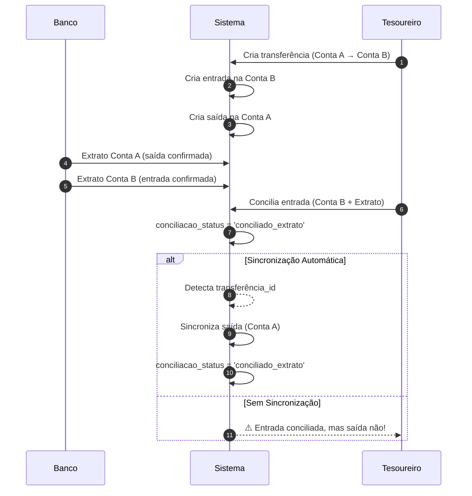

# 📋 Sincronização de Conciliações em Transferências Bancárias

## Visão Geral

Quando uma **transferência bancária** é criada no sistema, são geradas **duas transações**:
- **ENTRADA**: Na conta de destino
- **SAÍDA**: Na conta de origem

Estas duas transações são **independentes** em relação à conciliação bancária, mas devem ser **sincronizadas** para manter consistência:

> Se a **ENTRADA** foi conciliada com o extrato, a **SAÍDA** correspondente deve receber o mesmo status de conciliação.

---

## 🏗️ Arquitetura de Transferências

### Tabelas Envolvidas

```
transferencias_contas
├── id (PK)
├── conta_origem_id (FK → contas)
├── conta_destino_id (FK → contas)
├── transacao_saida_id (FK → transacoes_financeiras, tipo='saida')
├── transacao_entrada_id (FK → transacoes_financeiras, tipo='entrada')
└── valor, data_transferencia, status, etc.

transacoes_financeiras
├── id (PK)
├── transferencia_id (FK → transferencias_contas)
├── tipo ('entrada' | 'saida')
├── conciliacao_status ('conciliado_extrato' | 'conciliado_manual' | 'nao_conciliado' | ...)
├── status ('pago' | 'pendente' | ...)
└── ...
```

### Fluxo Esperado



---

## 🔧 Implementação

### Opção 1: Script SQL (One-time ou Manual)

**Arquivo:** `supabase/scripts/sync-transferencias-conciliacao.sql`

**Uso:**
```sql
-- Executar via Supabase SQL Editor ou pgAdmin:
SELECT * FROM public.sincronizar_transferencias_reconciliacao(100);
```

**Saída:**
```json
{
  "transacao_entrada_id": "uuid-entrada",
  "transacao_saida_id": "uuid-saida",
  "conciliacao_status": "conciliado_extrato",
  "descricao": "Sincronizada SAÍDA ... com ENTRADA ...",
  "sucesso": true
}
```

### Opção 2: RPC via Frontend/Dashboard

**Chamada via Supabase Client:**
```typescript
const { data, error } = await supabase.rpc(
  'sincronizar_transferencias_reconciliacao',
  {
    p_limite: 100  // Processa até 100 por vez
  }
);

if (error) {
  console.error('Erro:', error);
} else {
  console.log(`${data.atualizacoes} transações sincronizadas`);
}
```

**Botão no Dashboard (React):**
```tsx
const handleSincronizar = async () => {
  setCarregando(true);
  try {
    const { data, error } = await supabase.rpc(
      'sincronizar_transferencias_reconciliacao',
      { p_limite: 500 }
    );
    
    if (error) throw error;
    
    toast.success(`${data.atualizacoes} transações sincronizadas!`);
    refetch();
  } catch (error) {
    toast.error(`Erro: ${error.message}`);
  } finally {
    setCarregando(false);
  }
};

return (
  <Button onClick={handleSincronizar} disabled={carregando}>
    {carregando ? 'Sincronizando...' : 'Sincronizar Transferências'}
  </Button>
);
```

### Opção 3: Edge Function + Cron Job (Automático)

**Arquivo:** `supabase/functions/sync-transferencias-conciliacao/index.ts`

**Deploy:**
```bash
supabase functions deploy sync-transferencias-conciliacao --no-verify
```

**Agendar Cron Job (Supabase SQL Editor):**
```sql
-- Executar diariamente às 2 AM (sincroniza automaticamente)
SELECT cron.schedule(
  'sync-transferencias-conciliacao',
  '0 2 * * *',
  'SELECT net.http_post(
    ''https://seu-projeto.supabase.co/functions/v1/sync-transferencias-conciliacao'',
    jsonb_build_object(),
    jsonb_build_object(
      ''Content-Type'', ''application/json'',
      ''Authorization'', ''Bearer seu_anon_key''
    )
  )'
);
```

**Ou via pg_cron simples (RPC direto):**
```sql
SELECT cron.schedule(
  'sync-transferencias-conciliacao',
  '0 2 * * *',
  'SELECT public.sincronizar_transferencias_reconciliacao(1000)'
);
```

---

## 📊 Cenários de Teste

### Cenário 1: Transferência Simples Conciliada

**Setup:**
```sql
-- Verificar se existe uma transferência não sincronizada
SELECT 
  tc.id,
  tce.id as entrada_id,
  tce.conciliacao_status as entrada_status,
  tcs.id as saida_id,
  tcs.conciliacao_status as saida_status
FROM transferencias_contas tc
INNER JOIN transacoes_financeiras tce ON tce.transferencia_id = tc.id AND tce.tipo = 'entrada'
INNER JOIN transacoes_financeiras tcs ON tcs.transferencia_id = tc.id AND tcs.tipo = 'saida'
WHERE tce.conciliacao_status = 'conciliado_extrato'
  AND tcs.conciliacao_status != 'conciliado_extrato';
```

**Executar Sincronização:**
```sql
SELECT public.sincronizar_transferencias_reconciliacao(100);
```

**Validar Resultado:**
```sql
-- Verificar que SAÍDA agora tem o mesmo status
SELECT 
  tcs.id,
  tcs.conciliacao_status,
  tcs.status,
  tcs.data_pagamento
FROM transacoes_financeiras tcs
WHERE tcs.transferencia_id IN (
  SELECT tc.id FROM transferencias_contas tc
  WHERE tc.status = 'executada'
);
```

### Cenário 2: Múltiplas Transferências

```sql
-- Encontrar transferências com discrepâncias
SELECT 
  COUNT(*) as total,
  COUNT(CASE WHEN tce.conciliacao_status != tcs.conciliacao_status THEN 1 END) as dessincronizadas
FROM transferencias_contas tc
INNER JOIN transacoes_financeiras tce ON tce.transferencia_id = tc.id AND tce.tipo = 'entrada'
INNER JOIN transacoes_financeiras tcs ON tcs.transferencia_id = tc.id AND tcs.tipo = 'saida'
WHERE tc.igreja_id = 'seu-id-igreja';
```

---

## ⚙️ Configuração Recomendada

### Para Igrejas Pequenas (< 50 transferências/mês)
- **Opção:** RPC Manual (Opção 2)
- **Frequência:** Quando necessário (via botão no Dashboard)
- **Vantagem:** Controle total, sem custos de cron job

### Para Igrejas Médias (50-500 transferências/mês)
- **Opção:** RPC Manual + Agendamento (Opção 2 + 3)
- **Frequência:** 1x por dia (2 AM) ou 2x por semana
- **Vantagem:** Automático + barato

### Para Igrejas Grandes (> 500 transferências/mês)
- **Opção:** Edge Function + Cron Job (Opção 3)
- **Frequência:** 2-3x por dia
- **Vantagem:** Escalável e automático

---

## 🔍 Troubleshooting

### "Nenhuma transação sincronizada"

Verificar se:
1. Existe uma transferência criada
   ```sql
   SELECT * FROM transferencias_contas LIMIT 5;
   ```

2. A entrada foi conciliada
   ```sql
   SELECT * FROM transacoes_financeiras 
   WHERE transferencia_id IS NOT NULL 
   AND tipo = 'entrada'
   AND conciliacao_status IS NOT NULL;
   ```

3. A função tem acesso aos dados
   ```sql
   SELECT * FROM public.sincronizar_transferencias_reconciliacao(100);
   ```

### "Erro: RLS Policy Rejected"

Verificar:
- O usuário tem role correto (admin, tecnico, etc)
- A função tem `SECURITY DEFINER` (SIM ✓)
- A função executa com permissões elevadas

### "Cron Job não executa"

Verificar:
- pg_cron está habilitado no Supabase
- A URL da função está correta
- O token está válido
- Logs: `SELECT * FROM cron.job;`

---

## 📈 Monitoramento

### Dashboard de Sincronização

```sql
-- Estatísticas de sincronização
SELECT 
  DATE(ac.created_at) as data,
  COUNT(*) as transacoes_sincronizadas,
  COUNT(DISTINCT ac.usuario_id) as usuarios
FROM auditoria_conciliacoes ac
WHERE ac.tipo_reconciliacao = 'sincronizacao_transferencia'
GROUP BY DATE(ac.created_at)
ORDER BY data DESC;
```

### Alertas de Discrepâncias

```sql
-- Transferências sem sincronizar (entrada conciliada, saída não)
SELECT 
  tc.id,
  tce.descricao,
  tce.valor,
  tce.conciliacao_status as entrada_status,
  tcs.conciliacao_status as saida_status,
  CURRENT_DATE - tc.data_transferencia as dias_pendente
FROM transferencias_contas tc
INNER JOIN transacoes_financeiras tce 
  ON tce.transferencia_id = tc.id AND tce.tipo = 'entrada'
INNER JOIN transacoes_financeiras tcs 
  ON tcs.transferencia_id = tc.id AND tcs.tipo = 'saida'
WHERE tce.conciliacao_status IN ('conciliado_extrato', 'conciliado_manual')
  AND tcs.conciliacao_status IS DISTINCT FROM tce.conciliacao_status
ORDER BY tc.data_transferencia DESC;
```

---

## 🚀 Próximos Passos

1. **Deploy do Script SQL**
   - [ ] Executar `sync-transferencias-conciliacao.sql` no Supabase

2. **Teste Manual**
   - [ ] Criar uma transferência
   - [ ] Conciliar a entrada
   - [ ] Executar sincronização
   - [ ] Verificar que saída foi sincronizada

3. **Integração no Dashboard**
   - [ ] Adicionar botão "Sincronizar Transferências"
   - [ ] Mostrar status de sincronização

4. **Automação**
   - [ ] Agendar cron job diário
   - [ ] Monitorar logs de execução
   - [ ] Alertas de falhas

---

**Versão:** 1.0  
**Última Atualização:** 2026-02-15  
**Responsável:** Sistema Financeiro
