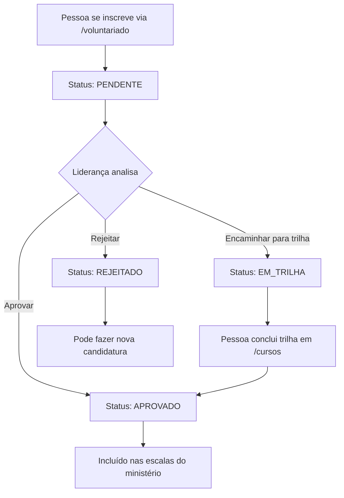

# Módulo de Voluntariado

> Documentação completa do sistema de gestão de candidatos a voluntário.

---

## Visão Geral

O módulo de voluntariado permite que membros e visitantes se candidatem para servir nos ministérios da igreja. O sistema gerencia todo o ciclo de vida de uma candidatura, desde a inscrição até a aprovação, trilha de capacitação e integração nas escalas.

---

## Fluxo Principal



---

## Status de Candidatura

| Status | Descrição | Próxima Ação |
|--------|-----------|--------------|
| `pendente` | Inscrição recebida, aguardando análise | Liderança analisa |
| `em_analise` | Liderança está avaliando o perfil | Aprovar, encaminhar ou rejeitar |
| `aprovado` | Candidato aprovado para servir | Incluir nas escalas |
| `em_trilha` | Encaminhado para trilha de capacitação | Aguardar conclusão |
| `rejeitado` | Não aprovado (pode tentar novamente) | Nova candidatura |

---

## Tabelas do Banco de Dados

### `candidatos_voluntario`

Armazena todas as candidaturas de voluntariado.

| Coluna | Tipo | Descrição |
|--------|------|-----------|
| `id` | uuid | Identificador único |
| `pessoa_id` | uuid | Referência ao perfil (se logado) |
| `nome_contato` | text | Nome do candidato |
| `telefone_contato` | text | WhatsApp para contato |
| `email_contato` | text | E-mail para contato |
| `ministerio` | text | Ministério de interesse |
| `disponibilidade` | text | Horários disponíveis |
| `experiencia` | text | Nível de experiência |
| `observacoes` | text | Observações adicionais |
| `status` | text | Status atual da candidatura |
| `trilha_requerida_id` | uuid | Jornada/trilha vinculada (se em_trilha) |
| `avaliado_por` | uuid | Quem avaliou a candidatura |
| `data_avaliacao` | timestamp | Quando foi avaliada |
| `created_at` | timestamp | Data de criação |
| `updated_at` | timestamp | Última atualização |

### `candidatos_voluntario_historico`

Registra todas as movimentações de candidaturas para auditoria.

| Coluna | Tipo | Descrição |
|--------|------|-----------|
| `id` | uuid | Identificador único |
| `candidato_id` | uuid | Referência à candidatura |
| `acao` | text | Tipo de ação realizada |
| `status_anterior` | text | Status antes da ação |
| `status_novo` | text | Status após a ação |
| `observacoes` | text | Detalhes da ação |
| `realizado_por` | uuid | Quem realizou a ação |
| `created_at` | timestamp | Quando ocorreu |

---

## Regras de Negócio

### Múltiplas Candidaturas

- Uma pessoa pode se candidatar a **múltiplos ministérios diferentes**
- **Não é permitido** ter mais de uma candidatura ativa para o **mesmo ministério**
- Candidaturas com status `rejeitado` liberam o ministério para nova candidatura

### Vinculação de Trilha

Ao encaminhar um candidato para trilha de capacitação:

1. A liderança seleciona a jornada apropriada para o ministério
2. O sistema sugere automaticamente com base no mapeamento:
   - Recepção → "Trilha de Integração"
   - Louvor → "Trilha de Louvor"
   - Mídia → "Trilha de Mídia"
   - Kids → "Trilha Kids"
   - etc.
3. A `trilha_requerida_id` é salva na candidatura
4. O candidato acessa a trilha em `/cursos`

### Histórico Automático

O trigger `trigger_log_candidato_voluntario` registra automaticamente:

- Criação de nova candidatura
- Mudanças de status
- Vinculação de avaliador
- Vinculação de trilha

---

## Telas do Sistema

### Para Candidatos

| Rota | Descrição |
|------|-----------|
| `/voluntariado` | Formulário de inscrição e acompanhamento |

### Para Administradores/Líderes

| Rota | Descrição |
|------|-----------|
| `/voluntariado/candidatos` | Gestão de candidatos (Kanban) |
| `/voluntariado/historico` | Histórico de movimentações |

---

## Componentes Principais

### Frontend

| Componente | Descrição |
|------------|-----------|
| `Voluntariado.tsx` | Página de inscrição do candidato |
| `MinhaInscricaoCard.tsx` | Card de status da candidatura |
| `Candidatos.tsx` | Kanban de gestão de candidatos |
| `Historico.tsx` | Tela de histórico de ações |
| `CandidatosPendentesWidget.tsx` | Widget no dashboard admin |

### Widget do Dashboard

O widget `CandidatosPendentesWidget` aparece no Dashboard Admin quando há candidatos com status `pendente` ou `em_analise`. Ele exibe os 5 mais recentes e permite acesso rápido à gestão.

**Nota:** O link permanente para a gestão de candidatos está disponível no menu lateral em "Ministérios & Operação > Candidatos".

---

## Permissões (RLS)

### `candidatos_voluntario`

- **INSERT**: Qualquer pessoa autenticada pode criar candidatura
- **SELECT**: 
  - Admins/líderes veem todos
  - Usuários veem apenas suas próprias candidaturas
- **UPDATE**: Apenas admins e líderes
- **DELETE**: Não permitido (soft delete via status)

### `candidatos_voluntario_historico`

- **INSERT**: Apenas via trigger (sistema)
- **SELECT**: Admins e líderes
- **UPDATE/DELETE**: Não permitido

---

## Notificações

O trigger `notify_new_candidato_voluntario` envia notificação para admins e líderes quando:

- Uma nova candidatura é criada com status `pendente`

---

## Integrações

### Jornadas/Trilhas

Quando status = `em_trilha`:
- O candidato é automaticamente inscrito na jornada vinculada
- Ao concluir a jornada, o status é atualizado para `aprovado`

### Escalas

Quando status = `aprovado`:
- O candidato fica disponível para ser incluído nas escalas do ministério

---

## Manutenção

### Consultas Úteis

```sql
-- Candidatos pendentes por ministério
SELECT ministerio, COUNT(*) 
FROM candidatos_voluntario 
WHERE status = 'pendente' 
GROUP BY ministerio;

-- Histórico de um candidato específico
SELECT * FROM candidatos_voluntario_historico 
WHERE candidato_id = 'uuid-do-candidato' 
ORDER BY created_at DESC;

-- Candidatos em trilha há mais de 30 dias
SELECT c.*, j.titulo as trilha 
FROM candidatos_voluntario c
LEFT JOIN jornadas j ON j.id = c.trilha_requerida_id
WHERE c.status = 'em_trilha' 
AND c.updated_at < NOW() - INTERVAL '30 days';
```

---

## Changelog

| Data | Alteração |
|------|-----------|
| 2025-01-30 | Adicionado histórico de movimentações |
| 2025-01-30 | Permitido múltiplas candidaturas (uma por ministério) |
| 2025-01-30 | Link permanente no menu lateral |
| 2025-01-30 | Documentação inicial |
