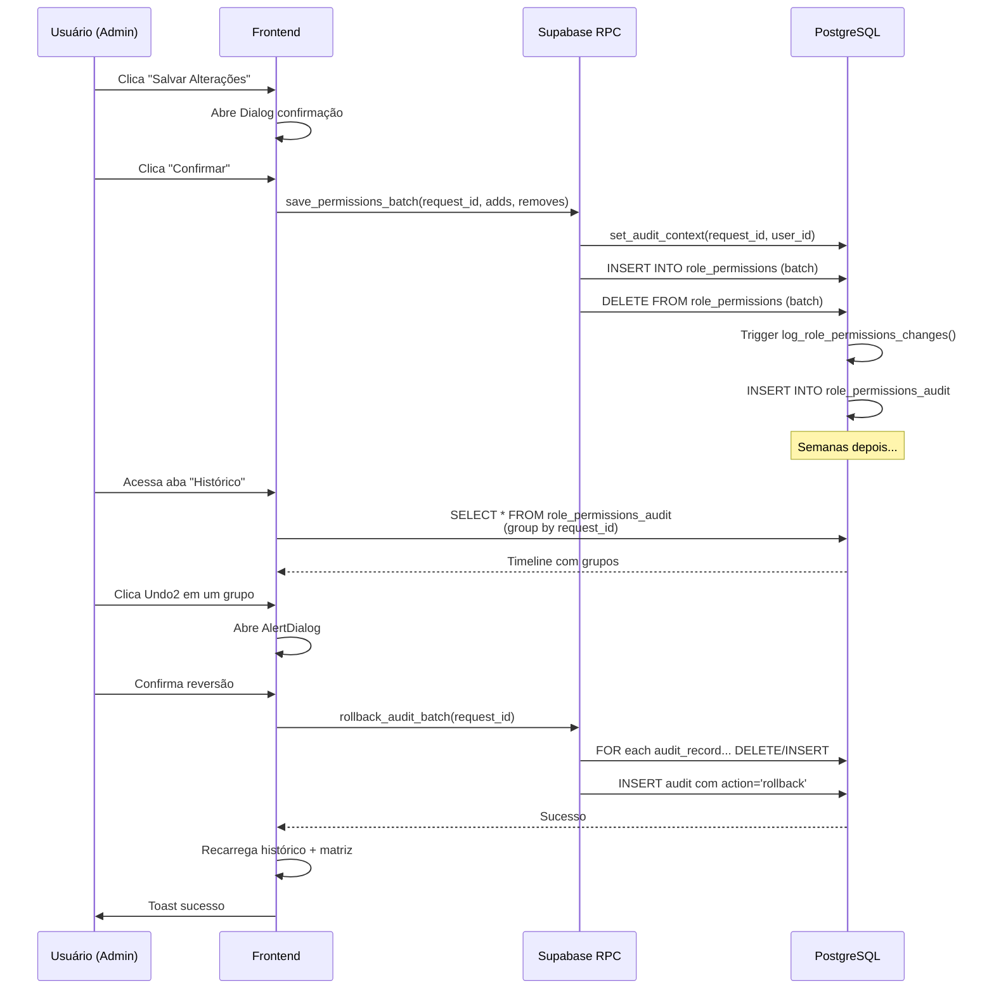

# ADR-016: Auditoria de Permissões com Capacidade de Rollback

**Data:** 27 de Dezembro de 2025  
**Status:** ✅ Implementado  
**Impacto:** Integridade operacional, rastreabilidade, capacidade de reversão de erros  

---

## 1. Problema

Administradores de permissões precisam:
- **Rastreabilidade completa**: Saber quem alterou o quê, quando e por quê
- **Capacidade de reversão**: Desfazer alterações erradas sem perder histórico
- **Segurança**: Evitar alterações acidentais em massas (ex: remover todos de um módulo por engano)
- **Conformidade**: Manter auditoria imutável (não pode deletar registros)

**Antes da solução:** Sem auditoria, erros de permissão causavam downtime até restauração de backup.

---

## 2. Solução Proposta

Implementar sistema de auditoria baseado em:

### A) Tabela de Auditoria (`role_permissions_audit`)
```sql
CREATE TABLE role_permissions_audit (
  id UUID PRIMARY KEY,
  request_id UUID,                    -- Agrupa mudanças da mesma transação
  role_id BIGINT,
  permission_id BIGINT,
  action TEXT,                        -- 'insert', 'update', 'delete', 'rollback'
  old_value JSONB,                    -- Estado anterior
  new_value JSONB,                    -- Estado novo
  actor UUID,                         -- Quem fez (user_id)
  metadata JSONB,                     -- Contexto (IP, sessão, etc)
  created_at TIMESTAMPTZ DEFAULT NOW()
);

CREATE INDEX idx_audit_request_id ON role_permissions_audit(request_id);
CREATE INDEX idx_audit_created_at ON role_permissions_audit(created_at DESC);
```

### B) Trigger de Auditoria
```sql
CREATE OR REPLACE FUNCTION log_role_permissions_changes()
RETURNS TRIGGER AS $$
BEGIN
  INSERT INTO role_permissions_audit (
    id, request_id, role_id, permission_id, action, 
    old_value, new_value, actor, metadata, created_at
  ) VALUES (
    gen_random_uuid(),
    current_setting('app.request_id')::uuid,
    CASE WHEN TG_OP = 'DELETE' THEN OLD.role_id ELSE NEW.role_id END,
    CASE WHEN TG_OP = 'DELETE' THEN OLD.permission_id ELSE NEW.permission_id END,
    TG_OP,
    CASE WHEN TG_OP = 'DELETE' THEN row_to_json(OLD) ELSE NULL END,
    CASE WHEN TG_OP = 'INSERT' THEN row_to_json(NEW) ELSE NULL END,
    current_setting('app.actor_id')::uuid,
    current_setting('app.metadata')::jsonb,
    NOW()
  );
  RETURN CASE WHEN TG_OP = 'DELETE' THEN OLD ELSE NEW END;
END;
$$ LANGUAGE plpgsql SECURITY DEFINER;
```

### C) RPC para Contexto de Auditoria
```sql
CREATE OR REPLACE FUNCTION set_audit_context(
  request_id UUID,
  actor_id TEXT,
  metadata JSONB DEFAULT '{}'::JSONB
) RETURNS void AS $$
BEGIN
  PERFORM set_config('app.request_id', request_id::text, false);
  PERFORM set_config('app.actor_id', actor_id, false);
  PERFORM set_config('app.metadata', metadata::text, false);
END;
$$ LANGUAGE plpgsql;
```

### D) RPC para Batch Update com Auditoria
```sql
CREATE OR REPLACE FUNCTION save_permissions_batch(
  p_request_id UUID,
  p_to_add JSONB[],    -- [{role_id, permission_id}, ...]
  p_to_remove JSONB[]  -- [{role_id, permission_id}, ...]
) RETURNS void AS $$
BEGIN
  -- Deletes
  INSERT INTO role_permissions (role_id, permission_id, created_at)
  SELECT (elem->>'role_id')::bigint, (elem->>'permission_id')::bigint, NOW()
  FROM unnest(p_to_add) AS elem;
  
  DELETE FROM role_permissions
  WHERE (role_id, permission_id) IN (
    SELECT (elem->>'role_id')::bigint, (elem->>'permission_id')::bigint
    FROM unnest(p_to_remove) AS elem
  );
END;
$$ LANGUAGE plpgsql SECURITY DEFINER;
```

### E) RPC para Rollback de Transação
```sql
CREATE OR REPLACE FUNCTION rollback_audit_batch(p_request_id UUID)
RETURNS void AS $$
DECLARE
  audit_record RECORD;
BEGIN
  FOR audit_record IN
    SELECT * FROM role_permissions_audit
    WHERE request_id = p_request_id
    ORDER BY created_at DESC
  LOOP
    -- Se foi insert, delete
    IF audit_record.action = 'insert' THEN
      DELETE FROM role_permissions
      WHERE role_id = audit_record.role_id
        AND permission_id = audit_record.permission_id;
    END IF;
    
    -- Se foi delete, re-insert
    IF audit_record.action = 'delete' THEN
      INSERT INTO role_permissions (role_id, permission_id, created_at)
      VALUES (audit_record.role_id, audit_record.permission_id, NOW())
      ON CONFLICT DO NOTHING;
    END IF;
  END LOOP;
  
  -- Registra o rollback na auditoria
  INSERT INTO role_permissions_audit (
    id, request_id, role_id, permission_id, action, actor, metadata, created_at
  ) SELECT
    gen_random_uuid(),
    p_request_id,
    role_id,
    permission_id,
    'rollback',
    current_setting('app.actor_id')::uuid,
    jsonb_build_object('rollback_at', NOW()),
    NOW()
  FROM role_permissions_audit
  WHERE request_id = p_request_id AND action != 'rollback';
END;
$$ LANGUAGE plpgsql SECURITY DEFINER;
```

### F) Componente React para Visualização
```tsx
// PermissionsHistoryTab.tsx
- Agrupa audits por request_id
- Exibe timeline com collapses
- Botão Undo2 → AlertDialog → RPC rollback
- Callback para recarregar matriz
```

---

## 3. Decisões Arquiteturais

| Aspecto | Decisão | Razão |
|--------|---------|-------|
| **Agrupamento** | Por `request_id` (transação) | Permite reverter lotes inteiros atomicamente |
| **Retenção** | Imutável (nunca deleta) | Conformidade e rastreabilidade permanente |
| **Rollback** | Cria novo registro | Não apaga histórico, mostra quem desfez quando |
| **RLS** | Admin-only em `role_permissions_audit` | Apenas admins veem auditoria completa |
| **Trigger** | Automático no banco | Nenhuma mudança escapa da auditoria |
| **Frontend** | Componente separado (PermissionsHistoryTab) | Responsabilidade única, reutilizável |

---

## 4. Fluxo de Execução



---

## 5. Alternativas Rejeitadas

| Alternativa | Por quê não? |
|-------------|------------|
| **Soft delete em role_permissions** | Complicaria queries, RLS, e performance |
| **Event sourcing completo** | Overhead de implementação, complexidade excessiva |
| **Log em arquivo** | Difícil de consultar, não integrável com RLS |
| **Backup + restore manual** | Erro-prone, perda de mudanças posteriores |
| **Versioning de permissões** | Replicação de estado, inconsistência eventual |

---

## 6. Impacto

### ✅ Benefícios
- **Reversibilidade**: Desfazer erros em minutos, não horas
- **Rastreabilidade**: Auditoria imutável para conformidade
- **Segurança**: Confirmação visual antes de reverter
- **Operacional**: Reduz downtime e necessidade de backup/restore

### ⚠️ Trade-offs
- **Espaço**: Tabela `role_permissions_audit` cresce indefinidamente
  - Solução: Policy de retenção (ex: 2 anos mínimo, depois archive)
- **Performance**: Trigger adicional a cada INSERT/DELETE em role_permissions
  - Esperado: <10ms overhead, negligível
- **Complexity**: RPC adicional e fluxo backend/frontend

### 📊 Métricas de Sucesso
- [ ] Rollback < 5 segundos end-to-end
- [ ] Histórico exibe 500+ registros sem lag (<2s)
- [ ] 0 falsos positivos em agrupamento por request_id
- [ ] 100% rastreabilidade: nenhuma mudança sem audit

---

## 7. Próximos Passos

1. **Retenção de auditoria**: Implementar policy de cleanup após 24 meses
2. **Export auditoria**: Botão para exportar histórico como CSV/PDF
3. **Notificações**: Alert para admins quando suas alterações forem revertidas
4. **Integração com auditoria geral**: Unificar com `audit_log` global (se existir)
5. **Permissões granulares**: Apenas quem fez pode reverter (opcionalmente)

---

## 8. Referências

- [ADR-003: RLS e Modelo de Permissões](ADR-003-rls-e-modelo-permissoes.md)
- [ADR-015: ResponsiveDialog Pattern](ADR-015-responsive-dialog-pattern.md)
- [CHANGELOG: Gestão de Permissões — Rollback](../CHANGELOG.md#gestão-de-permissões--rollback-de-transações-27-de-dez2025)

---

**Aprovado por:** Sistema de Documentação Automática  
**Última atualização:** 27 de Dezembro de 2025
