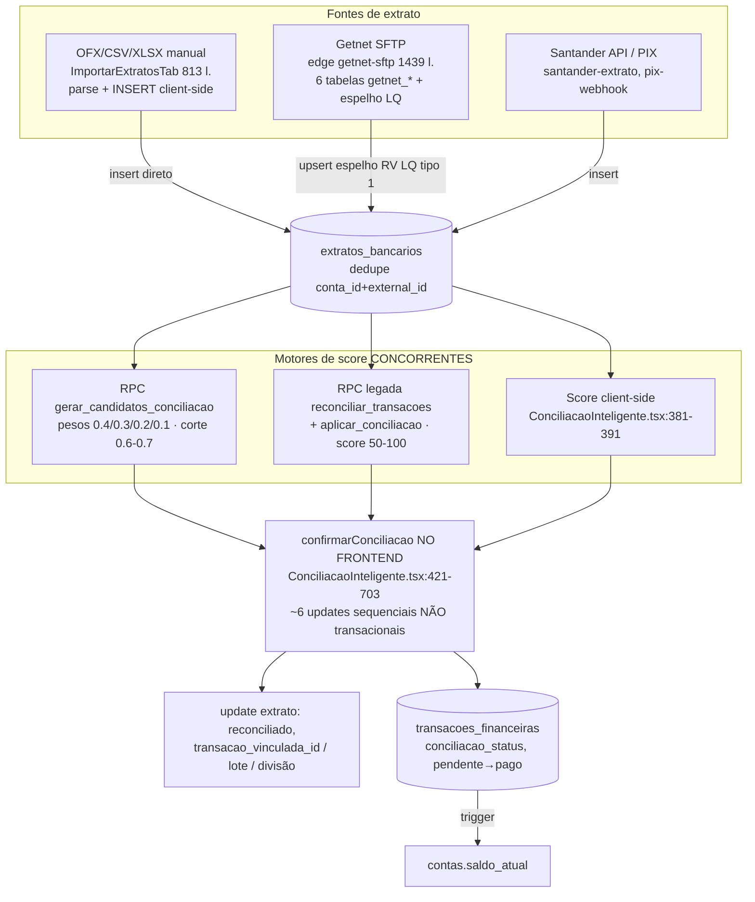
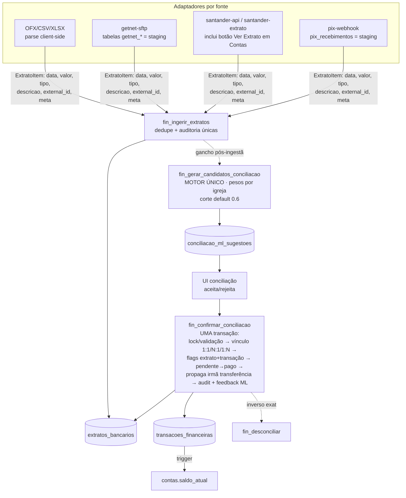

# Arquitetura do Domínio Financeiro — Diagnóstico, CORE + Módulos e Conciliação

> Mapeamento completo do estado atual (jul/2026) e proposta de modularização.
> Complementa ADR-021 (multi-tenant), ADR-022 (importação de extratos),
> ADR-025 (baixa automática), ADR-027 (valor bruto vs líquido) e ADR-028
> (sincronização bancária por eventos). As duas decisões estruturantes daqui
> devem ser formalizadas como **ADR-029 (camada canônica de lançamentos no
> banco)** e **ADR-030 (conciliação transacional e motor único de score)**.

---

## 1. Diagnóstico resumido

| # | Problema | Sintoma | Custo |
|---|----------|---------|-------|
| 1 | Regras de lançamento vivem no frontend | `TransacaoDialog.tsx` (1788 l.) monta payload e faz insert/update direto; `Entradas.tsx`/`Saidas.tsx` duplicam ~60-70% de código | Toda regra nova é escrita 2-3×; divergência silenciosa |
| 2 | Bot duplica as regras | `chatbot-financeiro/index.ts` (2538 l.) insere direto em `transacoes_financeiras` com service role | ADR-027, validações e defaults reimplementados; drift provável |
| 3 | Conciliação fragmentada | 3 motores de score, 3 modelos de vínculo, confirmação multi-tabela **não transacional no frontend** | Risco de estado inconsistente; impossível reusar pelo bot/API |
| 4 | Ofertas é um canal de escrita paralelo | `RelatorioOferta.tsx` (**2627 l., o maior arquivo do financeiro**) monta payload de transação à mão em 3 pontos, sem reusar TransacaoDialog | Terceira cópia das regras; inconsistências de status já no código |
| 5 | Consultas agregam no cliente sem limite | Dashboard, Insights, Projeções, Contas e Ofertas leem linhas cruas e agregam no navegador, sem `.limit()` | **Truncamento silencioso** no teto de 1000 linhas do PostgREST em períodos grandes |
| 6 | UX mobile desigual | Lançamentos OK; conciliação inutilizável no celular | Fluxo central do tesoureiro preso ao desktop |

**Causa raiz comum (1-4): não existe porta de entrada única de escrita no
domínio financeiro.** Quatro canais (TransacaoDialog, bot, RelatorioOferta e
importações/integrações) escrevem direto nas tabelas, cada um com sua cópia
das regras.

---

## 2. Estado atual — Bloco de Transações

### 2.1 Tamanho e complexidade

| Arquivo | Linhas | Papel |
|---|---|---|
| `src/components/financas/TransacaoDialog.tsx` | **1788** | Form criar/editar — maior artefato do bloco |
| `src/pages/financas/Reembolsos.tsx` | 1532 | Reembolsos (gera transações) |
| `src/pages/financas/Saidas.tsx` | **1324** | Contas a pagar |
| `src/pages/financas/Entradas.tsx` | **1183** | Recebimentos |
| `src/components/financas/ExportarTab.tsx` | 635 | Exportação |
| `src/components/financas/TransacaoActionsMenu.tsx` | 594 | Ações por linha (mutações diretas) |
| `src/pages/financas/Transferencias.tsx` | 368 | Par de transações entre contas |
| Calendários/dialogs espelhados Entradas×Saídas | ~150 cada | Duplicados |

### 2.2 Responsabilidades misturadas

- **`Entradas.tsx` / `Saidas.tsx`**: cada página concentra ~15 estados de
  UI/filtro, 4 `useQuery` inline direto no supabase (filtro multi-tenant
  repetido em cada query), regra de período, agrupamento por data, helpers de
  status/moeda, exportação e JSX de ~800 linhas. Saídas adiciona
  transferências, `entradaVinculada` e query extra de `extratos_bancarios`.
- **`TransacaoDialog.tsx`**: fetch de 7 tabelas de apoio (contas, categorias,
  subcategorias, centros_custo, bases_ministeriais, fornecedores,
  formas_pagamento), OCR de nota fiscal (`processar-nota-fiscal`), criação
  inline de fornecedor (~l.791-838), regras de valor líquido ADR-027
  (~l.932-953), montagem de payload (~l.955-1000), insert/update direto
  (~l.1002-1016) e efeito `disparar-alerta` (~l.1019-1030).
- **`TransacaoActionsMenu.tsx`**: mudança de status, delete, conferido
  manual, consultas a `extratos_bancarios`/`conciliacoes_lote` — tudo
  mutação direta no cliente.

### 2.3 Duplicação Entradas ↔ Saídas

~60-70% do código é espelhado 1:1 (estado de filtros, fetch, período,
agrupamento, exportação, helpers). A variação real está em
`.eq("tipo", ...)`, rótulos e nas features extras de Saídas. Pares de
calendário (`EntradasCalendario`/`SaidasCalendario` etc.) idem.

### 2.4 Abstrações existentes reutilizáveis

- `src/hooks/useTransacoesFiltro.ts` (73 l.) — único ponto realmente
  compartilhado (`Transacao`, `FiltrosTransacao`, `ConciliacaoMap`).
- `src/hooks/usePagination.ts`, `src/hooks/useFilialPaginatedQuery.ts`
  (subutilizado — as páginas fazem query manual).
- Contexto multi-tenant: `useFilialId`, `useIgrejaId`, `isAllFiliais`.
- `src/lib/exportUtils.ts`, `src/utils/dateUtils`.

### 2.5 Modelo de dados

Tabela central **`transacoes_financeiras`** (migration base
`20251129191330_*.sql`):

- `tipo` entrada/saida · `tipo_lancamento` unico/recorrente/parcelado ·
  `status` pendente/pago/cancelado (TEXT + CHECK, sem enums nativos).
- Datas: vencimento, pagamento, competência.
- FKs: `contas`, `categorias_financeiras`, `subcategorias_financeiras`,
  `centros_custo`, `bases_ministeriais`, `fornecedores`.
- Adicionadas depois: `igreja_id`/`filial_id` (multi-tenant), colunas
  ADR-027 (`valor_liquido`, `juros`, `multas`, `desconto`,
  `taxas_administrativas`), `conciliacao_status`, `conferido_manual`,
  `evento_id`, `solicitacao_reembolso_id`, `cob_pix_id`, `pessoa_id`,
  `origem` (manual/api).
- Trigger AFTER UPDATE de status recalcula `contas.saldo_atual` quando muda
  de/para `pago`. RLS: admin OR tesoureiro.

### 2.6 Padrão de mutação (o problema central)

- CRUD de transação = insert/update/delete **direto no cliente**, sem camada
  de serviço.
- Conciliação/reembolso/saldo = RPCs Postgres (`aplicar_conciliacao`,
  `reconciliar_transacoes`, `gerar_candidatos_conciliacao`,
  `desconciliar_transacao`...).
- Integrações/efeitos = edge functions (`processar-nota-fiscal`,
  `disparar-alerta`, `finance-sync`, `getnet-sftp`, `chatbot-financeiro`,
  `pix-webhook`, `santander-*`).
- **Bug latente**: lançamento parcelado/recorrente insere **apenas a
  parcela 1** com metadados (`total_parcelas`, `recorrencia`) — não existe
  função nem job que materialize as ocorrências futuras.

---

## 3. Estado atual — Conciliação (Extrato bancário + Getnet)

### 3.1 Modelo de dados

- **`extratos_bancarios`** (migration `20260109150000`): lado banco.
  `conta_id`→`contas`, `data_transacao`, `valor`, `tipo` credito/debito,
  `reconciliado`, `external_id` + `origem` (`manual`, `api_santander`,
  `arquivo_ofx`, `arquivo_csv`, `getnet_sftp`, `getnet_sftp_txt`),
  `transacao_vinculada_id` (FK **lógica**, sem constraint física).
  Dedupe: índice único `(conta_id, external_id)`.
- **Vínculo extrato↔transação tem 3 mecanismos** (não há tabela única):
  1. **1:1** — `extratos_bancarios.transacao_vinculada_id` + `reconciliado=true`
  2. **N:1** — `conciliacoes_lote` + `conciliacoes_lote_extratos`
  3. **1:N** — `conciliacoes_divisao` + `conciliacoes_divisao_transacoes`
- Suporte: `reconciliacao_audit_logs`, `conciliacao_ml_sugestoes` +
  `conciliacao_ml_feedback` (tipo_match 1:1/1:N/N:1, score),
  `pix_recebimentos`.
- **Conta bancária = tabela `contas`** (`tipo='bancaria'`), `saldo_atual`
  mantido por trigger sensível apenas a mudanças de/para status `pago`.
  Extrato importado **não** afeta saldo. `conferido_manual` é ortogonal
  (conferência de dinheiro em espécie).
- **6 tabelas Getnet** (`getnet_resumo` RV PF/LQ, `getnet_analitico` CV/NSU,
  `getnet_ajustes`, `getnet_financeiro_resumo` tipo 5,
  `getnet_financeiro_detalhe` tipo 6, `getnet_arquivos`) — junções por
  `chave_ur` e `rv`.

### 3.2 Fluxo atual (como está)



### 3.3 Pontos de atenção

1. **Espelhamento Getnet parte do tipo 1 (RV LQ = previsto)**, não do tipo 5
   (`getnet_financeiro_resumo` = dinheiro que efetivamente movimentou).
2. **Três regras de score** com pesos e limiares distintos.
3. **Confirmação multi-tabela roda no frontend** — falha no meio dos ~6
   updates deixa estado inconsistente (extrato conciliado sem transação paga,
   lote órfão).
4. `transacao_vinculada_id` sem FK física.

### 3.4 UI de conciliação (tamanhos)

`ConciliacaoInteligente.tsx` **1239 l.**, `ConciliacaoManual.tsx` **1018 l.**,
`HistoricoExtratos.tsx` 878, `ImportarExtratosTab.tsx` 813,
`DashboardConciliacao.tsx` 795, `ExtratoPreviewDialog.tsx` 635,
`DividirExtratoDialog.tsx` 471, `ConciliacaoLoteDialog.tsx` 378 — container
`Reconciliacao.tsx` (63 l., 5 abas).

---

## 4. Estado atual — Bot e Integrações

### 4.1 O bot financeiro já existe — e é o segundo maior monólito

- **`supabase/functions/chatbot-financeiro/index.ts` (2538 l.,
  `verify_jwt=false`)** — lançamento via WhatsApp (Make). Máquina de estados
  em `atendimentos_bot.meta_dados` (fluxos DESPESAS, CONTA_UNICA, REEMBOLSO,
  TRANSFERENCIA). Baixa anexo do WhatsApp (Graph API), salva em Storage
  `transaction-attachments`, chama OCR, confirma com o usuário e **insere
  direto** em `transacoes_financeiras` (~l.1612, 2399, 2422) e
  `transferencias_contas` (~l.2372) com service role.
- Autorização por pessoa: `profiles.autorizado_bot_financeiro` + flags
  `autorizado_lancar_despesas`/`_depositos`/`_reembolsos` — validadas dentro
  do Deno, longe das demais regras.
- Roteamento Make: `consultar-sessao-bot` resolve `igreja_id`/`filial_id`
  via `whatsapp_numeros` e decide triagem × financeiro.
- **Segurança**: chatbot-financeiro NÃO usa `x-webhook-secret` (as demais
  edges de webhook Make usam shared secret timing-safe). Ponto a corrigir.

### 4.2 Ecossistema (58 edge functions)

- Financeiro/bancário: `getnet-sftp`, `pix-webhook` (ADR-024),
  `santander-api`/`santander-extrato`, `buscar-pix-recebidos`/
  `buscar-pix-cron`/`criar-cobranca-pix`, `finance-sync` (esqueleto),
  `sync-transferencias-conciliacao`, `reclass-transacoes`/`undo-reclass`/
  `undo-import`, `processar-nota-fiscal`, `integracoes-config` (secrets
  criptografados tweetnacl).
- 3 padrões de segurança coexistem: `x-webhook-secret` timing-safe; secrets
  por igreja (tabela `webhooks` + `_shared/webhook-resolver.ts`, fallback
  filial→igreja→sistema); `_shared/internal-auth.ts`.
- Docs de referência: `docs/automacoes/catalogo-automacoes.md`,
  `docs/automacoes/FLUXO_MAKE_COM_CONSULTAR_SESSAO.md`, ADR-024/025/026,
  `docs/BACKLOG_MULTI_TENANCY.md`.

---

## 5. Estado atual — Demais entrypoints e consultas

### 5.1 Relatório de Ofertas / Sessão de contagem (o 4º canal de escrita)

- **`src/pages/financas/RelatorioOferta.tsx` (2627 l.) é o maior arquivo do
  financeiro.** Wizard de 4 passos: data do culto, período, conferentes,
  linhas físicas + digitais, sincronização de PIX de `pix_webhook_temp`,
  rascunho em `sessoes_itens_draft`, conferência cega (blind count) e
  aprovação via `notifications`.
- **Modelo**: `sessoes_contagem` (status CHECK: aberto / aguardando_conferencia
  / divergente / validado / cancelado / reaberto; snapshot dos parâmetros de
  conferência cega; `conferentes` JSONB; `evento_id`) + `contagens` (1 linha
  por conferente) + `sessoes_itens_draft` + coluna
  `transacoes_financeiras.sessao_id`.
- **RPCs existentes**: `open_sessao_contagem` — **duas versões divergentes**
  (uma lê `financeiro_config`, outra `configuracoes_financeiro`; dedup
  diferente) — e `confrontar_contagens` (conferência cega com tolerância).
- **Contagem vira transação por INSERT direto montado no cliente em 3
  pontos** (`RelatorioOferta.tsx:1074` no fluxo de aprovação — sem
  `sessao_id`; `:2337` no "Encerrar e Lançar" — com `sessao_id`; payload
  duplicado entre físico/digital/aprovação). O `TransacaoDialog` **não** é
  reutilizado. Conta destino vem do mapeamento `forma_pagamento_contas`;
  status vem de `forma.gera_pago`.
- **Inconsistências**: `finalizarSessao` grava `status='finalizado'` +
  `data_fechamento`, ambos **fora do CHECK/DDL** da tabela; o StatusBadge da
  UI exibe estados que não existem no banco (em_contagem, fechada,
  rejeitada).
- `SessaoLancamentos.tsx` (226 l.) é leitura: lista as transações da sessão e
  cruza com `extratos_bancarios` para marcar Conciliado × Conferido
  (`conferido_manual` para dinheiro).

### 5.2 Conta corrente (`Contas.tsx` 1330 l.)

- Botão **"Ver Extrato"** (`Contas.tsx:890-921`) abre `ExtratoPreviewDialog`,
  que **consulta o extrato online no banco** via edge `santander-api`
  (`ExtratoPreviewDialog.tsx:100,146`) e **importa para `extratos_bancarios`**
  (`:257-299`) — ou seja, Contas é o 4º ponto de ingestão de extrato (API
  online), além de GerenciarDados (OFX/CSV), Getnet SFTP e PIX webhook.
  Há também teste de conexão (`test-santander`) e busca de saldo online.
- Movimentações do período: 2 queries diretas em `transacoes_financeiras`
  (`Contas.tsx:224-263`, `:266-292`), totais agregados **client-side** sem
  limite de linhas.
- **`AjusteSaldoDialog` sobrescreve `contas.saldo_atual` direto**
  (`AjusteSaldoDialog.tsx:52-58`) — não cria transação de ajuste; o ajuste
  manual fica sem trilha de auditoria.
- Importação de arquivo (OFX/CSV/XLSX) fica em `GerenciarDados.tsx` (aba
  extratos → `ImportarExtratosTab`); histórico em `Reconciliacao.tsx`.

### 5.3 Consultas e dashboards — comportamentos e melhorias

| Dashboard | Linhas | Fonte de dados | Comportamento |
|---|---|---|---|
| `pages/Dashboard.tsx` | 841 | queries diretas + `view_solicitacoes_reembolso` | Mês atual vs anterior, pendências, sessões; agregação client-side, sem limite |
| `pages/DashboardOfertas.tsx` | 606 | query direta | **Filtra ofertas por `.ilike("descricao","%oferta%")`** — heurística de texto frágil (não usa categoria nem `sessao_id`); joins manuais com formas/contas |
| `pages/DRE.tsx` | 505 | **RPC `get_dre_anual`** | Único com agregação no servidor — o padrão a seguir |
| `pages/Insights.tsx` | 633 | query direta | Top fornecedores/categorias/mensal via Map client-side, sem limite |
| `pages/Projecao.tsx` | 401 | 2 queries diretas | Projeção 100% client-side |
| `components/DashboardConciliacao.tsx` | 795 | **RPCs legadas** `reconciliar_transacoes` + `aplicar_conciliacao` | É o acionador do motor de score LEGADO — remoção depende da F4 |
| `components/RelatorioCobertura.tsx` | 585 | tabelas cruas (`contas`, `extratos_bancarios`, `reconciliacao_audit_logs`) | Não usa a `view_reconciliacao_cobertura` que já existe |

**DRE em detalhe**: `get_dre_anual(p_ano)` (SECURITY DEFINER, tenant via JWT)
soma `transacoes_financeiras` JOIN categorias por seção/mês, **apenas
`status='pago'`**, excluindo reembolsos não pagos. Melhorias: parametrizar o
regime (caixa vs competência — hoje mistura: filtra por pago, mas
`data_competencia` e o ADR-001 apontam para competência); recorte por filial;
visão mobile em cards (hoje só `overflow-x-auto`).

**Projeções em detalhe**: histórico por `data_pagamento` + futuras por
`data_vencimento`, cálculo no cliente, sem limite. Melhoria estrutural:
como as parcelas/recorrências futuras **não existem no banco** (bug da
parcela única, seção 2.6), a projeção **subestima compromissos futuros** —
corrigir a materialização (D6) é pré-requisito de qualquer projeção séria.

**Melhorias transversais de consulta:**
1. Padronizar leitura agregada no servidor seguindo o modelo do DRE:
   RPCs/views `fin_resumo_periodo`, `fin_ofertas_periodo` etc. — elimina o
   truncamento silencioso de 1000 linhas e o tráfego de linhas cruas.
2. DashboardOfertas: trocar `ilike '%oferta%'` por filtro estrutural
   (categoria ou `sessao_id IS NOT NULL`).
3. DashboardConciliacao: migrar para o motor único (F4).
4. RelatorioCobertura: consumir `view_reconciliacao_cobertura`.
5. Skeletons e estados vazios consistentes em todos os dashboards.

### 5.4 Reembolsos

- **ADR-001 (fato gerador)**: `itens_reembolso` = competência (alimenta o
  DRE); `transacoes_financeiras` = caixa, criada **só no pagamento**
  (`Reembolsos.tsx:452-476` — insert direto de UMA transação
  `tipo=saida, status=pago` + update da solicitação para `pago`).
- Workflow no schema: `rascunho → pendente → aprovado → pago` (+ rejeitado).
  **A UI não tem ação de aprovar/rejeitar — o fluxo real é
  `pendente → pago`** (o estado `aprovado` existe mas nunca é exercido).
- **Divergência de permissão**: o trigger `validar_status_reembolso` exige
  role `admin` para aprovar/pagar/rejeitar, mas a UI libera o botão para
  `tesoureiro` — possível bloqueio em runtime.
- **Divergência entre canais**: o bot (fluxo REEMBOLSO,
  `chatbot-financeiro:1847-1985`) grava nas mesmas tabelas mas cria como
  `rascunho` → insere itens → promove a `pendente`, popula sugestões da IA e
  **dispara a notificação `financeiro_reembolso_aprovacao` — que a UI não
  dispara**.
- Trigger `atualizar_valor_total_reembolso` soma itens (4 migrations de
  retrabalho até estabilizar no ADR-001).

### 5.5 Reclassificação — o modelo de auditoria a replicar

- `Reclassificacao.tsx` (1016 l.): wizard em lote — filtros + seleção fina
  por checkbox; altera categoria/subcategoria/centro/conta (payload aceita
  também fornecedor, status e **`data_competencia`**); limite 5000.
- **Único fluxo de escrita em lote com arquitetura correta**: edge
  `reclass-transacoes` (411 l.) valida roles e cada destino contra o banco,
  grava job em `reclass_jobs` + **snapshot antes/depois por transação** em
  `reclass_job_items`; `undo-reclass` reverte por upsert do snapshot.
  **Este padrão (job + snapshot + undo) deve virar convenção das RPCs
  `fin_*`.**
- Lacunas: **não bloqueia transação conciliada** (TODO explícito em
  `reclass-transacoes/index.ts:324`); janela de tempo do undo comentada e
  não implementada; como pode alterar `data_competencia` e categorias,
  **muda o DRE retroativamente** sem trilha visível no relatório;
  `itens_reembolso` (competência) fica fora do alcance da reclassificação.

---

## 6. Estado atual — UX Web / Mobile (Tablet e Celular)

### 6.1 Infraestrutura já existente (boa base)

- PWA real (`vite-plugin-pwa` + workbox), meta viewport, safe-area insets
  iOS (`src/index.css:196-199`), anti-zoom iOS (font-size 16px em inputs),
  dark mode (`next-themes`; classes `dark:` em 23 arquivos do financeiro).
- Primitivos prontos: drawer `vaul`, `responsive-dialog` (Dialog↔Drawer),
  `sheet`, `skeleton`, `useIsMobile` (768px), `useMediaQuery`.
- Sidebar vira Sheet no mobile; bottom-nav `MobileNavbar` com animações.

### 6.2 O que está bem no financeiro

- **Entradas/Saídas**: listas em cards (não tabela), filtros em
  `FiltrosSheet`, resumo `grid-cols-1 sm:grid-cols-2 lg:grid-cols-4`.
- **TransacaoDialog**: o mais bem adaptado — `useIsMobile`, layout mobile
  dedicado com barra de ações fixa no rodapé, grids `md:grid-cols-2`.
- **Dashboard**: Recharts com `ResponsiveContainer`, grids responsivos.

### 6.3 Lacunas concretas

1. **`ConciliacaoInteligente.tsx:841` — crítico**: duas colunas fixas
   lado-a-lado + coluna central `w-32`, zero classes responsivas/`isMobile`.
   Inutilizável em celular; apertado em tablet 768-834px.
2. **`Reconciliacao.tsx:38`**: `TabsList grid-cols-5` fixo — abas espremidas
   e ilegíveis no celular.
3. **Finanças fora do bottom-nav** — acesso mobile só via Menu → Sheet
   (`SidebarTrigger` é `hidden md:block`).
4. **Editar por `onDoubleClick`** (Entradas:783, Saidas:908/1119) — duplo
   toque não é padrão touch.
5. **DRE**: tabela larga só com `overflow-x-auto`.
6. **Skeletons quase ausentes** — maioria usa "Carregando..." sem
   placeholder de layout.
7. **Tablet**: >768px cai direto no layout desktop denso.
8. **`useIsMobile` aplicado de forma desigual** entre componentes.

### 6.4 Avaliação honesta

- **Celular: parcialmente utilizável** — lançar e consultar funciona bem;
  a conciliação (fluxo central do tesoureiro) é inutilizável.
- **Tablet: utilizável**, mas com densidade desenhada para desktop.
- O site público (`src/pages/public/*`) prova que o time domina
  responsividade; a disciplina não alcançou os componentes complexos do
  financeiro. **Modularizar é pré-requisito**: ajuste responsivo em um
  arquivo de 1239 linhas é cirurgia de alto risco.

### 6.5 Direção de melhoria premium

- Conciliação mobile: alternar painéis por Tabs/stepper (padrão já usado em
  `ConciliacaoManual:534`); abas de `Reconciliacao` com scroll horizontal ou
  Select no mobile.
- Finanças no bottom-nav (ou atalho contextual por papel tesoureiro/admin).
- Tap único abre detalhe (drawer); ações no ActionsMenu; abolir double-click
  como único caminho.
- Skeletons padronizados por lista/card no core de UI do financeiro.
- DRE mobile: cards resumidos com drill-down, tabela no desktop.
- `useIsMobile`/`ResponsiveDialog` como convenção obrigatória do módulo.

---

## 7. Arquitetura alvo — CORE + Módulos

### 7.1 Decisão central: o CORE de escrita vive no banco (RPCs `fin_*`)

Alternativas avaliadas:

- **A. RPCs Postgres (escolhida)** — único runtime que todos os canais já
  alcançam (front via PostgREST, edges via service role); transacional por
  construção; o padrão já foi inaugurado no repo
  (`gerar_candidatos_conciliacao`, `aplicar_conciliacao`,
  `desconciliar_transacao`) — só não foi generalizado.
- **B. Lib TypeScript compartilhada** — rejeitada como camada primária: não
  resolve transacionalidade nem impede escrita direta por um terceiro canal.
- **C. Edge "API financeira"** — rejeitada como camada primária: hop extra,
  cold start; vale como fachada futura por cima das mesmas RPCs.

Leituras continuam via PostgREST/RLS como hoje.

```mermaid
flowchart TD
    FE[Frontend SPA<br/>features/financeiro/*] -->|JWT + RLS| CORE
    BOT[chatbot-financeiro<br/>estados, mídia, OCR] -->|service role + p_contexto| CORE
    EDGES[Edges de integração<br/>getnet-sftp, santander, pix] -->|service role + p_contexto| CORE

    subgraph CORE FINANCEIRO — Postgres
        CORE[RPCs canônicas fin_*<br/>fin_criar_lancamento · fin_atualizar_lancamento<br/>fin_alterar_status_lancamento · fin_excluir_lancamento<br/>fin_criar_transferencia · fin_ingerir_extratos<br/>fin_confirmar_conciliacao · fin_desconciliar<br/>fin_gerar_candidatos_conciliacao<br/>fin_lancar_sessao · fin_pagar_reembolso · fin_ajustar_saldo]
        CORE --> T[(transacoes_financeiras<br/>transferencias_contas<br/>extratos_bancarios<br/>conciliacoes_*)]
        T --> TRG[triggers saldo · RLS leitura · auditoria]
    end
```

**Regra de ouro:** nenhum canal faz INSERT/UPDATE/DELETE direto em
`transacoes_financeiras`, `transferencias_contas`, `extratos_bancarios` e
tabelas de conciliação. Escrita só via RPC `fin_*` (enforçável ao final
revogando privilégios de escrita do role `authenticated`).

### 7.2 Contratos das RPCs (conceituais)

Convenções: prefixo `fin_`; escalares para o essencial + `p_extras jsonb`
para opcionais; retorno `jsonb {ok, id(s), warnings[]}`; auditoria em todas.

**Resolução de tenant e ator (padrão obrigatório):**
- JWT de usuário: tenant derivado de `get_current_user_igreja_id()`/
  `get_current_user_filial_id()`; permissão via `has_role` +
  `has_filial_access`. Parâmetros explícitos são validados contra o JWT.
- Service role (bot/edges): `p_contexto jsonb {igreja_id, filial_id,
  ator_profile_id, canal}`; a RPC valida que o ator pertence ao tenant e,
  para canal `bot`, checa `autorizado_bot_financeiro` + flag específica.
  A autorização do bot sai do Deno e passa a morar junto das demais regras.

**Lançamentos:**
- `fin_criar_lancamento(p_tipo, p_valor, p_data, p_conta_id, p_categoria_id,
  p_descricao, p_extras, p_contexto)` — valida FKs no tenant; regras ADR-027;
  defaults; **materializa parcelas** (corrige o bug da parcela única);
  semântica de recorrência (decisão D6).
- `fin_atualizar_lancamento(p_id, p_patch, p_contexto)` — recalcula ADR-027;
  bloqueia edição de conciliado (D4).
- `fin_alterar_status_lancamento(p_id, p_novo_status, p_dados, p_contexto)` —
  única porta pendente↔pago↔cancelado; trigger de saldo intacto; registra
  quem/quando/canal. Substitui as mutações do `TransacaoActionsMenu`.
- `fin_excluir_lancamento(p_id, p_contexto)` — recusa se conciliado; trata
  irmãs de parcelamento (D4).
- `fin_criar_transferencia(...)` — par em `transferencias_contas` +
  transações espelho, atomicamente.

**Entrypoints especializados (decorrentes da extensão do mapeamento):**
- `fin_lancar_sessao(p_sessao_id, p_itens jsonb[], p_contexto)` — lançamento
  em lote da sessão de contagem (substitui os 3 inserts diretos do
  `RelatorioOferta`): valida sessão validada/tolerância, resolve conta por
  `forma_pagamento_contas`, cria todas as transações com `sessao_id` numa
  transação e finaliza a sessão. Pré-requisito: corrigir o CHECK de
  `sessoes_contagem` (incluir `finalizado`/`data_fechamento`) e unificar as
  duas versões de `open_sessao_contagem`.
- `fin_pagar_reembolso(p_solicitacao_id, p_conta_id, p_dados, p_contexto)` —
  transação de caixa + status da solicitação + notificação via fila, numa
  transação (resolve a divergência UI×bot: hoje só o bot notifica). Alinhar
  trigger `validar_status_reembolso` (`admin`) × UI (`tesoureiro`).
- `fin_ajustar_saldo(p_conta_id, p_valor, p_motivo, p_contexto)` — substitui
  o UPDATE direto do `AjusteSaldoDialog`: cria lançamento de ajuste auditável
  em vez de sobrescrever `contas.saldo_atual`.

**Leitura agregada (modelo DRE):** RPCs/views de leitura —
`fin_resumo_periodo`, `fin_ofertas_periodo`, `fin_projecao_mensal` — seguindo
o padrão de `get_dre_anual`, para Dashboard, Ofertas, Insights e Projeções.
Elimina o truncamento silencioso de 1000 linhas e a agregação client-side.

**Padrão de auditoria:** replicar o modelo `reclass_jobs` +
`reclass_job_items` (job + snapshot antes/depois + undo) como convenção das
RPCs `fin_*` de escrita em lote.

### 7.3 Frontend: `src/features/financeiro/`

```
src/features/financeiro/
├── core/                       # compartilhado por todos os módulos
│   ├── api/                    # ÚNICO lugar que chama supabase no domínio
│   │   ├── lancamentos.api.ts  # wrappers tipados fin_*
│   │   ├── conciliacao.api.ts
│   │   ├── extratos.api.ts
│   │   └── apoio.api.ts        # 7 tabelas de apoio (hoje inline no Dialog)
│   ├── hooks/                  # useLancamentos (unificado por tipo),
│   │                           # useLancamentoMutations, useDadosApoio,
│   │                           # useTransacoesFiltro (movido)
│   ├── model/                  # types.ts, constants.ts (status/cor/rótulo)
│   └── lib/                    # valores.ts (moeda/ADR-027), agrupamento.ts
├── lancamentos/                # TransacoesPage ÚNICA parametrizada por tipo;
│   └── components/             # TransacaoDialog decomposto (~200 l. orquestrador
│                               # + FormCampos, ValoresFiscais, OcrPanel,
│                               # FornecedorQuickCreate, ActionsMenu só-UI)
├── conciliacao/                # telas decompostas + responsivas
├── importacao/                 # parse OFX/CSV client-side → fin_ingerir_extratos
├── integracoes/                # Getnet, Santander, PIX (config/logs)
├── reembolsos/
├── transferencias/
└── relatorios/                 # DRE, exportações
```

Regras de dependência: módulo depende de `core/`; `core/` não depende de
módulo; módulo não importa módulo (se precisar, promove ao core).
`src/pages/financas/*` viram cascas de rota (re-export) — roteamento do
`App.tsx` intocado durante a migração.

### 7.4 Bot como módulo consumidor

`chatbot-financeiro` **mantém**: máquina de estados, mídia WhatsApp, OCR,
diálogo. **Perde**: todo INSERT direto — vira chamada às mesmas RPCs `fin_*`
via shim `supabase/functions/_shared/financeiro-core.ts` (reusado por
`pix-webhook`, `getnet-sftp`, `santander-extrato`, `finance-sync`).

Resultado: regra escrita **uma vez**. Um ajuste no ADR-027 é um
`CREATE OR REPLACE FUNCTION` — front e bot herdam no mesmo deploy.

Segurança (Fase 1): adicionar `x-webhook-secret` timing-safe ao
`chatbot-financeiro` (hoje exposto sem secret), padrão já existente nas
demais edges Make.

---

## 8. Fluxo de conciliação alvo



1. **Motor único de score**: eleger `gerar_candidatos_conciliacao` →
   `fin_gerar_candidatos_conciliacao` (pesos parametrizáveis por igreja);
   deprecar a dupla legada `reconciliar_transacoes`/`aplicar_conciliacao` e
   o score client-side. `ModoABToggle` vira instrumento de validação na
   transição e depois é removido.
2. **Confirmação transacional**: `fin_confirmar_conciliacao(p_vinculo jsonb)`
   com `{extrato_ids[], transacao_ids[], divisoes?, sugestao_id?, score?}` —
   um contrato para os três formatos. Elimina a janela de inconsistência dos
   ~6 updates sequenciais do frontend.
3. **Pipeline comum de ingestão**: contrato `ExtratoItem` + `origem` fixa por
   fonte; dedupe e auditoria num lugar só; viabiliza `undo-import` genérico
   e o gatilho automático de geração de candidatos (ADR-028).
4. **Getnet tipo 1 vs tipo 5**: recomendação técnica — espelhar extrato a
   partir do **tipo 5** (dinheiro real; análogo ao extrato bancário),
   mantendo tipo 1 como analítico/drill-down. Muda números já conciliados →
   decisão de produto (D5); transição apenas para novos períodos
   (`origem='getnet_sftp_tipo5'`), sem reprocessar histórico.

---

## 9. Roadmap incremental (strangler fig, sem big-bang)

Cada fase é deployável isolada; legado convive com o novo.

| Fase | Escopo | Observações |
|---|---|---|
| **F0 Fundações** ✅ | Este doc + ADR-029/030; extrair helpers puros (moeda, status, agrupamento) para `features/financeiro/core`; convenção `fin_*` e padrão `p_contexto` | Concluída (PR #43) |
| **F1 RPC de lançamento + bot** ✅ | Migration `20260710120000`: `fin_criar/atualizar/status/excluir_lancamento`, `fin_criar/estornar_transferencia`, `fin_ajustar_saldo`, `fin_recalcular_saldo_conta`, `fin_materializar_recorrencias` (job pg_cron diário, D6), `fin_audit_log`, `fin_resolver_contexto`; bot via shim `_shared/financeiro-core.ts` + `x-webhook-secret` (enforça quando `MAKE_WEBHOOK_SECRET` estiver setado); `TransacaoDialog`/`ActionsMenu`/`ConfirmarPagamento`/`AjusteSaldo`/`TransferenciaDialog`/`Transferencias`/`QuickCreate` via `core/api` | Concluída (jul/2026). Ver §9.1 para semântica de saldo e drifts corrigidos |
| **F1.5 Ofertas e reembolso no CORE** ✅ | Migration `20260710123000`: `fin_lancar_sessao` (os 2 pontos do `RelatorioOferta`; fluxo de aprovação passou a vincular `sessao_id`) e `fin_pagar_reembolso` (D9: trigger alinhado a admin OU tesoureiro; notificação de pagamento ao solicitante em UI e bot) | CHECK de `sessoes_contagem` e unificação de `open_sessao_contagem` já haviam sido resolvidos pelas migrations `20260209*` |
| **F2 Unificação Entradas/Saídas** ✅ | `useLancamentos`/`useDadosFiltros`/`useConciliacaoMap` + `TransacoesPage` única em `features/financeiro/lancamentos`; páginas viram cascas de rota; **tap único** substitui double-click; `LancamentosSkeleton` padronizado; `TransacaoDialog` decomposto parcialmente (`useDadosApoio` no core; escrita via RPC) — decomposição do JSX restante fica para F7 | Concluída (jul/2026) |
| **F2.5 Leitura agregada no servidor** ✅ | Migration `20260710130000`: `fin_resumo_periodo`, `fin_ofertas_periodo` (filtro estrutural `sessao_id`/categoria no lugar de `ilike descricao`), `fin_projecao_mensal`; `get_dre_anual(p_ano, p_regime)` caixa×competência com seletor no DRE; RelatorioCobertura consome `view_reconciliacao_cobertura`; Dashboard (comparativo) e Projeção nos agregados | Concluída (jul/2026); Insights e demais queries do Dashboard ficam para evolução |
| **F3 Conciliação transacional** ✅ | Migration `20260711140000`: `fin_confirmar_conciliacao(p_vinculo)` (1:1/N:1/1:N inferidos por cardinalidade, numa transação) + `fin_desconciliar`. Frontend: `ConciliacaoInteligente`, `DividirExtratoDialog`, `useConciliacaoLote` e `DesconciliarDialog` via `core/api/conciliacao.api`. Ver §9.2 | Concluída (jul/2026). `ConciliacaoManual`/`DashboardConciliacao` (motor legado) e o bloqueio da reclassificação ficam para a F4 |
| **F4 Motor único de score** ✅ | Migration `20260711150000`: `fin_gerar_candidatos_conciliacao` (score 0..1, 1:1 e 1:N, corte por igreja em `financeiro_config.conciliacao_score_minimo`). `ConciliacaoManual`/`DashboardConciliacao`/`ConciliacaoInteligente` migrados ao motor único + `fin_confirmar_conciliacao`; `reconciliar_transacoes`/`aplicar_conciliacao`/`gerar_candidatos_conciliacao` deprecadas (DROP na F7); `ModoABToggle` (código morto) removido; `reclass-transacoes` recusa transação conciliada. Ver §9.3 | Concluída (jul/2026) |
| **F5 Pipeline de ingestão** (parcial) | Migration `20260712120000`: `fin_ingerir_extratos` (contrato ExtratoItem, valor ABS, dedupe por `(conta_id, external_id)` com id determinístico, job + auditoria) + `fin_desfazer_ingestao`; canal **manual** (OFX/CSV/XLSX) via `core/api/extratos.api`; edge `gerar-sugestoes-ml` migrada ao motor único F4. Ver §9.4 | Fatia 1 + adaptador `santander-api` (`20260712130000`, caminho service-role D-F5.2) concluídos; Getnet (F6 tipo-5) e PIX (novo) pendentes |
| **F6 Getnet tipo 5** | Após decisão D5; novos períodos apenas; backfill opcional | Depende de F5 |
| **F7 Endurecimento + UX conciliação** | Revogar escrita direta do role `authenticated`; decompor telas gigantes de conciliação em `features/financeiro/conciliacao` **já responsivas** (Tabs/stepper mobile, abas com scroll); Finanças no bottom-nav; DRE mobile em cards; limpeza de código morto | Fecha o ciclo |

---

### 9.1 Notas de implementação F1-F2.5 (jul/2026)

**Semântica de saldo (paridade e unificação):**
- INSERT com `status='pago'` continua **não** movendo `contas.saldo_atual`
  (o trigger é `AFTER UPDATE OF status`) — paridade com produção mantida.
- Transferência passou a mover saldo na criação (semântica do bot, adotada
  como canônica; a UI não movia). O estorno via `fin_estornar_transferencia`
  cancela as pernas por UPDATE e deixa o trigger reverter **uma** vez —
  o fluxo antigo da UI revertia em dobro (trigger + ajuste manual).
- `fin_ajustar_saldo` cria lançamento auditável (categoria "Ajuste de
  Saldo") e move o saldo pelo trigger — o UPDATE direto sem trilha acabou.
- `fin_recalcular_saldo_conta(conta, aplicar)` diagnostica/corrige drift
  histórico (`saldo_inicial + Σ pagos`).

**Decisões aplicadas:** D4 (conciliado bloqueia editar/excluir/status);
D6 (parcelado materializa tudo na criação com `lancamento_pai_id`;
recorrente via `fin_materializar_recorrencias` agendado no pg_cron diário,
horizonte 60 dias); D8 (padrão TEXT+CHECK mantido e documentado — enum
nativo descartado por custo de migração); D9 (aprovar/pagar/rejeitar
reembolso = admin OU tesoureiro; trigger atualizado).

**Segurança:** `fin_resolver_contexto` é o único ponto de resolução de
tenant/ator: JWT deriva igreja/filial do token e exige admin|tesoureiro;
service role exige `p_contexto {igreja_id, ator_profile_id, canal}` validado
contra `profiles` (canal `bot` checa `autorizado_bot_financeiro` + flag da
operação). As RPCs de leitura agregada reimpõem o requisito da RLS
(admin OU tesoureiro + acesso à filial) via `fin_exigir_leitura_financeira`
— `SECURITY DEFINER` não pode ampliar quem lê os agregados; `get_dre_anual`
ganhou o mesmo guarda (antes qualquer authenticated lia o DRE). Toda RPC de
escrita grava em `fin_audit_log` (quem/quando/canal/payload).
`chatbot-financeiro` valida `x-webhook-secret` timing-safe quando
`MAKE_WEBHOOK_SECRET` estiver configurado (rollout sem quebrar o Make).

**Deploy:** as migrations `20260710*` e as edges alteradas ainda dependem
do workflow manual `supabase-deploy.yml` (não há
`SUPABASE_ACCESS_TOKEN`/`SUPABASE_DB_PASSWORD` local — ver comentário no
workflow). Após o deploy, regenerar `src/integrations/supabase/types.ts`
(`supabase gen types`) para remover os casts do `core/api/finRpc.ts`.

**Validação:** harness docker (postgres 15 + stubs de `auth.*`, helpers de
tenant, triggers reais e tabelas geradas do baseline `types.ts`) exercitou
as três migrations — 25+ cenários, incluindo paridade de saldo, bloqueios
D4, flags do bot e regimes do DRE.

### 9.2 Notas de implementação F3 — conciliação transacional (jul/2026)

`fin_confirmar_conciliacao(p_vinculo jsonb, p_contexto)` é a porta única de
confirmação. O formato é **inferido pela cardinalidade** de
`extrato_ids × transacao_ids`:

- **1:1** (1 extrato, 1 transação) → `extratos_bancarios.transacao_vinculada_id`;
- **N:1** (N extratos, 1 transação) → `conciliacoes_lote` + `_extratos`; o
  status do lote (`conciliada` × `discrepancia`) é derivado no banco pela
  diferença entre a soma dos extratos e o valor da transação (com warning);
- **1:N** (1 extrato, N transações) → `conciliacoes_divisao` + `_transacoes`,
  usando `p_vinculo.divisoes = [{transacao_id, valor}]`.

Tudo numa transação: vínculo → `reconciliado=true` → `conciliacao_status=
conciliado_extrato` → **baixa `pendente→pago`** com `data_pagamento` = data do
extrato (o trigger move o saldo) → **perna irmã da transferência** acompanha →
auditoria tripla (`reconciliacao_audit_logs` por par + `conciliacao_ml_feedback`
+ `fin_audit_log`). Rejeita extrato já reconciliado ou transação já conciliada.

`fin_desconciliar(p_transacao_id, p_contexto)` limpa os **três** mecanismos de
vínculo (evolução transacional de `desconciliar_transacao`) e registra trilha.
**Decisão consciente:** NÃO reverte `pago→pendente` — dinheiro que caiu
permanece pago; reconciliar de novo é no-op de saldo (o trigger só age em
`pendente→pago`). Reverter poderia derrubar o saldo indevidamente.

**Escopo:** a F3 migrou os quatro fluxos com **DML sequencial não
transacional** que o ADR-030 mira (`ConciliacaoInteligente.confirmarConciliacao`
— ~280 linhas viram uma chamada —, `DividirExtratoDialog`, `useConciliacaoLote`,
`DesconciliarDialog`). `ConciliacaoManual`/`DashboardConciliacao` usam o **motor
de score legado** (`reconciliar_transacoes`/`aplicar_conciliacao`, já atômico
por par) e são reescritos na **F4** junto com o motor único de score; o bloqueio
de reclassificação sobre transação conciliada (TODO em
`reclass-transacoes/index.ts:324`) também fica para depois.

**Validação:** harness docker — 10 cenários (1:1/N:1/1:N e seus inversos,
discrepância de lote, auditoria tripla, guarda admin|tesoureiro).

### 9.3 Notas de implementação F4 — motor único de score (jul/2026)

Migration `20260711150000`. Passa a existir **um** motor de candidatos:
`fin_gerar_candidatos_conciliacao(p_conta_id, p_periodo_inicio, p_periodo_fim,
p_score_minimo, p_contexto)`.

- **Motor eleito**: a versão contínua `gerar_candidatos_conciliacao` (score
  0..1; pesos valor 0.4 / data 0.3 / descrição 0.2 / tipo 0.1; formatos 1:1 e
  1:N) — não a legada `reconciliar_transacoes` (score inteiro 50-100, só 1:1,
  faixas discretas). A fórmula de pesos foi **preservada intacta** (motor
  provado em produção); o que muda é a moldura canônica.
- **Tenant/ator**: resolvido por `fin_resolver_contexto` (guarda
  admin|tesoureiro no JWT; service role via `p_contexto` validado). A igreja
  **não** vem mais como `p_igreja_id` cru — a pública aceitava qualquer igreja
  sob `SECURITY DEFINER` sem checar o chamador.
- **Corte por igreja**: `p_score_minimo` explícito › `financeiro_config.
  conciliacao_score_minimo` (coluna nova, nullable) › default 0.6. Satisfaz o
  "pesos/limiar parametrizáveis por igreja" do ADR-030 §8.1 sem reescrever a
  fórmula (tuning fino de pesos fica como evolução).
- **Correção de escopo (candidatos)**: o motor só propõe transação
  `conciliacao_status = 'nao_conciliado'` (allow-list) — exclui `conciliado_extrato`,
  `conciliado_bot` **e** `conciliado_manual` (dinheiro conferido em caixa), pois
  os fluxos automáticos aplicam as linhas direto e não podem sobrescrever uma
  conciliação existente. Reimpõe também o **escopo de filial** em ambas as CTEs
  (`v_filial` do contexto) — `SECURITY DEFINER` bypassa a RLS, então sem isso um
  tesoureiro de uma filial receberia candidatos de outra. O corte por igreja faz
  **fallback filial → igreja** (linha `filial_id IS NULL`), ignorando linhas com
  score nulo. (P1/P2 do review Codex.)
- **Direção obrigatória**: o 1:1 (e o 1:N) exige `crédito↔entrada`/
  `débito↔saída` como **filtro rígido** (não só o peso 0.1) — sem isso um saque
  concilia com receita quando valor+data coincidem (0.4+0.3 = 0.7 ≥ corte) e os
  fluxos auto-aplicam. Restaura a garantia da legada `reconciliar_transacoes`.
- **Filial da UI**: `fin_gerar_candidatos_conciliacao` ganhou `p_filial_id`
  (padrão F2.5). O escopo efetivo é `COALESCE(p_filial_id, v_filial)` — o
  seletor da tela refina **dentro** do teto do usuário (validado por
  `has_filial_access`); "Todas" cai no teto. Os wrappers do frontend passam a
  filial selecionada (`isAllFiliais ? null : filialId`). Sem isso, o
  `SECURITY DEFINER` resolvia a filial pelo default do JWT, ignorando a tela.
  (P1/P2 da 3ª rodada.)
- **"Todas" preserva o escopo amplo**: quem tem papel de igreja
  (`admin`/`admin_igreja`/`super_admin`) e escolhe "Todas" (`p_filial_id` NULL)
  vê **todas** as filiais mesmo tendo filial default no JWT; usuário restrito a
  uma filial nunca amplia passando NULL. Com filial concreta, os candidatos
  **não** incluem linhas de `filial_id IS NULL` (a tela filtra por
  `.eq('filial_id')` e a auto-conciliação aplica direto — não pode mutar
  registro da igreja fora da visão da filial). **Pendentes entram no score**
  (casando por `data_vencimento` quando `data_pagamento` é nulo): a heurística
  client-side antiga sugeria pendentes e `fin_confirmar_conciliacao` faz a baixa
  `pendente→pago` — sem isso a substituição do motor regrediria o fluxo.
  (3 × P2 da 4ª rodada.)
- **Papel amplo é por igreja**: o `v_pode_todas` recorta `user_roles` por
  `igreja_id = v_igreja` (ou NULL global) — sem isso um usuário admin na igreja A
  e restrito a uma filial na igreja B veria todas as filiais de B. O
  `DashboardConciliacao` deriva a janela de candidatos dos extratos pendentes
  visíveis (a lista não tem corte de data) em vez de fixar 90 dias, senão um
  extrato antigo nunca receberia sugestão. (P1/P2 da 5ª rodada.)
- **Validação de filial não usa `has_filial_access`**: aquele helper tem atalho
  global `has_role('admin')` (satisfeito por `admin_igreja`/`admin_filial` de
  qualquer igreja). O `p_filial_id` explícito é validado por lógica recortada:
  a filial precisa pertencer a `v_igreja` **e** o usuário ter papel amplo nesta
  igreja (`v_pode_todas`) ou ser a própria filial — fecha o mesmo vazamento
  multi-igreja pelo caminho do parâmetro explícito. (P1 da 6ª rodada.)
- **Listas/rótulos alinhados ao motor**: como o motor passou a incluir
  pendentes e casar por janela derivada dos extratos, as queries de transações
  de `ConciliacaoManual` (lista do Modo Clássico) e `DashboardConciliacao`
  (rótulo do resultado + sugestão exibida) passaram a carregar `pendente`+`pago`
  (pago por `data_pagamento`, pendente por `data_vencimento`) na mesma janela dos
  candidatos — antes eram `pago`/90 dias fixos e um candidato pendente/antigo
  aparecia sem descrição/valor.
- **Frontend migrado**: `ConciliacaoManual` e `DashboardConciliacao` trocam
  `reconciliar_transacoes`→motor único e `aplicar_conciliacao`→
  `fin_confirmar_conciliacao` (F3, transacional, com baixa `pendente→pago` e
  perna irmã — o que a legada não fazia). `ConciliacaoInteligente` deixa de
  calcular score heurístico no cliente e passa a ranquear pelos candidatos do
  motor. Wrapper `gerarCandidatosConciliacao` em `core/api/conciliacao.api`.
  Score exibido converte 0..1 → 0-100; ao aplicar, volta a 0..1 no
  `conciliacao_ml_feedback`.
- **Deprecação sem DROP**: `reconciliar_transacoes`, `aplicar_conciliacao` e
  `gerar_candidatos_conciliacao` ganham `COMMENT` de DEPRECADA. O DROP fica
  para a **F7**, após garantir que nenhum canal fora do frontend as chama (a
  edge `gerar-sugestoes-ml` ainda usa a pública; migra na F5/F7).
- **`ModoABToggle`**: era código morto (nenhum import) — removido. Não havia
  "motor A × motor B" real a validar; o toggle era só de apresentação de
  sugestão ML.
- **Imutabilidade (reclass)**: `reclass-transacoes` fecha o TODO histórico —
  recusa (HTTP 409 `TRANSACAO_CONCILIADA`) qualquer job cujo alvo contenha
  transação conciliada. Reclassificar exige `fin_desconciliar` antes.
- **Validação**: harness docker — 7 cenários (score 1:1/1:N, corte explícito,
  corte por igreja via config, exclusão de conciliado, isolamento de tenant,
  guarda admin|tesoureiro).

### 9.4 Notas de implementação F5 — ingestão de extratos (fatia 1, jul/2026)

Migration `20260712120000`. Porta única `fin_ingerir_extratos(p_conta_id,
p_origem, p_itens jsonb, p_contexto)` — contrato `ExtratoItem = {data_transacao,
valor, tipo, descricao, external_id?, numero_documento?, saldo?}`.

- **Escopo desta fatia**: só o canal **manual** (OFX/CSV/XLSX — `ImportarExtratosTab`)
  passou pela porta; Santander (`santander-api`), Getnet (`getnet-sftp`) e o
  PIX (novo) migram na fatia 2 (Getnet amarra com a decisão tipo-5 da F6). O
  legado convive: os edges ainda escrevem direto até migrarem.
- **Valor canônico (D-F5)**: a porta grava `valor = abs(valor)`; a direção fica
  em `tipo` (credito/debito). Alinha com `santander-api` e com o motor F4 (que
  compara `e.valor = t.valor`). Só governa nova ingestão; linhas históricas
  assinadas permanecem.
- **Dedupe que fecha o bug do manual**: o canal manual gravava `external_id`
  NULL → reimportar duplicava. Agora o front manda `external_id` = FITID do OFX
  quando há, senão uma chave determinística com **índice de ocorrência**
  (`file:...#n`) — reimportar deduplica, mas dois lançamentos idênticos no mesmo
  arquivo não são descartados. Se o item chega sem `external_id`, a RPC gera
  `auto:md5(...)`. `ON CONFLICT (conta_id, external_id) DO NOTHING` conta
  inseridos × duplicados.
- **Job + undo (padrão reclass)**: `fin_extrato_ingestao_jobs` (1 linha por lote)
  + `extratos_bancarios.import_job_id` (antes nunca populado). `fin_desfazer_
  ingestao(p_job_id)` remove os extratos **não conciliados** do job e **preserva**
  os já conciliados (dinheiro vinculado não some), marcando `desfeito_em`.
- **Segurança**: `SECURITY DEFINER` + `fin_resolver_contexto` (admin|tesoureiro);
  a conta é validada no tenant e no escopo de filial do ator (conta de outra
  filial → `FIN_TENANT`); RLS de leitura no job (admin|tesoureiro + filial);
  escrita só via RPC. Toda ingestão/undo grava em `fin_audit_log`.
- **Edge `gerar-sugestoes-ml`**: trocou `gerar_candidatos_conciliacao` (legada)
  por `fin_gerar_candidatos_conciliacao` (motor único F4). Roda sob o JWT do
  usuário (não service role) → igreja deixa de ser parâmetro. Pré-requisito para
  o DROP das legadas na F7.
- **Validação**: harness docker — 9 cenários (ABS, dedupe por reimport, dedupe
  no lote, origem/tipo inválidos, conta fora do tenant/filial, undo preservando
  conciliado, guarda admin|tesoureiro).

**Fatia 2 (jul/2026, migration `20260712130000`)**: caminho service-role para
adaptadores. Edges autônomas (getnet/pix/santander em service role) não têm ator
humano — **decisão D-F5.2**: `fin_ingerir_extratos` aceita service-role com
`canal='integracao'` **sem `ator_profile_id`**, validando só que a igreja existe
(ingestão é import de dados, não move dinheiro; a autz do canal é da própria edge
via secret/cert); a auditoria registra `canal` + ator NULL. Os caminhos JWT
(usuário) e service-role **com** ator seguem pelo `fin_resolver_contexto` estrito.
O shim `_shared/financeiro-core.ts` ganhou `ingerirExtratos`; **`santander-api`**
migrou o write de extrato para a porta (coleta em lote → `fin_ingerir_extratos`,
`external_id` preservado = providerId/SHA-256; dedupe/preservação de conciliados
a cargo do `ON CONFLICT DO NOTHING`). `getnet-sftp` (amarra F6 tipo-5),
`santander-extrato` (sem caller na UI) e o PIX (novo) ficam para depois. Harness
F5b: 5 cenários (integração sem ator, igreja inexistente, service estrito sem
ator bloqueado, conta fora do tenant, regressão do caminho JWT).

**Fix transversal (migration `20260712121000`)**: `fin_resolver_contexto` (F1,
compartilhada por **todas** as RPCs `fin_*`) bloqueava um usuário `super_admin`
puro — seu gate JWT exigia `has_role(admin) OR has_role(tesoureiro)`, e
`has_role('admin')` cobre `admin_igreja`/`admin_filial` mas **não** `super_admin`
(convenção do resto do código, que sempre checa `super_admin` à parte). Passou
despercebido enquanto nenhuma RPC `fin_*` era porta única; a F5 expôs o gap ao
migrar a importação (antes RLS explicitamente checava `super_admin`) para
`fin_ingerir_extratos`. `CREATE OR REPLACE` amplia o gate (`OR
has_role(super_admin)`), sem alterar mais nada da função. Regressão validada: os
harness F3/F4 completos continuam verdes com a função ampliada.

**RLS de `fin_extrato_ingestao_jobs` reescrita sem `has_filial_access`**: a
policy original usava `has_role('admin') AND has_filial_access(...)` — mas
ambos têm o mesmo atalho global (`has_role('admin')` é satisfeito por
`admin_igreja`/`admin_filial` de **qualquer** igreja, sem checar `igreja_id`),
o mesmo vazamento cross-tenant já corrigido em `v_pode_todas` nas RPCs `fin_*`
(checklist [[feedback-fin-rpc-security-checklist]]). A policy passou a replicar
a mesma lógica: papel amplo recortado por igreja (`admin`/`admin_igreja`/
`super_admin`, igual a `v_pode_todas`) OU papel restrito à filial (`tesoureiro`/
`admin_filial`) da mesma igreja + escopo de filial (própria, job de igreja, ou
grant explícito). **Validação real de RLS** (não só por inspeção): harness
troca para a role `authenticated` via `SET ROLE` (não-superuser, RLS
efetivamente aplicado) — T14 prova que um `admin_igreja` de outra igreja lê
zero jobs desta igreja (vazamento fechado); T14b é o controle positivo (admin
legítimo continua enxergando).

| # | Decisão | Recomendação |
|---|---|---|
| D1 | Camada canônica no banco (ADR-029) | Aprovar — pré-requisito de tudo |
| D2 | Padrão `features/` no frontend | Financeiro inaugura; demais domínios depois |
| D3 | Modelo de vínculo de conciliação | (a) manter 3 estruturas via RPC agora; (b) modelo único N:M `conciliacoes`+`conciliacao_itens` como evolução. FK física em `transacao_vinculada_id` após saneamento |
| D4 | Imutabilidade | Editar/excluir lançamento conciliado? Parcela do meio? A RPC precisa de resposta |
| D5 | Getnet tipo 1 vs tipo 5 | Tipo 5 como verdade do espelho, só novos períodos |
| D6 | Recorrência/parcelamento | Materializar tudo na criação (parcelado); job mensal (recorrente) |
| D7 | Efeitos colaterais (alertas) | Fila no banco lida por edge — bot e front geram os mesmos alertas |
| D8 | Status ENUM vs TEXT+CHECK | Padronizar na F1 (barato agora, caro depois) — inclui sanear os status de `sessoes_contagem` (CHECK × `finalizado` × StatusBadge) |
| D9 | Workflow de reembolso | O estado `aprovado` entra no fluxo real (com ação de aprovar/rejeitar na UI e notificação) ou sai do schema? Quem aprova: `admin` (trigger atual) ou também `tesoureiro` (UI atual)? |

## 11. Riscos

- **`SECURITY DEFINER` bypassa RLS** → padrão de resolução de tenant (7.2) é
  inegociável; revisão de segurança dedicada (checklist de
  `docs/01-Arquitetura/04-rls-e-seguranca.MD`).
- **Trigger de saldo dentro de RPCs** → testar reentrância; criar
  `fin_recalcular_saldo_conta(conta_id)` para corrigir drift histórico.
- **Schema real de produção vs migrations** (histórico Lovable com hashes) →
  snapshot baseline antes da F1.
- **Paridade na convivência** (F3) → monitorar divergências via audit log
  enquanto a flag antiga existir.
