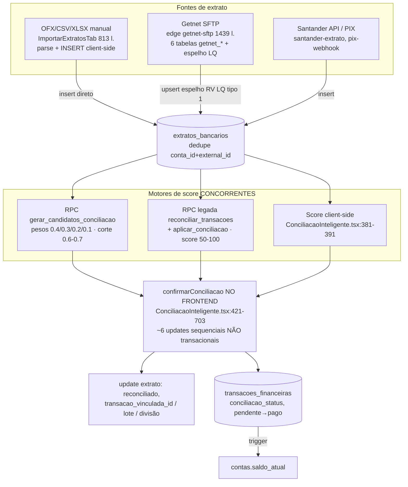
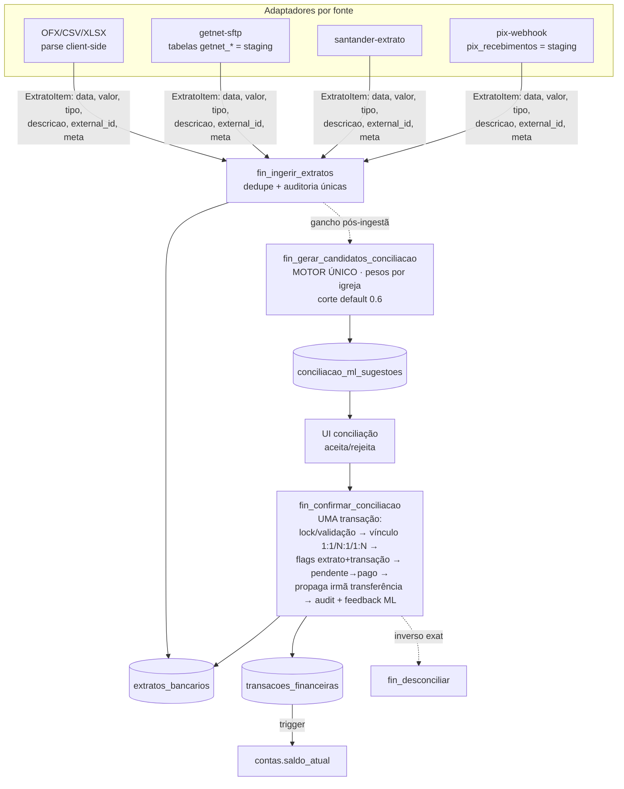

# Arquitetura do Domínio Financeiro — Diagnóstico, CORE + Módulos e Conciliação

> Mapeamento completo do estado atual (jul/2026) e proposta de modularização.
> Complementa ADR-021 (multi-tenant), ADR-022 (importação de extratos),
> ADR-025 (baixa automática), ADR-027 (valor bruto vs líquido) e ADR-028
> (sincronização bancária por eventos). As duas decisões estruturantes daqui
> devem ser formalizadas como **ADR-029 (camada canônica de lançamentos no
> banco)** e **ADR-030 (conciliação transacional e motor único de score)**.

---

## 1. Diagnóstico resumido

| # | Problema | Sintoma | Custo |
|---|----------|---------|-------|
| 1 | Regras de lançamento vivem no frontend | `TransacaoDialog.tsx` (1788 l.) monta payload e faz insert/update direto; `Entradas.tsx`/`Saidas.tsx` duplicam ~60-70% de código | Toda regra nova é escrita 2-3×; divergência silenciosa |
| 2 | Bot duplica as regras | `chatbot-financeiro/index.ts` (2538 l.) insere direto em `transacoes_financeiras` com service role | ADR-027, validações e defaults reimplementados; drift provável |
| 3 | Conciliação fragmentada | 3 motores de score, 3 modelos de vínculo, confirmação multi-tabela **não transacional no frontend** | Risco de estado inconsistente; impossível reusar pelo bot/API |
| 4 | UX mobile desigual | Lançamentos OK; conciliação inutilizável no celular | Fluxo central do tesoureiro preso ao desktop |

**Causa raiz comum (1-3): não existe porta de entrada única de escrita no
domínio financeiro.** Cada canal (UI, bot, edges de integração) escreve
direto nas tabelas.

---

## 2. Estado atual — Bloco de Transações

### 2.1 Tamanho e complexidade

| Arquivo | Linhas | Papel |
|---|---|---|
| `src/components/financas/TransacaoDialog.tsx` | **1788** | Form criar/editar — maior artefato do bloco |
| `src/pages/financas/Reembolsos.tsx` | 1532 | Reembolsos (gera transações) |
| `src/pages/financas/Saidas.tsx` | **1324** | Contas a pagar |
| `src/pages/financas/Entradas.tsx` | **1183** | Recebimentos |
| `src/components/financas/ExportarTab.tsx` | 635 | Exportação |
| `src/components/financas/TransacaoActionsMenu.tsx` | 594 | Ações por linha (mutações diretas) |
| `src/pages/financas/Transferencias.tsx` | 368 | Par de transações entre contas |
| Calendários/dialogs espelhados Entradas×Saídas | ~150 cada | Duplicados |

### 2.2 Responsabilidades misturadas

- **`Entradas.tsx` / `Saidas.tsx`**: cada página concentra ~15 estados de
  UI/filtro, 4 `useQuery` inline direto no supabase (filtro multi-tenant
  repetido em cada query), regra de período, agrupamento por data, helpers de
  status/moeda, exportação e JSX de ~800 linhas. Saídas adiciona
  transferências, `entradaVinculada` e query extra de `extratos_bancarios`.
- **`TransacaoDialog.tsx`**: fetch de 7 tabelas de apoio (contas, categorias,
  subcategorias, centros_custo, bases_ministeriais, fornecedores,
  formas_pagamento), OCR de nota fiscal (`processar-nota-fiscal`), criação
  inline de fornecedor (~l.791-838), regras de valor líquido ADR-027
  (~l.932-953), montagem de payload (~l.955-1000), insert/update direto
  (~l.1002-1016) e efeito `disparar-alerta` (~l.1019-1030).
- **`TransacaoActionsMenu.tsx`**: mudança de status, delete, conferido
  manual, consultas a `extratos_bancarios`/`conciliacoes_lote` — tudo
  mutação direta no cliente.

### 2.3 Duplicação Entradas ↔ Saídas

~60-70% do código é espelhado 1:1 (estado de filtros, fetch, período,
agrupamento, exportação, helpers). A variação real está em
`.eq("tipo", ...)`, rótulos e nas features extras de Saídas. Pares de
calendário (`EntradasCalendario`/`SaidasCalendario` etc.) idem.

### 2.4 Abstrações existentes reutilizáveis

- `src/hooks/useTransacoesFiltro.ts` (73 l.) — único ponto realmente
  compartilhado (`Transacao`, `FiltrosTransacao`, `ConciliacaoMap`).
- `src/hooks/usePagination.ts`, `src/hooks/useFilialPaginatedQuery.ts`
  (subutilizado — as páginas fazem query manual).
- Contexto multi-tenant: `useFilialId`, `useIgrejaId`, `isAllFiliais`.
- `src/lib/exportUtils.ts`, `src/utils/dateUtils`.

### 2.5 Modelo de dados

Tabela central **`transacoes_financeiras`** (migration base
`20251129191330_*.sql`):

- `tipo` entrada/saida · `tipo_lancamento` unico/recorrente/parcelado ·
  `status` pendente/pago/cancelado (TEXT + CHECK, sem enums nativos).
- Datas: vencimento, pagamento, competência.
- FKs: `contas`, `categorias_financeiras`, `subcategorias_financeiras`,
  `centros_custo`, `bases_ministeriais`, `fornecedores`.
- Adicionadas depois: `igreja_id`/`filial_id` (multi-tenant), colunas
  ADR-027 (`valor_liquido`, `juros`, `multas`, `desconto`,
  `taxas_administrativas`), `conciliacao_status`, `conferido_manual`,
  `evento_id`, `solicitacao_reembolso_id`, `cob_pix_id`, `pessoa_id`,
  `origem` (manual/api).
- Trigger AFTER UPDATE de status recalcula `contas.saldo_atual` quando muda
  de/para `pago`. RLS: admin OR tesoureiro.

### 2.6 Padrão de mutação (o problema central)

- CRUD de transação = insert/update/delete **direto no cliente**, sem camada
  de serviço.
- Conciliação/reembolso/saldo = RPCs Postgres (`aplicar_conciliacao`,
  `reconciliar_transacoes`, `gerar_candidatos_conciliacao`,
  `desconciliar_transacao`...).
- Integrações/efeitos = edge functions (`processar-nota-fiscal`,
  `disparar-alerta`, `finance-sync`, `getnet-sftp`, `chatbot-financeiro`,
  `pix-webhook`, `santander-*`).
- **Bug latente**: lançamento parcelado/recorrente insere **apenas a
  parcela 1** com metadados (`total_parcelas`, `recorrencia`) — não existe
  função nem job que materialize as ocorrências futuras.

---

## 3. Estado atual — Conciliação (Extrato bancário + Getnet)

### 3.1 Modelo de dados

- **`extratos_bancarios`** (migration `20260109150000`): lado banco.
  `conta_id`→`contas`, `data_transacao`, `valor`, `tipo` credito/debito,
  `reconciliado`, `external_id` + `origem` (`manual`, `api_santander`,
  `arquivo_ofx`, `arquivo_csv`, `getnet_sftp`, `getnet_sftp_txt`),
  `transacao_vinculada_id` (FK **lógica**, sem constraint física).
  Dedupe: índice único `(conta_id, external_id)`.
- **Vínculo extrato↔transação tem 3 mecanismos** (não há tabela única):
  1. **1:1** — `extratos_bancarios.transacao_vinculada_id` + `reconciliado=true`
  2. **N:1** — `conciliacoes_lote` + `conciliacoes_lote_extratos`
  3. **1:N** — `conciliacoes_divisao` + `conciliacoes_divisao_transacoes`
- Suporte: `reconciliacao_audit_logs`, `conciliacao_ml_sugestoes` +
  `conciliacao_ml_feedback` (tipo_match 1:1/1:N/N:1, score),
  `pix_recebimentos`.
- **Conta bancária = tabela `contas`** (`tipo='bancaria'`), `saldo_atual`
  mantido por trigger sensível apenas a mudanças de/para status `pago`.
  Extrato importado **não** afeta saldo. `conferido_manual` é ortogonal
  (conferência de dinheiro em espécie).
- **6 tabelas Getnet** (`getnet_resumo` RV PF/LQ, `getnet_analitico` CV/NSU,
  `getnet_ajustes`, `getnet_financeiro_resumo` tipo 5,
  `getnet_financeiro_detalhe` tipo 6, `getnet_arquivos`) — junções por
  `chave_ur` e `rv`.

### 3.2 Fluxo atual (como está)



### 3.3 Pontos de atenção

1. **Espelhamento Getnet parte do tipo 1 (RV LQ = previsto)**, não do tipo 5
   (`getnet_financeiro_resumo` = dinheiro que efetivamente movimentou).
2. **Três regras de score** com pesos e limiares distintos.
3. **Confirmação multi-tabela roda no frontend** — falha no meio dos ~6
   updates deixa estado inconsistente (extrato conciliado sem transação paga,
   lote órfão).
4. `transacao_vinculada_id` sem FK física.

### 3.4 UI de conciliação (tamanhos)

`ConciliacaoInteligente.tsx` **1239 l.**, `ConciliacaoManual.tsx` **1018 l.**,
`HistoricoExtratos.tsx` 878, `ImportarExtratosTab.tsx` 813,
`DashboardConciliacao.tsx` 795, `ExtratoPreviewDialog.tsx` 635,
`DividirExtratoDialog.tsx` 471, `ConciliacaoLoteDialog.tsx` 378 — container
`Reconciliacao.tsx` (63 l., 5 abas).

---

## 4. Estado atual — Bot e Integrações

### 4.1 O bot financeiro já existe — e é o segundo maior monólito

- **`supabase/functions/chatbot-financeiro/index.ts` (2538 l.,
  `verify_jwt=false`)** — lançamento via WhatsApp (Make). Máquina de estados
  em `atendimentos_bot.meta_dados` (fluxos DESPESAS, CONTA_UNICA, REEMBOLSO,
  TRANSFERENCIA). Baixa anexo do WhatsApp (Graph API), salva em Storage
  `transaction-attachments`, chama OCR, confirma com o usuário e **insere
  direto** em `transacoes_financeiras` (~l.1612, 2399, 2422) e
  `transferencias_contas` (~l.2372) com service role.
- Autorização por pessoa: `profiles.autorizado_bot_financeiro` + flags
  `autorizado_lancar_despesas`/`_depositos`/`_reembolsos` — validadas dentro
  do Deno, longe das demais regras.
- Roteamento Make: `consultar-sessao-bot` resolve `igreja_id`/`filial_id`
  via `whatsapp_numeros` e decide triagem × financeiro.
- **Segurança**: chatbot-financeiro NÃO usa `x-webhook-secret` (as demais
  edges de webhook Make usam shared secret timing-safe). Ponto a corrigir.

### 4.2 Ecossistema (58 edge functions)

- Financeiro/bancário: `getnet-sftp`, `pix-webhook` (ADR-024),
  `santander-api`/`santander-extrato`, `buscar-pix-recebidos`/
  `buscar-pix-cron`/`criar-cobranca-pix`, `finance-sync` (esqueleto),
  `sync-transferencias-conciliacao`, `reclass-transacoes`/`undo-reclass`/
  `undo-import`, `processar-nota-fiscal`, `integracoes-config` (secrets
  criptografados tweetnacl).
- 3 padrões de segurança coexistem: `x-webhook-secret` timing-safe; secrets
  por igreja (tabela `webhooks` + `_shared/webhook-resolver.ts`, fallback
  filial→igreja→sistema); `_shared/internal-auth.ts`.
- Docs de referência: `docs/automacoes/catalogo-automacoes.md`,
  `docs/automacoes/FLUXO_MAKE_COM_CONSULTAR_SESSAO.md`, ADR-024/025/026,
  `docs/BACKLOG_MULTI_TENANCY.md`.

---

## 5. Estado atual — UX Web / Mobile (Tablet e Celular)

### 5.1 Infraestrutura já existente (boa base)

- PWA real (`vite-plugin-pwa` + workbox), meta viewport, safe-area insets
  iOS (`src/index.css:196-199`), anti-zoom iOS (font-size 16px em inputs),
  dark mode (`next-themes`; classes `dark:` em 23 arquivos do financeiro).
- Primitivos prontos: drawer `vaul`, `responsive-dialog` (Dialog↔Drawer),
  `sheet`, `skeleton`, `useIsMobile` (768px), `useMediaQuery`.
- Sidebar vira Sheet no mobile; bottom-nav `MobileNavbar` com animações.

### 5.2 O que está bem no financeiro

- **Entradas/Saídas**: listas em cards (não tabela), filtros em
  `FiltrosSheet`, resumo `grid-cols-1 sm:grid-cols-2 lg:grid-cols-4`.
- **TransacaoDialog**: o mais bem adaptado — `useIsMobile`, layout mobile
  dedicado com barra de ações fixa no rodapé, grids `md:grid-cols-2`.
- **Dashboard**: Recharts com `ResponsiveContainer`, grids responsivos.

### 5.3 Lacunas concretas

1. **`ConciliacaoInteligente.tsx:841` — crítico**: duas colunas fixas
   lado-a-lado + coluna central `w-32`, zero classes responsivas/`isMobile`.
   Inutilizável em celular; apertado em tablet 768-834px.
2. **`Reconciliacao.tsx:38`**: `TabsList grid-cols-5` fixo — abas espremidas
   e ilegíveis no celular.
3. **Finanças fora do bottom-nav** — acesso mobile só via Menu → Sheet
   (`SidebarTrigger` é `hidden md:block`).
4. **Editar por `onDoubleClick`** (Entradas:783, Saidas:908/1119) — duplo
   toque não é padrão touch.
5. **DRE**: tabela larga só com `overflow-x-auto`.
6. **Skeletons quase ausentes** — maioria usa "Carregando..." sem
   placeholder de layout.
7. **Tablet**: >768px cai direto no layout desktop denso.
8. **`useIsMobile` aplicado de forma desigual** entre componentes.

### 5.4 Avaliação honesta

- **Celular: parcialmente utilizável** — lançar e consultar funciona bem;
  a conciliação (fluxo central do tesoureiro) é inutilizável.
- **Tablet: utilizável**, mas com densidade desenhada para desktop.
- O site público (`src/pages/public/*`) prova que o time domina
  responsividade; a disciplina não alcançou os componentes complexos do
  financeiro. **Modularizar é pré-requisito**: ajuste responsivo em um
  arquivo de 1239 linhas é cirurgia de alto risco.

### 5.5 Direção de melhoria premium

- Conciliação mobile: alternar painéis por Tabs/stepper (padrão já usado em
  `ConciliacaoManual:534`); abas de `Reconciliacao` com scroll horizontal ou
  Select no mobile.
- Finanças no bottom-nav (ou atalho contextual por papel tesoureiro/admin).
- Tap único abre detalhe (drawer); ações no ActionsMenu; abolir double-click
  como único caminho.
- Skeletons padronizados por lista/card no core de UI do financeiro.
- DRE mobile: cards resumidos com drill-down, tabela no desktop.
- `useIsMobile`/`ResponsiveDialog` como convenção obrigatória do módulo.

---

## 6. Arquitetura alvo — CORE + Módulos

### 6.1 Decisão central: o CORE de escrita vive no banco (RPCs `fin_*`)

Alternativas avaliadas:

- **A. RPCs Postgres (escolhida)** — único runtime que todos os canais já
  alcançam (front via PostgREST, edges via service role); transacional por
  construção; o padrão já foi inaugurado no repo
  (`gerar_candidatos_conciliacao`, `aplicar_conciliacao`,
  `desconciliar_transacao`) — só não foi generalizado.
- **B. Lib TypeScript compartilhada** — rejeitada como camada primária: não
  resolve transacionalidade nem impede escrita direta por um terceiro canal.
- **C. Edge "API financeira"** — rejeitada como camada primária: hop extra,
  cold start; vale como fachada futura por cima das mesmas RPCs.

Leituras continuam via PostgREST/RLS como hoje.

```mermaid
flowchart TD
    FE[Frontend SPA<br/>features/financeiro/*] -->|JWT + RLS| CORE
    BOT[chatbot-financeiro<br/>estados, mídia, OCR] -->|service role + p_contexto| CORE
    EDGES[Edges de integração<br/>getnet-sftp, santander, pix] -->|service role + p_contexto| CORE

    subgraph CORE FINANCEIRO — Postgres
        CORE[RPCs canônicas fin_*<br/>fin_criar_lancamento · fin_atualizar_lancamento<br/>fin_alterar_status_lancamento · fin_excluir_lancamento<br/>fin_criar_transferencia · fin_ingerir_extratos<br/>fin_confirmar_conciliacao · fin_desconciliar<br/>fin_gerar_candidatos_conciliacao]
        CORE --> T[(transacoes_financeiras<br/>transferencias_contas<br/>extratos_bancarios<br/>conciliacoes_*)]
        T --> TRG[triggers saldo · RLS leitura · auditoria]
    end
```

**Regra de ouro:** nenhum canal faz INSERT/UPDATE/DELETE direto em
`transacoes_financeiras`, `transferencias_contas`, `extratos_bancarios` e
tabelas de conciliação. Escrita só via RPC `fin_*` (enforçável ao final
revogando privilégios de escrita do role `authenticated`).

### 6.2 Contratos das RPCs (conceituais)

Convenções: prefixo `fin_`; escalares para o essencial + `p_extras jsonb`
para opcionais; retorno `jsonb {ok, id(s), warnings[]}`; auditoria em todas.

**Resolução de tenant e ator (padrão obrigatório):**
- JWT de usuário: tenant derivado de `get_current_user_igreja_id()`/
  `get_current_user_filial_id()`; permissão via `has_role` +
  `has_filial_access`. Parâmetros explícitos são validados contra o JWT.
- Service role (bot/edges): `p_contexto jsonb {igreja_id, filial_id,
  ator_profile_id, canal}`; a RPC valida que o ator pertence ao tenant e,
  para canal `bot`, checa `autorizado_bot_financeiro` + flag específica.
  A autorização do bot sai do Deno e passa a morar junto das demais regras.

**Lançamentos:**
- `fin_criar_lancamento(p_tipo, p_valor, p_data, p_conta_id, p_categoria_id,
  p_descricao, p_extras, p_contexto)` — valida FKs no tenant; regras ADR-027;
  defaults; **materializa parcelas** (corrige o bug da parcela única);
  semântica de recorrência (decisão D6).
- `fin_atualizar_lancamento(p_id, p_patch, p_contexto)` — recalcula ADR-027;
  bloqueia edição de conciliado (D4).
- `fin_alterar_status_lancamento(p_id, p_novo_status, p_dados, p_contexto)` —
  única porta pendente↔pago↔cancelado; trigger de saldo intacto; registra
  quem/quando/canal. Substitui as mutações do `TransacaoActionsMenu`.
- `fin_excluir_lancamento(p_id, p_contexto)` — recusa se conciliado; trata
  irmãs de parcelamento (D4).
- `fin_criar_transferencia(...)` — par em `transferencias_contas` +
  transações espelho, atomicamente.

### 6.3 Frontend: `src/features/financeiro/`

```
src/features/financeiro/
├── core/                       # compartilhado por todos os módulos
│   ├── api/                    # ÚNICO lugar que chama supabase no domínio
│   │   ├── lancamentos.api.ts  # wrappers tipados fin_*
│   │   ├── conciliacao.api.ts
│   │   ├── extratos.api.ts
│   │   └── apoio.api.ts        # 7 tabelas de apoio (hoje inline no Dialog)
│   ├── hooks/                  # useLancamentos (unificado por tipo),
│   │                           # useLancamentoMutations, useDadosApoio,
│   │                           # useTransacoesFiltro (movido)
│   ├── model/                  # types.ts, constants.ts (status/cor/rótulo)
│   └── lib/                    # valores.ts (moeda/ADR-027), agrupamento.ts
├── lancamentos/                # TransacoesPage ÚNICA parametrizada por tipo;
│   └── components/             # TransacaoDialog decomposto (~200 l. orquestrador
│                               # + FormCampos, ValoresFiscais, OcrPanel,
│                               # FornecedorQuickCreate, ActionsMenu só-UI)
├── conciliacao/                # telas decompostas + responsivas
├── importacao/                 # parse OFX/CSV client-side → fin_ingerir_extratos
├── integracoes/                # Getnet, Santander, PIX (config/logs)
├── reembolsos/
├── transferencias/
└── relatorios/                 # DRE, exportações
```

Regras de dependência: módulo depende de `core/`; `core/` não depende de
módulo; módulo não importa módulo (se precisar, promove ao core).
`src/pages/financas/*` viram cascas de rota (re-export) — roteamento do
`App.tsx` intocado durante a migração.

### 6.4 Bot como módulo consumidor

`chatbot-financeiro` **mantém**: máquina de estados, mídia WhatsApp, OCR,
diálogo. **Perde**: todo INSERT direto — vira chamada às mesmas RPCs `fin_*`
via shim `supabase/functions/_shared/financeiro-core.ts` (reusado por
`pix-webhook`, `getnet-sftp`, `santander-extrato`, `finance-sync`).

Resultado: regra escrita **uma vez**. Um ajuste no ADR-027 é um
`CREATE OR REPLACE FUNCTION` — front e bot herdam no mesmo deploy.

Segurança (Fase 1): adicionar `x-webhook-secret` timing-safe ao
`chatbot-financeiro` (hoje exposto sem secret), padrão já existente nas
demais edges Make.

---

## 7. Fluxo de conciliação alvo



1. **Motor único de score**: eleger `gerar_candidatos_conciliacao` →
   `fin_gerar_candidatos_conciliacao` (pesos parametrizáveis por igreja);
   deprecar a dupla legada `reconciliar_transacoes`/`aplicar_conciliacao` e
   o score client-side. `ModoABToggle` vira instrumento de validação na
   transição e depois é removido.
2. **Confirmação transacional**: `fin_confirmar_conciliacao(p_vinculo jsonb)`
   com `{extrato_ids[], transacao_ids[], divisoes?, sugestao_id?, score?}` —
   um contrato para os três formatos. Elimina a janela de inconsistência dos
   ~6 updates sequenciais do frontend.
3. **Pipeline comum de ingestão**: contrato `ExtratoItem` + `origem` fixa por
   fonte; dedupe e auditoria num lugar só; viabiliza `undo-import` genérico
   e o gatilho automático de geração de candidatos (ADR-028).
4. **Getnet tipo 1 vs tipo 5**: recomendação técnica — espelhar extrato a
   partir do **tipo 5** (dinheiro real; análogo ao extrato bancário),
   mantendo tipo 1 como analítico/drill-down. Muda números já conciliados →
   decisão de produto (D5); transição apenas para novos períodos
   (`origem='getnet_sftp_tipo5'`), sem reprocessar histórico.

---

## 8. Roadmap incremental (strangler fig, sem big-bang)

Cada fase é deployável isolada; legado convive com o novo.

| Fase | Escopo | Observações |
|---|---|---|
| **F0 Fundações** | Este doc + ADR-029/030; extrair helpers puros (moeda, status, agrupamento) para `features/financeiro/core`; convenção `fin_*` e padrão `p_contexto` | Refactor sem mudança de comportamento |
| **F1 RPC de lançamento + bot** | Migrations `fin_criar/atualizar/status/excluir_lancamento` + `fin_criar_transferencia`; **bot troca inserts por RPC primeiro** (menos variação de payload, onde o drift dói mais) + `x-webhook-secret`; depois `TransacaoDialog`/`ActionsMenu` | **Maior ROI.** Gate de saída: nenhum canal insere direto |
| **F2 Unificação Entradas/Saídas** | `useLancamentos` + `TransacoesPage` por tipo; páginas viram re-exports; decomposição do `TransacaoDialog`; **UX: tap único + skeletons padronizados** | Só frontend; paralelo a F1 |
| **F3 Conciliação transacional** | `fin_confirmar_conciliacao` + `fin_desconciliar` (porta a lógica de `ConciliacaoInteligente.tsx:421-703`); feature flag de rollback 1-2 releases | Depende de F1 (status via RPC) |
| **F4 Motor único de score** | Estabilizar `fin_gerar_candidatos_conciliacao`; remover score client-side; deprecar RPCs legadas; validar via ModoABToggle e removê-lo | Depende de F3 |
| **F5 Pipeline de ingestão** | `fin_ingerir_extratos`; ordem: manual → pix → santander → getnet; gancho pós-ingestão (ADR-028) | Independente após F0 |
| **F6 Getnet tipo 5** | Após decisão D5; novos períodos apenas; backfill opcional | Depende de F5 |
| **F7 Endurecimento + UX conciliação** | Revogar escrita direta do role `authenticated`; decompor telas gigantes de conciliação em `features/financeiro/conciliacao` **já responsivas** (Tabs/stepper mobile, abas com scroll); Finanças no bottom-nav; DRE mobile em cards; limpeza de código morto | Fecha o ciclo |

---

## 9. Decisões em aberto (bater o martelo)

| # | Decisão | Recomendação |
|---|---|---|
| D1 | Camada canônica no banco (ADR-029) | Aprovar — pré-requisito de tudo |
| D2 | Padrão `features/` no frontend | Financeiro inaugura; demais domínios depois |
| D3 | Modelo de vínculo de conciliação | (a) manter 3 estruturas via RPC agora; (b) modelo único N:M `conciliacoes`+`conciliacao_itens` como evolução. FK física em `transacao_vinculada_id` após saneamento |
| D4 | Imutabilidade | Editar/excluir lançamento conciliado? Parcela do meio? A RPC precisa de resposta |
| D5 | Getnet tipo 1 vs tipo 5 | Tipo 5 como verdade do espelho, só novos períodos |
| D6 | Recorrência/parcelamento | Materializar tudo na criação (parcelado); job mensal (recorrente) |
| D7 | Efeitos colaterais (alertas) | Fila no banco lida por edge — bot e front geram os mesmos alertas |
| D8 | Status ENUM vs TEXT+CHECK | Padronizar na F1 (barato agora, caro depois) |

## 10. Riscos

- **`SECURITY DEFINER` bypassa RLS** → padrão de resolução de tenant (6.2) é
  inegociável; revisão de segurança dedicada (checklist de
  `docs/01-Arquitetura/04-rls-e-seguranca.MD`).
- **Trigger de saldo dentro de RPCs** → testar reentrância; criar
  `fin_recalcular_saldo_conta(conta_id)` para corrigir drift histórico.
- **Schema real de produção vs migrations** (histórico Lovable com hashes) →
  snapshot baseline antes da F1.
- **Paridade na convivência** (F3) → monitorar divergências via audit log
  enquanto a flag antiga existir.
