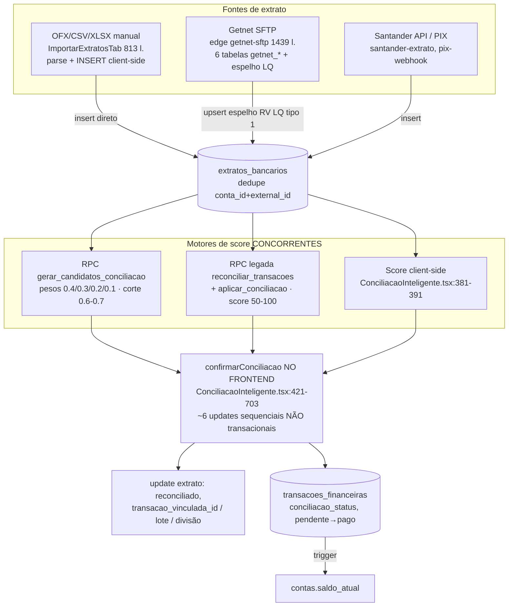
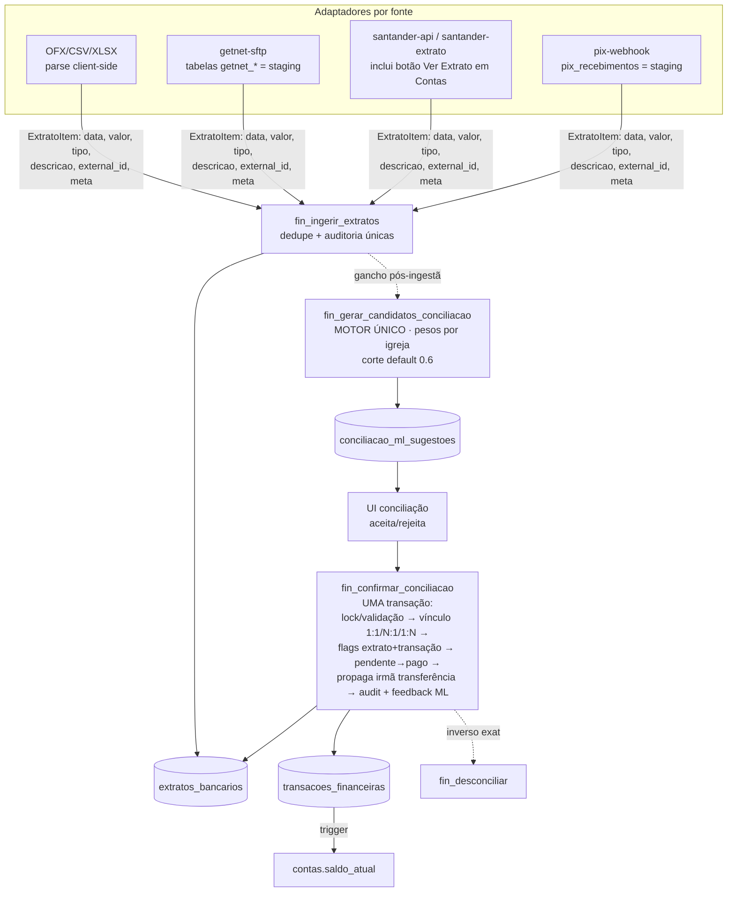

# Arquitetura do Domínio Financeiro — Diagnóstico, CORE + Módulos e Conciliação

> Mapeamento completo do estado atual (jul/2026) e proposta de modularização.
> Complementa ADR-021 (multi-tenant), ADR-022 (importação de extratos),
> ADR-025 (baixa automática), ADR-027 (valor bruto vs líquido) e ADR-028
> (sincronização bancária por eventos). As duas decisões estruturantes daqui
> devem ser formalizadas como **ADR-029 (camada canônica de lançamentos no
> banco)** e **ADR-030 (conciliação transacional e motor único de score)**.

> **Antes de escrever código novo no financeiro**, consulte
> [`docs/guardrails-financeiro.md`](guardrails-financeiro.md) — checklist
> obrigatório extraído das rodadas de review desta PR (filial compartilhada,
> RPC `SECURITY DEFINER`, trigger de saldo, locks/concorrência, harness).
> Resumo curto também no `CLAUDE.md` da raiz do repo.

---

## 1. Diagnóstico resumido

| # | Problema | Sintoma | Custo |
|---|----------|---------|-------|
| 1 | Regras de lançamento vivem no frontend | `TransacaoDialog.tsx` (1788 l.) monta payload e faz insert/update direto; `Entradas.tsx`/`Saidas.tsx` duplicam ~60-70% de código | Toda regra nova é escrita 2-3×; divergência silenciosa |
| 2 | Bot duplica as regras | `chatbot-financeiro/index.ts` (2538 l.) insere direto em `transacoes_financeiras` com service role | ADR-027, validações e defaults reimplementados; drift provável |
| 3 | Conciliação fragmentada | 3 motores de score, 3 modelos de vínculo, confirmação multi-tabela **não transacional no frontend** | Risco de estado inconsistente; impossível reusar pelo bot/API |
| 4 | Ofertas é um canal de escrita paralelo | `RelatorioOferta.tsx` (**2627 l., o maior arquivo do financeiro**) monta payload de transação à mão em 3 pontos, sem reusar TransacaoDialog | Terceira cópia das regras; inconsistências de status já no código |
| 5 | Consultas agregam no cliente sem limite | Dashboard, Insights, Projeções, Contas e Ofertas leem linhas cruas e agregam no navegador, sem `.limit()` | **Truncamento silencioso** no teto de 1000 linhas do PostgREST em períodos grandes |
| 6 | UX mobile desigual | Lançamentos OK; conciliação inutilizável no celular | Fluxo central do tesoureiro preso ao desktop |

**Causa raiz comum (1-4): não existe porta de entrada única de escrita no
domínio financeiro.** Quatro canais (TransacaoDialog, bot, RelatorioOferta e
importações/integrações) escrevem direto nas tabelas, cada um com sua cópia
das regras.

---

## 2. Estado atual — Bloco de Transações

### 2.1 Tamanho e complexidade

| Arquivo | Linhas | Papel |
|---|---|---|
| `src/components/financas/TransacaoDialog.tsx` | **1788** | Form criar/editar — maior artefato do bloco |
| `src/pages/financas/Reembolsos.tsx` | 1532 | Reembolsos (gera transações) |
| `src/pages/financas/Saidas.tsx` | **1324** | Contas a pagar |
| `src/pages/financas/Entradas.tsx` | **1183** | Recebimentos |
| `src/components/financas/ExportarTab.tsx` | 635 | Exportação |
| `src/components/financas/TransacaoActionsMenu.tsx` | 594 | Ações por linha (mutações diretas) |
| `src/pages/financas/Transferencias.tsx` | 368 | Par de transações entre contas |
| Calendários/dialogs espelhados Entradas×Saídas | ~150 cada | Duplicados |

### 2.2 Responsabilidades misturadas

- **`Entradas.tsx` / `Saidas.tsx`**: cada página concentra ~15 estados de
  UI/filtro, 4 `useQuery` inline direto no supabase (filtro multi-tenant
  repetido em cada query), regra de período, agrupamento por data, helpers de
  status/moeda, exportação e JSX de ~800 linhas. Saídas adiciona
  transferências, `entradaVinculada` e query extra de `extratos_bancarios`.
- **`TransacaoDialog.tsx`**: fetch de 7 tabelas de apoio (contas, categorias,
  subcategorias, centros_custo, bases_ministeriais, fornecedores,
  formas_pagamento), OCR de nota fiscal (`processar-nota-fiscal`), criação
  inline de fornecedor (~l.791-838), regras de valor líquido ADR-027
  (~l.932-953), montagem de payload (~l.955-1000), insert/update direto
  (~l.1002-1016) e efeito `disparar-alerta` (~l.1019-1030).
- **`TransacaoActionsMenu.tsx`**: mudança de status, delete, conferido
  manual, consultas a `extratos_bancarios`/`conciliacoes_lote` — tudo
  mutação direta no cliente.

### 2.3 Duplicação Entradas ↔ Saídas

~60-70% do código é espelhado 1:1 (estado de filtros, fetch, período,
agrupamento, exportação, helpers). A variação real está em
`.eq("tipo", ...)`, rótulos e nas features extras de Saídas. Pares de
calendário (`EntradasCalendario`/`SaidasCalendario` etc.) idem.

### 2.4 Abstrações existentes reutilizáveis

- `src/hooks/useTransacoesFiltro.ts` (73 l.) — único ponto realmente
  compartilhado (`Transacao`, `FiltrosTransacao`, `ConciliacaoMap`).
- `src/hooks/usePagination.ts`, `src/hooks/useFilialPaginatedQuery.ts`
  (subutilizado — as páginas fazem query manual).
- Contexto multi-tenant: `useFilialId`, `useIgrejaId`, `isAllFiliais`.
- `src/lib/exportUtils.ts`, `src/utils/dateUtils`.

### 2.5 Modelo de dados

Tabela central **`transacoes_financeiras`** (migration base
`20251129191330_*.sql`):

- `tipo` entrada/saida · `tipo_lancamento` unico/recorrente/parcelado ·
  `status` pendente/pago/cancelado (TEXT + CHECK, sem enums nativos).
- Datas: vencimento, pagamento, competência.
- FKs: `contas`, `categorias_financeiras`, `subcategorias_financeiras`,
  `centros_custo`, `bases_ministeriais`, `fornecedores`.
- Adicionadas depois: `igreja_id`/`filial_id` (multi-tenant), colunas
  ADR-027 (`valor_liquido`, `juros`, `multas`, `desconto`,
  `taxas_administrativas`), `conciliacao_status`, `conferido_manual`,
  `evento_id`, `solicitacao_reembolso_id`, `cob_pix_id`, `pessoa_id`,
  `origem` (manual/api).
- Trigger AFTER UPDATE de status recalcula `contas.saldo_atual` quando muda
  de/para `pago`. RLS: admin OR tesoureiro.

### 2.6 Padrão de mutação (o problema central)

- CRUD de transação = insert/update/delete **direto no cliente**, sem camada
  de serviço.
- Conciliação/reembolso/saldo = RPCs Postgres (`aplicar_conciliacao`,
  `reconciliar_transacoes`, `gerar_candidatos_conciliacao`,
  `desconciliar_transacao`...).
- Integrações/efeitos = edge functions (`processar-nota-fiscal`,
  `disparar-alerta`, `finance-sync`, `getnet-sftp`, `chatbot-financeiro`,
  `pix-webhook`, `santander-*`).
- **Bug latente**: lançamento parcelado/recorrente insere **apenas a
  parcela 1** com metadados (`total_parcelas`, `recorrencia`) — não existe
  função nem job que materialize as ocorrências futuras.

---

## 3. Estado atual — Conciliação (Extrato bancário + Getnet)

### 3.1 Modelo de dados

- **`extratos_bancarios`** (migration `20260109150000`): lado banco.
  `conta_id`→`contas`, `data_transacao`, `valor`, `tipo` credito/debito,
  `reconciliado`, `external_id` + `origem` (`manual`, `api_santander`,
  `arquivo_ofx`, `arquivo_csv`, `getnet_sftp`, `getnet_sftp_txt`),
  `transacao_vinculada_id` (FK **lógica**, sem constraint física).
  Dedupe: índice único `(conta_id, external_id)`.
- **Vínculo extrato↔transação tem 3 mecanismos** (não há tabela única):
  1. **1:1** — `extratos_bancarios.transacao_vinculada_id` + `reconciliado=true`
  2. **N:1** — `conciliacoes_lote` + `conciliacoes_lote_extratos`
  3. **1:N** — `conciliacoes_divisao` + `conciliacoes_divisao_transacoes`
- Suporte: `reconciliacao_audit_logs`, `conciliacao_ml_sugestoes` +
  `conciliacao_ml_feedback` (tipo_match 1:1/1:N/N:1, score),
  `pix_recebimentos`.
- **Conta bancária = tabela `contas`** (`tipo='bancaria'`), `saldo_atual`
  mantido por trigger sensível apenas a mudanças de/para status `pago`.
  Extrato importado **não** afeta saldo. `conferido_manual` é ortogonal
  (conferência de dinheiro em espécie).
- **6 tabelas Getnet** (`getnet_resumo` RV PF/LQ, `getnet_analitico` CV/NSU,
  `getnet_ajustes`, `getnet_financeiro_resumo` tipo 5,
  `getnet_financeiro_detalhe` tipo 6, `getnet_arquivos`) — junções por
  `chave_ur` e `rv`.

### 3.2 Fluxo atual (como está)


```mermaid
flowchart TD
    subgraph Fontes de extrato
        OFX[OFX/CSV/XLSX manual<br/>ImportarExtratosTab 813 l.<br/>parse + INSERT client-side]
        GET[Getnet SFTP<br/>edge getnet-sftp 1439 l.<br/>6 tabelas getnet_* + espelho LQ]
        SAN[Santander API / PIX<br/>santander-extrato, pix-webhook]
    end
    OFX -->|insert direto| EXT[(extratos_bancarios<br/>dedupe conta_id+external_id)]
    GET -->|upsert espelho RV LQ tipo 1| EXT
    SAN -->|insert| EXT

    subgraph Motores de score CONCORRENTES
        M1[RPC gerar_candidatos_conciliacao<br/>pesos 0.4/0.3/0.2/0.1 · corte 0.6-0.7]
        M2[RPC legada reconciliar_transacoes<br/>+ aplicar_conciliacao · score 50-100]
        M3[Score client-side<br/>ConciliacaoInteligente.tsx:381-391]
    end
    EXT --> M1 & M2 & M3

    M1 & M2 & M3 --> CONF[confirmarConciliacao NO FRONTEND<br/>ConciliacaoInteligente.tsx:421-703<br/>~6 updates sequenciais NÃO transacionais]
    CONF --> EXT2[update extrato: reconciliado,<br/>transacao_vinculada_id / lote / divisão]
    CONF --> TRX[(transacoes_financeiras<br/>conciliacao_status, pendente→pago)]
    TRX -->|trigger| SALDO[contas.saldo_atual]
```

### 3.3 Pontos de atenção

1. **Espelhamento Getnet parte do tipo 1 (RV LQ = previsto)**, não do tipo 5
   (`getnet_financeiro_resumo` = dinheiro que efetivamente movimentou).
2. **Três regras de score** com pesos e limiares distintos.
3. **Confirmação multi-tabela roda no frontend** — falha no meio dos ~6
   updates deixa estado inconsistente (extrato conciliado sem transação paga,
   lote órfão).
4. `transacao_vinculada_id` sem FK física.

### 3.4 UI de conciliação (tamanhos)

`ConciliacaoInteligente.tsx` **1239 l.**, `ConciliacaoManual.tsx` **1018 l.**,
`HistoricoExtratos.tsx` 878, `ImportarExtratosTab.tsx` 813,
`DashboardConciliacao.tsx` 795, `ExtratoPreviewDialog.tsx` 635,
`DividirExtratoDialog.tsx` 471, `ConciliacaoLoteDialog.tsx` 378 — container
`Reconciliacao.tsx` (63 l., 5 abas).

---

## 4. Estado atual — Bot e Integrações

### 4.1 O bot financeiro já existe — e é o segundo maior monólito

- **`supabase/functions/chatbot-financeiro/index.ts` (2538 l.,
  `verify_jwt=false`)** — lançamento via WhatsApp (Make). Máquina de estados
  em `atendimentos_bot.meta_dados` (fluxos DESPESAS, CONTA_UNICA, REEMBOLSO,
  TRANSFERENCIA). Baixa anexo do WhatsApp (Graph API), salva em Storage
  `transaction-attachments`, chama OCR, confirma com o usuário e **insere
  direto** em `transacoes_financeiras` (~l.1612, 2399, 2422) e
  `transferencias_contas` (~l.2372) com service role.
- Autorização por pessoa: `profiles.autorizado_bot_financeiro` + flags
  `autorizado_lancar_despesas`/`_depositos`/`_reembolsos` — validadas dentro
  do Deno, longe das demais regras.
- Roteamento Make: `consultar-sessao-bot` resolve `igreja_id`/`filial_id`
  via `whatsapp_numeros` e decide triagem × financeiro.
- **Segurança**: chatbot-financeiro NÃO usa `x-webhook-secret` (as demais
  edges de webhook Make usam shared secret timing-safe). Ponto a corrigir.

### 4.2 Ecossistema (58 edge functions)

- Financeiro/bancário: `getnet-sftp`, `pix-webhook` (ADR-024),
  `santander-api`/`santander-extrato`, `buscar-pix-recebidos`/
  `buscar-pix-cron`/`criar-cobranca-pix`, `finance-sync` (esqueleto),
  `sync-transferencias-conciliacao`, `reclass-transacoes`/`undo-reclass`/
  `undo-import`, `processar-nota-fiscal`, `integracoes-config` (secrets
  criptografados tweetnacl).
- 3 padrões de segurança coexistem: `x-webhook-secret` timing-safe; secrets
  por igreja (tabela `webhooks` + `_shared/webhook-resolver.ts`, fallback
  filial→igreja→sistema); `_shared/internal-auth.ts`.
- Docs de referência: `docs/automacoes/catalogo-automacoes.md`,
  `docs/automacoes/FLUXO_MAKE_COM_CONSULTAR_SESSAO.md`, ADR-024/025/026,
  `docs/BACKLOG_MULTI_TENANCY.md`.

---

## 5. Estado atual — Demais entrypoints e consultas

### 5.1 Relatório de Ofertas / Sessão de contagem (o 4º canal de escrita)

- **`src/pages/financas/RelatorioOferta.tsx` (2627 l.) é o maior arquivo do
  financeiro.** Wizard de 4 passos: data do culto, período, conferentes,
  linhas físicas + digitais, sincronização de PIX de `pix_webhook_temp`,
  rascunho em `sessoes_itens_draft`, conferência cega (blind count) e
  aprovação via `notifications`.
- **Modelo**: `sessoes_contagem` (status CHECK: aberto / aguardando_conferencia
  / divergente / validado / cancelado / reaberto; snapshot dos parâmetros de
  conferência cega; `conferentes` JSONB; `evento_id`) + `contagens` (1 linha
  por conferente) + `sessoes_itens_draft` + coluna
  `transacoes_financeiras.sessao_id`.
- **RPCs existentes**: `open_sessao_contagem` — **duas versões divergentes**
  (uma lê `financeiro_config`, outra `configuracoes_financeiro`; dedup
  diferente) — e `confrontar_contagens` (conferência cega com tolerância).
- **Contagem vira transação por INSERT direto montado no cliente em 3
  pontos** (`RelatorioOferta.tsx:1074` no fluxo de aprovação — sem
  `sessao_id`; `:2337` no "Encerrar e Lançar" — com `sessao_id`; payload
  duplicado entre físico/digital/aprovação). O `TransacaoDialog` **não** é
  reutilizado. Conta destino vem do mapeamento `forma_pagamento_contas`;
  status vem de `forma.gera_pago`.
- **Inconsistências**: `finalizarSessao` grava `status='finalizado'` +
  `data_fechamento`, ambos **fora do CHECK/DDL** da tabela; o StatusBadge da
  UI exibe estados que não existem no banco (em_contagem, fechada,
  rejeitada).
- `SessaoLancamentos.tsx` (226 l.) é leitura: lista as transações da sessão e
  cruza com `extratos_bancarios` para marcar Conciliado × Conferido
  (`conferido_manual` para dinheiro).

### 5.2 Conta corrente (`Contas.tsx` 1330 l.)

- Botão **"Ver Extrato"** (`Contas.tsx:890-921`) abre `ExtratoPreviewDialog`,
  que **consulta o extrato online no banco** via edge `santander-api`
  (`ExtratoPreviewDialog.tsx:100,146`) e **importa para `extratos_bancarios`**
  (`:257-299`) — ou seja, Contas é o 4º ponto de ingestão de extrato (API
  online), além de GerenciarDados (OFX/CSV), Getnet SFTP e PIX webhook.
  Há também teste de conexão (`test-santander`) e busca de saldo online.
- Movimentações do período: 2 queries diretas em `transacoes_financeiras`
  (`Contas.tsx:224-263`, `:266-292`), totais agregados **client-side** sem
  limite de linhas.
- **`AjusteSaldoDialog` sobrescreve `contas.saldo_atual` direto**
  (`AjusteSaldoDialog.tsx:52-58`) — não cria transação de ajuste; o ajuste
  manual fica sem trilha de auditoria.
- Importação de arquivo (OFX/CSV/XLSX) fica em `GerenciarDados.tsx` (aba
  extratos → `ImportarExtratosTab`); histórico em `Reconciliacao.tsx`.

### 5.3 Consultas e dashboards — comportamentos e melhorias

| Dashboard | Linhas | Fonte de dados | Comportamento |
|---|---|---|---|
| `pages/Dashboard.tsx` | 841 | queries diretas + `view_solicitacoes_reembolso` | Mês atual vs anterior, pendências, sessões; agregação client-side, sem limite |
| `pages/DashboardOfertas.tsx` | 606 | query direta | **Filtra ofertas por `.ilike("descricao","%oferta%")`** — heurística de texto frágil (não usa categoria nem `sessao_id`); joins manuais com formas/contas |
| `pages/DRE.tsx` | 505 | **RPC `get_dre_anual`** | Único com agregação no servidor — o padrão a seguir |
| `pages/Insights.tsx` | 633 | query direta | Top fornecedores/categorias/mensal via Map client-side, sem limite |
| `pages/Projecao.tsx` | 401 | 2 queries diretas | Projeção 100% client-side |
| `components/DashboardConciliacao.tsx` | 795 | **RPCs legadas** `reconciliar_transacoes` + `aplicar_conciliacao` | É o acionador do motor de score LEGADO — remoção depende da F4 |
| `components/RelatorioCobertura.tsx` | 585 | tabelas cruas (`contas`, `extratos_bancarios`, `reconciliacao_audit_logs`) | Não usa a `view_reconciliacao_cobertura` que já existe |

**DRE em detalhe**: `get_dre_anual(p_ano)` (SECURITY DEFINER, tenant via JWT)
soma `transacoes_financeiras` JOIN categorias por seção/mês, **apenas
`status='pago'`**, excluindo reembolsos não pagos. Melhorias: parametrizar o
regime (caixa vs competência — hoje mistura: filtra por pago, mas
`data_competencia` e o ADR-001 apontam para competência); recorte por filial;
visão mobile em cards (hoje só `overflow-x-auto`).

**Projeções em detalhe**: histórico por `data_pagamento` + futuras por
`data_vencimento`, cálculo no cliente, sem limite. Melhoria estrutural:
como as parcelas/recorrências futuras **não existem no banco** (bug da
parcela única, seção 2.6), a projeção **subestima compromissos futuros** —
corrigir a materialização (D6) é pré-requisito de qualquer projeção séria.

**Melhorias transversais de consulta:**
1. Padronizar leitura agregada no servidor seguindo o modelo do DRE:
   RPCs/views `fin_resumo_periodo`, `fin_ofertas_periodo` etc. — elimina o
   truncamento silencioso de 1000 linhas e o tráfego de linhas cruas.
2. DashboardOfertas: trocar `ilike '%oferta%'` por filtro estrutural
   (categoria ou `sessao_id IS NOT NULL`).
3. DashboardConciliacao: migrar para o motor único (F4).
4. RelatorioCobertura: consumir `view_reconciliacao_cobertura`.
5. Skeletons e estados vazios consistentes em todos os dashboards.

### 5.4 Reembolsos

- **ADR-001 (fato gerador)**: `itens_reembolso` = competência (alimenta o
  DRE); `transacoes_financeiras` = caixa, criada **só no pagamento**
  (`Reembolsos.tsx:452-476` — insert direto de UMA transação
  `tipo=saida, status=pago` + update da solicitação para `pago`).
- Workflow no schema: `rascunho → pendente → aprovado → pago` (+ rejeitado).
  **A UI não tem ação de aprovar/rejeitar — o fluxo real é
  `pendente → pago`** (o estado `aprovado` existe mas nunca é exercido).
- **Divergência de permissão**: o trigger `validar_status_reembolso` exige
  role `admin` para aprovar/pagar/rejeitar, mas a UI libera o botão para
  `tesoureiro` — possível bloqueio em runtime.
- **Divergência entre canais**: o bot (fluxo REEMBOLSO,
  `chatbot-financeiro:1847-1985`) grava nas mesmas tabelas mas cria como
  `rascunho` → insere itens → promove a `pendente`, popula sugestões da IA e
  **dispara a notificação `financeiro_reembolso_aprovacao` — que a UI não
  dispara**.
- Trigger `atualizar_valor_total_reembolso` soma itens (4 migrations de
  retrabalho até estabilizar no ADR-001).

### 5.5 Reclassificação — o modelo de auditoria a replicar

- `Reclassificacao.tsx` (1016 l.): wizard em lote — filtros + seleção fina
  por checkbox; altera categoria/subcategoria/centro/conta (payload aceita
  também fornecedor, status e **`data_competencia`**); limite 5000.
- **Único fluxo de escrita em lote com arquitetura correta**: edge
  `reclass-transacoes` (411 l.) valida roles e cada destino contra o banco,
  grava job em `reclass_jobs` + **snapshot antes/depois por transação** em
  `reclass_job_items`; `undo-reclass` reverte por upsert do snapshot.
  **Este padrão (job + snapshot + undo) deve virar convenção das RPCs
  `fin_*`.**
- Lacunas: janela de tempo do undo comentada e não implementada; como pode
  alterar `data_competencia` e categorias, **muda o DRE retroativamente**
  sem trilha visível no relatório; `itens_reembolso` (competência) fica
  fora do alcance da reclassificação. (Bloqueio de transação conciliada:
  ver granularidade por campo abaixo — não é mais "tudo ou nada".)
- **Fix jul/2026**: os 5 filtros da etapa 1 (Categoria/Subcategoria/Centro/
  Fornecedor/Conta) não tinham como buscar lançamentos com o campo NULO —
  útil justamente pra achar o que falta classificar. Adicionada opção "Sem
  X" em cada filtro (`.is(coluna, null)` no lugar de `.eq`), válida tanto
  pra entrada quanto saída. A tabela de revisão (etapa 2) também ganhou a
  coluna Subcategoria, que faltava (o dado já vinha na query, só não era
  renderizado).
  - Review Codex (P1): o sentinel `__NONE__` ("Sem X") só era tratado no
    preview (`Reclassificacao.tsx`) — a edge `reclass-transacoes` reaplica
    os mesmos `filtros` pra validar os `ids` recebidos antes de escrever, e
    comparava a coluna UUID com a string literal `__NONE__`, aplicando 0
    linhas silenciosamente mesmo com itens selecionados. Corrigido com o
    mesmo `.is(coluna, null)` no edge (`index.ts:287-299`).
  - **Achado extra (usuário testou a tela e travou)**: `resultados` vinha
    de `useQuery` com default inline `data: resultados = []` — cria um
    array NOVO a cada render enquanto a query fica desabilitada (etapa 1,
    antes de filtrar), mudando a referência a cada vez; o
    `useEffect([resultados])` que sincroniza `selectedIds` rodava sem
    parar → "Maximum update depth exceeded", tela travava só de
    interagir. Bug pré-existente (não introduzido por esta mudança), só
    encontrado agora porque a tela foi de fato aberta pra testar o filtro
    novo. Fix: constante `EMPTY_RESULTADOS` no módulo (referência estável)
    no lugar do `[]` inline — padrão clássico de estabilização de
    default do React.
- **Fix jul/2026 (2) — bloqueio de conciliada por campo, não por
  transação**: o bloqueio de reclassificar transação conciliada
  (ADR-030 F4) era tudo-ou-nada — se **qualquer** transação selecionada
  estivesse conciliada, a operação inteira era recusada (409
  `TRANSACAO_CONCILIADA`), independente de quais campos estavam de fato
  sendo alterados. Pedido do usuário: liberar quando a alteração não mexe
  em "valores" (vínculo bancário/período fechado). Corrigido em
  `reclass-transacoes/index.ts` para só bloquear quando `updateFields`
  contém `conta_id`, `data_competencia` ou `status` — `categoria_id`,
  `subcategoria_id`, `centro_custo_id` e `fornecedor_id` ficam liberados
  mesmo em transação conciliada/conferida manualmente, sem precisar
  desconciliar antes.
  - **Achado extra (revisão própria, mesma sessão)**: `updateFields` vinha
    direto de `Object.entries(novos_valores)` sem allow-list de coluna —
    o tipo `ReclassPayload` é só compile-time, não protege em runtime. Um
    payload bruto poderia incluir `valor`/`valor_liquido`/
    `data_vencimento`/`data_pagamento` e isso seria aplicado sem
    nenhuma validação (esses campos não passam por nenhum dos `if
    (updateFields.X)` existentes). Corrigido com uma allow-list explícita
    (`CAMPOS_PERMITIDOS`) das 7 colunas de metadado que este endpoint
    pode escrever — reclassificação nunca toca valor monetário nem data
    de vencimento/pagamento, isso é papel de `fin_atualizar_lancamento`/
    `fin_confirmar_conciliacao`.

---

## 6. Estado atual — UX Web / Mobile (Tablet e Celular)

### 6.1 Infraestrutura já existente (boa base)

- PWA real (`vite-plugin-pwa` + workbox), meta viewport, safe-area insets
  iOS (`src/index.css:196-199`), anti-zoom iOS (font-size 16px em inputs),
  dark mode (`next-themes`; classes `dark:` em 23 arquivos do financeiro).
- Primitivos prontos: drawer `vaul`, `responsive-dialog` (Dialog↔Drawer),
  `sheet`, `skeleton`, `useIsMobile` (768px), `useMediaQuery`.
- Sidebar vira Sheet no mobile; bottom-nav `MobileNavbar` com animações.

### 6.2 O que está bem no financeiro

- **Entradas/Saídas**: listas em cards (não tabela), filtros em
  `FiltrosSheet`, resumo `grid-cols-1 sm:grid-cols-2 lg:grid-cols-4`.
- **TransacaoDialog**: o mais bem adaptado — `useIsMobile`, layout mobile
  dedicado com barra de ações fixa no rodapé, grids `md:grid-cols-2`.
- **Dashboard**: Recharts com `ResponsiveContainer`, grids responsivos.

### 6.3 Lacunas concretas

1. **`ConciliacaoInteligente.tsx:841` — crítico**: duas colunas fixas
   lado-a-lado + coluna central `w-32`, zero classes responsivas/`isMobile`.
   Inutilizável em celular; apertado em tablet 768-834px.
2. **`Reconciliacao.tsx:38`**: `TabsList grid-cols-5` fixo — abas espremidas
   e ilegíveis no celular.
3. **Finanças fora do bottom-nav** — acesso mobile só via Menu → Sheet
   (`SidebarTrigger` é `hidden md:block`).
4. **Editar por `onDoubleClick`** (Entradas:783, Saidas:908/1119) — duplo
   toque não é padrão touch.
5. **DRE**: tabela larga só com `overflow-x-auto`.
6. **Skeletons quase ausentes** — maioria usa "Carregando..." sem
   placeholder de layout.
7. **Tablet**: >768px cai direto no layout desktop denso.
8. **`useIsMobile` aplicado de forma desigual** entre componentes.

### 6.4 Avaliação honesta

- **Celular: parcialmente utilizável** — lançar e consultar funciona bem;
  a conciliação (fluxo central do tesoureiro) é inutilizável.
- **Tablet: utilizável**, mas com densidade desenhada para desktop.
- O site público (`src/pages/public/*`) prova que o time domina
  responsividade; a disciplina não alcançou os componentes complexos do
  financeiro. **Modularizar é pré-requisito**: ajuste responsivo em um
  arquivo de 1239 linhas é cirurgia de alto risco.

### 6.5 Direção de melhoria premium

- Conciliação mobile: alternar painéis por Tabs/stepper (padrão já usado em
  `ConciliacaoManual:534`); abas de `Reconciliacao` com scroll horizontal ou
  Select no mobile.
- Finanças no bottom-nav (ou atalho contextual por papel tesoureiro/admin).
- Tap único abre detalhe (drawer); ações no ActionsMenu; abolir double-click
  como único caminho.
- Skeletons padronizados por lista/card no core de UI do financeiro.
- DRE mobile: cards resumidos com drill-down, tabela no desktop.
- `useIsMobile`/`ResponsiveDialog` como convenção obrigatória do módulo.

---

## 7. Arquitetura alvo — CORE + Módulos

### 7.1 Decisão central: o CORE de escrita vive no banco (RPCs `fin_*`)

Alternativas avaliadas:

- **A. RPCs Postgres (escolhida)** — único runtime que todos os canais já
  alcançam (front via PostgREST, edges via service role); transacional por
  construção; o padrão já foi inaugurado no repo
  (`gerar_candidatos_conciliacao`, `aplicar_conciliacao`,
  `desconciliar_transacao`) — só não foi generalizado.
- **B. Lib TypeScript compartilhada** — rejeitada como camada primária: não
  resolve transacionalidade nem impede escrita direta por um terceiro canal.
- **C. Edge "API financeira"** — rejeitada como camada primária: hop extra,
  cold start; vale como fachada futura por cima das mesmas RPCs.

Leituras continuam via PostgREST/RLS como hoje.

```mermaid
flowchart TD
    FE[Frontend SPA<br/>features/financeiro/*] -->|JWT + RLS| CORE
    BOT[chatbot-financeiro<br/>estados, mídia, OCR] -->|service role + p_contexto| CORE
    EDGES[Edges de integração<br/>getnet-sftp, santander, pix] -->|service role + p_contexto| CORE

    subgraph CORE FINANCEIRO — Postgres
        CORE[RPCs canônicas fin_*<br/>fin_criar_lancamento · fin_atualizar_lancamento<br/>fin_alterar_status_lancamento · fin_excluir_lancamento<br/>fin_alterar_competencia_grupo<br/>fin_criar_transferencia · fin_ingerir_extratos<br/>fin_confirmar_conciliacao · fin_desconciliar<br/>fin_gerar_candidatos_conciliacao<br/>fin_lancar_sessao · fin_pagar_reembolso · fin_ajustar_saldo]
        CORE --> T[(transacoes_financeiras<br/>transferencias_contas<br/>extratos_bancarios<br/>conciliacoes_*)]
        T --> TRG[triggers saldo · RLS leitura · auditoria]
    end
```

**Regra de ouro:** nenhum canal faz INSERT/UPDATE/DELETE direto em
`transacoes_financeiras`, `transferencias_contas`, `extratos_bancarios` e
tabelas de conciliação. Escrita só via RPC `fin_*` (enforçável ao final
revogando privilégios de escrita do role `authenticated`).

### 7.2 Contratos das RPCs (conceituais)

Convenções: prefixo `fin_`; escalares para o essencial + `p_extras jsonb`
para opcionais; retorno `jsonb {ok, id(s), warnings[]}`; auditoria em todas.

**Resolução de tenant e ator (padrão obrigatório):**
- JWT de usuário: tenant derivado de `get_current_user_igreja_id()`/
  `get_current_user_filial_id()`; permissão via `has_role` +
  `has_filial_access`. Parâmetros explícitos são validados contra o JWT.
- Service role (bot/edges): `p_contexto jsonb {igreja_id, filial_id,
  ator_profile_id, canal}`; a RPC valida que o ator pertence ao tenant e,
  para canal `bot`, checa `autorizado_bot_financeiro` + flag específica.
  A autorização do bot sai do Deno e passa a morar junto das demais regras.

**Lançamentos:**
- `fin_criar_lancamento(p_tipo, p_valor, p_data, p_conta_id, p_categoria_id,
  p_descricao, p_extras, p_contexto)` — valida FKs no tenant; regras ADR-027;
  defaults; **materializa parcelas** (corrige o bug da parcela única);
  semântica de recorrência (decisão D6).
- `fin_atualizar_lancamento(p_id, p_patch, p_contexto)` — recalcula ADR-027;
  bloqueia edição de conciliado (D4).
- `fin_alterar_status_lancamento(p_id, p_novo_status, p_dados, p_contexto)` —
  única porta pendente↔pago↔cancelado; trigger de saldo intacto; registra
  quem/quando/canal. Substitui as mutações do `TransacaoActionsMenu`.
- `fin_excluir_lancamento(p_id, p_contexto)` — recusa se conciliado; trata
  irmãs de parcelamento (D4).
- `fin_criar_transferencia(...)` — par em `transferencias_contas` +
  transações espelho, atomicamente.

**Entrypoints especializados (decorrentes da extensão do mapeamento):**
- `fin_lancar_sessao(p_sessao_id, p_itens jsonb[], p_contexto)` — lançamento
  em lote da sessão de contagem (substitui os 3 inserts diretos do
  `RelatorioOferta`): valida sessão validada/tolerância, resolve conta por
  `forma_pagamento_contas`, cria todas as transações com `sessao_id` numa
  transação e finaliza a sessão. Pré-requisito: corrigir o CHECK de
  `sessoes_contagem` (incluir `finalizado`/`data_fechamento`) e unificar as
  duas versões de `open_sessao_contagem`.
- `fin_pagar_reembolso(p_solicitacao_id, p_conta_id, p_dados, p_contexto)` —
  transação de caixa + status da solicitação + notificação via fila, numa
  transação (resolve a divergência UI×bot: hoje só o bot notifica). Alinhar
  trigger `validar_status_reembolso` (`admin`) × UI (`tesoureiro`).
- `fin_ajustar_saldo(p_conta_id, p_valor, p_motivo, p_contexto)` — substitui
  o UPDATE direto do `AjusteSaldoDialog`: cria lançamento de ajuste auditável
  em vez de sobrescrever `contas.saldo_atual`.

**Leitura agregada (modelo DRE):** RPCs/views de leitura —
`fin_resumo_periodo`, `fin_ofertas_periodo`, `fin_projecao_mensal` — seguindo
o padrão de `get_dre_anual`, para Dashboard, Ofertas, Insights e Projeções.
Elimina o truncamento silencioso de 1000 linhas e a agregação client-side.

**Padrão de auditoria:** replicar o modelo `reclass_jobs` +
`reclass_job_items` (job + snapshot antes/depois + undo) como convenção das
RPCs `fin_*` de escrita em lote.

### 7.3 Frontend: `src/features/financeiro/`

```
src/features/financeiro/
├── core/                       # compartilhado por todos os módulos
│   ├── api/                    # ÚNICO lugar que chama supabase no domínio
│   │   ├── lancamentos.api.ts  # wrappers tipados fin_*
│   │   ├── conciliacao.api.ts
│   │   ├── extratos.api.ts
│   │   └── apoio.api.ts        # 7 tabelas de apoio (hoje inline no Dialog)
│   ├── hooks/                  # useLancamentos (unificado por tipo),
│   │                           # useLancamentoMutations, useDadosApoio,
│   │                           # useTransacoesFiltro (movido)
│   ├── model/                  # types.ts, constants.ts (status/cor/rótulo)
│   └── lib/                    # valores.ts (moeda/ADR-027), agrupamento.ts
├── lancamentos/                # TransacoesPage ÚNICA parametrizada por tipo;
│   └── components/             # TransacaoDialog decomposto (~200 l. orquestrador
│                               # + FormCampos, ValoresFiscais, OcrPanel,
│                               # FornecedorQuickCreate, ActionsMenu só-UI)
├── conciliacao/                # telas decompostas + responsivas
├── importacao/                 # parse OFX/CSV client-side → fin_ingerir_extratos
├── integracoes/                # Getnet, Santander, PIX (config/logs)
├── reembolsos/
├── transferencias/
└── relatorios/                 # DRE, exportações
```

Regras de dependência: módulo depende de `core/`; `core/` não depende de
módulo; módulo não importa módulo (se precisar, promove ao core).
`src/pages/financas/*` viram cascas de rota (re-export) — roteamento do
`App.tsx` intocado durante a migração.

### 7.4 Bot como módulo consumidor

`chatbot-financeiro` **mantém**: máquina de estados, mídia WhatsApp, OCR,
diálogo. **Perde**: todo INSERT direto — vira chamada às mesmas RPCs `fin_*`
via shim `supabase/functions/_shared/financeiro-core.ts` (reusado por
`pix-webhook`, `getnet-sftp`, `santander-extrato`, `finance-sync`).

Resultado: regra escrita **uma vez**. Um ajuste no ADR-027 é um
`CREATE OR REPLACE FUNCTION` — front e bot herdam no mesmo deploy.

Segurança (Fase 1): adicionar `x-webhook-secret` timing-safe ao
`chatbot-financeiro` (hoje exposto sem secret), padrão já existente nas
demais edges Make.

---

## 8. Fluxo de conciliação alvo


```mermaid
flowchart TD
    subgraph Adaptadores por fonte
        OFX[OFX/CSV/XLSX<br/>parse client-side]
        GET[getnet-sftp<br/>tabelas getnet_* = staging]
        SAN[santander-api / santander-extrato<br/>inclui botão Ver Extrato em Contas]
        PIX[pix-webhook<br/>pix_recebimentos = staging]
    end
    OFX & GET & SAN & PIX -->|ExtratoItem: data, valor, tipo,<br/>descricao, external_id, meta| ING[fin_ingerir_extratos<br/>dedupe + auditoria únicas]
    ING --> EXT[(extratos_bancarios)]
    ING -.gancho pós-ingestão.-> SCORE

    SCORE[fin_gerar_candidatos_conciliacao<br/>MOTOR ÚNICO · pesos por igreja<br/>corte default 0.6] --> SUG[(conciliacao_ml_sugestoes)]
    SUG --> UI[UI conciliação<br/>aceita/rejeita]
    UI --> CONF[fin_confirmar_conciliacao<br/>UMA transação:<br/>lock/validação → vínculo 1:1/N:1/1:N →<br/>flags extrato+transação → pendente→pago →<br/>propaga irmã transferência → audit + feedback ML]
    CONF --> EXT
    CONF --> TRX[(transacoes_financeiras)]
    TRX -->|trigger| SALDO[contas.saldo_atual]
    CONF -.inverso exato.-> DESC[fin_desconciliar]
```

1. **Motor único de score**: eleger `gerar_candidatos_conciliacao` →
   `fin_gerar_candidatos_conciliacao` (pesos parametrizáveis por igreja);
   deprecar a dupla legada `reconciliar_transacoes`/`aplicar_conciliacao` e
   o score client-side. `ModoABToggle` vira instrumento de validação na
   transição e depois é removido.
2. **Confirmação transacional**: `fin_confirmar_conciliacao(p_vinculo jsonb)`
   com `{extrato_ids[], transacao_ids[], divisoes?, sugestao_id?, score?}` —
   um contrato para os três formatos. Elimina a janela de inconsistência dos
   ~6 updates sequenciais do frontend.
3. **Pipeline comum de ingestão**: contrato `ExtratoItem` + `origem` fixa por
   fonte; dedupe e auditoria num lugar só; viabiliza `undo-import` genérico
   e o gatilho automático de geração de candidatos (ADR-028).
4. **Getnet tipo 1 vs tipo 5**: recomendação técnica — espelhar extrato a
   partir do **tipo 5** (dinheiro real; análogo ao extrato bancário),
   mantendo tipo 1 como analítico/drill-down. Muda números já conciliados →
   decisão de produto (D5); transição apenas para novos períodos
   (`origem='getnet_sftp_tipo5'`), sem reprocessar histórico.

---

## 9. Roadmap incremental (strangler fig, sem big-bang)

Cada fase é deployável isolada; legado convive com o novo.

| Fase | Escopo | Observações |
|---|---|---|
| **F0 Fundações** ✅ | Este doc + ADR-029/030; extrair helpers puros (moeda, status, agrupamento) para `features/financeiro/core`; convenção `fin_*` e padrão `p_contexto` | Concluída (PR #43) |
| **F1 RPC de lançamento + bot** ✅ | Migration `20260710120000`: `fin_criar/atualizar/status/excluir_lancamento`, `fin_criar/estornar_transferencia`, `fin_ajustar_saldo`, `fin_recalcular_saldo_conta`, `fin_materializar_recorrencias` (job pg_cron diário, D6), `fin_audit_log`, `fin_resolver_contexto`; bot via shim `_shared/financeiro-core.ts` + `x-webhook-secret` (enforça quando `MAKE_WEBHOOK_SECRET` estiver setado); `TransacaoDialog`/`ActionsMenu`/`ConfirmarPagamento`/`AjusteSaldo`/`TransferenciaDialog`/`Transferencias`/`QuickCreate` via `core/api` | Concluída (jul/2026). Ver §9.1 para semântica de saldo e drifts corrigidos |
| **F1.5 Ofertas e reembolso no CORE** ✅ | Migration `20260710123000`: `fin_lancar_sessao` (os 2 pontos do `RelatorioOferta`; fluxo de aprovação passou a vincular `sessao_id`) e `fin_pagar_reembolso` (D9: trigger alinhado a admin OU tesoureiro; notificação de pagamento ao solicitante em UI e bot) | CHECK de `sessoes_contagem` e unificação de `open_sessao_contagem` já haviam sido resolvidos pelas migrations `20260209*` |
| **F2 Unificação Entradas/Saídas** ✅ | `useLancamentos`/`useDadosFiltros`/`useConciliacaoMap` + `TransacoesPage` única em `features/financeiro/lancamentos`; páginas viram cascas de rota; **tap único** substitui double-click; `LancamentosSkeleton` padronizado; `TransacaoDialog` decomposto parcialmente (`useDadosApoio` no core; escrita via RPC) — decomposição do JSX restante fica para F7 | Concluída (jul/2026) |
| **F2.5 Leitura agregada no servidor** ✅ | Migration `20260710130000`: `fin_resumo_periodo`, `fin_ofertas_periodo` (filtro estrutural `sessao_id`/categoria no lugar de `ilike descricao`), `fin_projecao_mensal`; `get_dre_anual(p_ano, p_regime)` caixa×competência com seletor no DRE; RelatorioCobertura consome `view_reconciliacao_cobertura`; Dashboard (comparativo) e Projeção nos agregados | Concluída (jul/2026); Insights e demais queries do Dashboard ficam para evolução |
| **F3 Conciliação transacional** ✅ | Migration `20260711140000`: `fin_confirmar_conciliacao(p_vinculo)` (1:1/N:1/1:N inferidos por cardinalidade, numa transação) + `fin_desconciliar`. Frontend: `ConciliacaoInteligente`, `DividirExtratoDialog`, `useConciliacaoLote` e `DesconciliarDialog` via `core/api/conciliacao.api`. Ver §9.2 | Concluída (jul/2026). `ConciliacaoManual`/`DashboardConciliacao` (motor legado) e o bloqueio da reclassificação ficam para a F4 |
| **F4 Motor único de score** ✅ | Migration `20260711150000`: `fin_gerar_candidatos_conciliacao` (score 0..1, 1:1 e 1:N, corte por igreja em `financeiro_config.conciliacao_score_minimo`). `ConciliacaoManual`/`DashboardConciliacao`/`ConciliacaoInteligente` migrados ao motor único + `fin_confirmar_conciliacao`; `reconciliar_transacoes`/`aplicar_conciliacao`/`gerar_candidatos_conciliacao` deprecadas (DROP na F7); `ModoABToggle` (código morto) removido; `reclass-transacoes` recusa transação conciliada. Ver §9.3 | Concluída (jul/2026) |
| **F5 Pipeline de ingestão** ✅ | Migration `20260712120000`: `fin_ingerir_extratos` (contrato ExtratoItem, valor ABS, dedupe por `(conta_id, external_id)` com id determinístico, job + auditoria) + `fin_desfazer_ingestao`; canal **manual** (OFX/CSV/XLSX) via `core/api/extratos.api`; edge `gerar-sugestoes-ml` migrada ao motor único F4. Caminho service-role de integração (`20260712130000`, D-F5.2) + adaptadores **santander-api**, **getnet-sftp** (2 pontos: settlement_v1 e extrato_eletronico_v10/LQ) e **PIX** (3 pontos: pix-webhook, buscar-pix-recebidos, santander-api/buscar_pix — resolve conta via `cob_pix.conta_id`/`contas.cnpj_banco`, novo helper `ingerirExtratoPix`). Ver §9.4/§9.5 | Concluída (jul/2026); Getnet tipo-1→tipo-5 fica para a F6 (D5), sem relação com a porta de ingestão |
| **F6 Getnet tipo 5** ✅ | Espelho em `extratos_bancarios` passa a nascer do tipo 5 (`getnet_financeiro_resumo`, `tipo_operacao='PG'`) em vez do tipo 1 (LQ) — opt-in por integração via `config.espelho_tipo5_desde`; tipo 1 vira puramente analítico. Ver §9.6 | Concluída (jul/2026); sem backfill (opcional, não feito nesta fase) |
| **F7 Endurecimento + UX conciliação** ✅ (com 1 pendência menor documentada) | (1) ✅ Revogar escrita direta do role `authenticated` — completa: as 7 tabelas do domínio revogadas; (2) ✅ decompor telas gigantes de conciliação em `features/financeiro/conciliacao` já responsivas — `ConciliacaoInteligente` (crítico), `Reconciliacao`, `ConciliacaoManual` e `DashboardConciliacao` decompostos; `HistoricoExtratos` recebeu só ajuste responsivo mínimo (decomposição completa em subcomponentes fica pendente, prioridade baixa por decisão de escopo); (3) ✅ Finanças no bottom-nav (condicionado por permissão); (4) ✅ DRE mobile em cards (`features/financeiro/relatorios/`); (5) ✅ limpeza de código morto (14 arquivos removidos do módulo financeiro) | Migrations `20260713141000`/`20260713150000`/`20260713160000` (sub-frente 1). Ver §9.7-§9.10. Único item aberto: decomposição completa de `HistoricoExtratos.tsx` em subcomponentes (§9.9) |

---

### 9.1 Notas de implementação F1-F2.5 (jul/2026)

**Semântica de saldo (paridade e unificação):**
- INSERT com `status='pago'` continua **não** movendo `contas.saldo_atual`
  (o trigger é `AFTER UPDATE OF status`) — paridade com produção mantida.
- Transferência passou a mover saldo na criação (semântica do bot, adotada
  como canônica; a UI não movia). O estorno via `fin_estornar_transferencia`
  cancela as pernas por UPDATE e deixa o trigger reverter **uma** vez —
  o fluxo antigo da UI revertia em dobro (trigger + ajuste manual).
- `fin_ajustar_saldo` cria lançamento auditável (categoria "Ajuste de
  Saldo") e move o saldo pelo trigger — o UPDATE direto sem trilha acabou.
- `fin_recalcular_saldo_conta(conta, aplicar)` diagnostica/corrige drift
  histórico (`saldo_inicial + Σ pagos`).

**Decisões aplicadas:** D4 (conciliado bloqueia editar/excluir/status);
D6 (parcelado materializa tudo na criação com `lancamento_pai_id`;
recorrente via `fin_materializar_recorrencias` agendado no pg_cron diário,
horizonte 60 dias); D8 (padrão TEXT+CHECK mantido e documentado — enum
nativo descartado por custo de migração); D9 (aprovar/pagar/rejeitar
reembolso = admin OU tesoureiro; trigger atualizado).

**Segurança:** `fin_resolver_contexto` é o único ponto de resolução de
tenant/ator: JWT deriva igreja/filial do token e exige admin|tesoureiro;
service role exige `p_contexto {igreja_id, ator_profile_id, canal}` validado
contra `profiles` (canal `bot` checa `autorizado_bot_financeiro` + flag da
operação). As RPCs de leitura agregada reimpõem o requisito da RLS
(admin OU tesoureiro + acesso à filial) via `fin_exigir_leitura_financeira`
— `SECURITY DEFINER` não pode ampliar quem lê os agregados; `get_dre_anual`
ganhou o mesmo guarda (antes qualquer authenticated lia o DRE). Toda RPC de
escrita grava em `fin_audit_log` (quem/quando/canal/payload).
`chatbot-financeiro` valida `x-webhook-secret` timing-safe quando
`MAKE_WEBHOOK_SECRET` estiver configurado (rollout sem quebrar o Make).

**Deploy:** as migrations `20260710*` e as edges alteradas ainda dependem
do workflow manual `supabase-deploy.yml` (não há
`SUPABASE_ACCESS_TOKEN`/`SUPABASE_DB_PASSWORD` local — ver comentário no
workflow). Após o deploy, regenerar `src/integrations/supabase/types.ts`
(`supabase gen types`) para remover os casts do `core/api/finRpc.ts`.

**Validação:** harness docker (postgres 15 + stubs de `auth.*`, helpers de
tenant, triggers reais e tabelas geradas do baseline `types.ts`) exercitou
as três migrations — 25+ cenários, incluindo paridade de saldo, bloqueios
D4, flags do bot e regimes do DRE.

### 9.2 Notas de implementação F3 — conciliação transacional (jul/2026)

`fin_confirmar_conciliacao(p_vinculo jsonb, p_contexto)` é a porta única de
confirmação. O formato é **inferido pela cardinalidade** de
`extrato_ids × transacao_ids`:

- **1:1** (1 extrato, 1 transação) → `extratos_bancarios.transacao_vinculada_id`;
- **N:1** (N extratos, 1 transação) → `conciliacoes_lote` + `_extratos`; o
  status do lote (`conciliada` × `discrepancia`) é derivado no banco pela
  diferença entre a soma dos extratos e o valor da transação (com warning);
- **1:N** (1 extrato, N transações) → `conciliacoes_divisao` + `_transacoes`,
  usando `p_vinculo.divisoes = [{transacao_id, valor}]`.

Tudo numa transação: vínculo → `reconciliado=true` → `conciliacao_status=
conciliado_extrato` → **baixa `pendente→pago`** com `data_pagamento` = data do
extrato (o trigger move o saldo) → **perna irmã da transferência** acompanha →
auditoria tripla (`reconciliacao_audit_logs` por par + `conciliacao_ml_feedback`
+ `fin_audit_log`). Rejeita extrato já reconciliado ou transação já conciliada.

`fin_desconciliar(p_transacao_id, p_contexto)` limpa os **três** mecanismos de
vínculo (evolução transacional de `desconciliar_transacao`) e registra trilha.
**Decisão consciente:** NÃO reverte `pago→pendente` — dinheiro que caiu
permanece pago; reconciliar de novo é no-op de saldo (o trigger só age em
`pendente→pago`). Reverter poderia derrubar o saldo indevidamente.

**Escopo:** a F3 migrou os quatro fluxos com **DML sequencial não
transacional** que o ADR-030 mira (`ConciliacaoInteligente.confirmarConciliacao`
— ~280 linhas viram uma chamada —, `DividirExtratoDialog`, `useConciliacaoLote`,
`DesconciliarDialog`). `ConciliacaoManual`/`DashboardConciliacao` usam o **motor
de score legado** (`reconciliar_transacoes`/`aplicar_conciliacao`, já atômico
por par) e são reescritos na **F4** junto com o motor único de score; o bloqueio
de reclassificação sobre transação conciliada (TODO em
`reclass-transacoes/index.ts:324`) também fica para depois.

**Validação:** harness docker — 10 cenários (1:1/N:1/1:N e seus inversos,
discrepância de lote, auditoria tripla, guarda admin|tesoureiro).

### 9.3 Notas de implementação F4 — motor único de score (jul/2026)

Migration `20260711150000`. Passa a existir **um** motor de candidatos:
`fin_gerar_candidatos_conciliacao(p_conta_id, p_periodo_inicio, p_periodo_fim,
p_score_minimo, p_contexto)`.

- **Motor eleito**: a versão contínua `gerar_candidatos_conciliacao` (score
  0..1; pesos valor 0.4 / data 0.3 / descrição 0.2 / tipo 0.1; formatos 1:1 e
  1:N) — não a legada `reconciliar_transacoes` (score inteiro 50-100, só 1:1,
  faixas discretas). A fórmula de pesos foi **preservada intacta** (motor
  provado em produção); o que muda é a moldura canônica.
- **Tenant/ator**: resolvido por `fin_resolver_contexto` (guarda
  admin|tesoureiro no JWT; service role via `p_contexto` validado). A igreja
  **não** vem mais como `p_igreja_id` cru — a pública aceitava qualquer igreja
  sob `SECURITY DEFINER` sem checar o chamador.
- **Corte por igreja**: `p_score_minimo` explícito › `financeiro_config.
  conciliacao_score_minimo` (coluna nova, nullable) › default 0.6. Satisfaz o
  "pesos/limiar parametrizáveis por igreja" do ADR-030 §8.1 sem reescrever a
  fórmula (tuning fino de pesos fica como evolução).
- **Correção de escopo (candidatos)**: o motor só propõe transação
  `conciliacao_status = 'nao_conciliado'` (allow-list) — exclui `conciliado_extrato`,
  `conciliado_bot` **e** `conciliado_manual` (dinheiro conferido em caixa), pois
  os fluxos automáticos aplicam as linhas direto e não podem sobrescrever uma
  conciliação existente. Reimpõe também o **escopo de filial** em ambas as CTEs
  (`v_filial` do contexto) — `SECURITY DEFINER` bypassa a RLS, então sem isso um
  tesoureiro de uma filial receberia candidatos de outra. O corte por igreja faz
  **fallback filial → igreja** (linha `filial_id IS NULL`), ignorando linhas com
  score nulo. (P1/P2 do review Codex.)
- **Direção obrigatória**: o 1:1 (e o 1:N) exige `crédito↔entrada`/
  `débito↔saída` como **filtro rígido** (não só o peso 0.1) — sem isso um saque
  concilia com receita quando valor+data coincidem (0.4+0.3 = 0.7 ≥ corte) e os
  fluxos auto-aplicam. Restaura a garantia da legada `reconciliar_transacoes`.
- **Filial da UI**: `fin_gerar_candidatos_conciliacao` ganhou `p_filial_id`
  (padrão F2.5). O escopo efetivo é `COALESCE(p_filial_id, v_filial)` — o
  seletor da tela refina **dentro** do teto do usuário (validado por
  `has_filial_access`); "Todas" cai no teto. Os wrappers do frontend passam a
  filial selecionada (`isAllFiliais ? null : filialId`). Sem isso, o
  `SECURITY DEFINER` resolvia a filial pelo default do JWT, ignorando a tela.
  (P1/P2 da 3ª rodada.)
- **"Todas" preserva o escopo amplo**: quem tem papel de igreja
  (`admin`/`admin_igreja`/`super_admin`) e escolhe "Todas" (`p_filial_id` NULL)
  vê **todas** as filiais mesmo tendo filial default no JWT; usuário restrito a
  uma filial nunca amplia passando NULL. Com filial concreta, os candidatos
  **não** incluem linhas de `filial_id IS NULL` (a tela filtra por
  `.eq('filial_id')` e a auto-conciliação aplica direto — não pode mutar
  registro da igreja fora da visão da filial). **Pendentes entram no score**
  (casando por `data_vencimento` quando `data_pagamento` é nulo): a heurística
  client-side antiga sugeria pendentes e `fin_confirmar_conciliacao` faz a baixa
  `pendente→pago` — sem isso a substituição do motor regrediria o fluxo.
  (3 × P2 da 4ª rodada.)
- **Papel amplo é por igreja**: o `v_pode_todas` recorta `user_roles` por
  `igreja_id = v_igreja` (ou NULL global) — sem isso um usuário admin na igreja A
  e restrito a uma filial na igreja B veria todas as filiais de B. O
  `DashboardConciliacao` deriva a janela de candidatos dos extratos pendentes
  visíveis (a lista não tem corte de data) em vez de fixar 90 dias, senão um
  extrato antigo nunca receberia sugestão. (P1/P2 da 5ª rodada.)
- **Validação de filial não usa `has_filial_access`**: aquele helper tem atalho
  global `has_role('admin')` (satisfeito por `admin_igreja`/`admin_filial` de
  qualquer igreja). O `p_filial_id` explícito é validado por lógica recortada:
  a filial precisa pertencer a `v_igreja` **e** o usuário ter papel amplo nesta
  igreja (`v_pode_todas`) ou ser a própria filial — fecha o mesmo vazamento
  multi-igreja pelo caminho do parâmetro explícito. (P1 da 6ª rodada.)
- **Listas/rótulos alinhados ao motor**: como o motor passou a incluir
  pendentes e casar por janela derivada dos extratos, as queries de transações
  de `ConciliacaoManual` (lista do Modo Clássico) e `DashboardConciliacao`
  (rótulo do resultado + sugestão exibida) passaram a carregar `pendente`+`pago`
  (pago por `data_pagamento`, pendente por `data_vencimento`) na mesma janela dos
  candidatos — antes eram `pago`/90 dias fixos e um candidato pendente/antigo
  aparecia sem descrição/valor.
- **Frontend migrado**: `ConciliacaoManual` e `DashboardConciliacao` trocam
  `reconciliar_transacoes`→motor único e `aplicar_conciliacao`→
  `fin_confirmar_conciliacao` (F3, transacional, com baixa `pendente→pago` e
  perna irmã — o que a legada não fazia). `ConciliacaoInteligente` deixa de
  calcular score heurístico no cliente e passa a ranquear pelos candidatos do
  motor. Wrapper `gerarCandidatosConciliacao` em `core/api/conciliacao.api`.
  Score exibido converte 0..1 → 0-100; ao aplicar, volta a 0..1 no
  `conciliacao_ml_feedback`.
- **Deprecação sem DROP**: `reconciliar_transacoes`, `aplicar_conciliacao` e
  `gerar_candidatos_conciliacao` ganham `COMMENT` de DEPRECADA. O DROP fica
  para a **F7**, após garantir que nenhum canal fora do frontend as chama (a
  edge `gerar-sugestoes-ml` ainda usa a pública; migra na F5/F7).
- **`ModoABToggle`**: era código morto (nenhum import) — removido. Não havia
  "motor A × motor B" real a validar; o toggle era só de apresentação de
  sugestão ML.
- **Imutabilidade (reclass)**: `reclass-transacoes` fecha o TODO histórico —
  recusa (HTTP 409 `TRANSACAO_CONCILIADA`) qualquer job cujo alvo contenha
  transação conciliada. Reclassificar exige `fin_desconciliar` antes.
- **Validação**: harness docker — 7 cenários (score 1:1/1:N, corte explícito,
  corte por igreja via config, exclusão de conciliado, isolamento de tenant,
  guarda admin|tesoureiro).

### 9.4 Notas de implementação F5 — ingestão de extratos (fatia 1, jul/2026)

Migration `20260712120000`. Porta única `fin_ingerir_extratos(p_conta_id,
p_origem, p_itens jsonb, p_contexto)` — contrato `ExtratoItem = {data_transacao,
valor, tipo, descricao, external_id?, numero_documento?, saldo?}`.

- **Escopo desta fatia**: só o canal **manual** (OFX/CSV/XLSX — `ImportarExtratosTab`)
  passou pela porta; Santander (`santander-api`), Getnet (`getnet-sftp`) e o
  PIX (novo) migram na fatia 2 (Getnet amarra com a decisão tipo-5 da F6). O
  legado convive: os edges ainda escrevem direto até migrarem.
- **Valor canônico (D-F5)**: a porta grava `valor = abs(valor)`; a direção fica
  em `tipo` (credito/debito). Alinha com `santander-api` e com o motor F4 (que
  compara `e.valor = t.valor`). Só governa nova ingestão; linhas históricas
  assinadas permanecem.
- **Dedupe que fecha o bug do manual**: o canal manual gravava `external_id`
  NULL → reimportar duplicava. Agora o front manda `external_id` = FITID do OFX
  quando há, senão uma chave determinística com **índice de ocorrência**
  (`file:...#n`) — reimportar deduplica, mas dois lançamentos idênticos no mesmo
  arquivo não são descartados. Se o item chega sem `external_id`, a RPC gera
  `auto:md5(...)`. `ON CONFLICT (conta_id, external_id) DO NOTHING` conta
  inseridos × duplicados.
- **Job + undo (padrão reclass)**: `fin_extrato_ingestao_jobs` (1 linha por lote)
  + `extratos_bancarios.import_job_id` (antes nunca populado). `fin_desfazer_
  ingestao(p_job_id)` remove os extratos **não conciliados** do job e **preserva**
  os já conciliados (dinheiro vinculado não some), marcando `desfeito_em`.
- **Segurança**: `SECURITY DEFINER` + `fin_resolver_contexto` (admin|tesoureiro);
  a conta é validada no tenant e no escopo de filial do ator (conta de outra
  filial → `FIN_TENANT`); RLS de leitura no job (admin|tesoureiro + filial);
  escrita só via RPC. Toda ingestão/undo grava em `fin_audit_log`.
- **Edge `gerar-sugestoes-ml`**: trocou `gerar_candidatos_conciliacao` (legada)
  por `fin_gerar_candidatos_conciliacao` (motor único F4). Roda sob o JWT do
  usuário (não service role) → igreja deixa de ser parâmetro. Pré-requisito para
  o DROP das legadas na F7.
- **Validação**: harness docker — 9 cenários (ABS, dedupe por reimport, dedupe
  no lote, origem/tipo inválidos, conta fora do tenant/filial, undo preservando
  conciliado, guarda admin|tesoureiro).

**Fatia 2 (jul/2026, migration `20260712130000`)**: caminho service-role para
adaptadores. Edges autônomas (getnet/pix/santander em service role) não têm ator
humano — **decisão D-F5.2**: `fin_ingerir_extratos` aceita service-role com
`canal='integracao'` **sem `ator_profile_id`**, validando só que a igreja existe
(ingestão é import de dados, não move dinheiro; a autz do canal é da própria edge
via secret/cert); a auditoria registra `canal` + ator NULL. Os caminhos JWT
(usuário) e service-role **com** ator seguem pelo `fin_resolver_contexto` estrito.
O shim `_shared/financeiro-core.ts` ganhou `ingerirExtratos`; **`santander-api`**
migrou o write de extrato para a porta (coleta em lote → `fin_ingerir_extratos`,
`external_id` preservado = providerId/SHA-256; dedupe/preservação de conciliados
a cargo do `ON CONFLICT DO NOTHING`). `getnet-sftp` (amarra F6 tipo-5),
`santander-extrato` (sem caller na UI) e o PIX (novo) ficam para depois. Harness
F5b: 5 cenários (integração sem ator, igreja inexistente, service estrito sem
ator bloqueado, conta fora do tenant, regressão do caminho JWT).

**Fix transversal (migration `20260712121000`)**: `fin_resolver_contexto` (F1,
compartilhada por **todas** as RPCs `fin_*`) bloqueava um usuário `super_admin`
puro — seu gate JWT exigia `has_role(admin) OR has_role(tesoureiro)`, e
`has_role('admin')` cobre `admin_igreja`/`admin_filial` mas **não** `super_admin`
(convenção do resto do código, que sempre checa `super_admin` à parte). Passou
despercebido enquanto nenhuma RPC `fin_*` era porta única; a F5 expôs o gap ao
migrar a importação (antes RLS explicitamente checava `super_admin`) para
`fin_ingerir_extratos`. `CREATE OR REPLACE` amplia o gate (`OR
has_role(super_admin)`), sem alterar mais nada da função. Regressão validada: os
harness F3/F4 completos continuam verdes com a função ampliada.

**RLS de `fin_extrato_ingestao_jobs` reescrita sem `has_filial_access`**: a
policy original usava `has_role('admin') AND has_filial_access(...)` — mas
ambos têm o mesmo atalho global (`has_role('admin')` é satisfeito por
`admin_igreja`/`admin_filial` de **qualquer** igreja, sem checar `igreja_id`),
o mesmo vazamento cross-tenant já corrigido em `v_pode_todas` nas RPCs `fin_*`
(checklist [[feedback-fin-rpc-security-checklist]]). A policy passou a replicar
a mesma lógica: papel amplo recortado por igreja (`admin`/`admin_igreja`/
`super_admin`, igual a `v_pode_todas`) OU papel restrito à filial (`tesoureiro`/
`admin_filial`) da mesma igreja + escopo de filial (própria, job de igreja, ou
grant explícito). **Validação real de RLS** (não só por inspeção): harness
troca para a role `authenticated` via `SET ROLE` (não-superuser, RLS
efetivamente aplicado) — T14 prova que um `admin_igreja` de outra igreja lê
zero jobs desta igreja (vazamento fechado); T14b é o controle positivo (admin
legítimo continua enxergando).

### 9.5 Notas de implementação F5 — Getnet e PIX (jul/2026, fecha a F5)

Sem migration nova — `fin_ingerir_extratos` já cobre `canal='integracao'` sem
ator (D-F5.2) e já tem `getnet_sftp`/`getnet_sftp_txt`/`pix` na allow-list de
`origem` desde a fatia 1/2.

**`getnet-sftp`**: porta mecânica dos dois pontos que escreviam direto em
`extratos_bancarios` — `runSettlementV1` (layout CSV legado, upsert único por
arquivo) e `runExtratoEletronicoV10` (espelha RVs liquidados/LQ do Extrato
Eletrônico v10, um upsert por arquivo dentro do loop multi-arquivo de
`sync`/`import_extrato`). `conta_id` continua vindo de
`integracoes_financeiras.config.sftp.conta_id` (estático por integração, sem
mudança). Client já é service-role em toda a function (`supabaseAdmin`),
então `canal='integracao'` se aplica sem condicional. Comportamento e contrato
de dedupe idênticos ao anterior (`ON CONFLICT (conta_id, external_id)`); só a
persistência passou do upsert direto para a RPC.

**PIX — funcionalidade nova, não um port**: nenhuma tabela PIX tinha
`conta_id` resolvível (`pix_webhook_temp` só carrega `igreja_id`;
`pix_recebimentos`, que tem o FK para `contas`, está órfã/sem nenhum
call-site). A primeira versão tentou reaproveitar o mecanismo do Getnet
(`integracoes_financeiras.config.conta_id`) — **descoberto incorreto por
review**: esse campo **nunca é gravado** para Santander, porque
`IntegracoesCriarDialog.tsx` só monta `config` quando `tipo_auth === 'sftp'`,
e Santander é sempre forçado a `tipo_auth = 'token'` (mTLS). O caminho
`config.conta_id` está morto para PIX/Santander — só existe de fato para o
modo SFTP do Getnet. Corrigido para reaproveitar o mecanismo **real** já usado
em produção para achar "a conta do Santander": `contas.cnpj_banco` casando com
o CNPJ do banco (mesma lógica de `Contas.tsx`, botão "Testar") — em vez de
inventar uma tabela nova ou uma heurística de texto (`formas_pagamento.nome` é
livre, sem slug — `ilike '%pix%'` repetiria o anti-padrão já criticado em §5.3
para `DashboardOfertas`).

- Novo helper `ingerirExtratoPix` (`_shared/financeiro-core.ts`): resolve a
  conta na ordem de precisão que o chamador já tem disponível — **(1)**
  `conta_id` explícito (`cob_pix.conta_id` de uma cobrança vinculada por
  `txid` — um PIX de cobrança pode ter conta diferente da conta Santander
  default); **(2)** fallback: conta(s) ativas (`ativo=true`) da igreja com
  `cnpj_banco` do Santander. Quando a filial é conhecida (`integracao_id`
  informado, ex.: polling), a conta específica dessa filial tem prioridade
  sobre a de nível-igreja — mesmo padrão filial > igreja de
  `financeiro_config.conciliacao_score_minimo` na F4 — sem nunca usar a conta
  de OUTRA filial. **Quando a filial é desconhecida** (ex.: `pix-webhook`, que
  só resolve `igreja_id` via CNPJ e nunca sabe `integracao_id`), considera
  **todas** as contas Santander ativas da igreja, de qualquer filial ou
  nível-igreja — restringir a filial_id NULL neste caso descartaria
  silenciosamente a única conta Santander da igreja sempre que ela estiver
  escopada a uma filial (comum: a UI cria contas por filial fora de "Todas as
  Filiais"). Em qualquer nível, se a conta não puder ser resolvida (nenhuma ou
  mais de uma), **não ingere e não lança** — o registro do PIX em
  `pix_webhook_temp`/`cob_pix` continua funcionando exatamente como antes, só
  o espelho em `extratos_bancarios` fica pendente. Zero regressão no fluxo
  atual. **Validado por teste automatizado real**
  (`financeiro-core.test.ts`, `deno test`) — essa lógica já teve 3 rodadas de
  bug de precisão em review; os 9 casos (incl. o exato cenário do 3º bug)
  travam o comportamento em vez de depender de releitura manual a cada
  rodada.
- Ligado nos **3 pontos** que hoje escrevem em `pix_webhook_temp` (webhook
  push, polling `buscar-pix-recebidos`, polling `buscar_pix` dentro de
  `santander-api` usado pelo cron `buscar-pix-cron`) — os três precisavam ser
  cobertos, senão PIX recebido via webhook apareceria na conciliação e PIX
  recebido via polling (fallback documentado no ADR-028 para quando o webhook
  falha) não apareceria, uma inconsistência dependente do caminho de entrega.
- **Retentativa em duplicata (polling)**: se o `pix-webhook` chega primeiro
  numa igreja com integração por filial, ele não resolve a conta (ambígua
  entre filiais, sem `integracao_id`) e o PIX fica sem espelho. O polling que
  roda depois (`buscar-pix-recebidos`/`santander-api buscar_pix`) via de regra
  trata esse PIX como duplicata em `pix_webhook_temp` e pulava a tentativa —
  mas é justamente esse polling que **sabe** o `integracao_id`. Os dois
  caminhos de polling agora tentam `ingerirExtratoPix` também no ramo de
  duplicata (a busca de `cob_pix` foi movida para antes da checagem de
  duplicata).
- **Sem spam de job/auditoria em duplicata**: a retentativa acima chamaria
  `fin_ingerir_extratos` de novo a cada polling para o MESMO PIX antigo já
  espelhado — e a RPC cria 1 `fin_extrato_ingestao_jobs` + 1 `fin_audit_log`
  por chamada **antes** do dedupe por item (`ON CONFLICT DO NOTHING`), então
  isso acumularia um job/audit por PIX antigo a cada execução do cron.
  `ingerirExtratoPix` agora checa `extratos_bancarios` por
  `(conta_id, external_id)` **antes** de chamar a RPC — se já espelhado,
  retorna sem chamar nada.
- **Pré-requisito operacional**: para o espelho funcionar, a conta bancária do
  Santander precisa ter `cnpj_banco` preenchido (`90400888000142`) — mesmo
  campo que a tela de Contas já exige para habilitar o botão "Testar".
- **Validação**: `deno check` real (não só o app tsc) em todos os arquivos
  tocados nas 3 rodadas de review — limpo em todos após as correções; achou e
  corrigiu 2 bugs reais de tipo (narrowing `string | null` perdido entre
  `.filter()`/`.map()` no getnet; `todas.filter()` sem tipo inferível na
  resolução de conta do PIX).

### 9.6 Notas de implementação F6 — Getnet tipo 5 (jul/2026)

Sem migration nova — `origem='getnet_sftp_tipo5'` já estava na allow-list de
`fin_ingerir_extratos` desde a F5, e `config` de `integracoes_financeiras` é
JSONB livre.

- **Regra de negócio**: lida diretamente no Manual Técnico da Getnet
  (`docs/Manual Extrato Eletronico_V10.1_V6.2024.pdf`, Regra Geral #10,
  pg. 56) — "No Registro Tipo 5 onde houver no tipo de operação 'PG', o valor
  informado no campo valor líquido da operação refere-se a somatória de
  valores livres creditado na conta do estabelecimento." Ou seja: só
  `tipo_operacao === 'PG'` (Pagamento de Agenda Livre) é dinheiro NOVO
  batendo na conta; os demais tipos (CS/CF/AC/CL/GL/GF/AL) são liquidação
  contábil de dinheiro já adiantado numa data anterior (contratos de
  cessão/antecipação/gravame). Confirmado por exemplo numérico do próprio
  manual (pg. 44-45): tipo 1 LQ do dia soma 2000-900-500=600; tipo 5 do
  mesmo dia mostra CL 900 + AL 500 + PG 600, onde só o PG bate com o líquido
  real do dia. Mirar em PG é estritamente mais preciso que o LQ anterior, que
  misturava dinheiro real com ajustes contratuais.
- **Dedupe (2 rodadas de fix P2, review PR #52)**: o manual (pg. 38) afirma
  que "Para Tipo de operação PG, não há Número da Operação" —
  `numero_operacao` pode vir vazio para PG. A 1ª versão usava
  `arquivoNome:linhaNum` como chave — **rodada 1**: isso amarra o dedupe ao
  nome do arquivo de transporte; se a Getnet reenviar/reprocessar o mesmo
  dia sob outro nome, `getnet_arquivos` (chave `arquivo_nome`) trata como
  arquivo novo e o crédito passa batido pelo
  `ON CONFLICT (conta_id, external_id)`. Trocado por `integracaoId` +
  campos de conteúdo — mas **rodada 2**: `integracao_id` também é frágil
  (excluir/recriar a integração SFTP para a MESMA conta bancária muda
  `integracao.id` sem mudar `conta_id`, que é o que o dedupe realmente
  escopa). Versão final usa **só** campos de conteúdo/provedor da linha —
  `getnet_fin5:${data}:${codigoArranjo}:${chaveUr}:${valor}` — com fallback
  de `chaveUr` para `numeroOperacao` se vier vazia. `chave_ur` é preenchida
  para PG (o manual só confirma que `numero_operacao` não é) e já é ela
  mesma um composto determinístico (Regra Geral #11: data de liquidação +
  código de arranjo + CNPJ/CPF) — mesmo padrão do path tipo 1 legado
  (`getnet_rv:${rv}:${dataRv}:LQ`), que nunca dependeu de arquivo nem de
  integração. Função pura `selecionarEspelhoTipo5` em
  `getnetExtratoParser.ts`, testada em `getnetExtratoParser.test.ts` (mesmo
  padrão do `resolverContaPix` da F5), incluindo os dois cenários de
  reenvio (nome de arquivo diferente, integração recriada).
- **Opt-in por integração**: chave `espelho_tipo5_desde` (data) no nível raiz
  de `integracoes_financeiras.config` (irmã de `sftp`, não aninhada nele —
  sobrevive ao merge raso da edge `integracoes-config`). Sem essa data, a
  integração mantém o tipo 1 (LQ) — zero regressão. Com a data setada,
  arquivos com `data_referencia >= espelho_tipo5_desde` passam a espelhar do
  tipo 5 (PG); arquivos anteriores ao corte continuam no tipo 1. Campo de UI
  em `IntegracoesCriarDialog.tsx`, visível só quando o layout SFTP é
  `extrato_eletronico_v10` (o `settlement_v1` legado não emite registro
  tipo 5). Sem backfill nesta fase (roadmap já previa como opcional).
- `getnet_resumo`/`getnet_analitico`/`getnet_ajustes`/`getnet_financeiro_resumo`/
  `getnet_financeiro_detalhe` (tabelas cruas) continuam sendo gravadas
  exatamente como antes — só a FONTE do espelho em `extratos_bancarios` muda;
  tipo 1 vira puramente analítico/drill-down, como já prescrito pela D5.
- **Origem do espelho trava por arquivo (fix P1, review PR #52)**: como a
  decisão tipo1×tipo5 compara `data_referencia` do arquivo contra
  `espelho_tipo5_desde`, um arquivo já importado (espelho tipo 1,
  `external_id` `getnet_rv:...`) reprocessado manualmente (`import_extrato`
  com `arquivo_nome`) DEPOIS de o operador setar/mudar um corte retroativo
  passaria a gerar `external_id` `getnet_fin5:...` — o dedupe
  `(conta_id, external_id)` não reconhece os dois como o mesmo crédito e
  duplicaria o valor. Migration `20260713140000` adiciona
  `getnet_arquivos.espelho_origem` (nullable); a origem usada na 1ª
  importação de um arquivo trava para sempre nos reprocessamentos seguintes,
  ignorando a config atual. `NULL` (arquivo importado antes desta coluna
  existir, ou seja, antes da F6) conta como tipo 1. Função pura
  `resolverUsoTipo5` em `getnetExtratoParser.ts` (3 estados: nunca
  importado → decide pela config; travado em tipo1 [incl. `NULL` legado];
  travado em tipo5).
- **Validação**: `deno check` + `deno test` em `getnetExtratoParser.ts`/
  `index.ts` (14 casos: 9 de `selecionarEspelhoTipo5` — PG sem
  numero_operacao, duas linhas PG com chave/valor distintos, todas as
  operações não-PG filtradas fora, reimportação gera external_id idêntico,
  **mesmo PG sob nome de arquivo diferente gera external_id idêntico (fix
  P2 rodada 1)**, **assinatura não aceita integracao_id (fix P2 rodada 2)**,
  fallback de `chaveUr` para `numeroOperacao`, fallback de data, linha sem
  nenhuma data descartada — + 5 de `resolverUsoTipo5`, incluindo o cenário
  exato do P1: arquivo legado com `espelho_origem NULL` trava em tipo 1
  mesmo com corte retroativo cobrindo a data). `npx tsc` mantém os 62
  erros pré-existentes catalogados desde a F5, zero novos.

### 9.7 Notas de implementação F7 — revogação de escrita direta (jul/2026)

Três migrations (`20260713141000`, `20260713150000`, `20260713160000`, todas
jul/2026, mesma leva de trabalho). Fecham **só a sub-frente (1)** do roadmap F7
("revogar escrita direta do role `authenticated`") — **agora completa: as 7
tabelas do domínio revogadas** — as outras 4 (decompor telas de conciliação,
bottom-nav, DRE mobile, limpeza de código morto genérica) permanecem pendentes
e não foram tocadas nesta fatia.

A sub-frente foi entregue em duas rodadas: a 1ª (`20260713141000`) revogou as 5
tabelas já 100% migradas e tratou as RPCs legadas; a auditoria daquela rodada
encontrou call-sites de escrita direta ainda vivos em
`transacoes_financeiras`/`extratos_bancarios` e deixou as duas de fora do
`REVOKE` (não revogar coisa que quebraria produção). A 2ª rodada
(`20260713150000` + `20260713160000`) migrou esses call-sites para RPCs `fin_*`
(duas novas) e só então estendeu o `REVOKE` às duas tabelas restantes.

**Auditoria (passo obrigatório antes de qualquer `REVOKE`)**: grep exaustivo por
`.insert(`/`.update(`/`.delete(`/`.upsert(` encadeado em `.from(<tabela>)` nas 7
tabelas do CORE (`transacoes_financeiras`, `transferencias_contas`,
`extratos_bancarios`, `conciliacoes_lote`, `conciliacoes_lote_extratos`,
`conciliacoes_divisao`, `conciliacoes_divisao_transacoes`), em `src/**` e
`supabase/functions/**`, fora de `core/api/`. Resultado — **não** o que as notas
das fases anteriores sugeriam por analogia; precisou ser confirmado call-site a
call-site:

- **100% migradas → `REVOKE INSERT, UPDATE, DELETE` de `authenticated, anon`
  aplicado**: `transferencias_contas`, `conciliacoes_lote`,
  `conciliacoes_lote_extratos`, `conciliacoes_divisao`,
  `conciliacoes_divisao_transacoes`. Zero `.insert/.update/.delete` diretos
  restantes fora das RPCs `fin_*` (confirmado em `src/` e
  `supabase/functions/**`).
- **1ª rodada: deixadas de fora, depois migradas na 2ª rodada e revogadas
  (`20260713160000`)**: `transacoes_financeiras` e `extratos_bancarios`
  tinham escrita direta viva no **frontend** (rodando como `authenticated`
  via PostgREST/JWT — não `service_role`, que não é afetado por este
  `REVOKE`). Achados originais: gerenciamento de conciliação manual fora do
  fluxo migrado nas fases anteriores (`TransacaoActionsMenu.
  handleToggleConferidoManual`, `TransacaoDetalheDrawer.handleSave`,
  `VincularTransacaoDialog.handleVincular`, `QuickCreateTransacaoDialog`,
  `HistoricoExtratos.handleIgnorar/handleReativar/handleDesvincular`,
  `ConciliacaoManual.handleIgnorar`, `DashboardConciliacao.handleIgnorar`,
  marcação `conciliado_manual` em `ConciliacaoInteligente`); e criação direta
  de lançamento fora do CORE (`ImportarTab`/`ImportarFinancasPage` — insert em
  lote de lançamentos do Excel/CSV; `MeusCursos`, `InscricoesTabContent` e
  `AdicionarInscricaoDialog` — criam a transação de pagamento de
  inscrição/curso direto). **Todos os 13 call-sites foram migrados** para RPCs
  `fin_*` (existentes ou 2 novas — ver abaixo) antes do `REVOKE` de
  `20260713160000`. Reauditoria pós-migração: zero `.insert/.update/.delete`
  vivo restante nessas 2 tabelas fora de `core/api/`, exceto
  `ImportarExcelDialog.tsx`/`ImportarExcelWizard.tsx` — **código morto
  confirmado** (nenhuma rota/tela importa esses componentes; superados por
  `ImportarTab`/`ImportarFinancasPage`), não removidos (limpeza de código
  morto genérica é a frente 5/5, fora de escopo desta fatia).
- **`supabase/functions/**` não bloqueia o REVOKE em nenhuma tabela**: os únicos
  edges que ainda escrevem direto nessas tabelas (`getnet-sftp` em
  `extratos_bancarios`, `santander-extrato` em `extratos_bancarios`,
  `reclass-transacoes`/`undo-reclass`/`undo-import` em `transacoes_financeiras`)
  usam `SUPABASE_SERVICE_ROLE_KEY` para o client de escrita — rodam como
  `service_role`, não como `authenticated`, e portanto não são afetados por este
  `REVOKE` (mesmo continuando a violar a "regra de ouro" arquitetural — débito
  já conhecido, fora de escopo desta fatia).

**RPCs legadas (mesma migration)**: `reconciliar_transacoes`,
`aplicar_conciliacao` e `gerar_candidatos_conciliacao` — deprecadas via
`COMMENT` na F4 — tiveram seus call-sites reconfirmados: **zero** vivos em
`src/**`/`supabase/functions/**` (a edge `gerar-sugestoes-ml` já chama
`fin_gerar_candidatos_conciliacao`, o motor único, desde a F5 — confirmado lendo
o corpo do arquivo, o comentário de cabeçalho é que ficou desatualizado). As 3
foram **DROPadas**. Achado extra da mesma auditoria: `aplicar_sugestao_conciliacao`
(mesma categoria de risco — `SECURITY DEFINER` escrevendo direto em
`extratos_bancarios`/`transacoes_financeiras`/`conciliacoes_lote`) só tinha um
call-site, em `src/components/financas/SugestoesML.tsx` — componente **órfão**
(sem import em nenhuma rota/tela). Tratada junto, mesmo não estando nos 3 nomes
originais do roadmap, por ser a mesma categoria de risco e ter zero uso real.
`rejeitar_sugestao_conciliacao` **não** entrou — segue com call-site vivo em
`ConciliacaoInteligente.tsx`.

Descoberta relevante no histórico de migrations: `aplicar_conciliacao` teve
**duas assinaturas** ao longo do tempo (`(uuid, uuid)` na criação original,
`(uuid, uuid, text, integer, uuid)` a partir de 20260203172530) sem nenhum
`DROP FUNCTION` explícito no meio — plausível que os dois overloads coexistissem
no schema real. A migration não assume a assinatura; itera `pg_proc` por
`proname` e faz `DROP FUNCTION` de **todo** overload encontrado, blindando
contra o risco de drift schema real × migrations já registrado no §11.

**Por que revogar de `authenticated` não quebra as RPCs `fin_*`**: todas são
`SECURITY DEFINER`, de propriedade do role que roda as migrations (mesmo dono
de todo o resto do schema, com privilégio pleno de escrita) — o corpo da
função roda com o privilégio do **dono**, não do chamador. Confirmado (não
assumido) lendo cada `CREATE OR REPLACE FUNCTION` das migrations
`20260710120000`/`20260710123000`/`20260711140000`/`20260711150000`/
`20260712120000`/`20260712130000`: todas `SECURITY DEFINER`, todas com `GRANT
EXECUTE ... TO authenticated, service_role` explícito.

**Validação — harness docker (postgres:15 real)**: réplica de todas as
migrations `fin_*` (F1-F5) + stubs das 4 RPCs legadas (assinaturas reais) +
simulação do bootstrap padrão Supabase (`GRANT ALL ON ALL TABLES` para
`anon`/`authenticated`/`service_role`, já que hoje esse é o estado real em
produção) + a migration desta fase. Diferente das fases anteriores, o teste
usa `SET ROLE authenticated` (não apenas `postgres` superuser) nos dois lados:

- **Ataque** (authenticated, escrita direta): `INSERT`/`UPDATE`/`DELETE` direto
  em cada uma das 5 tabelas revogadas → `insufficient_privilege` (permission
  denied) em todos os 5 casos; chamar cada uma das 4 RPCs legadas (incluindo os
  2 overloads de `aplicar_conciliacao`) → `undefined_function` (não existem
  mais) nos 5 casos.
- **Controle positivo** (authenticated, via RPC): `fin_criar_lancamento`,
  `fin_alterar_status_lancamento`, `fin_criar_transferencia`,
  `fin_ingerir_extratos`, `fin_confirmar_conciliacao`, `fin_desconciliar`,
  `fin_gerar_candidatos_conciliacao`, `fin_desfazer_ingestao` — todas chamadas
  com `SET ROLE authenticated` de verdade (não como superuser) e todas
  funcionando normalmente, incluindo gravar de fato na tabela revogada
  (`fin_criar_transferencia` grava em `transferencias_contas` mesmo com
  `authenticated` sem `INSERT` direto nela).
- **`service_role`**: `INSERT` direto em `transferencias_contas` (a mesma tabela
  do teste de ataque) continua funcionando sem erro.

Todos os cenários da 1ª rodada batidos. Typecheck: 0 erros novos (baseline de
62 pré-existentes em Dashboard/Insights/outros, não relacionados).

**2ª rodada — migração dos call-sites e fechamento do REVOKE**: para cada
call-site, a regra foi checar se uma RPC `fin_*` **já existente** cobria a
operação antes de criar uma nova:

- **RPC existente reaproveitada** (nenhuma mudança de schema):
  `fin_atualizar_lancamento` (`TransacaoDetalheDrawer.handleSave` — os campos
  valor/taxas/juros/multas/desconto/valor_liquido já estavam no `p_patch`
  permitido); `fin_confirmar_conciliacao` (`VincularTransacaoDialog.
  handleVincular` — troca uma sequência manual de 3 updates pelo 1:1 transacional,
  ganhando de brinde a baixa `pendente→pago` que o fluxo antigo não fazia;
  `QuickCreateTransacaoDialog` — fecha o TODO deixado desde a F3 "vínculo
  permanece direto até a F3"); `fin_desconciliar` (`HistoricoExtratos.
  handleDesvincular`, ramo com vínculo — trocou a chamada pelo **nome antigo**
  `desconciliar_transacao`, que fica sem call-site vivo a partir daqui, mas
  não foi tocada nesta fatia — não é uma das RPCs nomeadas para `DROP`);
  `fin_criar_lancamento` (`MeusCursos`, `InscricoesTabContent`,
  `AdicionarInscricaoDialog` — inserts pontuais de transação de pagamento; e
  `ImportarTab`/`ImportarFinancasPage` — o `INSERT` em lote virou um
  `fin_criar_lancamento` **por linha**, dentro do mesmo loop de chunks;
  ganho colateral: isola erro por linha — antes uma linha ruim rejeitava o
  `INSERT` inteiro do chunk, até 100 linhas; `tipo_lancamento: "avulso"`, um
  valor usado só nesses 2 pontos sem nenhum outro consumidor, foi normalizado
  para `"unico"`, o vocabulário canônico da RPC; status `"cancelado"`, não
  aceito na criação (só `pendente|pago`), cria como pendente e transiciona via
  `fin_alterar_status_lancamento`).
- **RPC nova — nenhuma existente cobria a operação**:
  - `fin_alternar_conferencia_manual(p_id, p_conferido, p_contexto)`: toggle de
    `conferido_manual` + `conciliacao_status` (`nao_conciliado`↔
    `conciliado_manual`) **sem extrato correspondente** (dinheiro conferido em
    caixa) — `fin_confirmar_conciliacao` não serve porque exige sempre
    `extrato_ids` não vazio. Sincroniza a perna irmã de transferência (mesmo
    padrão de `fin_confirmar_conciliacao`). Usada por
    `TransacaoActionsMenu.handleToggleConferidoManual` (toggle nos dois
    sentidos) e `ConciliacaoInteligente` (marcar, um sentido só).
  - `fin_marcar_extrato_ignorado(p_extrato_id, p_ignorado, p_contexto)`:
    toggle de `extratos_bancarios.reconciliado` para um extrato **sem nenhum
    vínculo de conciliação** ("ignorar"/"reativar" ruído do extrato) —
    `fin_ingerir_extratos`/`fin_desfazer_ingestao` são sobre criação em lote,
    não alternância pontual de uma flag. Usada por `HistoricoExtratos`
    (`handleIgnorar`/`handleReativar`/`handleDesvincular` no ramo sem
    vínculo), `ConciliacaoManual.handleIgnorar` e `DashboardConciliacao.
    handleIgnorar`.

  Checklist de segurança (§7.2) aplicado às duas: `SECURITY DEFINER` +
  `fin_resolver_contexto` (mesmo gate admin|tesoureiro no JWT / `p_contexto`
  estrito no service role das demais RPCs `fin_*`); escopo por `igreja_id` via
  `FOR UPDATE ... WHERE id = $1 AND igreja_id = $2` (mesmo padrão de
  `fin_atualizar_lancamento`/`fin_alterar_status_lancamento`/
  `fin_desconciliar` — não há seleção de filial nem candidatos multi-linha
  numa RPC de alternância pontual por id, então o item do checklist sobre
  CTE/`p_filial_id` não se aplica aqui); imutabilidade D4 (bloqueiam alternar
  quando já há conciliação real via extrato/bot ou lote/divisão — fecha um
  estado *dangling* que o fallback antigo do frontend podia produzir, já que
  ele limpava `reconciliado` sem checar lote/divisão antes); auditoria em
  `fin_audit_log`; `GRANT EXECUTE ... TO authenticated, service_role` +
  `REVOKE ALL ... FROM anon` explícitos no fim da migration.

**Reauditoria + REVOKE final (`20260713160000`)**: com os 13 call-sites
migrados, `transacoes_financeiras` e `extratos_bancarios` entraram no mesmo
`REVOKE INSERT, UPDATE, DELETE ... FROM authenticated, anon` das outras 5 —
as 7 tabelas do domínio agora enforçam a "regra de ouro" do §7.1 no banco, não
só por convenção de código.

**Validação da 2ª rodada — harness docker**: mesma réplica de migrations +
stubs, com as 2 migrations novas aplicadas por cima. `SET ROLE authenticated`
nos dois lados de novo:

- **Ataque**: `INSERT`/`UPDATE`/`DELETE` direto em `transacoes_financeiras` e
  `extratos_bancarios` como `authenticated` → `insufficient_privilege` nos 5
  casos (as 5 tabelas da 1ª rodada continuam bloqueadas — sem regressão).
- **Controle positivo**: `fin_alternar_conferencia_manual` (marcar e
  desmarcar) e `fin_marcar_extrato_ignorado` (ignorar e reativar) chamadas
  como `authenticated` de verdade, com efeito real confirmado nas tabelas
  agora revogadas.
- **Guardas D4-like**: `fin_marcar_extrato_ignorado` recusa extrato já
  vinculado 1:1 (`FIN_CONCILIADO`); `fin_alternar_conferencia_manual` recusa
  lançamento já `conciliado_extrato` (`FIN_CONCILIADO`).
- **`service_role`**: `INSERT` direto em `transacoes_financeiras` continua
  funcionando sem erro.

Todos os cenários das duas rodadas (17 no total) batidos. Typecheck: 0 erros
novos (baseline 62) — confirmado a cada commit incremental (migração feita
call-site por call-site, não num único commit monolítico).

### 9.8 Notas de implementação F7 — decomposição/responsivo (sub-frente 2/5, jul/2026)

Sub-frente **em andamento** (não completa): dos 4 alvos listados em §3.4/§6.3
(`ConciliacaoInteligente.tsx`, `Reconciliacao.tsx`, `ConciliacaoManual.tsx` +
`DashboardConciliacao.tsx`, `HistoricoExtratos.tsx`), esta rodada entregou os
dois primeiros — na ordem de prioridade que o próprio §6.3 já apontava
("`ConciliacaoInteligente.tsx:841` — crítico... inutilizável em celular").
Os outros dois ficam para uma próxima rodada.

**`ConciliacaoInteligente.tsx` (item crítico)**: 1033 l., duas colunas fixas
lado a lado + coluna central `w-32` sem nenhuma classe responsiva/`isMobile`
— decomposto e movido para `src/features/financeiro/conciliacao/`, espelhando
o padrão que a F2 já aplicou em `TransacaoDialog` (§6.2, "o mais bem adaptado"
do módulo: `useIsMobile` + layout mobile dedicado + barra de ações fixa no
rodapé + grids `md:grid-cols-2`):

- `hooks/useConciliacaoInteligente.ts`: toda a lógica de dados/mutações
  (3 queries — extratos/transações/candidatos do motor F4 —, filtros
  derivados, `confirmarConciliacao`/`marcarConferenciaManual`/
  `rejeitarSugestao`). Extraída **preservando as query keys originais**
  (`extratos-pendentes-inteligente`, `transacoes-pendentes-inteligente`,
  `candidatos-motor-inteligente`, `contas-conciliacao`,
  `transacoes-conciliacao`) — de propósito: `QuickCreateTransacaoDialog`
  invalida as duas primeiras e `ConciliacaoManual` compartilha
  `transacoes-conciliacao`; renomear teria quebrado invalidação cross-file
  silenciosamente.
- `components/`: `ExtratoPainel`+`ExtratoListItem` (painel "Banco"),
  `TransacaoPainel`+`TransacaoListItem` (painel "Sistema"),
  `ConciliacaoInteligenteFiltros` (busca/conta/tipo/regenerar sugestões ML),
  `ConciliacaoInteligenteBalanco` (resumo Banco×Sistema×Diferença + botão
  Confirmar — **2 variantes visuais da mesma lógica**: `sidebar` replica a
  coluna vertical fixa original no desktop, `footer` é uma barra compacta
  fixa no rodapé para o mobile).
- `ConciliacaoInteligente.tsx` (orquestrador, 203 l.): `useIsMobile` decide o
  layout. **Desktop (≥768px)**: mantém os 3 painéis lado a lado
  (`h-[calc(100vh-320px)]`) idêntico ao original. **Mobile**: os dois painéis
  viram abas — reaproveitando o padrão de `Tabs`/`TabsList` já usado em
  `ConciliacaoManual:552` (a direção que o §6.5 já mandava seguir, não uma
  escolha nova) — com contadores no rótulo (`Banco (N)` / `Sistema (N)`); o
  resumo/confirmar usa a variante `footer`, sempre visível **independente da
  aba ativa** (mesmo padrão de rodapé fixo do `TransacaoDialog`) porque a
  confirmação depende de seleção nos dois lados ao mesmo tempo — escondê-lo
  atrás de uma aba obrigaria o usuário a alternar só para ver se pode
  confirmar. Aceitar uma sugestão ML no mobile troca automaticamente para a
  aba "Sistema" (a transação sugerida já vem selecionada, então faz sentido
  o usuário já ver onde ela caiu).

**`Reconciliacao.tsx` (item 2, §6.3)**: `TabsList` com `grid grid-cols-5`
fixo esmagava os rótulos das 5 abas abaixo de ~640px. **Decisão de scroll
horizontal vs `<Select>`** (o doc deixava em aberto): procurado por outro
`TabsList` do app com tratamento responsivo para muitas abas — não existe
nenhum precedente direto (`EscalaDetailsSheet`/`EventoDetalhes` lidam com
2-4 abas via `flex-1`/`flex-wrap`, não scroll). Optamos por **scroll
horizontal** (`overflow-x-auto` + `flex w-max`, virando `grid` só a partir de
`sm:`) em vez de `<Select>` por ser o padrão recomendado pelo próprio
Radix/shadcn para "abas demais": preserva a semântica nativa de `Tabs`
(navegação por teclado, ARIA `tablist`/`tab`) sem precisar sincronizar um
`<Select>` controlado à parte — que duplicaria estado por pouco ganho real
com apenas 5 itens (um `<Select>` faria mais sentido com muito mais opções,
onde a rolagem horizontal deixasse de ser prática).

**Estrutura de pastas** (§7.3): primeira ocupação de
`src/features/financeiro/conciliacao/` — reaproveita `core/api`,
`core/hooks` já existentes (nenhuma duplicação; a única lógica nova é
específica da tela e mora em `conciliacao/hooks/`, não em `core/`).

**Verificação visual**: não há ferramenta de browser/screenshot disponível
neste ambiente (conferido via busca de ferramentas antes de começar) — a
adaptação responsiva foi validada por leitura de código/classes Tailwind e
por paridade com o padrão já em produção do `TransacaoDialog`, **não** por
inspeção visual real em viewport 375px/768px. Fica pendente uma conferência
manual antes de abrir a PR.

**Pendente para a próxima rodada da sub-frente 2/5**: `ConciliacaoManual.tsx`
(1037 l.) já usa `Tabs` para alternar "Por Extrato"/"Por Transação" em
qualquer viewport (não tem o problema de colunas fixas do `ConciliacaoInteligente`),
mas ainda é monolítico e concentra bastante lógica que poderia compartilhar
componentes com `DashboardConciliacao.tsx` (853 l., mesmo domínio do motor
único F4) — decompor os dois juntos faz sentido, como o item 3 já
antecipava. `HistoricoExtratos.tsx` (865 l.) já foi tocado na sub-frente 1
(migração de RPC) e acompanha o mesmo domínio; decomposição/responsivo ficam
para quando o tempo permitir, sem prioridade sobre os outros.

### 9.9 Notas de implementação F7 — decomposição/responsivo (sub-frente 2/5, continuação — itens 3-4, jul/2026)

Continuação do §9.8: itens 3 (`ConciliacaoManual` + `DashboardConciliacao`) e
4 (`HistoricoExtratos`) do roadmap de decomposição. Com isso, a sub-frente
2/5 fica **quase completa** — só falta a decomposição plena de
`HistoricoExtratos` em subcomponentes (recebeu apenas ajuste responsivo
nesta rodada, ver abaixo).

**Item 3 — `ConciliacaoManual.tsx` (1037 l.) + `DashboardConciliacao.tsx`
(853 l.)**: mesmo domínio (motor único F4 — `fin_gerar_candidatos_conciliacao`
+ `fin_confirmar_conciliacao`), decompostos juntos para
`src/features/financeiro/conciliacao/`. Diferente do `ConciliacaoInteligente`,
nenhuma das duas telas tinha o problema crítico de colunas fixas — ambas já
usavam padrões responsivos razoáveis (`ConciliacaoManual` já alternava as
duas visões via `Tabs`; `DashboardConciliacao` já usava
`grid-cols-2 md:grid-cols-4`/`grid-cols-1 lg:grid-cols-3`). O trabalho foi
sobretudo decomposição + eliminação de duplicação real encontrada entre as
duas:

- **Compartilhado de verdade** (extraído primeiro, antes de decompor cada
  tela): `hooks/useAutoReconciliar.ts` — a lógica de "Reconciliar Automático"
  (dedupe extrato↔transação 1:1 + loop de aplicação via
  `fin_confirmar_conciliacao` + montagem do `MatchResult[]`) estava duplicada
  quase linha a linha nas duas telas; só a *busca* de candidatos (janela de
  datas, lista de contas) genuinamente difere, então fica a cargo de cada
  tela via callback (`buscarCandidatos`). `hooks/useConciliacaoDialogs.ts` +
  `components/ConciliacaoDialogs.tsx` — estado e render dos 4 diálogos
  secundários (vincular 1:1, dividir 1:N, lote N:1, resultado), também
  quase idênticos nas duas telas. `model/types.ts` —
  `ExtratoItem`/`TransacaoConciliacao`/`ContaConciliacao` (não reaproveita os
  tipos de `useConciliacaoInteligente`: aquela tela busca colunas adicionais
  que aqui não existem — unificar criaria acoplamento artificial).
- **Não forçado**: as duas telas continuam orquestradores **separados**
  (`ConciliacaoManual.tsx`, `DashboardConciliacao.tsx`) — os propósitos
  divergem o bastante (uma é o modo clássico com abas paginadas por extrato/
  transação; a outra é um dashboard com stats + ações recentes + sugestões
  inline) para não valer a pena forçar um componente-mãe comum além dos
  hooks/tipos já listados.
- `ConciliacaoManual`: `hooks/useConciliacaoManualData.ts` (queries/filtros/
  paginação das 2 abas — mesmas query keys originais:
  `extratos-pendentes`, `transacoes-conciliacao`, `transacoes-ja-vinculadas`,
  `contas-conciliacao`) + `components/manual/`: `ManualFiltrosBar`
  (as duas abas tinham a mesma barra de filtros quase idêntica —
  parametrizada por `tipoOptions` em vez de duplicada), `ExtratoManualCard`,
  `TransacaoManualCard`, `PaginacaoCompacta` (a paginação também estava
  duplicada *dentro do próprio arquivo*, entre as duas abas).
- `DashboardConciliacao`: `hooks/useDashboardConciliacaoData.ts` (as 5
  queries + `fetchSugestoes1x1`/`periodoDosExtratos`, helpers do arquivo
  original — mesmas query keys: `contas-dashboard`, `reconciliacao-stats`,
  `extratos-pendentes-dashboard`, `transacoes-dashboard`, `audit-logs-recent`,
  `sugestoes-match`) + `components/dashboard/`: `ConciliacaoStatsCards`,
  `AcoesRecentesCard`, `PendentesCard` + `PendenteExtratoCard`. Nuance de
  escala: `fetchSugestoes1x1` devolve score 0-100 (usado para exibir a
  sugestão inline no card), mas `useAutoReconciliar` espera 0..1 (escala
  nativa da RPC) — `buscarCandidatosAutoReconciliar` faz a conversão de volta
  antes de entregar ao hook compartilhado, em vez de alterar a escala de
  exibição já em uso.
- **Escrita direta**: nenhuma encontrada para migrar em nenhuma das duas
  telas — ambas já usam só RPCs `fin_*` desde a F4, como esperado (a F7
  frente 1 tinha revogado exatamente as tabelas que essas RPCs escrevem).

**Item 4 — `HistoricoExtratos.tsx` (865 l.)**: prioridade menor, conforme o
roadmap já registrava. Diagnóstico: os itens da lista (`renderExtratoItem`)
já eram responsivos (`flex flex-col md:flex-row`) e os cards de estatística
já usavam grid responsivo — **não** tinha o problema crítico de
`ConciliacaoInteligente`. O que precisava de ajuste era a barra de filtros
(6 controles com largura fixa em px, formando várias linhas de "chips"
apertados abaixo de ~375px) e a linha de paginação (rótulo + controles
espremidos lado a lado). Aplicado **só o ajuste responsivo pontual, sem
decomposição em subcomponentes/hook** — os filtros passam a ocupar um grid
de 2 colunas full-width no mobile (`sm:contents` devolve o layout original
em linha única com wrap a partir de `sm:`) e a paginação empilha em coluna
no mobile. A migração de RPC da sub-frente 1
(`fin_marcar_extrato_ignorado`/`fin_desconciliar`) não foi tocada.
**Pendente**: decomposição completa (hook de dados + subcomponentes, mesmo
padrão de `ConciliacaoManual`) fica para uma rodada futura — o arquivo
continua em `src/components/financas/HistoricoExtratos.tsx` (não movido para
`features/financeiro/conciliacao/` nesta rodada, já que não houve
decomposição estrutural).

**Débito nomeado — dialogs do domínio ainda em `components/financas/`**: os
orquestradores decompostos importam de `src/components/financas/` vários
componentes que pertencem conceitualmente ao domínio conciliação —
`QuickCreateTransacaoDialog`, `VincularTransacaoDialog`,
`ExtratoDetalheDrawer`, `ConciliacaoLoteDialog`, `DividirExtratoDialog`,
`ResultadoReconciliacaoDialog`, `TransacaoActionsMenu`,
`TransacaoDetalheDrawer` — além do próprio `HistoricoExtratos.tsx`. Coerente
com o strangler fig (mesmo precedente da F2; sem violação da regra
módulo→módulo do §7.3), mas fica registrado como a lista concreta da próxima
rodada de migração para `features/financeiro/`, para não precisar ser
redescoberta.

**Verificação visual**: mesma ressalva do §9.8 — sem ferramenta de
browser/screenshot disponível neste ambiente; validado só por revisão de
código/classes Tailwind, não por inspeção visual real. Pendente conferência
manual antes da PR.

### 9.10 Notas de implementação F7 — frentes 3, 4 e 5 (bottom-nav, DRE mobile, código morto, jul/2026)

Fecha as 3 frentes restantes do roadmap F7. Com isso, **as 5 frentes da F7
estão endereçadas** — a única pendência remanescente é a decomposição
completa de `HistoricoExtratos.tsx` em subcomponentes (§9.9), tratada com
ajuste responsivo mínimo por decisão explícita de escopo (prioridade baixa).

**Frente 5 — limpeza de código morto**: auditoria restrita ao módulo
financeiro (`src/components/financas/`, `src/features/financeiro/`,
`src/pages/financas/`) por arquivos sem nenhuma referência em `src/`
(grep do nome de cada componente, excluindo a própria definição — a mesma
técnica usada para confirmar código morto nas sub-frentes 1/5 e 2/5).
**14 arquivos removidos** (4786 linhas): os 2 já documentados como órfãos
na frente 1 (`ImportarExcelDialog.tsx`, `ImportarExcelWizard.tsx`,
superados por `ImportarTab`/`ImportarFinancasPage`) e `SugestoesML.tsx`
(único call-site de `aplicar_sugestao_conciliacao`, já `DROP`ada); mais 11
achados nesta varredura — `FornecedorDialog`/`CentroCustoDialog`/
`SubcategoriaDialog`/`FormaPagamentoDialog`/`BaseMinisterialDialog.tsx`
(confirmado que `Fornecedores.tsx`/`CentrosCusto.tsx`/etc. implementam o
próprio dialog inline via `ResponsiveDialog`, não usam mais os componentes
extraídos), `ProcessarNotaFiscalDialog.tsx` (a funcionalidade de OCR
continua viva, chamada direto da edge `processar-nota-fiscal` por
`TransacaoDialog.tsx`/`Reembolsos.tsx` — só este componente específico
ficou órfão), `SincronizacaoTransferenciasWidget.tsx` (nenhum caller
restante da edge `sync-transferencias-conciliacao` — provavelmente
superado pelo sincronismo automático de perna irmã já embutido em
`fin_confirmar_conciliacao`/`fin_alternar_conferencia_manual`),
`ExtratoSugestaoMLB.tsx` (variante "B" órfã — `ExtratoSugestaoMLA` é a
usada; mesma família do `ModoABToggle` já removido na F4),
`ReconciliacaoBancaria.tsx`/`TransacaoFiltros.tsx`/
`TransacaoVinculadaDialog.tsx` (sem caller identificável). Confirmação
adicional: typecheck sem nenhum erro "cannot find module" após a remoção.
**Fora de escopo, só registro**: `supabase/functions/
sync-transferencias-conciliacao` ficou sem nenhum caller frontend
identificado após a remoção do widget — não é código do módulo financeiro
frontend, não foi tocado (limpeza de edge functions é outra frente).

**Frente 3 — Finanças no bottom-nav**: `MobileNavbar.tsx` ganha um item
"Finanças" (ícone `DollarSign`, rota `/financas`) condicionado à mesma
permissão que a `Sidebar` já usa para mostrar/esconder a seção
("financeiro.view", via `checkPermission`) — segue o padrão condicional já
existente no arquivo (Pessoas vira Perfil se `!hasPessoasAccess`) em vez de
inventar um mecanismo novo. Quem não tem acesso ao financeiro continua
vendo exatamente os 5 itens de sempre, tamanho inalterado — zero mudança
visual. Quem tem acesso vê 6 ícones; para não apertar em telas estreitas
(~360-375px), ícone/padding/label reduzem levemente só quando há mais de 5
itens (`24px→22px`, `p-1.5→p-1`, `text-[10px]→text-[9px]`) — nenhum item
existente foi removido ou reordenado, "Finanças" entra entre Pessoas/Perfil
e Menu. Decisão sem alternativa avaliada (o roadmap deixava em aberto
"bottom-nav OU atalho contextual"; a direção de seguir com bottom-nav
condicional foi definida pelo usuário para não gastar mais uma rodada de
pergunta) — fica documentada aqui para reverter fácil se o resultado visual
não agradar.

**Frente 4 — DRE mobile em cards**: `DRE.tsx` (522 l., tabela de 12 meses +
total só com `overflow-x-auto`) decomposto e movido para
`src/features/financeiro/relatorios/` (primeira ocupação dessa pasta,
prevista em §7.3), seguindo o padrão "casca de rota" que a F2 já aplicou em
Entradas/Saidas — `src/pages/financas/DRE.tsx` vira um wrapper de 6 linhas.
`lib/dreCalculos.ts` isola as funções puras (`processarDados`,
`calcularResultadoLiquido`, sem mudança de comportamento);
`components/DreMonthGrid.tsx` é uma grade compacta 3×4 dos 12 meses (evita
recriar o problema original — scroll horizontal — dentro do próprio card);
`components/SecaoDreCard.tsx` reaproveita o mesmo estado `expandedSections`
da tabela original (cabeçalho sempre visível com o total do ano, expande
para o detalhe mensal + por categoria — mesmo dado, reorganizado em
drill-down); `components/ResultadoLiquidoCard.tsx` fica sempre visível (não
colapsável) e é posicionado no **topo** da lista mobile — no desktop
permanece na última linha da tabela; a única reorganização deliberada é
essa (mostrar o resultado líquido primeiro no card, já que é o número mais
consultado), sem esconder nenhum dado. `useIsMobile` decide entre a tabela
original (desktop/tablet, inalterada) e a lista de cards; exportação Excel
(`handleExport`) não foi tocada.

**Verificação visual**: mesma ressalva das rodadas anteriores — sem
ferramenta de browser/screenshot disponível neste ambiente; as 3 frentes
foram validadas só por revisão de código/classes Tailwind. Pendente
conferência manual antes da PR, em especial o bottom-nav com 6 ícones
(frente 3) e a densidade dos cards do DRE em telas pequenas (frente 4).

### 9.11 Correções pós-F7 — conferência visual real (PR #54, jul/2026)

A conferência visual manual pendente desde §9.8-§9.10 (sem ferramenta de
browser disponível para os agentes) aconteceu de verdade após o merge da F7
(#53) e achou 3 problemas reais na tela de Conciliação Inteligente — nenhum
deles pego pelo typecheck, já que envolvem valor de string em runtime ou uma
query filtrada demais:

1. **`QuickCreateTransacaoDialog` ("Lançamento Rápido") não mostrava o tipo
   (entrada/saída) nem filtrava a categoria por ele.** O tipo é inferido do
   extrato (não é escolha do usuário) mas ficava invisível na tela — agora
   tem um badge Entrada/Saída no header. A lista de categorias passou a
   filtrar por tipo via a mesma convenção de `useDadosApoio`/`TransacaoDialog`
   (`categorias_financeiras.tipo`, queryKey `"categorias-select"`).
2. **Bug real achado testando o item 1**: o cálculo do tipo comparava
   `extratoItem.tipo === "credit"` (inglês) — mas `extratos_bancarios.tipo`
   sempre vem em português (`credito`/`debito`, mesma convenção usada em
   `ExtratoDetalheDrawer.tsx:224` e em todo `useConciliacaoInteligente.ts`).
   A comparação nunca batia, então **todo** lançamento rápido criado a partir
   de um crédito no extrato nascia como saída — silenciosamente, desde antes
   da F7. Corrigido comparando com `"credito"`.
3. **Painel "Sistema" (transações pendentes) não indicava a conta** quando o
   filtro "Todas as contas" está ativo — badge de conta adicionado ao lado da
   data em `TransacaoListItem`. Review do Codex na PR #54 (P2) achou que o
   lookup usava `data.contas`, que só traz contas `ativo=true` (filtro correto
   para o dropdown "Todas as contas", mas não para o lookup do badge — uma
   transação pendente ligada a uma conta já desativada ficava sem badge,
   silenciosamente). Nova query `contasComInativas` (mesma tabela, sem o
   filtro `ativo`) alimenta só o lookup do badge.

Commits: `ac109d5`→`5ce4e0e`/`3415fe0` (itens 1/3, extraído em branch própria
`fix/conciliacao-quickcreate-tipo-badge-v2`, PR #54, já que a #53 tinha
mergeado antes dessa conferência acontecer), `a3c340a` (item 2), `d9c83e5`
(item 3, fix do P2).

### 9.12 Detecção de duplicata cross-canal Getnet×Santander (jul/2026)

Auditoria de antecipação de recebíveis Getnet (2026-07-17, focada no registro
tipo 5/`AC` e tipo 6/UR do Manual Extrato Eletrônico V10.1) confirmou com o
usuário um bug ativo na operação real, não coberto pela F6: o canal **Getnet
SFTP** (`getnet-sftp`, roda sozinho via `pg_cron` todo dia, `origem`
`getnet_sftp_tipo5`/`getnet_sftp_txt`) e o canal **Santander** (`santander-api`
ação `sync`, 100% manual via "Ver Extrato" em `Contas.tsx`, `origem`
`api_santander`) podem gerar **duas linhas em `extratos_bancarios` para a
mesma movimentação real** (o crédito líquido de uma antecipação). O único
dedupe existente, `UNIQUE(conta_id, external_id)`, nunca pega esse caso —
cada provedor gera `external_id` a partir de campos só seus (RV/chave-UR da
Getnet vs `transactionId`/`fitId` do Santander).

Correção (migration `20260717150000_fin_extratos_duplicata_provavel.sql`):
nova coluna `extratos_bancarios.possivel_duplicata_de` (FK para outra linha da
mesma tabela) + `fin_ingerir_extratos` estendida para, a cada linha realmente
nova (não duplicata técnica por `external_id`), procurar uma "irmã" na mesma
`conta_id`/`tipo`/`valor` com `origem` diferente e `data_transacao` até 2 dias
de diferença (cobre liquidação D+1/D+2 entre o arquivo Getnet e o crédito
bancário real) e, se achar, apontar a linha mais nova para a mais antiga.
**Decisão deliberada: só sinaliza, não decide** — é dinheiro real, então a
confirmação de que é de fato duplicata fica com o tesoureiro, reaproveitando
a RPC `fin_marcar_extrato_ignorado` (F7) já existente para "ignorar ruído do
extrato" — nenhuma RPC nova de ação foi criada. Frontend: badge "possível
duplicata" nos 3 componentes que já listam extratos pendentes
(`ExtratoListItem` do Modo Inteligente, com scroll-to-highlight até a linha
original; `PendenteExtratoCard` do Dashboard; `ExtratoManualCard` do Modo
Clássico) — todos já tinham `Badge` e a ação de ignorar; só o sinal era novo.

Validado via harness Docker isolado (postgres:15 standalone, sem afetar o
`supabase start` local de outro projeto rodando na mesma porta): 7 cenários —
cross-canal dentro da janela detecta, fora da janela (5 dias) não detecta,
mesma `origem` não é tratada como cross-canal, o fluxo de "ignorar" convive
sem conflito com o novo campo, re-ingestão do mesmo `external_id` não quebra
a nova lógica (dedupe técnico continua funcionando), limite exato de 2 dias
detecta (inclusivo), e contas diferentes não se cruzam (isolamento por
`conta_id` preservado). `npx tsc --noEmit`: 62 erros (baseline, nenhum novo).

Fora de escopo (deliberado): `HistoricoExtratos.tsx` não recebeu a badge
(tela de histórico já resolvido, não de pendências); `santander-extrato/index.ts`
não foi tocado (código órfão, sem caller, confirmado na auditoria).

### 9.13 Fix: depósito duplicado (mesma assinatura) descartado no sync Santander (jul/2026)

Achado em produção: extrato real tinha duas linhas "DEP DINHEIRO BCO 24H"
(depósito em terminal 24h) de R$ 100,00 no mesmo dia, mas só uma foi
importada. Causa raiz confirmada com o payload bruto do Santander: a API de
extrato **não devolve nenhum campo de identificação por transação** para esse
tipo de lançamento — só `creditDebitType`, `transactionName`,
`historicComplement`, `amount`, `transactionDate`. Sem `transactionId`/
`fitId`/`id`/`documentNumber`, o fallback de `syncExtrato()`
(`santander-api/index.ts`) monta o `external_id` a partir de
`data|valor|descrição|documento|tipo` — para as duas linhas de R$ 100,00
isso é **idêntico**, gera o mesmo hash SHA-256 e a constraint
`UNIQUE(conta_id, external_id)` descarta a segunda no `ON CONFLICT DO
NOTHING`. Perda silenciosa de dinheiro real da reconciliação, sem erro nem
aviso.

Correção: `syncExtrato()` passa a contar quantas vezes a mesma assinatura já
apareceu **dentro do mesmo lote** (`Map` local) antes de gerar o hash — só
sufixa a partir da 2ª ocorrência (`#1`, `#2`, ...). A 1ª ocorrência mantém o
hash exatamente igual ao de antes (não duplica o que já está importado em
produção); as ocorrências extras passam a ter `external_id` próprio e deixam
de colidir. Verificado reproduzindo a lógica isolada contra o payload real
enviado pelo usuário: hash da 1ª ocorrência inalterado, 2ª ocorrência com
hash novo e distinto. `deno check` limpo.

Ação operacional pós-deploy: reabrir "Ver Extrato" pra essa conta/período e
"Importar para Conciliação" de novo — o depósito que faltava entra como
novo, o que já foi importado não duplica (mesmo `external_id`).

Fora de escopo (mesma limitação, não corrigida agora): o fallback genérico
de `fin_ingerir_extratos` (usado por canais que não passam `external_id`
explícito, ex. importação manual) tem o mesmo risco teórico de colisão por
assinatura idêntica — não confirmado como problema ativo em nenhum canal
além do Santander até este momento.

### 9.14 Fix: "malformed array literal" em 4 RPCs (jul/2026)

Achado em produção: excluir um lançamento com `status='pago'` sempre
falhava com `22P02 malformed array literal`. Causa: `v_warnings text[] ||
'string sem cast'` é ambíguo pro Postgres entre `array_cat(anyarray,
anyarray)` e `array_append(anyarray, anyelement)` — com um literal de tipo
"unknown" (sem cast explícito), o Postgres resolve como `array_cat` e tenta
fazer PARSE da string como array literal (que precisa começar com `{`),
falhando sempre que a string não é uma sintaxe de array válida. Reproduzido
isoladamente (Docker standalone):
```sql
DO $$ DECLARE v text[] := '{}'; BEGIN
  v := v || 'string sem chave'; -- ERRO: malformed array literal
END $$;
```
Migration `20260728160000_fin_fix_array_literal_warnings.sql` recria (via
`CREATE OR REPLACE`, sem nenhuma outra mudança de comportamento) as 4
funções que tinham esse padrão exposto — todas em algum branch de warning,
então o erro é 100% reprodutível sempre que aquele caminho específico é
tomado, não intermitente:
- `fin_alterar_status_lancamento` — mudar pro MESMO status que já está.
- `fin_excluir_lancamento` — excluir lançamento com `status='pago'` (achado
  original, reportado pelo usuário).
- `fin_lancar_sessao` — item do Relatório de Ofertas com `valor <= 0`.
- `fin_pagar_reembolso` — solicitante de reembolso sem `user_id`.

Outros usos de `v_warnings || ...` no schema (`format(...)`,
`left(SQLERRM,...)`) já retornam `text` explicitamente e nunca tiveram esse
problema — só os 4 casos com literal cru estavam expostos (confirmado por
`grep` em todas as migrations). Fix: `::text` explícito no literal, que
desambigua pro `array_append`. Sintaxe validada com `check_function_bodies
= off` num Postgres isolado (sem precisar recriar as ~5 tabelas
referenciadas, já que o corpo de cada função é idêntico ao que já roda em
produção, só com o cast adicionado).

### 9.15 Fix: taxa administrativa somava em vez de subtrair em ENTRADAS (jul/2026)

Achado a partir de um print real: lançamento "Oferta - C.Débito", Valor
(Bruto) R$200,00, Valor Pago (Líquido) R$203,58, Taxas Administrativas
R$3,58 — o líquido ficava **maior** que o bruto, o que não corresponde a
dinheiro real (a adquirente fica com a taxa; a igreja recebe menos, não
mais). Avaliação completa (2 agentes em paralelo, sem código, registrada
antes da implementação) confirmou que a fórmula `valor + juros + multas +
taxas_administrativas - desconto` estava correta para SAÍDA (você paga mais
por causa de uma taxa) mas era aplicada igual para ENTRADA em 4 pontos:
`fin_lancar_sessao` (cria a oferta a partir do Relatório de Ofertas — a taxa
já é calculada automaticamente do cadastro de `formas_pagamento`, o
tesoureiro nunca digita nada, então toda oferta em cartão já nascia com o
líquido inflado), `fin_criar_lancamento`, `fin_atualizar_lancamento`
(recálculo automático) e `fin_alterar_status_lancamento` (baixa
pendente→pago). `TransacaoDetalheDrawer.tsx` (ajuste manual na tela de
conciliação) já calculava na direção certa — o sistema "sabia" a fórmula
certa em um lugar, só não usava no ponto de criação.

Fix (migration `20260728170000_fin_taxa_entrada_subtrai_liquido.sql`):
`taxas_administrativas` agora subtrai quando `tipo='entrada'` e continua
somando quando `tipo='saida'` — `juros`/`multas` continuam somando e
`desconto` continua subtraindo nos dois tipos (fazem sentido nas duas
direções). Escopo estrito: só a fórmula de `valor_liquido` — motor de
conciliação comparar por líquido, fonte real da taxa via
`getnet_financeiro_resumo`, relatório agregado de taxas e a reconciliação
em duas camadas (Oferta↔Getnet↔Banco, cada uma com granularidade própria:
oferta por culto, Getnet por transação individual com bruto/custo/líquido
reais, banco por lote de liquidação por bandeira) ficam para fases
seguintes — avaliação completa registrada, aguardando decisão de onde
implementar (motor genérico estendido vs. lógica própria).

Validado via harness Docker isolado — 7 cenários: `fin_criar_lancamento`
entrada (subtrai) e saída (soma, sem regressão), parcela 2+ da mesma RPC
(ramo de fórmula separado), `fin_atualizar_lancamento` recálculo
automático, `fin_alterar_status_lancamento` baixando entrada e saída, e
`fin_lancar_sessao` reproduzindo exatamente o cenário do print (bruto
R$200 + taxa R$3,58 → líquido R$196,42, não mais R$203,58). Todos
passaram.

**Addendum — mesmo bug (+ um segundo) em `TransacaoDialog.tsx` (jul/2026,
mesmo dia)**: um segundo print (Bruto R$50, Taxa R$0,90, Líquido R$59,00 —
59, não 50,90 nem 49,10) revelou que essa tela tem sua PRÓPRIA cópia do
cálculo de `valor_liquido`, independente das RPCs corrigidas acima, com
dois bugs empilhados:

1. **Sinal** — o `useEffect` de recálculo ao vivo (linha ~181) e o cálculo
   automático no submit quando o campo líquido fica vazio (linha ~873)
   somavam a taxa sempre, mesmo bug do backend, nunca corrigidos aqui.
2. **Formatação** — ao abrir "Editar", `taxas_administrativas`/`juros`/
   `multas`/`desconto` eram preenchidos com `String(numero)` cru (`"0.9"`,
   formato JS) em vez do formato BR-locale usado por `valor`/`valor_liquido`
   (`"0,90"`). O parser do recálculo ao vivo assume formato BR e remove
   todo ponto como se fosse separador de milhar antes de trocar vírgula por
   ponto — aplicado em `"0.9"`, o ponto decimal some e sobra `"09"` → **9**,
   dez vezes o valor real. `50 + 9 = 59`, exatamente o print.

**Isso não era só exibição**: o formulário manda `valor_liquido` (já
corrompido) explícito no PATCH ao salvar, e `fin_atualizar_lancamento` só
recalcula quando o campo está AUSENTE do patch — ou seja, abrir esse
dialog pra editar qualquer coisa e salvar gravava o valor errado de
verdade no banco, inclusive sobrescrevendo um lançamento que a criação já
tivesse calculado certo. Fix: mesma correção de sinal (condicionado a
`tipo`) nos dois pontos, mais formatação consistente
(`transacao.taxas_administrativas` etc. formatados como `valor` no
`useEffect` de preenchimento). Verificado isolando a lógica de
formatação+parse em Node contra o cenário exato do print — reproduz os
R$59,00 com o bug e dá R$49,10 (correto) depois do fix, sem regressão pra
saída (R$50,90, taxa continua somando). `npx tsc --noEmit`: 62 erros
(baseline, nenhum novo). Ver também `docs/adr/ADR-027-valor-bruto-vs-
valor-liquido.md`, fórmula atualizada.

### 9.16 Visibilidade de taxa na tela de Entradas (jul/2026)

Fecha o "Achado 4" da avaliação de taxa administrativa (§9.15) diretamente
na tela `Entradas` (`TransacoesPage.tsx`, `tipo='entrada'`), sem relatório
novo — critério de aceite do usuário: contabilidade/membros veem o bruto,
tesouraria confirma o líquido, auditoria acha a taxa "nos relatórios que já
existem". Os 4 cards de resumo (Total/Recebido/Pendente/Transferências)
viram 5 só para `tipo='entrada'` (Saídas não muda, fora de escopo):

- **Receita Bruta** (era "Total") — `SUM(valor)` de tudo no período, sem
  mudança de valor, só de rótulo.
- **Recebido** (rótulo inalterado) — passa a somar `valor_liquido` (não
  mais `valor`) dos lançamentos já pagos.
- **Pendente** — mesma troca, `valor_liquido` dos ainda pendentes (usa a
  taxa estimada gravada na criação — `fin_confirmar_conciliacao` não
  corrige `taxas_administrativas`/`valor_liquido` para o valor real ao
  confirmar, só `status`/`conciliacao_status`/`data_pagamento` — então
  Pendente e Recebido carregam a mesma precisão de estimativa, a
  conciliação não "melhora" o número, só confirma que o dinheiro chegou).
- **Taxas** (novo) — `SUM(taxas_administrativas)` de pago + pendente juntos
  — quanto a adquirente retém/vai reter no período. **Não** é
  `valor − valor_liquido` (review Codex P1, PR #60): essa subtração também
  carrega juros/multas/desconto (`valor_liquido = valor + juros + multas −
  taxas − desconto`), então dava um número contaminado — inclusive negativo
  em lançamentos com desconto sem taxa. `taxas_administrativas` já é
  gravada como magnitude positiva pelas RPCs `fin_*`, soma direta resolve.
- **Transferências** — sem mudança (não tem taxa de adquirente).

Filtro `status IN ('pago','pendente')` no card Taxas (review Codex P2):
`status='cancelado'` mantém `taxas_administrativas` preenchida no registro,
mas não deve contar — mesmo escopo de Recebido + Pendente.

Grid responsivo condicional (`lg:grid-cols-3 xl:grid-cols-5` só para
entrada, mantém `lg:grid-cols-4` para saída). Verificado isolando a soma
em Node contra um cenário com múltiplas ofertas em cartão + dinheiro +
transferência interna (Bruta − Taxas = Recebido quando tudo está pago) e
contra o cenário dos 2 achados do review (desconto sem taxa + lançamento
cancelado, confirmando que não contaminam mais o total). Testado com o dev
server real (Playwright headless): app carrega sem erro de console, rota
`/financas/entradas` redireciona corretamente pra `/auth` sem sessão (não
foi possível validar os números renderizados contra dado real de produção
— sem credencial de login disponível neste
ambiente).

### 9.20 D11 — Tipo de Data (Vencimento/Pagamento) e Regime de Caixa real no DRE (jul/2026)

Usuário relatou ficar perdido sobre qual data cada filtro de "Período"
usava — motivado por um caso real: lançamento com competência em maio,
vencimento em julho e pagamento em agosto aparecendo em mês diferente
dependendo da tela. Decisão completa, alternativas e trade-offs em
[ADR-031](adr/ADR-031-tipo-de-data-filtro-e-regime-caixa.md); resumo
técnico da implementação:

- **`TipoDataFiltroSelect`** (novo componente) — Select controlado com
  duas opções (Vencimento/Pagamento), label da segunda opção varia por
  tela (`transacoesPage.config.tsx.tipoDataPagamentoLabel`). Adicionado
  em `TransacoesPage`, `ExportarTab`, `Dashboard`, `Insights`, `Contas`.
- **`colunaDataFiltro(tipoData)`** (`core/model/types.ts`) — resolve
  `"data_vencimento" | "data_pagamento"`, usado em todo `.gte/.lte/.order`
  que antes hardcoded `data_vencimento`.
- **`MonthPicker` ganha `variant="pill"`** — em Entradas/Saídas, Dashboard,
  Contas e DRE, o próprio seletor de período vira o badge clicável que
  antes era só leitura (mesmo visual `text-xs`/`rounded-full`/ícone
  `w-3 h-3` do Badge outline já usado no resto do app).
- **`fin_resumo_periodo` ganha `p_eixo`** (migration `20260729160000`) e
  **`get_dre_anual`** troca o eixo de agrupamento por regime (migration
  `20260729120000`) — ambos exigem `status='pago'` explicitamente no eixo
  Pagamento/Caixa, não só "tem a data no período" (transação paga e
  cancelada mantém `data_pagamento`).
- **Exportação** ganha 4 colunas no início do arquivo: Ano/Mês (derivados
  do eixo selecionado), CNPJ (`fornecedor.cpf_cnpj`), Competência.

**3 rodadas de review automático (Codex) pós-implementação** encontraram
que trocar o eixo na busca não bastava — várias apresentações downstream
continuavam hardcoded em `data_vencimento`, todas corrigidas na mesma PR:
`agruparPorData` (lista agrupada/calendário de `TransacoesPage`),
`transacoesAgrupadas`/6 reduces de calendário/`getStatusDisplay` em
`Contas.tsx` (este último ficou **intencionalmente** em vencimento —
"Atrasado" é conceito de vencimento vencido, não do eixo escolhido),
`processarInsights` (tendência mensal e data das anomalias), `LancamentoCard`
(bloco de data compacto do card), comparativo "mês anterior" do Dashboard
(mistura de eixo com o período atual) e totais por conta em `Contas.tsx`
(faltava `status='pago'` no eixo Caixa). Também apareceu um shift de UTC
pré-existente em `formatDateForExport`/`processarInsights` — `new
Date("YYYY-MM-DD")` vira meia-noite UTC, que em fuso Brasil volta um dia;
corrigido usando `parseLocalDate` (`utils/dateUtils.ts`) só para strings
`YYYY-MM-DD` puras, preservando o comportamento correto para colunas
timestamptz completas (ex: `pessoas.data_primeira_visita`).

**Efeito colateral encontrado ao aplicar a migration do DRE em produção**:
outra migration aplicada em paralelo (`fin_lote_antecipacao_vinculo_
desagio`, Fase B do Recebível Getnet) colidiu de timestamp com
`get_dre_anual`'s migration — `supabase db push` rastreia por número de
versão, não por conteúdo, então a migration Getnet ficou marcada como
"aplicada" no histórico sem o SQL ter rodado de fato. Corrigido renomeando
pra uma versão livre e reaplicando; ambas as migrations Getnet Fase B
pendentes que ainda não tinham chegado a nenhum branch (`fin_forma_
pagamento_fk`, `fin_conferencia_totais_getnet`, `fin_competencia_grupo_
parcelado`) foram reconciliadas em `main` no mesmo momento.

### 9.21 D12 — Campo de data digitável nos dialogs do financeiro (jul/2026)

Usuário reportou UX ruim pra mexer nos campos de data dos dialogs
(Vencimento, Competência etc.) — só popover-calendário, sem digitar, sem
pular ano rápido. Decisão completa em
[ADR-032](adr/ADR-032-campo-de-data-digitavel-financeiro.md).

Novo `DateFieldPicker` (`src/components/financas/`): `MaskedInput`
(`dd/mm/aaaa`, `react-imask` — já usado em telefone/CPF, sem dependência
nova) + ícone de calendário como atalho pro mesmo `Popover`+`Calendar` de
antes. Contrato só em `Date | undefined`, sem tocar strings — cada dialog
manteve sua própria conversão Date↔string. Aplicado nos 8 campos de data
única do financeiro: `TransacaoDialog` (Vencimento, Competência, Data fim
de recorrência, Data de pagamento/recebimento), `AjusteSaldoDialog`,
`ConfirmarPagamentoDialog`, `GetnetImportDialog` (mantém a trava de não
aceitar data futura via `disabledDate`), `RelatorioOferta`.

**1 achado de review automático (Codex, P1)**: digitar uma data completa
mas inválida (`31/02/2026`) ou barrada por `disabledDate` mantinha o texto
visível sem nunca atualizar o valor do form — dialog continuava
habilitado a salvar/importar usando a data anterior enquanto exibia a
rejeitada. Corrigido com borda de erro visual + reversão pro último valor
válido ao perder foco.

| # | Decisão | Recomendação |
|---|---|---|
| D1 | Camada canônica no banco (ADR-029) | Aprovar — pré-requisito de tudo |
| D2 | Padrão `features/` no frontend | Financeiro inaugura; demais domínios depois |
| D3 | Modelo de vínculo de conciliação | (a) manter 3 estruturas via RPC agora; (b) modelo único N:M `conciliacoes`+`conciliacao_itens` como evolução. FK física em `transacao_vinculada_id` após saneamento |
| D4 | Imutabilidade | Editar/excluir lançamento conciliado? Parcela do meio? A RPC precisa de resposta — exclusão resolvida desde a F1 (escopo `este_e_futuras`); edição de competência da parcela do meio resolvida por D10 (jul/2026) |
| D5 | Getnet tipo 1 vs tipo 5 | Tipo 5 como verdade do espelho, só novos períodos — ✅ implementado na F6 (opt-in via `config.espelho_tipo5_desde`) |
| D6 | Recorrência/parcelamento | Materializar tudo na criação (parcelado); job mensal (recorrente) |
| D7 | Efeitos colaterais (alertas) | Fila no banco lida por edge — bot e front geram os mesmos alertas |
| D8 | Status ENUM vs TEXT+CHECK | Padronizar na F1 (barato agora, caro depois) — inclui sanear os status de `sessoes_contagem` (CHECK × `finalizado` × StatusBadge) |
| D9 | Workflow de reembolso | O estado `aprovado` entra no fluxo real (com ação de aprovar/rejeitar na UI e notificação) ou sai do schema? Quem aprova: `admin` (trigger atual) ou também `tesoureiro` (UI atual)? |
| D10 | Competência de grupo em lançamentos parcelados | `fin_criar_lancamento` (D6) já materializa todas as parcelas com a mesma `data_competencia`; `fin_atualizar_lancamento` recusa divergir a competência de uma parcela isolada (`FIN_COMPETENCIA_GRUPO`) — sincronização explícita via `fin_alterar_competencia_grupo` — ✅ implementado (jul/2026, ver §9.19) |
| D11 | Tipo de Data (Vencimento/Pagamento) como eixo de filtro | Dois eixos ortogonais — Tipo de Data (qual coluna filtra a listagem) e Regime (o que entra no relatório) — ✅ implementado (jul/2026, ver §9.20 e [ADR-031](adr/ADR-031-tipo-de-data-filtro-e-regime-caixa.md)) |
| D12 | Campo de data digitável nos dialogs do financeiro | `DateFieldPicker` (MaskedInput + Calendar como atalho) substitui popover-calendário-só nos 8 campos de data única — ✅ implementado (jul/2026, ver §9.21 e [ADR-032](adr/ADR-032-campo-de-data-digitavel-financeiro.md)) |

### 9.17 Importação do Recebível Extrato Detalhado (portal Getnet) — Fase A (jul/2026)

O SFTP da Getnet ficou indisponível num período (set-nov/2025), sem o arquivo
EDI (layout V10.1) que alimenta `getnet_*`/`extratos_bancarios` hoje. O
usuário baixou manualmente do **portal** Getnet o CSV "Recebível Extrato
Detalhado" — único arquivo indispensável entre os 4 formatos alternativos do
portal: sozinho cobre tanto o nível de venda (bruto/taxa/líquido/NSU/
autorização/parcelas) quanto o mecanismo de cessão/antecipação (via
`Contrato Registradora`), que nenhum outro arquivo do portal revela.

Esta fase (A) só **importa e agrupa** — vínculo com extrato bancário e
lançamento do deságio de antecipação como saída ficam para a Fase B, depois
de validar a importação com dado real.

**Tabelas novas** (padrão RLS `fin_*`: `igreja_id` + `filial_id` recortados +
`user_filial_access`, **não** o padrão antigo `get_current_user_igreja_id()`/
`has_role()` de `getnet_resumo`/`getnet_financeiro_resumo` — ver
`[[feedback-fin-rpc-security-checklist]]`):

- **`getnet_recebivel_lancamentos`** — uma linha por linha do CSV (exceto
  `Subtotal`, derivável por soma). `dedupe_key` = `md5` das colunas naturais
  da linha (vencimento + bandeira + tipo_lançamento + lançamento + NSU +
  valor_líquido + data_venda) **+ contador de ocorrência dentro do lote de
  import** — mesmo padrão do dedupe Santander (commit `5adc3f0`, §9.13) e do
  `external_id` `file:...#occ` do `ImportarExtratosTab`. Necessário porque o
  CSV real tem linhas `Saldo Anterior` genuinamente duplicadas (confirmado:
  mesma data+bandeira+valor 0,00 repetida 2x no mesmo arquivo) — sem
  contador, a segunda seria descartada como falso duplicado.
- **`getnet_antecipacao_lotes`** — um row por `Contrato Registradora`, upsert
  automático durante a importação (`Valor Atual Do Contrato` é fixo repetido
  em toda linha do mesmo contrato). `UNIQUE (igreja_id, contrato_registradora)`
  — **desvio deliberado** do desenho original (`UNIQUE` global): evita que o
  upsert via `SECURITY DEFINER` (que bypassa RLS) atualize a linha de outro
  tenant caso dois números de contrato colidam entre igrejas diferentes.

**RPC `fin_importar_recebivel_getnet(p_integracao_id, p_linhas, p_contexto)`**
— valida tenant/filial da integração (deve ser `provedor='getnet'`), insere
deduplicado (`ON CONFLICT DO NOTHING`), upsert de lote por contrato (sem
tocar `status`, pra não reverter progresso da Fase B num reimport), 1 job em
`fin_extrato_ingestao_jobs` (reaproveitada; `origem='getnet_recebivel_portal'`
— exigiu relaxar `conta_id` pra nullable nessa tabela, já que um lote da
Getnet não tem conta bancária associada). Isolamento por linha (`BEGIN...
EXCEPTION`) igual `fin_ingerir_extratos` — uma linha malformada não derruba o
lote inteiro.

**Achado durante a calibração contra CSV real do usuário**: o portal usa o
valor literal `"0"` em `Contrato Registradora` como sentinel de "sem
contrato" (visto em linhas `Pagamento Realizado`/`Valor Liquidado (R$)`) —
não é um contrato de verdade. A RPC normaliza `"0"` para `NULL` (mesma regra
de `""`), senão o upsert criaria um lote fantasma `contrato_registradora='0'`
compartilhado por todas as igrejas que importassem essa linha.

**Parser client-side** (`ImportarRecebivelGetnetTab.tsx`, ao lado do
`ImportarExtratosTab` genérico em Gerenciar Dados): **não reaproveita a lib
`xlsx`** como o desenho original previa — o CSV real do portal Getnet é
**ISO-8859-1 (Latin-1), não UTF-8**; decodificar como UTF-8 corrompe todo
campo acentuado (`LANÇAMENTO`, `VALOR LÍQUIDO` etc.) antes mesmo de tentar
mapear coluna. O componente decodifica via `TextDecoder("iso-8859-1")` e
faz `split(";")` manual — o layout real tem 26 colunas fixas, sem aspas/
escaping (confirmado contra os 2 CSVs reais do usuário), então não precisa
do parser CSV completo da lib. Cabeçalho validado por comparação exata
(normalizada) contra as 26 colunas esperadas — rejeita o arquivo se a Getnet
mudar o layout, em vez de importar com colunas erradas silenciosamente.
Campo `parcelas` fica como texto bruto (`"1 de 7"`, não quebrado em
atual/total — a coluna do portal mistura os dois conceitos numa string só,
ambíguo demais pra normalizar nesta fase sem mais exemplos reais).

**Verificação**: `npx tsc --noEmit`: 62 erros (baseline, nenhum novo).
Harness Docker (`postgres:15` standalone) com 6 cenários: idempotência de
`Saldo Anterior` duplicada dentro do lote, reimport idempotente (0 inseridos
na 2ª rodada), upsert de lote sem duplicar por contrato + sentinel `"0"`
ignorado, rejeição de integração de outro tenant (`FIN_FK`), rejeição de
integração não-Getnet (`FIN_VALIDACAO`), RLS bloqueando `SELECT` cross-tenant
e `INSERT` direto (só a RPC escreve). Reprodução isolada em Node do parser
contra os 2 CSVs reais do usuário (arquivos de maio/2025 e setembro/2025):
217 linhas parseadas, 66 `Subtotal` ignoradas, valores batendo linha a linha
com o que já tinha sido conferido manualmente na investigação — venda de
R$100 em 18/05/2025 → R$97,91 cedidos, lote de 30/09/2025 (contrato
`2025093000995438317`) → R$1.523,81 em 7 linhas, deságio R$168,62
(consistente com o valor depositado real de R$1.355,19 no extrato bancário,
já importado via API Santander).

**Fase B implementada em seguida, mesma sessão** — ver §9.18.

### 9.18 FK real de forma de pagamento + Fase B do Recebível Getnet (jul/2026)

Ao planejar a Fase B (vínculo do lote de antecipação com o extrato bancário +
conferência de totais por período), a "conferência de totais" precisava
somar **entradas via cartão** — e não havia jeito confiável de identificar
isso: `transacoes_financeiras.forma_pagamento` sempre foi texto solto, nunca
uma FK real pra `formas_pagamento.id`. Usuário confirmou: corrigir a causa
raiz antes de construir o card em cima dela.

**`forma_pagamento_id uuid` (FK real)** — migration
`20260729130000_fin_forma_pagamento_fk.sql`. 4 escritores gravavam formatos
incompatíveis na coluna texto antiga: `fin_lancar_sessao`/`TransacaoDialog.tsx`
→ `formas_pagamento.id::text` (válido, mas como texto); `fin_pagar_reembolso`
→ `'pix'|'dinheiro'|'transferencia'` (vocabulário de preferência, CHECK
próprio, **fora de escopo** — conceito diferente de "qual formas_pagamento foi
usado"); `fin_criar_transferencia` → string fixa `'Transferência Bancária'`;
`chatbot-financeiro` (edge function) → rótulo em Português exato. Consequência
real, não hipotética: `fin_ofertas_periodo` só resolvia nome pras linhas com
UUID; `isPagamentoDinheiro` (frontend) fazia `.includes("dinheiro")` e só
batia pros rótulos; a tela de edição de transação perdia o valor original ao
reabrir linhas gravadas por bot/reembolso (Select não achava o item).

Coluna nova mantém a texto antiga (não dropada — ainda é a única fonte de
verdade pra `fin_pagar_reembolso`/parte de `fin_criar_transferencia`, e
fallback de exibição pras linhas não mapeadas). Backfill tenant-scoped em 2
passes (UUID-como-texto; rótulo case-insensitive, cobrindo tanto o rótulo
exato do bot quanto o minúsculo do reembolso numa query só) — sem recorte
por `igreja_id` seria bug cross-tenant real, já que `formas_pagamento` não
tem `UNIQUE(igreja_id, nome)`. `fin_criar_lancamento`/`fin_atualizar_
lancamento` passam a validar `forma_pagamento_id` via `fin_validar_fk_tenant`
(antes um id de outro tenant passava batido — regressão real coberta no
harness) e resolvem rótulo sem id explícito quando só vier texto (cobre o
chatbot sem tocar na edge function). `fin_lancar_sessao` passa a gravar as
duas colunas. `fin_ofertas_periodo` simplifica o join (sem `::text`) — exigiu
`DROP FUNCTION` antes do `CREATE OR REPLACE` por mudança de tipo de retorno.
Leitores heurísticos corrigidos: novo hook `useFormaPagamentoDinheiroId`
resolve o id do "Dinheiro" da igreja uma vez; `isPagamentoDinheiro` compara
id, não mais substring; exports (`ExportarTab.tsx`/`TransacoesPage.tsx`)
mostram o nome resolvido via embed, com o texto legado só como fallback.

**Fase B do Recebível Getnet** (migrations `20260729120000`/`20260729140000`):
- `fin_vincular_lote_antecipacao(p_lote_id, p_extrato_bancario_id)` — grava
  o vínculo manual, calcula o deságio (`valor_atual_contrato - extrato.valor`,
  nunca persistido, sempre recalculado em leitura), recusa trocar o vínculo
  depois do lançamento criado. Tela `LotesAntecipacaoTab.tsx` (aba "Lotes de
  Antecipação" dentro de Reconciliação Bancária): `VincularExtratoLoteDialog`
  sugere candidatos por proximidade de data (`data_contratacao_contrato` ±
  30 dias) + descrição contendo "antecipa"/"getnet", sem auto-selecionar — a
  escolha final é sempre manual, mesmo padrão de `VincularTransacaoDialog`.
- `fin_lancar_desagio_antecipacao(p_lote_id, p_categoria_id, p_conta_id)` —
  chama `fin_criar_lancamento` de verdade (não um INSERT direto — é a
  primeira chamada SQL-a-SQL da porta única neste repo), `tipo='saida'`,
  `status='pago'` imediato (o dinheiro já saiu na antecipação), descrição
  referenciando o Contrato Registradora. Recusa relançar (`FIN_JA_LANCADO`)
  se `lancamento_desagio_id` já preenchido — idempotente por rejeição, não
  por no-op silencioso. `LancarDesagioDialog.tsx` deixa o tesoureiro escolher
  conta/categoria de saída (sem categoria hardcoded — sugestão do plano era
  "Custo de Antecipação de Recebíveis", criável na tela de categorias já
  existente).
- `fin_conferencia_totais_getnet(p_conta_id, p_data_inicio, p_data_fim)` —
  só leitura, sem `fin_registrar_auditoria`. `Σ Oferta bruto (forma_pagamento
  classificada como cartão, nome ILIKE '%cart%') − Σ MDR − Σ deságio lançado
  no período = esperado no banco`, comparado contra `Σ Banco creditado`
  (`extratos_bancarios`, mesma conta/período). Não decide a causa da
  diferença — só torna o gap visível, card em `ConferenciaTotaisGetnetCard.tsx`
  (topo da aba, reaproveita `MonthPicker`/`getPeriodoRange`). Classificação
  "cartão" por nome (não por `taxa_administrativa > 0`, que pegaria boleto
  com taxa se algum dia existir) — só ficou confiável depois da FK real
  acima; antes não dava pra confiar no join.

**Verificação**: `npx tsc --noEmit`: 62 baseline, 0 novos. Harness Docker
(`postgres:15` standalone) com 6 cenários: backfill correto nos 4 padrões
históricos (UUID-texto, rótulo maiúsculo, rótulo minúsculo, texto livre não-
mapeável fica NULL) + isolamento de tenant (2 igrejas com "PIX" cada, sem
vazamento cross-tenant); `fin_criar_lancamento` grava `forma_pagamento_id`
válido e rejeita id de outro tenant (`FIN_FK`, regressão real antes não
coberta); `fin_atualizar_lancamento` sincroniza as duas colunas e rejeita
patch cross-tenant; `fin_lancar_sessao` grava as duas colunas consistentes;
`fin_ofertas_periodo` resolve `forma_nome` via join sem cast; Fase B ponta-a-
ponta com o exemplo real já validado (contrato `2025093000995438317`,
R$1.523,81 − R$1.355,19 = R$168,62 de deságio) — vínculo calcula o deságio
certo, `fin_lancar_desagio_antecipacao` cria o lançamento via
`fin_criar_lancamento` de verdade, recusa relançar, e
`fin_conferencia_totais_getnet` soma os 4 componentes corretamente.

### 9.19 D10 — Competência de grupo em lançamentos parcelados (jul/2026)

Usuário colou uma avaliação externa questionando se, numa compra parcelada
(ex.: equipamento em 10x), o DRE por Competência deveria diluir o valor ao
longo dos meses (competência = vencimento de cada parcela) ou concentrar o
valor cheio no mês do fato gerador (competência compartilhada por todas as
parcelas). Investigação no código, antes de decidir qualquer direção,
mostrou que o alicerce já existia: `fin_criar_lancamento` (D6, F1) já
materializa as N parcelas com a mesma `data_competencia` (mesmo `p_extras`
reaproveitado em todas as iterações do loop) e `get_dre_anual(p_regime=
'competencia')` já agrega por `data_competencia` incluindo `pendente` — ou
seja, a leitura já entrega o resultado desejado desde que os dados fiquem
consistentes. O gap real (não coberto por nenhuma RPC até então): **edição**
não propagava. `fin_atualizar_lancamento` fazia `UPDATE` só na linha
editada — mudar a competência da parcela 5/10 não atualizava as parcelas
1-4/6-10, e `reclass-transacoes` tinha o mesmo problema (bloqueava só por
conciliada, nunca verificava parcelas irmãs fora da seleção). Decisão
confirmada com o usuário: endurecer o modelo existente (reaproveitar
`lancamento_pai_id`), não migrar para uma entidade "Documento Financeiro"
separada; imobilizado/depreciação de equipamentos ficou fora de escopo
(decisão de produto futura, independente desta).

**Migration `20260729150000_fin_competencia_grupo_parcelado.sql`**:

- `fin_atualizar_lancamento` (CREATE OR REPLACE): bloqueia com erro nomeado
  `FIN_COMPETENCIA_GRUPO` quando `p_patch` contém `data_competencia` e o
  lançamento é `tipo_lancamento='parcelado'` com `lancamento_pai_id` setado
  ou `total_parcelas > 1` — a menos que o patch traga
  `_permitir_divergencia_competencia: true` (escape hatch para renegociação
  pontual de uma parcela; não exposto na UI, só via chamada direta). Regra
  restrita a `parcelado` — `recorrente` mantém competência própria por
  ocorrência, sem bloqueio (validado no harness).
- **Nova RPC `fin_alterar_competencia_grupo(p_lancamento_id, p_nova_competencia,
  p_contexto)`**: resolve `v_pai := COALESCE(lancamento_pai_id, id)` (mesmo
  padrão de `fin_excluir_lancamento`), rejeita se `tipo_lancamento <>
  'parcelado'`, rejeita se qualquer parcela do grupo já estiver conciliada
  (lista os ids no erro), atualiza `data_competencia` de todas as parcelas
  numa única transação, audita snapshot antes/depois, e avisa (warning, não
  bloqueia) quando alguma parcela afetada já está `status='pago'` — a
  competência pode retroagir sobre um período de DRE já reportado.
- `reclass-transacoes/index.ts`: antes do bloqueio existente por campo
  conciliado, se `data_competencia` está em `updateFields`, calcula os
  "pais" das transações-alvo `tipo_lancamento='parcelado'`, busca o grupo
  completo de cada um e compara com a seleção. Havendo irmã fora da
  seleção, recusa com 409 `GRUPO_PARCELADO_INCOMPLETO` (payload com
  `ids_irmas_faltantes`) sem aplicar nada — mesmo espírito de "recusar e
  informar" do bloqueio de conciliada, sem expandir a seleção por conta
  própria.
- Frontend: `TransacaoResumo` ganhou `tipo_lancamento`/`lancamento_pai_id`/
  `numero_parcela`/`total_parcelas` (colunas que já vinham do `select("*")`
  de `useLancamentos.ts`, sem query nova); `LancamentoCard.tsx` mostra badge
  "Parcela X/Y"; `lancamentos.api.ts` ganhou o wrapper
  `alterarCompetenciaGrupo`; `TransacaoDialog.tsx` detecta
  `FIN_COMPETENCIA_GRUPO` no catch do submit e oferece um `AlertDialog` de
  confirmação antes de sincronizar o grupo; `Reclassificacao.tsx` passou a
  ler o corpo JSON de `error.context` (Response não consumida da
  `FunctionsHttpError`) para exibir a mensagem estruturada de erros 409
  nomeados (cobre `GRUPO_PARCELADO_INCOMPLETO` e, de bônus, o
  `TRANSACAO_CONCILIADA` pré-existente, que tinha o mesmo problema de
  mensagem genérica).

**Verificação**: harness Docker (`postgres:15` standalone com stubs de
`auth.*`/tenant, não replay das migrations reais) com 7 cenários cobrindo
o bloqueio isolado, a sincronização completa do grupo, o bloqueio por
parcela conciliada, a rejeição de `tipo_lancamento='unico'`, a exceção de
`recorrente`, o escape hatch e isolamento de tenant — todos OK. Lógica de
detecção de grupo incompleto do `reclass-transacoes` isolada em Node (5
cenários: seleção parcial bloqueia, grupo completo aplica, dois grupos
simultâneos aplicam, patch sem `data_competencia` não aciona a checagem,
lançamento único nunca aciona) — mesmo padrão já usado no repo para lógica
pura de gate (PR #59/#63), sem harness SQL por não haver SQL nesse trecho.

### 9.22 Fix pós-review (Codex + /code-review, PR #67): forma_pagamento_id e sinal da taxa perdidos + edição descartada no sync de competência (jul/2026)

Review Codex sobre o PR #67 (frontend do Recebível Getnet + FK de forma de
pagamento + D10) acharam 2 P1 e 1 P2 reais; a rodada seguinte de `/code-
review` (angle line-by-line) achou uma 4ª regressão do MESMO padrão que a
correção do 1º achado ainda não tinha coberto:

1. **`fin_atualizar_lancamento` tinha perdido `forma_pagamento_id`.** A
   migration da FK (§9.18, `20260729130000`) deu `CREATE OR REPLACE` na
   função adicionando `forma_pagamento_id`; a migration do D10 (§9.19,
   `20260729150000`, sessão paralela) deu OUTRO `CREATE OR REPLACE` na
   mesma função, a partir de uma cópia anterior à reconciliação das duas
   sessões — apagou o suporte à FK sem ninguém perceber (`CREATE OR
   REPLACE` substitui o corpo inteiro). Efeito real: editar a forma de
   pagamento de uma transação existente devolvia sucesso com um warning
   "campo ignorado" — sem erro, sem reverter a UI, só nunca gravava.
   Fix: nova migration `20260730100000_fin_atualizar_lancamento_forma_
   pagamento_id.sql` reincorpora o bloco de `forma_pagamento_id` na versão
   atual da função (já com o bloqueio D10), mantendo as duas features
   juntas desta vez.
2. **Sincronizar competência do grupo descartava o resto da edição.**
   `TransacaoDialog.tsx` sempre mandava `data_competencia` no patch de
   qualquer edição (mesmo sem mudança real), então `fin_atualizar_
   lancamento` recusava com `FIN_COMPETENCIA_GRUPO` qualquer edição numa
   parcela de grupo parcelado — não só quando a competência de fato
   mudava. O fluxo de recuperação (`handleSincronizarCompetenciaGrupo`)
   só sincronizava a competência e fechava o dialog, jogando fora
   silenciosamente as outras mudanças (descrição, valor, forma de
   pagamento, status...) que o usuário tinha pedido no mesmo submit. Fix
   em duas camadas: (a) só inclui `data_competencia` no patch de edição
   quando o valor realmente difere do que já estava salvo — elimina o
   falso-positivo na maioria dos casos; (b) quando o bloqueio ainda assim
   dispara (mudança deliberada de competência numa parcela, junto com
   outros campos), o resto do patch é preservado e reaplicado via
   `atualizarLancamento` depois de `fin_alterar_competencia_grupo`
   sincronizar o grupo — nada se perde.
3. **P2**: `useTransacoesFiltro.ts` — `formaDinheiroId` faltava no array
   de dependências do `useMemo`; o filtro "Conferido Manual" ficava vazio
   até algum outro filtro mudar, porque a resolução assíncrona do id do
   "Dinheiro" não disparava recálculo. Fix: adicionado à lista de deps.
4. **`fin_atualizar_lancamento` TAMBÉM tinha perdido o sinal da taxa
   administrativa** (§9.15, PR #58/#59: taxa subtrai de `valor_liquido` em
   entrada, soma em saída) — a mesma colisão de `CREATE OR REPLACE` do
   achado 1 apagou os dois ao mesmo tempo (a cópia usada como base pelo
   D10 precedia AMBAS as correções), só que a 1ª rodada de fix (achado 1)
   só notou o `forma_pagamento_id`, sem checar se mais alguma coisa tinha
   sido revertida junto. Achado pelo `/code-review` (angle line-by-line)
   ao revisar o próprio fix do achado 1 — confirmado direto no arquivo
   antes de aplicar. Como `TransacaoDialog.tsx` sempre manda
   `valor_liquido` já calculado com o sinal certo, o recálculo server-side
   quebrado não disparava na prática pelo único chamador atual — mas a RPC
   é a porta única (ADR-029) e qualquer chamador futuro sem `valor_liquido`
   explícito receberia o valor errado sem aviso. Fix: reincorporado no
   mesmo `20260730100000` (`v_sinal_taxa`, idêntico ao de `20260729130000`).

**Verificação**: harness Docker (`postgres:15`) com 6 cenários — grava
`forma_pagamento_id` numa transação única sem warning de campo ignorado;
rejeita `forma_pagamento_id` de outro tenant (regressão do `fin_validar_
fk_tenant`, não voltou a passar batido); edita uma parcela sem tocar
competência sem acionar o bloqueio D10; muda competência de fato numa
parcela e o bloqueio D10 continua disparando; recálculo de `valor_liquido`
sem `valor_liquido` explícito no patch — entrada com taxa 3 dá líquido 97
(100−3), saída com taxa 3 dá líquido 103 (100+3). `npx tsc`: 63 baseline
(herdado de `origin/main` pós-#65/#66), 0 novos.

**Lição**: ao restaurar um campo apagado por uma colisão de migrations,
não basta reincorporar SÓ o campo que o review apontou — vale diffar a
função inteira contra a última versão correta conhecida antes de assumir
que só aquele campo foi afetado (aqui, os dois achados vieram do MESMO
`CREATE OR REPLACE` malfeito, mas em duas rodadas de review separadas).

### 9.23 Achado do `/code-review` (não corrigido nesta PR): ExportarTab perdeu o eixo Competência — e correção com 3ª opção (jul/2026)

Dois agentes independentes do `/code-review` (cross-file tracer e removed-
behavior auditor) acharam, cada um por conta própria, que `ExportarTab.tsx`
tinha perdido a capacidade de filtrar/exportar por `data_competencia` —
antes da PR #65 ("seletor Tipo de Data"), o export sempre filtrava por
competência; depois, só `data_vencimento`/`data_pagamento` ficaram
disponíveis via `TipoDataFiltroSelect`/`colunaDataFiltro` (ADR-031).
**Confirmado que isso não veio desta PR** — já estava em `origin/main`
antes do rebase (PR #65, já mergeada); só apareceu no `/code-review` porque
a ferramenta rastreia efeito através de arquivos adjacentes, não só linhas
adicionadas por este branch.

Usuário pediu a correção direto: Exportar precisa das 3 opções
(Vencimento/Pagamento/Competência). Implementado **só dentro de
`ExportarTab.tsx`**, sem tocar no `TipoDataFiltro`/`colunaDataFiltro`/
`TipoDataFiltroSelect` compartilhados — dois motivos, achados investigando
o blast radius antes de mexer:

1. **`TipoDataFiltroSelect` é um componente único sem lista de opções
   parametrizável** — widening o tipo compartilhado faria a 3ª opção
   aparecer em TODAS as 6 telas que usam o seletor (`TransacoesPage`,
   `Contas`, `Dashboard`, `Insights`, `ExportarTab`, `LancamentoCard`), não
   só em Exportar.
2. **`Dashboard.tsx` manda `tipoData` direto pra `fin_resumo_periodo` como
   `p_eixo`**, e essa RPC tem `CHECK`/`IN ('vencimento','pagamento')` — um
   3º valor vindo do tipo compartilhado quebraria essa tela com uma
   exceção Postgres não tratada.
3. **ADR-031 documenta a separação "Tipo de Data" (qual coluna ordena)
   vs. "Regime" (o que entra no relatório) como decisão deliberada**, não
   uma omissão — misturar Competência ali confundiria os dois conceitos
   que o ADR foi escrito pra manter separados.

Local em `ExportarTab.tsx`: `TipoDataFiltroExport` (tipo local, 3 valores),
`colunaDataFiltroExport()` (helper local), `Select` de 3 itens substituindo
`<TipoDataFiltroSelect>`. A regra "Data de Caixa exporta só pago" (bloco
`if (colunaPeriodo === "data_pagamento")`) não precisou de ajuste —
Competência cai naturalmente no mesmo ramo `else` que Vencimento já usava,
respeitando o filtro de Status normal. Mesma ressalva de `data_pagamento`
se aplica a `data_competencia`: é nullable no banco (coluna adicionada bem
depois de `data_vencimento`, sem backfill), então lançamentos legados sem
competência preenchida somem silenciosamente de um export filtrado por
esse eixo — mesmo comportamento já aceito pro eixo Pagamento, não uma
regressão nova.

`npx tsc`: 63 baseline, 0 novos.

### 9.24 Paridade bruto×líquido em Saídas + desconto de antecipação (jul/2026)

Usuário apontou duas lacunas em `TransacoesPage.tsx`/`ExportarTab.tsx`,
ambas cobertas por ADR-027 (`valor_liquido = valor + juros + multas +
(sinal_taxa * taxas_administrativas) - desconto`) mas nunca expostas na UI
pro lado de Saídas nem pro campo `desconto`:

1. **Boleto pago antecipado tem desconto** — banco cobra menos que o valor
   nominal do título. Esse `desconto` já é gravado pelas RPCs `fin_*` desde
   o D-ADR-027, mas nunca apareceu em tela nem em export — usuário só via
   taxa/juros/multa, nunca o abatimento.
2. **Cards de bruto×líquido só existiam pra Entradas** — o gate
   `tipo === "entrada"` escondia a separação valor-nominal × valor-líquido
   pra Saídas, mesmo elas tendo a mesma divergência (juros/multa de atraso
   fazem o líquido pago ser MAIOR que o nominal; desconto de antecipação faz
   ser MENOR).

**`TransacoesPage.tsx`**: removido o gate `tipo === "entrada"` de
`valorLiquidoOuBruto`/`totalPagoLiquido`/`totalPendenteLiquido` — a mesma
lógica de bruto×líquido (§9.15/9.16) agora se aplica a Entradas e Saídas
igualmente, já que `valor_liquido` vem calculado certo pro tipo direto da
RPC. Card "Taxas" virou "Taxas e Encargos" e passou a somar
`taxas_administrativas + multas + juros` juntos (antes só a taxa
administrativa) — do jeito que o usuário pediu ("precisamos colocar dentro
de taxas, multas e juros tb"), restrito a `status IN ('pago','pendente')`
(mesma ressalva do §9.16: `cancelado` mantém os campos preenchidos mas não
deve contar). Novo card "Desconto" (ícone `Tag`, cor teal) soma `desconto`
das mesmas transações, mostrado pros dois tipos. Grid do Resumo unificado
em `grid-cols-1 sm:grid-cols-2 md:grid-cols-3 xl:grid-cols-6` (era
condicional por tipo) — 6 cards fixos: total, pago/recebido, pendente,
taxas e encargos, desconto, transferências.

**`ExportarTab.tsx`**: `desconto` estava ausente da query, do tipo
`TransacaoExportacao`, da lista `COLUNAS_DISPONIVEIS` e do
`handleExportar` — nunca tinha sido exportável, diferente de
`taxas_administrativas`/`multas`/`juros` que já tinham coluna própria desde
antes. Adicionado seguindo exatamente o mesmo padrão dos três campos
irmãos: `desconto` no `.select()`, `desconto?: number | null` no tipo,
`{ id: "desconto", label: "Desconto" }` em `COLUNAS_DISPONIVEIS`, e
`row.Desconto = t.desconto ?? 0` no `handleExportar`.

Fora do escopo: `handleExportar` dentro de `TransacoesPage.tsx` (função
morta, marcada `void handleExportar; // exportação via página Arquivos,
mantido para atalho futuro`, não ligada a nenhum botão) não foi tocada —
o caminho de export real e único é `ExportarTab.tsx`.

`npx tsc`: 63 baseline, 0 novos.

### 9.25 Toggle Bruto/Líquido + badges de composição + ordenar por data (jul/2026)

Extensão direta do §9.24: não bastava ter os campos de desconto/taxa/juros/
multa nos totais do topo — o usuário queria poder alternar, lançamento a
lançamento, entre o valor nominal do título (bruto) e o que efetivamente
foi pago/recebido (líquido), com um resumo visual de por que os dois
diferem. Pedido em 3 partes, na mesma conversa:

1. Botão Bruto/Líquido no cabeçalho da Lista/Agrupada/Calendário (Entradas
   e Saídas), badges de composição (Desconto/Taxa/Juros/Multa) antes do
   valor quando em modo Líquido.
2. O código do lançamento (6 primeiros chars do id, copiável) sai de onde
   estava (botão destacado à direita da descrição) e vai pro fim do texto
   da descrição, liberando espaço pros badges.
3. Botão de ordenar por data (mais recente/mais antiga primeiro) na Lista
   e na Agrupada.

**Decisões de UX fechadas com o usuário antes de implementar** (AskUserQuestion):
Bruto é o padrão ao abrir a tela (Líquido é opt-in); lançamento sem nenhum
encargo não mostra badge nenhum no modo Líquido (bruto == líquido, nada a
explicar); o código do lançamento mantém o mesmo estilo, só reposicionado.

**Novo módulo compartilhado** — `core/lib/encargos.ts` (puro, sem React,
respeita a regra "core não importa de módulo nenhum") com `somarEncargos`,
`encargosAtivos` e `temEncargo` operando sobre `{ desconto,
taxas_administrativas, juros, multas }`; e `components/financas/
EncargoBadges.tsx` (apresentacional, consome o core) — usado por
`LancamentoCard`, pelos totais de grupo em `TransacoesPage` e pelos 4
calendários (Entradas/Saídas × Mês/Timeline). Um componente só, 6 pontos de
uso — a alternativa era repetir a mesma lógica de composição em 6 arquivos
diferentes, exatamente o tipo de duplicação cliente-a-cliente que rendeu
bug em rodadas anteriores desta sessão.

**`LancamentoCard.tsx`**: novo prop `visaoValor?: "bruto" | "liquido"`
(default `"bruto"`) controla `valorExibido` e, em modo líquido, renderiza
`<EncargoBadges>` acima do valor (right-aligned) — que retorna `null`
sozinho quando não há nenhum encargo, então a regra "sem badge quando não
há o que explicar" cai de graça sem `if` duplicado no call site. Descrição
virou `<h3 className="flex items-baseline gap-1.5">` com o texto (`flex-1
min-w-0 truncate`) e o botão de ID como filho — sai do canto direito da
linha do título e passa a ficar logo depois do texto, mesmo estilo
monoespaçado/copiável, só com opacidade reduzida (`text-muted-foreground/70`)
já que agora divide espaço com a descrição.

**`TransacoesPage.tsx`**: dois estados novos, `visaoValor` e `ordemData`
(`"asc" | "desc"`, default `"desc"` — mesmo sentido que a query já usa).
Botão Bruto/Líquido é um segmented-control de 2 `Button` dentro de uma
borda comum (não é `ToggleGroup` do design system — o padrão já usado nesta
tela pra Lista/Agrupar/Calendário é `Button` + `Tooltip`, mantido por
consistência). Botão de ordenar (`ArrowDown`/`ArrowUp`) só aparece fora da
visão Calendário (grade de dias não tem uma noção linear de "ordem" pra
inverter). Ordenação implementada client-side — `transacoesOrdenadas`
(novo `useMemo`) reordena `transacoesFiltradas` pela mesma coluna de data
usada pra buscar o período (`colunaDataFiltro(tipoData)`, comparação de
string ISO `yyyy-MM-dd`, sem parsing de `Date`) e alimenta a paginação;
pra Agrupada, `ordenarDatasDesc` virou `ordenarDatas(grupos, ordem)`
(único caller, generalização direta, sem wrapper). Totais de grupo
(Agrupada) ganharam o mesmo toggle: `totalGrupo` alterna bruto/líquido e
badges de composição (soma de todos os lançamentos do dia) aparecem acima
do total quando em modo Líquido.

**Calendários (`SaidasCalendario`/`SaidasTimelineCalendario`/
`EntradasCalendario`/`EntradasTimelineCalendario`, 4 arquivos quase
idênticos, sem componente compartilhado — decisão herdada, não revisitada
aqui)**: sem toggle (não fazia sentido nesse layout) — sempre mostra os
dois números. Na célula do dia (grade do mês ou timeline), valor líquido
aparece como uma segunda linha discreta abaixo do valor bruto, **só quando
diferem** (mesma regra de "nada a explicar, nada a mostrar" da Lista). No
modal "Detalhes do dia", cada lançamento e o "Total do Dia" ganharam um
`<EncargoBadges bruto=... liquido=... totais=.../>` — aí sim sempre com
Bruto e Líquido explícitos (não só a diferença), porque o pedido explícito
foi literal: "Bruto / Líquido / Descontos / Taxas / Multa / Juros" — só
renderizado quando existe pelo menos 1 encargo (`temEncargo`), pra não
duplicar "Bruto R$X / Líquido R$X" idênticos na maioria dos lançamentos.
`EntradasCalendario`/`EntradasTimelineCalendario` somam entrada e saída
separadamente pra achar o líquido do dia (`totalEntradasLiquido -
totalSaidasLiquido`) — mesmo padrão redundante que o bruto já usava (essas
telas só recebem transações de um tipo por vez, o split por `t.tipo` é
defensivo/pré-existente, não alterado aqui).

**Ajuste de tipos**: `Transacao` (`hooks/useTransacoesFiltro.ts`) ganhou os
5 campos (`valor_liquido`, `taxas_administrativas`, `multas`, `juros`,
`desconto`) como propriedades nomeadas — já chegavam via `[key: string]:
any` e funcionavam em runtime, mas `somarEncargos(grupo)` falhava no
"weak type" check do TS (`EncargoCampos` só tem campos opcionais; o TS
exige pelo menos 1 propriedade em comum *declarada*, índice não conta).

`npx tsc`: 63 baseline, 0 novos. `npx eslint` nos 10 arquivos tocados: os
9 erros de `no-explicit-any` pré-existentes (props `dadosPorDia:
Record<string, Array<any>>` dos calendários, `[key: string]: any` de
`Transacao`) continuam nos mesmos arquivos, confirmado por diff antes/depois
via `git stash` — nenhum novo. Sem ambiente de browser disponível nesta
sessão pra teste visual — só verificação estática (tsc + eslint + leitura
cuidadosa do diff completo).

### 9.26 Fix: Forma de Pagamento duplicada no dialog de lançamento (jul/2026)

Usuário reportou, com print, o dropdown "Forma de pgto" do `TransacaoDialog`
mostrando cada nome duplicado (Cartão de Débito, Cheque, Débito em conta,
Dinheiro, PIX, Transferência Bancária — cada um 2×). Investigação inicial
suspeitou de falta de filtro por `tipo` (entrada/saída) — **descartada
depois de confirmar com o usuário**: `categorias_financeiras` já filtra por
tipo corretamente (`useDadosApoio.ts`), e `formas_pagamento` nunca teve
coluna `tipo` (catálogo único pros dois lados, por design — não é bug).

Causa real, achada comparando a query de `formasPagamento` com a de
`contas` no mesmo hook (`useDadosApoio.ts`): `contas` já filtra
`igreja_id` + (`filial_id` quando `!isAllFiliais`), mas `formasPagamento`
não filtrava nem `igreja_id` nem `filial_id` — buscava a tabela inteira
(mitigado de vazamento cross-tenant só pela RLS, mas sem filtro nenhum de
filial). Igrejas com mais de uma filial, cada uma com seu próprio cadastro
de formas de pagamento de mesmo nome (mesmo padrão de
`FormasPagamento.tsx`, que já filtra por filial no cadastro), acabavam
tendo as duas linhas retornadas e exibidas juntas no dropdown do dialog.

Fix: `formasPagamento` em `useDadosApoio.ts` passou a seguir exatamente o
mesmo padrão de `contas` (mesmo arquivo, poucas linhas acima) —
`.eq("igreja_id", igrejaId)` + `.eq("filial_id", filialId)` só quando
`!isAllFiliais`, `enabled: !!igrejaId`, queryKey com
`igrejaId/filialId/isAllFiliais`. Não mexeu em `useFormaPagamentoDinheiroId.ts`
(hook relacionado, também sem filtro de filial) — esse já usa
`.limit(1).maybeSingle()` então não duplica/quebra visualmente; resolver
determinística mas potencialmente pra filial errada quando há mais de um
"Dinheiro" cadastrado é um problema mais sutil, de correção do "Conferido
Manual"/isPagamentoDinheiro, não do sintoma reportado — fica para outra
sessão, com o mesmo cuidado.

`npx tsc`: 63 baseline, 0 novos. `npx eslint` no arquivo: limpo.

### 9.27 Checkboxes multi-seleção em ExportarTab: Tipo de Dados vira abas do Excel (jul/2026)

Plano salvo numa sessão anterior (`podemos-transformar-essa-op-o-hidden-diffie.md`,
nunca implementado) — usuário confirmou execução ao perguntar "perdemos a
seleção múltipla?". Os 4 filtros de `ExportarTab.tsx` (Tipo de Dados,
Status, Conta, Categoria) eram `Select` de valor único; viram checkbox
multi-seleção (popover), com uma decisão central confirmada no plano
original: **"aba" = worksheet dentro do MESMO arquivo `.xlsx`**, não uma
tela nova — marcar Entradas + Saídas gera 1 arquivo com 2 abas.

**Novo `src/components/financas/MultiSelectFilter.tsx`**: combobox
genérico (`Popover` + `Checkbox`, "Selecionar todos"/"Limpar" no topo),
mesmo formato visual de um `SelectTrigger`. `selected: string[]` vazio =
"todos/todas" (sem filtro), reaproveitado nos 4 filtros.

**`src/lib/exportUtils.ts`**: `exportToExcel` (assinatura inalterada,
ainda usada por `DRE.tsx`/`TransacoesPage.tsx`/`Todos.tsx`/
`SalaDeGuerra.tsx` sem mudança) teve sua lógica de montar worksheet
(number format + autosize de coluna) extraída pra `buildWorksheet()`
privada, reusada pela função nova `exportSheetsToExcel(sheets, filename)`
— um `book_new()` só, uma aba por item de `sheets` (pula abas vazias, erro
só se todas vierem vazias).

**`ExportarTab.tsx`**: os 4 `useState` de valor único viraram arrays
(`tiposSelecionados`, `statusSelecionados`, `contasSelecionadas`,
`categoriasSelecionadas`). Mudanças de maior risco, todas conforme o plano
original:
- **Categorias** (filtro compartilhado): a query passou de `.eq("tipo",
  tipo)` pra `.in("tipo", tiposConceito)` — união dos tipos funcionais
  marcados, já que a lista de categorias precisa cobrir Entradas E Saídas
  quando os dois estão marcados.
- **Query de transações**: 1 query virou 2 (`entradasQuery`/`saidasQuery`,
  uma por tipo funcional), cada uma habilitada só quando seu tipo está
  marcado — extraídas pra `fetchTransacoesExportacao()` (função de módulo,
  sem closures, parametrizada por `tipo`) pra não duplicar a query
  inteira. Preserva TODAS as regras já existentes (Data de Caixa força
  `status=pago` e ignora o filtro de Status; `.in()` em conta/categoria
  quando array não vazio).
- **Status multi-seleção**: `statusParaQuery()` combina Pago/Pendente/
  Atrasado num `.or()` do PostgREST — Atrasado é subconjunto de Pendente
  (pendente + vencimento passado), então marcar os dois junto simplifica
  pra só `status.eq.pendente` (não perde nenhuma linha, não duplica).
- **Preview**: quando mais de 1 tipo funcional está marcado, um seletor
  "Visualizando: [Entradas] [Saídas]" (mesmo estilo dos botões Todas/
  Nenhuma de Colunas) decide qual dataset a tabela mostra —
  `previewTipoEfetivo` é **derivado do state**, não sincronizado via
  `useEffect` (se o tipo em preview for desmarcado, cai pro primeiro tipo
  funcional que sobrou automaticamente). O card "Preview (N registros)" e
  o botão Exportar mostram o TOTAL somado de todos os tipos marcados; só a
  tabela em si mostra o tipo em preview.
- **Exportar**: monta as linhas de cada tipo marcado (mesmo mapeamento de
  colunas de sempre, extraído pra `montarLinhasExportacao()`) e chama
  `exportSheetsToExcel` uma vez com todas as abas. Efeito colateral
  positivo: o nome do arquivo não duplica mais timestamp (o código antigo
  carimbava manualmente E `exportToExcel` carimbava de novo por dentro).
- **Zero tipos selecionados**: `Alert` pedindo pra selecionar ao menos um
  tipo substitui o Preview; botão Exportar desabilitado.

`npx tsc`: 63 baseline, 0 novos. `npx eslint`: 1 warning de
`exhaustive-deps` (memo de `transacoesPreview` faltando), corrigido
envolvendo o cálculo em `useMemo` próprio.

### 9.28 Fix crítico: saldo de conta somava valor BRUTO, não líquido + paridade em Contas.tsx (jul/2026)

Usuário pediu pra replicar em `Contas.tsx` o mesmo tratamento Bruto/
Líquido de Entradas/Saídas/Calendário (§9.25), e perguntou se o valor ali
"provavelmente vai ter que bater com o saldo da conta". Investigação antes
de mexer em UI achou algo mais sério: **o saldo real da conta
(`contas.saldo_atual`) nunca considerou taxa/desconto/juros/multa.**

`atualizar_saldo_conta()` — o trigger `AFTER UPDATE OF status` que é o
executor único do saldo (D-2025-11, documentado no cabeçalho da F1) — soma/
subtrai `NEW.valor`/`OLD.valor` (bruto) desde que foi criado em
`20251130045754`, **antes** do conceito de `valor_liquido` existir
(ADR-027, jul/2026). Nenhuma migration posterior redefiniu essa função.
Mesmo bug em `fin_recalcular_saldo_conta()` (utilitário de correção de
drift, existia desde a F1, nunca tinha sido chamado pela UI — sem call-site
até este fix). Impacto real: toda entrada com taxa administrativa, toda
saída com desconto de antecipação/juros/multa de atraso, fazia
`saldo_atual` divergir do saldo de banco de verdade — ex.: entrada bruta
R$203,58 com R$3,58 de taxa (líquido R$200,00) somava R$203,58 no saldo,
não os R$200,00 que entraram de fato.

**Fix** (`20260730110000_fin_saldo_conta_valor_liquido.sql`): as duas
funções passam a usar `COALESCE(valor_liquido, valor)` em vez de `valor` —
fallback pro bruto quando `valor_liquido` é NULL (lançamentos anteriores
ao ADR-027, ou qualquer INSERT fora de `fin_criar_lancamento`), mesmo
padrão de fallback já usado no frontend desde §9.15/9.24. `fin_criar_
transferencia`/`fin_ajustar_saldo` NÃO tocados — não têm conceito de
bruto×líquido (movimento interno de conta / ajuste manual direto).
Harness Docker (`harness_saldo_liquido.sql`/`_tests.sql` no scratchpad): 7
cenários — entrada com taxa, saída com multa, fallback pro bruto quando
`valor_liquido` é NULL, reversão pago→pendente desfazendo pelo valor
certo, dry-run do recálculo (não aplica), aplicação do recálculo corrige o
drift, isolamento de tenant. Todos OK.

**Corrigir o código só resolve daqui pra frente** — não reescreve
`saldo_atual` já acumulado errado em produção. Como `fin_recalcular_saldo_
conta` nunca tinha um botão na UI, adicionado um em `Contas.tsx`: ícone
`RefreshCw` no card de cada conta chama a RPC em modo dry-run
(`p_aplicar=false`) primeiro, mostra `window.confirm` com saldo registrado
× saldo calculado, só aplica (`p_aplicar=true`) se o tesoureiro confirmar —
nunca sobrescreve saldo sem revisão humana do diff, mesmo cuidado usado em
toda mudança que mexe em dinheiro real nesta sessão.

**Paridade visual** (o pedido original): `Contas.tsx` tem sua própria
lista de "Lançamentos" (não usa `LancamentoCard` — implementação própria,
pré-existente, fora de escopo revisitar aqui) que ganhou o mesmo toggle
Bruto/Líquido + `EncargoBadges` + ID reposicionado pro fim da descrição de
§9.25: total do período (Entradas/Saídas/Saldo), badges por lançamento, e
os mini-totais "Entradas/Saídas/Saldo" dentro de cada card de conta
(`totaisPorConta`, período selecionado — dado diferente de `saldo_atual`,
que é o saldo corrente/histórico da conta). A visão Calendário de
`Contas.tsx` já reusa `EntradasCalendario`/`EntradasTimelineCalendario`
(mesmos componentes de §9.25) — herdou o líquido-abaixo-do-bruto e os
badges do detalhe do dia de graça, sem código novo; aliás é o primeiro
lugar onde o split entrada/saída desses 2 componentes realmente processa
dado misto (em `TransacoesPage.tsx` só chega um tipo por vez).

`npx tsc`: 63 baseline, 0 novos. `npx eslint`: mesmos 13 problemas
pré-existentes (confirmados via `git stash`), nenhum novo.

**Follow-up (mesmo dia)**: faltou o botão de ordenar por data — usuário
notou a ausência comparado a `TransacoesPage.tsx` (§9.25). Adicionado
`ordemData` (`"asc"|"desc"`, default `"desc"`) com o mesmo botão
`ArrowDown`/`ArrowUp` ao lado do toggle Bruto/Líquido, escondido na visão
Calendário. Duas ordenações client-side existentes em `Contas.tsx`
precisaram do parâmetro: `transacoesFiltradas` (lista "Todos", comparação
de string ISO no eixo `colunaData`) e o sort interno de
`renderTransactionListGrouped` (chaves de data da visão agrupada). Note
que a função `datasOrdenadas`/`transacoesAgrupadas` (linhas ~513-537) é
código morto — não alimenta nenhuma renderização (a agrupada de verdade é
`renderTransactionListGrouped`, que recomputa por conta própria) —
pré-existente, não tocado aqui.

### 9.29 Fixes pós-review (Codex, PR #67, jul/2026): trigger de saldo em INSERT + filial em Fase B + forma_pagamento legada

Usuário pediu pra triar os comentários do Codex na PR #67 (9 no total, 3
rodadas). Cada um verificado por leitura direta do código antes de agir —
não corrigido por suposição:

**3 achados stale** (código já corrigia o problema descrito, de commits
anteriores desta mesma sessão): `TransacaoDialog.tsx` linha do patch de
competência (patchRestante já reaplicado, §9.22), linha do
`forma_pagamento_id` em `fin_atualizar_lancamento` (migration
`20260730100000` já resolve), `useTransacoesFiltro.ts` (`formaDinheiroId`
já está no array de dependências do `useMemo`). Confirmados por leitura
direta, não descartados por suposição.

**1 achado real, corrigido no frontend**: `TransacaoDialog.tsx` mandava
`forma_pagamento_id: null` no patch de UPDATE mesmo quando o campo nunca
tinha sido tocado pelo usuário — para uma transação legada sem
`forma_pagamento_id` mapeado (reembolso/transferência, fora do escopo da
FK de `20260729130000`), isso fazia `fin_atualizar_lancamento` zerar
também o texto legado `forma_pagamento`, mesmo editando um campo
completamente não relacionado. Fix: mesmo padrão já usado pra
`data_competencia` (§9.22) — só inclui `forma_pagamento_id` no patch
quando o valor efetivamente muda em relação ao carregado.

**3 achados reais na Fase B do Getnet, corrigidos no backend + frontend**
(migration `20260731100000_fin_pos_review_pr67_fixes.sql`):

1. **`fin_vincular_lote_antecipacao` não validava filial do extrato** — na
   visão "todas as filiais", um lote de uma filial podia ser vinculado a um
   crédito bancário de outra. Fix: rejeita quando `extrato.filial_id ≠
   lote.filial_id` (lote sem filial = global, aceita qualquer extrato do
   tenant).
2. **`fin_lancar_desagio_antecipacao` não validava filial da conta** —
   mesmo problema na escolha de conta pro lançamento da saída de deságio.
   Mesma regra de fix.
3. Frontend (`VincularExtratoLoteDialog.tsx`/`LancarDesagioDialog.tsx`):
   as queries de candidatos/contas escopavam pelo seletor global
   "todas as filiais", não pelo `lote.filial_id` — corrigido pra sempre
   escopar pelo lote quando ele tem filial definida, com o backend como
   última linha de defesa. `useLotesAntecipacao.ts` passou a expor
   `filial_id` (faltava no select/tipo).

**Achado adicional, fora do que o Codex sinalizou, encontrado investigando
o #3** (`fin_lancar_desagio_antecipacao` usa `fin_criar_lancamento` com
`status:'pago'` direto no INSERT): **o trigger de saldo
(`atualizar_saldo_conta`) só dispara em `AFTER UPDATE OF status` — nunca
em `INSERT`.** Qualquer lançamento criado JÁ pago (não via
pendente→pago) nunca move `contas.saldo_atual`. Isso não é exclusivo do
deságio — afeta **`fin_lancar_sessao`** (toda oferta com
`forma_pagamento.gera_pago=true`, ex. PIX/Cartão — o caminho mais comum do
Relatório de Ofertas) e **`fin_pagar_reembolso`** (todo pagamento de
reembolso) igualmente, ambos pré-existentes, não introduzidos nesta PR.
`fin_criar_transferencia` já sabia disso e compensava com um `UPDATE`
manual de `saldo_atual` logo após os 2 INSERTs.

Fix: trigger passa a cobrir `INSERT OR UPDATE OF status` (função ganha um
branch `IF TG_OP = 'INSERT'`, testando só `NEW.status='pago'` — sem
`OLD` pra comparar). `fin_criar_transferencia` perde a compensação manual
duplicada (senão o saldo se moveria 2× pro mesmo valor: uma vez pelo
UPDATE explícito, outra pelo trigger agora reagindo ao INSERT). Nenhuma
mudança em `fin_criar_lancamento`/`fin_lancar_sessao`/`fin_pagar_reembolso`
foi necessária — o fix no trigger cobre todos os call-sites de uma vez,
sem precisar tocar em cada RPC individualmente.

**Harness Docker** (`harness_pos_review_trigger.sql`/`_tests.sql`,
extensão de `harness2_schema.sql` já usado nesta sessão): 9 cenários — 3
de INSERT (entrada pago move saldo, saída pago move saldo, pendente não
move nada), regressão do UPDATE pendente↔pago existente, `fin_criar_
transferencia` de ponta a ponta confirmando que o saldo se move
**exatamente 1×** em cada conta (não duplicado), os 2 guards de filial
(rejeita cross-filial, aceita same-filial) e `fin_lancar_desagio_
antecipacao` de ponta a ponta confirmando que o saldo se move sozinho
agora. Todos OK.

**Limitação de transição documentada, não corrigida por não ter solução
sem uma trilha de auditoria que não existe**: uma transação já paga
*antes* de `20260730110000` (fix bruto→líquido) rodar, se revertida
*depois*, é desfeita pelo valor líquido — mas tinha sido somada
originalmente em bruto pelo trigger antigo, deixando um pequeno drift
permanente pra aquela transação específica. Mitigado pelo mesmo
`fin_recalcular_saldo_conta`/botão "Recalcular Saldo" (§9.28) — o
recálculo soma tudo do zero, não depende de qual versão do trigger rodou
historicamente. Texto do `confirm()` de "Recalcular Saldo" em
`Contas.tsx` também ganhou um aviso explícito sobre ajustes manuais
pré-F1 (gravados direto em `saldo_atual`, sem transação correspondente)
não entrarem na soma recalculada — mesmo achado do Codex, mitigado por
aviso explícito no fluxo de confirmação humana já existente, não por
detecção automática (não há como diferenciar programaticamente "drift de
bug" de "ajuste legítimo antigo" sem mais dados).

`npx tsc`: 63 baseline, 0 novos. `npx eslint`: mesmos erros/warnings
pré-existentes em todos os arquivos tocados (confirmado via `git stash`),
nenhum novo.

### 9.30 Fix pós-`/code-review`: lote global de antecipação deixava passar deságio cross-filial

Rodada de `/code-review` (não Codex) sobre o commit de §9.29 achou um
loophole real que os 6 fixes anteriores não cobriam: `fin_lancar_
desagio_antecipacao` só validava a conta contra `getnet_antecipacao_
lotes.filial_id` — mas esse campo é nullable ("lote global", quando a
integração não amarra a uma filial fixa). Nesse caso a validação inteira
era pulada: lote global vinculado a um extrato da filial B (aceito, nada
pra cruzar ainda) podia depois ter o deságio lançado numa conta da filial
C — nada validava B contra C, e o lançamento final gravava
`filial_id=NULL` (o do lote), não o da filial que o dinheiro realmente
passou.

**Fix** (`20260731110000_fin_desagio_filial_lote_global.sql`):
`fin_lancar_desagio_antecipacao` passa a validar a conta contra a filial
do **extrato já vinculado** (`v_extrato.filial_id`), não a do lote —
cobre os dois casos: lote com filial (extrato já é garantidamente da
mesma, por causa do fix de §9.29) e lote global (o extrato concreto
escolhido é quem ancora a filial real do fluxo). O lançamento final grava
`filial_id = COALESCE(extrato.filial_id, conta.filial_id)`, nunca mais o
`filial_id` cru do lote.

**Segunda rodada do `/code-review` sobre esse mesmo fix** achou mais uma:
o frontend (`LancarDesagioDialog.tsx`) replicava a regra caindo pra
`lote.filial_id` quando a do extrato vinha NULL — divergindo do backend
(que só olha o extrato, nunca o lote). Isso vira bug de verdade porque
`getnet_antecipacao_lotes.filial_id` nunca teve FK real (diferente de
`extratos_bancarios.filial_id`/`contas.filial_id`, que já tinham `ON
DELETE SET NULL`): deletar uma filial depois de um lote vinculado a um
extrato dela zera extrato/contas por cascade, mas deixava o lote com um
UUID solto (dangling) — o frontend filtrava contas por esse UUID morto,
dropdown sempre vazio, mesmo o backend aceitando qualquer conta nesse
caso. Fix duplo: `ALTER TABLE getnet_antecipacao_lotes ADD CONSTRAINT
... REFERENCES filiais(id) ON DELETE SET NULL` (raiz do problema — agora
o lote nunca fica com UUID morto) + frontend para de cair pro
`lote.filial_id`, usa só `lote.extratos_bancarios?.filial_id`, espelhando
o backend à risca.

Harness Docker estendido (`harness_pos_review_tests.sql`, T10-T13): lote
global vincula com extrato de qualquer filial (T10); deságio numa conta
de filial diferente da do extrato é rejeitado (T11); com a conta certa,
aceita e grava a filial do extrato, não NULL (T12); deletar a filial
depois do vínculo zera `getnet_antecipacao_lotes.filial_id` via FK (T13a)
e o backend segue aceitando qualquer conta quando a filial do extrato já
é NULL, consistente com o que o frontend corrigido passaria a filtrar —
nada, sem UUID fantasma (T13b). 13/13 cenários (T1-T9 de §9.29 + T10-T13)
OK.

`npx tsc`: 63 baseline, 0 novos. `npx eslint`: limpo nos arquivos tocados.

### 9.31 3 achados reais na 5ª rodada de review (Codex): saldo pago→pago, autorização de filial, contexto não repassado

Mesmo ciclo de `/code-review` do §9.30, rodada seguinte, sobre o commit do
fix anterior. 6 dos 9 comentários eram repetição do que já estava
corrigido (mesmos 3 stale de sempre — competência, forma_pagamento legada,
`useMemo` deps — confirmados de novo por leitura direta; mais os 2
achados já mitigados de §9.29/9.28 — reversão pós-deploy, ajuste manual
legado — que o Codex não tem como enxergar resolvidos porque a mitigação
vive noutro arquivo/é uma decisão de produto, não uma mudança de código
que o diff mostra). 3 eram reais, verificados por leitura direta antes de
corrigir (`20260731120000_fin_pos_review_pr67_fixes3.sql`):

1. **`atualizar_saldo_conta()` não cobria pago→pago.** O trigger (mesmo já
   com o fix de §9.29 pra INSERT) só tratava as transições pendente↔pago —
   editar valor/desconto/taxas/conta de uma transação que **continua**
   `pago` (ex.: corrigir um valor digitado errado em algo já confirmado,
   via `TransacaoDialog`) mudava `valor_liquido` na linha mas não tocava
   `contas.saldo_atual`, que ficava desatualizado silenciosamente. Fix:
   terceiro branch (`OLD.status='pago' AND NEW.status='pago'`) desfaz o
   movimento antigo (conta/tipo/valor de antes) e aplica o novo — cobre
   tanto o caso comum (mesma conta, valor mudou) quanto o mais raro
   (conta_id ou tipo trocados mantendo pago).
2. **`fin_vincular_lote_antecipacao`/`fin_lancar_desagio_antecipacao` não
   verificavam acesso à filial do chamador** — só igreja_id. Sendo
   `SECURITY DEFINER` (bypassa RLS), um tesoureiro restrito a uma filial
   que soubesse o UUID de um lote/extrato de outra conseguia agir nele
   direto via RPC, ignorando a segmentação de filial da UI — mesma classe
   de gap que `fin_importar_recebivel_getnet` já cobria (e que o checklist
   de `[[feedback-fin-rpc-security-checklist]]` prevê). Fix: os dois
   ganharam `has_filial_access(v_igreja, filial_efetiva)` — filial do lote
   quando definida, senão a do extrato (mesmo conceito de "filial efetiva"
   de §9.30).
3. **`fin_lancar_desagio_antecipacao` passava `NULL` pro `p_contexto` da
   chamada aninhada a `fin_criar_lancamento`**, em vez do `v_ctx` já
   resolvido. Sem efeito hoje (só tem call-site via UI/web, onde
   `fin_resolver_contexto(NULL,...)` recalcula do zero sem problema), mas
   quebraria um caller service-role (bot/edge) futuro — `fin_resolver_
   contexto` exige `p_contexto` não-nulo nesse canal. Bug pré-existente
   (a chamada já vinha assim antes desta PR), barato de corrigir já que a
   função estava sendo tocada mesmo.

Harness Docker estendido (T14-T16): editar valor de uma transação já paga
rebalanceia o saldo pelo delta (T14); trocar `conta_id` mantendo pago move
o saldo da conta antiga pra nova (T15); tesoureiro com `get_jwt_filial_id()`
setado pra uma filial é rejeitado tentando vincular lote de outra e segue
liberado pra vincular lote da própria (T16 — precisou de um pequeno stub
novo no harness, `get_jwt_filial_id()` lendo de uma GUC setável por teste,
já que o stub original do `harness2_schema.sql` retornava `NULL` fixo
= acesso irrestrito sempre, incapaz de exercitar o caminho de rejeição).
16/16 cenários no total (T1-T13 de §9.29/9.30 + T14-T16).

`npx tsc`: 63 baseline, 0 novos (mudança 100% backend, nenhum arquivo TS
tocado nesta rodada).

### 9.32 6ª rodada de review: bug de sinal herdado do trigger original (nov/2025) + rede de segurança na FK

Mesmo ciclo de `/code-review` de §9.29-9.31, rodada seguinte sobre o
commit do fix anterior. 8 dos 10 comentários eram repetição (3 stale de
sempre + 2 já mitigados fora do diff + 3 apontando pra versões antigas de
arquivo já substituídas nos commits de §9.30/9.31 — o Codex ainda não
tinha "visto" esses fixes quando gerou os comentários, mesmo já
existindo). 2 reais, verificados por leitura direta
(`20260731130000_fin_pos_review_pr67_fixes5.sql`):

1. **Bug de sinal herdado do trigger original (nov/2025), nunca notado em
   3 reescritas desta sessão.** A branch "pago → pendente/cancelado" de
   `atualizar_saldo_conta()` desfaz o movimento testando `NEW.tipo` — mas
   deveria testar `OLD.tipo` (o tipo que efetivamente gerou o movimento
   quando a linha ficou paga). `fin_atualizar_lancamento` permite trocar
   `tipo` E `status` no mesmo patch (os dois estão na allow-list): mudar
   uma entrada paga de R$100 pra saída pendente no mesmo patch cai nessa
   branch, mas testa o tipo NOVO ('saida') em vez do velho ('entrada') —
   soma R$100 de novo em vez de subtrair os R$100 originais, um desvio de
   R$200. As outras duas branches (pago novo, pago→pago — as duas escritas
   nesta sessão) já usavam o tipo certo em cada lado; só a branch herdada
   do código de nov/2025 tinha o bug, e ninguém reparou porque trocar
   `tipo` e `status` juntos é raro na prática (a UI nunca faz isso — só a
   RPC permite). Fix: troca `NEW.tipo` por `OLD.tipo` nessa branch
   especificamente.
2. **FK de `getnet_antecipacao_lotes.filial_id` (§9.30) sem limpeza prévia
   de linha órfã** — se existisse uma linha com UUID de filial já
   deletada, o `ADD CONSTRAINT` falharia (Postgres valida linhas
   existentes). Avaliado e considerado sem risco real hoje: a tabela nasce
   nesta mesma sequência de migrations e o deploy é sempre atômico no
   merge (não há janela pra uma filial ser deletada "no meio"). Mantida
   como rede de segurança mesmo assim — barato, e confirmado via harness
   que não afeta nenhuma linha quando não há órfã (`UPDATE 0`).

Harness Docker (T17): patch único trocando `tipo` (entrada→saida) e
`status` (pago→pendente) ao mesmo tempo confirma que o saldo volta a zero
(desfaz os R$100 originais), não sobe pra R$200 (bug antigo). 17/17
cenários no total desta sequência de fixes pós-review.

`npx tsc`: 63 baseline, 0 novos (mudança 100% backend).

### 9.33 7ª rodada de review: `useFormaPagamentoDinheiroId` só resolvia uma forma "Dinheiro" por igreja

Mesmo ciclo de review, rodada seguinte. 12 dos 13 comentários eram
repetição do que já estava corrigido em commits anteriores (§9.28-9.32).
1 real, verificado por leitura direta antes de corrigir:

`useFormaPagamentoDinheiroId` resolvia só a forma de pagamento "Dinheiro"
mais antiga da igreja (`.order("created_at").limit(1)`), mas
`formas_pagamento` pode ter uma linha "Dinheiro" por filial (mesmo padrão
de duplicação já visto em §9.26 — a causa raiz ali era outra, falta de
filtro de igreja/filial, mas o CONCEITO de "mais de um Dinheiro por
igreja" é o mesmo). Igrejas com "Dinheiro" cadastrado por filial faziam
`isPagamentoDinheiro` nunca bater pras transações que não usassem
especificamente a forma mais antiga — "Conferido Manual" ficava invisível
e o filtro correspondente excluía essas linhas silenciosamente, em
`LancamentoCard`, `SessaoLancamentos` e `useTransacoesFiltro`. Achado
antecipado já em §9.26 ("resolver determinística mas potencialmente pra
filial errada... fica para outra sessão") — corrigido agora.

Fix: `useFormaPagamentoDinheiroId` passa a retornar um `Set<string>` com
TODOS os ids "Dinheiro" da igreja (não só o mais antigo);
`isPagamentoDinheiro` (core/lib/status.ts) passa a checar pertencimento no
Set em vez de igualdade com um id único. Aproveitado pra também matar a
duplicação que `useTransacoesFiltro.ts` já tinha (reimplementava o mesmo
`isDinheiro` inline em vez de chamar o helper compartilhado) — agora
importa e usa `isPagamentoDinheiro` direto.

`npx tsc`: 63 baseline, 0 novos — os 3 call-sites (`LancamentoCard`,
`SessaoLancamentos`, `TransacoesPage`→`useTransacoesFiltro`) só passam a
variável adiante, sem precisar de edição própria, o tipo `Set<string>`
flui de ponta a ponta. `npx eslint`: mesmos 2 erros pré-existentes
(confirmados via `git stash`), nenhum novo. Verificado por leitura
cuidadosa da lógica (mudança pequena e mecânica — igualdade vira
pertencimento em Set — sem harness dedicado, mesmo critério de escopo já
usado nesta sessão pra fixes puramente de lógica TS de baixa
complexidade).

### 9.34 8ª rodada de review: vínculo lote↔extrato não era concurrency-safe

Mesmo ciclo de review, rodada seguinte. 11 dos 12 comentários eram
repetição (`useTransacoesFiltro.ts:72` não voltou — a linha mudou de
verdade no commit de §9.33, então o Codex parou de ancorar comentário
nela). 1 real, verificado por leitura direta:

`fin_vincular_lote_antecipacao` trava a linha do LOTE (`FOR UPDATE WHERE
id = p_lote_id`) e faz um `EXISTS` pra checar se o extrato já está
vinculado a outro lote — mas isso não trava nada no EXTRATO. Duas
chamadas concorrentes vinculando **lotes diferentes** ao **mesmo
extrato** travam linhas de lote diferentes, então nenhuma bloqueia a
outra: os dois `EXISTS` rodam antes de qualquer `UPDATE` comitar, os dois
passam, os dois committam — o mesmo crédito bancário vira antecipação de
2 lotes, e lançar os 2 deságios conta o mesmo dinheiro duas vezes.
Clássico TOCTOU (time-of-check-to-time-of-use); o `EXISTS` sozinho nunca
fecha esse tipo de janela, só uma constraint no banco fecha de verdade.

Fix (`20260731140000_fin_lote_extrato_unique.sql`): índice único parcial
em `extrato_bancario_id` (parcial porque a coluna é nullable — lotes
ainda não vinculados podem ter `NULL` à vontade, só valores não-nulos
precisam ser únicos). O `EXISTS` continua ali como fast-path (evita ida
ao banco pro caso comum, sem corrida), mas quem garante de verdade é o
índice; o `UPDATE` final ganha um handler de `unique_violation`
convertendo o erro técnico do Postgres na mesma mensagem `FIN_VALIDACAO`
amigável que o `EXISTS` já dava.

Harness Docker (T18): confirma o fast-path via RPC (regressão) e, mais
importante, simula a corrida de verdade fazendo um `UPDATE` direto
(bypassando o `EXISTS` da RPC) tentando duplicar `extrato_bancario_id` —
sem concorrência real de duas conexões, mas validando que a garantia que
realmente importa (a constraint do banco) rejeita mesmo quando a camada
de aplicação é contornada. 18/18 cenários no total desta sequência.

`npx tsc`: 63 baseline, 0 novos (mudança 100% backend).

### 9.35 9ª rodada de review: total agrupado ignorava toggle líquido + conta global excluída no deságio

Mesmo ciclo de review, sobre o commit de §9.34. 13 dos 15 comentários eram
repetição de achados já corrigidos em commits anteriores desta mesma PR
(inclusive 2 casos — FK órfã em `20260731110000` e índice único em
`20260731140000` — onde a "correção" é reconhecer que não há risco real:
a tabela `getnet_antecipacao_lotes` e a função vulnerável nasceram nesta
mesma PR ainda não deployada, então não existe dado de produção que possa
ter passado pela janela de corrida antes da constraint existir). Todas as
13 threads stale foram respondidas com o commit onde já haviam sido
corrigidas (ou a razão de não haver risco real) e marcadas como resolvidas
na PR. 2 achados novos e reais, verificados por leitura direta:

1. `Contas.tsx` → `renderTransactionListGrouped` (visão agrupada por data)
   calculava o total do grupo e o valor de cada linha expandida sempre com
   `Number(t.valor)` (bruto), ignorando o toggle Bruto/Líquido —
   `valorEfetivo(t)` (que usa `valor_liquido` quando `visaoValor ===
   "liquido"`) já existia e era usado corretamente na lista não-agrupada
   (`renderTransactionList`), só não tinha sido aplicado na agrupada. Fix:
   troca `Number(t.valor)` por `valorEfetivo(t)` nos 3 branches do total
   (só-entrada, só-saída, misto) e no valor individual da linha expandida.

2. `LancarDesagioDialog.tsx` → dropdown de conta filtrava com
   `.eq("filial_id", filialEfetivaLote)` quando o extrato vinculado tinha
   filial — em SQL, `NULL` nunca é igual a nada, então contas globais
   (`filial_id IS NULL`) desapareciam do dropdown mesmo o backend
   (`fin_lancar_desagio_antecipacao`, §9.30) aceitando explicitamente
   conta global nesse caso (só rejeita quando `v_conta_filial IS NOT NULL
   AND` diverge). Fix: troca por `.or("filial_id.eq.<uuid>,filial_id.is.null")`
   pra incluir as globais, espelhando a regra do backend.

Mudança 100% frontend, sem migration nova. `npx tsc`: 63 baseline, 0 novos
nos dois arquivos.

### 9.36 10ª rodada de review: mesmo padrão de filtro de filial em mais 2 hooks

Mesmo ciclo, sobre o commit de §9.35. 26 dos 28 comentários retornados pela
API eram os 13 threads de §9.35 (já resolvidas, a API de comments as lista
de novo independente do estado de resolução) mais as próprias 13 respostas.
2 novos, mesma classe de bug do item 2 de §9.35 — filtro `.eq("filial_id",
filialId)` excluindo registro global (`filial_id IS NULL`) que deveria
ficar visível em qualquer filial:

1. `useLotesAntecipacao.ts:43` — lista de lotes de antecipação Getnet, na
   visão de uma filial específica, excluía lotes globais
   (`getnet_antecipacao_lotes.filial_id IS NULL`) que o backend
   (`fin_vincular_lote_antecipacao`, §9.30) aceita vincular a qualquer
   extrato do tenant — tesoureiro de filial não conseguia nem ver o lote
   pra iniciar o fluxo.

2. `useDadosApoio.ts:120` — lista de formas de pagamento pro
   `TransacaoDialog`, mesma exclusão para formas criadas em "Todas as
   filiais" (`filial_id NULL`). Confirmado via RLS antes de corrigir
   (`has_filial_access`, migration `20260105153404`: `... OR _filial_id IS
   NULL`) — RLS já trata `filial_id NULL` como compartilhado; o filtro do
   frontend era mais restritivo que a política real.

Fix nos dois: troca `.eq("filial_id", filialId)` por
`.or("filial_id.eq.<uuid>,filial_id.is.null")`.

Achado extra (não corrigido, fora de escopo): grep por
`.eq("filial_id"` no restante do código mostra ~150 outras ocorrências do
mesmo padrão, em módulos fora do diff desta PR (Kids, Pessoas, Eventos,
Voluntariado, Escalas etc.) — não faz parte deste PR nem foi sinalizado
pelo Codex (só comenta linhas do diff). Candidato a uma varredura dedicada
futura, não desta sessão.

Mudança 100% frontend, sem migration nova. `npx tsc`: 63 baseline, 0 novos
nos dois arquivos.

### 9.37 11ª rodada de review: extrato global pulava o check de acesso à conta

Mesmo ciclo, sobre o commit de §9.36. 2 novos, ambos reais:

1. **`fin_lancar_desagio_antecipacao`** (última versão: 20260731120000) —
   `has_filial_access(v_igreja, v_extrato.filial_id)` recebia a filial do
   EXTRATO. Quando o extrato vinculado ao lote é global (`filial_id NULL`
   — conta compartilhada), `has_filial_access` retorna `true` pra
   QUALQUER usuário do tenant (mesma convenção de sempre: registro global
   é compartilhado). E como o check de compatibilidade logo abaixo só
   roda quando `v_extrato.filial_id IS NOT NULL`, ele também era pulado
   nesse caso — nada validava que a CONTA escolhida (`p_conta_id`)
   pertence a uma filial que o chamador realmente acessa. Um tesoureiro
   da filial A que soubesse o UUID de uma conta da filial B conseguia
   lançar o deságio nela diretamente via RPC (`SECURITY DEFINER` bypassa
   RLS), desde que o lote estivesse vinculado a um extrato global.

   Fix (`20260731150000_fin_desagio_filial_efetiva_extrato_global.sql`):
   busca `v_conta_filial` ANTES do guard de acesso e checa
   `has_filial_access(v_igreja, COALESCE(v_extrato.filial_id,
   v_conta_filial))` — extrato com filial mantém o comportamento
   original; extrato global passa a validar acesso contra a filial da
   CONTA escolhida.

   Harness Docker dedicado (schema mínimo reconstruído do zero — os
   arquivos de sessões anteriores não sobreviveram no scratchpad; stubs
   de `has_filial_access`/`fin_resolver_contexto` controlados por GUC de
   sessão em vez de JWT real). 5 cenários rodados 2x (função pré-fix e
   pós-fix, mesmos dados): T1/T2 (extrato com filial, conta mesma/outra
   filial — regressão, comportamento idêntico nas duas versões) e T4/T5
   (extrato global, conta própria/global — regressão, sempre sucede).
   T3 (extrato global, conta de outra filial — o exploit) sucede
   indevidamente na versão pré-fix e é corretamente rejeitado
   (`FIN_TENANT: sem acesso à filial deste lote/extrato`) na pós-fix.

2. **`LancarDesagioDialog.tsx`** — o fix de §9.35 (contas globais no
   dropdown) só cobria o branch `filialEfetivaLote` truthy; o `else`
   (extrato global, `filialEfetivaLote` null) ainda filtrava com
   `.eq("filial_id", filialId)` puro, excluindo contas globais do mesmo
   jeito. Mesma correção: `.or("filial_id.eq.<uuid>,filial_id.is.null")`
   também nesse branch — espelha a regra efetiva do backend após o fix
   do item 1 (extrato global valida contra a filial da conta, que pode
   ser a própria filial do usuário OU global).

`npx tsc`: 63 baseline, 0 novos.

### 9.38 12ª rodada de review: mais 2 dropdowns excluindo registro global

Mesmo ciclo, sobre o commit de §9.37. 2 novos, mesma classe de bug (`.eq
("filial_id", filialId)` excluindo `filial_id IS NULL`), confirmados
antes de corrigir:

1. `VincularExtratoLoteDialog.tsx:109` — ao vincular um lote GLOBAL
   (`lote.filial_id IS NULL`) num extrato, a lista de extratos candidatos
   filtrava só pela filial atual, excluindo extratos compartilhados.
   Confirmado contra o backend: `fin_vincular_lote_antecipacao`
   (20260731140000) checa `has_filial_access(v_igreja,
   COALESCE(v_lote.filial_id, v_extrato.filial_id))` — pra lote global,
   isso é o acesso à filial do EXTRATO, que passa tanto pra extrato da
   própria filial quanto pra global.

2. `ConferenciaTotaisGetnetCard.tsx:37` — dropdown de conta pro card de
   conferência de totais Getnet excluía contas compartilhadas. Confirmado
   contra `fin_conferencia_totais_getnet` (20260729140000): a RPC só
   valida `fin_validar_fk_tenant` (tenant), sem nenhuma restrição de
   filial — o filtro do frontend era mais restritivo que a RPC.

Fix nos dois: mesmo `.or("filial_id.eq.<uuid>,filial_id.is.null")` já
usado em §9.35/9.36/9.37.

Verificação de escopo: grep de `.eq("filial_id"` nos demais arquivos
tocados por esta PR encontrou 1 ocorrência a mais dentro do diff
(`ExportarTab.tsx:177`), mas é o mesmo código pré-existente apenas
realocado por um refactor desta PR (aparece como remoção em uma posição
e adição idêntica em outra no `git diff main...HEAD`) — não é lógica nova
introduzida por esta PR, mesmo critério de "fora de escopo" de §9.36.

`npx tsc`: 63 baseline, 0 novos.

### 9.39 Varredura proativa (sem esperar 13ª rodada): mais um dropdown de conta

4 rodadas seguidas (§9.35-9.38) encontraram a mesma classe de bug em
arquivo diferente a cada vez — pedido do usuário pra rodar a varredura
completa de uma vez em vez de continuar reativo por rodada do Codex.

Grep de `.eq("filial_id"` em todos os 34 arquivos tocados por esta PR
encontrou mais ocorrências além das já corrigidas. Escopo discutido e
delimitado com o usuário: corrigir só o que interage diretamente com o
fluxo Getnet desta PR; o resto fica registrado, não corrigido nesta
sessão (evita inflar o diff da PR com bugs pré-existentes sem relação
com Getnet).

**Corrigido:** `useDadosApoio.ts` (dropdown de conta do `TransacaoDialog`,
linha ~29) — mesmo padrão, `.eq("filial_id", filialId)` excluía contas
compartilhadas. Trocado por `.or("filial_id.eq.<uuid>,filial_id.is.null")`.

**Registrado, não corrigido (pré-existente, sem relação direta com
Getnet — decisão explícita do usuário):**
- `useLancamentos.ts` (linhas 67, 103, 121, 171) — mesma classe de bug em
  `transacoes_financeiras`/`contas`/`categorias_financeiras`/
  `extratos_bancarios`: registro global some das listas de Entradas/
  Saídas e dos filtros quando o usuário está numa filial específica.
  Confirmado que `categorias_financeiras` também suporta registro global
  (`CategoriaDialog.tsx:82` grava `filial_id: !isAllFiliais ? filialId :
  null`) e que a RLS de `transacoes_financeiras` usa `has_filial_access`
  (mesma convenção NULL=compartilhado).
- `useLancamentos.ts:138` (fornecedores) — **bug diferente, não desta
  classe**: a tabela `fornecedores` nunca recebeu coluna `filial_id`
  (só `igreja_id`, migration `20260103150000`); o filtro
  `.eq("filial_id", filialScope)` provavelmente falha em runtime sempre
  que `filialScope` é truthy. Não investigado a fundo — decisão do
  usuário foi só registrar.
- `Contas.tsx` (linhas 135, 288, 326) — página principal de Contas: lista
  de contas, lista de transações do período e cálculo de totais por
  conta, todos excluindo registro global do mesmo jeito.
- `Reclassificacao.tsx:309` + `supabase/functions/reclass-transacoes/
  index.ts:302` — preview de busca e action de aplicar reclassificação em
  lote, ambos com o mesmo filtro; precisariam ser corrigidos EM CONJUNTO
  (preview e apply têm que bater, senão preview mostra transação que o
  apply não toca — risco já documentado em memória de sessão sobre lógica
  duplicada cliente/servidor).
- `ExportarTab.tsx:177` (exportação CSV) — mesmo padrão; código
  pré-existente apenas realocado por esta PR (não é lógica nova), mesmo
  critério de fora-de-escopo de §9.36.

`npx tsc`: 63 baseline, 0 novos.

### 9.40 13ª rodada de review: 4 achados novos, todos reais

Mesmo ciclo, sobre o commit de §9.39. 4 novos, os 4 confirmados por
leitura direta e corrigidos:

1. **`TransacaoDialog.tsx`** — `formaPagamentoMudou` comparava só o
   `formaPagamentoId` derivado (`""` sem tocar e `"none"` explícito
   colapsam pro mesmo `null`). Numa transação legada sem
   `forma_pagamento_id` mapeado, selecionar explicitamente "Não
   especificado" também resultava em `null`, então a comparação achava
   "sem mudança" e omitia `forma_pagamento_id` do patch — a RPC nunca via
   a chave, o texto legado (`forma_pagamento`) ficava intocado, e a UI
   reportava sucesso sem ter limpado nada. Fix: `formaPagamentoMudou`
   passa a ser `true` sempre que o estado bruto do Select for `"none"`
   (só acontece por ação explícita do usuário — o carregamento inicial
   nunca seta esse valor), além da comparação por id já existente.

2. **`LotesAntecipacaoTab.tsx`** — lote `vinculado` só oferecia "Lançar
   como saída"; se o extrato escolhido estava errado, ou gerava deságio
   não-positivo (rejeitado por `fin_lancar_desagio_antecipacao`), não
   havia como corrigir o vínculo pela UI — apesar do backend
   (`fin_vincular_lote_antecipacao`) permitir trocar o vínculo
   livremente até `lancamento_criado`. Fix: botão "Corrigir vínculo"
   adicionado ao lado de "Lançar como saída" nesse status, reabrindo
   `VincularExtratoLoteDialog`.

3. **`status.ts`** — `isPagamentoDinheiro` foi migrada nesta PR de
   heurística por texto (`forma.toLowerCase().includes("dinheiro")`)
   pra comparação por `forma_pagamento_id`, mas `fin_pagar_reembolso` é
   um escritor explicitamente fora do escopo da FK (documentado na
   própria migration `20260729130000`: "mantida como legado/fallback...
   pros escritores fora de escopo") — só grava o texto
   `forma_pagamento='dinheiro'`, nunca o id. Sem fallback, todo
   reembolso pago em dinheiro parava de ser reconhecido como "Dinheiro"
   em `LancamentoCard`, `SessaoLancamentos` e no filtro de conferência
   manual (`useTransacoesFiltro`). Fix: `isPagamentoDinheiro` ganha um
   3º parâmetro opcional (texto legado) e cai pro fallback de substring
   só quando `formaPagamentoId` é nulo; os 3 call sites passam o campo
   `forma_pagamento` (que `SessaoLancamentos.tsx` nem buscava no
   `select` — adicionado).

4. **`VincularExtratoLoteDialog.tsx`** — sem
   `data_contratacao_contrato` (import histórico sem essa coluna
   preenchida), `dataAncora` caía pra "hoje", e a janela fixa
   `hoje-5..hoje+30` excluía qualquer crédito de um contrato antigo —
   sem controle de data na UI pra compensar, o lote ficava impossível de
   vincular. Fix: filtro de data só é aplicado quando
   `data_contratacao_contrato` existe; sem âncora confiável, a busca por
   texto (já existente) fica sem filtro de data nenhum.

`npx tsc`: 63 baseline, 0 novos.

### 9.41 14ª rodada de review: sincronizar competência de grupo não era atômico

Mesmo ciclo, sobre o commit de §9.40. 1 novo, real: `handleSincronizar
CompetenciaGrupo` chama duas RPCs em sequência — `alterarCompetenciaGrupo`
(muda a competência de TODAS as parcelas do grupo) e, se `patchRestante`
não estiver vazio, `atualizarLancamento` (reaplica o resto do patch
original: descrição, valor, forma de pagamento etc. — ver D10/§9.19). As
duas não rodam na mesma transação de banco; se a segunda falhar (FK
apagada ou transação conciliada concorrentemente, por exemplo), a
competência do grupo inteiro já tinha sido commitada pela primeira, mas o
resto das edições pedidas no mesmo submit se perdia — o catch só mostrava
um erro genérico, sem meio de desfazer o que já tinha sido salvo.

Fix (compensação, não transação real — as duas RPCs continuam
independentes): o estado `confirmarSincronizarGrupo` passa a guardar
`competenciaAnterior` (capturada de `transacao.data_competencia` no
momento em que o bloqueio `FIN_COMPETENCIA_GRUPO` é detectado). Se
`atualizarLancamento` falhar depois da competência já ter sido
sincronizada, tenta reverter o grupo pra `competenciaAnterior` via uma
segunda chamada a `alterarCompetenciaGrupo` — sucesso ou falha do
revert, o toast final deixa claro pro usuário se ficou tudo desfeito ou
se precisa conferir manualmente (não há como isso passar despercebido em
qualquer um dos 3 desfechos possíveis: tudo certo, revertido, ou
precisa de conferência manual).

`npx tsc`: 63 baseline, 0 novos.

### 9.42 15ª rodada de review: checagem de grupo parcelado sem lote em massa

Mesmo ciclo, sobre o commit de §9.41. 1 novo, real:
`reclass-transacoes/index.ts` (job de reclassificação em massa, aceita
até 5000 transações) — ao alterar `data_competencia`, a checagem de
"todas as parcelas irmãs estão na seleção" (D10, §9.19) montava um único
`.or()` com 2 predicados UUID (`lancamento_pai_id.eq.<id>,id.eq.<id>`)
por grupo parcelado distinto (`paisAlvo`). Um lote grande com muitos
grupos parcelados diferentes gera uma URL de centenas de KB, rejeitada
pelo gateway antes da checagem — nem a query de irmãs nem o update
chegam a rodar, o job falha inteiro sem mensagem útil.

Fix: `paisAlvo` dividido em lotes fixos de 100 antes de montar cada
`.or()`, resultados unidos em `grupoCompleto` — mesma lógica e mesmo
resultado final, só bounded por requisição.

Deno edge function, fora do `npx tsc` do projeto principal — checado com
`deno check supabase/functions/reclass-transacoes/index.ts` (limpo).

### 9.43 16ª rodada de review: exclusão de lançamento pago deixava resíduo de saldo

Mesmo ciclo, sobre o commit de §9.42. 1 novo, real e diretamente causado
por uma mudança desta própria PR: `20260731100000` (§9.29) estendeu o
trigger `trigger_atualizar_saldo_conta` pra cobrir `AFTER INSERT` (além
de `UPDATE OF status`), pra RPCs que criam lançamento já `'pago'` direto
(`fin_lancar_sessao`, `fin_pagar_reembolso`,
`fin_lancar_desagio_antecipacao` desta mesma PR) moverem
`contas.saldo_atual` corretamente na criação.

Efeito colateral não percebido: `fin_excluir_lancamento` sempre fez
`DELETE` físico de linha paga (só emite warning, não bloqueia — decisão
deliberada de antes desta PR, documentada e mitigada pelo botão
"Recalcular Saldo"). Antes de `20260731100000`, deletar uma transação
paga criada via INSERT direto era neutro pro saldo (o trigger nunca
tinha movido nada nesse INSERT). Depois, o INSERT passou a mover — mas o
trigger nunca ganhou um branch de `DELETE`, então excluir essa mesma
transação paga passou a deixar sempre um resíduo real no saldo (mesma
classe de drift que o warning já alertava, só que agora acontece
sistematicamente pra qualquer lançamento pago recém-criado excluído, não
só num caso raro).

Fix (`20260731160000_fin_saldo_conta_reversao_delete.sql`): trigger
ganha branch `TG_OP = 'DELETE'` desfazendo o movimento
(`OLD.tipo`/`OLD.valor_liquido`) quando a linha excluída estava paga —
mesmo raciocínio do branch "pago → pendente/cancelado" já existente.
Trigger recriado incluindo `DELETE` no evento. Warning de
`fin_excluir_lancamento` removido (deixou de ser verdade: saldo agora É
recalculado automaticamente na exclusão de linha paga).

Harness Docker dedicado (schema mínimo: só `contas` + `transacoes_
financeiras` + o trigger em si, sem as RPCs — testa o trigger
diretamente via INSERT/DELETE crus). 4 cenários, 2 rodadas (trigger
pré-fix e pós-fix, mesmos dados): T1 (insert entrada paga → saldo sobe)
e T3 (delete de transação pendente não mexe no saldo) idênticos nas
duas rodadas. T2 (delete de entrada paga) e T4 (insert+delete de saída
paga) confirmam o bug na pré-fix (saldo fica com resíduo) e a correção
exata na pós-fix (saldo volta a 0 nos dois casos).

`npx tsc`: 63 baseline, 0 novos (mudança 100% backend).

### 9.44 17ª rodada de review: paginação faltando no batching de §9.42

Mesmo ciclo, sobre o commit de §9.43. 1 novo, real — segunda camada do
mesmo achado de §9.42: dividir `paisAlvo` em lotes de 100 resolveu o
tamanho da URL, mas cada lote ainda podia retornar mais linhas do que o
limite de resposta do PostgREST (`db-max-rows`, aplicado mesmo sem
`.limit()` explícito) — 100 grupos parcelados com muitas parcelas cada
soma rápido. Um corte silencioso na resposta faria `irmasForaDaSelecao`
ficar vazio por engano se as parcelas irmãs faltantes caírem
precisamente na página cortada, deixando passar uma sincronização de
competência que viola o invariante de grupo completo (D10) — o próprio
bug que essa checagem existe pra prevenir.

Fix: cada lote de 100 pais passa a paginar com `.range()` (páginas de
500) até uma página vir mais curta que o tamanho da página — não depende
de conhecer o limite exato configurado no servidor, só do padrão
"página incompleta = acabou".

Deno edge function — checado com `deno check` (limpo).

### 9.45 18ª rodada de review: 2 follow-ups reais + 1 thread antiga esquecida

Sobre o commit de §9.44, mais uma thread que sobrou de rodadas bem
anteriores (nunca tinha sido respondida/resolvida — escapou do
fluxo por não estar ancorada num dos commits HEAD checados nas rodadas
anteriores):

0. `useFormaPagamentoDinheiroId.ts` — comentário de 2026-07-31T12:03,
   já corrigido desde 35da158 (sessão anterior a esta): a query já
   retorna TODOS os ids "Dinheiro" da igreja (`ilike` + sem `.limit(1)`),
   não só o mais antigo. Confirmado por leitura direta, sem código novo
   — só resposta e resolução da thread.

1. `VincularExtratoLoteDialog.tsx` — mesma classe do achado de §9.44: a
   busca de extratos candidatos (`extratos_bancarios`) não paginava.
   Pra lote sem `data_contratacao_contrato` (§9.40 removeu o filtro de
   data nesse caso), a busca varre todo o histórico de créditos — fácil
   passar do teto de 1000 linhas do PostgREST, cortando a resposta em
   silêncio; como o filtro de texto é aplicado client-side sobre o que
   já veio, um crédito antigo válido fora da primeira página nunca
   seria encontrado. Fix: mesma paginação por `.range()`, mas com um
   detalhe a mais que o de §9.44 não precisava — o builder do
   supabase-js não é seguro reexecutar após o primeiro `await` (cada
   página anterior já tinha disparado o fetch), então virou uma fábrica
   `montarQuery()` que recria os mesmos filtros a cada página, com
   `.order("id")` adicional como desempate estável de `data_transacao`
   entre páginas.

2. `reclass-transacoes/index.ts` — no fix de paginação de §9.44 (as
   próprias requisições `.range()` que resolveram o corte de linhas),
   faltava um `.order()` determinístico. SQL não garante ordem estável
   entre requisições `LIMIT/OFFSET` separadas sem `ORDER BY` — páginas
   podiam se sobrepor ou pular linhas, e uma irmã pulada fazia a
   checagem de grupo completo (D10) passar por engano, o mesmo risco que
   a paginação de §9.44 tentou fechar. Fix: `.order("id")` antes de cada
   `.range()`.

`npx tsc`: 63 baseline, 0 novos. Deno edge function checada com
`deno check` (limpo).

### 9.46 19ª rodada de review: paginação alastrando + Dinheiro desativado

Mesmo ciclo, sobre o commit de §9.45. 3 novos, todos reais — a mesma
lacuna de paginação continuou aparecendo à medida que cada fix anterior
deixava mais uma consulta parecida exposta:

1. `useLotesAntecipacao.ts` — listagem principal de lotes de antecipação
   (`LotesAntecipacaoTab`) sem paginação; igreja com mais de 1000 lotes
   visíveis perderia os mais antigos em silêncio, sem conseguir vincular/
   lançar contratos históricos pela aba nova. Fix: mesmo padrão de
   `.range()` + fábrica de query + `.order("id")` como desempate (
   `data_contratacao_contrato` pode repetir ou ser `NULL` entre lotes).

2. `VincularExtratoLoteDialog.tsx` — a consulta de lotes já vinculados
   (`jaVinculados`, usada só pra excluir extratos já ocupados da lista de
   candidatos) também sem paginação — E sem filtro de `igreja_id`
   nenhum (lia `getnet_antecipacao_lotes` do banco inteiro, todos os
   tenants, o que só piorava o risco de estourar a página). Passar de
   1000 lotes vinculados no tenant faria um extrato já ocupado continuar
   aparecendo como candidato disponível, falhando só depois no índice
   único do backend (§9.34) — usuário descobre um a um por tentativa e
   erro. Fix: escopa por `igreja_id` (reduz drasticamente o teto de
   risco sozinho) + mesma paginação por `.range()`.

3. `useFormaPagamentoDinheiroId.ts` — o `.eq("ativo", true)` (adicionado
   nesta mesma PR, §9.33) misturava dois usos diferentes: filtrar formas
   pra um SELETOR de transação nova (onde só ativa faz sentido) com
   DETECÇÃO de transações históricas que já apontam pra uma forma
   "Dinheiro" (onde o estado atual de `ativo` é irrelevante — a
   transação já foi paga daquele jeito). Desativar uma forma "Dinheiro"
   fazia toda transação histórica com aquele FK non-null passar a ser
   tratada como não-dinheiro, já que `isPagamentoDinheiro` só cai pro
   fallback de texto quando o id é `null`, nunca quando é um id válido
   mas não reconhecido. Fix: hook de detecção não filtra mais por
   `ativo`.

`npx tsc`: 63 baseline, 0 novos.

### 9.47 20ª rodada de review: 1º P1 real desde a varredura de paginação

Mesmo ciclo, sobre o commit de §9.46. 3 novos — 2 P1, 1 P2, todos reais:

1. **Limpeza de filial órfã ainda tarde demais** (P1) — §9.35 e §9.39 já
   tinham discutido essa mesma constraint (`getnet_antecipacao_lotes_
   filial_id_fkey`, `20260731110000`) e concluído "sem risco real hoje".
   O achado novo não contesta isso — aponta que, MESMO SEM risco hoje, a
   limpeza "rede de segurança" ficou em `20260731130000`, DUAS migrations
   DEPOIS do `ADD CONSTRAINT` que ela deveria proteger; se a premissa
   "sem risco" um dia deixar de valer, a limpeza nunca seria alcançada
   (a sequência pararia no próprio `ADD CONSTRAINT` antes de chegar
   nela). Fix: `UPDATE ... SET filial_id = NULL WHERE NOT EXISTS (...)`
   movido pra dentro de `20260731110000`, imediatamente antes do `ADD
   CONSTRAINT`; removido de `20260731130000` (editar uma migration já
   escrita NESTA MESMA PR ainda não deployada é seguro — não existe
   histórico de produção pra preservar).

2. **`fin_excluir_lancamento` reverte movimento que uma linha legada
   nunca teve** (P1) — o branch `DELETE` do trigger (§9.43) assume que o
   `INSERT` da linha aplicou o movimento. Verdade só pra linhas criadas
   DEPOIS de `20260731100000` (quando o trigger passou a cobrir INSERT).
   Uma linha paga criada ANTES disso por um escritor de INSERT-direto
   (`fin_lancar_sessao`, `fin_pagar_reembolso`) nunca teve seu movimento
   aplicado pelo trigger antigo — excluir essa linha agora desfaz um
   movimento que nunca existiu, na direção OPOSTA. Sem marcador nas
   linhas existentes pra distinguir "legada" de "nova".

   Fix (`20260731170000_fin_saldo_recalculo_delete_e_snapshot_
   competencia.sql`): em vez de tentar identificar linhas legadas,
   `fin_excluir_lancamento` chama `fin_recalcular_saldo_conta(conta_id,
   true)` depois do `DELETE` de uma linha que estava paga. Recalcular do
   zero (`saldo_inicial + Σ pagas restantes`) é autoritativo e não
   depende de nenhuma suposição sobre o que o trigger aplicou
   historicamente — vira no-op pro caso novo (trigger já tinha acertado)
   e corrige o caso legado (trigger errou).

   Harness Docker dedicado: simula uma linha legada aplicando o trigger
   ANTIGO (só `UPDATE`) no INSERT (saldo fica 0, confirmando que o
   INSERT não moveu nada) e só DEPOIS troca pro trigger novo (com
   `DELETE`) antes de excluir — reproduz o resíduo (-100 em vez de 0) na
   versão pré-fix de `fin_excluir_lancamento`, confirma a correção
   (saldo volta a 0) na pós-fix, e 2 regressões (linha nova
   paga/excluída, linha pendente excluída) sem mudança de comportamento.

3. **Compensação de competência não restaura parcelas individualmente**
   (P2, sobre o fix de §9.41) — `handleSincronizarCompetenciaGrupo`
   guarda só a competência da PARCELA EDITADA como `competenciaAnterior`
   e reaplica esse único valor a TODAS as parcelas se precisar reverter.
   Pra um grupo LEGADO que já tinha competências divergentes entre as
   parcelas antes desta ação (exatamente o público que a sincronização
   existe pra atender), isso não restaura cada parcela pro seu valor
   original — e a mensagem "nada foi alterado" fica falsa nesse caso.

   Fix: `fin_alterar_competencia_grupo` já calculava `v_snapshot`
   (competência de cada parcela ANTES da sincronização) só pra
   auditoria — passou a devolver `snapshot_antes` no retorno também.
   Frontend usa isso pra saber se o grupo já era uniforme (revert de
   verdade, mesma mensagem de antes) ou já divergente (mensagem honesta:
   sincronizado de volta pra um valor único, mas não dá pra restaurar o
   valor individual de cada parcela sem uma RPC dedicada — restaurar
   linha a linha via `fin_atualizar_lancamento` disparia o próprio
   `FIN_COMPETENCIA_GRUPO` no meio do caminho). Testado via harness
   Docker: grupo com competências divergentes (`2026-01-01`/
   `2026-02-01`) confirma que `snapshot_antes` retorna os dois valores
   originais corretamente.

`npx tsc`: 63 baseline, 0 novos (item 3 frontend + 2 RPCs backend).

### 9.48 21ª rodada de review: undo-import tinha o mesmo bug de linha legada

Mesmo ciclo, sobre o commit de §9.47. 2 novos, ambos reais:

1. **`undo-import/index.ts`** (P1) — mesmo achado de §9.47 (linha paga
   legada, criada antes de `20260731100000`, nunca teve o movimento
   aplicado pelo trigger antigo), mas por um caminho DIFERENTE: essa
   edge function desfaz um job de importação inteiro com um `DELETE`
   direto na tabela (`transacoes_financeiras.delete().in("id", ...)`),
   sem passar por `fin_excluir_lancamento` — o fix de §9.47 (recalcular
   saldo após excluir linha paga) não cobre esse caminho porque não é
   chamado por ele.

   Fix: busca `conta_id`/`status` das transações ANTES do `DELETE` (não
   dá pra saber depois), monta o conjunto de contas afetadas por pelo
   menos uma linha PAGA, e chama a RPC `fin_recalcular_saldo_conta`
   (service role, contexto `{igreja_id: job.igreja_id, ator_profile_id,
   canal: 'import-undo'}`) pra cada uma depois do delete — mesma
   estratégia autoritativa de §9.47, aplicada no nível do edge function
   já que aqui é uma exclusão em massa multi-conta, não uma RPC por
   linha. `deno check` limpo; lógica idêntica à já validada via harness
   em §9.47 (só a orquestração de "quais contas recalcular" é nova,
   sem SQL novo), harness não repetido.

2. **`EntradasCalendario.tsx`** (P2) — dia com total BRUTO zero
   (entrada e saída se cancelando, ex.: R$100 de entrada com R$10 de
   taxa + R$100 de saída) escondia o bloco inteiro, inclusive o total
   LÍQUIDO que não era zero (-R$10 no exemplo). Fix: gate trocado de
   `total !== 0` pra `(total !== 0 || totalLiquido !== 0)`.

   Observação (não corrigido): `SaidasCalendario.tsx`,
   `EntradasTimelineCalendario.tsx` e `SaidasTimelineCalendario.tsx` têm
   a mesma estrutura de card com líquido condicional, mas usam `total >
   0` (não `total !== 0`) — uma condição logicamente diferente (também
   esconde totais negativos, não só zero) que não foi concretamente
   demonstrada como bug pelo review; fora de escopo desta rodada.

`npx tsc`: 63 baseline, 0 novos. Deno edge function checada com
`deno check` (limpo).

### 9.49 22ª rodada de review: 2 P2 corrigidos; o P1 (3º da série "linha legada") em análise separada

Mesmo ciclo, sobre o commit de §9.48. 3 novos — 2 P2 já corrigidos aqui, o
P1 é o TERCEIRO achado da mesma classe "linha paga legada" (§9.47 DELETE
via `fin_excluir_lancamento`, §9.48 DELETE via `undo-import`, agora UPDATE
via "Marcar como Pendente") — tratado à parte por levantar uma decisão de
escopo (patch pontual vs. fix na raiz do trigger), alinhada com o usuário
antes de agir.

1. **`ImportarRecebivelGetnetTab.tsx`** (P2) — `parseLinha` preenche
   índices fora do array com `celulas[idx] ?? ""` → `null`; uma linha
   truncada ou com um `;` a mais (deslocando colunas) nunca era rejeitada
   por contagem de células, só produzia campos `null` que a RPC de
   importação aceita — a linha malformada entrava como "importada com
   sucesso", poluindo os dados do lote em silêncio. Fix: valida
   `celulas.length === HEADER_ESPERADO.length` antes de chamar
   `parseLinha`; linhas com contagem errada são descartadas, contadas
   à parte de "subtotal ignorado", e sinalizadas com um alerta
   destrutivo + toast (não é um caso normal como o subtotal, é sinal de
   arquivo malformado).

2. **`LotesAntecipacaoTab.tsx` / `fin_conferencia_totais_getnet`** (P2)
   — depois do deságio lançado, a despesa paga gerada podia ser revertida
   (pendente/cancelada) pelo menu normal de transações
   (`TransacaoActionsMenu`) sem nada sincronizar o lote de volta: ficava
   travado em `lancamento_criado` sem ação de relink/relançar na aba, E
   `fin_conferencia_totais_getnet` continuava somando essa despesa (a
   query só filtra `lote.status = 'lancamento_criado'`, nunca checa o
   status atual da transação referenciada).

   Fix (`20260731180000_fin_lote_antecipacao_sincroniza_reversao.sql`):
   trigger novo em `transacoes_financeiras` — linha com
   `origem_registro='getnet_antecipacao_desagio'` que estava paga e deixa
   de estar (`UPDATE` pago→não-pago) reseta o lote correspondente pra
   `status='vinculado'` (mantém `extrato_bancario_id`, só limpa
   `lancamento_desagio_id`) — `LotesAntecipacaoTab` volta a oferecer
   "Corrigir vínculo"/"Lançar como saída" naturalmente, e a conferência
   para de contar o lote. Branch `DELETE` incluído por simetria mas hoje
   inalcançável na prática (`lancamento_desagio_id` referencia
   `transacoes_financeiras(id)` sem `ON DELETE`, migration
   `20260729100000` — qualquer `DELETE` de linha ainda referenciada falha
   na própria FK antes do trigger); mantido como defesa em profundidade,
   testado isoladamente no harness (schema de teste sem essa FK, só pra
   validar a lógica do trigger em si). 4 cenários no harness: revert
   pago→pendente (reseta), transação sem essa origem (regressão, não
   mexe), delete de paga com essa origem (reseta, testado sem a FK real),
   `UPDATE OF status` disparado mas valor final continua `'pago'`
   (regressão, não mexe).

`npx tsc`: 63 baseline, 0 novos (item 1). Migration do item 2 validada
via harness Docker dedicado.

### 9.50 P1 de §9.49 — fix na raiz: trigger de saldo para de somar/subtrair, sempre recalcula

3ª ocorrência da mesma classe de bug em 3 rodadas seguidas (§9.47 DELETE
via `fin_excluir_lancamento`, §9.48 DELETE via `undo-import`, §9.49 UPDATE
via "Marcar como Pendente") — sempre a mesma causa raiz: `atualizar_saldo_
conta()` fazia matemática INCREMENTAL, e todo branch que "desfaz" um
movimento assume que ele foi de fato aplicado quando a linha ficou paga.
Verdade só pra linhas cujo INSERT rodou com o trigger já cobrindo INSERT
(desde `20260731100000`); uma linha paga criada antes disso por um
escritor de INSERT-direto (`fin_lancar_sessao`, `fin_pagar_reembolso`)
nunca teve seu movimento aplicado — qualquer tentativa de desfazê-lo
corrompia o saldo. 2 patches pontuais já não bastavam; decisão explícita
do usuário foi resolver na raiz em vez de continuar caçando o próximo
caminho.

Fix (`20260731190000_fin_saldo_conta_sempre_recalcula.sql`): o trigger
NUNCA MAIS soma/subtrai incrementalmente. Qualquer evento envolvendo linha
paga (INSERT pago, DELETE de paga, UPDATE onde `OLD.status='pago' OU
NEW.status='pago'` — cobre transição de status nos dois sentidos E edição
de valor/conta/tipo mantendo status pago) recalcula a(s) conta(s)
afetada(s) DO ZERO via um helper interno novo
(`_fin_recalcular_saldo_conta_raw`, sem `fin_resolver_contexto` —
propositalmente sem exigir contexto/permissão, já que roda de dentro do
trigger disparado por qualquer caller incluindo service_role sem
`p_contexto`; sem grant pra `authenticated`/`anon`/`service_role`, só
acessível via ownership de dentro de outra função `SECURITY DEFINER`).
Elimina a classe de bug inteira, permanentemente, em qualquer caminho
atual ou futuro — não depende mais de nenhuma suposição sobre o que um
INSERT anterior aplicou. Custo: uma `SUM` por evento em vez de O(1);
aceitável na escala esperada (transações por conta de uma igreja).

Consequência: os patches pontuais de §9.47 (`fin_excluir_lancamento`
chamando `fin_recalcular_saldo_conta` explicitamente) e §9.48
(`undo-import` fazendo o mesmo em loop) ficaram redundantes — removidos
nesta mesma migration/commit pra não recalcular a mesma conta 2x à toa.

Harness Docker dedicado, 8 checagens em 2 rodadas (trigger antigo só pro
setup da linha legada, depois trocado pelo novo): T1 reproduz o cenário
exato do P1 desta rodada (unpay de linha legada — saldo correto, não mais
corrompido); T2 insert+delete de linha nova (regressão); T3 edição de
valor numa linha que continua paga, sem duplicar nem perder a diferença;
T4 troca de `conta_id` numa linha paga — as DUAS contas recalculadas
corretamente; T5 pendente→pago normal; T6 pendente editada e excluída não
mexe no saldo. Todas bateram exatamente com o esperado.

`npx tsc`/`deno check`: 0 novos (mudança 100% backend + simplificação do
`undo-import`).

### 9.51 23ª rodada de review: 2 P1 sobre os fixes de §9.49/§9.50 — corrida no recálculo + deságio órfão reativável

Mesmo ciclo, sobre os 2 commits mais recentes (§9.49 e §9.50). 2 novos,
ambos P1, ambos reais, cada um sobre um fix desta mesma sessão:

1. **Corrida em `_fin_recalcular_saldo_conta_raw`** — a versão de §9.50
   fazia `UPDATE contas SET saldo_atual = (SELECT SUM(...) ...)` num
   único statement. A subquery do `SET` usa o snapshot de QUANDO ESSE
   UPDATE COMEÇOU (READ COMMITTED); esperar a trava de outra transação
   concorrente recalculando a MESMA conta só re-checa (EvalPlanQual) as
   colunas da própria linha de `contas`, não dá um snapshot novo pra
   subquery sobre `transacoes_financeiras`. Duas transações inserindo
   pago pra mesma conta ao mesmo tempo: a segunda espera a trava da
   primeira, mas quando prossegue ainda soma com o snapshot de ANTES de
   esperar — sobrescreve `saldo_atual` com uma soma que nasce sem um dos
   dois movimentos.

   Fix: trava a conta (`SELECT ... FOR UPDATE`) numa statement SEPARADA
   antes da soma — depois que a espera termina, a soma (statement nova)
   pega um snapshot fresco, já vendo o que a outra transação commitou.
   Mesmo padrão que `fin_recalcular_saldo_conta` (RPC pública) já usava
   desde `20260710120000`; só o helper interno novo tinha colapsado tudo
   num único `UPDATE`.

   Harness Docker com 2 sessões `psql` concorrentes de verdade (uma em
   background, `pg_sleep(3)` segurando a trava antes de commitar; a
   outra inicia ~1s depois, bloqueia na trava, e só prossegue quando a
   primeira libera): reproduziu o bug na versão pré-fix (saldo final
   -30 em vez de 70 — o movimento de +100 da primeira sessão sumiu) e
   confirmou a correção exata (70) na pós-fix.

2. **Deságio órfão reativável** — o trigger de §9.49 reseta o LOTE
   quando sua despesa é revertida, mas a transação original continua
   existindo, com `origem_registro='getnet_antecipacao_desagio'`,
   disponível pro "Marcar como Pago" comum. Como `fin_lancar_desagio_
   antecipacao` sempre cria a transação JÁ paga (`fin_criar_lancamento`
   com `status='pago'` no INSERT — nunca passa por pendente→pago na
   criação), a ÚNICA forma de uma linha dessa origem fazer a transição
   pendente/cancelado→pago é justamente essa reativação órfã. Sem
   guarda, dava pra pagar de novo a transação órfã E lançar um deságio
   NOVO pelo lote (já resetado pra `vinculado`) — deságio contado duas
   vezes, e `fin_conferencia_totais_getnet` só vê o novo.

   Fix: trigger `BEFORE UPDATE OF status` novo — rejeita reativar
   (pendente/cancelado→pago) uma linha `origem_registro=
   'getnet_antecipacao_desagio'` que não é mais referenciada por
   nenhum lote, com mensagem `FIN_DESAGIO_ORFAO` orientando a lançar um
   novo deságio pelo lote em vez de reaproveitar a linha órfã.

   Harness Docker, 3 cenários: transação órfã (bloqueia, mensagem
   correta), transação da mesma origem mas AINDA referenciada por um
   lote — caso defensivo que não deveria ocorrer na prática, mas
   confirma que o guard não trava cegamente por origem sozinha (permite
   corretamente), e transação comum sem essa origem (não afetada).

Migration única (`20260731200000_fin_saldo_lock_e_impede_desagio_orfao.
sql`) pros dois fixes — ambos P1 sobre o mesmo par de commits, mesma
rodada de review. `npx tsc`: 63 baseline, 0 novos (mudança 100%
backend).

### 9.52 24ª rodada de review: mais 2 achados sobre os triggers de deságio de §9.51

Mesmo ciclo, sobre o commit de §9.51 (`58aae40`). 2 novos — 1 P1, 1 P2,
ambos sobre os triggers de proteção de deságio criados na rodada anterior;
editados diretamente nos arquivos de origem (`20260731180000`/
`20260731200000`, ambos ainda não deployados nesta mesma PR — mesma
prática já usada em §9.47):

1. **Editar deságio ainda vinculado** (P1) — o guard de §9.51
   (`impedir_reativar_desagio_orfao`) só bloqueava REATIVAR
   (pendente→pago) uma linha órfã; não bloqueava editar valor/conta/
   tipo/data de uma linha AINDA paga e vinculada a um lote
   `lancamento_criado`. O editor comum de transação deixava mudar esses
   campos livremente, divergindo do deságio calculado a partir do
   contrato/extrato no lançamento original sem o lote saber — `fin_
   conferencia_totais_getnet` propagaria o valor adulterado sem aviso
   (lote continua `lancamento_criado`, conferência confia cegamente no
   valor atual da transação).

   Fix: função renomeada pra `proteger_desagio_vinculado` (escopo mais
   amplo que só "órfã"), ganha um segundo check — rejeita mudar
   `valor`/`valor_liquido`/`conta_id`/`tipo`/datas enquanto a linha
   estiver vinculada a um lote (`FIN_DESAGIO_VINCULADO`). Mudar só o
   `status` continua permitido (é o caminho de reverter/desvincular,
   tratado pelo trigger de §9.49). Harness Docker, 4 cenários com os 3
   triggers de deságio juntos (a extração parcial pro harness inicial
   mascarou um dos triggers irmãos, corrigido aplicando o arquivo real
   inteiro): editar valor vinculada (bloqueia), reverter status sem
   editar mais nada (permite — desvincula o lote), editar valor DEPOIS
   de já desvinculada/órfã (permite — vira transação comum), transação
   sem essa origem (não afetada).

2. **Branch DELETE do trigger de §9.49 era inalcançável de verdade** (P2)
   — confirmação do que já estava documentado como suspeita no
   comentário da migration: `getnet_antecipacao_lotes.lancamento_
   desagio_id` não tem `ON DELETE`, então a ação "Excluir" do menu
   comum SEMPRE falhava com erro de FK pra um deságio ainda vinculado —
   o branch `AFTER DELETE` nunca chegava a rodar. Fix: a mesma função
   (`sincronizar_lote_antecipacao_ao_reverter_desagio`) passa a ser
   usada em DOIS triggers separados — `BEFORE DELETE` (desvincula o
   lote antes da checagem de FK rodar, usando `TG_WHEN` pra diferenciar
   dentro da mesma função) e `AFTER UPDATE OF status` (continua
   tratando o revert pago→não-pago, sem esse problema porque `UPDATE`
   não mexe em `id`). Validado no harness: `DELETE` de deságio vinculado
   agora sucede (antes falhava na FK) e o lote é corretamente
   desvinculado.

`npx tsc`: 63 baseline, 0 novos (mudança 100% backend).

### 9.53 25ª rodada de review: dedup antes do índice + guard vazando por reclass + deadlock em transferências opostas

Mesmo ciclo, sobre o commit de §9.52 (`ba55d15`). 3 novos — 2 P1, 1 P2,
os 3 editados diretamente nas migrations de origem (ainda não deployadas
nesta mesma PR):

1. **Dedup antes do índice único** (P1, `20260731140000`) — mesmo
   raciocínio de "sem risco hoje" já contestado em rodadas anteriores
   (§9.35/§9.39/§9.51 sobre a FK de filial): se esta instância já tivesse
   sofrido a corrida que este índice existe pra fechar, dois lotes podiam
   compartilhar o mesmo `extrato_bancario_id` não-nulo, e o `CREATE
   UNIQUE INDEX` abortaria a migration antes mesmo do índice (e do
   handler de `unique_violation` da RPC) existirem — justamente nas
   instalações que mais precisam do fix. Decisão desta rodada: parar de
   reargumentar "sem risco hoje" e só tornar a migration robusta de
   verdade. Fix: `UPDATE` de reconciliação antes do índice — mantém o
   lote com `created_at` mais antigo vinculado, devolve os demais pra
   `pendente_vinculo` (não deleta nada, tesoureiro revisa manualmente).
   Testado no harness: 2 lotes com o mesmo extrato (datas diferentes) →
   o mais antigo mantém o vínculo, o outro volta a `pendente_vinculo`, e
   o `CREATE UNIQUE INDEX` sucede.

2. **Guard de deságio vazava por reclassificação em massa** (P1,
   `20260731200000`) — o trigger de §9.52 disparava só em `UPDATE OF
   status`, mas `reclass-transacoes/index.ts` monta o `UPDATE` só com os
   campos que o usuário escolheu reclassificar (ex.: só `conta_id`, sem
   `status` no `SET`) — o guard inteiro nunca disparava por esse
   caminho, deixando mover um deságio ainda vinculado de conta/
   competência sem o lote nem a conferência saberem. Fix: `UPDATE OF`
   passa a listar TODAS as colunas que a função realmente checa
   (`status, valor, valor_liquido, conta_id, tipo, data_vencimento,
   data_competencia, data_pagamento`), não só `status`. Testado no
   harness simulando exatamente o padrão de update do reclass (só
   `conta_id`, só `data_competencia`, sem `status`) — ambos agora
   bloqueados; mudar um campo fora da lista (`categoria_id`) continua
   permitido.

3. **Deadlock em transferências concorrentes de direções opostas** (P2,
   `20260731100000`) — `fin_criar_transferencia` trava as contas na
   ORDEM DE INSERÇÃO (saída primeiro, entrada depois) via o trigger de
   saldo do primeiro `INSERT` pago de cada uma. Duas transferências
   concorrentes A→B e B→A: cada uma trava sua própria origem e espera a
   outra (que a segunda transação já travou como sua origem) — espera
   circular, Postgres detecta e aborta uma das duas, mesmo sendo ambas
   válidas. Fix: trava as duas contas em ORDEM DETERMINÍSTICA (por `id`)
   numa única `SELECT ... FOR UPDATE` logo no início da RPC, antes de
   qualquer `INSERT` pago — as duas direções passam a tentar travar na
   MESMA ordem, eliminando a espera circular.

   Harness com 2 sessões `psql` concorrentes de verdade: reproduzido o
   deadlock exato com a ordem de travas antiga (locks diretos simulando
   a ordem de inserção original — sessão B abortada com "deadlock
   detected"); confirmado que a ordem determinística faz a segunda
   sessão apenas ESPERAR (não deadlockar) e completar com sucesso assim
   que a primeira libera.

`npx tsc`: 63 baseline, 0 novos (mudança 100% backend).

### 9.54 26ª rodada de review: duplicata já lançada + trigger de saldo vira statement-level

Mesmo ciclo, sobre o commit de §9.53 (`5bdabea`). 2 novos — 1 P1, 1 P2,
ambos editados diretamente nas migrations de origem (ainda não
deployadas):

1. **Reconciliação de duplicata não cobria deságio já lançado** (P1,
   `20260731140000`) — a reconciliação de §9.53 (mantém o lote mais
   antigo, devolve os demais pra `pendente_vinculo`) preservava
   `lancamento_desagio_id` e a transação paga quando a DUPLICATA já
   tinha avançado até `lancamento_criado`. Efeitos: a despesa continuava
   afetando o saldo mas sumia da conferência (só soma lote
   `lancamento_criado`); e depois de revincular o lote (agora `pendente_
   vinculo`), `fin_lancar_desagio_antecipacao` rejeitaria relançar
   porque o `lancamento_desagio_id` antigo continuava não-nulo
   (`FIN_JA_LANCADO`) — fluxo travado. Fix: antes da limpeza genérica,
   um bloco reverte a transação paga de qualquer duplicata que já tenha
   `lancamento_criado` e recalcula a conta afetada inline (fórmula de
   `fin_recalcular_saldo_conta` aplicada direto — esta migration roda
   ANTES do fix que torna o recálculo sempre correto, `20260731190000`,
   então não dá pra contar com qual versão do trigger de saldo está
   ativa neste ponto da sequência). Testado no harness: duplicata com
   deságio pago (-50 na conta) revertida corretamente, conta volta a 0,
   `lancamento_desagio_id` limpo, índice único criado com sucesso.

2. **Trigger de saldo recalculava linha por linha, não por lote** (P2,
   nova migration `20260731210000`) — job de reclassificação em massa
   (até 5000 transações) ou `undo-import` em lote disparavam o trigger
   `FOR EACH ROW` uma vez POR LINHA; cada disparo fazia uma `SUM`
   completa sobre todo o histórico pago da conta mais um `SELECT FOR
   UPDATE` — para N linhas na mesma conta, N recálculos redundantes
   (só o último importa), podendo causar timeout/lock contention e
   abortar um job válido. Achado extra descoberto ao investigar: o
   antigo `UPDATE OF status` também deixava passar uma reclassificação
   que muda só `conta_id` sem tocar `status` — o mesmo gap já fechado em
   `proteger_desagio_vinculado` (§9.53), mas nunca replicado pro trigger
   de saldo.

   Fix: trigger sai de `FOR EACH ROW` pra `FOR EACH STATEMENT`, usando
   transition tables (`REFERENCING OLD TABLE`/`NEW TABLE`, PG10+) pra
   coletar as contas afetadas pela statement INTEIRA de uma vez e
   recalcular cada conta DISTINTA uma única vez — 3 triggers separados
   (INSERT só tem `NEW TABLE`, DELETE só `OLD TABLE`, UPDATE os dois),
   porque a cláusula `REFERENCING` precisa bater exatamente com o que
   cada operação disponibiliza. Descoberta no meio do caminho: Postgres
   não permite combinar transition tables com `UPDATE OF <coluna>`
   ("transition tables cannot be specified for triggers with column
   lists") — o trigger de UPDATE passou a disparar em QUALQUER update
   (sem lista de colunas), com o filtro `status='pago'` em
   `old_table`/`new_table` decidindo sozinho quais contas merecem
   recálculo; isso resolve o gap de `conta_id` de graça, sem precisar
   enumerar colunas.

   Harness com 8 cenários: 3 regressões unitárias (insert/update/delete
   de linha única), bulk insert de 3 linhas numa conta numa única
   statement, bulk update de status em 2 linhas numa única statement,
   reclassificação movendo `conta_id` de uma linha paga sem `status` no
   `SET` (as duas contas recalculadas certo), update de campo não
   relacionado não quebra nem muda saldo, e reversão de uma linha com
   saldo "corrompido" manualmente confirma que o recálculo é sempre
   autoritativo (ignora o valor anterior, reconstrói da fonte).

`npx tsc`: 63 baseline, 0 novos (mudança 100% backend).

### 9.55 27ª rodada de review: FOR UPDATE conflitava com o lock da própria FK

Mesmo ciclo, sobre o commit de §9.54 (`6c72910`). 1 novo, P2, sutil — sobre
o próprio fix de concorrência de §9.51: `_fin_recalcular_saldo_conta_raw`
usava `SELECT ... FOR UPDATE` pra travar a conta antes de somar. Todo
`INSERT` filho em `transacoes_financeiras` retém um lock `KEY SHARE` na
linha de `contas` referenciada (checagem da FK `conta_id`) até commitar —
padrão do Postgres, existe justamente pra permitir inserts concorrentes
sem se atrapalharem. `FOR UPDATE` conflita com `KEY SHARE` de OUTRA
sessão: duas transações inserindo pago pra mesma conta ao mesmo tempo
— cada uma já tem seu próprio `KEY SHARE` (compatíveis entre si, ambos
adquiridos sem esperar) e depois as duas tentam subir pra `FOR UPDATE` no
recálculo — espera circular, Postgres aborta uma como deadlock. Mesma
classe de bug que o índice/trava determinística já vinha corrigindo, só
que desta vez o CULPADO era o próprio lock que eu tinha acabado de
adicionar pra resolver a corrida anterior.

Fix: troca `FOR UPDATE` por `FOR NO KEY UPDATE` — mais fraco, mas ainda
serializa quem realmente precisa escrever (`NO KEY UPDATE` conflita com
`NO KEY UPDATE`/`UPDATE`/`SHARE`), e é justamente o modo desenhado pra ser
compatível com `KEY SHARE` de outra sessão (essa é a razão de existir da
distinção `NO KEY UPDATE`/`KEY SHARE` desde o Postgres 9.3: permitir
inserts referenciando uma FK sem brigar com updates que não mexem na
chave). Aplicado nos dois lugares com o mesmo padrão:
`_fin_recalcular_saldo_conta_raw` (`20260731200000`) e
`fin_recalcular_saldo_conta` (RPC pública, `20260730110000` — mesmo risco,
corrigido por consistência mesmo sem achado específico sobre ela).

Harness com 2 sessões `psql` concorrentes simulando exatamente a
sequência de locks (não a trigger inteira — testa a interação de lock
isoladamente): `FOR KEY SHARE` + espera + upgrade. Com `FOR UPDATE`
(pré-fix): reproduzido o deadlock exato, uma sessão abortada. Com `FOR NO
KEY UPDATE` (pós-fix): as duas sessões completam quase instantaneamente,
sem espera nenhuma uma pela outra.

`npx tsc`: 63 baseline, 0 novos (mudança 100% backend).

### 9.56 28ª rodada de review: query key sem contexto + mais um deadlock por ordem indefinida

Mesmo ciclo, sobre o commit de §9.55 (`6f9f9c6`). 2 novos, ambos P2, ambos
reais:

1. **`ConferenciaTotaisGetnetCard.tsx`** — `contaId` (estado local) nunca
   era resetado ao trocar de igreja/filial com o card montado, e a
   queryKey de `totais` não incluía `igrejaId`/`filialId`/`isAllFiliais`.
   `fin_conferencia_totais_getnet` só valida `igreja_id` (não filial, achado
   já registrado em §9.39) — trocar de FILIAL mantendo a mesma igreja não
   geraria nem erro: continuaria mostrando os totais da conta antiga (de
   outra filial) em silêncio. Fix: `useEffect` reseta `contaId` quando
   `igrejaId`/`filialId`/`isAllFiliais` mudam; contexto também entra na
   queryKey por segurança adicional.

2. **Mais um deadlock por ordem indefinida** (`20260731210000`, trigger de
   §9.54) — os 3 loops de `atualizar_saldo_conta_lote()` usavam `SELECT
   DISTINCT conta_id` sem `ORDER BY`. Postgres não garante NENHUMA ordem
   pra `DISTINCT`; duas operações em lote concorrentes (dois jobs de
   reclassificação, ou um bulk update disputando com `fin_criar_
   transferencia`) tocando as MESMAS contas em ordens diferentes podiam
   travar uma na outra — cada `_fin_recalcular_saldo_conta_raw` retém o
   lock da conta até commitar, mesmo padrão de deadlock já corrigido em
   `fin_criar_transferencia` (§9.53), agora reaparecendo no trigger que
   nasceu justamente da rodada seguinte àquele fix. Fix: `ORDER BY
   conta_id` nos 3 loops (INSERT/DELETE/UPDATE), mesma ordem determinística
   já usada na RPC de transferência.

   Tentei reproduzir o deadlock exato com 2 sessões `psql` concorrentes e
   ordem de linha invertida entre elas, mas o `DISTINCT` do Postgres
   produziu a MESMA ordem nas duas sessões neste ambiente por acaso — não
   deu pra forçar deterministicamente sem instrumentar o trigger com um
   `pg_sleep` só de teste (o que fiz: confirma bloqueio consistente de ~6s,
   sem deadlock, quando as duas sessões calham de processar na mesma
   ordem). Validação foca no que é verificável com certeza: `ORDER BY
   conta_id` produz ordem ascendente determinística independente da ordem
   de entrada (testado diretamente), e a correção em lote continua
   funcionando (regressão). O mecanismo em si (ordem determinística evita
   espera circular) já tinha sido validado com sessões concorrentes reais
   no fix análogo de `fin_criar_transferencia` (§9.53).

`npx tsc`: 63 baseline, 0 novos.

### 9.57 29ª rodada de review: 3 achados de frontend, todos reais

Mesmo ciclo, sobre o commit de §9.56 (`ffe2410`). 3 novos, todos P2, todos
reais, mudança 100% frontend (sem migration nova):

1. **`ExportarTab.tsx`** — `isLoading` (combina `entradasQuery.isLoading`
   e `saidasQuery.isLoading`, já existia) nunca era usado no `disabled` do
   botão "Exportar" — só checava `tiposSelecionados.length`,
   `totalRegistros` e `colunasSelecionadas.length`. Cenário: usuário já
   tem "entradas" carregado (50 registros) e marca "saidas" também —
   `saidasQuery` é habilitada agora e começa a carregar, mas
   `totalRegistros` continua 50 (soma do que já tem) até saidas
   terminar — botão fica habilitado nessa janela, e clicar exporta um
   Excel faltando a aba de saídas (`exportSheetsToExcel` descarta abas
   vazias em silêncio, sem erro). Fix: `isLoading` entra no `disabled`.

2. **`ImportarRecebivelGetnetTab.tsx`** — mesma classe do fix de §9.49
   (contagem de colunas), um nível mais fundo: mesmo com a contagem de
   células correta, uma célula monetária malformada mas não-vazia
   ("abc", "123x") virava `null` em silêncio dentro de `parseValorGetnet`
   (`parseFloat` aceita sufixo lixo — `"123x"` vira `123`; `NaN` vira
   `null`, indistinguível de uma célula legitimamente vazia). Fix: nova
   `isValorGetnetValido` valida o resultado já normalizado (mesma
   transformação de separador de milhar/decimal do parser) contra
   `/^-?\d+(\.\d+)?$/ ` — mais robusto que tentar casar o formato bruto.
   Linha com qualquer campo de valor não-vazio e inválido é rejeitada
   antes do parse, contada junto com as outras `invalidas`.

3. **`TransacaoDialog.tsx`** — a compensação de competência de §9.51
   checava `competenciaAnterior` por truthiness; quando o grupo
   originalmente tinha `data_competencia = NULL` (legado), isso caía no
   mesmo branch de "valor anterior desconhecido" — mas o valor NÃO era
   desconhecido, era `null` conhecido, só que `alterarCompetenciaGrupo`
   exige uma data não-nula (`FIN_VALIDACAO`) e nunca teria como reverter
   pra esse estado de qualquer jeito. Fix: checagem explícita
   `=== null` em vez de truthiness, com uma mensagem própria e honesta
   pro caso ("competência original era vazia, não é possível restaurar
   automaticamente") em vez de reusar o texto genérico de "desconhecido".

`npx tsc`: 63 baseline, 0 novos.

### 9.58 30ª rodada de review: 3 achados, mesma linha de §9.57

Mesmo ciclo, sobre o commit de §9.57 (`4793934`). 3 novos, todos P2, todos
reais, mudança 100% frontend:

1. **`ImportarRecebivelGetnetTab.tsx`** — mesma classe do fix de valor
   monetário (§9.57), agora pra data: célula não-vazia mas fora do
   formato esperado (`"31-07-2026"` em vez de `"31/07/2026"`) virava
   `null` em silêncio dentro de `parseDataGetnet`, indistinguível de
   célula vazia. Fix: `isDataGetnetValida` (mesmo padrão de
   `isValorGetnetValido`) valida contra `/^\d{2}\/\d{2}\/\d{4}$/`; linha
   com qualquer campo de `CAMPOS_DATA` não-vazio e inválido é rejeitada
   antes do parse, junto com as outras `invalidas`.

2. **`ExportarTab.tsx` — categoria órfã** — trocar "Tipo de Dados" (ex.:
   Entradas → só Saídas) recalcula as opções de categoria (`categorias`,
   já filtradas por tipo), mas não removia sozinho os ids que ficaram
   selecionados e não são mais uma opção visível — viravam um filtro
   `.in("categoria_id", [...])` invisível (a categoria não aparece mais
   pra desmarcar) que zera os resultados sem explicação. Fix: `useEffect`
   reconcilia `categoriasSelecionadas` toda vez que `categorias` muda,
   removendo ids que não são mais opção válida.

3. **`ExportarTab.tsx` — export com query com erro** — o fix de `isLoading`
   de §9.57 não cobria o caso de uma query FALHAR (não só demorar):
   `isLoading` vira `false` quando a query termina, com erro ou sem, e
   `totalRegistros` continua positivo (soma do que a OUTRA query, bem
   sucedida, trouxe) — botão ficava habilitado, `handleExportar`
   substitui a query com erro por `[]`, e `exportSheetsToExcel` descarta
   silenciosamente a aba vazia, com toast de sucesso mesmo assim. Fix:
   novo `isError` (mesmo padrão de `isLoading`, combinando `entradasQuery.
   isError`/`saidasQuery.isError`) entra no `disabled` do botão, com um
   alerta destrutivo visível no preview explicando o motivo.

`npx tsc`: 63 baseline, 0 novos.

### 9.59 31ª rodada de review: mesma classe de "estado não resetado" nos mesmos 2 arquivos

Mesmo ciclo, sobre o commit de §9.58 (`3d5ad11`). 2 novos, ambos P2, ambos
reais — um é a mesma classe de bug de contexto-não-resetado já vista em
§9.56 (agora noutro componente), o outro é uma REGRESSÃO do meu próprio
fix de §9.58:

1. **`ImportarRecebivelGetnetTab.tsx`** — `integracaoId` nunca era
   resetado ao trocar de igreja com a aba montada (mesma classe do
   achado de `ConferenciaTotaisGetnetCard.tsx` em §9.56). Preview de CSV
   já processado continuava com o botão de importar habilitado, mas
   `fin_importar_recebivel_getnet` rejeitaria a integração por estar
   fora do tenant novo; e escolher uma integração válida da igreja nova
   ainda importaria o PREVIEW retido da igreja antiga. Fix: `useEffect`
   reseta `integracaoId` e chama `limparPreview()` quando `igrejaId`
   muda.

2. **`ExportarTab.tsx` — regressão do fix de categoria órfã (§9.58)** —
   o `useEffect` que reconcilia `categoriasSelecionadas` contra
   `categorias` reage a QUALQUER mudança de `categorias`, inclusive a
   transição transitória: trocar `tiposConceito` (ex.: adicionar Saídas
   com Entradas já selecionado) muda a `queryKey` da query de
   categorias, e sem manter dados anteriores `categorias` cai pro
   fallback `[]` do destructuring ENQUANTO a nova busca carrega — meu
   próprio efeito via essa lista vazia transitória e limpava até a
   categoria "Entrada" ainda válida, ampliando sem querer as duas
   queries de exportação. Fix: `placeholderData: keepPreviousData` na
   query de categorias — mantém a lista anterior visível durante o
   refetch, então o efeito de reconciliação só vê a lista `[]` transitória
   se não houver mesmo nenhum dado anterior (primeiro carregamento), não
   mais a cada troca de tipo.

`npx tsc`: 63 baseline, 0 novos.

### 9.60 32ª rodada de review: filial_id fora do guard de deságio + sugestão de forma de pagamento com texto legado

Mesmo ciclo, sobre o commit de §9.59 (`565624f`). 2 novos — 1 P1, 1 P2,
ambos reais:

1. **`filial_id` fora do guard de deságio vinculado** (P1,
   `20260731200000`) — `proteger_desagio_vinculado` (§9.51/§9.53) checava
   valor/conta/tipo/datas mas não `filial_id`. `TransacaoDialog` sempre
   inclui `filial_id: isAllFiliais ? null : filialId` no patch (mesmo
   sem o usuário mexer nisso) — editar um deságio ainda vinculado a
   partir da visão "Todas as filiais" convertia a despesa gerada em
   global em silêncio, divergindo do que o lote/extrato realmente são
   (a mesma classe de "campo fora do guard" já vista 2 vezes nesta PR
   pro trigger de saldo). Fix: `filial_id` entra na lista de colunas do
   `BEFORE UPDATE OF` do trigger E na comparação `OLD`/`NEW` dentro da
   função. Testado no harness: editar só `filial_id` numa linha vinculada
   agora bloqueia; numa transação comum continua permitido.

2. **Sugestão de forma de pagamento da nota fiscal manda texto onde
   precisa de id** (P2, `TransacaoDialog.tsx`) — `processar-nota-fiscal`
   retorna `forma_pagamento_sugerida` a partir da coluna de texto legada
   (ex.: `"PIX"`) — diferente das outras sugestões (`categoria_sugerida_
   id`, `conta_sugerida_id` etc.), que já vêm como id. `formaPagamento`
   (estado do Select) virou um id real desde a FK do ADR-029, então
   aplicar o texto bruto direto mandava `forma_pagamento_id: "PIX"` pro
   backend, que falha o cast pra `uuid` em `fin_validar_fk_tenant` — a
   transação não salvava até o usuário reselecionar manualmente. Fix:
   mapeia o texto sugerido pro id correspondente em `formasPagamento`
   (já carregado via `useDadosApoio`) por nome (case-insensitive) antes
   de aplicar; sem correspondência, não aplica nada (não quebra com um
   id inválido).

`npx tsc`: 63 baseline, 0 novos. Migration do item 1 validada via harness
Docker.

### 9.61 33ª rodada de review: conta de outra filial na conferência Getnet + rótulo de forma de pagamento ignora filial + FK sem ON DELETE

Rodada sem comentários linha-a-linha — os 3 achados vieram só no corpo da
review (`@codex review` de 01/08 12:21). Todos reais, verificados por
leitura direta e depois harness Docker (réplica fiel de `has_filial_access`/
`get_jwt_filial_id`/JWT, não só os stubs simplificados de rodadas
anteriores — o achado P1 só reproduz pelo canal **web** (JWT), o
`service_role`/bot não passa pelo mesmo gate):

1. **`fin_conferencia_totais_getnet` sem check de filial** (P1,
   `20260729140000`) — validava `p_conta_id` só com `fin_validar_fk_tenant`
   (checa `igreja_id`, nunca `filial_id`). Sendo `SECURITY DEFINER`
   (bypassa RLS), um tesoureiro restrito a uma filial que soubesse o UUID
   de uma conta de OUTRA filial da mesma igreja lia os totais agregados
   (oferta bruto, MDR, deságio, banco creditado) daquela conta — mesma
   classe do bug já corrigido em `fin_lancar_desagio_antecipacao`
   (§9.19/20260731150000). Fix: `has_filial_access` contra a filial da
   conta, igual ao padrão já estabelecido. Reproduzido ANTES do fix
   (versão sem o check retornava os totais pro tesoureiro da filial A
   pedindo a conta da filial B) e confirmado bloqueado DEPOIS, os dois
   pelo canal JWT/web real (não só service_role).

2. **`fin_criar_lancamento` resolve rótulo de forma de pagamento sem
   considerar filial** (P2, `20260729130000`) — a resolução por nome (sem
   `forma_pagamento_id` explícito, caminho do bot) buscava só por
   `igreja_id + lower(nome)`, ignorando que `formas_pagamento` aceita uma
   linha por filial além de uma global (mesmo padrão já documentado em
   `useFormaPagamentoDinheiroId`, achado de §9.23). Uma igreja com
   "Dinheiro" cadastrado em 2 filiais podia ter uma transação da filial A
   silenciosamente resolvida pra forma da filial B (a mais antiga ativa).
   O backfill da mesma migration (passo 2b, `DISTINCT ON (igreja_id,
   lower(nome))`) tinha o mesmo problema, agravado: só pode ter 1
   candidato por nome pra igreja INTEIRA, não tem como respeitar filial
   nenhuma. Fix: RPC e backfill passam a restringir e priorizar por
   filial — candidato da MESMA filial primeiro, senão global, nunca uma
   filial diferente da do lançamento; backfill reescrito como subquery
   correlacionada (1 linha por vez) rodando de novo inclusive sobre linhas
   que o backfill anterior já tinha preenchido errado.

3. **FK `forma_pagamento_id` sem `ON DELETE` explícito** (P2,
   `20260729130000`) — herdava o default `NO ACTION`, diferente de toda
   outra FK pra `formas_pagamento` no schema (`forma_pagamento_contas` usa
   `CASCADE`). `CASCADE` seria pior aqui (apagaria a transação); `NO
   ACTION` quebrava silenciosamente o fluxo já existente de
   `FormasPagamento.tsx`: excluir uma forma referenciada por qualquer
   transação (mesmo histórica) passou a falhar com violação de FK, onde
   antes (coluna não existia) sempre funcionava. Fix: `ON DELETE SET
   NULL` — exclui a forma, mantém a transação (nome legado preservado em
   `forma_pagamento`, texto).

Harness Docker: réplica completa de `has_role`/`get_jwt_igreja_id`/
`get_jwt_filial_id`/`has_filial_access`/`fin_resolver_contexto` (os dois
ramos, JWT via `SET request.jwt.claims` + `app.test_uid`, e service_role),
não só stubs simplificados — necessário porque o achado P1 é especificamente
sobre o canal JWT, que rodadas anteriores não tinham exercitado à parte do
service_role. 4 cenários confirmados: bloqueio cross-filial (P1),
permissão na própria filial (P1), resolução de rótulo respeitando filial
tanto pra lançamento novo quanto pro backfill corretivo (P2), delete com
`SET NULL` (P2). `npx tsc`: não roda (mudança só em SQL).

### 9.62 34ª rodada de review: `ON DELETE SET NULL` mordendo os próprios fixes de §9.61 + grupo de parcelas órfão

Review de 01/08 17:32 sobre o commit de §9.61 (`b423301`), desta vez com
comentários linha-a-linha de verdade (diferente da rodada anterior). Os 3
achados são efeitos colaterais diretos dos meus próprios fixes de §9.61 —
todos reais, verificados por leitura direta e depois harness Docker:

1. **`fin_conferencia_totais_getnet` some com transações de cartão
   excluídas** (P1) — o `ON DELETE SET NULL` novo (§9.61, item 3) tem um
   efeito colateral aqui: o `JOIN` (INNER) com `formas_pagamento` pra
   classificar "cartão" (`fp.nome ILIKE '%cart%'`) descarta da soma
   qualquer transação cuja forma tenha sido excluída depois
   (`forma_pagamento_id` virou `NULL`, INNER JOIN não casa `NULL`) —
   excluir uma forma "Cartão de Crédito" antiga fazia a própria RPC de
   conferência subestimar silenciosamente `oferta_bruto`/`taxa_mdr` de
   períodos passados. Fix: `LEFT JOIN` + classifica por
   `COALESCE(fp.nome, t.forma_pagamento)` — cai pro texto legado (nunca
   apagado) quando o FK não existe mais.

2. **`fin_criar_lancamento`/`fin_atualizar_lancamento`: `forma_pagamento_id`
   EXPLÍCITO não valida filial** (P2) — o fix de §9.61 (item 2) só cobriu
   a resolução por RÓTULO; quando o id vem explícito (caminho normal do
   frontend), só validava tenant. Em "Todas as filiais",
   `useDadosApoio.ts:110-129` lista formas de TODAS as filiais sem
   filtro, e a transação criada nessa visão nasce com `filial_id NULL`
   (global) — selecionar a forma de uma filial específica cria uma
   transação global referenciando metadado privado de uma filial: outra
   filial vê a transação (é global) mas RLS esconde a forma dela. Fix:
   mesma regra do rótulo (global ou mesma filial, nunca outra) aplicada
   também ao id explícito — em `fin_criar_lancamento` E
   `fin_atualizar_lancamento` (só o primeiro foi citado pelo achado; o
   segundo tinha a mesma causa raiz e foi corrigido junto, pra não repetir
   o achado numa rodada futura).

3. **Excluir a parcela raiz orfaneia o grupo inteiro** (P2) —
   `lancamento_pai_id` é `ON DELETE SET NULL` (20260710120000). Excluir a
   raiz (`somente_este` ou `este_e_futuras`) desliga TODAS as irmãs de uma
   vez (todas apontavam pra ela); uma edição de competência subsequente
   em qualquer irmã sobrevivente chega em `fin_alterar_competencia_grupo`
   com `lancamento_pai_id NULL`, trata a própria linha como grupo de 1,
   atualiza só ela e reporta sucesso — as outras, também órfãs, divergem
   de novo em silêncio. Fix: `fin_excluir_lancamento`, antes de excluir
   uma raiz com irmãs sobreviventes, promove a sobrevivente de menor
   `data_vencimento` a nova raiz (`lancamento_pai_id := NULL`) e reaponta
   as demais pra ela.

   **Achado próprio, não citado pelo review**: testando o fix acima no
   harness, `este_e_futuras` nunca removia as parcelas futuras de
   verdade — só a linha de `p_id`. Causa: `conciliacao_status NOT IN
   ('conciliado_extrato','conciliado_bot')` é `NULL` (não `TRUE`) pra
   qualquer linha com `conciliacao_status IS NULL` (o caso comum, toda
   transação não conciliada), e `WHERE` descarta linhas cujo predicado é
   `NULL` — clássica armadilha de `NOT IN` com coluna nullable. Bug
   pré-existente em `fin_excluir_lancamento` desde 20260731170000, não
   introduzido por este fix, mas corrigido junto (mesma função, bem ao
   lado do reparenting) — `conciliacao_status IS NULL OR ... NOT IN
   (...)`.

Harness Docker: 6 cenários — LEFT JOIN preserva o total após excluir a
forma (P1), id explícito de outra filial bloqueado em `fin_criar_
lancamento` E `fin_atualizar_lancamento` (P2), reparenting confirmado
(nova raiz assume `lancamento_pai_id NULL`, irmã restante reapontada, e
`fin_alterar_competencia_grupo` a partir de QUALQUER membro sincroniza o
grupo inteiro de novo), `este_e_futuras` removendo raiz+futuras de verdade
depois do fix do `NOT IN`, e 2 regressões (grupo de 1 sem irmãs não
quebra; excluir parcela do MEIO preserva a raiz das demais). `npx tsc`:
não roda (mudança só em SQL).

### 9.63 35ª rodada de review: eu mesmo derrubei o guard D10 + categoria do deságio sem filial

Review de 01/08 19:29 sobre o commit de §9.62 (`4898ccf`). 2 achados, 1 é
uma **regressão que eu mesmo introduzi** na rodada anterior:

1. **P1 — REGRESSÃO PRÓPRIA**: ao adicionar o guard de filial no
   `forma_pagamento_id` explícito de `fin_atualizar_lancamento` (§9.62),
   usei como base a versão de `20260729130000` sem checar se havia versão
   mais recente — havia DUAS: `20260729150000` (D10, bloqueio
   `FIN_COMPETENCIA_GRUPO` contra editar competência de parcela isolada
   num grupo parcelado) e `20260730100000` (reincorpora `forma_pagamento_
   id` + sinal de taxa que o `CREATE OR REPLACE` do D10 tinha derrubado
   sem perceber — **a mesma classe de bug que acabei de cometer,
   documentada no cabeçalho daquela própria migration**). Meu
   `CREATE OR REPLACE` apagou o D10 de novo: editar a competência de uma
   parcela isolada voltou a suceder silenciosamente, sem sincronizar as
   irmãs.

   Fix: parte de `20260730100000` (a versão mais recente de verdade,
   com D4+D10+forma_pagamento_id+sinal de taxa) como base, adiciona só o
   guard de filial por cima. Virou item novo no guardrail (seção B):
   antes de QUALQUER `CREATE OR REPLACE` numa função `fin_*`,
   `grep -rl "CREATE OR REPLACE FUNCTION public.<nome>" supabase/
   migrations/*.sql | sort` pra achar a versão mais recente de verdade —
   nunca reaproveitar uma cópia mental de leitura anterior na mesma
   sessão.

2. **P2 — `fin_lancar_desagio_antecipacao`: categoria sem filial** —
   mesma classe de §9.61/§9.62 (id explícito só validado por tenant).
   `LancarDesagioDialog.tsx` listava categorias de TODAS as filiais em
   "Todas as filiais" (a query de `contas`, logo acima no mesmo arquivo,
   já filtrava; a de `categorias` não). Fix: RPC valida a filial da
   categoria contra a filial EFETIVA do lançamento (extrato, com
   fallback pra conta — `v_filial_lancamento`, calculada mais cedo pra
   isso); frontend ganha o mesmo filtro `.or(filial_id.eq.X,
   filial_id.is.null)` que `contas` já tinha.

Harness Docker: D10 confirmado restaurado (editar competência de parcela
isolada volta a bloquear), guard de filial do `forma_pagamento_id`
confirmado que NÃO regrediu com o restauro do D10, categoria de outra
filial bloqueada no deságio, categoria global continua funcionando.
`npx tsc`: 0 novos erros (mudança em `LancarDesagioDialog.tsx`).

### 9.64 36ª rodada de review + fechamento de classe: `forma_pagamento_id` bloqueado só quando estava NO patch, não quando só `filial_id` mudava

Review de 01/08 22:01 sobre o commit de §9.63 (`cfb8b18`), 1 achado real —
mais uma vez efeito colateral do meu próprio fix: o guard de filial de
`forma_pagamento_id` em `fin_atualizar_lancamento` (§9.62) só rodava `IF
v_aplicar ? 'forma_pagamento_id'`. `TransacaoDialog.tsx` SEMPRE inclui
`filial_id` no patch, mas só inclui `forma_pagamento_id` quando o usuário
troca a forma de pagamento — editar uma transação de uma filial específica
a partir de "Todas as filiais" SEM tocar na forma manda `filial_id: null`
(vira global) mas OMITE `forma_pagamento_id`, mantendo a forma antiga
(ainda presa à filial original) — reproduzindo o exato problema que o
guard existe pra evitar, só que pelo caminho que ele não cobria.

**Depois deste achado, o usuário parou o ciclo review→fix pra perguntar
por que meu próprio review não estava achando essas coisas antes do
Codex.** Resposta honesta, verificada: eu estava corrigindo campo por
campo (o que o achado apontava), não generalizando o padrão.
`transacoes_financeiras` tem **6 FKs pra catálogos filial-scoped**
(confirmado via a lista de tabelas de `20260106120001_replicar_cadastros_
filiais.sql`, que só replica tabela com `filial_id`): `categoria_id`,
`subcategoria_id`, `centro_custo_id`, `base_ministerial_id`,
`fornecedor_id`, `forma_pagamento_id`. `fin_validar_fk_tenant` valida
tenant nos 6, nunca filial. Eu já tinha corrigido só `forma_pagamento_id`
(§9.61-§9.64) e `categoria_id` só dentro de `fin_lancar_desagio_
antecipacao` (§9.63) — um campo por rodada, exatamente o padrão que gerou
4 achados seguidos na mesma classe.

**Decisão do usuário: fechar a classe inteira de uma vez** em vez de
esperar mais rodadas do Codex achando campo por campo. Fix:

1. Helper novo `fin_validar_fk_filial(tabela, id, filial_efetiva)` —
   companion de `fin_validar_fk_tenant`, reutilizável pros 6 campos.
2. `fin_criar_lancamento`: valida os 6 campos (todos resolvidos juntos,
   sem conceito de patch parcial — mais simples que `fin_atualizar_
   lancamento`).
3. `fin_atualizar_lancamento`: valida o PAR EFETIVO campo/filial pros 6
   — o valor do patch quando presente, senão o já gravado — sempre que
   QUALQUER um dos dois estiver no patch (generaliza a lição do achado
   desta rodada pros outros 5 campos).
4. `fin_lancar_desagio_antecipacao`: `categoria_id` refatorado pra usar o
   mesmo helper em vez do `IF` inline de §9.63.
5. Frontend (`useDadosApoio.ts`): `categorias`, `subcategorias`,
   `centros`, `bases` e `fornecedores` ganham o mesmo filtro de filial que
   `contas`/`formasPagamento` já tinham — sem isso a UI deixa escolher
   algo que o backend agora rejeita.

Harness Docker: os 5 campos extras (`subcategoria_id`, `centro_custo_id`,
`base_ministerial_id`, `fornecedor_id`, `forma_pagamento_id`) de outra
filial bloqueados em `fin_criar_lancamento`; caminho normal (mesma
filial/global) continua funcionando; `fin_atualizar_lancamento` bloqueia
mudar só `filial_id` com `categoria_id` retida de outra filial; editar
campo não-filial-scoped não dispara nada indevido; D10 confirmado ainda
intacto (regressão de §9.63 não voltou). `npx tsc`: 0 novos erros.

### 9.65 37ª rodada de review: lock de transferência sem `NO KEY UPDATE`, validação de valor Getnet ainda ingênua, categoria do deságio não recalcula pela conta

Review de 01/08 22:31 sobre o commit de §9.64 (`3d89e70`). 3 achados,
nenhum novo bug de classe — os 3 são "evidência nova" sobre fixes já
existentes desta mesma PR:

1. **P2 — `fin_criar_transferencia` sem `FOR NO KEY UPDATE`**
   (`20260731100000`) — o lock determinístico das 2 contas (evita deadlock
   entre transferências concorrentes em direções opostas, achado de rodada
   bem anterior) usava `FOR UPDATE`. Os 2 INSERTs pagos logo depois
   disparam o trigger de saldo, e qualquer INSERT comum em
   `transacoes_financeiras` (dentro OU fora da transferência) já retém
   `KEY SHARE` na conta via checagem de FK — `FOR UPDATE` conflita com
   `KEY SHARE` de outra sessão, mesma classe já corrigida em
   `_fin_recalcular_saldo_conta_raw` (§9.28ish) e `fin_recalcular_saldo_
   conta` (20260730110000), só não replicada aqui ainda. Fix: `FOR NO KEY
   UPDATE`. Grep sistemático confirmou que não sobrava mais nenhum outro
   `FOR UPDATE` vivo sobre `contas` no schema (só uma versão ANTIGA,
   morta, já substituída por `CREATE OR REPLACE` posterior).

   Harness: 2 sessões `psql` reais confirmam o mecanismo — sessão A abre
   uma transação com um INSERT pendente (retém só `KEY SHARE` via FK) e
   segura com `pg_sleep(5)`; sessão B chama `fin_criar_transferencia`
   envolvendo a mesma conta. Com `FOR UPDATE` (pré-fix), B bloqueia e só
   completa depois de ~4s (esperando A); com `FOR NO KEY UPDATE` (pós-fix),
   B completa em ~0,1s, sem esperar A. A serialização original (2
   transferências concorrentes em direções opostas não deadlockar) também
   reconfirmada com 2 sessões reais rodando de verdade em paralelo — as
   duas completam com sucesso. **Não reproduzido**: a interleaving EXATA
   de 3 pontas que o achado descreve (KEY SHARE da FK + upgrade pro NO KEY
   UPDATE do trigger da MESMA sessão, com uma segunda sessão em FOR UPDATE
   se intrometendo bem no meio, dentro da janela de um único statement) —
   forçar esse timing exigiria atrasar artificialmente a execução do
   trigger no meio do INSERT; o fix é correto por construção (mesma regra
   de compatibilidade de lock já provada nos outros dois casos), mas essa
   interleaving específica não foi isolada à parte.

2. **P2 — validação de valor Getnet ainda aceitava formato corrompido**
   (`ImportarRecebivelGetnetTab.tsx`) — "evidência nova" sobre o fix de
   §9.49/§9.57/§9.58: `isValorGetnetValido` removia TODOS os pontos antes
   de validar, deixando `"1.2.3"` passar como `"123"` e um `"12.34"`
   mal-formatado (brasileiro nunca usa ponto pra 2 casas decimais) virar
   `"1234"` em silêncio. Fix: valida o formato BRUTO
   (`/^-?\d{1,3}(\.\d{3})*(,\d+)?$/` — milhar agrupado de EXATAMENTE 3
   dígitos, decimal com vírgula) em vez do resultado já normalizado.

3. **P2 — categoria do deságio não recalculava pela CONTA quando o
   extrato é global** (`LancarDesagioDialog.tsx`) — o fix de §9.64 (item
   3, RPC) cobria a validação no backend, mas o frontend só recalculava a
   filial efetiva a partir do extrato do lote ou do contexto da VIEW,
   nunca da CONTA de fato selecionada no formulário — quando o extrato é
   global e o usuário está em "Todas as filiais", escolher uma conta da
   filial A e depois uma categoria da filial B passava pela UI mas era
   rejeitado pelo backend (`fin_validar_fk_filial`). Fix: query de
   `contas` passa a trazer `filial_id`; nova variável
   `filialEfetivaConhecida` distingue "nenhuma conta escolhida ainda"
   (usa o contexto da view como palpite) de "conta escolhida É global"
   (filtra só categoria global — sem essa distinção, um `??` encadeado
   colapsaria os dois casos no mesmo fallback pro contexto da view).

**Varredura proativa** (pedido explícito do usuário: achar outros padrões
da mesma classe antes que o Codex precise apontar um por um):
- Grep de `FOR UPDATE` sobre `contas` em todas as migrations: só a
  instância corrigida acima estava viva; nenhuma outra pendência.
- Grep do padrão "remove pontos antes de validar" (`parseValor`/
  `isValor*Valido`) em outros parsers de importação financeira:
  `ImportarTab.tsx`/`ImportarExtratosTab.tsx` (importador genérico de
  extrato bancário, fora do escopo desta PR — não tocados pelo Getnet)
  têm uma variação da mesma classe (auto-detecção BR/US por posição do
  último separador, sem uma função de validação separada — valor
  malformado vira `0` em silêncio via `isNaN(n) ? 0 : n`, nem sequer
  bloqueia a linha). **Não corrigido aqui** — são arquivos de PRs
  anteriores (#47/#53), fora do diff desta PR; misturar esse fix aqui
  violaria a regra "1 fase = 1 PR" (seção I). Fica registrado como known
  issue pra uma sessão futura dedicada a eles.

`npx tsc`: 0 novos erros.

### 9.66 38ª rodada de review: forma da transferência sem filial + categoria do deságio não reseta ao trocar de conta

Review de 02/08 01:10 sobre o commit de §9.65 (`5ef1a70`). 2 achados, os
dois continuações diretas da varredura da rodada anterior:

1. **P2 — `fin_criar_transferencia` resolve "Transferência Bancária" sem
   filtro de filial** — a varredura de §9.65 (grep de `FOR UPDATE`)
   confirmou não sobrar mais nenhum lock pendente, mas não cobriu esta
   função pro OUTRO padrão da mesma PR (§9.61/§9.62/§9.64): resolução de
   `forma_pagamento_id` por rótulo sem checar filial. `fin_criar_
   transferencia` não passa pelo resolvedor de `fin_criar_lancamento`
   (faz `INSERT` direto), então o fix de §9.61 nunca cobriu este ponto —
   numa igreja com "Transferência Bancária" cadastrada por filial, a
   busca (`ORDER BY created_at ASC`) podia pegar a forma mais antiga de
   OUTRA filial. Fix: mesmo padrão de §9.61 — restringe a candidatos da
   MESMA filial efetiva ou globais, prioriza a própria filial. Testado no
   harness: forma "Transferência Bancária" da filial B mais antiga que a
   da filial A, transferência entre 2 contas da filial A resolve
   corretamente pra forma da filial A.

2. **P2 — `LancarDesagioDialog.tsx`: categoria não reseta ao trocar de
   conta** — eu já tinha identificado esse risco no código (comentário
   deixado na correção de §9.65) mas decidido não corrigir proativamente,
   tratando como só um "rough edge" de UX (o backend já rejeita com
   segurança). O review confirmou que é achado de verdade: trocar a
   conta (extrato global) recarrega as opções de categoria pra filial da
   nova conta, mas não limpa `categoriaId` já selecionado — o botão
   continua habilitado e submete a categoria antiga (escondida, fora da
   lista), rejeitada pelo backend só no submit. Fix: `useEffect` reseta
   `categoriaId` sempre que `contaId` muda (guardrail A.4).

**Lição**: uma varredura proativa "achar outros padrões da mesma classe"
(pedida pelo usuário em §9.65) não é uma operação única — precisa cobrir
TODOS os pontos de escrita daquele padrão, não só os que já foram tocados
antes. `fin_criar_transferencia` é um `INSERT` direto que nunca passou
pelos resolvedores já corrigidos, então ficou fora do grep mental da
rodada anterior (que focou em `FOR UPDATE`, não simultaneamente no padrão
de resolução de forma por rótulo).

`npx tsc`: 0 novos erros.

### 9.67 39ª rodada de review: parcelas nascem com competência divergente (D10 protegia o depois, não o nascimento)

Review de 02/08 01:21 sobre o commit de §9.66 (`f86185b`), 1 achado real:

**P2 — `fin_criar_lancamento`, sem `p_extras.data_competencia`
explícito, dava uma `data_competencia` DIFERENTE pra cada parcela** — o
`COALESCE((p_extras ->> 'data_competencia')::date, v_venc)` rodava DENTRO
do loop de parcelas, e `v_venc` avança 1 mês por iteração. Um grupo
parcelado já nascia com competências divergentes entre as parcelas —
exatamente o que o guard D10 (`FIN_COMPETENCIA_GRUPO`,
`fin_atualizar_lancamento`, §9.29-ish) existe pra impedir, só que o D10
só protege contra divergir DEPOIS de criado; nada garantia que o grupo
nascia sincronizado. `TransacaoDialog.tsx` (única UI que chama esta RPC
hoje) sempre manda `data_competencia` explícito, então o caminho quebrado
só afetava chamadores que omitem o campo (bot, integrações futuras) — mas
`fin_criar_lancamento` é a porta única (ADR-029), precisa ser seguro pra
qualquer chamador.

Fix: `v_data_competencia_base` calculada UMA VEZ antes do loop
(`COALESCE(explícito, p_data_vencimento)` — a data da parcela 1, não a de
cada parcela), usada pra TODAS as parcelas quando `tipo_lancamento =
'parcelado'`. `unico`/`recorrente` mantêm o comportamento anterior (nesta
função eles nunca de fato iteram mais de uma vez hoje, já que
`v_total_parcelas` só é setado pra `parcelado` — o `CASE` deixa a regra
explícita mesmo assim, caso a função cresça no futuro pra materializar
ocorrências recorrentes em lote, onde cada ocorrência LEGITIMAMENTE quer
sua própria competência pela data de vencimento).

**Varredura proativa** (mesmo pedido do usuário, §9.65/§9.66): grep de
todo `FOR ... LOOP` com `INSERT INTO transacoes_financeiras` no schema —
só `fin_lancar_sessao` (itens de uma sessão de contagem, cada item
LEGITIMAMENTE distinto, não parcelas da mesma compra — não é a mesma
classe) e `fin_criar_lancamento` (o corrigido aqui) fazem isso.
`fin_pagar_reembolso` não tem loop. Nenhuma outra função materializa um
grupo de linhas que deveriam compartilhar um campo e não compartilham —
classe fechada.

Harness Docker: 3 cenários — parcelado sem competência explícita agora
compartilha 1 única competência (a da parcela 1) entre as 3 parcelas;
parcelado COM competência explícita continua usando o valor explícito em
todas; `unico` sem regressão. `npx tsc`: 0 novos erros.

### 9.68 40ª rodada de review + descoberta maior: `fin_vincular_lote_antecipacao` só valida filial do NOVO vínculo, e a varredura acha o mesmo buraco em ~10 RPCs core pré-existentes

Review de 02/08 01:34 sobre o commit de §9.67 (`802cf1d`), 1 achado — mas a
varredura proativa que ele disparou é o achado mais importante desta PR
inteira.

**O achado do review (P1)**: `fin_vincular_lote_antecipacao` valida acesso
de filial só contra o NOVO extrato (`COALESCE(v_lote.filial_id, v_extrato.
filial_id)`). Quando o lote é GLOBAL e já está vinculado a um extrato da
filial A, um tesoureiro restrito à filial B — que enxerga o lote global
normalmente — podia REVINCULAR esse lote pra um extrato da filial B sem
nunca ter acesso checado contra a filial A, cujo vínculo estava
sobrescrevendo (muda o deságio calculado, "rouba" a posse do fluxo de
reconciliação de A). Fix: ao trocar um vínculo já existente, valida
também a filial efetiva do vínculo ATUAL, não só do novo. Testado no
harness (canal JWT/web real): revincular bloqueado; vínculo inicial (lote
ainda sem extrato) continua funcionando.

**A varredura**: pedido do usuário (3ª vez, mesma pergunta) — "veja se
não há outros padrões com o mesmo comportamento de erro". Esse achado é
"só valida o NOVO estado, nunca o ATUAL" — mas ao procurar esse padrão
especificamente em `fin_atualizar_lancamento` (a RPC mais usada do
módulo, PATCH genérico de transação), a resposta foi pior do que "só o
novo estado": **nenhum estado é validado, nunca foi, desde a criação
original da função (`20260710120000`)**. `grep -c has_filial_access` em
cada função `fin_*` (versão mais recente de cada uma) confirma que isto
NÃO é um problema isolado — é sistêmico em praticamente todo o CORE
financeiro anterior a esta PR:

| RPC | Opera em | `has_filial_access`? |
|---|---|---|
| `fin_atualizar_lancamento` | transação (patch genérico) | **Nunca teve** |
| `fin_excluir_lancamento` | transação (exclui) | **Nunca teve** |
| `fin_alterar_status_lancamento` | transação ("Marcar como Pago") | **Nunca teve** |
| `fin_alterar_competencia_grupo` | grupo de parcelas | **Nunca teve** |
| `fin_criar_transferencia` | 2 contas | **Nunca teve** |
| `fin_estornar_transferencia` | transferência | **Nunca teve** |
| `fin_ajustar_saldo` | conta (ajuste direto de saldo!) | **Nunca teve** |
| `fin_recalcular_saldo_conta` | conta (recalcula/sobrescreve saldo) | **Nunca teve** |
| `fin_confirmar_conciliacao` | transação + extrato | **Nunca teve** |
| `fin_desconciliar` | transação | **Nunca teve** |
| `fin_alternar_conferencia_manual` | transação | **Nunca teve** |
| `fin_marcar_extrato_ignorado` | extrato | **Nunca teve** |
| `fin_vincular_lote_antecipacao` | lote+extrato | Parcial (corrigido aqui) |

Ou seja: hoje, qualquer usuário com papel `admin`/`tesoureiro` (mesmo
restrito a UMA filial na UI) consegue, via essas RPCs `SECURITY DEFINER`
(que bypassam RLS por definição), editar/excluir/marcar como pago/
transferir/ajustar saldo de QUALQUER transação ou conta do TENANT
INTEIRO, de qualquer filial — a restrição de filial que a UI aplica é
só um filtro de conveniência, não uma fronteira de segurança de verdade
nessas RPCs.

**Por que não foi corrigido nesta mesma leva**: das ~13 RPCs acima, só
`fin_vincular_lote_antecipacao` faz parte do diff desta PR (Fase B do
Getnet). As outras ~12 são do CORE financeiro, criadas em fases
anteriores (F0-F7, já mergeadas e em produção) — corrigir todas aqui
violaria a regra "1 fase = 1 PR" (guardrail seção I) E, mais importante,
é uma mudança de comportamento de autorização em RPCs já em produção,
que merece harness, teste e review DEDICADOS, não bundlada numa PR que já
tem 80+ threads de review sobre um assunto diferente (Getnet). Fica
registrado aqui como o achado de segurança mais sério identificado nesta
sessão inteira — ação recomendada: nova fase dedicada, prioridade alta,
adicionando `has_filial_access` (mesmo padrão já usado em
`fin_conferencia_totais_getnet`/`fin_criar_lancamento`/`fin_lancar_
desagio_antecipacao`) em cada uma dessas RPCs, testada com harness real
(canal JWT/web, não só service_role — o gap só se manifesta nesse
canal).

`npx tsc`: 0 novos erros (mudança só em SQL, escopo desta rodada).

### 9.69 41ª rodada de review: upload concorrente sobrescreve preview + conferência não invalida após lançar deságio

Review de 02/08 01:53 sobre o commit de §9.68 (`61148dc5`), 2 achados
reais:

1. **P2 — `ImportarRecebivelGetnetTab.tsx`: seleção de um 2º arquivo
   antes da leitura do 1º terminar** — `handleFileUpload` seta `fileName`
   de forma síncrona, depois `await file.arrayBuffer()` (assíncrono).
   Selecionar um arquivo B enquanto a leitura de A ainda está pendente
   dispara as duas leituras em paralelo, sem ordem garantida de
   conclusão — se A (mais lento) terminar DEPOIS de B, `linhas` fica com
   o conteúdo de A enquanto `fileName` mostra "B" (a última atribuição
   síncrona). Clicar Importar manda dados de um arquivo diferente do que
   a UI identifica. Fix: `uploadTokenRef` incrementado a cada seleção;
   após o único `await` da função, descarta o resultado se o token não
   é mais o atual (mesmo padrão de qualquer requisição assíncrona que
   pode ficar obsoleta).

   **Varredura proativa**: o mesmo `handleFileUpload` (seta `fileName`
   antes do único `await file.arrayBuffer()`, sem guarda) existe
   IDENTICO em `ImportarExtratosTab.tsx` e `ImportarTab.tsx` — mas são
   arquivos de PRs anteriores (#47/#53), fora do diff desta PR, mesma
   decisão de escopo já tomada em §9.65 pro bug de parsing de valor.
   Não corrigido aqui; registrado como o mesmo known issue.

2. **P2 — `LotesAntecipacaoTab.tsx`: conferência não invalida depois de
   lançar deságio** — a tela mostra `ConferenciaTotaisGetnetCard`
   (totais de `fin_conferencia_totais_getnet`) e a lista de lotes juntas;
   lançar um deságio muda `desagio_lancado`/`diferenca_nao_explicada`
   pra aquela conta/período, mas o callback `onLancado` só dava
   `refetch()` na lista de lotes — o card de conferência, montado na
   mesma tela, continuava mostrando os totais de ANTES até um remount
   não relacionado. Fix: `queryClient.invalidateQueries({ queryKey:
   ["conferencia-totais-getnet"] })` junto no `onLancado`.

   Verificado que `onVinculado` (corrigir vínculo extrato↔lote) NÃO
   precisa do mesmo fix — vincular sozinho não muda `desagio_lancado`
   (só conta lotes com `status='lancamento_criado'`, que só acontece ao
   LANÇAR, não ao vincular), e `fin_vincular_lote_antecipacao` já
   recusa revincular um lote com deságio lançado (`FIN_JA_LANCADO`).

`npx tsc`: 0 novos erros.

### 9.70 42ª rodada de review: precisão de moeda e data impossível ainda passavam na validação Getnet

Review de 02/08 02:07 sobre o commit de §9.69 (`a85012fb`) — mais
"evidência nova" sobre `ImportarRecebivelGetnetTab.tsx`, mesmas 2 funções
de validação já endurecidas em §9.65:

1. **P2 — `isValorGetnetValido` aceitava qualquer quantidade de casas
   decimais** — `(,\d+)?` deixava `"12,345"` (3 casas) passar,
   `parseValorGetnet` mandava `12.345` pra uma coluna `numeric(14,2)`,
   que arredonda em SILÊNCIO pra `12.35` — dado financeiro alterado sem
   nenhum aviso, reportado como "importado com sucesso". Fix: `,\d{2}`
   — exige EXATAMENTE 2 casas decimais (precisão de moeda) quando a
   célula tem vírgula.

2. **P2 — `isDataGetnetValida` só checava o FORMATO, não se a data
   existe no calendário** — `"31/02/2026"` ou `"29/02/2025"` (não
   bissexto) batiam o regex de forma (`\d{2}/\d{2}/\d{4}`) e a linha
   entrava como válida no preview; só falhava DEPOIS, no cast `::date`
   da RPC, contada como inválida depois de uma importação PARCIAL já ter
   rodado — sem chance de o usuário corrigir antes. Fix:
   `isDataCalendarioValida` — constrói um `Date` e confere round-trip
   (dia/mês/ano de volta batendo com o que foi construído); `Date`
   normaliza dia fora do range (31/02 vira 03/03), o round-trip detecta
   essa normalização e rejeita.

**Varredura proativa**: grep por outros parsers de data/valor no escopo
desta PR (Getnet CSV, SFTP) — `getnetExtratoParser.ts` (F6, PR #52,
espelho SFTP) não tem parser de data/valor nesse formato; os únicos
outros lugares com o mesmo padrão shape-only são, de novo,
`ImportarTab.tsx`/`ImportarExtratosTab.tsx` (fora do diff desta PR,
mesma decisão de §9.65/§9.69). Classe fechada dentro do escopo desta PR.

`npx tsc`: 0 novos erros.

### 9.71 43ª rodada de review: backfill de forma_pagamento sobrescrevia id válido + upload sobrevivia à troca de igreja

Review de 02/08 02:41 sobre o commit de §9.70 (`13f60b8f`), 2 achados —
os dois efeito colateral de fixes anteriores DESTA sessão.

1. **P1 — backfill corretivo (§9.61) sobrescrevia `forma_pagamento_id`
   já válido** — o backfill reprocessava TODA linha com texto legado
   preenchido, comparando o candidato resolvido por RÓTULO+FILIAL contra
   o id já gravado, e sobrescrevia sempre que divergiam — mesmo quando o
   id atual já era perfeitamente válido. 2 cenários reais quebravam:
   (a) forma renomeada depois da transação — a busca por nome não acha
   mais candidato, `melhor.forma_id` fica `NULL`, e o UPDATE zera um id
   que era correto; (b) duas formas compatíveis compartilhando o nome
   histórico — a ordenação podia trocar um id válido por outro
   (também válido, mas diferente do originalmente gravado) sem motivo
   real. Fix: só re-resolve quando o id está `NULL` (nunca resolvido) OU
   provadamente incompatível (aponta pra uma filial ESPECÍFICA diferente
   da transação — o bug real que o backfill existe pra corrigir); nunca
   mais sobrescreve um id já global ou já compatível com a filial da
   transação.

   Testado no harness: 4 cenários — forma renomeada preserva o id
   antigo; 2 formas com nome duplicado preservam o id já gravado (não
   troca pro "melhor" candidato por ordenação); id provadamente
   incompatível (filial errada) continua sendo corrigido; id nunca
   resolvido continua sendo resolvido. Migration não tinha sido aplicada
   em nenhum ambiente real ainda (branch não deployada) — sem dado pra
   recuperar, só a lógica precisava ser corrigida antes de rodar de
   verdade.

2. **P2 — `uploadTokenRef` (§9.69) não avançava ao trocar de igreja** —
   o `useEffect` que limpa o preview quando `igrejaId` muda chamava
   `limparPreview()`, mas não incrementava o token — trocar de igreja
   enquanto uma leitura (`arrayBuffer`) ainda estava pendente deixava o
   handler antigo passar no check de token (só avançava ao selecionar
   OUTRO arquivo) e repopular `linhas` com o arquivo da igreja anterior
   sob o contexto novo; se a igreja nova tivesse 1 única integração
   (auto-selecionada), dava pra importar o arquivo errado. Fix: o
   incremento do token entra dentro do próprio `limparPreview` — cobre
   automaticamente todo lugar que já chama essa função (troca de igreja,
   header não reconhecido, arquivo vazio), não só a troca de arquivo.

`npx tsc`: 0 novos erros.

### 9.72 44ª rodada de review: deadlock em edição concorrente de competência de grupo + drift de saldo pré-deploy

Review de 02/08 02:56 sobre o commit de §9.71 (`de4ba627`), 2 achados —
naturezas bem diferentes.

1. **P2 — `fin_alterar_competencia_grupo` deadlockava com 2 sessões
   editando parcelas DIFERENTES do MESMO grupo** — a função travava
   `p_lancamento_id` INDIVIDUALMENTE (`FOR UPDATE`) numa statement, e só
   DEPOIS travava o grupo inteiro (`id = v_pai OR lancamento_pai_id =
   v_pai`) numa segunda. Sessão A editando a parcela 2 e sessão B
   editando a parcela 3 do mesmo grupo, concorrentes: A trava a parcela 2
   primeiro, B trava a parcela 3 primeiro — depois A tenta travar o
   grupo (que inclui a parcela 3, já com B) e espera; B tenta travar o
   grupo (que inclui a parcela 2, já com A) e espera — espera circular,
   Postgres aborta uma. Fix: resolve a raiz do grupo (`v_pai`) com um
   `SELECT` SEM lock primeiro, depois trava o grupo INTEIRO numa ÚNICA
   statement em ordem determinística (`ORDER BY id`) — nunca mais um lock
   individual isolado antes do lock do grupo. `v_atual` relido depois do
   lock, snapshot fresco.

   Harness Docker: deadlock REPRODUZIDO de verdade com 2 sessões `psql`
   reais (instrumentado com `pg_sleep` entre os 2 locks da versão antiga,
   pra forçar a janela de corrida — mesma técnica já usada nesta sessão
   pra reproduzir deadlocks de lock ordering) — `ERROR: deadlock
   detected` confirmado na versão pré-fix. Pós-fix, mesmo teste (2
   sessões reais, mesma janela forçada): as duas completam com sucesso.
   Regressão: chamada normal ainda devolve `snapshot_antes`/`warnings`
   corretos; lançamento não-parcelado ainda é rejeitado.

2. **P1 — drift de saldo histórico pode ser apagado pelo recálculo
   automático** — achado de natureza DIFERENTE dos anteriores: não é um
   bug de lógica, é uma precondição de deploy. `_fin_recalcular_saldo_
   conta_raw` sempre recalcula `saldo_atual = saldo_inicial + Σ
   transações pagas` — se alguma conta tiver um ajuste manual histórico
   feito direto em `contas.saldo_atual` (antes de `fin_ajustar_saldo`
   existir como RPC auditável), esse ajuste não está refletido em
   `saldo_inicial` nem em nenhuma transação — a próxima transação paga
   comum dispara o recálculo e apaga o ajuste em silêncio. Corrigir isso
   automaticamente às cegas arriscaria mascarar um bug real como se
   fosse ajuste legítimo — precisa de revisão humana, não código.

   Fix: função de diagnóstico só-leitura nova,
   `fin_diagnosticar_drift_saldo`, que lista toda conta cujo `saldo_atual`
   diverge da fórmula, com a diferença. Vira o **passo 0 obrigatório do
   runbook de deploy** desta PR: rodar ANTES de qualquer deploy pra um
   ambiente com dados históricos reais; cada linha retornada exige
   decisão manual — ajuste legítimo (dobra a diferença em
   `saldo_inicial`) ou drift real (investiga antes de aceitar). Testado
   no harness: conta sem drift não aparece; conta com ajuste simulado
   (`UPDATE contas SET saldo_atual = ...` direto) aparece com a
   diferença correta.

`npx tsc`: 0 novos erros.

### 9.73 45ª rodada de review: os 2 fixes da rodada anterior estavam ERRADOS — backfill corretivo tarde demais + diagnóstico vazando filial

Review de 02/08 03:11 sobre o commit de §9.72 (`76a7b317`). 2 achados —
os dois em cima de fixes escritos NA RODADA IMEDIATAMENTE ANTERIOR, e os
dois de classes que este próprio guardrail já documentava antes de eu
cometer o erro. Diferente das rodadas anteriores, aqui NÃO adicionei uma
correção por cima — corrigi na raiz e removi o que não funcionava.

1. **P1 — o "fix" do backfill de §9.71 não funcionava, porque rodava
   TARDE DEMAIS** — a correção (restringir a re-resolução a id `NULL` ou
   provadamente incompatível) saiu como migration NOVA e POSTERIOR
   (`20260731310000`). Só que migrations rodam em ordem de timestamp: a
   migration ORIGINAL do backfill flawed (`20260731220000`, §9.61) roda
   PRIMEIRO — já sobrescrevia todo id divergente ANTES da "correção"
   sequer começar. Pro cenário de forma renomeada, o id original já
   tinha virado `NULL`; pro cenário de nome duplicado, já tinha virado o
   candidato errado — em nenhum dos dois a informação original ainda
   existia quando `20260731310000` rodava. A "correção" não corrigia
   nada. Esse é exatamente o padrão já documentado no guardrail (seção
   E: "defesas precisam vir ANTES do que protegem") — eu tinha
   documentado a regra e violado ela na tentativa de aplicá-la.

   Fix definitivo: **editei `20260731220000` diretamente** (a migration
   original — confirmado de novo que a branch inteira nunca foi
   deployada em ambiente real, então não há dado real pra recuperar) com
   a lógica restrita já embutida desde o início, e **removi
   `20260731310000`** (virou inútil depois do fix na raiz). Testado no
   harness: os mesmos 4 cenários de §9.71 (renomeada, duplicada,
   incompatível, nunca resolvida) — agora como UMA ÚNICA passada de
   backfill, sem janela de corrupção entre duas migrations.

2. **P1 — `fin_diagnosticar_drift_saldo` (a função NOVA de §9.72)
   vazava filial** — filtrava só por `igreja_id`, sem `has_filial_access`
   nenhum. Sendo `SECURITY DEFINER`, um tesoureiro restrito a uma filial
   que chamasse essa RPC "só de diagnóstico" via app/devtools enxergava
   nome, saldo registrado, saldo calculado e diferença de TODAS as
   contas do tenant — a MESMA classe de vazamento de §9.61/§9.68,
   cometida de novo, numa função escrita DEPOIS de já ter documentado a
   classe inteira como o risco de segurança mais sério da sessão. Fix:
   `has_filial_access(v_igreja, c.filial_id)` no `WHERE`.

   Testado no harness (canal JWT/web real): tesoureiro restrito à filial
   A só vê a conta com drift da filial A; admin (mesmo com contexto de
   filial A) vê as contas com drift das DUAS filiais — confirma que o
   caso de uso real (operador rodando o diagnóstico antes do deploy)
   continua funcionando.

**Varredura de verificação** (pedido explícito do usuário — não confiar
que os 2 achados eram os únicos, verificar a extensão real do problema):
`grep` em todas as ~12 migrations desta sessão (`20260731220000` a
`20260731330000`) por `CREATE FUNCTION` (não `CREATE OR REPLACE`) — só
`fin_validar_fk_filial` (helper interno, não exposto pra chamada livre
com filtro arbitrário — escopo correto por design) e
`fin_diagnosticar_drift_saldo` (corrigida acima) são funções
GENUINAMENTE NOVAS desta sessão; todas as outras são `CREATE OR REPLACE`
de RPCs pré-existentes, e nenhuma teve um `has_filial_access`
pré-existente REMOVIDO por mim (nenhuma tinha, pra começo — gap já
documentado em §9.68, deliberadamente fora de escopo). `grep` por
`UPDATE`/`INSERT`/`DELETE`/`DO $$` soltos (fora de função) em todas as
mesmas migrations: só o backfill de `forma_pagamento_id` (corrigido
acima) é uma migration de dado one-time — nenhuma outra migration desta
sessão tem esse padrão. Os 2 achados desta rodada eram, de fato, os
únicos 2 pontos onde essas 2 classes reapareceram dentro do que esta
sessão escreveu.

Guardrail atualizado com as 2 lições em forma de regra explícita, não só
o achado pontual: seção E (corrigir um backfill com uma migration nova e
posterior só funciona se a informação ainda existir quando ela rodar —
edite a migration original se ainda não foi deployada) e seção B, item 8
(RPC "só leitura"/"só diagnóstico" não é exceção ao check de filial).

`npx tsc`: 0 novos erros.

### 9.74 46ª rodada de review: `fin_alterar_competencia_grupo` sem filial nenhuma + deadlock ENTRE duas funções diferentes — fechamento das RPCs já tocadas por esta PR

Review de 02/08 03:28 sobre o commit de §9.73 (`c71eeff6`), 2 achados. O
usuário pediu explicitamente pra não tratar isso como mais uma rodada
pontual — esta seção documenta um fechamento mais amplo, não só os 2
achados literais.

1. **P1 — `fin_alterar_competencia_grupo` nunca validou filial** — a
   MESMA função que §9.72 acabou de reescrever pro fix de deadlock,
   ainda sem nenhum `has_filial_access`. Um tesoureiro restrito à filial
   B que soubesse o id de uma parcela da filial A sincronizava o grupo
   inteiro da filial A (`SECURITY DEFINER` bypassa RLS, só `igreja_id`
   era checado — mesma classe de §9.61/§9.68/§9.73, de novo). Fix:
   `has_filial_access(v_igreja, v_atual.filial_id)` logo após a
   releitura pós-lock que §9.72 já introduziu — todas as parcelas de um
   grupo compartilham `filial_id` (gravado uma vez na criação), checar a
   de `v_atual` cobre o grupo inteiro.

2. **P2 — deadlock ENTRE `fin_excluir_lancamento` e `fin_alterar_
   competencia_grupo`** — não é o mesmo bug de D.5 numa função só; são
   DUAS funções com protocolos de lock DIFERENTES operando no MESMO
   grupo. `fin_excluir_lancamento` trava a raiz individualmente primeiro
   (`SELECT ... WHERE id = p_id FOR UPDATE`) e só trava outras linhas
   DEPOIS, durante o reparenting; `fin_alterar_competencia_grupo` (desde
   §9.72) já trava o grupo inteiro de uma vez, em ordem determinística.
   Rodando concorrentemente sobre o mesmo grupo, os dois protocolos
   incompatíveis podiam deadlockar. Fix: mesmo protocolo nas duas —
   `fin_excluir_lancamento` passa a resolver o grupo sem lock, travar o
   grupo INTEIRO numa única statement (`ORDER BY id`), releitura pós-lock
   — antes de decidir o que excluir/reparentear.

**Fechamento proativo** (o pedido do usuário era "não apenas uma rodada
simples" — a resposta a isso não é só corrigir os 2 achados, é fechar o
que dá pra fechar SEM expandir escopo pra fora do diff): as ~12 RPCs sem
`has_filial_access` de §9.68 continuam, na maioria, fora do diff desta
PR (nunca tocadas por nenhuma migration desta sessão) — permanecem
registradas como fase dedicada. MAS duas delas JÁ estavam no diff,
reescritas várias vezes por outros motivos nesta mesma sessão:
`fin_atualizar_lancamento` (6+ rodadas de fixes de filial nos CAMPOS,
nunca no acesso à LINHA) e `fin_criar_transferencia` (lock + resolução
de forma, nunca acesso às CONTAS). Fechadas aqui também — não porque o
review pediu, mas porque não fechar uma RPC que já está sendo reescrita
na mesma sessão, pelo mesmo motivo (filial), é exatamente o padrão que
gerou as 2 rodadas de achado sobre este assunto. `fin_atualizar_
lancamento` ganhou os dois lados: acesso à filial ATUAL (bloqueia editar
transação de filial que o chamador não acessa) e, quando `filial_id` está
sendo mudado de fato, acesso à filial NOVA também (bloqueia mover uma
transação PRA uma filial que o chamador não acessa). `fin_criar_
transferencia` ganhou o check nas DUAS contas (origem e destino).

Lista de §9.68 atualizada: de ~12 RPCs sem `has_filial_access`, restam
**8** fora do diff desta PR (`fin_alterar_status_lancamento`,
`fin_estornar_transferencia`, `fin_ajustar_saldo`, `fin_recalcular_
saldo_conta`, `fin_confirmar_conciliacao`, `fin_desconciliar`,
`fin_alternar_conferencia_manual`, `fin_marcar_extrato_ignorado`) —
essas continuam precisando da fase dedicada. `fin_excluir_lancamento`
segue SEM o check de acesso (só o protocolo de lock foi corrigido aqui —
está na mesma lista dos 8, deliberadamente não fechado nesta rodada por
não ter sido citado pelo achado e não estar diretamente relacionado ao
fix de lock).

Harness Docker: 4 cenários de bloqueio (tesoureiro filial B barrado em
`fin_alterar_competencia_grupo`/`fin_atualizar_lancamento`/`fin_criar_
transferencia` sobre recurso da filial A, pelo canal JWT/web real);
mesma filial continua funcionando nas 3; `fin_excluir_lancamento`
confirmado ainda sem check (comportamento esperado, não regressão). 2
sessões `psql` reais rodando `fin_excluir_lancamento` e `fin_alterar_
competencia_grupo` concorrentemente sobre o mesmo grupo: as duas
completam com sucesso, sem deadlock (uma serializa atrás da outra).

`npx tsc`: 0 novos erros.

### 9.75 47ª rodada de review: raiz do grupo (`v_pai`) ficava obsoleta se um reparenting concorrente acontecesse durante a espera do lock

Review de 02/08 15:41 sobre o commit de §9.74 (`cd5a2e1e`), 1 achado real
— e a mesma classe se repete em `fin_excluir_lancamento`, escrita com o
mesmo padrão na MESMA migration, sem eu ter verificado esse cenário.

O padrão "resolve a raiz do grupo (`v_pai`) com `SELECT` sem lock, trava
o grupo inteiro depois" (§9.72/§9.74, pra evitar deadlock — guardrail
D.5) tem uma janela: se, ENQUANTO esta chamada espera o lock do grupo,
outra sessão concorrente excluir a raiz e reparentear (`fin_excluir_
lancamento`), o `v_pai` resolvido ANTES de esperar fica apontando pra um
id que não existe mais (a raiz antiga, deletada) ou que ninguém mais
referencia como pai. Quando o lock libera, o predicado `(id = v_pai OR
lancamento_pai_id = v_pai)` não bate com NENHUMA linha — Postgres trava 0
linhas — e toda query seguinte que usa `v_pai` (inclusive o `UPDATE`
final) também não bate com nada. A RPC retorna sucesso (`ok: true`) sem
atualizar nenhuma parcela — falha silenciosa.

Fix: depois de adquirir o lock do grupo, RE-RESOLVE a raiz da mesma
forma. Se o valor mudou em relação ao que foi usado pra travar, o grupo
foi alterado por uma transação concorrente durante a espera — o lock
adquirido pode não cobrir o grupo real; refaz o ciclo (resolve → trava →
confere) com a raiz atualizada, até estabilizar. Aplicado nas DUAS
funções que usam este padrão — `fin_alterar_competencia_grupo` (achado
do review) e `fin_excluir_lancamento` (mesma classe, não citada pelo
achado, corrigida proativamente por já usar o padrão idêntico).

Harness Docker: reproduzido de verdade com 2 sessões `psql` reais —
sessão A (`fin_excluir_lancamento` na raiz, instrumentada com `pg_sleep`
logo antes do `RETURN` pra segurar a transação já reparenteada+excluída,
mas ainda não commitada) e sessão B (`fin_alterar_competencia_grupo` na
parcela 3, iniciada ~1s depois). Pré-fix: B retorna `{"ok": true, "ids":
null}` — sucesso relatado, nada atualizado, exatamente o bug descrito.
Pós-fix, mesma instrumentação/timing: B detecta que a raiz mudou,
re-resolve pra `parcela 2` (a nova raiz pós-reparenting) e atualiza
`parcela 2` + `parcela 3` corretamente.

**Varredura**: as únicas 2 funções que resolvem uma raiz de grupo
mutável (`COALESCE(lancamento_pai_id, id)`) antes de travar são estas
duas — nenhuma outra RPC desta sessão usa esse padrão (`fin_criar_
transferencia`/`fin_vincular_lote_antecipacao` travam por parâmetro
direto, não por um identificador derivado que pode mudar por ação
concorrente de terceiros). Classe fechada.

`npx tsc`: 0 novos erros.

### 9.76 48ª rodada de review: reverter pagamento de deságio vinculado ficava impossível — a própria mensagem de erro orientava um caminho que o mesmo guard bloqueava

Review de 02/08 16:34 sobre o commit de §9.75 (`c8a0f17d`), 1 achado real.

`proteger_desagio_vinculado` (trigger `BEFORE UPDATE`, §9.19/§9.51/§9.53)
bloqueia editar `valor`/`conta`/`tipo`/`filial`/datas (inclusive
`data_pagamento`) enquanto o deságio ainda está vinculado a um lote — e a
própria mensagem de erro orienta: "Marque como pendente antes (desvincula
o lote) pra poder editar". Só que "Reverter pagamento"
(`fin_alterar_status_lancamento`, não tocada por esta PR) faz `UPDATE
... SET status = 'pendente', data_pagamento = NULL, ...` numa SÓ
statement — muda `status` E `data_pagamento` JUNTOS. O guard não
distinguia "editar `data_pagamento` com `status` igual" (deve bloquear,
o caso real que a proteção existe pra evitar) de "`data_pagamento`
sendo limpo COMO CONSEQUÊNCIA do `status` sair de `pago`" (deve ser
permitido — é o próprio caminho que a mensagem de erro recomenda).
Resultado: seguir a orientação da mensagem disparava a MESMA exceção de
novo.

Mais grave: `proteger_desagio_vinculado` é `BEFORE UPDATE`; quem
realmente desvincula o lote (`sincronizar_lote_antecipacao_ao_reverter_
desagio`, §9.53) é `AFTER UPDATE OF status`. A exceção do trigger
`BEFORE` aborta a `UPDATE` inteira antes do `AFTER` sequer rodar —
"Reverter pagamento" de um deságio vinculado ficava impossível de fazer
pela UI normal, sem nenhum caminho de saída.

Fix: a checagem de `data_pagamento` só bloqueia quando ele muda SEM o
`status` também sair de `'pago'` — `data_pagamento` virando `NULL`
junto com `status` deixando de ser `'pago'` (a assinatura exata de
"Reverter pagamento") passa a ser permitido; qualquer outra mudança de
`data_pagamento` continua bloqueada.

Harness Docker: reproduzido o bug (UPDATE idêntico ao de `fin_alterar_
status_lancamento` falhando com `FIN_DESAGIO_VINCULADO` antes do fix);
pós-fix, a mesma UPDATE funciona e o lote é confirmado desvinculado
(`status='vinculado'`, `lancamento_desagio_id=NULL`) pelo trigger
`AFTER`. 2 regressões: editar `valor` com deságio vinculado continua
bloqueado; editar `data_pagamento` pra OUTRA data (sem mudar `status`)
continua bloqueado.

`npx tsc`: 0 novos erros (mudança só em SQL).

### 9.77 49ª rodada de review: o "passo 0" de §9.72 é tarde demais dentro do próprio deploy + preview antigo sobrevive à seleção de um novo arquivo

Review de 02/08 18:14 sobre o commit de §9.76 (`9d905861`), 2 achados.

1. **P1 — o runbook de §9.72 não funciona na prática, pelo mesmo motivo
   de §9.73 (E: "defesas precisam vir ANTES do que protegem"), só que
   numa escala maior** — `fin_diagnosticar_drift_saldo` só é CRIADA na
   migration `20260731330000`, mas o trigger "sempre recalcula" já está
   ATIVO desde `20260731210000`, muito antes. O backfill de `forma_
   pagamento_id` (`20260731220000`) faz um `UPDATE transacoes_
   financeiras` que não mexe em `status`, mas o trigger da statement
   (sem `OF <colunas>`, dispara em QUALQUER `UPDATE`) recalcula o saldo
   de toda conta com pelo menos uma linha PAGA tocada pelo backfill —
   ou seja, `db push` desta PR, aplicado numa única leva de migrations
   pendentes (como o Supabase CLI realmente aplica), já APAGA o drift
   histórico na migration `220000`, **11 migrations antes** (`220000` →
   `330000`) da função de diagnóstico existir pra alguém rodar. "Rodar `fin_diagnosticar_
   drift_saldo` antes do deploy" é logicamente impossível — a função só
   existe DEPOIS que o próprio deploy já destruiu o que ela deveria
   diagnosticar.

   **Por que isso não dá pra corrigir com mais uma migration**: uma
   migration não consegue "pausar" o `db push` no meio pra um humano
   decidir algo — todas as migrations pendentes rodam na mesma leva,
   sem intervenção possível entre elas. Mover a CRIAÇÃO da função pra
   uma migration com timestamp mais cedo (antes de `210000`) resolveria
   a ORDEM, mas não resolve o problema de fundo: mesmo criada mais cedo,
   nada IMPEDE o `db push` de continuar direto pras migrations
   seguintes sem esperar revisão humana.

   Fix real: o diagnóstico de pré-deploy não pode viver dentro da
   sequência de migrations desta PR — precisa ser uma query STANDALONE,
   fora do `supabase/migrations/`, rodada manualmente (SQL Editor do
   Supabase ou `psql` direto) no ambiente-alvo **antes de sequer
   iniciar** `supabase db push` pra esta branch. Adicionada ao runbook
   de deploy (abaixo) como o único "passo 0" que realmente funciona.
   `fin_diagnosticar_drift_saldo` continua existindo como ferramenta de
   monitoramento CONTÍNUO pós-deploy (útil pra detectar drift de
   ajustes futuros fora do ledger), só deixou de ser vendida como gate
   de pré-deploy desta PR especificamente.

   **Runbook de deploy — passo 0 (rodar ANTES de `supabase db push`,
   fora de qualquer migration)**:
   ```sql
   SELECT
     c.id AS conta_id, c.nome AS conta_nome,
     c.saldo_atual AS saldo_atual_registrado,
     v_calc.saldo_calculado AS saldo_calculado_formula,
     c.saldo_atual - v_calc.saldo_calculado AS diferenca
   FROM contas c
   CROSS JOIN LATERAL (
     SELECT COALESCE(c.saldo_inicial, 0) + COALESCE(SUM(
              CASE WHEN t.tipo = 'entrada' THEN COALESCE(t.valor_liquido, t.valor)
                   ELSE -COALESCE(t.valor_liquido, t.valor) END
            ), 0) AS saldo_calculado
       FROM transacoes_financeiras t
      WHERE t.conta_id = c.id AND t.status = 'pago'
   ) v_calc
   WHERE c.saldo_atual IS DISTINCT FROM v_calc.saldo_calculado
   ORDER BY abs(c.saldo_atual - v_calc.saldo_calculado) DESC;
   ```
   Toda linha retornada exige decisão manual (ajuste legítimo → dobra a
   diferença em `saldo_inicial`; drift real → investiga) **antes** de
   rodar `supabase db push` pra esta branch nesse ambiente.

2. **P2 — preview antigo sobrevive à seleção de um novo arquivo**
   (`ImportarRecebivelGetnetTab.tsx`) — "evidência nova" sobre o fix de
   token de §9.69: o token evita que uma leitura ANTIGA sobrescreva uma
   MAIS NOVA quando as duas terminam fora de ordem, mas não limpa um
   preview já COMPLETO enquanto a leitura do arquivo de substituição
   ainda está em voo. Selecionar um 2º arquivo enquanto o botão
   Importar já estava habilitado (1º arquivo já processado) deixava
   `linhas` com os dados do 1º arquivo, `fileName` já mostrando o 2º —
   clicar Importar nessa janela envia o arquivo errado. Fix:
   `limparPreview()` roda ANTES do `await file.arrayBuffer()`, não só
   depois — o preview fica vazio (botão desabilitado) durante toda a
   janela de leitura do novo arquivo, não só quando ela conclui.

`npx tsc`: 0 novos erros.

### 9.78 50ª rodada de review: score de candidato usava "hoje" como âncora falsa + lote global vinculado escapava do filtro de filial da lista

Review de 02/08 19:13 sobre o commit de §9.77 (retry — a tentativa anterior,
17:58, falhou com "Something went wrong"), 2 achados.

1. **P2 — `pontuarCandidato` pontuava proximidade de HOJE quando o lote não
   tem `data_contratacao_contrato`** (`VincularExtratoLoteDialog.tsx`).
   `montarQuery` já tratava esse caso certo desde §9.40 (sem âncora
   confiável, não filtra por data — busca o histórico inteiro), mas
   `dataAncora` continuava caindo em `new Date()` nesse caso, e
   `pontuarCandidato` usava essa âncora falsa pra dar até 30 pontos de
   proximidade de data — um crédito recente e SEM relação nenhuma com o
   lote furava na frente do crédito histórico real só por estar perto de
   hoje. Piorava com a badge da tela, que sempre anunciava "Buscando
   créditos entre X e Y" mesmo quando a busca de verdade não tinha filtro
   de data nenhum (texto enganoso sobre o que a tela está fazendo).

   Fix: `dataAncora` vira `Date | null` (null quando não há
   `data_contratacao_contrato`); `pontuarCandidato` só soma pontos de data
   quando recebe uma âncora real; a badge mostra "Sem data de contrato —
   buscando em todo o histórico" nesse caso, em vez de uma janela que não
   está sendo aplicada.

   Busquei outros lugares que rankeiam/pontuam candidatos com âncora de
   data possivelmente nula — `pontuarCandidato` é a única função desse
   tipo no projeto (`grep`); nenhum outro achado da mesma classe.

2. **P2 — lote global já vinculado a extrato de outra filial escapava do
   filtro de `useLotesAntecipacao`** — o predicado (`.or(filial_id.eq.
   ${filialId},filial_id.is.null)`) só olha `lote.filial_id`. Um lote
   GLOBAL (`filial_id` NULL) que já foi vinculado a um extrato da filial A
   continua passando nesse filtro pra um usuário restrito à filial B — e
   como a política RLS de `extratos_bancarios` (`"Ver extratos bancarios"`,
   20260117145651) restringe só por `role`+tenant, **sem nenhum
   `has_filial_access`/checagem de filial**, o embed
   `extratos_bancarios(...)` da query volta com os dados REAIS do extrato
   da filial A (valor, descrição, data) — não fica null. Ou seja, o efeito
   é pior do que o relatado: não é só a tela oferecer "Corrigir vínculo"/
   "Lançar como saída" que o backend vai rejeitar (`fin_vincular_lote_
   antecipacao`/`fin_lancar_desagio_antecipacao`, ambos corrigidos em
   §9.68/§9.72 pra checar a filial do vínculo atual) — é a tela também
   MOSTRAR o deságio e os dados do extrato de uma filial que o usuário não
   deveria enxergar.

   Fix aplicado (escopo desta PR — filtra a lista, não mexe em RLS de
   tabela): depois de paginar os lotes, filtra client-side pela filial
   EFETIVA do vínculo — `lote.filial_id ?? lote.extratos_bancarios?.
   filial_id ?? null` (mesma convenção de `COALESCE(v_lote.filial_id,
   v_extrato.filial_id)` de `fin_vincular_lote_antecipacao`,
   20260731300000) — quando a view está restrita a uma filial
   (`!isAllFiliais && filialId`), oculta linhas cuja filial efetiva não é
   nem null nem a filial atual.

   **Risco maior, deliberadamente FORA do escopo desta PR** (mesmo
   raciocínio de "1 fase = 1 PR" do §11/RPCs sem filial): a política RLS
   de SELECT de `extratos_bancarios` não tem NENHUMA checagem de filial —
   qualquer usuário com papel `tesoureiro`/`admin*` do tenant pode ler,
   via `supabase.from("extratos_bancarios").select(...)` direto (sem
   passar por RPC nenhuma), o extrato de QUALQUER filial da igreja,
   independente da sua própria filial. Corrigir a RLS da tabela é uma
   mudança de escopo maior (afeta todo read-path de extratos, inclusive o
   próprio `VincularExtratoLoteDialog.tsx`, que busca candidatos entre
   filiais por design) — documentado aqui e na memória de RPCs sem
   `has_filial_access` como mais um item da mesma classe de risco, para
   uma fase futura dedicada.

`npx tsc`: 0 novos erros.

### 9.79 51ª rodada de review: a mitigação client-side de §9.78 chegava tarde demais no fio + "Todas as filiais" oferecia catálogo de qualquer filial pro mesmo campo que o backend rejeita

Review de 03/08 02:19 sobre o commit de §9.78 (`4f1a1b24`), 2 achados.

1. **P1 — filtrar no React não fecha o vazamento, só esconde o sintoma**
   (`useLotesAntecipacao.ts`) — evidência nova sobre o fix anterior: o
   `.filter()` client-side (§9.78) roda DEPOIS que o PostgREST já devolveu
   o embed `extratos_bancarios(valor, data_transacao, descricao,
   filial_id)` completo no payload de rede. Como a RLS de SELECT de
   `extratos_bancarios` não é filial-scoped (§9.78), o embed não fica
   `null` pra um usuário sem acesso — ele traz os dados REAIS do extrato
   de outra filial; a tela só deixa de RENDERIZAR a linha depois. O
   vazamento (dado já trafegado, visível em devtools/network tab antes
   mesmo do React filtrar) continuava existindo.

   Fix real (server-side, sem tocar na RLS compartilhada de `extratos_
   bancarios` — 14 read-paths diferentes leem essa tabela no app, vários
   cruzando filiais por design): nova RPC `SECURITY DEFINER` só-leitura,
   `fin_listar_extratos_vinculados_lote(p_extrato_ids uuid[])`, que
   filtra por `has_filial_access` ANTES de devolver qualquer linha.
   `useLotesAntecipacao.ts` para de embutir `extratos_bancarios(...)` via
   PostgREST e passa a resolver os extratos vinculados chamando essa RPC
   (em lotes de 500 ids, mesmo teto de paginação já usado pros lotes)
   depois de buscar as linhas de `getnet_antecipacao_lotes` (RLS própria,
   já correta, inalterada). O filtro client-side continua existindo, mas
   agora só decide se a LINHA aparece — o dado do extrato de outra filial
   nunca chega no navegador pra começar.

   Testado em harness Postgres real (`harness_v28_*`): tesoureiro
   restrito à filial B pedindo `[extrato_A, extrato_B, extrato_global]`
   só recebe B+global; pedindo SÓ `extrato_A` (o caso exato do achado)
   recebe 0 linhas; admin recebe os 3. `npx tsc`: 0 novos erros.

2. **P2 — "Todas as filiais" listava catálogo de QUALQUER filial pro
   mesmo campo que `fin_validar_fk_filial` rejeita** (`useDadosApoio.ts`)
   — `TransacaoDialog` manda `filial_id: null` no lançamento sempre que
   `isAllFiliais` (nenhum seletor de filial por-lançamento existe nesse
   modo — confirmado em `TransacaoDialog.tsx:955`), então os 6 campos de
   catálogo filial-scoped (categoria/subcategoria/centro_custo/base_
   ministerial/fornecedor/forma_pagamento) só podem ser GLOBAIS nesse
   modo — senão `fin_validar_fk_filial` rejeita (`v_filial_recurso IS
   DISTINCT FROM NULL` é `true` pra qualquer recurso não-global,
   confirmado lendo a função). A condição `!isAllFiliais && filialId`
   deixava `isAllFiliais` SEM filtro nenhum (mostrava opções de QUALQUER
   filial, não só globais) nos 6 selects — a UI oferecia exatamente a
   escolha que o backend ia recusar, repetida nos 6 campos (mesmo padrão
   já visto em §9.64 pro `forma_pagamento_id` sozinho, agora achado nos 6
   de uma vez, no hook compartilhado do formulário).

   Fix: helper `filtrarPorFilialCatalogo` — `isAllFiliais` → só globais
   (`.is("filial_id", null)`); filial específica → própria ou global
   (`.or(...)`, como antes); nem um nem outro (contexto single-filial) →
   sem filtro, como antes. Aplicado aos 6 selects (`contas` fica de fora
   — só tem `fin_validar_fk_tenant`, nunca `fin_validar_fk_filial`,
   confirmado grepando `fin_criar_lancamento`/`fin_atualizar_lancamento`).

   Busquei outros formulários que criam/editam algo com esses 6 campos
   sob `isAllFiliais`: `LancarDesagioDialog.tsx` já trata esse caso
   corretamente desde uma rodada anterior (`filialEfetivaConhecida` +
   `.is("filial_id", null)` quando a filial efetiva é conhecida e é
   `null`). **Achado adjacente, NÃO corrigido nesta rodada** (é uma classe
   de bug diferente — omissão de validação, não "seletor oferece o que o
   backend rejeita" — e exige migration+harness próprios):
   `fin_criar_transferencia` nunca chama `fin_validar_fk_filial` (só
   `fin_validar_fk_tenant`, e só pra `categoria_saida_id`/`categoria_
   entrada_id` — `subcategoria_saida_id`/`base_ministerial_id`/`centro_
   custo_id` não têm NENHUMA validação, nem de tenant) apesar de
   `TransferenciaDialog.tsx` resolver esses 4 campos automaticamente por
   nome (`.ilike(...).limit(1).single()`, sem filtro de filial nenhum) —
   documentado como risco separado abaixo (§11), fora do escopo desta PR.

`npx tsc`: 0 novos erros.

### 9.80 52ª rodada de review: conta_id só validado por tenant (não filial) em fin_criar_lancamento/fin_atualizar_lancamento + input de arquivo não resetava pra reselecionar o mesmo CSV

Review de 03/08 13:03 sobre o commit de §9.79 (`10b811fc`), 2 achados.

1. **P1 — `conta_id` nunca validado por filial** (`fin_atualizar_lancamento`,
   flagrado no patch; sibling achado em `fin_criar_lancamento`) — os dois só
   chamavam `fin_validar_fk_tenant('contas', ...)` (tenant) pro campo
   `conta_id`/`p_conta_id`, nunca `has_filial_access`. Um tesoureiro
   restrito à filial B conseguia editar uma transação ACESSÍVEL (da
   própria filial B, passa no `has_filial_access(v_atual.filial_id)` do
   topo de `fin_atualizar_lancamento`) e trocar `conta_id` pra uma conta
   da filial A sem nunca ter acesso checado contra A — o trigger de saldo
   (statement-level, sempre recalcula, dispara em qualquer `UPDATE`)
   recalculava o saldo da conta nova (filial A) também, e a transação
   (ainda `filial_id`=B) passava a referenciar uma conta de outra filial,
   sem nenhuma trigger detectando a divergência depois. O comentário
   original desta função (§9.74) já registrava esse gap como "item
   separado, não bloqueante" — ficou esperando o achado direto.

   `fin_criar_lancamento` tinha o MESMO gap na criação — sibling não
   reportado diretamente pelo review, achado ao varrer as outras portas
   de escrita de `transacoes_financeiras.conta_id` (varredura padrão
   pedida pelo usuário). `fin_criar_transferencia` (conta_origem/
   conta_destino, §9.74) e `fin_lancar_desagio_antecipacao` (p_conta_id,
   §9.65) já validavam — confirmado lendo as duas, não precisaram de fix.

   Fix: `has_filial_access(v_igreja, conta.filial_id)` — mesmo padrão já
   usado em `fin_criar_transferencia` — em `fin_criar_lancamento` (sempre,
   pro `p_conta_id` recebido) e em `fin_atualizar_lancamento` (só quando
   `conta_id` está no patch — editar outro campo de uma transação com
   conta antiga não exige re-checar uma conta que não mudou).

   Testado em harness Postgres real com as duas funções completas
   (`harness_v29_*`): tesoureiro restrito à filial B — criar/mover pra
   conta da filial A rejeita; criar/mover pra conta da própria filial B ou
   conta global passa; editar outro campo sem tocar `conta_id` passa. Admin
   — sempre passa, qualquer filial. `npx tsc`: 0 novos erros.

   **Achados adjacentes, mesma classe, NÃO corrigidos** (pré-existentes,
   nunca tocados por esta PR — mesmo critério de escopo dos "9 RPCs sem
   has_filial_access" já documentados): `fin_pagar_reembolso` (`p_conta_id`,
   só `fin_validar_fk_tenant`) e `fin_lancar_sessao` (`conta_id` por item,
   nem tenant) têm o mesmo gap — adicionados à lista de pendências (§11)
   pra fase dedicada futura.

2. **P2 — `<input type="file">` nativo não resetava ao limpar a prévia**
   (`ImportarRecebivelGetnetTab.tsx`) — `limparPreview()` zera o estado
   React (`setLinhas([])`, `setFileName("")` etc.), mas o `<input>` nativo
   mantém o arquivo anteriormente selecionado no DOM. Navegadores só
   disparam `change` quando o `value` do input MUDA — reselecionar o MESMO
   CSV depois de clicar "Limpar prévia" (ou depois de um import bem
   sucedido, que também chama `limparPreview()`) não disparava `change`
   nenhum, deixando a prévia vazia sem jeito de tentar de novo a não ser
   escolher um arquivo DIFERENTE ou recarregar a página. Fix: `fileInputRef`
   + `fileInputRef.current.value = ""` dentro de `limparPreview()`.

   Busquei outros componentes financeiros com `<input type="file">` e o
   mesmo padrão "limpa estado React sem resetar o input nativo":
   `TransacaoUploadSection.tsx` está OK (o input fica dentro de um ramo
   condicional que desmonta/remonta ao anexar/remover arquivo — o DOM node
   é recriado do zero, `value` sempre nasce vazio). **`ImportarTab.tsx` e
   `ImportarExtratosTab.tsx` (as 2 outras abas de import de extrato em
   `GerenciarDados.tsx`) tinham o MESMO bug** — corrigidas com o mesmo
   padrão (`fileInputRef`, reset no ponto de limpeza pós-import). Não
   investiguei `IntegracoesCriarDialog.tsx` (fora do fluxo de import de
   extrato/recebível, dentro de um `Dialog` que provavelmente desmonta o
   conteúdo ao fechar — mesmo caso do `TransacaoUploadSection.tsx` — mas
   não confirmei).

`npx tsc`: 0 novos erros.

### 9.81 Auditoria de segurança dedicada (não veio do Codex) — 3 achados, 2 inéditos

Depois de mais de 50 rodadas de review sobre esta PR, o usuário perdeu
confiança no processo reativo (investigar só o que o Codex aponta + sweep
de padrão irmão) e pediu uma auditoria de segurança completa e
independente do diff inteiro contra `main` — não incremental, sem reusar
nenhuma conclusão anterior da sessão. Rodada com agentes de contexto
fresco (sem viés das minhas próprias investigações), grounded nos
guardrails/arquitetura reais do projeto (não em suposições genéricas de
"boas práticas"), com uma segunda camada de verificação cética
independente pra cada achado antes de reportar. 3 achados confirmados
(confiança 0.8+), **2 deles nunca reportados em nenhuma rodada anterior**:

1. **`fin_criar_transferencia` — `p_extras.filial_id` nunca validado**
   (NOVO). A função valida `has_filial_access` nas 2 CONTAS (origem/
   destino, desde §9.74), mas o campo que define a filial da própria
   transferência e das 2 transações espelho — `p_extras.filial_id`,
   enviado literalmente por `TransferenciaDialog.tsx:222` — nunca passava
   por `has_filial_access`. Um tesoureiro restrito à filial B, usando
   contas às quais tem acesso legítimo (pra passar nos checks de conta),
   conseguia mandar `p_extras.filial_id` de outra filial e gravar a
   transferência + as 2 transações nessa filial alheia sem nunca ter
   acesso checado. Mesmo padrão que `fin_criar_lancamento` já usa pro
   mesmo campo — replicado aqui.

2. **`fin_lancar_sessao` — `conta_id` sem filial + filial da PRÓPRIA
   sessão nunca validada** (o `conta_id` já estava documentado como risco
   adiado desde §11; a validação da filial da SESSÃO em si é achado NOVO,
   encontrado ao ler a função inteira pra montar o fix). Esta PR reescreveu
   a função inteira (`CREATE OR REPLACE`, migration `20260729130000`, por
   outro motivo — resolução de `forma_pagamento_id`) sem fechar o gap do
   `conta_id`, contrariando a própria regra do guardrail B.9. E além
   disso: `v_sessao.filial_id` (a filial da sessão de contagem sendo
   lançada) nunca era validada contra o chamador — um tesoureiro restrito
   à filial B, sabendo o id de uma sessão da filial A, conseguia lançar
   entradas na filial alheia mesmo sem tocar em nenhuma conta de fora.

3. **`fin_recalcular_saldo_conta` — já no radar, mas esta PR abriu a porta
   da frente pra ele** — já era uma das "8 RPCs sem `has_filial_access`"
   documentadas desde §9.68 como o risco mais sério da sessão inteira, mas
   até esta PR só era alcançável via chamada direta da RPC (devtools/
   script). Esta PR reescreveu a função por outro motivo (ajuste de valor
   líquido, `20260730110000`) sem fechar o gap, **e criou o primeiro botão
   de verdade na UI pra ela** (`Contas.tsx`, "Recalcular Saldo", modo
   dry-run + aplicar) — a listagem já filtra por filial, mas isso é só
   client-side; a RPC chamada direto continuava aceitando qualquer
   `p_conta_id` do tenant.

Fix (migration `20260731390000`): `has_filial_access` na filial efetiva
de cada recurso, mesmo padrão já usado em toda a sessão. Testado em
harness Postgres real (`harness_v30_*`) com as 3 funções completas — 11
cenários (tesoureiro restrito rejeita em cada um dos 3 pontos, passa nos
casos legítimos; admin sempre passa). `npx tsc`: 0 novos erros (rodada
100% backend).

**Nenhum achado** nas edge functions (`reclass-transacoes`, `undo-import`)
nem no parsing de CSV/OFX — verificado por sub-agentes dedicados.

`npx tsc`: 0 novos erros.

### 9.82 Review de fechamento (pós-§9.81): última violação B.9 — `fin_excluir_lancamento`

Review independente do estado final da PR #67 (todas as 100 threads do
Codex resolvidas; CI verde), cruzando guardrails B.9 com o inventário de
`CREATE OR REPLACE FUNCTION public.fin_*` nas migrations `20260730*`/
`20260731*` desta branch. Achado único **dentro do escopo B.9** ainda
aberto:

1. **`fin_excluir_lancamento` — reescrita 6× nesta PR, zero
   `has_filial_access`** (confirma o que §11 já registrava como "caso à
   parte"). Última definição em `20260731350000` (re-resolve da raiz pós-
   lock). A migration `20260731340000` chegou a documentar a omissão de
   propósito ("sem novo check de filial aqui: já está na lista de §9.68,
   fora de escopo") — exatamente o anti-padrão que B.9 proíbe. Sibling
   `fin_alterar_competencia_grupo` na MESMA migration já tinha o check
   (`:233`).

   Fix (migration `20260731400000`): `has_filial_access(v_igreja,
   v_atual.filial_id)` logo após a releitura pós-lock — mesmo padrão de
   `fin_alterar_competencia_grupo`/`fin_atualizar_lancamento`. Testado em
   harness Postgres real (`harness_v31_*`): tesoureiro restrito à filial B
   rejeita exclusão de lançamento da filial A (linha permanece); exclui
   própria filial e global; admin exclui qualquer. `npx tsc`: N/A (100%
   backend).

**Inventário B.9 desta PR após o fix** — todas as RPCs `fin_*` reescritas
nesta branch agora têm `has_filial_access` (exceto o helper
`fin_validar_fk_filial`, STABLE, fora do escopo B.9 por design). O backlog
§11 abaixo permanece válido pros itens **nunca tocados** por esta PR.

### 9.83 Fase 1/4 do plano pós-#67: `has_filial_access` nas 4 RPCs
triviais

Primeira fatia do backlog de §11 (RPCs `SECURITY DEFINER` sem `has_
filial_access`) — plano dividido em 4 fases por risco/complexidade
crescente, cada uma sua própria PR: Fase 1 (esta, as 4 RPCs mais
simples), Fase 2 (`fin_estornar_transferencia`/`fin_ajustar_saldo`/
`fin_pagar_reembolso`), Fase 3 (RLS de `extratos_bancarios`), Fase 4
(`fin_confirmar_conciliacao`, mais complexa, por último).

**Migration `20260804100000`**: `fin_desconciliar`, `fin_alterar_status_
lancamento`, `fin_alternar_conferencia_manual`, `fin_marcar_extrato_
ignorado` — todas já liam (ou tinham disponível de graça) a `filial_id`
do recurso que operam, só faltava `IF NOT public.has_filial_access(v_
igreja, <filial>)` logo após o `SELECT ... FOR UPDATE`, mesmo padrão já
validado em `fin_atualizar_lancamento`/`fin_excluir_lancamento`.

Testado em harness Postgres standalone: 16 cenários (4 por RPC — rejeita
cross-filial / aceita própria filial / admin sempre passa / JWT sem
filial continua passando).

### 9.84 Fase 2/4 do plano pós-#67: `has_filial_access` em
`fin_estornar_transferencia`/`fin_ajustar_saldo`/`fin_pagar_reembolso`

Continuação da Fase 1 (§9.83, já mergeada). Esta fase cobre 3 RPCs de
complexidade moderada — cada uma com uma decisão própria de design, não
só inserir o bloco padrão:

- **`fin_estornar_transferencia`**: só validava tenant da transferência.
  Fix espelha `fin_criar_transferencia` (§9.74) — checa a filial da
  própria transferência E das 2 contas envolvidas (origem/destino):
  estornar exige pelo menos o mesmo acesso que criar.
- **`fin_ajustar_saldo`**: 2 bugs. (a) zero `has_filial_access`; (b) a
  `filial_id` GRAVADA na transação de ajuste vinha de `v_ctx->>'filial_
  id'` (contexto do CHAMADOR), nunca da filial REAL de `p_conta_id`
  (nunca lida do banco). Fix: lê `contas.filial_id` e usa esse valor
  tanto no check quanto na gravação — sem mudar o resto do fluxo
  (`pendente→pago` via `UPDATE`, categoria "Ajuste de Saldo" por
  igreja/tipo, retorno `{ok, id, warnings}` inalterados).
- **`fin_pagar_reembolso`**: mesma forma dupla de `fin_ajustar_saldo`,
  sem o agravante do (b) — a transação já gravava `v_sol.filial_id` (a
  fonte correta), só faltava bloquear o acesso: (a) filial da própria
  `solicitacoes_reembolso` (já lida) sem check; (b) `p_conta_id` só
  validava tenant.

Testado em harness Postgres standalone: 12 cenários — 4 pra
transferência (filial da transferência / conta origem / conta destino /
caso positivo), 4 pra ajuste (3 de acesso + 1 confirmando que a
transação criada grava a filial REAL da conta, não a do contexto), 4
pra reembolso (3 de acesso + 1 caso positivo).

### 9.85 PR dedicada pós-#67 (Fase 3/4): RLS de `extratos_bancarios` ganha
`has_filial_access`

Continuação da fatia 1/3 (7 RPCs core sem `has_filial_access`, branch
separada `fix/financeiro-filial-access-rpcs-simples`, ainda não mergeada).
Esta fatia fecha o outro lado do mesmo backlog de §11: as 4 policies de
`extratos_bancarios` (`20260117145651`, nunca redefinidas depois) checavam
só `role IN (super_admin,admin,tesoureiro)` + `igreja_id = get_jwt_igreja_
id()` — zero `filial_id`. Confirmado por grep exaustivo antes de aplicar
(passo 1 desta fase, não assumido de doc antigo): **15 ocorrências de
`.from("extratos_bancarios")` em 11 arquivos** de `src/`, todas `.select`
— `INSERT`/`UPDATE`/`DELETE` já revogados de `authenticated`/`anon` desde a
F7 (`20260713160000`), então o fix nas policies de escrita é reforço
redundante (defesa em profundidade); o único com efeito comportamental
real é o SELECT.

**Migration `20260804200000`**: troca `igreja_id = get_jwt_igreja_id()`
por `public.has_filial_access(igreja_id, filial_id)` no `USING`/`WITH
CHECK` das 4 policies — mesma troca já validada 2x neste projeto
(`fin_audit_log_select`, `20260710120000`; `categorias_financeiras`/
`bases_ministeriais`/`centros_custo`/`fornecedores`, `20260602195254`).

**`VincularExtratoLoteDialog.tsx` (único call-site intencionalmente
cross-filial) — comportamento confirmado idêntico linha a linha contra o
código real antes de aplicar**: 3 casos, todos já alinhados com o que
`has_filial_access` decide — (1) lote com `filial_id` própria → `.eq(
"filial_id", lote.filial_id)`; (2) lote global + tesoureiro restrito →
`.or("filial_id.eq.X,filial_id.is.null")`; (3) "todas as filiais" (JWT sem
`filial_id`) → sem filtro client-side, `has_filial_access` libera geral.
A RLS nova não muda o conjunto de linhas que nenhum dos 3 casos já
retornava — é reforço, não restrição adicional pro caminho legítimo.

**Achado do harness, não é regressão desta migration**: `has_filial_
access()` dá bypass total pra `has_role(admin)` — inclusive cross-TENANT,
não só cross-filial (um admin de uma igreja vê extrato de OUTRA igreja).
Comportamento **herdado** da função existente, não modificada por esta
migration — é o mesmo gap já documentado abaixo ("`has_role()` não filtra
por `igreja_id`"), fora de escopo desta fatia (que só adiciona escopo de
filial pra quem já está dentro do tenant correto).

**Harness Postgres standalone** (postgres:15 isolado, `SET ROLE
authenticated` real — não só chamada de RPC `SECURITY DEFINER`, que
sempre bypassa RLS por rodar com privilégio do dono): 6 cenários — SELECT
direto sem RPC rejeita linha de outra filial / aceita própria filial +
registro global / admin com bypass total (cross-tenant, comportamento
herdado documentado acima) / JWT sem filial vê tudo do tenant / usuário
com `user_filial_access` explícito em 2ª filial vê ambas / `WITH CHECK`
de INSERT rejeita filial cruzada mesmo simulando o `GRANT` liberado
(teste negativo direto na policy, não só no `GRANT` já revogado pela F7).

Fatia 3/3 (`fin_confirmar_conciliacao`, mais complexa e mais usada) fica
pra PR seguinte.

## 11. Riscos

- **`SECURITY DEFINER` bypassa RLS** → padrão de resolução de tenant (7.2) é
  inegociável; revisão de segurança dedicada (checklist de
  `docs/01-Arquitetura/04-rls-e-seguranca.MD`).
- **Trigger de saldo dentro de RPCs** → testar reentrância; criar
  `fin_recalcular_saldo_conta(conta_id)` para corrigir drift histórico.
- **Schema real de produção vs migrations** (histórico Lovable com hashes) →
  snapshot baseline antes da F1.
- **Paridade na convivência** (F3) → monitorar divergências via audit log
  enquanto a flag antiga existir.
- **RPCs `SECURITY DEFINER` do CORE sem NENHUM check de `has_filial_
  access`** (§9.68, lista reduzida em §9.74; `fin_recalcular_saldo_conta`
  corrigida em §9.81; `fin_excluir_lancamento` corrigida em §9.82).
  **7 delas CORRIGIDAS** — Fase 1/4 (§9.83, mergeada): `fin_desconciliar`,
  `fin_alterar_status_lancamento`, `fin_alternar_conferencia_manual`,
  `fin_marcar_extrato_ignorado`; Fase 2/4 (§9.84, esta PR): `fin_
  estornar_transferencia`, `fin_ajustar_saldo`, `fin_pagar_reembolso`.
  Restam pras Fases 3-4: RLS de `extratos_bancarios`,
  `fin_confirmar_conciliacao`. Um tesoureiro restrito a UMA filial
  consegue conciliar/ler extrato de QUALQUER filial do tenant através do
  que falta. Fix: mesmo padrão já usado em `fin_conferencia_totais_
  getnet`/`fin_criar_lancamento`/`fin_atualizar_lancamento`/`fin_criar_
  transferencia`/`fin_alterar_competencia_grupo`/`fin_vincular_lote_
  antecipacao`/`fin_excluir_lancamento` (já corrigidas) — `has_filial_
  access` contra a filial EFETIVA do recurso sendo operado, testado no
  canal JWT/web real (o gap só se manifesta lá, não em service_role).
  **`fin_excluir_lancamento` CORRIGIDA em §9.82**: saiu desta lista (era
  o único caso "reescrita nesta PR sem HFA" — violação B.9 fechada).
  **`fin_recalcular_saldo_conta` CORRIGIDA em §9.81**: saiu desta lista.
  Não foi achado de review reativo — veio de uma auditoria de segurança
  dedicada, pedida pelo usuário depois de perder confiança no processo
  incremental. Achado agravante que motivou fechar AGORA em vez de
  esperar a fase dedicada: esta PR reescreveu a função por outro motivo
  (`20260730110000`) E deu a ela o primeiro botão de verdade na UI
  (`Contas.tsx`, "Recalcular Saldo") sem fechar o gap — um risco antes só
  alcançável via devtools/script virou alcançável por qualquer tesoureiro
  clicando um botão.
- **Passo 0 obrigatório antes de deployar a cadeia "sempre recalcula" de
  saldo** (§9.72, corrigido em §9.77) — a versão original deste risco
  dizia "rode a RPC `fin_diagnosticar_drift_saldo` antes do deploy", mas
  essa RPC só é criada na migration `20260731330000`, DEPOIS que o
  trigger "sempre recalcula" (ativo desde `210000`) já apaga o drift via
  o backfill de `forma_pagamento_id` (`220000`) — rodar a RPC "antes do
  deploy" é logicamente impossível (ela não existe até o próprio deploy
  já ter destruído o que ela deveria diagnosticar). **O passo 0 de
  verdade é a query STANDALONE documentada em §9.77**, rodada
  manualmente (SQL Editor/`psql`) ANTES de sequer iniciar `supabase db
  push` pra esta branch — nunca uma RPC que a própria migration cria.
  Sem isso, a próxima transação paga comum numa conta com ajuste manual
  histórico (feito fora de `fin_ajustar_saldo`) apaga esse ajuste em
  silêncio, já nas primeiras migrations do deploy.
- ~~RLS de `extratos_bancarios` (SELECT) não tem NENHUMA checagem de
  filial~~ **CORRIGIDA em §9.83** (PR dedicada pós-#67, Fase 3/4) — as 4
  policies (`20260117145651`) agora usam `has_filial_access(igreja_id,
  filial_id)` no lugar de `igreja_id = get_jwt_igreja_id()`. Histórico:
  achado do §9.78, via `useLotesAntecipacao.ts`; **§9.79** já tinha
  fechado esse read-path específico com uma RPC dedicada
  (`fin_listar_extratos_vinculados_lote`, porque o filtro client-side
  vazava no payload de rede antes de rodar) sem tocar na RLS
  compartilhada — os outros 14 read-paths diretos ficaram sem proteção
  até §9.83 corrigir a policy em si.
- **`fin_criar_transferencia` nunca valida filial (nem tenant, em 3 dos 4
  campos) das categorias/subcategoria/base/centro de custo que resolve
  automaticamente** (achado adjacente do §9.79, não corrigido) — só
  chama `fin_validar_fk_tenant` pra `categoria_saida_id`/`categoria_
  entrada_id`; `subcategoria_saida_id`, `base_ministerial_id` e
  `centro_custo_id` não têm NENHUMA validação (nem tenant). O frontend
  (`TransferenciaDialog.tsx`) resolve os 4 automaticamente por nome
  (`.ilike(...).limit(1).single()`, tenant-scoped só na query, sem
  filtro de filial nenhum) — se existirem registros com o mesmo nome em
  filiais diferentes, uma transferência pode silenciosamente ficar
  associada à categoria/subcategoria/base/centro de custo da filial
  ERRADA, sem rejeição nenhuma (ao contrário do padrão categoria/
  `fin_validar_fk_filial` já usado em `fin_criar_lancamento`/`fin_
  atualizar_lancamento`/`fin_lancar_desagio_antecipacao`). Diferente da
  classe "seletor oferece o que o backend rejeita" (§9.65/§9.78/§9.79
  item 2) — aqui é omissão de validação, sintoma silencioso, não
  rejeição. Fix real exige nova migration (adicionar `fin_validar_fk_
  tenant`+`fin_validar_fk_filial` nos 4 campos) + harness — fora do
  escopo desta PR, fase dedicada futura.
- ~~`fin_pagar_reembolso` ainda nunca valida filial de `conta_id`~~
  **CORRIGIDA em §9.83, Fase 2/4** — trazida pro escopo por decisão
  explícita em vez de ficar "próximo item" adiado de novo. Tinha 2 gaps:
  filial da própria `solicitacoes_reembolso` (já lida, só faltava o
  check) + filial de `conta_id` (só validava tenant).
  **`fin_lancar_sessao` CORRIGIDA em §9.81** (saiu deste item — tinha o
  mesmo gap de `conta_id`, MAIS a filial da própria sessão nunca validada;
  os dois fechados na auditoria de segurança dedicada, não esperaram a
  fase futura, porque a função já tinha sido reescrita nesta PR por outro
  motivo — §9.80/guardrail B.9).
- **`has_role()` não filtra por `user_roles.igreja_id`, apesar da coluna
  existir** — achado em 03/08, no dia do deploy de produção da PR #67,
  investigando por que "Conta Dinheiro Ofertas" (Igreja Carvalho)
  mostrava saldo errado (ver 2 itens abaixo). `has_role(_user_id, _role)`
  só olha `user_id` + `role`, nunca `igreja_id` — mesmo a tabela tendo
  essa coluna. Como toda `has_filial_access` (usada nas RLS e nas RPCs
  `fin_*`) tem atalho `OR has_role(auth.uid(), 'admin')`, qualquer usuário
  com papel `admin`/`admin_igreja`/`admin_filial` em QUALQUER igreja é
  tratado como admin de TODAS as igrejas do banco inteiro — não só
  financeiro, isso vale pra toda RLS do sistema que usa `has_role`/
  `has_filial_access`. **Confirmado que a UI não vaza hoje** (testado ao
  vivo pelo usuário: login admin na Carvalho só mostra dado da Carvalho,
  em Contas/Entradas/Saídas) porque o FRONTEND filtra explicitamente por
  `.eq("igreja_id", igrejaId)` em toda query — a proteção real hoje é
  essa camada, não a RLS. RLS deveria ser a barreira de fato; hoje é uma
  segunda rede que só segura se a primeira (o filtro client-side) nunca
  falhar ou for esquecida em uma tela nova. Prioridade alta, mas usuário
  decidiu tratar num tema dedicado futuro (acesso/filial/igreja), não
  nesta PR — fix envolve auditar `has_role` e toda RLS que depende dela,
  escopo maior que o módulo financeiro.
- **Transações reais da Igreja Carvalho encontradas com `conta_id`
  apontando pra conta real da Carvalho mas `igreja_id` gravado como
  Igreja Teste** — achado no mesmo dia, mesma investigação. Afetava 2 das
  3 contas da Carvalho (`C. Corrente Max`: 68 entradas + 200 saídas;
  `Conta Dinheiro Ofertas`: 69 entradas + 1 saída — R$ 136.416,31 só
  nessa última) — `Doações Voluntárias` estava limpa. O trigger "sempre
  recalcula" soma por `conta_id` sem checar `igreja_id` (mesma premissa
  de sempre: `conta_id` deveria garantir a igreja certa via `fin_validar_
  fk_tenant` na criação — essas linhas quebraram essa garantia), então o
  saldo ficava inflado por transações de outra igreja. **Corrigido nas 3
  contas da Carvalho** (usuário corrigiu `conta_id`+`igreja_id` direto no
  banco, fora de qualquer RPC/migration — sem rastro de auditoria).
  **Causa raiz NÃO investigada** — não sabemos por que esses dados
  ficaram cruzados (hipótese mais provável: processo de criação/seed da
  Igreja Teste copiou dado de exemplo e não remapeou `conta_id` pra
  contas próprias do tenant de teste), nem se OUTRAS contas/igrejas têm o
  mesmo problema (só as 3 contas da Carvalho foram auditadas). Fica pro
  mesmo tema dedicado futuro — inclui: (a) achar a causa raiz, (b)
  auditar todas as contas de todas as igrejas por esse padrão, (c)
  considerar reforçar o trigger de saldo com `AND t.igreja_id =
  c.igreja_id` como segunda trava (sugerido durante a investigação, não
  aplicado ainda).
- **Cron jobs `buscar-pix-automatico` e `getnet-sync-automatico` falhando
  em toda execução** — achado na mesma investigação (`cron.job_run_
  details`), não relacionado a essa PR. Erro: `unrecognized configuration
  parameter "app.settings.supabase_url"` — o `net.http_post` dentro do
  job não consegue resolver essa configuração, então nunca chega a
  chamar a edge function (`buscar-pix-cron`/`getnet-sftp`). `buscar-pix-
  automatico` roda de hora em hora e falha toda vez; `getnet-sync-
  automatico` roda 1x/dia (10h) e também falha. Não investigado a fundo
  (provavelmente a config `app.settings.supabase_url` nunca foi setada
  no banco de produção, ou foi setada com nome diferente do que os jobs
  esperam) — prioridade média, importação automática de PIX/Getnet está
  parada até isso ser corrigido.
