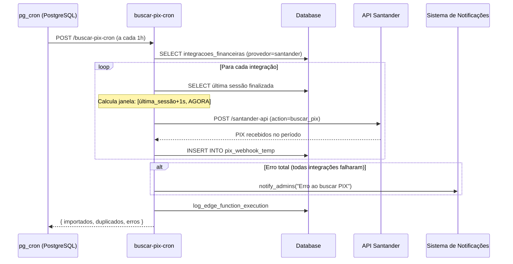

# Automação: Busca Automática de PIX via Cron

**Arquivo:** `supabase/functions/buscar-pix-cron/index.ts`  
**Frequência:** A cada 1 hora (cron: `0 * * * *`)  
**Status:** ✅ Ativo

---

## 📋 Visão Geral

Automatiza a busca de transações PIX recebidas via API Santander, eliminando a dependência exclusiva do webhook (que pode falhar). Insere os PIX na tabela `pix_webhook_temp` para processamento posterior na tela de Conferência de Ofertas.

---

## 🎯 Objetivo

- **Problema:** Webhook do Santander nem sempre entrega notificações de PIX em tempo real
- **Solução:** Polling automático a cada 1h usando a mesma lógica de sincronização da tela de conferência
- **Resultado:** PIX sempre disponíveis para conferência, mesmo sem webhook funcional

---

## 🔄 Fluxo de Execução



---

## 🧮 Lógica de Cálculo do Período

A janela de sincronização usa a mesma lógica de `calcularJanelaSincronizacao` do frontend:

```typescript
// Buscar última sessão finalizada
const { data: ultimaSessao } = await supabase
  .from("sessoes_contagem")
  .select("data_fechamento")
  .eq("igreja_id", integracao.igreja_id)
  .eq("status", "finalizado")
  .order("data_fechamento", { ascending: false })
  .limit(1)
  .maybeSingle();

const fim = new Date(); // AGORA
let inicio: Date;

if (ultimaSessao?.data_fechamento) {
  // Usar 1 segundo após o fechamento da última sessão
  inicio = new Date(ultimaSessao.data_fechamento);
  inicio.setSeconds(inicio.getSeconds() + 1);
} else {
  // Fallback: últimos 7 dias (primeira execução)
  inicio = new Date(Date.now() - 7 * 24 * 60 * 60 * 1000);
}

// Busca PIX entre [inicio, fim]
```

### Exemplo Prático

| Cenário | Última Sessão Finalizada | Período Buscado |
|---------|-------------------------|-----------------|
| Culto domingo 11h | Domingo 11:00:00 | Domingo 11:00:01 → Agora |
| Primeira execução | (nenhuma) | 7 dias atrás → Agora |
| Cultos frequentes | Quarta 22:00:00 | Quarta 22:00:01 → Agora |

---

## 📊 Tabelas Envolvidas

### Leitura
- `integracoes_financeiras` → Buscar integrações Santander ativas
- `sessoes_contagem` → Calcular janela de sincronização
- `edge_function_config` → Verificar se cron está habilitado

### Escrita
- `pix_webhook_temp` → Inserir PIX recebidos
- `edge_function_logs` → Registrar execução e erros
- `notifications` → Notificar admins em caso de erro (via `notify_admins`)

---

## 🔐 Segurança

- ✅ Usa **Service Role Key** (acesso total, bypassa RLS)
- ✅ Credenciais Santander **criptografadas** na tabela `integracoes_financeiras_secrets`
- ✅ Comunicação via **mTLS** (certificado PFX descriptografado em memória)
- ✅ Logs detalhados de todas as execuções

---

## 🚨 Notificações e Alertas

### Quando Notifica Admins?

| Situação | Ação |
|----------|------|
| **Erro total** (todas integrações falharam) | ✅ Notifica com lista de erros |
| **Erro parcial** (algumas falharam) | ⚠️ Não notifica, apenas loga |
| **Sucesso** (todos PIX importados) | ✅ Apenas loga |

### Exemplo de Notificação

```json
{
  "titulo": "Erro ao buscar PIX automaticamente",
  "mensagem": "Falha ao sincronizar PIX via cron. Erros: Integração 123: Certificate expired; Integração 456: Network timeout",
  "tipo": "error",
  "igreja_id": "abc-123"
}
```

---

## 🛠️ Configuração e Deploy

### 1. Migration (pg_cron)

Arquivo: `supabase/migrations/20260526000001_add_cron_buscar_pix.sql`

```sql
select cron.schedule(
  'buscar-pix-automatico',
  '0 * * * *',  -- a cada hora
  $$
    select net.http_post(
      url := current_setting('app.settings.supabase_url') || '/functions/v1/buscar-pix-cron',
      headers := jsonb_build_object(
        'Content-Type', 'application/json',
        'Authorization', 'Bearer ' || current_setting('app.settings.service_role_key')
      ),
      body := '{}'::jsonb
    ) as request_id;
  $$
);
```

### 2. Deploy da Edge Function

```bash
supabase functions deploy buscar-pix-cron
```

### 3. Aplicar Migration

```bash
supabase db push
```

---

## 🧪 Testes

### Teste Manual (Script)

```bash
./test-buscar-pix-cron.sh
```

Resposta esperada:
```json
{
  "success": true,
  "importados": 3,
  "duplicados": 1,
  "erros": []
}
```

### Teste via cURL

```bash
curl -X POST \
  "$SUPABASE_URL/functions/v1/buscar-pix-cron" \
  -H "Authorization: Bearer $SERVICE_ROLE_KEY" \
  -H "Content-Type: application/json" \
  -d '{}'
```

### Verificar Logs

```sql
-- Ver últimas execuções
SELECT * FROM edge_function_logs
WHERE function_name = 'buscar-pix-cron'
ORDER BY created_at DESC
LIMIT 10;

-- Ver PIX importados nas últimas 24h
SELECT COUNT(*) as total, igreja_id
FROM pix_webhook_temp
WHERE created_at >= NOW() - INTERVAL '24 hours'
GROUP BY igreja_id;
```

---

## 📈 Monitoramento

### KPIs Importantes

| Métrica | Query | Alerta Se |
|---------|-------|-----------|
| Execuções com erro | `status='error'` nos logs | > 3 consecutivas |
| PIX importados/hora | `importados` médio | < 1 por 24h (se houver cultos) |
| Integrações falhando | `erros.length > 0` | Mesmo erro > 5x |

### Dashboard Sugerido (Metabase/Grafana)

```sql
-- Gráfico: PIX importados por hora (últimas 48h)
SELECT 
  DATE_TRUNC('hour', created_at) as hora,
  COUNT(*) as pix_importados
FROM pix_webhook_temp
WHERE created_at >= NOW() - INTERVAL '48 hours'
GROUP BY hora
ORDER BY hora;

-- Alerta: Integrações com falhas recorrentes
SELECT 
  igreja_id,
  COUNT(*) as falhas,
  MAX(created_at) as ultima_falha
FROM edge_function_logs
WHERE function_name = 'buscar-pix-cron'
  AND status = 'error'
  AND created_at >= NOW() - INTERVAL '24 hours'
GROUP BY igreja_id
HAVING COUNT(*) > 3;
```

---

## 🔧 Troubleshooting

### Cron não está rodando

```sql
-- Verificar se job existe
SELECT * FROM cron.job WHERE jobname = 'buscar-pix-automatico';

-- Ver últimas execuções do cron
SELECT * FROM cron.job_run_details 
WHERE jobid = (SELECT jobid FROM cron.job WHERE jobname = 'buscar-pix-automatico')
ORDER BY start_time DESC
LIMIT 10;
```

### Recriar job manualmente

```sql
-- Remover job existente
SELECT cron.unschedule('buscar-pix-automatico');

-- Recriar (copiar SQL da migration)
SELECT cron.schedule(...);
```

### Desabilitar temporariamente

```sql
-- Via tabela de config
INSERT INTO edge_function_config (function_name, enabled)
VALUES ('buscar-pix-cron', false)
ON CONFLICT (function_name) 
DO UPDATE SET enabled = false;
```

### Certificado expirado

```sql
-- Ver integrações com erro de certificado
SELECT i.id, i.igreja_id, l.details
FROM integracoes_financeiras i
JOIN edge_function_logs l ON l.details ILIKE '%' || i.id || '%'
WHERE l.function_name = 'buscar-pix-cron'
  AND l.details ILIKE '%certificate%'
ORDER BY l.created_at DESC;
```

→ Solução: Renovar certificado em `/financas/integracoes`

---

## 📚 Referências

- **Edge Function:** `supabase/functions/buscar-pix-cron/index.ts`
- **Migration:** `supabase/migrations/20260526000001_add_cron_buscar_pix.sql`
- **Script de teste:** `test-buscar-pix-cron.sh`
- **Lógica original:** `src/hooks/useFinanceiroSessao.ts` (calcularJanelaSincronizacao)
- **Tela de conferência:** `src/pages/financas/RelatorioOferta.tsx`

---

## ✅ Checklist de Deploy

- [ ] Edge Function `buscar-pix-cron` deployada
- [ ] Migration `20260526000001_add_cron_buscar_pix.sql` aplicada
- [ ] Teste manual rodado com sucesso (`./test-buscar-pix-cron.sh`)
- [ ] Verificado job no `cron.job` (SQL acima)
- [ ] Configurado alerta de monitoramento (dashboard/Slack/email)
- [ ] Documentação atualizada em `docs/automacoes/`
- [ ] Time técnico treinado sobre troubleshooting

---

**Última atualização:** 26/05/2026  
**Responsável:** Sistema de Automação Igreja Carvalho
