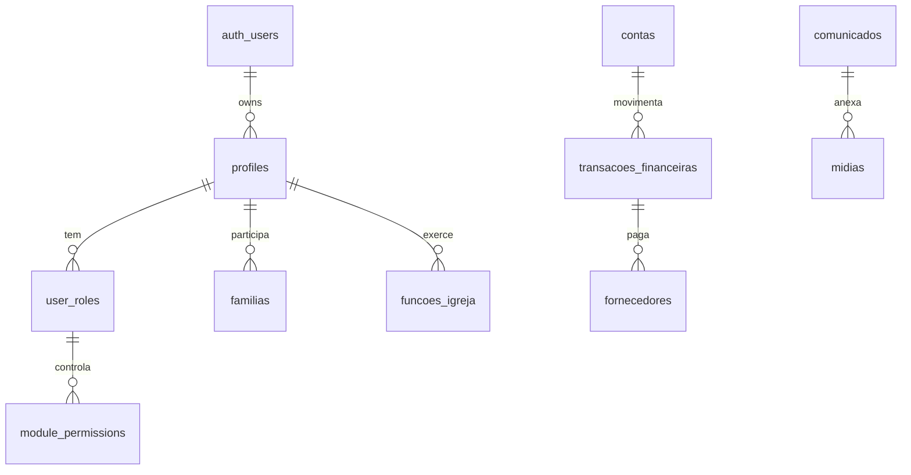
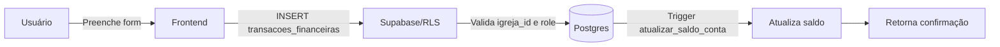

# Diagrama ER - Igreja App

Este documento descreve a estrutura do banco de dados do Igreja App, incluindo todas as tabelas, relacionamentos e regras de negócio.

**Última atualização:** 2024-12-09

## Estatísticas do Banco

| Métrica | Quantidade |
|---------|------------|
| **Tabelas** | 56 |
| **Views** | 5 |
| **Funções RPC** | 26 |
| **Enums** | 9 |

## Como ler este diagrama
- Módulos são agrupados por blocos e comentários `%%` no Mermaid para facilitar navegação.
- Chaves primárias estão marcadas como `PK`; chaves estrangeiras como `FK`.
- Enums e funções RPC listados abaixo complementam o diagrama para consultas rápidas.
- Políticas de RLS não aparecem no Mermaid, mas todas as tabelas expostas a clientes têm RLS habilitado.

## Contexto de autenticação e RLS
- Claims do JWT: `sub` (user id), `role` (papel de negócio), `igreja_id` (escopo), usados em políticas.
- Tabelas críticas: `user_roles`, `user_app_roles`, `module_permissions` controlam o que cada usuário pode ver/editar.
- Para detalhes de fluxo e exemplos de política, ver `01-Arquitetura/02-autenticacao-supabase.MD` e `01-Arquitetura/04-rls-e-seguranca.MD`.

### Diagrama ER resumido
Visão compacta das entidades principais; veja o diagrama completo mais abaixo para todos os campos. Referências: [`01-Arquitetura/04-rls-e-seguranca.MD`](01-Arquitetura/04-rls-e-seguranca.MD) e [`adr/ADR-003-rls-e-modelo-permissoes.md`](adr/ADR-003-rls-e-modelo-permissoes.md).



## Visão Geral dos Módulos

| Módulo | Descrição | Tabelas Principais |
|--------|-----------|-------------------|
| **Autenticação** | Controle de acesso e permissões | `profiles`, `user_roles`, `module_permissions`, `app_roles`, `app_permissions`, `role_permissions`, `user_app_roles` |
| **Pessoas** | Gestão de membros, visitantes e famílias | `profiles`, `familias`, `funcoes_igreja`, `membro_funcoes`, `alteracoes_perfil_pendentes`, `visitante_contatos` |
| **Intercessão** | Pedidos de oração, testemunhos e sentimentos | `intercessores`, `pedidos_oracao`, `testemunhos`, `sentimentos_membros` |
| **Cultos** | Planejamento de cultos e liturgia | `cultos`, `liturgia_culto`, `liturgia_recursos`, `liturgia_templates`, `cancoes_culto`, `presencas_culto` |
| **Times** | Gestão de ministérios e escalas | `categorias_times`, `times_culto`, `posicoes_time`, `membros_time`, `escalas_culto` |
| **Templates** | Templates reutilizáveis de cultos | `templates_culto`, `itens_template_culto`, `escalas_template` |
| **Mídias** | Gestão de arquivos e comunicados | `midias`, `tags_midias`, `midia_tags`, `comunicados`, `banners` |
| **Financeiro** | Controle financeiro completo | `contas`, `transacoes_financeiras`, `categorias_financeiras`, `subcategorias_financeiras`, `fornecedores`, `formas_pagamento`, `centros_custo`, `bases_ministeriais` |
| **Jornadas** | Acompanhamento de cursos e discipulado | `jornadas`, `etapas_jornada`, `inscricoes_jornada` |
| **Ensino** | Gestão de aulas e presenças | `aulas`, `salas`, `presencas_aula` |
| **Kids** | Ministério infantil | `kids_checkins`, `kids_diario` |
| **Projetos** | Gestão de projetos e tarefas | `projetos`, `tarefas` |
| **Configurações** | Configurações do sistema | `configuracoes_igreja`, `edge_function_config`, `notifications` |

---

## Pessoas / Membros — entidades e relações
- **profiles**: cadastro unificado de pessoas (visitante/frequentador/membro); PK `id`; FK explícita `user_id -> auth.users.id`; inclui dados pessoais, contatos, status (`user_status`), datas (visita, batismo, casamento), flags de liderança/pastorado e observações.
- **familias**: relacionamentos de parentesco entre pessoas; PK `id`; colunas `pessoa_id`, `familiar_id` (referenciam perfis, sem FK explícita no script), `tipo_parentesco`, timestamps.
- **funcoes_igreja**: catálogo de funções ministeriais; PK `id`; campos `nome`, `descricao`, `ativo`.
- **membro_funcoes**: atribuição de funções a pessoas; PK `id`; FK `funcao_id -> funcoes_igreja.id`; coluna `membro_id` (referencia perfil), datas de início/fim, flag `ativo`.
- **alteracoes_perfil_pendentes**: fila de alterações de perfil para aprovação; PK `id`; colunas `profile_id` (perfil alvo), `dados_antigos`, `dados_novos`, `campos_aprovados`, `status`, `aprovado_por`, timestamps.

Relações principais
- `profiles.user_id` associa o perfil ao usuário de autenticação (`auth.users`).
- `membro_funcoes.funcao_id` referencia `funcoes_igreja.id` para atribuição de função.
- `familias` armazena vínculos pessoa ↔ familiar, permitindo múltiplos relacionamentos por perfil.
- `alteracoes_perfil_pendentes` guarda propostas de edição ligadas a um `profile_id` e, quando aprovado, registra quem aprovou.

Fonte de esquema: [`database-schema.sql`](database-schema.sql)

## Diagrama ER Completo

---

## Pessoas / Membros — modelo de dados

Com base exclusiva no `database-schema.sql`, as tabelas relacionadas a Pessoas/Membros são:

- `profiles` — cadastro unificado de pessoas com dados pessoais, contato e status.
    - PK: `id`
    - FK: `user_id` → `auth.users(id)`
    - Observações: inclui campos de datas (visitas, batismo, casamento), indicadores (`e_lider`, `e_pastor`) e metadados de criação/atualização.

- `funcoes_igreja` — catálogo de funções ministeriais.
    - PK: `id`
    - Observações: `nome`, `descricao`, flag `ativo` e timestamps.

- `membro_funcoes` — atribuições de funções para perfis.
    - PK: `id`
    - FK: `funcao_id` → `funcoes_igreja(id)`
    - Observações: `membro_id` (referencia um perfil), datas de início/fim e flag `ativo`.

- `familias` — vínculos familiares entre perfis.
    - PK: `id`
    - Observações: `pessoa_id`, `familiar_id`, `tipo_parentesco`, timestamps (sem FK explícita no script para `profiles`).

- `alteracoes_perfil_pendentes` — fila de alterações de perfil para aprovação.
    - PK: `id`
    - Observações: `profile_id` (perfil alvo), `dados_antigos`, `dados_novos`, `campos_aprovados`, `status`, `aprovado_por`, timestamps.

Relações relevantes (explicitadas no schema):
- `profiles.user_id` associa perfis a usuários de autenticação (`auth.users`).
- `membro_funcoes.funcao_id` vincula atribuições ao catálogo `funcoes_igreja`.

Relações utilizadas (sem FK explícita no schema, mas presentes por convenção):
- `familias.pessoa_id` e `familias.familiar_id` referenciam `profiles.id` para construção de vínculos.
- `alteracoes_perfil_pendentes.profile_id` referencia `profiles.id` para controle de aprovações.

Referência: [`database-schema.sql`](database-schema.sql)

```mermaid
erDiagram
    %% =============================================
    %% AUTENTICAÇÃO E PERFIS
    %% =============================================
    profiles {
        uuid id PK
        uuid user_id FK
        uuid familia_id FK
        text nome
        text email
        text telefone
        user_status status
        text avatar_url
        date data_nascimento
        date data_batismo
        date data_casamento
        date data_cadastro_membro
        boolean batizado
        boolean e_pastor
        boolean e_lider
        text cpf
        text estado_civil
        text profissao
        text endereco
        text cep
        text cidade
        text estado
        text tipo_pessoa
        text entrou_por
        integer dia_nascimento
        integer mes_nascimento
        text observacoes
        text alergias
        text necessidades_especiais
        text formacao
        text motivo_entrada
        timestamp created_at
        timestamp updated_at
    }
    
    user_roles {
        uuid id PK
        uuid user_id FK
        app_role role
        timestamp created_at
    }
    
    app_roles {
        bigint id PK
        text name
        text description
        boolean is_system
        timestamp created_at
    }
    
    app_permissions {
        bigint id PK
        text key
        text name
        text module
        text description
    }
    
    role_permissions {
        uuid id PK
        bigint role_id FK
        bigint permission_id FK
        timestamp created_at
    }
    
    user_app_roles {
        uuid id PK
        uuid user_id FK
        bigint role_id FK
        timestamp created_at
    }
    
    module_permissions {
        uuid id PK
        app_role role
        text module_name
        access_level access_level
    }
    
    notifications {
        uuid id PK
        uuid user_id FK
        uuid related_user_id FK
        text title
        text message
        text type
        boolean read
        jsonb metadata
        timestamp created_at
    }

    %% =============================================
    %% PESSOAS E FAMÍLIAS
    %% =============================================
    familias {
        uuid id PK
        uuid pessoa_id FK
        uuid familiar_id FK
        text tipo_parentesco
        text nome_familiar
        timestamp created_at
        timestamp updated_at
    }
    
    funcoes_igreja {
        uuid id PK
        text nome
        text descricao
        boolean ativo
        timestamp created_at
        timestamp updated_at
    }
    
    membro_funcoes {
        uuid id PK
        uuid membro_id FK
        uuid funcao_id FK
        date data_inicio
        date data_fim
        boolean ativo
        timestamp created_at
        timestamp updated_at
    }
    
    alteracoes_perfil_pendentes {
        uuid id PK
        uuid profile_id FK
        uuid aprovado_por FK
        jsonb dados_antigos
        jsonb dados_novos
        jsonb campos_aprovados
        text status
        text observacoes
        timestamp created_at
        timestamp updated_at
    }
    
    visitante_contatos {
        uuid id PK
        uuid visitante_id FK
        uuid responsavel_id FK
        timestamp data_agendada
        text tipo
        text status
        text observacoes
        timestamp created_at
        timestamp updated_at
    }

    %% =============================================
    %% INTERCESSÃO
    %% =============================================
    intercessores {
        uuid id PK
        uuid user_id FK
        text nome
        text email
        text telefone
        integer max_pedidos
        boolean ativo
        timestamp created_at
        timestamp updated_at
    }
    
    pedidos_oracao {
        uuid id PK
        uuid pessoa_id FK
        uuid intercessor_id FK
        text pedido
        status_pedido status
        tipo_pedido tipo
        boolean anonimo
        boolean urgente
        text nome_solicitante
        text email_externo
        text telefone_externo
        timestamp data_alocacao
        timestamp data_resposta
        text resposta
        timestamp created_at
        timestamp updated_at
    }
    
    testemunhos {
        uuid id PK
        uuid autor_id FK
        uuid aprovado_por FK
        text titulo
        text conteudo
        categoria_testemunho categoria
        status_testemunho status
        boolean anonimo
        text nome_externo
        text email_externo
        text telefone_externo
        timestamp data_publicacao
        timestamp created_at
        timestamp updated_at
    }
    
    sentimentos_membros {
        uuid id PK
        uuid pessoa_id FK
        sentimento_tipo sentimento
        text mensagem
        timestamp data_registro
        timestamp created_at
    }

    %% =============================================
    %% CULTOS E LITURGIA
    %% =============================================
    cultos {
        uuid id PK
        uuid created_by FK
        text titulo
        text tipo
        timestamp data_culto
        integer duracao_minutos
        text status
        text pregador
        text tema
        text local
        text endereco
        text descricao
        text observacoes
        boolean exibir_preletor
        timestamp created_at
        timestamp updated_at
    }
    
    liturgia_culto {
        uuid id PK
        uuid culto_id FK
        uuid responsavel_id FK
        text titulo
        text tipo
        text descricao
        text responsavel_externo
        integer ordem
        integer duracao_minutos
        boolean permite_multiplo
        uuid[] midias_ids
        timestamp created_at
        timestamp updated_at
    }
    
    liturgia_recursos {
        uuid id PK
        uuid liturgia_item_id FK
        uuid midia_id FK
        integer ordem
        integer duracao_segundos
        timestamp created_at
    }
    
    liturgia_templates {
        uuid id PK
        text nome
        text descricao
        jsonb estrutura_json
        timestamp created_at
        timestamp updated_at
    }
    
    cancoes_culto {
        uuid id PK
        uuid culto_id FK
        uuid ministro_id FK
        uuid solista_id FK
        text titulo
        text artista
        text tom
        integer bpm
        integer ordem
        integer duracao_minutos
        text cifra
        text letra
        text link_youtube
        text link_spotify
        text observacoes
        timestamp created_at
        timestamp updated_at
    }
    
    presencas_culto {
        uuid id PK
        uuid culto_id FK
        uuid pessoa_id FK
        uuid validado_por FK
        text metodo
        text tipo_registro
        timestamp created_at
    }

    %% =============================================
    %% TIMES E ESCALAS
    %% =============================================
    categorias_times {
        uuid id PK
        text nome
        text cor
        boolean ativo
        timestamp created_at
        timestamp updated_at
    }
    
    times_culto {
        uuid id PK
        uuid categoria_id FK
        uuid lider_id FK
        uuid sublider_id FK
        text nome
        text descricao
        boolean ativo
        timestamp created_at
        timestamp updated_at
    }
    
    posicoes_time {
        uuid id PK
        uuid time_id FK
        text nome
        text descricao
        boolean ativo
        timestamp created_at
        timestamp updated_at
    }
    
    membros_time {
        uuid id PK
        uuid time_id FK
        uuid pessoa_id FK
        uuid posicao_id FK
        date data_entrada
        boolean ativo
        timestamp created_at
        timestamp updated_at
    }
    
    escalas_culto {
        uuid id PK
        uuid culto_id FK
        uuid time_id FK
        uuid pessoa_id FK
        uuid posicao_id FK
        boolean confirmado
        text status_confirmacao
        text observacoes
        text motivo_recusa
        timestamp created_at
        timestamp updated_at
    }

    %% =============================================
    %% TEMPLATES
    %% =============================================
    templates_culto {
        uuid id PK
        text nome
        text tipo_culto
        text categoria
        text tema_padrao
        text local_padrao
        text pregador_padrao
        text observacoes_padrao
        integer duracao_padrao
        boolean ativo
        timestamp created_at
        timestamp updated_at
    }
    
    itens_template_culto {
        uuid id PK
        uuid template_id FK
        text titulo
        text tipo
        text descricao
        text responsavel_externo
        integer ordem
        integer duracao_minutos
        uuid[] midias_ids
        timestamp created_at
        timestamp updated_at
    }
    
    escalas_template {
        uuid id PK
        uuid template_id FK
        uuid time_id FK
        uuid pessoa_id FK
        uuid posicao_id FK
        text observacoes
        timestamp created_at
        timestamp updated_at
    }

    %% =============================================
    %% MÍDIAS
    %% =============================================
    midias {
        uuid id PK
        uuid culto_id FK
        uuid created_by FK
        text titulo
        text descricao
        text tipo
        text url
        text canal
        text[] tags
        integer ordem
        boolean ativo
        timestamp scheduled_at
        timestamp expires_at
        timestamp created_at
        timestamp updated_at
    }
    
    tags_midias {
        uuid id PK
        text nome
        text cor
        timestamp created_at
    }
    
    midia_tags {
        uuid id PK
        uuid midia_id FK
        uuid tag_id FK
        timestamp created_at
    }

    %% =============================================
    %% COMUNICADOS
    %% =============================================
    comunicados {
        uuid id PK
        uuid culto_id FK
        uuid midia_id FK
        uuid created_by FK
        text titulo
        text descricao
        tipo_comunicado tipo
        text nivel_urgencia
        text imagem_url
        text url_arquivo_telao
        text link_acao
        text categoria_midia
        text[] tags
        integer ordem_telao
        boolean exibir_app
        boolean exibir_telao
        boolean exibir_site
        boolean ativo
        timestamp data_inicio
        timestamp data_fim
        timestamp created_at
        timestamp updated_at
    }
    
    banners {
        uuid id PK
        uuid created_by FK
        text title
        text message
        text type
        text image_url
        boolean active
        timestamp scheduled_at
        timestamp expires_at
        timestamp created_at
        timestamp updated_at
    }

    %% =============================================
    %% FINANCEIRO
    %% =============================================
    contas {
        uuid id PK
        text nome
        text tipo
        text banco
        text agencia
        text conta_numero
        text observacoes
        numeric saldo_atual
        numeric saldo_inicial
        boolean ativo
        timestamp created_at
        timestamp updated_at
    }
    
    bases_ministeriais {
        uuid id PK
        uuid responsavel_id FK
        text titulo
        text descricao
        boolean ativo
        timestamp created_at
        timestamp updated_at
    }
    
    categorias_financeiras {
        uuid id PK
        text nome
        text tipo
        text secao_dre
        text cor
        boolean ativo
        timestamp created_at
        timestamp updated_at
    }
    
    subcategorias_financeiras {
        uuid id PK
        uuid categoria_id FK
        text nome
        boolean ativo
        timestamp created_at
        timestamp updated_at
    }
    
    centros_custo {
        uuid id PK
        uuid base_ministerial_id FK
        text nome
        text descricao
        boolean ativo
        timestamp created_at
        timestamp updated_at
    }
    
    formas_pagamento {
        uuid id PK
        text nome
        boolean ativo
        timestamp created_at
        timestamp updated_at
    }
    
    fornecedores {
        uuid id PK
        text nome
        text cpf_cnpj
        text tipo_pessoa
        text email
        text telefone
        text endereco
        text cidade
        text estado
        text cep
        text observacoes
        boolean ativo
        timestamp created_at
        timestamp updated_at
    }
    
    transacoes_financeiras {
        uuid id PK
        uuid conta_id FK
        uuid categoria_id FK
        uuid subcategoria_id FK
        uuid fornecedor_id FK
        uuid centro_custo_id FK
        uuid forma_pagamento_id FK
        uuid created_by FK
        uuid conferido_por FK
        uuid pago_por FK
        text descricao
        text observacoes
        text numero_documento
        text comprovante_url
        numeric valor
        text tipo
        text status
        date data_competencia
        date data_vencimento
        date data_pagamento
        boolean conferido
        boolean recorrente
        text frequencia_recorrencia
        timestamp created_at
        timestamp updated_at
    }

    %% =============================================
    %% JORNADAS E ENSINO
    %% =============================================
    jornadas {
        uuid id PK
        text titulo
        text descricao
        text cor_tema
        boolean ativo
        boolean exibir_portal
        timestamp created_at
        timestamp updated_at
    }
    
    etapas_jornada {
        uuid id PK
        uuid jornada_id FK
        uuid aula_vinculada_id FK
        text titulo
        text tipo_conteudo
        text conteudo_texto
        text conteudo_url
        integer ordem
        timestamp created_at
        timestamp updated_at
    }
    
    inscricoes_jornada {
        uuid id PK
        uuid jornada_id FK
        uuid pessoa_id FK
        uuid etapa_atual_id FK
        uuid responsavel_id FK
        boolean concluido
        timestamp data_entrada
        timestamp data_mudanca_fase
        timestamp created_at
        timestamp updated_at
    }
    
    aulas {
        uuid id PK
        uuid sala_id FK
        uuid jornada_id FK
        uuid culto_id FK
        uuid professor_id FK
        text tema
        text modalidade
        text status
        text link_reuniao
        timestamp data_inicio
        integer duracao_minutos
        timestamp created_at
        timestamp updated_at
    }
    
    salas {
        uuid id PK
        text nome
        text descricao
        integer capacidade
        text tipo
        boolean ativo
        timestamp created_at
        timestamp updated_at
    }
    
    presencas_aula {
        uuid id PK
        uuid aula_id FK
        uuid aluno_id FK
        uuid etapa_id FK
        uuid registrado_por FK
        text status
        text attendance_mode
        text observacoes
        timestamp checkout_at
        timestamp created_at
        timestamp updated_at
    }

    %% =============================================
    %% KIDS (MINISTÉRIO INFANTIL)
    %% =============================================
    kids_checkins {
        uuid id PK
        uuid crianca_id FK
        uuid responsavel_id FK
        uuid culto_id FK
        uuid checkin_por FK
        uuid checkout_por FK
        text observacoes
        timestamp checkin_at
        timestamp checkout_at
        timestamp created_at
        timestamp updated_at
    }
    
    kids_diario {
        uuid id PK
        uuid crianca_id FK
        uuid professor_id FK
        uuid culto_id FK
        date data
        text humor
        text observacoes
        text[] comportamento_tags
        text[] necessidades_tags
        timestamp created_at
        timestamp updated_at
    }

    %% =============================================
    %% PROJETOS
    %% =============================================
    projetos {
        uuid id PK
        uuid responsavel_id FK
        uuid created_by FK
        text titulo
        text descricao
        text status
        date data_inicio
        date data_fim
        timestamp created_at
        timestamp updated_at
    }
    
    tarefas {
        uuid id PK
        uuid projeto_id FK
        uuid responsavel_id FK
        uuid created_by FK
        text titulo
        text descricao
        text status
        text prioridade
        date data_vencimento
        timestamp created_at
        timestamp updated_at
    }

    %% =============================================
    %% CONFIGURAÇÕES
    %% =============================================
    configuracoes_igreja {
        uuid id PK
        text nome_igreja
        text subtitulo
        text logo_url
        text webhook_make_liturgia
        timestamp created_at
        timestamp updated_at
    }
    
    edge_function_config {
        uuid id PK
        text function_name
        text schedule_cron
        text schedule_description
        text last_execution_status
        integer execution_count
        boolean enabled
        timestamp last_execution
        timestamp created_at
        timestamp updated_at
    }

    %% =============================================
    %% RELACIONAMENTOS
    %% =============================================
    
    %% Autenticação
    profiles ||--o{ user_roles : "has"
    profiles ||--o{ user_app_roles : "has"
    app_roles ||--o{ user_app_roles : "assigned_to"
    app_roles ||--o{ role_permissions : "has"
    app_permissions ||--o{ role_permissions : "granted_by"
    profiles ||--o{ notifications : "receives"
    
    %% Pessoas e Famílias
    profiles ||--o{ familias : "pessoa"
    profiles ||--o{ familias : "familiar"
    profiles ||--o{ membro_funcoes : "has"
    funcoes_igreja ||--o{ membro_funcoes : "assigned"
    profiles ||--o{ alteracoes_perfil_pendentes : "pending"
    profiles ||--o{ visitante_contatos : "visitante"
    profiles ||--o{ visitante_contatos : "responsavel"
    
    %% Intercessão
    profiles ||--o{ pedidos_oracao : "requests"
    intercessores ||--o{ pedidos_oracao : "handles"
    profiles ||--o{ testemunhos : "writes"
    profiles ||--o{ sentimentos_membros : "registers"
    
    %% Cultos e Liturgia
    cultos ||--o{ liturgia_culto : "contains"
    liturgia_culto ||--o{ liturgia_recursos : "has"
    midias ||--o{ liturgia_recursos : "used_in"
    profiles ||--o{ liturgia_culto : "responsible"
    cultos ||--o{ cancoes_culto : "has"
    profiles ||--o{ cancoes_culto : "ministro"
    profiles ||--o{ cancoes_culto : "solista"
    cultos ||--o{ presencas_culto : "attendance"
    profiles ||--o{ presencas_culto : "attends"
    
    %% Times e Escalas
    categorias_times ||--o{ times_culto : "categorizes"
    times_culto ||--o{ posicoes_time : "has"
    times_culto ||--o{ membros_time : "members"
    profiles ||--o{ membros_time : "belongs"
    profiles ||--o{ times_culto : "lider"
    profiles ||--o{ times_culto : "sublider"
    cultos ||--o{ escalas_culto : "schedules"
    times_culto ||--o{ escalas_culto : "assigned"
    profiles ||--o{ escalas_culto : "scheduled"
    
    %% Templates
    templates_culto ||--o{ itens_template_culto : "contains"
    templates_culto ||--o{ escalas_template : "schedules"
    times_culto ||--o{ escalas_template : "assigned"
    
    %% Mídias
    midias ||--o{ midia_tags : "tagged"
    tags_midias ||--o{ midia_tags : "tags"
    cultos ||--o{ midias : "has"
    cultos ||--o{ comunicados : "announces"
    midias ||--o{ comunicados : "uses"
    
    %% Financeiro
    contas ||--o{ transacoes_financeiras : "account"
    categorias_financeiras ||--o{ subcategorias_financeiras : "has"
    categorias_financeiras ||--o{ transacoes_financeiras : "categorizes"
    subcategorias_financeiras ||--o{ transacoes_financeiras : "subcategorizes"
    fornecedores ||--o{ transacoes_financeiras : "supplier"
    centros_custo ||--o{ transacoes_financeiras : "cost_center"
    formas_pagamento ||--o{ transacoes_financeiras : "payment_method"
    bases_ministeriais ||--o{ centros_custo : "has"
    profiles ||--o{ bases_ministeriais : "responsible"
    
    %% Jornadas e Ensino
    jornadas ||--o{ etapas_jornada : "stages"
    jornadas ||--o{ inscricoes_jornada : "enrollments"
    jornadas ||--o{ aulas : "classes"
    etapas_jornada ||--o{ inscricoes_jornada : "current"
    profiles ||--o{ inscricoes_jornada : "enrolled"
    profiles ||--o{ inscricoes_jornada : "responsible"
    salas ||--o{ aulas : "location"
    cultos ||--o{ aulas : "linked"
    profiles ||--o{ aulas : "professor"
    aulas ||--o{ presencas_aula : "attendance"
    profiles ||--o{ presencas_aula : "student"
    etapas_jornada ||--o{ presencas_aula : "stage"
    
    %% Kids
    profiles ||--o{ kids_checkins : "crianca"
    profiles ||--o{ kids_checkins : "responsavel"
    cultos ||--o{ kids_checkins : "event"
    profiles ||--o{ kids_diario : "crianca"
    profiles ||--o{ kids_diario : "professor"
    cultos ||--o{ kids_diario : "event"
    
    %% Projetos
    projetos ||--o{ tarefas : "has"
    profiles ||--o{ projetos : "responsible"
    profiles ||--o{ tarefas : "assigned"
```

---

## Kids — entidades e relações

Fonte exclusiva: [`database-schema.sql`](database-schema.sql)

Com base no schema atual (gerado em 2025-12-03):

- Tabelas relacionadas a Kids/crianças:
    - Não há tabelas `kids_*` definidas neste arquivo de schema.

- Tabelas relacionadas a guardians/autorizados:
    - `familias` — vínculos de parentesco entre perfis.
        - PK: `id`
        - Colunas-chave: `pessoa_id`, `familiar_id`, `tipo_parentesco`, `nome_familiar`, timestamps
        - FKs explícitas: não declaradas no script para `profiles` (uso por convenção)
        - Propósito: modelar relações familiares que podem ser usadas pela aplicação para determinar responsáveis autorizados.

- Tabelas relacionadas a notificações Kids (se existirem):
    - Não há tabelas de notificações específicas do módulo Kids neste schema.
    - Existe a tabela genérica `notifications` (notificações do sistema em geral).
        - PK: `id`
        - Colunas-chave: `user_id`, `title`, `message`, `type`, `read`, `related_user_id`, `metadata`, `created_at`
        - FKs explícitas: não declaradas no script (por exemplo, `user_id` não referencia `profiles` via FK neste arquivo)
        - Propósito: armazenar notificações destinadas a usuários do sistema (múltiplos módulos podem utilizá-la).

Observação: Este resumo reflete exclusivamente o conteúdo presente em [`database-schema.sql`](database-schema.sql). Caso existam tabelas `kids_*` ou views relacionadas em migrações separadas, elas não constam neste arquivo e, portanto, não foram consideradas aqui.

## Views do Sistema

| View | Descrição |
|------|-----------|
| `view_absent_kids` | Crianças ausentes (não fizeram checkout) |
| `view_health_score` | Score de saúde espiritual dos membros |
| `view_kids_checkins_ativos` | Check-ins ativos do ministério kids |
| `view_kids_diario` | Diário consolidado do ministério kids |
| `view_room_occupancy` | Ocupação atual das salas |

---

## Enums do Sistema

| Enum | Valores | Descrição |
|------|---------|-----------|
| `app_role` | `admin`, `pastor`, `lider`, `secretario`, `tesoureiro`, `professor`, `membro`, `basico` | Papéis de usuário no sistema |
| `access_level` | `visualizar`, `criar_editar`, `aprovar_gerenciar`, `acesso_completo` | Níveis de acesso por módulo |
| `user_status` | `visitante`, `frequentador`, `membro` | Status de progressão do usuário |
| `status_pedido` | `pendente`, `em_oracao`, `respondido`, `arquivado` | Status de pedidos de oração |
| `tipo_pedido` | `saude`, `familia`, `financeiro`, `trabalho`, `espiritual`, `agradecimento`, `outro` | Tipos de pedidos de oração |
| `categoria_testemunho` | `espiritual`, `casamento`, `familia`, `saude`, `trabalho`, `financeiro`, `ministerial`, `outro` | Categorias de testemunhos |
| `status_testemunho` | `aberto`, `publico`, `arquivado` | Status de testemunhos |
| `sentimento_tipo` | `feliz`, `cuidadoso`, `abencoado`, `grato`, `angustiado`, `sozinho`, `triste`, `doente`, `com_pouca_fe` | Tipos de sentimentos para registro |
| `tipo_comunicado` | `banner`, `alerta` | Tipos de comunicados |

---

## Funções RPC Principais

| Função | Retorno | Descrição |
|--------|---------|-----------|
| `has_role(user_id, role)` | boolean | Verifica se usuário possui determinado papel |
| `is_member(user_id)` | boolean | Verifica se usuário é membro |
| `get_user_module_access(user_id, module)` | access_level | Retorna nível de acesso do usuário em um módulo |
| `get_user_familia_id(user_id)` | uuid | Retorna ID da família do usuário |
| `alocar_pedido_balanceado(pedido_id)` | uuid | Aloca pedido de oração para intercessor de forma balanceada |
| `buscar_pessoa_por_contato(nome, email, telefone)` | uuid | Busca pessoa por informações de contato |
| `checkin_por_localizacao(telefone, lat, long)` | jsonb | Realiza check-in via geolocalização |
| `get_minha_lista_chamada(culto_id)` | record | Retorna lista de chamada para líder |
| `get_ovelhas_em_risco()` | record | Retorna membros que precisam de atenção pastoral |
| `get_dre_anual(ano)` | record | Retorna DRE anual para relatório financeiro |
| `notify_admins(title, message, type, ...)` | void | Envia notificação para administradores |
| `atualizar_saldo_conta()` | trigger | Trigger para atualizar saldo de conta após transação |
| `handle_new_user()` | trigger | Trigger para criar perfil ao registrar novo usuário |
| `registrar_presenca_culto_kids()` | trigger | Trigger para registrar presença após checkout kids |

---

## Storage Buckets

| Bucket | Público | Descrição |
|--------|---------|-----------|
| `avatars` | ✅ Sim | Fotos de perfil dos usuários |
| `banner-images` | ✅ Sim | Imagens dos banners |
| `comunicados` | ✅ Sim | Arquivos de comunicados |
| `midias` | ✅ Sim | Mídias gerais (vídeos, imagens) |
| `igreja-logo` | ✅ Sim | Logo da igreja |
| `transacoes-anexos` | ❌ Não | Comprovantes de transações financeiras |
| `transaction-attachments` | ❌ Não | Anexos de transações (notas fiscais) |

---

## Resumo por Módulo

| Módulo | Tabelas | Descrição |
|--------|---------|-----------|
| **Autenticação** | 7 | profiles, user_roles, app_roles, app_permissions, role_permissions, user_app_roles, module_permissions |
| **Pessoas** | 5 | familias, funcoes_igreja, membro_funcoes, alteracoes_perfil_pendentes, visitante_contatos |
| **Intercessão** | 4 | intercessores, pedidos_oracao, testemunhos, sentimentos_membros |
| **Cultos** | 6 | cultos, liturgia_culto, liturgia_recursos, liturgia_templates, cancoes_culto, presencas_culto |
| **Times** | 5 | categorias_times, times_culto, posicoes_time, membros_time, escalas_culto |
| **Templates** | 3 | templates_culto, itens_template_culto, escalas_template |
| **Mídias** | 5 | midias, tags_midias, midia_tags, comunicados, banners |
| **Financeiro** | 8 | contas, transacoes_financeiras, categorias_financeiras, subcategorias_financeiras, fornecedores, formas_pagamento, centros_custo, bases_ministeriais |
| **Jornadas/Ensino** | 6 | jornadas, etapas_jornada, inscricoes_jornada, aulas, salas, presencas_aula |
| **Kids** | 2 | kids_checkins, kids_diario |
| **Projetos** | 2 | projetos, tarefas |
| **Config** | 3 | configuracoes_igreja, edge_function_config, notifications |
| **TOTAL** | **56** | |

---

## Financeiro — Entidades e Relações

### Objetivo
O módulo financeiro implementa a separação entre **Fato Gerador** (competência), **Fluxo de Caixa** (transações) e **DRE** (resultado contábil), conforme [ADR-001](adr/ADR-001-separacao-fato-gerador-caixa-dre.md). Esta arquitetura garante relatórios contábeis precisos independente da forma de pagamento.

### Tabelas Principais

#### 1. `contas`
**Função**: Representa contas bancárias, virtuais ou físicas (caixa).

**Campos-chave**:
- `id` (PK): Identificador único
- `nome`: Nome da conta (ex: "Conta Corrente Caixa", "Caixa Física")
- `tipo`: Tipo de conta (corrente, poupança, caixa)
- `saldo_atual`: Saldo em tempo real (atualizado por trigger)
- `saldo_inicial`: Saldo de abertura da conta
- `ativo`: Se a conta está ativa

**Relacionamentos**:
- `contas` 1→N `transacoes_financeiras`: Uma conta tem múltiplas transações

**Regras de Negócio**:
- Saldo é atualizado automaticamente via trigger `atualizar_saldo_conta()` após inserção/atualização/exclusão em `transacoes_financeiras`
- Apenas contas ativas podem receber novas transações
- RLS: Usuário só vê contas da própria igreja

#### 2. `categorias_financeiras`
**Função**: Classificação contábil das transações para composição do DRE.

**Campos-chave**:
- `id` (PK): Identificador único
- `nome`: Nome da categoria (ex: "Despesas Administrativas", "Receitas de Dízimo")
- `tipo`: "receita" ou "despesa"
- `secao_dre`: Seção no DRE (Receitas Operacionais, Despesas Operacionais, etc.)
- `cor`: Cor para visualização (hex)

**Relacionamentos**:
- `categorias_financeiras` 1→N `subcategorias_financeiras`: Uma categoria tem múltiplas subcategorias
- `categorias_financeiras` 1→N `transacoes_financeiras`: Uma categoria classifica múltiplas transações

**Regras de Negócio**:
- Categoria define onde o lançamento aparece no DRE
- Mudança de categoria altera o DRE retroativamente (reprocessamento de views)
- Categorias inativas não podem ser usadas em novas transações

#### 3. `subcategorias_financeiras`
**Função**: Detalhamento de categorias para maior granularidade.

**Campos-chave**:
- `id` (PK): Identificador único
- `categoria_id` (FK → `categorias_financeiras`): Categoria pai
- `nome`: Nome da subcategoria (ex: "Material de Escritório", "Energia Elétrica")

**Relacionamentos**:
- `subcategorias_financeiras` N→1 `categorias_financeiras`: Subcategoria pertence a uma categoria
- `subcategorias_financeiras` 1→N `transacoes_financeiras`: Subcategoria detalha múltiplas transações

#### 4. `fornecedores`
**Função**: Cadastro de pessoas/empresas que recebem pagamentos ou fazem doações.

**Campos-chave**:
- `id` (PK): Identificador único
- `nome`: Nome do fornecedor
- `cpf_cnpj`: CPF ou CNPJ
- `tipo_pessoa`: "fisica" ou "juridica"
- `email`, `telefone`, `endereco`: Dados de contato

**Relacionamentos**:
- `fornecedores` 1→N `transacoes_financeiras`: Um fornecedor participa de múltiplas transações

**Regras de Negócio**:
- Sistema sugere categoria com base em histórico do fornecedor (machine learning simples)
- Fornecedores inativos não aparecem em novas transações (mas histórico permanece)

#### 5. `formas_pagamento`
**Função**: Define como o dinheiro foi pago/recebido (PIX, boleto, dinheiro, etc.).

**Campos-chave**:
- `id` (PK): Identificador único
- `nome`: Nome da forma de pagamento

**Relacionamentos**:
- `formas_pagamento` 1→N `transacoes_financeiras`: Uma forma de pagamento é usada em múltiplas transações

**Regras de Negócio**:
- Forma de pagamento **não altera o DRE** (apenas impacta o caixa)

#### 6. `bases_ministeriais`
**Função**: Segmentação de custos por unidade ministerial (Sede, Filial, Ministério específico).

**Campos-chave**:
- `id` (PK): Identificador único
- `responsavel_id` (FK → `profiles`): Líder responsável
- `titulo`: Nome da base (ex: "Sede", "Filial Bairro X")

**Relacionamentos**:
- `bases_ministeriais` N→1 `profiles`: Base tem um responsável
- `bases_ministeriais` 1→N `centros_custo`: Base tem múltiplos centros de custo

**Regras de Negócio**:
- Permite DRE segmentado por base ministerial
- Responsável pode ter permissões restritas à sua base

#### 7. `centros_custo`
**Função**: Classificação de despesas por departamento/projeto dentro de uma base ministerial.

**Campos-chave**:
- `id` (PK): Identificador único
- `base_ministerial_id` (FK → `bases_ministeriais`): Base à qual pertence
- `nome`: Nome do centro de custo (ex: "Manutenção", "Evangelismo")

**Relacionamentos**:
- `centros_custo` N→1 `bases_ministeriais`: Centro de custo pertence a uma base
- `centros_custo` 1→N `transacoes_financeiras`: Centro de custo classifica múltiplas transações

#### 8. `transacoes_financeiras` (Tabela Central)
**Função**: Registra movimentações de caixa (pagamentos e recebimentos).

**Campos-chave**:
- `id` (PK): Identificador único
- `conta_id` (FK → `contas`): Conta movimentada
- `categoria_id` (FK → `categorias_financeiras`): Classificação contábil
- `subcategoria_id` (FK → `subcategorias_financeiras`): Detalhamento opcional
- `fornecedor_id` (FK → `fornecedores`): De quem/para quem
- `centro_custo_id` (FK → `centros_custo`): Departamento/projeto
- `forma_pagamento_id` (FK → `formas_pagamento`): Como foi pago
- `created_by`, `conferido_por`, `pago_por` (FK → `profiles`): Auditoria
- `descricao`: Descrição da transação
- `valor`: Valor em reais
- `tipo`: "entrada" ou "saida"
- `status`: "pendente", "pago", "conciliado"
- `data_competencia`: Mês/ano de referência contábil (para DRE)
- `data_vencimento`: Data de vencimento
- `data_pagamento`: Data efetiva do pagamento
- `conferido`: Se foi conferido por segundo responsável
- `recorrente`: Se é uma transação recorrente
- `comprovante_url`: Link para comprovante em storage

**Relacionamentos**:
- `transacoes_financeiras` N→1 `contas`: Transação pertence a uma conta
- `transacoes_financeiras` N→1 `categorias_financeiras`: Transação é classificada por categoria
- `transacoes_financeiras` N→1 `subcategorias_financeiras`: Transação pode ter subcategoria
- `transacoes_financeiras` N→1 `fornecedores`: Transação envolve um fornecedor
- `transacoes_financeiras` N→1 `centros_custo`: Transação pode ter centro de custo
- `transacoes_financeiras` N→1 `formas_pagamento`: Transação usa uma forma de pagamento
- `transacoes_financeiras` N→1 `profiles` (multiple): Auditoria de quem criou, conferiu, pagou

**Regras de Negócio**:
- **Fato Gerador**: `data_competencia` define quando aparece no DRE
- **Caixa**: `data_pagamento` define quando afeta o saldo da conta
- **Parcelamento**: Múltiplas transações podem referenciar o mesmo fato gerador (via campo `numero_documento` ou tabela intermediária)
- **Estorno**: Excluir transação reverte saldo da conta (via trigger)
- **Conciliação Bancária**: Status "conciliado" indica que bateu com extrato do banco
- **RLS**: Usuário só vê transações da própria igreja; tesoureiro/admin podem criar/editar

### Relações Essenciais (1:N, N:N)

#### Relações 1:N (Um para Muitos)
1. **`contas` → `transacoes_financeiras`**
   - Uma conta tem múltiplas transações
   - Cascade: Excluir conta bloqueia se houver transações (protect)

2. **`categorias_financeiras` → `transacoes_financeiras`**
   - Uma categoria classifica múltiplas transações
   - Cascade: Reclassificação exige atualização em massa

3. **`fornecedores` → `transacoes_financeiras`**
   - Um fornecedor participa de múltiplas transações
   - Cascade: Excluir fornecedor bloqueia se houver transações

4. **`bases_ministeriais` → `centros_custo`**
   - Uma base tem múltiplos centros de custo
   - Cascade: Excluir base bloqueia se houver centros ativos

#### Relações N:1 (Muitos para Um)
- Todas as FKs em `transacoes_financeiras` são N:1 com suas tabelas de origem

#### Ausência de N:N
Não há relações N:N diretas no módulo financeiro. Parcelamentos e vínculos entre transações são gerenciados via:
- Campo `numero_documento` (agrupa transações relacionadas)
- Ou tabela intermediária `itens_reembolso` (se implementada conforme ADR-001)

### Views e Funções RPC

#### Views
1. **`view_contabil_unificada`** (se existir):
   - Cruza `transacoes_financeiras` com `categorias_financeiras`
   - Agrupa por `data_competencia` e `categoria`
   - Base para geração do DRE

2. **`view_dre_anual`** (se existir):
   - Agrupa por `secao_dre` e `ano`
   - Calcula totais de receitas e despesas
   - Retorna resultado líquido

#### Funções RPC
1. **`get_dre_anual(ano integer)`**
   - Retorna DRE completo do ano especificado
   - Filtra automaticamente por `igreja_id` via RLS

2. **`atualizar_saldo_conta()`** (Trigger)
   - Dispara após INSERT/UPDATE/DELETE em `transacoes_financeiras`
   - Recalcula `saldo_atual` da conta afetada

3. **`reconciliar_transacoes(conta_id uuid, extrato jsonb)`** (se existir):
   - Compara transações previstas com extrato bancário
   - Marca transações como "conciliado" quando valor e data batem

### Fluxos de Dados Típicos

#### Fluxo 1: Registrar Despesa


#### Fluxo 2: Gerar DRE


### Casos de Uso Especiais

#### Caso 1: Parcelamento
- **Problema**: Compra de R$ 3.000 parcelada em 3x
- **Solução**:
  - Criar 3 transações com mesmo `numero_documento`
  - Cada uma com `valor = 1000`, `data_competencia` distinta por mês
  - DRE exibe R$ 3.000 no primeiro mês (soma das transações do mesmo documento)

#### Caso 2: Reembolso
- **Problema**: Líder pagou R$ 200 do próprio bolso
- **Solução**:
  - Transação 1: Categoria "Material Evangelismo", fornecedor "Papelaria X", valor R$ 200
  - Transação 2: Tipo "saida", fornecedor "João Silva (líder)", valor R$ 200, observações "Reembolso Material Evangelismo"
  - DRE exibe -R$ 200 em "Material Evangelismo" (não em "Reembolsos")

#### Caso 3: Estorno
- **Problema**: Pagamento duplicado
- **Solução**:
  - DELETE na transação errada
  - Trigger reverte `saldo_atual` da conta
  - Audit log registra quem estornou e por quê

### Validações e Constraints

1. **Não permitir transação sem conta ativa**
```sql
CHECK (conta_id IN (SELECT id FROM contas WHERE ativo = true))
```

2. **Data de pagamento >= data de vencimento** (alerta, não bloqueio)

3. **Categoria obrigatória para transações efetivadas**
```sql
CHECK (status = 'pendente' OR categoria_id IS NOT NULL)
```

4. **Saldo não pode ficar negativo** (opcional, dependendo da regra de negócio)

### Referências

- **Decisão Arquitetural**: [ADR-001 - Separação Fato Gerador vs Caixa vs DRE](adr/ADR-001-separacao-fato-gerador-caixa-dre.md)
- **Arquitetura Técnica**: [Módulo Financeiro (Visão Técnica)](01-Arquitetura/01-arquitetura-geral.MD#módulo-financeiro-visão-técnica)
- **Funcionalidades**: [Módulo Financeiro](funcionalidades.md#2-módulo-financeiro)
- **Manual do Usuário**: [Guia Financeiro](manual-usuario.md#4-módulo-financeiro)
- **Diagramas**: [Fluxo Financeiro](diagramas/fluxo-financeiro.md), [Sequência](diagramas/sequencia-financeira.md), [DRE](diagramas/dre.md)
