# Diagrama ER - Igreja App

Diagrama de Entidade-Relacionamento do banco de dados do Igreja App.

**Gerado em:** 2025-12-03

## Visão Geral

O banco de dados está organizado em 6 módulos principais:
- **Pessoas e Autenticação** - Perfis, roles, permissões e notificações
- **Intercessão** - Pedidos de oração, testemunhos e sentimentos
- **Cultos e Liturgia** - Eventos, escalas, times e templates
- **Mídias** - Arquivos multimídia e tags
- **Financeiro** - Contas, transações, categorias e fornecedores
- **Configurações** - Banners, configurações da igreja e edge functions

## Diagrama

```mermaid
erDiagram
    %% ===== PESSOAS E AUTENTICAÇÃO =====
    profiles {
        uuid id PK
        uuid user_id FK
        text nome
        text email
        text telefone
        user_status status
        date data_nascimento
        text endereco
        boolean batizado
        text avatar_url
    }
    
    user_roles {
        uuid id PK
        uuid user_id FK
        app_role role
    }
    
    module_permissions {
        uuid id PK
        text module_name
        app_role role
        access_level access_level
    }
    
    notifications {
        uuid id PK
        uuid user_id FK
        text title
        text message
        text type
        boolean read
    }
    
    familias {
        uuid id PK
        uuid pessoa_id FK
        uuid familiar_id FK
        text tipo_parentesco
        text nome_familiar
    }
    
    funcoes_igreja {
        uuid id PK
        text nome
        text descricao
        boolean ativo
    }
    
    membro_funcoes {
        uuid id PK
        uuid membro_id FK
        uuid funcao_id FK
        date data_inicio
        boolean ativo
    }
    
    alteracoes_perfil_pendentes {
        uuid id PK
        uuid profile_id FK
        jsonb dados_antigos
        jsonb dados_novos
        text status
    }

    %% ===== INTERCESSÃO =====
    intercessores {
        uuid id PK
        uuid user_id FK
        text nome
        text email
        integer max_pedidos
        boolean ativo
    }
    
    pedidos_oracao {
        uuid id PK
        uuid pessoa_id FK
        uuid intercessor_id FK
        text pedido
        tipo_pedido tipo
        status_pedido status
        boolean anonimo
    }
    
    testemunhos {
        uuid id PK
        uuid autor_id FK
        uuid pessoa_id FK
        text titulo
        text mensagem
        categoria_testemunho categoria
        status_testemunho status
        boolean publicar
    }
    
    sentimentos_membros {
        uuid id PK
        uuid pessoa_id FK
        sentimento_tipo sentimento
        text mensagem
        timestamp data_registro
    }

    %% ===== CULTOS E LITURGIA =====
    cultos {
        uuid id PK
        text titulo
        text tipo
        timestamp data_culto
        text local
        text tema
        text pregador
        text status
    }
    
    liturgia_culto {
        uuid id PK
        uuid culto_id FK
        uuid responsavel_id FK
        text titulo
        text tipo
        integer ordem
        integer duracao_minutos
    }
    
    cancoes_culto {
        uuid id PK
        uuid culto_id FK
        uuid solista_id FK
        uuid ministro_id FK
        text titulo
        text artista
        text tom
        integer ordem
    }
    
    categorias_times {
        uuid id PK
        text nome
        text cor
        boolean ativo
    }
    
    times_culto {
        uuid id PK
        text nome
        text categoria
        text cor
        boolean ativo
    }
    
    posicoes_time {
        uuid id PK
        uuid time_id FK
        text nome
        boolean ativo
    }
    
    membros_time {
        uuid id PK
        uuid time_id FK
        uuid pessoa_id FK
        uuid posicao_id FK
        boolean ativo
    }
    
    escalas_culto {
        uuid id PK
        uuid culto_id FK
        uuid time_id FK
        uuid pessoa_id FK
        uuid posicao_id FK
        boolean confirmado
    }
    
    templates_culto {
        uuid id PK
        text nome
        text tipo_culto
        text categoria
        integer duracao_padrao
        boolean ativo
    }
    
    itens_template_culto {
        uuid id PK
        uuid template_id FK
        text titulo
        text tipo
        integer ordem
    }
    
    escalas_template {
        uuid id PK
        uuid template_id FK
        uuid time_id FK
        uuid pessoa_id FK
        uuid posicao_id FK
    }

    %% ===== MÍDIAS =====
    midias {
        uuid id PK
        uuid culto_id FK
        text titulo
        text tipo
        text url
        text canal
        boolean ativo
    }
    
    tags_midias {
        uuid id PK
        text nome
        text cor
        boolean ativo
    }
    
    midia_tags {
        uuid id PK
        uuid midia_id FK
        uuid tag_id FK
    }

    %% ===== FINANCEIRO =====
    contas {
        uuid id PK
        text nome
        text tipo
        text banco
        numeric saldo_inicial
        numeric saldo_atual
        boolean ativo
    }
    
    bases_ministeriais {
        uuid id PK
        text titulo
        uuid responsavel_id FK
        boolean ativo
    }
    
    categorias_financeiras {
        uuid id PK
        text nome
        text tipo
        text secao_dre
        boolean ativo
    }
    
    subcategorias_financeiras {
        uuid id PK
        uuid categoria_id FK
        text nome
        boolean ativo
    }
    
    centros_custo {
        uuid id PK
        text nome
        uuid base_ministerial_id FK
        boolean ativo
    }
    
    formas_pagamento {
        uuid id PK
        text nome
        boolean ativo
    }
    
    fornecedores {
        uuid id PK
        text nome
        text tipo_pessoa
        text cpf_cnpj
        boolean ativo
    }
    
    transacoes_financeiras {
        uuid id PK
        uuid conta_id FK
        uuid categoria_id FK
        uuid subcategoria_id FK
        uuid centro_custo_id FK
        uuid base_ministerial_id FK
        uuid fornecedor_id FK
        uuid lancado_por FK
        text descricao
        numeric valor
        text tipo
        text status
        date data_vencimento
        date data_pagamento
    }

    %% ===== CONFIGURAÇÕES =====
    banners {
        uuid id PK
        text title
        text message
        text type
        boolean active
        timestamp scheduled_at
        timestamp expires_at
    }
    
    configuracoes_igreja {
        uuid id PK
        text nome_igreja
        text subtitulo
        text logo_url
    }
    
    edge_function_config {
        uuid id PK
        text function_name
        text schedule_cron
        boolean enabled
        timestamp last_execution
    }

    %% ===== RELACIONAMENTOS =====
    profiles ||--o{ user_roles : "has"
    profiles ||--o{ notifications : "receives"
    profiles ||--o{ familias : "pessoa_id"
    profiles ||--o{ familias : "familiar_id"
    profiles ||--o{ membro_funcoes : "has"
    profiles ||--o{ alteracoes_perfil_pendentes : "has"
    profiles ||--o{ pedidos_oracao : "creates"
    profiles ||--o{ testemunhos : "writes"
    profiles ||--o{ sentimentos_membros : "registers"
    profiles ||--o{ membros_time : "belongs"
    profiles ||--o{ escalas_culto : "scheduled"
    profiles ||--o{ liturgia_culto : "responsible"
    profiles ||--o{ cancoes_culto : "solista"
    profiles ||--o{ cancoes_culto : "ministro"
    profiles ||--o{ transacoes_financeiras : "lancado_por"
    profiles ||--o{ bases_ministeriais : "responsavel"
    
    funcoes_igreja ||--o{ membro_funcoes : "assigned"
    intercessores ||--o{ pedidos_oracao : "allocated"
    
    cultos ||--o{ liturgia_culto : "contains"
    cultos ||--o{ cancoes_culto : "contains"
    cultos ||--o{ escalas_culto : "contains"
    cultos ||--o{ midias : "linked"
    
    times_culto ||--o{ posicoes_time : "has"
    times_culto ||--o{ membros_time : "has"
    times_culto ||--o{ escalas_culto : "scheduled"
    posicoes_time ||--o{ membros_time : "assigned"
    posicoes_time ||--o{ escalas_culto : "assigned"
    
    templates_culto ||--o{ itens_template_culto : "contains"
    templates_culto ||--o{ escalas_template : "contains"
    times_culto ||--o{ escalas_template : "scheduled"
    
    midias ||--o{ midia_tags : "tagged"
    tags_midias ||--o{ midia_tags : "tags"
    
    contas ||--o{ transacoes_financeiras : "has"
    categorias_financeiras ||--o{ subcategorias_financeiras : "has"
    categorias_financeiras ||--o{ transacoes_financeiras : "categorizes"
    subcategorias_financeiras ||--o{ transacoes_financeiras : "subcategorizes"
    centros_custo ||--o{ transacoes_financeiras : "cost_center"
    bases_ministeriais ||--o{ centros_custo : "contains"
    bases_ministeriais ||--o{ transacoes_financeiras : "ministerial"
    fornecedores ||--o{ transacoes_financeiras : "supplier"
```

## Resumo das Tabelas

| Módulo | Tabelas | Descrição |
|--------|---------|-----------|
| Pessoas/Auth | 8 | profiles, user_roles, module_permissions, notifications, familias, funcoes_igreja, membro_funcoes, alteracoes_perfil_pendentes |
| Intercessão | 4 | intercessores, pedidos_oracao, testemunhos, sentimentos_membros |
| Cultos/Liturgia | 11 | cultos, liturgia_culto, cancoes_culto, categorias_times, times_culto, posicoes_time, membros_time, escalas_culto, templates_culto, itens_template_culto, escalas_template |
| Mídias | 3 | midias, tags_midias, midia_tags |
| Financeiro | 8 | contas, bases_ministeriais, categorias_financeiras, subcategorias_financeiras, centros_custo, formas_pagamento, fornecedores, transacoes_financeiras |
| Configurações | 3 | banners, configuracoes_igreja, edge_function_config |
| **Total** | **37** | |

## Enums

| Enum | Valores |
|------|---------|
| `app_role` | admin, pastor, lider, secretario, tesoureiro, professor, membro, basico |
| `access_level` | visualizar, criar_editar, aprovar_gerenciar, acesso_completo |
| `user_status` | visitante, frequentador, membro |
| `status_pedido` | pendente, em_oracao, respondido, arquivado |
| `tipo_pedido` | saude, familia, financeiro, trabalho, espiritual, agradecimento, outro |
| `categoria_testemunho` | espiritual, casamento, familia, saude, trabalho, financeiro, ministerial, outro |
| `status_testemunho` | aberto, publico, arquivado |
| `sentimento_tipo` | feliz, cuidadoso, abencoado, grato, angustiado, sozinho, triste, doente, com_pouca_fe |
