# Diagrama ER - Igreja App

Este documento descreve a estrutura do banco de dados do Igreja App, incluindo todas as tabelas, relacionamentos e regras de negócio.

**Última atualização:** 2024-12-03

## Visão Geral dos Módulos

| Módulo | Descrição | Tabelas Principais |
|--------|-----------|-------------------|
| **Autenticação** | Controle de acesso e permissões | `profiles`, `user_roles`, `module_permissions` |
| **Pessoas** | Gestão de membros, visitantes e famílias | `profiles`, `familias`, `funcoes_igreja`, `membro_funcoes` |
| **Intercessão** | Pedidos de oração, testemunhos e sentimentos | `intercessores`, `pedidos_oracao`, `testemunhos`, `sentimentos_membros` |
| **Cultos** | Planejamento de cultos e liturgia | `cultos`, `liturgia_culto`, `liturgia_recursos`, `cancoes_culto`, `presencas_culto` |
| **Times** | Gestão de ministérios e escalas | `categorias_times`, `times_culto`, `posicoes_time`, `membros_time`, `escalas_culto` |
| **Templates** | Templates reutilizáveis de cultos | `templates_culto`, `itens_template_culto`, `escalas_template` |
| **Mídias** | Gestão de arquivos e comunicados | `midias`, `tags_midias`, `midia_tags`, `comunicados`, `banners` |
| **Financeiro** | Controle financeiro completo | `contas`, `transacoes_financeiras`, `categorias_financeiras`, `fornecedores` |
| **Jornadas** | Acompanhamento de cursos e discipulado | `jornadas`, `etapas_jornada`, `inscricoes_jornada` |
| **Projetos** | Gestão de projetos e tarefas | `projetos`, `tarefas` |

---

## Diagrama ER Completo

```mermaid
erDiagram
    %% AUTENTICAÇÃO E PERFIS
    profiles {
        uuid id PK
        uuid user_id FK
        text nome
        text email
        text telefone
        user_status status
        text avatar_url
        date data_nascimento
        date data_batismo
        boolean batizado
        boolean e_pastor
        boolean e_lider
    }
    
    user_roles {
        uuid id PK
        uuid user_id FK
        app_role role
    }
    
    module_permissions {
        uuid id PK
        app_role role
        text module_name
        access_level access_level
    }
    
    notifications {
        uuid id PK
        uuid user_id FK
        text title
        text message
        text type
        boolean read
    }

    %% PESSOAS E FAMÍLIAS
    familias {
        uuid id PK
        uuid pessoa_id FK
        uuid familiar_id FK
        text tipo_parentesco
        text nome_familiar
    }
    
    funcoes_igreja {
        uuid id PK
        text nome
        text descricao
        boolean ativo
    }
    
    membro_funcoes {
        uuid id PK
        uuid membro_id FK
        uuid funcao_id FK
        date data_inicio
        boolean ativo
    }

    %% INTERCESSÃO
    intercessores {
        uuid id PK
        uuid user_id FK
        text nome
        text email
        integer max_pedidos
        boolean ativo
    }
    
    pedidos_oracao {
        uuid id PK
        uuid pessoa_id FK
        uuid intercessor_id FK
        text pedido
        status_pedido status
        tipo_pedido tipo
        boolean anonimo
    }
    
    testemunhos {
        uuid id PK
        uuid autor_id FK
        text titulo
        text conteudo
        text categoria
        boolean anonimo
    }
    
    sentimentos_membros {
        uuid id PK
        uuid pessoa_id FK
        sentimento_tipo sentimento
        text mensagem
        timestamp data_registro
    }

    %% CULTOS E LITURGIA
    cultos {
        uuid id PK
        text titulo
        text tipo
        timestamp data_culto
        text status
        text pregador
        text local
    }
    
    liturgia_culto {
        uuid id PK
        uuid culto_id FK
        uuid responsavel_id FK
        text titulo
        text tipo
        integer ordem
        integer duracao_minutos
        boolean permite_multiplo
    }
    
    liturgia_recursos {
        uuid id PK
        uuid liturgia_item_id FK
        uuid midia_id FK
        integer ordem
        integer duracao_segundos
    }
    
    cancoes_culto {
        uuid id PK
        uuid culto_id FK
        text titulo
        text artista
        text tom
        integer bpm
        integer ordem
    }
    
    presencas_culto {
        uuid id PK
        uuid culto_id FK
        uuid pessoa_id FK
        uuid validado_por FK
        text metodo
    }

    %% TIMES E ESCALAS
    categorias_times {
        uuid id PK
        text nome
        text cor
        boolean ativo
    }
    
    times_culto {
        uuid id PK
        uuid categoria_id FK
        uuid lider_id FK
        uuid sublider_id FK
        text nome
        boolean ativo
    }
    
    posicoes_time {
        uuid id PK
        uuid time_id FK
        text nome
        boolean ativo
    }
    
    membros_time {
        uuid id PK
        uuid time_id FK
        uuid pessoa_id FK
        uuid posicao_id FK
        boolean ativo
    }
    
    escalas_culto {
        uuid id PK
        uuid culto_id FK
        uuid time_id FK
        uuid pessoa_id FK
        uuid posicao_id FK
        boolean confirmado
    }

    %% TEMPLATES
    templates_culto {
        uuid id PK
        text nome
        text tipo_culto
        text categoria
        boolean ativo
    }
    
    itens_template_culto {
        uuid id PK
        uuid template_id FK
        text titulo
        text tipo
        integer ordem
    }
    
    escalas_template {
        uuid id PK
        uuid template_id FK
        uuid time_id FK
        uuid posicao_id FK
    }

    %% MÍDIAS
    midias {
        uuid id PK
        uuid culto_id FK
        text titulo
        text tipo
        text url
        text canal
        boolean ativo
    }
    
    tags_midias {
        uuid id PK
        text nome
        text cor
    }
    
    midia_tags {
        uuid id PK
        uuid midia_id FK
        uuid tag_id FK
    }

    %% COMUNICADOS
    comunicados {
        uuid id PK
        uuid culto_id FK
        uuid midia_id FK
        text titulo
        tipo_comunicado tipo
        boolean exibir_app
        boolean exibir_telao
        boolean exibir_site
        boolean ativo
    }
    
    banners {
        uuid id PK
        text title
        text message
        text image_url
        boolean active
    }

    %% FINANCEIRO
    contas {
        uuid id PK
        text nome
        text tipo
        numeric saldo_atual
        numeric saldo_inicial
        boolean ativo
    }
    
    bases_ministeriais {
        uuid id PK
        text titulo
        uuid responsavel_id FK
        boolean ativo
    }
    
    categorias_financeiras {
        uuid id PK
        text nome
        text tipo
        text secao_dre
        boolean ativo
    }
    
    subcategorias_financeiras {
        uuid id PK
        uuid categoria_id FK
        text nome
        boolean ativo
    }
    
    centros_custo {
        uuid id PK
        uuid base_ministerial_id FK
        text nome
        boolean ativo
    }
    
    formas_pagamento {
        uuid id PK
        text nome
        boolean ativo
    }
    
    fornecedores {
        uuid id PK
        text nome
        text cpf_cnpj
        text tipo_pessoa
        boolean ativo
    }
    
    transacoes_financeiras {
        uuid id PK
        uuid conta_id FK
        uuid categoria_id FK
        uuid fornecedor_id FK
        uuid centro_custo_id FK
        text descricao
        numeric valor
        text tipo
        text status
        date data_competencia
    }

    %% JORNADAS
    jornadas {
        uuid id PK
        text titulo
        text descricao
        text cor_tema
        boolean ativo
    }
    
    etapas_jornada {
        uuid id PK
        uuid jornada_id FK
        text titulo
        integer ordem
    }
    
    inscricoes_jornada {
        uuid id PK
        uuid jornada_id FK
        uuid pessoa_id FK
        uuid etapa_atual_id FK
        uuid responsavel_id FK
        boolean concluido
    }

    %% PROJETOS
    projetos {
        uuid id PK
        text titulo
        text descricao
        text status
        uuid responsavel_id FK
    }
    
    tarefas {
        uuid id PK
        uuid projeto_id FK
        uuid responsavel_id FK
        text titulo
        text status
        text prioridade
    }

    %% CONFIGURAÇÕES
    configuracoes_igreja {
        uuid id PK
        text nome_igreja
        text logo_url
        text webhook_make_liturgia
    }
    
    edge_function_config {
        uuid id PK
        text function_name
        text schedule_cron
        boolean enabled
    }

    %% RELACIONAMENTOS
    profiles ||--o{ user_roles : "has"
    profiles ||--o{ familias : "pessoa"
    profiles ||--o{ familias : "familiar"
    profiles ||--o{ membro_funcoes : "has"
    funcoes_igreja ||--o{ membro_funcoes : "assigned"
    
    profiles ||--o{ pedidos_oracao : "requests"
    intercessores ||--o{ pedidos_oracao : "handles"
    profiles ||--o{ testemunhos : "writes"
    profiles ||--o{ sentimentos_membros : "registers"
    
    cultos ||--o{ liturgia_culto : "contains"
    liturgia_culto ||--o{ liturgia_recursos : "has"
    midias ||--o{ liturgia_recursos : "used_in"
    profiles ||--o{ liturgia_culto : "responsible"
    cultos ||--o{ cancoes_culto : "has"
    cultos ||--o{ presencas_culto : "attendance"
    profiles ||--o{ presencas_culto : "attends"
    
    categorias_times ||--o{ times_culto : "categorizes"
    times_culto ||--o{ posicoes_time : "has"
    times_culto ||--o{ membros_time : "members"
    profiles ||--o{ membros_time : "belongs"
    cultos ||--o{ escalas_culto : "schedules"
    times_culto ||--o{ escalas_culto : "assigned"
    
    templates_culto ||--o{ itens_template_culto : "contains"
    templates_culto ||--o{ escalas_template : "schedules"
    
    midias ||--o{ midia_tags : "tagged"
    tags_midias ||--o{ midia_tags : "tags"
    cultos ||--o{ midias : "has"
    cultos ||--o{ comunicados : "announces"
    midias ||--o{ comunicados : "uses"
    
    contas ||--o{ transacoes_financeiras : "account"
    categorias_financeiras ||--o{ subcategorias_financeiras : "has"
    categorias_financeiras ||--o{ transacoes_financeiras : "categorizes"
    fornecedores ||--o{ transacoes_financeiras : "supplier"
    centros_custo ||--o{ transacoes_financeiras : "cost_center"
    bases_ministeriais ||--o{ centros_custo : "has"
    
    jornadas ||--o{ etapas_jornada : "stages"
    jornadas ||--o{ inscricoes_jornada : "enrollments"
    etapas_jornada ||--o{ inscricoes_jornada : "current"
    profiles ||--o{ inscricoes_jornada : "enrolled"
```

---

## Descrição Detalhada das Tabelas

### 🔐 Módulo de Autenticação e Perfis

#### `profiles`
Tabela central que armazena informações de todas as pessoas (visitantes, frequentadores e membros).

| Campo | Tipo | Descrição |
|-------|------|-----------|
| `id` | uuid | Identificador único do perfil |
| `user_id` | uuid | Referência ao usuário autenticado (auth.users) |
| `nome` | text | Nome completo da pessoa |
| `email` | text | Email de contato |
| `telefone` | text | Telefone de contato |
| `status` | user_status | Status: `visitante`, `frequentador`, `membro` |
| `avatar_url` | text | URL da foto de perfil |
| `data_nascimento` | date | Data de nascimento |
| `data_batismo` | date | Data do batismo |
| `batizado` | boolean | Indica se foi batizado |
| `e_pastor` | boolean | Indica se é pastor |
| `e_lider` | boolean | Indica se é líder |
| `cpf` | text | CPF (mascarado para privacidade) |
| `estado_civil` | text | Estado civil |
| `profissao` | text | Profissão |
| `endereco` | text | Endereço completo |
| `observacoes` | text | Observações gerais e histórico de alterações |

**Regras de Negócio:**
- Visitantes são promovidos automaticamente a frequentadores após 3 visitas
- O campo `observacoes` registra automaticamente mudanças de status
- CPF é validado com dígitos verificadores

#### `user_roles`
Gerencia os papéis/cargos dos usuários no sistema.

| Campo | Tipo | Descrição |
|-------|------|-----------|
| `id` | uuid | Identificador único |
| `user_id` | uuid | Referência ao usuário |
| `role` | app_role | Papel: `admin`, `membro`, `basico`, `lider`, `tesoureiro`, `secretario` |

**Regras de Negócio:**
- Usuários podem ter múltiplos papéis
- Novos usuários recebem papel `basico` automaticamente
- Papéis determinam acesso aos módulos via `module_permissions`

#### `module_permissions`
Define níveis de acesso por papel para cada módulo.

| Campo | Tipo | Descrição |
|-------|------|-----------|
| `id` | uuid | Identificador único |
| `role` | app_role | Papel do usuário |
| `module_name` | text | Nome do módulo |
| `access_level` | access_level | Nível: `visualizar`, `criar_editar`, `aprovar_gerenciar`, `acesso_completo` |

#### `notifications`
Sistema de notificações push para usuários.

| Campo | Tipo | Descrição |
|-------|------|-----------|
| `id` | uuid | Identificador único |
| `user_id` | uuid | Destinatário da notificação |
| `title` | text | Título da notificação |
| `message` | text | Mensagem |
| `type` | text | Tipo: `novo_visitante`, `novo_pedido_oracao`, etc. |
| `read` | boolean | Status de leitura |
| `metadata` | jsonb | Dados adicionais contextuais |

---

### 👥 Módulo de Pessoas

#### `familias`
Relacionamentos familiares entre pessoas.

| Campo | Tipo | Descrição |
|-------|------|-----------|
| `id` | uuid | Identificador único |
| `pessoa_id` | uuid | Pessoa principal |
| `familiar_id` | uuid | Pessoa relacionada (se cadastrada) |
| `tipo_parentesco` | text | Tipo: `cônjuge`, `filho(a)`, `pai`, `mãe`, etc. |
| `nome_familiar` | text | Nome do familiar (se não cadastrado) |

#### `funcoes_igreja`
Cadastro de funções eclesiásticas.

| Campo | Tipo | Descrição |
|-------|------|-----------|
| `id` | uuid | Identificador único |
| `nome` | text | Nome da função (Pastor, Diácono, etc.) |
| `descricao` | text | Descrição da função |
| `ativo` | boolean | Status ativo/inativo |

#### `membro_funcoes`
Atribuição de funções aos membros.

| Campo | Tipo | Descrição |
|-------|------|-----------|
| `id` | uuid | Identificador único |
| `membro_id` | uuid | Referência ao perfil |
| `funcao_id` | uuid | Referência à função |
| `data_inicio` | date | Data de início |
| `data_fim` | date | Data de término (se aplicável) |
| `ativo` | boolean | Status ativo |

---

### 🙏 Módulo de Intercessão

#### `intercessores`
Cadastro de intercessores que recebem pedidos de oração.

| Campo | Tipo | Descrição |
|-------|------|-----------|
| `id` | uuid | Identificador único |
| `user_id` | uuid | Referência ao usuário |
| `nome` | text | Nome do intercessor |
| `email` | text | Email |
| `telefone` | text | Telefone |
| `max_pedidos` | integer | Máximo de pedidos simultâneos (padrão: 10) |
| `ativo` | boolean | Status ativo |

#### `pedidos_oracao`
Pedidos de oração recebidos.

| Campo | Tipo | Descrição |
|-------|------|-----------|
| `id` | uuid | Identificador único |
| `pessoa_id` | uuid | Solicitante (se cadastrado) |
| `intercessor_id` | uuid | Intercessor alocado |
| `pedido` | text | Conteúdo do pedido |
| `status` | status_pedido | Status: `pendente`, `em_oracao`, `respondido`, `arquivado` |
| `tipo` | tipo_pedido | Tipo: `saude`, `financeiro`, `familiar`, `espiritual`, `outro` |
| `anonimo` | boolean | Se é anônimo |
| `nome_solicitante` | text | Nome (para externos) |
| `email_solicitante` | text | Email (para externos) |

**Regras de Negócio:**
- Pedidos são alocados automaticamente via `alocar_pedido_balanceado()`
- Sistema balanceia carga entre intercessores ativos
- Submissões anônimas ocultam dados em notificações

#### `testemunhos`
Testemunhos compartilhados pelos membros.

| Campo | Tipo | Descrição |
|-------|------|-----------|
| `id` | uuid | Identificador único |
| `autor_id` | uuid | Autor do testemunho |
| `titulo` | text | Título |
| `conteudo` | text | Conteúdo completo |
| `categoria` | text | Categoria: `cura`, `provisao`, `libertacao`, etc. |
| `status` | text | Status: `pendente`, `aprovado`, `publicado`, `arquivado` |
| `anonimo` | boolean | Se é anônimo |
| `data_publicacao` | timestamp | Data de publicação |

#### `sentimentos_membros`
Registro diário de sentimentos dos membros.

| Campo | Tipo | Descrição |
|-------|------|-----------|
| `id` | uuid | Identificador único |
| `pessoa_id` | uuid | Membro que registrou |
| `sentimento` | sentimento_tipo | Sentimento: `feliz`, `grato`, `angustiado`, `triste`, etc. |
| `mensagem` | text | Mensagem opcional |
| `data_registro` | timestamp | Data/hora do registro |

**Regras de Negócio:**
- Sentimentos negativos por 3+ dias consecutivos geram alerta pastoral
- Sentimentos positivos direcionam para compartilhar testemunho
- Sentimentos negativos direcionam para criar pedido de oração

---

### ⛪ Módulo de Cultos e Liturgia

#### `cultos`
Cadastro de cultos e eventos.

| Campo | Tipo | Descrição |
|-------|------|-----------|
| `id` | uuid | Identificador único |
| `titulo` | text | Título do culto |
| `tipo` | text | Tipo: `dominical`, `quarta`, `especial`, etc. |
| `data_culto` | timestamp | Data e hora |
| `status` | text | Status: `planejado`, `confirmado`, `realizado`, `cancelado` |
| `pregador` | text | Nome do pregador |
| `tema` | text | Tema da mensagem |
| `local` | text | Local do evento |
| `duracao_minutos` | integer | Duração prevista |

**Regras de Negócio:**
- Apenas cultos `confirmado` aparecem em páginas públicas
- Cultos `planejado` são apenas internos

#### `liturgia_culto`
Itens da liturgia de um culto.

| Campo | Tipo | Descrição |
|-------|------|-----------|
| `id` | uuid | Identificador único |
| `culto_id` | uuid | Referência ao culto |
| `responsavel_id` | uuid | Responsável pelo momento |
| `titulo` | text | Título do momento |
| `tipo` | text | Tipo: `louvor`, `oracao`, `pregacao`, `anuncios`, etc. |
| `ordem` | integer | Ordem na liturgia |
| `duracao_minutos` | integer | Duração estimada |
| `permite_multiplo` | boolean | Se permite múltiplos recursos |
| `midias_ids` | uuid[] | IDs de mídias vinculadas (legado) |

#### `liturgia_recursos`
Recursos (mídias) vinculados a itens de liturgia.

| Campo | Tipo | Descrição |
|-------|------|-----------|
| `id` | uuid | Identificador único |
| `liturgia_item_id` | uuid | Item de liturgia |
| `midia_id` | uuid | Mídia vinculada |
| `ordem` | integer | Ordem de exibição |
| `duracao_segundos` | integer | Duração individual do slide |

**Regras de Negócio:**
- Recursos são exibidos em sequência no telão
- Cada recurso pode ter duração individual diferente

#### `cancoes_culto`
Músicas planejadas para o culto.

| Campo | Tipo | Descrição |
|-------|------|-----------|
| `id` | uuid | Identificador único |
| `culto_id` | uuid | Referência ao culto |
| `titulo` | text | Título da música |
| `artista` | text | Artista/Banda |
| `tom` | text | Tom da música |
| `bpm` | integer | BPM |
| `ordem` | integer | Ordem de execução |
| `cifra` | text | Cifra da música |
| `letra` | text | Letra completa |
| `solista_id` | uuid | Solista designado |
| `ministro_id` | uuid | Ministro de louvor |

#### `presencas_culto`
Registro de presenças nos cultos.

| Campo | Tipo | Descrição |
|-------|------|-----------|
| `id` | uuid | Identificador único |
| `culto_id` | uuid | Referência ao culto |
| `pessoa_id` | uuid | Pessoa presente |
| `validado_por` | uuid | Quem validou a presença |
| `metodo` | text | Método: `manual`, `qrcode`, `lider_celula`, `whatsapp_geo` |
| `created_at` | timestamp | Data/hora do check-in |

**Regras de Negócio:**
- Constraint UNIQUE previne duplicatas
- Check-in por WhatsApp valida geolocalização

---

### 👨‍👩‍👧‍👦 Módulo de Times e Escalas

#### `categorias_times`
Categorias para agrupar times/ministérios.

| Campo | Tipo | Descrição |
|-------|------|-----------|
| `id` | uuid | Identificador único |
| `nome` | text | Nome da categoria |
| `cor` | text | Cor em hexadecimal |
| `ativo` | boolean | Status ativo |

#### `times_culto`
Times/ministérios da igreja.

| Campo | Tipo | Descrição |
|-------|------|-----------|
| `id` | uuid | Identificador único |
| `categoria_id` | uuid | Categoria do time |
| `nome` | text | Nome do time |
| `lider_id` | uuid | Líder principal |
| `sublider_id` | uuid | Sublíder/backup |
| `ativo` | boolean | Status ativo |

**Regras de Negócio:**
- Líder e sublíder têm mesmas permissões operacionais
- Ambos podem marcar presença na Chamada Rápida

#### `posicoes_time`
Posições/funções dentro de um time.

| Campo | Tipo | Descrição |
|-------|------|-----------|
| `id` | uuid | Identificador único |
| `time_id` | uuid | Time ao qual pertence |
| `nome` | text | Nome da posição |
| `descricao` | text | Descrição |
| `ativo` | boolean | Status ativo |

#### `membros_time`
Membros que fazem parte de um time.

| Campo | Tipo | Descrição |
|-------|------|-----------|
| `id` | uuid | Identificador único |
| `time_id` | uuid | Time |
| `pessoa_id` | uuid | Membro |
| `posicao_id` | uuid | Posição no time |
| `data_entrada` | date | Data de entrada |
| `ativo` | boolean | Status ativo |

#### `escalas_culto`
Escalas de serviço para cultos.

| Campo | Tipo | Descrição |
|-------|------|-----------|
| `id` | uuid | Identificador único |
| `culto_id` | uuid | Culto |
| `time_id` | uuid | Time escalado |
| `pessoa_id` | uuid | Pessoa escalada |
| `posicao_id` | uuid | Posição na escala |
| `confirmado` | boolean | Se confirmou presença |
| `observacoes` | text | Observações |

---

### 📋 Módulo de Templates

#### `templates_culto`
Templates reutilizáveis de estrutura de culto.

| Campo | Tipo | Descrição |
|-------|------|-----------|
| `id` | uuid | Identificador único |
| `nome` | text | Nome do template |
| `tipo_culto` | text | Tipo de culto aplicável |
| `categoria` | text | Categoria: `Dominical`, `Especial`, etc. |
| `tema_padrao` | text | Tema padrão |
| `local_padrao` | text | Local padrão |
| `duracao_padrao` | integer | Duração padrão em minutos |
| `ativo` | boolean | Status ativo |

#### `itens_template_culto`
Itens de liturgia do template.

| Campo | Tipo | Descrição |
|-------|------|-----------|
| `id` | uuid | Identificador único |
| `template_id` | uuid | Template pai |
| `titulo` | text | Título do item |
| `tipo` | text | Tipo do momento |
| `ordem` | integer | Ordem |
| `duracao_minutos` | integer | Duração |

#### `escalas_template`
Escalas padrão do template.

| Campo | Tipo | Descrição |
|-------|------|-----------|
| `id` | uuid | Identificador único |
| `template_id` | uuid | Template pai |
| `time_id` | uuid | Time padrão |
| `posicao_id` | uuid | Posição padrão |
| `pessoa_id` | uuid | Pessoa padrão (opcional) |

---

### 🎬 Módulo de Mídias

#### `midias`
Arquivos de mídia (imagens, vídeos, documentos).

| Campo | Tipo | Descrição |
|-------|------|-----------|
| `id` | uuid | Identificador único |
| `titulo` | text | Título |
| `tipo` | text | Tipo: `imagem`, `video`, `documento` |
| `url` | text | URL do arquivo |
| `descricao` | text | Descrição |
| `canal` | text | Canal: `telao`, `app`, `site` |
| `culto_id` | uuid | Culto associado (opcional) |
| `ativo` | boolean | Status ativo |
| `scheduled_at` | timestamp | Agendamento de ativação |
| `expires_at` | timestamp | Data de expiração |

#### `tags_midias`
Tags para categorização de mídias.

| Campo | Tipo | Descrição |
|-------|------|-----------|
| `id` | uuid | Identificador único |
| `nome` | text | Nome da tag |
| `cor` | text | Cor em hexadecimal |

#### `midia_tags`
Relacionamento N:N entre mídias e tags.

| Campo | Tipo | Descrição |
|-------|------|-----------|
| `id` | uuid | Identificador único |
| `midia_id` | uuid | Mídia |
| `tag_id` | uuid | Tag |

#### `comunicados`
Comunicados para distribuição multicanal.

| Campo | Tipo | Descrição |
|-------|------|-----------|
| `id` | uuid | Identificador único |
| `titulo` | text | Título |
| `descricao` | text | Descrição |
| `tipo` | tipo_comunicado | Tipo: `alerta`, `evento`, `anuncio` |
| `midia_id` | uuid | Mídia vinculada |
| `culto_id` | uuid | Culto associado |
| `exibir_app` | boolean | Exibir no app |
| `exibir_telao` | boolean | Exibir no telão |
| `exibir_site` | boolean | Exibir no site |
| `ordem_telao` | integer | Ordem no slideshow |
| `categoria_midia` | text | Categoria para telão |
| `data_inicio` | timestamp | Início da validade |
| `data_fim` | timestamp | Fim da validade |
| `ativo` | boolean | Status ativo |

#### `banners`
Banners promocionais.

| Campo | Tipo | Descrição |
|-------|------|-----------|
| `id` | uuid | Identificador único |
| `title` | text | Título |
| `message` | text | Mensagem |
| `image_url` | text | URL da imagem |
| `type` | text | Tipo: `info`, `warning`, `success` |
| `active` | boolean | Status ativo |
| `scheduled_at` | timestamp | Agendamento |
| `expires_at` | timestamp | Expiração |

---

### 💰 Módulo Financeiro

#### `contas`
Contas bancárias e caixas.

| Campo | Tipo | Descrição |
|-------|------|-----------|
| `id` | uuid | Identificador único |
| `nome` | text | Nome da conta |
| `tipo` | text | Tipo: `banco`, `caixa`, `virtual` |
| `banco` | text | Nome do banco |
| `agencia` | text | Agência |
| `conta_numero` | text | Número da conta |
| `saldo_inicial` | numeric | Saldo inicial |
| `saldo_atual` | numeric | Saldo atual (calculado) |
| `ativo` | boolean | Status ativo |

**Regras de Negócio:**
- Saldo atualizado automaticamente via trigger `atualizar_saldo_conta()`

#### `bases_ministeriais`
Unidades ministeriais para alocação financeira.

| Campo | Tipo | Descrição |
|-------|------|-----------|
| `id` | uuid | Identificador único |
| `titulo` | text | Título |
| `descricao` | text | Descrição |
| `responsavel_id` | uuid | Responsável |
| `ativo` | boolean | Status ativo |

#### `categorias_financeiras`
Categorias para classificação DRE.

| Campo | Tipo | Descrição |
|-------|------|-----------|
| `id` | uuid | Identificador único |
| `nome` | text | Nome |
| `tipo` | text | Tipo: `entrada`, `saida` |
| `secao_dre` | text | Seção DRE: `Receitas`, `Despesas Operacionais`, etc. |
| `cor` | text | Cor |
| `ativo` | boolean | Status ativo |

#### `subcategorias_financeiras`
Subcategorias financeiras.

| Campo | Tipo | Descrição |
|-------|------|-----------|
| `id` | uuid | Identificador único |
| `categoria_id` | uuid | Categoria pai |
| `nome` | text | Nome |
| `ativo` | boolean | Status ativo |

#### `centros_custo`
Centros de custo para alocação.

| Campo | Tipo | Descrição |
|-------|------|-----------|
| `id` | uuid | Identificador único |
| `base_ministerial_id` | uuid | Base ministerial |
| `nome` | text | Nome |
| `descricao` | text | Descrição |
| `ativo` | boolean | Status ativo |

#### `formas_pagamento`
Formas de pagamento disponíveis.

| Campo | Tipo | Descrição |
|-------|------|-----------|
| `id` | uuid | Identificador único |
| `nome` | text | Nome |
| `ativo` | boolean | Status ativo |

#### `fornecedores`
Cadastro de fornecedores/beneficiários.

| Campo | Tipo | Descrição |
|-------|------|-----------|
| `id` | uuid | Identificador único |
| `nome` | text | Nome |
| `cpf_cnpj` | text | CPF ou CNPJ |
| `tipo_pessoa` | text | Tipo: `fisica`, `juridica` |
| `email` | text | Email |
| `telefone` | text | Telefone |
| `endereco` | text | Endereço |
| `ativo` | boolean | Status ativo |

#### `transacoes_financeiras`
Registro de todas as transações.

| Campo | Tipo | Descrição |
|-------|------|-----------|
| `id` | uuid | Identificador único |
| `conta_id` | uuid | Conta |
| `categoria_id` | uuid | Categoria |
| `subcategoria_id` | uuid | Subcategoria |
| `fornecedor_id` | uuid | Fornecedor |
| `centro_custo_id` | uuid | Centro de custo |
| `base_ministerial_id` | uuid | Base ministerial |
| `forma_pagamento_id` | uuid | Forma de pagamento |
| `descricao` | text | Descrição |
| `valor` | numeric | Valor |
| `tipo` | text | Tipo: `entrada`, `saida` |
| `status` | text | Status: `pendente`, `pago` |
| `data_competencia` | date | Data de competência |
| `data_vencimento` | date | Data de vencimento |
| `data_pagamento` | date | Data do pagamento efetivo |
| `juros` | numeric | Juros |
| `multas` | numeric | Multas |
| `desconto` | numeric | Descontos |
| `taxa_administrativa` | numeric | Taxas administrativas |
| `anexo_url` | text | URL do comprovante |

**Regras de Negócio:**
- Trigger atualiza saldo da conta ao mudar status para `pago`
- Sistema aprende padrões por fornecedor para auto-preenchimento

---

### 📚 Módulo de Jornadas

#### `jornadas`
Cursos e trilhas de discipulado.

| Campo | Tipo | Descrição |
|-------|------|-----------|
| `id` | uuid | Identificador único |
| `titulo` | text | Título |
| `descricao` | text | Descrição |
| `cor_tema` | text | Cor tema |
| `ativo` | boolean | Status ativo |

#### `etapas_jornada`
Etapas/fases de uma jornada.

| Campo | Tipo | Descrição |
|-------|------|-----------|
| `id` | uuid | Identificador único |
| `jornada_id` | uuid | Jornada |
| `titulo` | text | Título da etapa |
| `ordem` | integer | Ordem de execução |

#### `inscricoes_jornada`
Inscrições de membros em jornadas.

| Campo | Tipo | Descrição |
|-------|------|-----------|
| `id` | uuid | Identificador único |
| `jornada_id` | uuid | Jornada |
| `pessoa_id` | uuid | Pessoa inscrita |
| `etapa_atual_id` | uuid | Etapa atual |
| `responsavel_id` | uuid | Discipulador responsável |
| `data_entrada` | timestamp | Data de entrada |
| `data_mudanca_fase` | timestamp | Data da última mudança |
| `concluido` | boolean | Se concluiu |

**Regras de Negócio:**
- Interface Kanban para movimentação entre etapas
- Alertas visuais para pessoas paradas há mais de 15 dias

---

### 📋 Módulo de Projetos

#### `projetos`
Projetos da igreja.

| Campo | Tipo | Descrição |
|-------|------|-----------|
| `id` | uuid | Identificador único |
| `titulo` | text | Título |
| `descricao` | text | Descrição |
| `status` | text | Status: `ativo`, `concluido`, `pausado` |
| `responsavel_id` | uuid | Responsável |
| `data_inicio` | date | Data de início |
| `data_fim` | date | Data prevista de término |

#### `tarefas`
Tarefas de um projeto.

| Campo | Tipo | Descrição |
|-------|------|-----------|
| `id` | uuid | Identificador único |
| `projeto_id` | uuid | Projeto |
| `titulo` | text | Título |
| `descricao` | text | Descrição |
| `status` | text | Status: `nao_iniciado`, `em_execucao`, `finalizado` |
| `prioridade` | text | Prioridade: `baixa`, `media`, `alta` |
| `responsavel_id` | uuid | Responsável |
| `data_vencimento` | date | Data de vencimento |
| `created_by` | uuid | Criado por |

**Regras de Negócio:**
- Interface Kanban com 3 colunas fixas
- Tarefas vencidas destacadas em vermelho

---

### ⚙️ Módulo de Configurações

#### `configuracoes_igreja`
Configurações gerais da igreja.

| Campo | Tipo | Descrição |
|-------|------|-----------|
| `id` | uuid | Identificador único |
| `nome_igreja` | text | Nome da igreja |
| `subtitulo` | text | Subtítulo/slogan |
| `logo_url` | text | URL do logo |
| `webhook_make_liturgia` | text | Webhook Make.com para liturgia |

#### `edge_function_config`
Configuração de funções agendadas.

| Campo | Tipo | Descrição |
|-------|------|-----------|
| `id` | uuid | Identificador único |
| `function_name` | text | Nome da função |
| `schedule_cron` | text | Expressão cron |
| `schedule_description` | text | Descrição do agendamento |
| `enabled` | boolean | Se está habilitada |
| `last_execution` | timestamp | Última execução |
| `last_execution_status` | text | Status da última execução |
| `execution_count` | integer | Contador de execuções |

---

## Enums do Sistema

| Enum | Valores | Descrição |
|------|---------|-----------|
| `app_role` | `admin`, `membro`, `basico`, `lider`, `tesoureiro`, `secretario`, `pastor` | Papéis de usuário |
| `access_level` | `visualizar`, `criar_editar`, `aprovar_gerenciar`, `acesso_completo` | Níveis de acesso |
| `user_status` | `visitante`, `frequentador`, `membro` | Status do perfil |
| `status_pedido` | `pendente`, `em_oracao`, `respondido`, `arquivado` | Status de pedido de oração |
| `tipo_pedido` | `saude`, `financeiro`, `familiar`, `espiritual`, `outro` | Tipos de pedido |
| `sentimento_tipo` | `feliz`, `grato`, `angustiado`, `triste`, `sozinho`, `doente`, `com_pouca_fe`, `com_medo` | Tipos de sentimento |
| `tipo_comunicado` | `alerta`, `evento`, `anuncio` | Tipos de comunicado |

---

## Funções RPC Principais

| Função | Descrição |
|--------|-----------|
| `has_role(user_id, role)` | Verifica se usuário tem determinado papel |
| `is_member(user_id)` | Verifica se é membro |
| `get_user_module_access(user_id, module)` | Retorna nível de acesso ao módulo |
| `alocar_pedido_balanceado(pedido_id)` | Aloca pedido para intercessor balanceado |
| `buscar_pessoa_por_contato(nome, email, tel)` | Busca pessoa por contato |
| `get_minha_lista_chamada(culto_id)` | Lista membros para chamada do líder |
| `get_ovelhas_em_risco()` | Retorna membros em risco pastoral |
| `get_dre_anual(ano)` | Gera dados do DRE anual |
| `checkin_por_localizacao(tel, lat, long)` | Check-in via geolocalização |
| `atualizar_saldo_conta()` | Trigger para atualizar saldo |
| `notify_admins(title, msg, type)` | Notifica administradores |

---

## Storage Buckets

| Bucket | Público | Uso |
|--------|---------|-----|
| `avatars` | Sim | Fotos de perfil |
| `banner-images` | Sim | Imagens de banners |
| `midias` | Sim | Arquivos de mídia geral |
| `comunicados` | Sim | Imagens de comunicados |
| `igreja-logo` | Sim | Logo da igreja |
| `transacoes-anexos` | Não | Comprovantes financeiros |
| `transaction-attachments` | Sim | Anexos de transações |

---

## Resumo de Tabelas por Módulo

| Módulo | Quantidade | Tabelas |
|--------|------------|---------|
| Autenticação/Perfis | 5 | profiles, user_roles, module_permissions, notifications, alteracoes_perfil_pendentes |
| Pessoas | 3 | familias, funcoes_igreja, membro_funcoes |
| Intercessão | 4 | intercessores, pedidos_oracao, testemunhos, sentimentos_membros |
| Cultos/Liturgia | 5 | cultos, liturgia_culto, liturgia_recursos, cancoes_culto, presencas_culto |
| Times/Escalas | 5 | categorias_times, times_culto, posicoes_time, membros_time, escalas_culto |
| Templates | 3 | templates_culto, itens_template_culto, escalas_template |
| Mídias | 5 | midias, tags_midias, midia_tags, comunicados, banners |
| Financeiro | 8 | contas, bases_ministeriais, categorias_financeiras, subcategorias_financeiras, centros_custo, formas_pagamento, fornecedores, transacoes_financeiras |
| Jornadas | 3 | jornadas, etapas_jornada, inscricoes_jornada |
| Projetos | 2 | projetos, tarefas |
| Configurações | 2 | configuracoes_igreja, edge_function_config |
| **Total** | **45** | |

---

*Documento gerado automaticamente - Dezembro 2024*
