# Arquitetura Geral — Sistema Multi-tenant

## 🏢 Visão Geral Multi-tenant

O sistema implementa **arquitetura multi-tenant completa** com isolamento total por igreja. Cada igreja opera em um contexto isolado com dados completamente separados.

```mermaid
flowchart TD
    subgraph "Sistema Multi-tenant"
        subgraph "Igreja A (igreja_id: 1)"
            FrontendA[Frontend React]
            ModulosA[Módulos: Pessoas, Eventos, etc.]
            SupabaseA[(Supabase - Dados Igreja A)]
        end

        subgraph "Igreja B (igreja_id: 2)"
            FrontendB[Frontend React]
            ModulosB[Módulos: Pessoas, Eventos, etc.]
            SupabaseB[(Supabase - Dados Igreja B)]
        end

        subgraph "Super Admin (igreja_id: null)"
            SuperAdmin[Super Admin Dashboard<br/>/superadmin]
            SupabaseGlobal[(Supabase Global<br/>igrejas, onboarding)]
        end
    end

    FrontendA --> ModulosA
    ModulosA --> SupabaseA
    FrontendB --> ModulosB
    ModulosB --> SupabaseB
    SuperAdmin --> SupabaseGlobal

    SupabaseA -.->|RLS Policies| SupabaseA
    SupabaseB -.->|RLS Policies| SupabaseB
```



### Isolamento por Igreja

- **Coluna `igreja_id`**: Presente em 30+ tabelas principais
- **RLS Policies**: Políticas automáticas garantem acesso apenas aos dados da própria igreja
- **Hooks de Contexto**: `useIgrejaId()` e `useFilialId()` fornecem contexto automático
- **Super Admin**: Acesso global para gestão de múltiplas igrejas

### 📊 Arquitetura Geral

```mermaid
flowchart LR
  Frontend[Frontend (React/Vite)]

  subgraph Modulos[Frontend · Módulos Principais]
    Pessoas[Pessoas]
    Intercessao[Intercessão]
    Eventos[Eventos]
    Ensino[Ensino]
    Kids[Kids]
    Financas[Finanças]
    Voluntariado[Voluntariado]
    Comunicacao[Comunicação]
    Gabinete[Gabinete Pastoral]
    Admin[Admin]
  end

  Supabase[Supabase (Auth + Database + Edge Functions)]

  Frontend --> Modulos
  Modulos --> Supabase
```

### 🧭 Hierarquia de Módulos

```mermaid
graph TD
  Sistema[Sistema Igreja Carvalho]

  Sistema --> Pessoas
  Pessoas --> PessoasDashboard[Dashboard (/pessoas)]
  Pessoas --> PessoasTodos[Todos (/pessoas/todos)]
  Pessoas --> PessoasMembros[Membros (/pessoas/membros)]
  Pessoas --> PessoasVisitantes[Visitantes (/pessoas/visitantes)]
  Pessoas --> PessoasFrequentadores[Frequentadores (/pessoas/frequentadores)]
  Pessoas --> PessoasContatos[Contatos (/pessoas/contatos)]
  Pessoas --> PessoasPendentes[Alterações Pendentes (/pessoas/pendentes)]
  Pessoas --> PessoaDetalhes[Perfil (/pessoas/:id)]
  Pessoas --> EditarPessoa[Editar (/pessoas/:id/editar)]

  Sistema --> Intercessao
  Intercessao --> IntercessaoHub[Hub (/intercessao)]
  Intercessao --> Diario[Diário de Oração (/intercessao/diario)]
  Intercessao --> SalaGuerra[Sala de Guerra (/intercessao/sala-de-guerra)]
  Intercessao --> Equipes[Gestão de Equipes (/intercessao/equipes)]
  Intercessao --> Sentimentos[Sentimentos (/intercessao/sentimentos)]

  Sistema --> Eventos
  Eventos --> EventosGeral[Dashboard (/eventos/geral)]
  Eventos --> EventosLista[Lista (/eventos/lista)]
  Eventos --> EventoDetalhes[Detalhes (/eventos/:id)]
  Eventos --> EventosTimes[Times (/eventos/times)]
  Eventos --> EventosCategorias[Categorias (/eventos/categorias)]
  Eventos --> EventosPosicoes[Posições (/eventos/posicoes)]
  Eventos --> EventosTemplates[Templates (/eventos/templates)]
  Eventos --> EventosLiturgia[Liturgia (/eventos/liturgia)]
  Eventos --> EventosMidias[Mídias (/eventos/midias)]

  Sistema --> Ensino
  Ensino --> EnsinoDashboard[Dashboard (/ensino/dashboard)]
  Ensino --> EnsinoGestao[/ensino]
  Ensino --> Jornadas[Jornadas (/jornadas)]
  Ensino --> JornadaDetalhes[Detalhes (/jornadas/:id)]
  Ensino --> JornadaBoard[Board (/jornadas/:id/board)]
  Ensino --> MeusCursos[Meus Cursos (/cursos)]
  Ensino --> CursoPlayer[Curso Player (/cursos/:id)]
  Ensino --> Ensinamentos[Ensinamentos (/ensinamentos)]

  Sistema --> Kids
  Kids --> KidsHub[/kids]
  Kids --> KidsDashboard[/kids/dashboard]
  Kids --> KidsCriancas[/kids/criancas]
  Kids --> KidsScanner[/kids/scanner]
  Kids --> KidsTurmaAtiva[/kids/turma-ativa]
  Kids --> KidsConfig[/kids/config]

  Sistema --> Financas
  Financas --> FinancasHub[/financas]
  Financas --> FinancasDashboard[/financas/dashboard]
  Financas --> FinancasDashboardOfertas[/financas/dashboard-ofertas]
  Financas --> FinancasProjecao[/financas/projecao]
  Financas --> FinancasInsights[/financas/insights]
  Financas --> FinancasEntradas[/financas/entradas]
  Financas --> FinancasSaidas[/financas/saidas]
  Financas --> FinancasContas[/financas/contas]
  Financas --> FinancasReembolsos[/financas/reembolsos]
  Financas --> FinancasCategorias[/financas/categorias]
  Financas --> FinancasCentrosCusto[/financas/centros-custo]
  Financas --> FinancasFornecedores[/financas/fornecedores]
  Financas --> FinancasBasesMinisteriais[/financas/bases-ministeriais]
  Financas --> FinancasFormasPagamento[/financas/formas-pagamento]
  Financas --> FinancasDRE[/financas/dre]
  Financas --> FinancasRelatorioOferta[/financas/relatorios/ofertas]

  Sistema --> Voluntariado
  Voluntariado --> VoluntariadoHub[/voluntariado]
  Voluntariado --> VoluntariadoCandidatos[/voluntariado/candidatos]
  Voluntariado --> VoluntariadoHistorico[/voluntariado/historico]

  Sistema --> Comunicacao
  Comunicacao --> Comunicados[/comunicados]
  Comunicacao --> Mural[/mural]
  Comunicacao --> AdminMural[/admin/mural]

  Sistema --> Gabinete
  Gabinete --> GabineteHub[/gabinete]
  Gabinete --> GabineteAtendimento[/gabinete/atendimento/:id]

  Sistema --> Admin
  Admin --> AdminHub[/admin]
  Admin --> AdminPermissoes[/admin/permissoes]
  Admin --> AdminWebhooks[/admin/webhooks]
  Admin --> AdminNotificacoes[/admin/notificacoes]
  Admin --> AdminChatbots[/admin/chatbots]
```

### 🧭 Fluxo de Telas / Navegação


