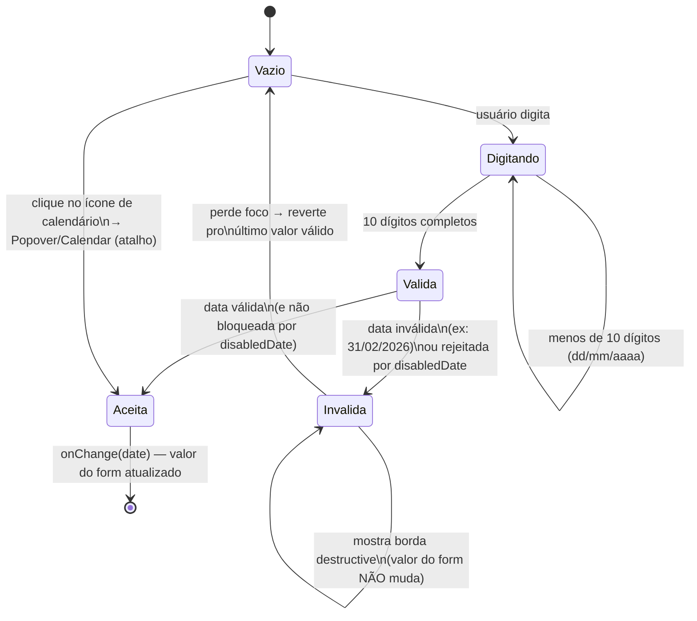

# Campo de Data do Financeiro (DateFieldPicker)

## Objetivo

Documentar o comportamento do campo de data digitável usado nos dialogs do
financeiro (`DateFieldPicker`, [ADR-032](../adr/ADR-032-campo-de-data-digitavel-financeiro.md)) —
substitui o padrão antigo de popover-calendário sem input de texto em
Vencimento, Competência, Data de Pagamento, Data do Ajuste, Data de
Referência (Getnet) e Data do Culto.

## Estados da interação

## Por que reverter ao perder o foco

Antes da correção (achado de review), uma data inválida ou rejeitada
ficava visível no campo sem nunca atualizar o valor do formulário — o
dialog continuava habilitado a salvar, usando silenciosamente a data
anterior enquanto a tela mostrava a data rejeitada. Reverter ao perder
foco garante que texto exibido e valor salvo nunca fiquem
dessincronizados além do tempo em que o usuário está digitando ativamente.

## Referências

- **Decisão Arquitetural**: [ADR-032 - Campo de data digitável](../adr/ADR-032-campo-de-data-digitavel-financeiro.md)
- **Componente**: `src/components/financas/DateFieldPicker.tsx`
- **Decisão irmã**: [ADR-031 - Tipo de Data e Regime de Caixa](../adr/ADR-031-tipo-de-data-filtro-e-regime-caixa.md)
