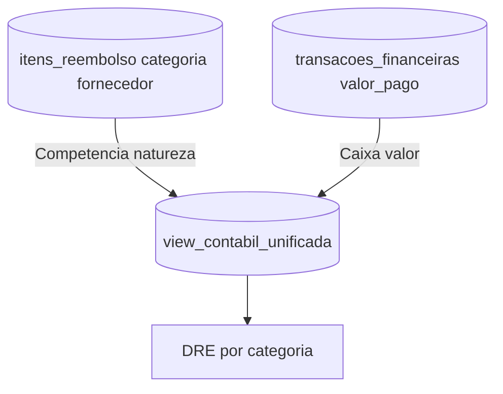

# DRE - Inteligencia Contabil

## Objetivo
Explicar como o Demonstrativo de Resultado do Exercício (DRE) é gerado a partir da separação entre **competência** (fato gerador) e **caixa** (transações), garantindo um relatório contábil preciso independente da forma de pagamento.

## Contexto
O DRE é um relatório contábil obrigatório que mostra o resultado financeiro de um período (receitas - despesas). No sistema, ele é gerado por uma **view unificada** que cruza:
- **Fato Gerador**: Define a natureza do lançamento (categoria contábil)
- **Transações de Caixa**: Fornecem o valor efetivamente pago/recebido

Esta separação está documentada no [ADR-001](../adr/ADR-001-separacao-fato-gerador-caixa-dre.md) e garante que:
- Parcelamentos não distorcem o resultado
- Reembolsos aparecem na categoria correta
- Juros e taxas bancárias não alteram a competência

## Composição do DRE

Composição da DRE a partir de competência (itens) e caixa (transações), consolidada na view contábil. Referências: [`../adr/ADR-001-separacao-fato-gerador-caixa-dre.md`](../adr/ADR-001-separacao-fato-gerador-caixa-dre.md) e [`../funcionalidades.md`](../funcionalidades.md).



---

## Detalhamento das Camadas

### 1. Itens / Fato Gerador (Competência)
**Fonte**: `itens_reembolso` ou tabela de lançamentos contábeis

**Campos relevantes**:
- `categoria`: Define a seção do DRE (Receitas Operacionais, Despesas Administrativas, etc.)
- `fornecedor`: Identifica de quem/para quem
- `data_competencia`: Quando o fato aconteceu (não quando foi pago)
- `valor_original`: Valor da nota fiscal ou do lançamento

**Exemplo**:
```sql
| id  | categoria                     | fornecedor    | data_competencia | valor_original |
|-----|-------------------------------|---------------|------------------|----------------|
| 001 | Despesas Administrativas      | Papelaria XYZ | 2024-12-01       | 500.00         |
| 002 | Receitas Operacionais > Dízimo| João Silva    | 2024-12-05       | 1000.00        |
```

### 2. Transações Financeiras (Caixa)
**Fonte**: `transacoes_financeiras`

**Campos relevantes**:
- `valor_pago`: Quanto foi efetivamente pago/recebido (pode diferir do `valor_original` por juros/descontos)
- `data_pagamento`: Quando o dinheiro saiu/entrou
- `forma_pagamento`: PIX, boleto, parcelado, etc.
- `status`: Pendente, Pago, Conciliado

**Exemplo**:
```sql
| id  | item_id | valor_pago | data_pagamento | forma_pagamento | status     |
|-----|---------|------------|----------------|-----------------|------------|
| 101 | 001     | 500.00     | 2024-12-10     | PIX             | Pago       |
| 102 | 002     | 1000.00    | 2024-12-05     | Dinheiro        | Conciliado |
```

### 3. View Contábil Unificada
**Função**: Cruza `itens` com `transacoes` para consolidar dados

**Lógica (pseudo-SQL)**:
```sql
CREATE VIEW view_contabil_unificada AS
SELECT 
    i.categoria,
    i.data_competencia,
    i.fornecedor,
    COALESCE(SUM(t.valor_pago), 0) AS valor_realizado,
    i.valor_original
FROM itens_reembolso i
LEFT JOIN transacoes_financeiras t ON i.id = t.item_id
WHERE t.status IN ('Pago', 'Conciliado')
GROUP BY i.id;
```

**Resultado**:
```sql
| categoria                     | data_competencia | valor_realizado |
|-------------------------------|------------------|----------------|
| Despesas Administrativas      | 2024-12-01       | 500.00         |
| Receitas Operacionais > Dízimo| 2024-12-05       | 1000.00        |
```

### 4. DRE Final
**Função**: Agrupa por categoria e calcula resultado

**Estrutura**:
```
DRE - Dezembro/2024

(+) RECEITAS OPERACIONAIS
    Dízimos                    1.000,00
    Ofertas                      500,00
    Total Receitas             1.500,00

(-) DESPESAS OPERACIONAIS
    Despesas Administrativas     500,00
    Despesas Ministeriais        200,00
    Total Despesas               700,00

(=) RESULTADO LÍQUIDO            800,00
```

---

## Separação: Competência vs Caixa

### Exemplo Prático: Despesa Parcelada

**Cenário**: Compra de equipamento de R$ 3.000 parcelado em 3x

#### Fato Gerador (Competência)
```sql
INSERT INTO itens_reembolso (categoria, valor_original, data_competencia)
VALUES ('Despesas Administrativas', 3000.00, '2024-12-01');
```

#### Transações de Caixa
```sql
INSERT INTO transacoes_financeiras (item_id, valor_pago, data_pagamento)
VALUES 
    (1, 1000.00, '2024-12-10'),
    (1, 1000.00, '2025-01-10'),
    (1, 1000.00, '2025-02-10');
```

#### Impacto no DRE
**DRE de Dezembro/2024**:
```
(-) DESPESAS OPERACIONAIS
    Despesas Administrativas   3.000,00  <-- Valor total no mês da competência
```

**Fluxo de Caixa**:
```
Dezembro/2024:  -1.000,00
Janeiro/2025:   -1.000,00
Fevereiro/2025: -1.000,00
```

> **Importante**: O DRE registra o impacto total no mês da decisão (dezembro), enquanto o caixa distribui ao longo do tempo. Isso reflete a realidade contábil: a igreja se comprometeu com R$ 3.000 em dezembro, mesmo que o pagamento seja parcelado.

---

## Casos Especiais

### Caso 1: Reembolso
- **Fato Gerador**: Categoria correta (ex: "Material de Escritório")
- **Transação**: Saída para o membro que adiantou
- **DRE**: Exibe na categoria correta, **não** em "Reembolsos"

### Caso 2: Juros/Taxas Bancárias
- **Fato Gerador**: Valor original sem juros
- **Transação**: Valor pago com juros
- **DRE**: Exibe valor original (juros vão para categoria "Despesas Financeiras" se necessário)

### Caso 3: Estorno de Fato Gerador
- **Ação**: Remove ou marca como estornado
- **DRE**: Lançamento não aparece ou é subtraído
- **Caixa**: Não é revertido automaticamente

### Caso 4: Estorno de Caixa
- **Ação**: Reverte transação específica
- **DRE**: Permanece inalterado
- **Caixa**: Saldo atualizado

---

## Regras de Negócio para o DRE

### O que DEVE aparecer no DRE
- ✅ Todos os fatos geradores do período (competência)
- ✅ Valores originais das notas fiscais/lançamentos
- ✅ Categorias contábeis corretas

### O que NÃO DEVE aparecer no DRE
- ❌ Forma de pagamento (parcelado, à vista, etc.)
- ❌ Juros ou descontos de caixa (tratados separadamente)
- ❌ Data de pagamento diferente da competência
- ❌ Lançamentos com fato gerador estornado

### Como validar o DRE
1. **Soma das receitas** deve bater com total de fatos geradores de entrada
2. **Soma das despesas** deve bater com total de fatos geradores de saída
3. **Resultado** = Receitas - Despesas
4. **Independência**: Trocar forma de pagamento não altera o DRE

---

## Referências

- **Decisão Arquitetural**: [ADR-001 - Separação Fato Gerador vs Caixa vs DRE](../adr/ADR-001-separacao-fato-gerador-caixa-dre.md)
- **Funcionalidades Detalhadas**: [Módulo Financeiro](../funcionalidades.md#2-módulo-financeiro)
- **Guia do Usuário**: [Manual - Seção Financeiro](../manual-usuario.md#4-módulo-financeiro)
- **Fluxo Macro**: [Diagrama de Fluxo Financeiro](fluxo-financeiro.md)
- **Sequência Temporal**: [Diagrama de Sequência](sequencia-financeira.md)
- **Modelo de Dados**: [Database ER Diagram](../database-er-diagram.md)
