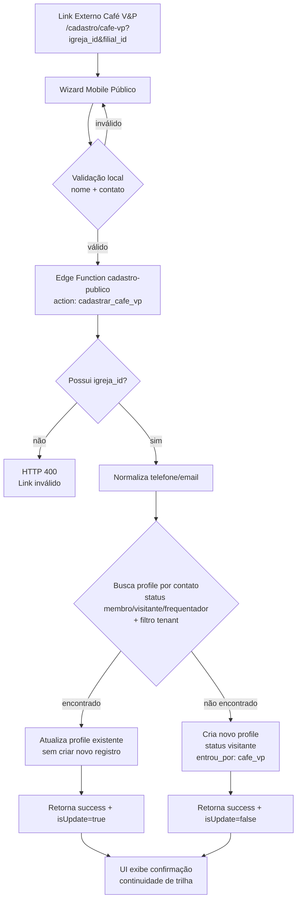

# Fluxo — Cadastro Público `Café V&P`

## Objetivo

Registrar dados iniciais de pessoas na recepção de novos membros (`Café V&P`) em fluxo mobile, com **idempotência** (sem duplicidade) por `telefone` ou `email` no escopo de `igreja_id` e `filial_id`.

## Diagrama (Mermaid)

## Regras-chave

- **Escopo multi-tenant obrigatório:** nenhuma operação sem `igreja_id`.
- **Idempotência por contato:** evita duplicar cadastro quando pessoa já existe.
- **Compatibilidade com processo atual:** permite posterior promoção para membro e avanço em trilha.
