# Fluxo do Módulo Comunicação

Este diagrama representa o fluxo editorial de criação e publicação de comunicados institucionais no sistema. O processo é manual, gerenciado pela liderança/secretaria, e permite publicar conteúdo em múltiplos canais (app, telão, site) com controle de período de exibição. Não há automações de disparo push/email/WhatsApp neste módulo.

Baseado nos componentes `Comunicados.tsx`, `ComunicadoDialog.tsx`, `PublicacaoStepper.tsx` e tabela `comunicados` com RLS policies.

```mermaid
flowchart TD
    Start([Usuário acessa /comunicados]) --> CheckAuth{Usuário autenticado<br/>e role admin/secretario?}
    
    CheckAuth -->|Não| Denied[Acesso negado<br/>RLS comunicados_gestao_admin]
    CheckAuth -->|Sim| Dashboard[Dashboard de Comunicados<br/>Lista comunicados existentes]
    
    Dashboard --> Action{Ação escolhida}
    
    Action -->|Criar novo| WizardStart[Abrir wizard de criação<br/>ComunicadoDialog]
    Action -->|Editar existente| LoadData[Carregar dados do comunicado<br/>SELECT comunicados WHERE id]
    Action -->|Excluir| ConfirmDelete{Confirmar exclusão?}
    Action -->|Ativar/Desativar| ToggleStatus[UPDATE comunicados<br/>SET ativo = NOT ativo]
    
    %% Fluxo de criação/edição
    WizardStart --> Step1[Passo 1: Conteúdo<br/>Título obrigatório<br/>Tipo: banner ou alerta<br/>Descrição se alerta<br/>Imagem storage comunicados<br/>Link de ação opcional]
    
    Step1 --> ValidateContent{Conteúdo válido?<br/>Título preenchido<br/>Mensagem se alerta<br/>Tipo selecionado}
    
    ValidateContent -->|Não| Step1
    ValidateContent -->|Sim| Step2[Passo 2: Canais<br/>Selecionar múltiplos:<br/>☐ App exibir_app<br/>☐ Telão exibir_telao<br/>☐ Site exibir_site<br/>Ordem telão opcional<br/>Arte alternativa telão opcional]
    
    Step2 --> Step3[Passo 3: Agendamento<br/>data_inicio obrigatório<br/>data_fim opcional<br/>Tags array opcional<br/>Categoria mídia opcional<br/>Vincular culto_id opcional<br/>Vincular midia_id opcional]
    
    Step3 --> ValidateDates{Datas válidas?<br/>data_inicio <= data_fim}
    
    ValidateDates -->|Não| Step3
    ValidateDates -->|Sim| UploadImage{Tem imagem<br/>para upload?}
    
    UploadImage -->|Sim| StoreImage[Upload para storage bucket<br/>comunicados público]
    UploadImage -->|Não| SaveDB
    
    StoreImage --> SaveDB[INSERT/UPDATE comunicados<br/>ativo = true default<br/>created_by = auth.uid]
    
    LoadData --> Step1
    
    %% Fluxo de exclusão
    ConfirmDelete -->|Não| Dashboard
    ConfirmDelete -->|Sim| CheckImage{Comunicado tem<br/>imagem_url?}
    
    CheckImage -->|Sim| RemoveStorage[DELETE storage.objects<br/>bucket comunicados]
    CheckImage -->|Não| DeleteRecord
    
    RemoveStorage --> DeleteRecord[DELETE comunicados<br/>WHERE id]
    
    %% Pós-operação
    SaveDB --> RefreshList[Atualizar lista de comunicados<br/>SELECT comunicados ORDER BY created_at]
    DeleteRecord --> RefreshList
    ToggleStatus --> RefreshList
    
    RefreshList --> ShowResult[Exibir comunicados com:<br/>Título tipo status<br/>Canais habilitados<br/>Datas início/fim<br/>Contador de ativos]
    
    %% Exibição nos canais
    ShowResult --> Channels{Canais de exibição}
    
    Channels -->|exibir_app = true| AppCarousel[App/Dashboard<br/>BannerCarousel.tsx<br/>Query: ativo AND data válida<br/>Carrossel automático]
    
    Channels -->|exibir_telao = true| Telao[Telão/Projetor<br/>Página /telao<br/>Telao.tsx<br/>Ordem por ordem_telao<br/>Controles navegação/pausa]
    
    Channels -->|exibir_site = true| Site[Site Público<br/>Carrossel site<br/>Integração a confirmar]
    
    AppCarousel --> End([Comunicado visível<br/>para membros logados])
    Telao --> End
    Site --> End
    
    %% Estilos
    classDef validation fill:#fff4e6,stroke:#fb923c,stroke-width:2px
    classDef action fill:#dbeafe,stroke:#3b82f6,stroke-width:2px
    classDef storage fill:#dcfce7,stroke:#22c55e,stroke-width:2px
    classDef display fill:#f3e8ff,stroke:#a855f7,stroke-width:2px
    classDef error fill:#fee2e2,stroke:#ef4444,stroke-width:2px
    
    class CheckAuth,ValidateContent,ValidateDates,ConfirmDelete,CheckImage,UploadImage validation
    class WizardStart,Step1,Step2,Step3,LoadData action
    class StoreImage,SaveDB,RemoveStorage,DeleteRecord storage
    class AppCarousel,Telao,Site,ShowResult display
    class Denied error
```

## Pontos de decisão principais

1. **Autenticação e autorização**: RLS policy `comunicados_gestao_admin` garante que apenas admins/secretaria podem criar/editar.
2. **Validação de conteúdo**: título obrigatório; se tipo = alerta, mensagem é obrigatória.
3. **Segmentação por canal**: não há segmentação por perfis de usuário (roles/grupos), apenas por canal de publicação (app, telão, site).
4. **Período de exibição**: comunicados são filtrados automaticamente nas queries de visualização por `data_inicio` e `data_fim`.
5. **Storage público**: imagens ficam no bucket `comunicados` com acesso público para leitura.

## Observações

- **Não há estados intermediários**: comunicados são criados diretamente como `ativo = true` ou `false`, sem rascunho/aprovação.
- **Não há workflow de aprovação**: criação e publicação são instantâneas.
- **Não há analytics**: visualizações/cliques não são rastreados (a confirmar).
- **Expiração automática**: comunicados expirados (`data_fim` passada) não são desativados automaticamente, apenas filtrados nas queries de exibição.

## Referências

- Componentes: `src/pages/Comunicados.tsx`, `src/components/comunicados/ComunicadoDialog.tsx`, `src/components/publicacao/PublicacaoStepper.tsx`
- Visualização: `src/components/BannerCarousel.tsx` (app), `src/pages/Telao.tsx` (telão)
- Tabela: `supabase/migrations/20251203182759_...sql` (tabela `comunicados` e policies RLS)
- Storage: bucket público `comunicados` com policies de upload restrito
- Manual: [Comunicação](../manual-usuario.md#9-comunicação)
- Funcionalidades: [Módulo Comunicação](../funcionalidades.md#módulo-comunicação)
