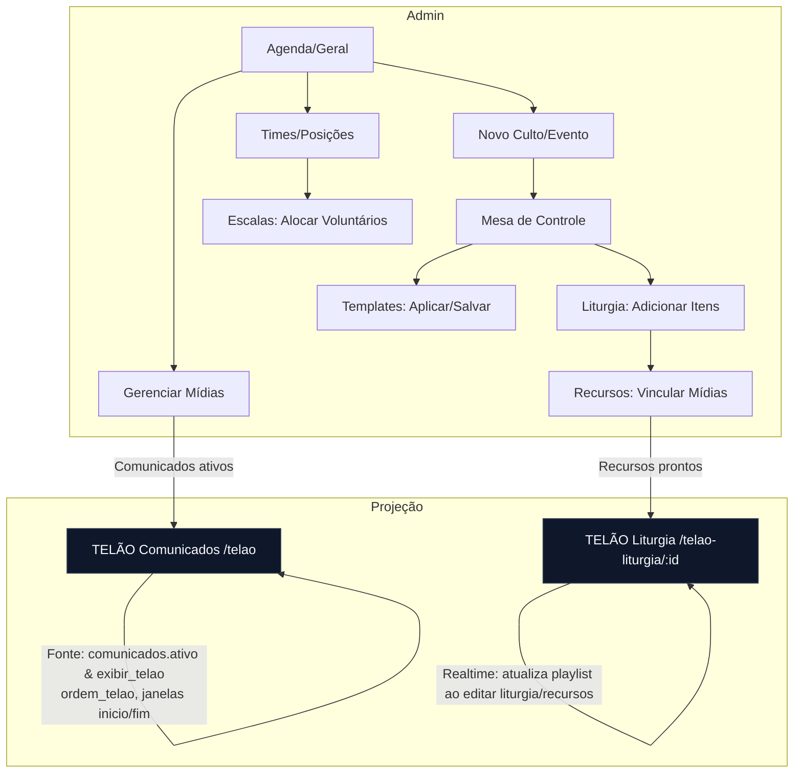

# Fluxo do Módulo Cultos e Liturgia

Notas (evidência no repositório):
- Páginas: `src/pages/Cultos.tsx`, `src/pages/cultos/Geral.tsx`, `src/pages/cultos/Eventos.tsx`, `src/pages/Telao.tsx`, `src/pages/TelaoLiturgia.tsx`
- Componentes (liturgia/escala/templates/mídia): `src/components/cultos/*`
- Tabelas lidas no código:
  - Dashboard: `cultos`, `times_culto`, `escalas_culto`, `midias`
  - Projeção Liturgia: `liturgia_culto`, `liturgia_recursos` (join com `midias`)
  - Projeção Comunicados: `comunicados` (filtros: `ativo`, `exibir_telao`, `data_inicio`, `data_fim`, `ordem_telao`)

Pontos a confirmar:
- (a confirmar) Campos completos de "Mesa de Controle" e rotas internas específicas além de `Geral`, `Eventos`, `Times`, `Templates` — baseados nos arquivos presentes.
