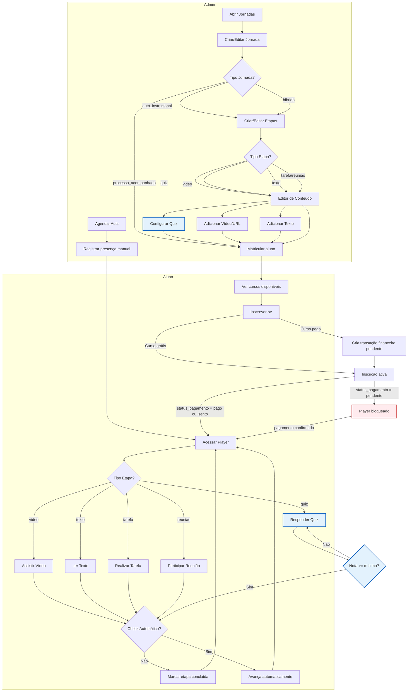

# Fluxo do Módulo Jornadas e Ensino

Notas:
- **Tipo de Jornada**: `auto_instrucional` exibe Player, `processo_acompanhado` exibe Kanban, `hibrido` combina ambos
- **Tipos de Etapa**: texto, video, quiz, tarefa, reuniao
- **Editor de Conteúdo** (EtapaContentDialog):
  - **Texto**: Conteúdo armazenado em `conteudo_texto`; suporta formatação simples
  - **Vídeo**: URL em `conteudo_url` com preview YouTube/Vimeo; checkbox `check_automatico` bloqueia avanço até conclusão
  - **Quiz**: Interface para N perguntas com 4 alternativas; marca resposta correta; configura nota mínima (0-100); salvo em `quiz_config` (JSON)
  - **Tarefa/Reunião**: Tipos informativos para presencial ou tarefas; requer confirmação manual do líder
- **Quiz**: Requer nota mínima para aprovação; múltiplas tentativas permitidas
- **Check Automático**: Se `true`, sistema avança sozinho após conclusão; se `false`, aluno deve marcar como concluído (soft-lock)
- Criação de transação financeira ocorre apenas quando o curso é pago
- Player só libera acesso quando `status_pagamento` for `pago` ou `isento`
