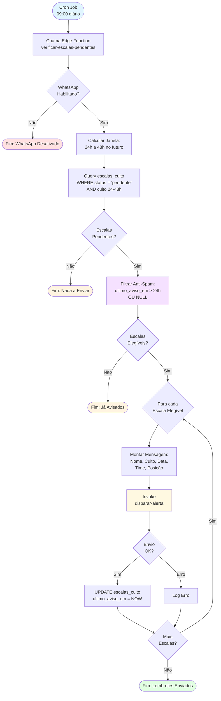
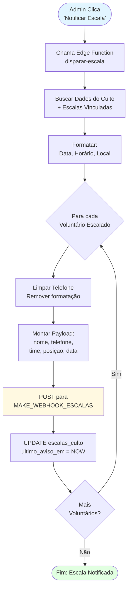
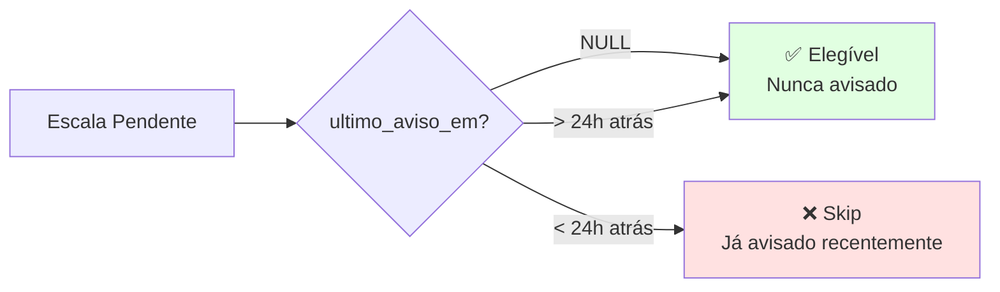

# Fluxo — Lembretes Automáticos de Escalas

Este diagrama representa o fluxo completo de **lembretes automáticos para escalas de voluntários**, desde a execução do cron até o envio via WhatsApp.

## Fluxo Principal



## Fluxo de Disparo Manual (Admin)



## Lógica Anti-Spam



## Janela de Tempo

```mermaid
timeline
    title Janela de Lembretes Automáticos
    section Hoje
        09:00 : Cron executa
    section +24h
        Início da Janela : Cultos a partir daqui são notificados
    section +48h
        Fim da Janela : Cultos até aqui são notificados
    section +49h
        Fora da Janela : Não notificados pelo cron
```

## Componentes

| Componente | Tipo | Path |
|------------|------|------|
| Edge Function (Auto) | Backend | `supabase/functions/verificar-escalas-pendentes/index.ts` |
| Edge Function (Manual) | Backend | `supabase/functions/disparar-escala/index.ts` |
| Cron Job | Database | `pg_cron` via `pg_net` |
| Tabela | Database | `escalas_culto` |

## Campos Relevantes

| Campo | Tipo | Descrição |
|-------|------|-----------|
| `status_confirmacao` | TEXT | pendente, confirmado, recusado, troca_solicitada |
| `ultimo_aviso_em` | TIMESTAMPTZ | Último envio de lembrete (anti-spam) |
| `data_confirmacao` | TIMESTAMPTZ | Quando voluntário confirmou |
| `motivo_recusa` | TEXT | Justificativa se recusou |

## Configuração do Cron

```sql
-- Habilitar extensões
CREATE EXTENSION IF NOT EXISTS pg_cron;
CREATE EXTENSION IF NOT EXISTS pg_net;

-- Agendar execução diária às 09:00
SELECT cron.schedule(
  'verificar-escalas-pendentes',
  '0 9 * * *',
  $$
  SELECT net.http_post(
    url := 'https://mcomwaelbwvyotvudnzt.supabase.co/functions/v1/verificar-escalas-pendentes',
    headers := jsonb_build_object(
      'Content-Type', 'application/json',
      'Authorization', 'Bearer ' || current_setting('app.settings.service_role_key')
    ),
    body := '{}'::jsonb
  );
  $$
);
```

## Referências

- [Fluxo de Cultos](fluxo-cultos.md)
- [Manual do Usuário - Escalas](../manual-usuario.md#5-escalas)
- [Funcionalidades - Escalas](../funcionalidades.md#escalas)
