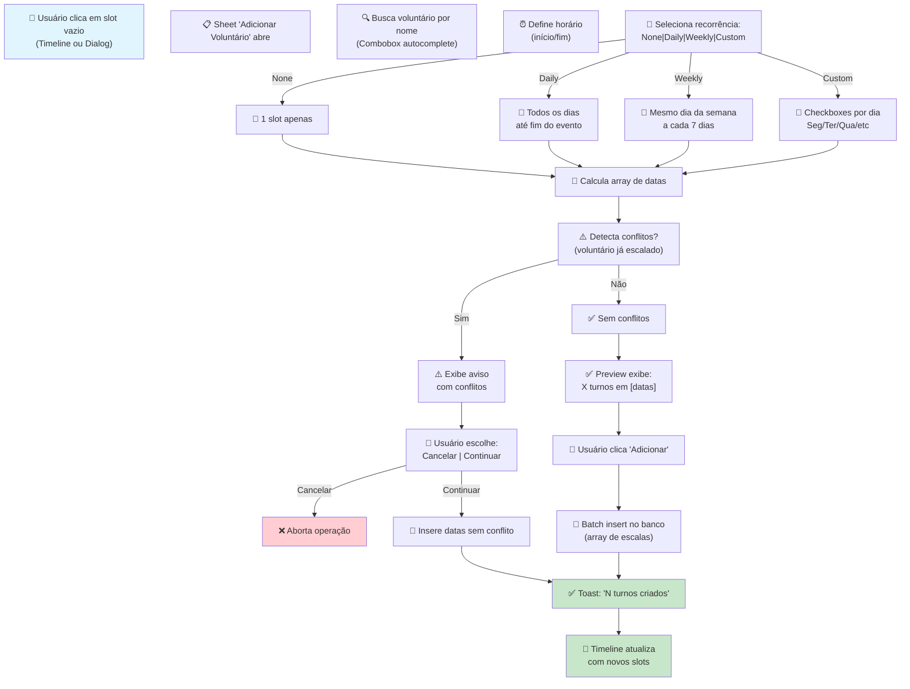
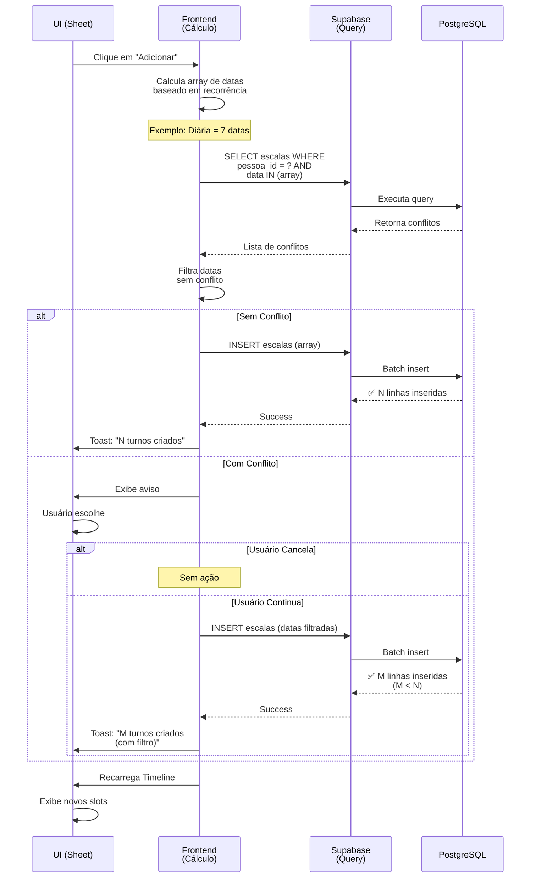
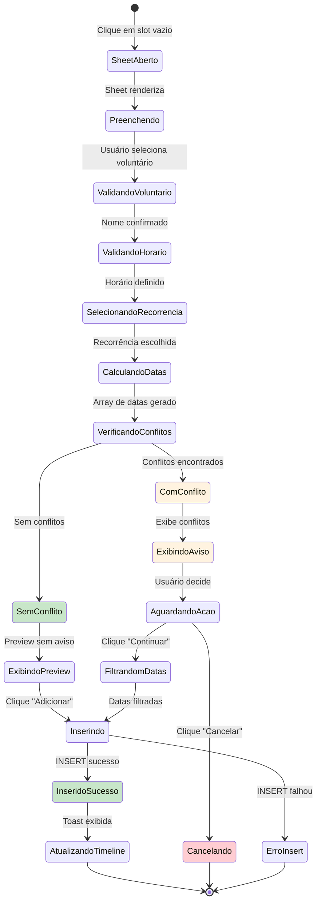

# 📅 Fluxo de Escalas com Recorrência

## Visão Geral

Processo de criação de escalas (turnos de voluntários) com suporte a recorrência automática (None/Daily/Weekly/Custom) em eventos de qualquer tipo, com detecção de conflitos.

---

## Fluxo Principal (Mermaid)



---

## Casos de Uso

### Caso 1: Recorrência Diária (Relógio 7 dias)

```
Entrada:
- Voluntário: João Silva
- Horário: 14:00 - 16:00
- Tipo de Evento: RELOGIO (duração: 7 dias)
- Recorrência: Diária

Processamento:
1. Calcula 7 datas (dia 1 até dia 7)
2. Verifica se João tem conflitos nessas datas
3. Se nenhum conflito, insere 7 registros em escalas

Resultado:
✅ 7 turnos criados:
• 30 de Dez (seg) 14:00-16:00
• 31 de Dez (ter) 14:00-16:00
• 01 de Jan (qua) 14:00-16:00
... (até 05 de Jan)
```

### Caso 2: Recorrência Semanal

```
Entrada:
- Voluntário: Maria Santos
- Horário: 10:00 - 12:00
- Dia selecionado: Quarta-feira
- Recorrência: Semanal (intervalo 7 dias)

Processamento:
1. Identifica que é quarta
2. Calcula próximas 4 quartas (intervalo 7 dias)
3. Verifica conflitos

Resultado:
✅ 4 turnos criados (4 quartas):
• 01 de Jan (qua)
• 08 de Jan (qua)
• 15 de Jan (qua)
• 22 de Jan (qua)
```

### Caso 3: Recorrência Personalizada

```
Entrada:
- Voluntário: Pedro Costa
- Horário: 19:00 - 21:00
- Recorrência: Personalizada
- Dias selecionados: ✅ Seg, ✅ Qua, ✅ Sex

Processamento:
1. Loop na duração do evento
2. Coleta apenas Seg/Qua/Sex
3. Cria slot para cada ocorrência

Resultado:
✅ 6 turnos (2 semanas × 3 dias/semana):
• 30 de Dez (seg)
• 01 de Jan (qua)
• 03 de Jan (sex)
• 06 de Jan (seg)
• 08 de Jan (qua)
• 10 de Jan (sex)
```

### Caso 4: Conflito Detectado

```
Entrada:
- Voluntário: Ana Paula
- Horário: 15:00 - 17:00
- Recorrência: Diária (5 dias)

Verificação:
1. Dia 1: ✅ Livre
2. Dia 2: ❌ Conflito (Ana já escalada 14:00-16:00)
3. Dia 3: ✅ Livre
4. Dia 4: ❌ Conflito (Ana já escalada 16:30-18:00)
5. Dia 5: ✅ Livre

Aviso ao usuário:
⚠️ Conflitos detectados:
• 31 de Dez (já escalada 14:00-16:00)
• 03 de Jan (já escalada 16:30-18:00)

Continuar? → Insere apenas 3 turnos (dias 1, 3, 5)
Cancelar? → Nenhum turno inserido
```

---

## Sequência de Banco de Dados



---

## Estados e Transições



---

## Cálculo de Datas (Pseudocódigo)

```javascript
function calcularDatas(
  dataInicio,
  dataFim,
  tipoRecorrencia,
  diasCustom = null
) {
  const datas = [];
  let dataAtual = new Date(dataInicio);

  switch (tipoRecorrencia) {
    case "NONE":
      // Apenas a data selecionada
      datas.push(dataAtual);
      break;

    case "DAILY":
      // Todos os dias até dataFim
      while (dataAtual <= dataFim) {
        datas.push(new Date(dataAtual));
        dataAtual.setDate(dataAtual.getDate() + 1);
      }
      break;

    case "WEEKLY":
      // Mesmo dia da semana a cada 7 dias
      const diaSemana = dataAtual.getDay();
      while (dataAtual <= dataFim) {
        if (dataAtual.getDay() === diaSemana) {
          datas.push(new Date(dataAtual));
        }
        dataAtual.setDate(dataAtual.getDate() + 1);
      }
      break;

    case "CUSTOM":
      // Apenas dias selecionados
      while (dataAtual <= dataFim) {
        if (diasCustom.includes(dataAtual.getDay())) {
          datas.push(new Date(dataAtual));
        }
        dataAtual.setDate(dataAtual.getDate() + 1);
      }
      break;
  }

  return datas;
}
```

---

## Validações e Regras

| Regra                       | Descrição                      | Ação                             |
| --------------------------- | ------------------------------ | -------------------------------- |
| **Voluntário Obrigatório**  | Combobox não permite vazio     | Toast: "Selecione um voluntário" |
| **Horário Válido**          | Início < Fim                   | Toast: "Horário inválido"        |
| **Recorrência Obrigatória** | Padrão = "None"                | Auto-selecionado se não escolher |
| **Conflito Detectado**      | Voluntário já tem escalas      | Exibe aviso + opção de continuar |
| **Data Fora do Evento**     | Data calculada > fim do evento | Filtra automaticamente           |
| **Array Vazio Pós-Filtro**  | Todas as datas têm conflito    | Toast: "Nenhuma data disponível" |

---

## Links Relacionados

- **Funcionalidade**: [Escalas com Recorrência - Funcionalidades](../funcionalidades.md#escalas-com-recorrência)
- **Manual Usuário**: [Escalas com Recorrência - Manual](../manual-usuario.md#escalas-com-recorrência)
- **Componente**: `src/components/escalas/AdicionarVoluntarioSheet.tsx` (+504 linhas)
- **Hook Timeline**: `src/hooks/useRelogioAgora.ts` (+139 linhas)
- **Componente Timeline**: `src/components/escalas/EscalaTimeline.tsx` (+374 linhas)
