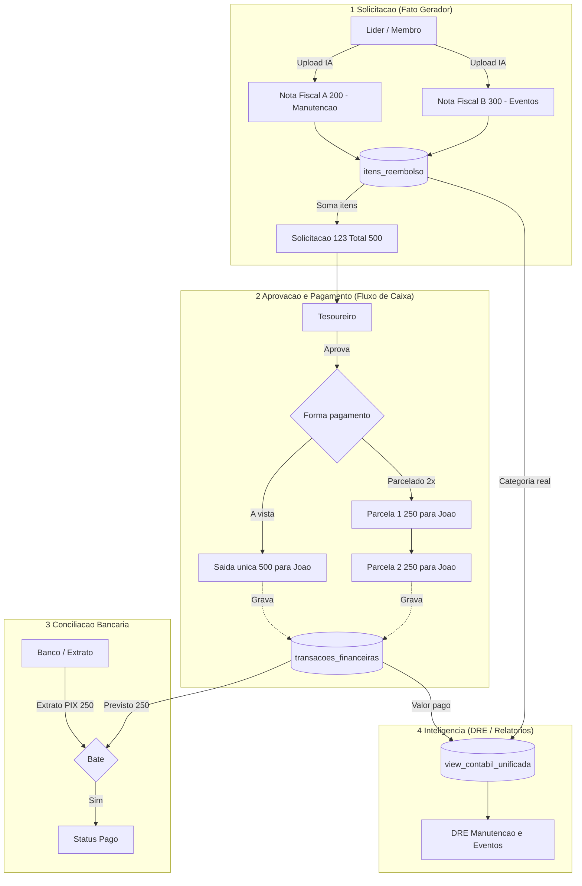

# Fluxo Financeiro - Reembolso -> Caixa -> DRE

## Objetivo
Visualizar a separação conceitual entre **Fato Gerador** (competência), **Fluxo de Caixa** (pagamentos) e **DRE** (resultado contábil), conforme definido no [ADR-001](../adr/ADR-001-separacao-fato-gerador-caixa-dre.md).

## Contexto
Este fluxo representa o ciclo completo de uma despesa com reembolso:
1. Líder/membro compra algo e envia notas fiscais
2. Sistema classifica os itens contábeis (fato gerador)
3. Tesoureiro aprova e escolhe forma de pagamento (caixa)
4. Banco processa o pagamento e retorna extrato
5. Sistema concilia e atualiza status
6. View contábil unifica dados para gerar DRE

## Principais Conceitos

### 1. Fato Gerador (Competência)
- **O que é**: Registro da natureza do gasto (categoria, fornecedor, motivo)
- **Quando acontece**: No momento da decisão de gastar
- **Onde fica**: `itens_reembolso` ou tabela equivalente de lançamentos
- **Impacto**: Define o que aparece no DRE

### 2. Fluxo de Caixa
- **O que é**: Registro de quando e como o dinheiro saiu/entrou
- **Quando acontece**: No momento do pagamento efetivo
- **Onde fica**: `transacoes_financeiras`
- **Impacto**: Altera saldo das contas, gera conciliação bancária

### 3. DRE (Resultado)
- **O que é**: Relatório contábil por competência
- **Como é gerado**: View que cruza fato gerador (categoria) + caixa (valor pago)
- **Independência**: Não é afetado pela forma de pagamento (parcelamento, juros, etc.)

## Cenários Práticos

### Cenário A: Despesa à Vista
- Líder compra material de R$ 500
- Sistema registra fato gerador: "Material Evangelismo" (Despesas Ministeriais)
- Tesoureiro paga à vista via PIX
- **DRE**: -R$ 500 no mês (competência)
- **Caixa**: -R$ 500 no mês (pagamento)

### Cenário B: Despesa Parcelada
- Líder compra equipamento de R$ 3.000
- Sistema registra fato gerador: "Equipamento de Som" (Despesas Administrativas)
- Tesoureiro parcela em 3x sem juros
- **DRE**: -R$ 3.000 no mês da compra (competência)
- **Caixa**: -R$ 1.000 por mês durante 3 meses (regime de caixa)

### Cenário C: Reembolso
- Líder já pagou R$ 200 do próprio bolso
- Sistema registra fato gerador: "Material de Escritório" (Despesas Administrativas)
- Tesoureiro reembolsa o líder
- **DRE**: -R$ 200 na categoria correta (não em "Reembolso")
- **Caixa**: -R$ 200 para o líder
- **Rastreabilidade**: Vínculo entre fato gerador e reembolso

### Cenário D: Estorno de Fato Gerador
- Lançamento foi feito por engano
- Tesoureiro estorna o fato gerador
- **DRE**: Lançamento removido ou marcado como estornado
- **Caixa**: Se já foi pago, requer estorno de caixa separado

### Cenário E: Estorno de Caixa (sem alterar fato gerador)
- Pagamento duplicado ou erro bancário
- Tesoureiro estorna apenas o pagamento
- **DRE**: Permanece inalterado
- **Caixa**: Saldo revertido

## Fluxo Visual Completo

Fluxo macro alinhado ao ADR-001: fato gerador alimenta itens contábeis, pagamentos vão para fluxo de caixa, conciliação cruza extrato e lança status, e a DRE nasce da view unificada. Referências: [`../adr/ADR-001-separacao-fato-gerador-caixa-dre.md`](../adr/ADR-001-separacao-fato-gerador-caixa-dre.md) e [`../funcionalidades.md`](../funcionalidades.md).

---

## Regras de Negócio Importantes

### O que altera o DRE
- ✅ Criação de novo fato gerador
- ✅ Reclassificação de categoria de um fato gerador
- ✅ Estorno de fato gerador
- ✅ Ajuste de competência (mudança de mês/ano)

### O que NÃO altera o DRE
- ❌ Forma de pagamento (à vista, parcelado, PIX, boleto)
- ❌ Data de pagamento diferente da competência
- ❌ Juros ou descontos aplicados no caixa
- ❌ Estorno apenas de pagamento (sem estornar fato gerador)

### O que altera o Caixa
- ✅ Registro de pagamento/recebimento
- ✅ Conciliação bancária
- ✅ Ajustes de saldo manual
- ✅ Juros, multas ou descontos aplicados

---

## Referências

- **Decisão Arquitetural**: [ADR-001 - Separação Fato Gerador vs Caixa vs DRE](../adr/ADR-001-separacao-fato-gerador-caixa-dre.md)
- **Funcionalidades Detalhadas**: [Módulo Financeiro](../funcionalidades.md#2-módulo-financeiro)
- **Guia do Usuário**: [Manual - Seção Financeiro](../manual-usuario.md#4-módulo-financeiro)
- **Sequência Temporal**: [Diagrama de Sequência](sequencia-financeira.md)
- **Composição do DRE**: [Diagrama DRE](dre.md)
- **Modelo de Dados**: [Database ER Diagram](../database-er-diagram.md)
