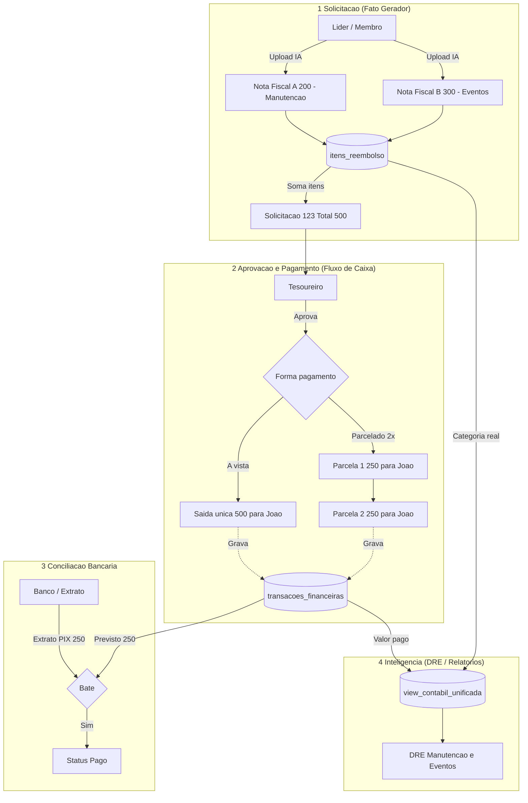
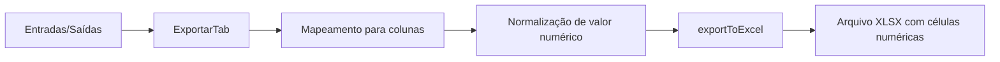
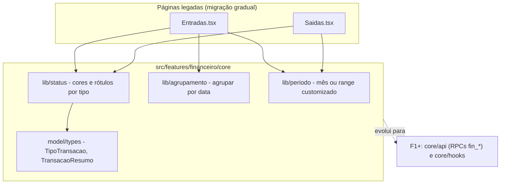
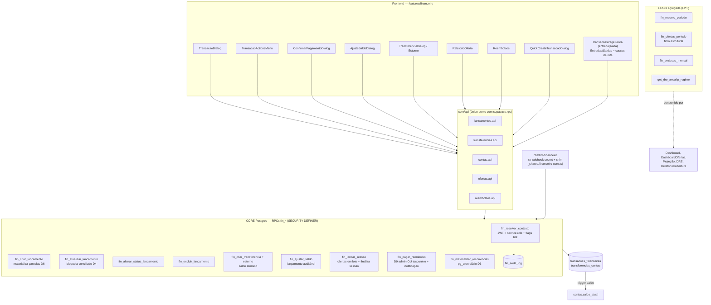
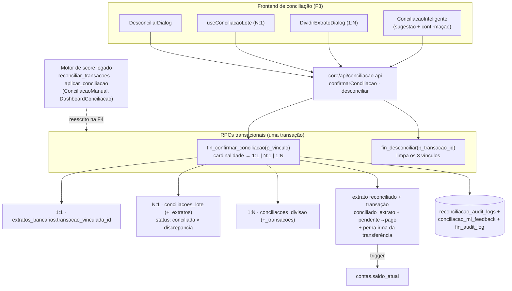
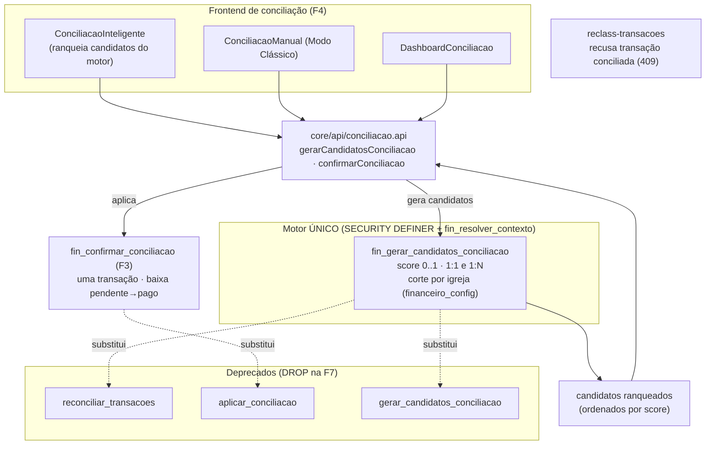
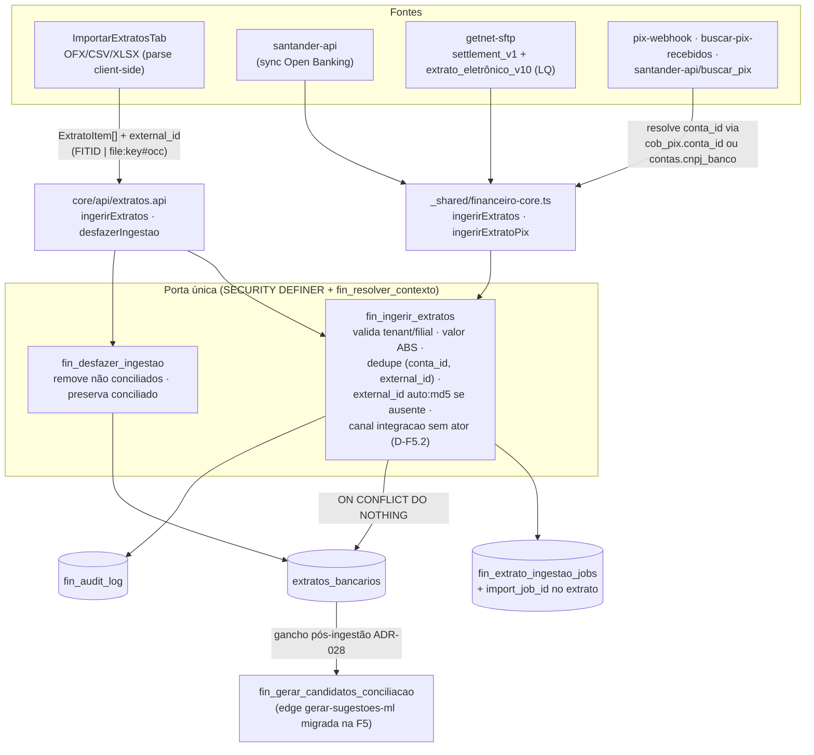

# Fluxo Financeiro - Reembolso -> Caixa -> DRE

## Objetivo

Visualizar a separação conceitual entre **Fato Gerador** (competência), **Fluxo de Caixa** (pagamentos) e **DRE** (resultado contábil), conforme definido no [ADR-001](../adr/ADR-001-separacao-fato-gerador-caixa-dre.md). **Todas as operações são automaticamente filtradas por `igreja_id`** do usuário logado.

## Contexto

Este fluxo representa o ciclo completo de uma despesa com reembolso:

1. Líder/membro compra algo e envia notas fiscais
2. Sistema classifica os itens contábeis (fato gerador) **scoped por igreja**
3. Tesoureiro aprova e escolhe forma de pagamento (caixa) **scoped por igreja**
4. Banco processa o pagamento e retorna extrato
5. Sistema concilia e atualiza status **scoped por igreja**
6. View contábil unifica dados para gerar DRE **scoped por igreja**

## Principais Conceitos

### 1. Fato Gerador (Competência)

- **O que é**: Registro da natureza do gasto (categoria, fornecedor, motivo)
- **Quando acontece**: No momento da decisão de gastar
- **Onde fica**: `itens_reembolso` ou tabela equivalente de lançamentos
- **Impacto**: Define o que aparece no DRE

### 2. Fluxo de Caixa

- **O que é**: Registro de quando e como o dinheiro saiu/entrou
- **Quando acontece**: No momento do pagamento efetivo
- **Onde fica**: `transacoes_financeiras`
- **Impacto**: Altera saldo das contas, gera conciliação bancária

### 3. DRE (Resultado)

- **O que é**: Relatório contábil por competência
- **Como é gerado**: View que cruza fato gerador (categoria) + caixa (valor pago)
- **Independência**: Não é afetado pela forma de pagamento (parcelamento, juros, etc.)

## Cenários Práticos

### Cenário A: Despesa à Vista

- Líder compra material de R$ 500
- Sistema registra fato gerador: "Material Evangelismo" (Despesas Ministeriais)
- Tesoureiro paga à vista via PIX
- **DRE**: -R$ 500 no mês (competência)
- **Caixa**: -R$ 500 no mês (pagamento)

### Cenário B: Despesa Parcelada

- Líder compra equipamento de R$ 3.000
- Sistema registra fato gerador: "Equipamento de Som" (Despesas Administrativas)
- Tesoureiro parcela em 3x sem juros
- **DRE**: -R$ 3.000 no mês da compra (competência)
- **Caixa**: -R$ 1.000 por mês durante 3 meses (regime de caixa)

### Cenário C: Reembolso

- Líder já pagou R$ 200 do próprio bolso
- Sistema registra fato gerador: "Material de Escritório" (Despesas Administrativas)
- Tesoureiro reembolsa o líder
- **DRE**: -R$ 200 na categoria correta (não em "Reembolso")
- **Caixa**: -R$ 200 para o líder
- **Rastreabilidade**: Vínculo entre fato gerador e reembolso

### Cenário D: Estorno de Fato Gerador

- Lançamento foi feito por engano
- Tesoureiro estorna o fato gerador
- **DRE**: Lançamento removido ou marcado como estornado
- **Caixa**: Se já foi pago, requer estorno de caixa separado

### Cenário E: Estorno de Caixa (sem alterar fato gerador)

- Pagamento duplicado ou erro bancário
- Tesoureiro estorna apenas o pagamento
- **DRE**: Permanece inalterado
- **Caixa**: Saldo revertido

## Fluxo Visual Completo

Fluxo macro alinhado ao ADR-001: fato gerador alimenta itens contábeis, pagamentos vão para fluxo de caixa, conciliação cruza extrato e lança status, e a DRE nasce da view unificada. Referências: [`../adr/ADR-001-separacao-fato-gerador-caixa-dre.md`](../adr/ADR-001-separacao-fato-gerador-caixa-dre.md) e [`../funcionalidades.md`](../funcionalidades.md).

```mermaid
graph TD
    Lider[Lider / Membro]
    Tesoureiro[Tesoureiro]
    Banco[Banco / Extrato]

    subgraph S1["1 Solicitacao (Fato Gerador)"]
        NF1["Nota Fiscal A 200 - Manutencao"]
        NF2["Nota Fiscal B 300 - Eventos"]
        ItensDB[(itens_reembolso)]

        Lider -->|"Upload IA"| NF1
        Lider -->|"Upload IA"| NF2
        NF1 --> ItensDB
        NF2 --> ItensDB
        ItensDB -->|"Soma itens"| Solic["Solicitacao 123 Total 500"]
    end

    subgraph S2["2 Aprovacao e Pagamento (Fluxo de Caixa)"]
        Solic --> Tesoureiro
        Tesoureiro -->|"Aprova"| Decisao{Forma pagamento}

        Decisao -->|"A vista"| T1["Saida unica 500 para Joao"]
        Decisao -->|"Parcelado 2x"| T2["Parcela 1 250 para Joao"]
        T2 --> T3["Parcela 2 250 para Joao"]

        T1 -.->|"Grava"| FinDB[(transacoes_financeiras)]
        T3 -.->|"Grava"| FinDB
    end

    subgraph S3["3 Conciliacao Bancaria"]
        Banco -->|"Extrato PIX 250"| Conc{Bate}
        FinDB -->|"Previsto 250"| Conc
        Conc -->|"Sim"| Pago["Status Pago"]
    end

    subgraph S4["4 Inteligencia (DRE / Relatorios)"]
        View[(view_contabil_unificada)]
        FinDB -->|"Valor pago"| View
        ItensDB -->|"Categoria real"| View
        View --> DRE["DRE Manutencao e Eventos"]
    end

```

---

## Regras de Negócio Importantes

### O que altera o DRE

- ✅ Criação de novo fato gerador
- ✅ Reclassificação de categoria de um fato gerador
- ✅ Estorno de fato gerador
- ✅ Ajuste de competência (mudança de mês/ano)

### O que NÃO altera o DRE

- ❌ Forma de pagamento (à vista, parcelado, PIX, boleto)
- ❌ Data de pagamento diferente da competência
- ❌ Juros ou descontos aplicados no caixa
- ❌ Estorno apenas de pagamento (sem estornar fato gerador)

### O que altera o Caixa

- ✅ Registro de pagamento/recebimento
- ✅ Conciliação bancária
- ✅ Ajustes de saldo manual
- ✅ Juros, multas ou descontos aplicados

---

## Referências

- **Decisão Arquitetural**: [ADR-001 - Separação Fato Gerador vs Caixa vs DRE](../adr/ADR-001-separacao-fato-gerador-caixa-dre.md)
- **Funcionalidades Detalhadas**: [Módulo Financeiro](../funcionalidades.md#2-módulo-financeiro)
- **Guia do Usuário**: [Manual - Seção Financeiro](../manual-usuario.md#4-módulo-financeiro)
- **Sequência Temporal**: [Diagrama de Sequência](sequencia-financeira.md)
- **Composição do DRE**: [Diagrama DRE](dre.md)
- **Modelo de Dados**: [Database ER Diagram](../database-er-diagram.md)

## Fluxo de Exportação (Entradas e Saídas)

```mermaid
flowchart LR
    UI[Entradas/Saídas] --> TAB[ExportarTab]
    TAB --> MAP[Mapeamento para colunas]
    MAP --> NORMALIZE[Normalização de valor numérico]
    NORMALIZE --> XLSX[exportToExcel]
    XLSX --> FILE[Arquivo XLSX com células numéricas]
```

## CORE do Financeiro — Fase F0 (ADR-029)

Camada de helpers puros compartilhados inaugurada em
`src/features/financeiro/core`, consumida por Entradas e Saídas sem mudança
de comportamento. Fases seguintes (F1+) adicionam `core/api` (wrappers das
RPCs `fin_*`) e `core/hooks`. Roadmap completo em
[`../arquitetura-financeiro.md`](../arquitetura-financeiro.md).

```mermaid
flowchart TD
    subgraph PAGES["Páginas legadas (migração gradual)"]
        ENT[Entradas.tsx]
        SAI[Saidas.tsx]
    end

    subgraph CORE["src/features/financeiro/core"]
        STATUS["lib/status - cores e rótulos por tipo"]
        AGRUP["lib/agrupamento - agrupar por data"]
        PERIODO["lib/periodo - mês ou range customizado"]
        TYPES["model/types - TipoTransacao, TransacaoResumo"]
    end

    ENT --> STATUS
    ENT --> AGRUP
    ENT --> PERIODO
    SAI --> STATUS
    SAI --> PERIODO
    STATUS --> TYPES

    FUT["F1+: core/api (RPCs fin_*) e core/hooks"]
    CORE -.evolui para.-> FUT
```

## CORE de escrita no banco — Fases F1/F1.5/F2/F2.5 (ADR-029/030)

Implementado em jul/2026: toda escrita financeira dos canais migrados passa
pelas RPCs canônicas `fin_*` (migrations `20260710120000`, `20260710123000`
e `20260710130000`). Nenhum dos canais abaixo faz INSERT/UPDATE/DELETE
direto em `transacoes_financeiras`/`transferencias_contas`; a conciliação
(F3+) e as importações de extrato (F5) permanecem nos caminhos atuais.

```mermaid
flowchart TD
    subgraph FE["Frontend — features/financeiro"]
        TP["TransacoesPage única (entrada|saida)\nEntradas/Saidas = cascas de rota"]
        TD2[TransacaoDialog]
        AM[TransacaoActionsMenu]
        CP[ConfirmarPagamentoDialog]
        AS[AjusteSaldoDialog]
        TF[TransferenciaDialog / Estorno]
        RO[RelatorioOferta]
        RE[Reembolsos]
        QC[QuickCreateTransacaoDialog]
    end

    subgraph API["core/api (único ponto com supabase.rpc)"]
        LAPI[lancamentos.api]
        TAPI[transferencias.api]
        CAPI[contas.api]
        OAPI[ofertas.api]
        RAPI[reembolsos.api]
    end

    BOT["chatbot-financeiro\n(x-webhook-secret + shim\n_shared/financeiro-core.ts)"]

    subgraph RPC["CORE Postgres — RPCs fin_* (SECURITY DEFINER)"]
        CTX[fin_resolver_contexto\nJWT × service role + flags bot]
        W1[fin_criar_lancamento\nmaterializa parcelas D6]
        W2[fin_atualizar_lancamento\nbloqueia conciliado D4]
        W3[fin_alterar_status_lancamento]
        W4[fin_excluir_lancamento]
        W5[fin_criar_transferencia + estorno\nsaldo atômico]
        W6[fin_ajustar_saldo\nlançamento auditável]
        W7[fin_lancar_sessao\nofertas em lote + finaliza sessão]
        W8[fin_pagar_reembolso\nD9 admin OU tesoureiro + notificação]
        JOB[fin_materializar_recorrencias\npg_cron diário D6]
        AUD[(fin_audit_log)]
    end

    subgraph READ["Leitura agregada (F2.5)"]
        R1[fin_resumo_periodo]
        R2[fin_ofertas_periodo\nfiltro estrutural]
        R3[fin_projecao_mensal]
        R4[get_dre_anual p_regime]
    end

    TD2 & AM & CP & AS & TF & RO & RE & QC --> API
    TP --> API
    API --> RPC
    BOT --> RPC
    RPC --> AUD
    RPC --> T[(transacoes_financeiras\ntransferencias_contas)]
    T -->|trigger saldo| SALDO[contas.saldo_atual]
    READ -.consumido por.-> DASH[Dashboard, DashboardOfertas,\nProjeção, DRE, RelatorioCobertura]
```

## Conciliação transacional — Fase F3 (ADR-030)

Implementado em jul/2026 (migration `20260711140000`). A confirmação
multi-tabela que rodava no frontend (`ConciliacaoInteligente.tsx:421-703`, ~6
updates sem transação) vira uma chamada a `fin_confirmar_conciliacao`, com o
formato inferido pela cardinalidade. O motor de score legado
(`ConciliacaoManual`/`DashboardConciliacao`) fica para a F4.

```mermaid
flowchart TD
    subgraph UI["Frontend de conciliação (F3)"]
        CI["ConciliacaoInteligente\n(sugestão + confirmação)"]
        DIV["DividirExtratoDialog (1:N)"]
        LOTE["useConciliacaoLote (N:1)"]
        DESC["DesconciliarDialog"]
    end

    CAPI["core/api/conciliacao.api\nconfirmarConciliacao · desconciliar"]

    CI --> CAPI
    DIV --> CAPI
    LOTE --> CAPI
    DESC --> CAPI

    subgraph RPC["RPCs transacionais (uma transação)"]
        CONF["fin_confirmar_conciliacao(p_vinculo)\ncardinalidade → 1:1 | N:1 | 1:N"]
        UNDO["fin_desconciliar(p_transacao_id)\nlimpa os 3 vínculos"]
    end
    CAPI --> CONF
    CAPI --> UNDO

    CONF --> V11["1:1 · extratos_bancarios.transacao_vinculada_id"]
    CONF --> VN1["N:1 · conciliacoes_lote (+_extratos)\nstatus: conciliada × discrepancia"]
    CONF --> V1N["1:N · conciliacoes_divisao (+_transacoes)"]
    CONF --> BAIXA["extrato reconciliado + transação\nconciliado_extrato + pendente→pago\n+ perna irmã da transferência"]
    BAIXA -->|trigger| SALDO2[contas.saldo_atual]
    CONF --> AUD2[(reconciliacao_audit_logs +\nconciliacao_ml_feedback + fin_audit_log)]

    LEG["Motor de score legado\nreconciliar_transacoes · aplicar_conciliacao\n(ConciliacaoManual, DashboardConciliacao)"]
    LEG -.reescrito na F4.-> RPC
```

## Motor único de score — Fase F4 (ADR-030)

Implementado em jul/2026 (migration `20260711150000`). Elege um único motor de
candidatos de conciliação: a heurística client-side de `ConciliacaoInteligente`
e a RPC legada `reconciliar_transacoes` (score inteiro 50-100, só 1:1) saem de
cena; entra `fin_gerar_candidatos_conciliacao` (score contínuo 0..1, formatos
1:1 e 1:N, pesos valor 0.4 / data 0.3 / descrição 0.2 / tipo 0.1). O corte de
score passa a ser parametrizável por igreja em
`financeiro_config.conciliacao_score_minimo` (default 0.6). A aplicação usa a
porta transacional `fin_confirmar_conciliacao` da F3 (não mais
`aplicar_conciliacao`, que não dava baixa `pendente→pago`). As três funções
legadas (`reconciliar_transacoes`, `aplicar_conciliacao`,
`gerar_candidatos_conciliacao`) ficam **deprecadas** (sem `DROP` — removidas na
F7). A reclassificação (`reclass-transacoes`) passa a **recusar** transação já
conciliada (fechando o TODO de imutabilidade).

```mermaid
flowchart TD
    subgraph UI["Frontend de conciliação (F4)"]
        CI["ConciliacaoInteligente\n(ranqueia candidatos do motor)"]
        MAN["ConciliacaoManual (Modo Clássico)"]
        DASH["DashboardConciliacao"]
    end

    CAPI["core/api/conciliacao.api\ngerarCandidatosConciliacao · confirmarConciliacao"]

    CI --> CAPI
    MAN --> CAPI
    DASH --> CAPI

    subgraph MOTOR["Motor ÚNICO (SECURITY DEFINER + fin_resolver_contexto)"]
        GEN["fin_gerar_candidatos_conciliacao\nscore 0..1 · 1:1 e 1:N\ncorte por igreja (financeiro_config)"]
    end
    CAPI -->|gera candidatos| GEN
    GEN --> RANK["candidatos ranqueados\n(ordenados por score)"]
    RANK --> CAPI
    CAPI -->|aplica| CONF["fin_confirmar_conciliacao (F3)\numa transação · baixa pendente→pago"]

    subgraph DEP["Deprecados (DROP na F7)"]
        L1[reconciliar_transacoes]
        L2[aplicar_conciliacao]
        L3[gerar_candidatos_conciliacao]
    end
    GEN -.substitui.-> L1
    GEN -.substitui.-> L3
    CONF -.substitui.-> L2

    RECLASS["reclass-transacoes\nrecusa transação conciliada (409)"]
```

## Ingestão de extratos — Fase F5 completa (ADR-022/028)

Implementado em jul/2026 (migrations `20260712120000` + `20260712130000`).
Porta única `fin_ingerir_extratos` (contrato `ExtratoItem`) substitui **todos**
os INSERTs/upserts diretos em `extratos_bancarios` — canal **manual**
(OFX/CSV/XLSX), **santander-api** (sync Open Banking), **getnet-sftp**
(settlement_v1 + extrato_eletrônico_v10/LQ) e **PIX** (webhook + 2 caminhos de
polling). Valor normalizado para ABS, dedupe por `(conta_id, external_id)` com
id determinístico, job + undo. Adaptadores service-role usam `canal='integracao'`
sem ator humano (D-F5.2). PIX resolve `conta_id` (helper `ingerirExtratoPix`)
por `cob_pix.conta_id` (cobrança conhecida) ou por `contas.cnpj_banco` casando
com o CNPJ do Santander (mesma lógica já usada em `Contas.tsx`/"Testar").

```mermaid
flowchart TD
    subgraph SRC["Fontes"]
        OFX["ImportarExtratosTab\nOFX/CSV/XLSX (parse client-side)"]
        SAN["santander-api\n(sync Open Banking)"]
        GET["getnet-sftp\nsettlement_v1 + extrato_eletrônico_v10 (LQ)"]
        PIX["pix-webhook · buscar-pix-recebidos ·\nsantander-api/buscar_pix"]
    end

    EAPI["core/api/extratos.api\ningerirExtratos · desfazerIngestao"]
    SHIM["_shared/financeiro-core.ts\ningerirExtratos · ingerirExtratoPix"]
    OFX -->|"ExtratoItem[] + external_id\n(FITID | file:key#occ)"| EAPI
    SAN --> SHIM
    GET --> SHIM
    PIX -->|"resolve conta_id via\ncob_pix.conta_id ou contas.cnpj_banco"| SHIM

    subgraph RPC["Porta única (SECURITY DEFINER + fin_resolver_contexto)"]
        ING["fin_ingerir_extratos\nvalida tenant/filial · valor ABS ·\ndedupe (conta_id, external_id) ·\nexternal_id auto:md5 se ausente ·\ncanal integracao sem ator (D-F5.2)"]
        UNDO["fin_desfazer_ingestao\nremove não conciliados · preserva conciliado"]
    end
    EAPI --> ING
    EAPI --> UNDO
    SHIM --> ING

    ING --> JOB[(fin_extrato_ingestao_jobs\n+ import_job_id no extrato)]
    ING -->|ON CONFLICT DO NOTHING| EXT[(extratos_bancarios)]
    ING --> AUD[(fin_audit_log)]
    UNDO --> EXT

    EXT -->|gancho pós-ingestão ADR-028| SCORE["fin_gerar_candidatos_conciliacao\n(edge gerar-sugestoes-ml migrada na F5)"]
```
