# Fluxo Financeiro - Reembolso -> Caixa -> DRE

## Objetivo

Visualizar a separação conceitual entre **Fato Gerador** (competência), **Fluxo de Caixa** (pagamentos) e **DRE** (resultado contábil), conforme definido no [ADR-001](../adr/ADR-001-separacao-fato-gerador-caixa-dre.md). **Todas as operações são automaticamente filtradas por `igreja_id`** do usuário logado.

## Contexto

Este fluxo representa o ciclo completo de uma despesa com reembolso:

1. Líder/membro compra algo e envia notas fiscais
2. Sistema classifica os itens contábeis (fato gerador) **scoped por igreja**
3. Tesoureiro aprova e escolhe forma de pagamento (caixa) **scoped por igreja**
4. Banco processa o pagamento e retorna extrato
5. Sistema concilia e atualiza status **scoped por igreja**
6. View contábil unifica dados para gerar DRE **scoped por igreja**

## Principais Conceitos

### 1. Fato Gerador (Competência)

- **O que é**: Registro da natureza do gasto (categoria, fornecedor, motivo)
- **Quando acontece**: No momento da decisão de gastar
- **Onde fica**: `itens_reembolso` ou tabela equivalente de lançamentos
- **Impacto**: Define o que aparece no DRE

### 2. Fluxo de Caixa

- **O que é**: Registro de quando e como o dinheiro saiu/entrou
- **Quando acontece**: No momento do pagamento efetivo
- **Onde fica**: `transacoes_financeiras`
- **Impacto**: Altera saldo das contas, gera conciliação bancária

### 3. DRE (Resultado)

- **O que é**: Relatório contábil por competência
- **Como é gerado**: View que cruza fato gerador (categoria) + caixa (valor pago)
- **Independência**: Não é afetado pela forma de pagamento (parcelamento, juros, etc.)

## Cenários Práticos

### Cenário A: Despesa à Vista

- Líder compra material de R$ 500
- Sistema registra fato gerador: "Material Evangelismo" (Despesas Ministeriais)
- Tesoureiro paga à vista via PIX
- **DRE**: -R$ 500 no mês (competência)
- **Caixa**: -R$ 500 no mês (pagamento)

### Cenário B: Despesa Parcelada

- Líder compra equipamento de R$ 3.000
- Sistema registra fato gerador: "Equipamento de Som" (Despesas Administrativas)
- Tesoureiro parcela em 3x sem juros
- **DRE**: -R$ 3.000 no mês da compra (competência)
- **Caixa**: -R$ 1.000 por mês durante 3 meses (regime de caixa)

### Cenário C: Reembolso

- Líder já pagou R$ 200 do próprio bolso
- Sistema registra fato gerador: "Material de Escritório" (Despesas Administrativas)
- Tesoureiro reembolsa o líder
- **DRE**: -R$ 200 na categoria correta (não em "Reembolso")
- **Caixa**: -R$ 200 para o líder
- **Rastreabilidade**: Vínculo entre fato gerador e reembolso

### Cenário D: Estorno de Fato Gerador

- Lançamento foi feito por engano
- Tesoureiro estorna o fato gerador
- **DRE**: Lançamento removido ou marcado como estornado
- **Caixa**: Se já foi pago, requer estorno de caixa separado

### Cenário E: Estorno de Caixa (sem alterar fato gerador)

- Pagamento duplicado ou erro bancário
- Tesoureiro estorna apenas o pagamento
- **DRE**: Permanece inalterado
- **Caixa**: Saldo revertido

## Fluxo Visual Completo

Fluxo macro alinhado ao ADR-001: fato gerador alimenta itens contábeis, pagamentos vão para fluxo de caixa, conciliação cruza extrato e lança status, e a DRE nasce da view unificada. Referências: [`../adr/ADR-001-separacao-fato-gerador-caixa-dre.md`](../adr/ADR-001-separacao-fato-gerador-caixa-dre.md) e [`../funcionalidades.md`](../funcionalidades.md).

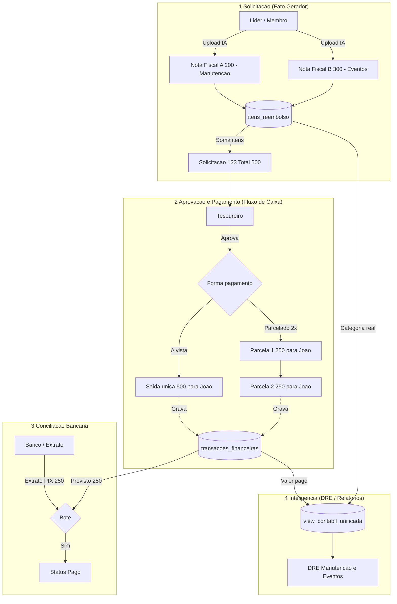
```mermaid
graph TD
    Lider[Lider / Membro]
    Tesoureiro[Tesoureiro]
    Banco[Banco / Extrato]

    subgraph S1["1 Solicitacao (Fato Gerador)"]
        NF1["Nota Fiscal A 200 - Manutencao"]
        NF2["Nota Fiscal B 300 - Eventos"]
        ItensDB[(itens_reembolso)]

        Lider -->|"Upload IA"| NF1
        Lider -->|"Upload IA"| NF2
        NF1 --> ItensDB
        NF2 --> ItensDB
        ItensDB -->|"Soma itens"| Solic["Solicitacao 123 Total 500"]
    end

    subgraph S2["2 Aprovacao e Pagamento (Fluxo de Caixa)"]
        Solic --> Tesoureiro
        Tesoureiro -->|"Aprova"| Decisao{Forma pagamento}

        Decisao -->|"A vista"| T1["Saida unica 500 para Joao"]
        Decisao -->|"Parcelado 2x"| T2["Parcela 1 250 para Joao"]
        T2 --> T3["Parcela 2 250 para Joao"]

        T1 -.->|"Grava"| FinDB[(transacoes_financeiras)]
        T3 -.->|"Grava"| FinDB
    end

    subgraph S3["3 Conciliacao Bancaria"]
        Banco -->|"Extrato PIX 250"| Conc{Bate}
        FinDB -->|"Previsto 250"| Conc
        Conc -->|"Sim"| Pago["Status Pago"]
    end

    subgraph S4["4 Inteligencia (DRE / Relatorios)"]
        View[(view_contabil_unificada)]
        FinDB -->|"Valor pago"| View
        ItensDB -->|"Categoria real"| View
        View --> DRE["DRE Manutencao e Eventos"]
    end

```

---

## Regras de Negócio Importantes

### O que altera o DRE

- ✅ Criação de novo fato gerador
- ✅ Reclassificação de categoria de um fato gerador
- ✅ Estorno de fato gerador
- ✅ Ajuste de competência (mudança de mês/ano)

### O que NÃO altera o DRE

- ❌ Forma de pagamento (à vista, parcelado, PIX, boleto)
- ❌ Data de pagamento diferente da competência
- ❌ Juros ou descontos aplicados no caixa
- ❌ Estorno apenas de pagamento (sem estornar fato gerador)

### O que altera o Caixa

- ✅ Registro de pagamento/recebimento
- ✅ Conciliação bancária
- ✅ Ajustes de saldo manual
- ✅ Juros, multas ou descontos aplicados

---

## Referências

- **Decisão Arquitetural**: [ADR-001 - Separação Fato Gerador vs Caixa vs DRE](../adr/ADR-001-separacao-fato-gerador-caixa-dre.md)
- **Funcionalidades Detalhadas**: [Módulo Financeiro](../funcionalidades.md#2-módulo-financeiro)
- **Guia do Usuário**: [Manual - Seção Financeiro](../manual-usuario.md#4-módulo-financeiro)
- **Sequência Temporal**: [Diagrama de Sequência](sequencia-financeira.md)
- **Composição do DRE**: [Diagrama DRE](dre.md)
- **Modelo de Dados**: [Database ER Diagram](../database-er-diagram.md)

## Fluxo de Exportação (Entradas e Saídas)

Período (jul/2026): `ExportarTab` trocou os 2 seletores de data única
(`Calendar` mode="single" separados, "Data Início"/"Data Fim") pelo mesmo
`MonthPicker` já usado em Entradas/Saídas — mês com atalhos + range
customizado, resolvido via `getPeriodoRange` (mesmo helper do CORE,
`lib/periodo`).

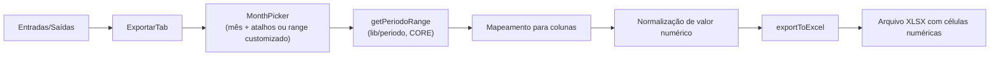
```mermaid
flowchart LR
    UI[Entradas/Saídas] --> TAB[ExportarTab]
    TAB --> MP["MonthPicker\n(mês + atalhos ou range customizado)"]
    MP --> PERIODO["getPeriodoRange\n(lib/periodo, CORE)"]
    PERIODO --> MAP[Mapeamento para colunas]
    MAP --> NORMALIZE[Normalização de valor numérico]
    NORMALIZE --> XLSX[exportToExcel]
    XLSX --> FILE[Arquivo XLSX com células numéricas]
```

## CORE do Financeiro — Fase F0 (ADR-029)

Camada de helpers puros compartilhados inaugurada em
`src/features/financeiro/core`, consumida por Entradas e Saídas sem mudança
de comportamento. Fases seguintes (F1+) adicionam `core/api` (wrappers das
RPCs `fin_*`) e `core/hooks`. Roadmap completo em
[`../arquitetura-financeiro.md`](../arquitetura-financeiro.md).

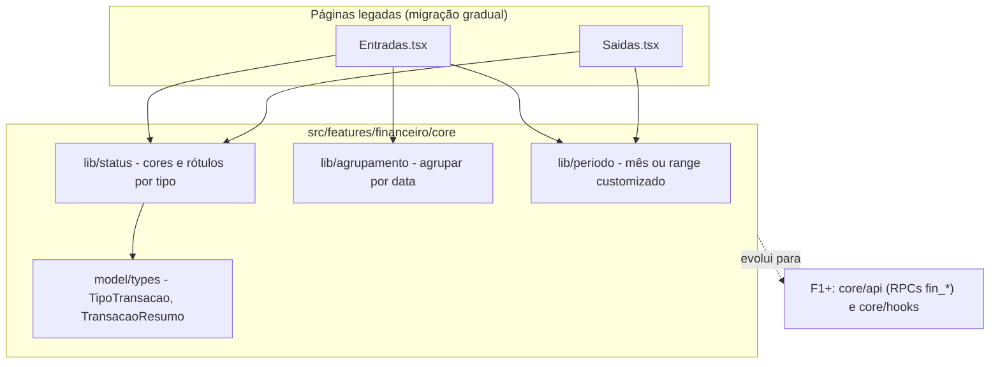
```mermaid
flowchart TD
    subgraph PAGES["Páginas legadas (migração gradual)"]
        ENT[Entradas.tsx]
        SAI[Saidas.tsx]
    end

    subgraph CORE["src/features/financeiro/core"]
        STATUS["lib/status - cores e rótulos por tipo"]
        AGRUP["lib/agrupamento - agrupar por data"]
        PERIODO["lib/periodo - mês ou range customizado"]
        TYPES["model/types - TipoTransacao, TransacaoResumo"]
    end

    ENT --> STATUS
    ENT --> AGRUP
    ENT --> PERIODO
    SAI --> STATUS
    SAI --> PERIODO
    STATUS --> TYPES

    FUT["F1+: core/api (RPCs fin_*) e core/hooks"]
    CORE -.evolui para.-> FUT
```

## CORE de escrita no banco — Fases F1/F1.5/F2/F2.5 (ADR-029/030)

Implementado em jul/2026: toda escrita financeira dos canais migrados passa
pelas RPCs canônicas `fin_*` (migrations `20260710120000`, `20260710123000`
e `20260710130000`). Nenhum dos canais abaixo faz INSERT/UPDATE/DELETE
direto em `transacoes_financeiras`/`transferencias_contas`; a conciliação
(F3+) e as importações de extrato (F5) permanecem nos caminhos atuais.

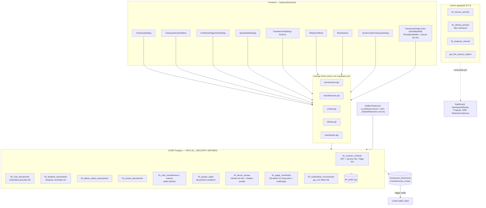
```mermaid
flowchart TD
    subgraph FE["Frontend — features/financeiro"]
        TP["TransacoesPage única (entrada|saida)\nEntradas/Saidas = cascas de rota"]
        TD2[TransacaoDialog]
        AM[TransacaoActionsMenu]
        CP[ConfirmarPagamentoDialog]
        AS[AjusteSaldoDialog]
        TF[TransferenciaDialog / Estorno]
        RO[RelatorioOferta]
        RE[Reembolsos]
        QC[QuickCreateTransacaoDialog]
    end

    subgraph API["core/api (único ponto com supabase.rpc)"]
        LAPI[lancamentos.api]
        TAPI[transferencias.api]
        CAPI[contas.api]
        OAPI[ofertas.api]
        RAPI[reembolsos.api]
    end

    BOT["chatbot-financeiro\n(x-webhook-secret + shim\n_shared/financeiro-core.ts)"]

    subgraph RPC["CORE Postgres — RPCs fin_* (SECURITY DEFINER)"]
        CTX[fin_resolver_contexto\nJWT × service role + flags bot]
        W1[fin_criar_lancamento\nmaterializa parcelas D6]
        W2[fin_atualizar_lancamento\nbloqueia conciliado D4]
        W3[fin_alterar_status_lancamento]
        W4[fin_excluir_lancamento]
        W5[fin_criar_transferencia + estorno\nsaldo atômico]
        W6[fin_ajustar_saldo\nlançamento auditável]
        W7[fin_lancar_sessao\nofertas em lote + finaliza sessão]
        W8[fin_pagar_reembolso\nD9 admin OU tesoureiro + notificação]
        JOB[fin_materializar_recorrencias\npg_cron diário D6]
        AUD[(fin_audit_log)]
    end

    subgraph READ["Leitura agregada (F2.5)"]
        R1[fin_resumo_periodo]
        R2[fin_ofertas_periodo\nfiltro estrutural]
        R3[fin_projecao_mensal]
        R4[get_dre_anual p_regime]
    end

    TD2 & AM & CP & AS & TF & RO & RE & QC --> API
    TP --> API
    API --> RPC
    BOT --> RPC
    RPC --> AUD
    RPC --> T[(transacoes_financeiras\ntransferencias_contas)]
    T -->|trigger saldo| SALDO[contas.saldo_atual]
    READ -.consumido por.-> DASH[Dashboard, DashboardOfertas,\nProjeção, DRE, RelatorioCobertura]
```

## Conciliação transacional — Fase F3 (ADR-030)

Implementado em jul/2026 (migration `20260711140000`). A confirmação
multi-tabela que rodava no frontend (`ConciliacaoInteligente.tsx:421-703`, ~6
updates sem transação) vira uma chamada a `fin_confirmar_conciliacao`, com o
formato inferido pela cardinalidade. O motor de score legado
(`ConciliacaoManual`/`DashboardConciliacao`) fica para a F4.

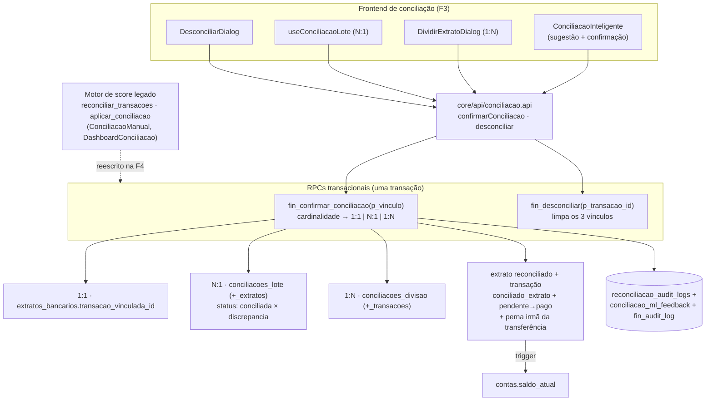
```mermaid
flowchart TD
    subgraph UI["Frontend de conciliação (F3)"]
        CI["ConciliacaoInteligente\n(sugestão + confirmação)"]
        DIV["DividirExtratoDialog (1:N)"]
        LOTE["useConciliacaoLote (N:1)"]
        DESC["DesconciliarDialog"]
    end

    CAPI["core/api/conciliacao.api\nconfirmarConciliacao · desconciliar"]

    CI --> CAPI
    DIV --> CAPI
    LOTE --> CAPI
    DESC --> CAPI

    subgraph RPC["RPCs transacionais (uma transação)"]
        CONF["fin_confirmar_conciliacao(p_vinculo)\ncardinalidade → 1:1 | N:1 | 1:N"]
        UNDO["fin_desconciliar(p_transacao_id)\nlimpa os 3 vínculos"]
    end
    CAPI --> CONF
    CAPI --> UNDO

    CONF --> V11["1:1 · extratos_bancarios.transacao_vinculada_id"]
    CONF --> VN1["N:1 · conciliacoes_lote (+_extratos)\nstatus: conciliada × discrepancia"]
    CONF --> V1N["1:N · conciliacoes_divisao (+_transacoes)"]
    CONF --> BAIXA["extrato reconciliado + transação\nconciliado_extrato + pendente→pago\n+ perna irmã da transferência"]
    BAIXA -->|trigger| SALDO2[contas.saldo_atual]
    CONF --> AUD2[(reconciliacao_audit_logs +\nconciliacao_ml_feedback + fin_audit_log)]

    LEG["Motor de score legado\nreconciliar_transacoes · aplicar_conciliacao\n(ConciliacaoManual, DashboardConciliacao)"]
    LEG -.reescrito na F4.-> RPC
```

## Motor único de score — Fase F4 (ADR-030)

Implementado em jul/2026 (migration `20260711150000`). Elege um único motor de
candidatos de conciliação: a heurística client-side de `ConciliacaoInteligente`
e a RPC legada `reconciliar_transacoes` (score inteiro 50-100, só 1:1) saem de
cena; entra `fin_gerar_candidatos_conciliacao` (score contínuo 0..1, formatos
1:1 e 1:N, pesos valor 0.4 / data 0.3 / descrição 0.2 / tipo 0.1). O corte de
score passa a ser parametrizável por igreja em
`financeiro_config.conciliacao_score_minimo` (default 0.6). A aplicação usa a
porta transacional `fin_confirmar_conciliacao` da F3 (não mais
`aplicar_conciliacao`, que não dava baixa `pendente→pago`). As três funções
legadas (`reconciliar_transacoes`, `aplicar_conciliacao`,
`gerar_candidatos_conciliacao`) ficam **deprecadas** (sem `DROP` — removidas na
F7). A reclassificação (`reclass-transacoes`) passa a **recusar** transação já
conciliada (fechando o TODO de imutabilidade).

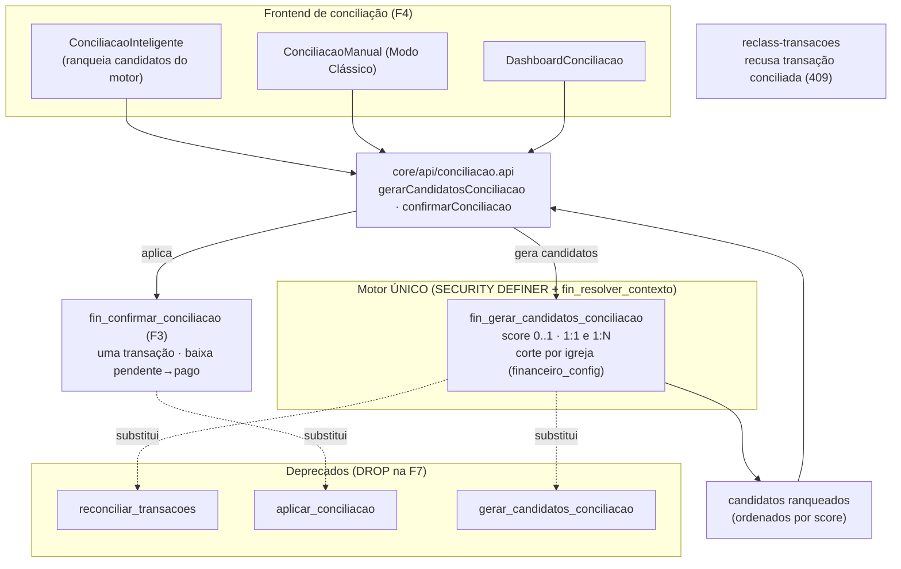
```mermaid
flowchart TD
    subgraph UI["Frontend de conciliação (F4)"]
        CI["ConciliacaoInteligente\n(ranqueia candidatos do motor)"]
        MAN["ConciliacaoManual (Modo Clássico)"]
        DASH["DashboardConciliacao"]
    end

    CAPI["core/api/conciliacao.api\ngerarCandidatosConciliacao · confirmarConciliacao"]

    CI --> CAPI
    MAN --> CAPI
    DASH --> CAPI

    subgraph MOTOR["Motor ÚNICO (SECURITY DEFINER + fin_resolver_contexto)"]
        GEN["fin_gerar_candidatos_conciliacao\nscore 0..1 · 1:1 e 1:N\ncorte por igreja (financeiro_config)"]
    end
    CAPI -->|gera candidatos| GEN
    GEN --> RANK["candidatos ranqueados\n(ordenados por score)"]
    RANK --> CAPI
    CAPI -->|aplica| CONF["fin_confirmar_conciliacao (F3)\numa transação · baixa pendente→pago"]

    subgraph DEP["Deprecados (DROP na F7)"]
        L1[reconciliar_transacoes]
        L2[aplicar_conciliacao]
        L3[gerar_candidatos_conciliacao]
    end
    GEN -.substitui.-> L1
    GEN -.substitui.-> L3
    CONF -.substitui.-> L2

    RECLASS["reclass-transacoes\nrecusa transação conciliada (409)"]
```

## Ingestão de extratos — Fase F5 completa (ADR-022/028)

Implementado em jul/2026 (migrations `20260712120000` + `20260712130000`).
Porta única `fin_ingerir_extratos` (contrato `ExtratoItem`) substitui **todos**
os INSERTs/upserts diretos em `extratos_bancarios` — canal **manual**
(OFX/CSV/XLSX), **santander-api** (sync Open Banking), **getnet-sftp**
(settlement_v1 + extrato_eletrônico_v10/LQ) e **PIX** (webhook + 2 caminhos de
polling). Valor normalizado para ABS, dedupe por `(conta_id, external_id)` com
id determinístico, job + undo. Adaptadores service-role usam `canal='integracao'`
sem ator humano (D-F5.2). PIX resolve `conta_id` (helper `ingerirExtratoPix`)
por `cob_pix.conta_id` (cobrança conhecida) ou por `contas.cnpj_banco` casando
com o CNPJ do Santander (mesma lógica já usada em `Contas.tsx`/"Testar").

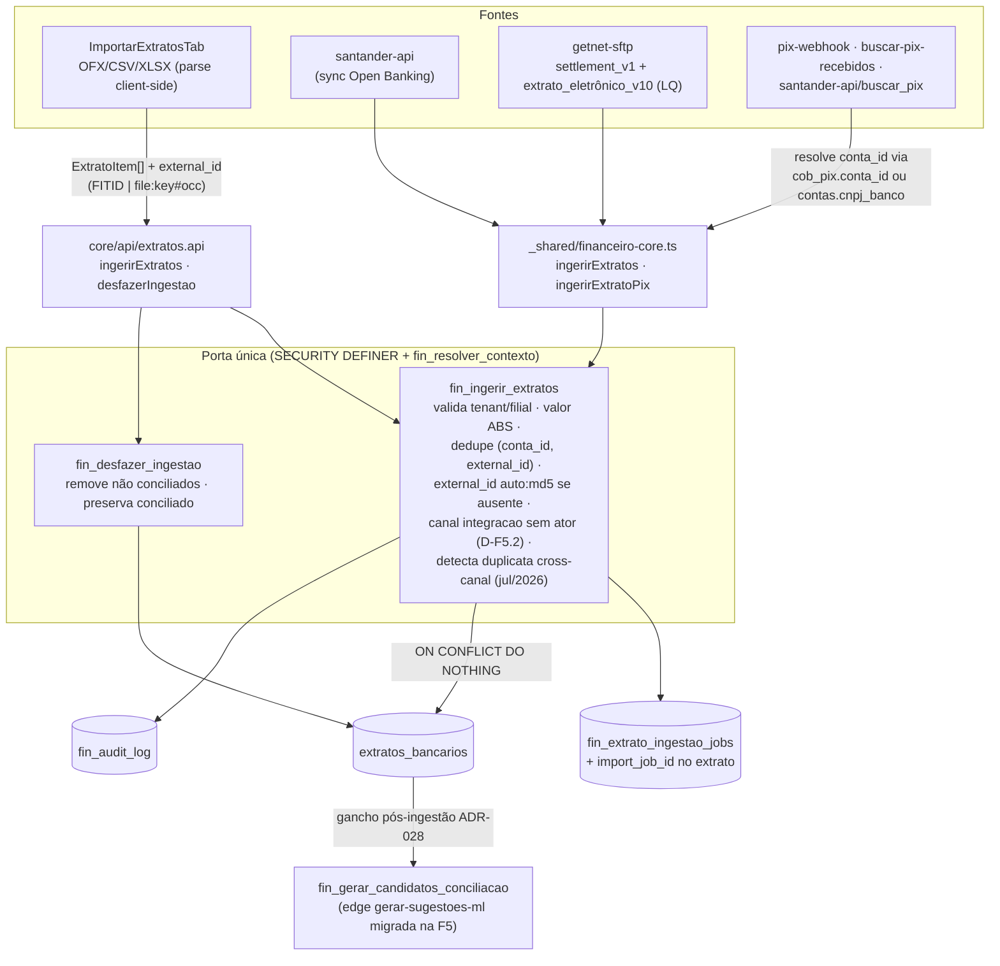
```mermaid
flowchart TD
    subgraph SRC["Fontes"]
        OFX["ImportarExtratosTab\nOFX/CSV/XLSX (parse client-side)"]
        SAN["santander-api\n(sync Open Banking)"]
        GET["getnet-sftp\nsettlement_v1 + extrato_eletrônico_v10 (LQ)"]
        PIX["pix-webhook · buscar-pix-recebidos ·\nsantander-api/buscar_pix"]
    end

    EAPI["core/api/extratos.api\ningerirExtratos · desfazerIngestao"]
    SHIM["_shared/financeiro-core.ts\ningerirExtratos · ingerirExtratoPix"]
    OFX -->|"ExtratoItem[] + external_id\n(FITID | file:key#occ)"| EAPI
    SAN --> SHIM
    GET --> SHIM
    PIX -->|"resolve conta_id via\ncob_pix.conta_id ou contas.cnpj_banco"| SHIM

    subgraph RPC["Porta única (SECURITY DEFINER + fin_resolver_contexto)"]
        ING["fin_ingerir_extratos\nvalida tenant/filial · valor ABS ·\ndedupe (conta_id, external_id) ·\nexternal_id auto:md5 se ausente ·\ncanal integracao sem ator (D-F5.2) ·\ndetecta duplicata cross-canal (jul/2026)"]
        UNDO["fin_desfazer_ingestao\nremove não conciliados · preserva conciliado"]
    end
    EAPI --> ING
    EAPI --> UNDO
    SHIM --> ING

    ING --> JOB[(fin_extrato_ingestao_jobs\n+ import_job_id no extrato)]
    ING -->|ON CONFLICT DO NOTHING| EXT[(extratos_bancarios)]
    ING --> AUD[(fin_audit_log)]
    UNDO --> EXT

    EXT -->|gancho pós-ingestão ADR-028| SCORE["fin_gerar_candidatos_conciliacao\n(edge gerar-sugestoes-ml migrada na F5)"]
```

## Endurecimento — Fase F7 (sub-frente 1/5 ✅ COMPLETA, jul/2026)

Migrations `20260713140000` + `20260713150000` + `20260713160000`. Fecha a
"regra de ouro" do §7.1 do `arquitetura-financeiro.md` com enforcement de
banco (`REVOKE`), não só convenção de código — **as 7 tabelas do domínio**
agora revogadas para `authenticated`/`anon`. A 1ª migration revogou as 5 já
100% migradas; a auditoria daquela rodada achou 13 call-sites de escrita
direta ainda vivos em `transacoes_financeiras`/`extratos_bancarios` — foram
migrados para RPCs `fin_*` (2 novas: `fin_alternar_conferencia_manual`,
`fin_marcar_extrato_ignorado`) antes da 3ª migration estender o `REVOKE` a
essas duas (ver §9.6). As 3 RPCs legadas de conciliação deprecadas na F4
(+ 1 achado bônus, órfã) foram `DROP`adas na 1ª migration.

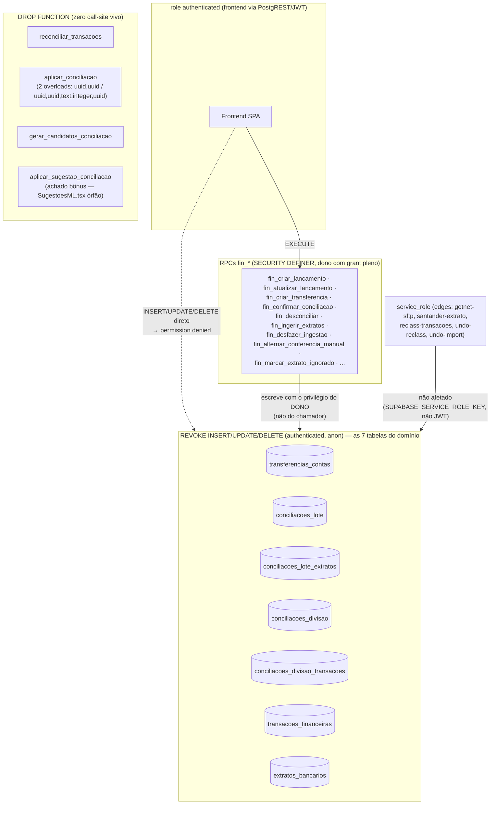
```mermaid
flowchart TD
    subgraph AUTH["role authenticated (frontend via PostgREST/JWT)"]
        FE["Frontend SPA"]
    end

    subgraph REVOGADO["REVOKE INSERT/UPDATE/DELETE (authenticated, anon) — as 7 tabelas do domínio"]
        T1[(transferencias_contas)]
        T2[(conciliacoes_lote)]
        T3[(conciliacoes_lote_extratos)]
        T4[(conciliacoes_divisao)]
        T5[(conciliacoes_divisao_transacoes)]
        T6[(transacoes_financeiras)]
        T7[(extratos_bancarios)]
    end

    FE -.->|"INSERT/UPDATE/DELETE direto\n→ permission denied"| REVOGADO

    subgraph CORE["RPCs fin_* (SECURITY DEFINER, dono com grant pleno)"]
        RPC["fin_criar_lancamento · fin_atualizar_lancamento ·\nfin_criar_transferencia · fin_confirmar_conciliacao ·\nfin_desconciliar · fin_ingerir_extratos ·\nfin_desfazer_ingestao · fin_alternar_conferencia_manual ·\nfin_marcar_extrato_ignorado · ..."]
    end
    FE -->|EXECUTE| RPC
    RPC -->|"escreve com o privilégio do DONO\n(não do chamador)"| REVOGADO

    subgraph DROP["DROP FUNCTION (zero call-site vivo)"]
        L1[reconciliar_transacoes]
        L2["aplicar_conciliacao\n(2 overloads: uuid,uuid / uuid,uuid,text,integer,uuid)"]
        L3[gerar_candidatos_conciliacao]
        L4["aplicar_sugestao_conciliacao\n(achado bônus — SugestoesML.tsx órfão)"]
    end

    SR["service_role (edges: getnet-sftp, santander-extrato,\nreclass-transacoes, undo-reclass, undo-import)"] -->|"não afetado\n(SUPABASE_SERVICE_ROLE_KEY, não JWT)"| REVOGADO
```

## Decomposição/responsivo — Fase F7 (sub-frente 2/5, EM ANDAMENTO, jul/2026)

`ConciliacaoInteligente.tsx` (item crítico do §6.3 — colunas fixas
lado-a-lado, "inutilizável em celular") decomposto para
`src/features/financeiro/conciliacao/`, mesmo padrão do `TransacaoDialog`
(`useIsMobile` + layout mobile dedicado). `Reconciliacao.tsx` ganhou
`TabsList` com scroll horizontal no lugar do `grid-cols-5` fixo. Pendente:
`ConciliacaoManual`/`DashboardConciliacao`/`HistoricoExtratos` (ver §9.8 do
`arquitetura-financeiro.md`).

**C2-0 (ago/2026, §9.98):** um único `MonthPicker` na barra de filtros
(compartilhado pelos dois painéis); `SugestaoTag` unifica visual ML + F4
sem badge de %; trocar período zera seleção (evita Confirmar sobre IDs
ocultos — totais só contam linhas filtradas).

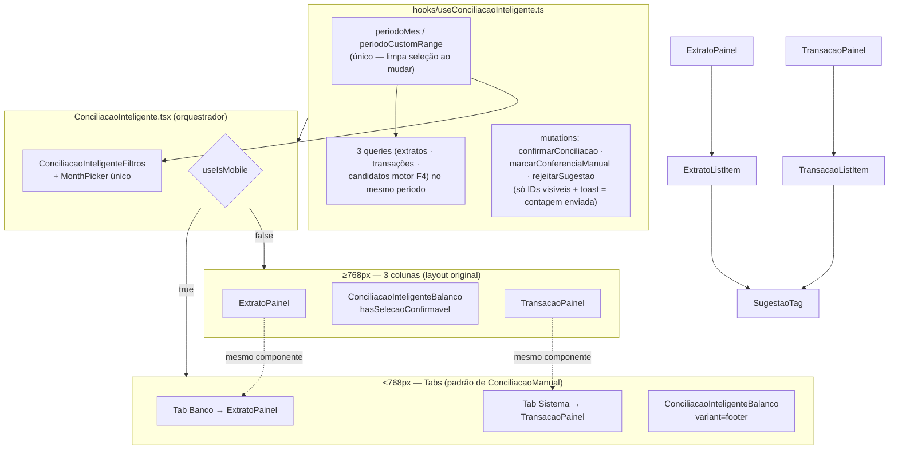
```mermaid
flowchart TD
    subgraph HOOK["hooks/useConciliacaoInteligente.ts"]
        P["periodoMes / periodoCustomRange\n(único — limpa seleção ao mudar)"]
        Q["3 queries (extratos · transações ·\ncandidatos motor F4) no mesmo período"]
        M["mutations: confirmarConciliacao ·\nmarcarConferenciaManual · rejeitarSugestao\n(só IDs visíveis + toast = contagem enviada)"]
    end

    subgraph ORQ["ConciliacaoInteligente.tsx (orquestrador)"]
        FILT["ConciliacaoInteligenteFiltros\n+ MonthPicker único"]
        MOBILE{useIsMobile}
    end
    HOOK --> ORQ
    P --> FILT
    P --> Q

    subgraph DESKTOP["≥768px — 3 colunas (layout original)"]
        D1[ExtratoPainel]
        D2["ConciliacaoInteligenteBalanco\nhasSelecaoConfirmavel"]
        D3[TransacaoPainel]
    end

    subgraph MOBILE_UI["<768px — Tabs (padrão de ConciliacaoManual)"]
        T1["Tab Banco → ExtratoPainel"]
        T2["Tab Sistema → TransacaoPainel"]
        F["ConciliacaoInteligenteBalanco\nvariant=footer"]
    end

    MOBILE -->|false| DESKTOP
    MOBILE -->|true| MOBILE_UI

    D1 -.mesmo componente.-> T1
    D3 -.mesmo componente.-> T2

    ExtratoPainel --> ExtratoListItem
    ExtratoListItem --> SugestaoTag
    TransacaoPainel --> TransacaoListItem
    TransacaoListItem --> SugestaoTag
```

## Decomposição — ConciliacaoManual + DashboardConciliacao (F7 sub-frente 2/5, item 3, jul/2026)

Mesmo domínio (motor único F4), decompostas juntas — mas como orquestradores
**separados** (propósitos divergem: modo clássico com abas vs. dashboard com
stats). Compartilham só o que era genuinamente duplicado: a lógica de
"Reconciliar Automático" e os 4 diálogos secundários. `HistoricoExtratos`
(item 4) recebeu apenas ajuste responsivo, sem decomposição — ver §9.9.

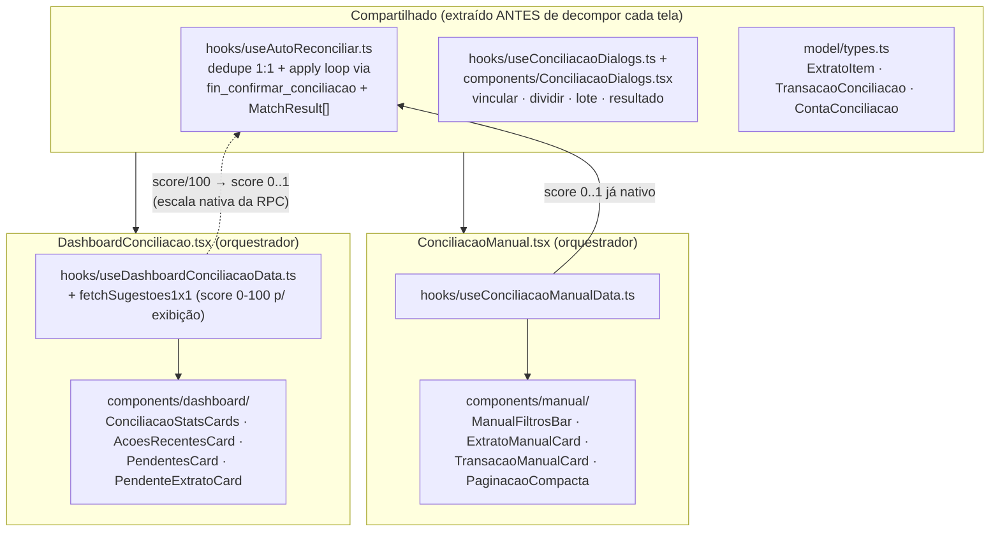
```mermaid
flowchart TD
    subgraph SHARED["Compartilhado (extraído ANTES de decompor cada tela)"]
        AR["hooks/useAutoReconciliar.ts\ndedupe 1:1 + apply loop via\nfin_confirmar_conciliacao + MatchResult[]"]
        CD["hooks/useConciliacaoDialogs.ts +\ncomponents/ConciliacaoDialogs.tsx\nvincular · dividir · lote · resultado"]
        TY["model/types.ts\nExtratoItem · TransacaoConciliacao · ContaConciliacao"]
    end

    subgraph MANUAL["ConciliacaoManual.tsx (orquestrador)"]
        MD["hooks/useConciliacaoManualData.ts"]
        MF["components/manual/\nManualFiltrosBar · ExtratoManualCard ·\nTransacaoManualCard · PaginacaoCompacta"]
    end

    subgraph DASH["DashboardConciliacao.tsx (orquestrador)"]
        DD["hooks/useDashboardConciliacaoData.ts\n+ fetchSugestoes1x1 (score 0-100 p/ exibição)"]
        DF["components/dashboard/\nConciliacaoStatsCards · AcoesRecentesCard ·\nPendentesCard · PendenteExtratoCard"]
    end

    SHARED --> MANUAL
    SHARED --> DASH
    MD --> MF
    DD --> DF

    DD -."score/100 → score 0..1\n(escala nativa da RPC)".-> AR
    MD -->|"score 0..1 já nativo"| AR
```

## F7 — frentes 3, 4 e 5 (bottom-nav, DRE mobile, código morto, jul/2026)

Fecha as 3 frentes restantes do roadmap F7 (ver §9.10 do
`arquitetura-financeiro.md`). Único item aberto: decomposição completa de
`HistoricoExtratos.tsx` (§9.9, tratado com ajuste responsivo mínimo).

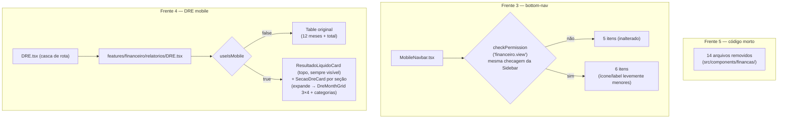
```mermaid
flowchart TD
    subgraph F5["Frente 5 — código morto"]
        D1["14 arquivos removidos\n(src/components/financas/)"]
    end

    subgraph F3["Frente 3 — bottom-nav"]
        NAV["MobileNavbar.tsx"]
        PERM{"checkPermission\n('financeiro.view')\nmesma checagem da Sidebar"}
        NAV --> PERM
        PERM -->|não| NAV5["5 itens (inalterado)"]
        PERM -->|sim| NAV6["6 itens\n(ícone/label levemente menores)"]
    end

    subgraph F4["Frente 4 — DRE mobile"]
        DRE["DRE.tsx (casca de rota)"]
        DREF["features/financeiro/relatorios/DRE.tsx"]
        DRE --> DREF
        DREF --> ISM{useIsMobile}
        ISM -->|false| TABLE["Table original\n(12 meses + total)"]
        ISM -->|true| CARDS["ResultadoLiquidoCard (topo, sempre visível)\n+ SecaoDreCard por seção\n(expande → DreMonthGrid 3×4 + categorias)"]
    end
```

## Correções pós-F7 — PR #54 (jul/2026)

Ver §9.11 do `arquitetura-financeiro.md`. Achados da conferência visual real
na Conciliação Inteligente: badge de tipo (entrada/saída) + filtro de
categoria no `QuickCreateTransacaoDialog`, bug de comparação `"credit"` vs
`"credito"` no cálculo do tipo, e badge de conta no painel "Sistema"
(incluindo contas desativadas, P2 do review Codex).

## Detecção de duplicata cross-canal Getnet×Santander (jul/2026)

Ver §9.12 do `arquitetura-financeiro.md`. Migration `20260717150000`.
Getnet SFTP (cron diário) e Santander (importação manual) podem gerar duas
linhas em `extratos_bancarios` para a mesma antecipação liquidada — nenhuma
colide no dedupe técnico `(conta_id, external_id)`, já que cada provedor gera
o `external_id` a partir de campos só seus.

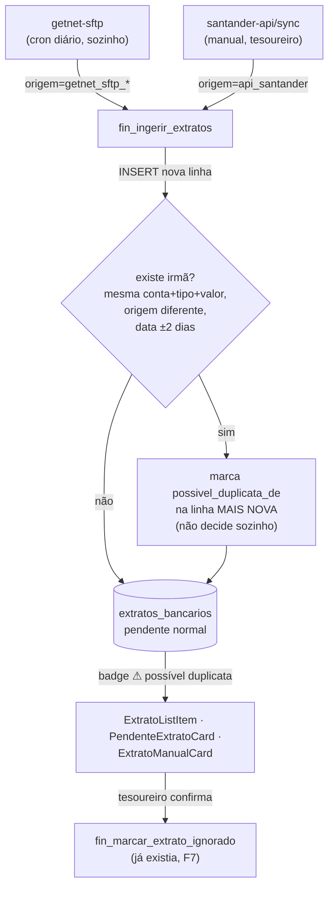
```mermaid
flowchart TD
    GET["getnet-sftp\n(cron diário, sozinho)"] -->|"origem=getnet_sftp_*"| ING["fin_ingerir_extratos"]
    SAN["santander-api/sync\n(manual, tesoureiro)"] -->|"origem=api_santander"| ING

    ING -->|"INSERT nova linha"| CHECK{"existe irmã?\nmesma conta+tipo+valor,\norigem diferente,\ndata ±2 dias"}
    CHECK -->|não| EXT[(extratos_bancarios\npendente normal)]
    CHECK -->|sim| FLAG["marca possivel_duplicata_de\nna linha MAIS NOVA\n(não decide sozinho)"]
    FLAG --> EXT

    EXT -->|"badge ⚠ possível duplicata"| UI["ExtratoListItem · PendenteExtratoCard ·\nExtratoManualCard"]
    UI -->|"tesoureiro confirma"| IGN["fin_marcar_extrato_ignorado\n(já existia, F7)"]
```

## Fix: depósito duplicado descartado no sync Santander (jul/2026)

Ver §9.13 do `arquitetura-financeiro.md`. A API de extrato do Santander não
devolve nenhum id por transação para depósito em terminal 24h — duas linhas
reais e distintas no mesmo dia/valor/descrição geravam o mesmo
`external_id` (fallback por hash) e a 2ª era descartada silenciosamente.

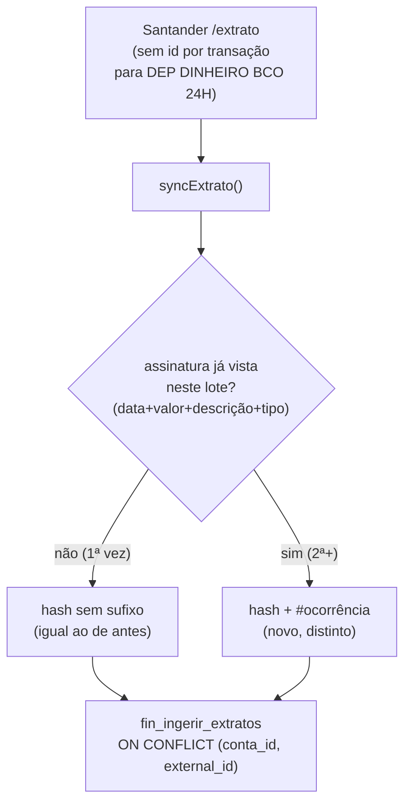
```mermaid
flowchart TD
    API["Santander /extrato\n(sem id por transação\npara DEP DINHEIRO BCO 24H)"] --> SYNC["syncExtrato()"]
    SYNC --> SIG{"assinatura já vista\nneste lote?\n(data+valor+descrição+tipo)"}
    SIG -->|"não (1ª vez)"| H0["hash sem sufixo\n(igual ao de antes)"]
    SIG -->|"sim (2ª+)"| H1["hash + #ocorrência\n(novo, distinto)"]
    H0 --> ING["fin_ingerir_extratos\nON CONFLICT (conta_id, external_id)"]
    H1 --> ING
```

## Fix: taxa administrativa somava em vez de subtrair em entradas (jul/2026)

Ver §9.15 do `arquitetura-financeiro.md` e ADR-027 (fórmula atualizada).
Corrigido em 4 RPCs `fin_*` + `TransacaoDialog.tsx` (que tinha o mesmo bug
de sinal, mais um bug de formatação que multiplicava taxas fracionárias
por 10 ao editar um lançamento existente).

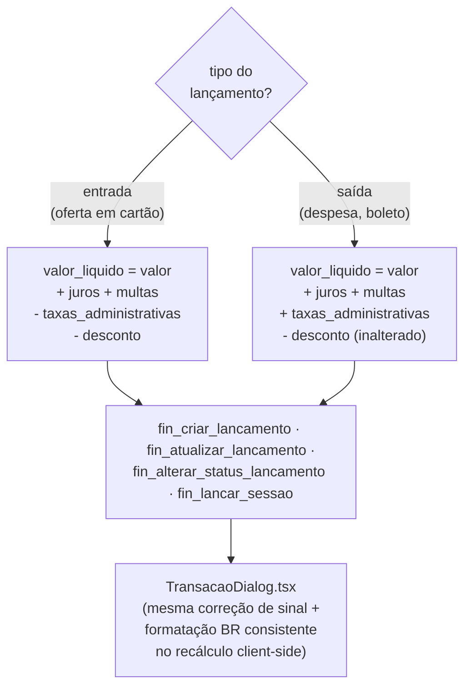
```mermaid
flowchart TD
    TIPO{"tipo do\nlançamento?"}
    TIPO -->|"entrada\n(oferta em cartão)"| SUB["valor_liquido = valor\n+ juros + multas\n- taxas_administrativas\n- desconto"]
    TIPO -->|"saída\n(despesa, boleto)"| SOM["valor_liquido = valor\n+ juros + multas\n+ taxas_administrativas\n- desconto (inalterado)"]

    SUB --> RPCS["fin_criar_lancamento · fin_atualizar_lancamento ·\nfin_alterar_status_lancamento · fin_lancar_sessao"]
    SOM --> RPCS
    RPCS --> UI["TransacaoDialog.tsx\n(mesma correção de sinal +\nformatação BR consistente\nno recálculo client-side)"]
```

## Visibilidade de taxa na tela de Entradas (jul/2026)

Ver §9.16 do `arquitetura-financeiro.md`. Fecha o Achado 4 direto nos cards
de resumo já existentes — sem relatório novo.

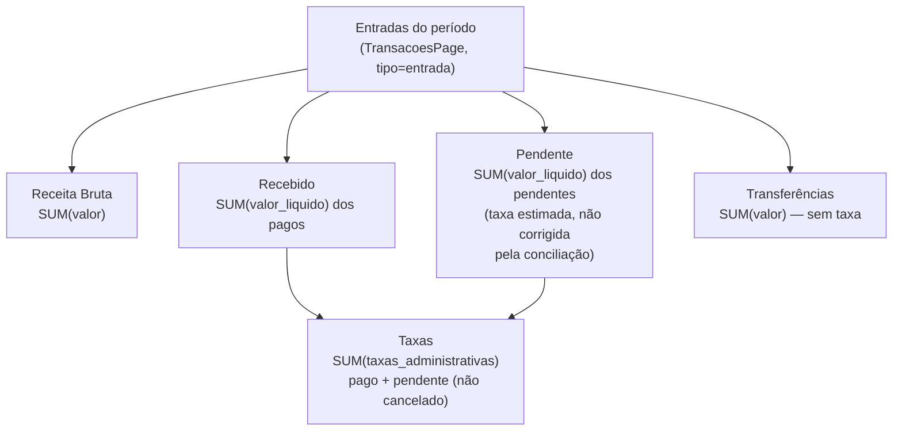
```mermaid
flowchart TD
    ENT["Entradas do período\n(TransacoesPage, tipo=entrada)"]
    ENT --> BRUTA["Receita Bruta\nSUM(valor)"]
    ENT --> REC["Recebido\nSUM(valor_liquido) dos pagos"]
    ENT --> PEND["Pendente\nSUM(valor_liquido) dos pendentes\n(taxa estimada, não corrigida\npela conciliação)"]
    REC --> TAXAS["Taxas\nSUM(taxas_administrativas)\npago + pendente (não cancelado)"]
    PEND --> TAXAS
    ENT --> TRANSF["Transferências\nSUM(valor) — sem taxa"]
```

## Filtro "Sem X" na Reclassificação (jul/2026)

Ver §5.5 do `arquitetura-financeiro.md`. Os 5 filtros da etapa 1 não tinham
como buscar lançamentos com campo NULO — útil pra achar o que falta
classificar, em entradas e saídas.

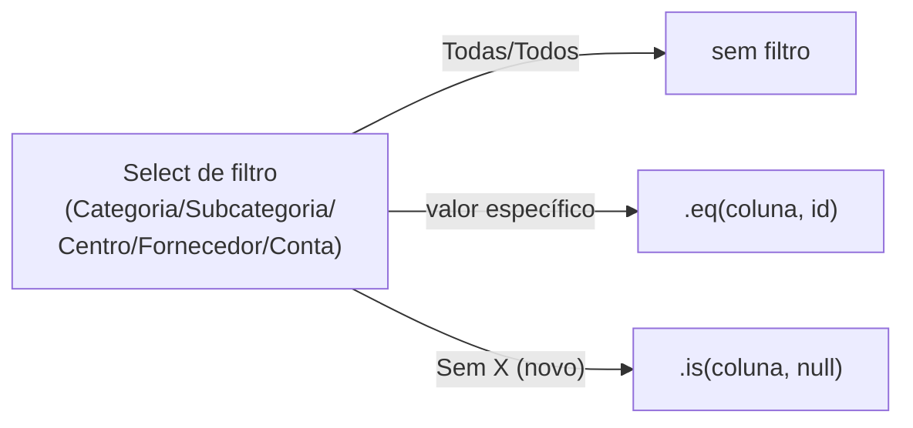
```mermaid
flowchart LR
    SEL["Select de filtro\n(Categoria/Subcategoria/\nCentro/Fornecedor/Conta)"]
    SEL -->|"Todas/Todos"| ALL["sem filtro"]
    SEL -->|"valor específico"| EQ[".eq(coluna, id)"]
    SEL -->|"Sem X (novo)"| NULL[".is(coluna, null)"]
```

## Bloqueio de conciliada por campo na Reclassificação (jul/2026)

Ver §5.5 do `arquitetura-financeiro.md`. O bloqueio de transação conciliada
era tudo-ou-nada; agora só bloqueia quando o campo alterado afeta o vínculo
bancário ou o período do DRE. Uma allow-list de colunas garante que valor
monetário e datas de vencimento/pagamento nunca passam por este endpoint,
independente do payload recebido.

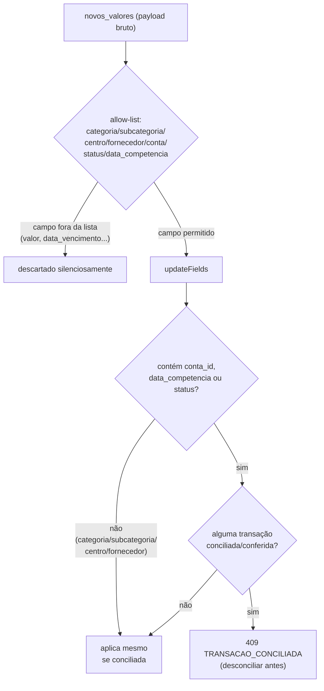
```mermaid
flowchart TD
    RAW["novos_valores (payload bruto)"] --> ALLOW{"allow-list:\ncategoria/subcategoria/\ncentro/fornecedor/conta/\nstatus/data_competencia"}
    ALLOW -->|"campo fora da lista\n(valor, data_vencimento...)"| DROP["descartado silenciosamente"]
    ALLOW -->|"campo permitido"| REQ["updateFields"]
    REQ --> CHECK{"contém conta_id,\ndata_competencia ou status?"}
    CHECK -->|"não\n(categoria/subcategoria/\ncentro/fornecedor)"| LIVRE["aplica mesmo\nse conciliada"]
    CHECK -->|"sim"| CONC{"alguma transação\nconciliada/conferida?"}
    CONC -->|"não"| LIVRE
    CONC -->|"sim"| BLOQ["409 TRANSACAO_CONCILIADA\n(desconciliar antes)"]
```

## Importação do Recebível Extrato Detalhado (portal Getnet) — Fase A (jul/2026)

Ver §9.17 do `arquitetura-financeiro.md`. Uso alternativo quando o SFTP
Getnet está indisponível — upload manual do CSV do portal, em vez do EDI
V10.1 automático. Fase A: só importa e agrupa por `Contrato Registradora`;
vínculo com extrato bancário e lançamento do deságio são Fase B.

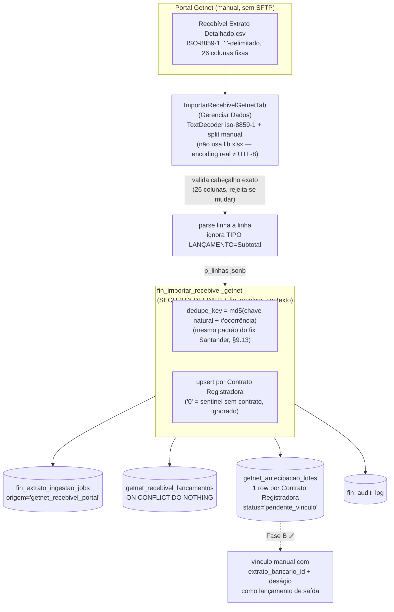
```mermaid
flowchart TD
    subgraph PORTAL["Portal Getnet (manual, sem SFTP)"]
        CSV["Recebível Extrato Detalhado.csv\nISO-8859-1, ';'-delimitado, 26 colunas fixas"]
    end

    CSV --> COMP["ImportarRecebivelGetnetTab\n(Gerenciar Dados)\nTextDecoder iso-8859-1 + split manual\n(não usa lib xlsx — encoding real ≠ UTF-8)"]
    COMP -->|"valida cabeçalho exato\n(26 colunas, rejeita se mudar)"| PARSE["parse linha a linha\nignora TIPO LANÇAMENTO=Subtotal"]

    subgraph RPC["fin_importar_recebivel_getnet\n(SECURITY DEFINER + fin_resolver_contexto)"]
        DEDUPE["dedupe_key = md5(chave natural + #ocorrência)\n(mesmo padrão do fix Santander, §9.13)"]
        UPSERT["upsert por Contrato Registradora\n('0' = sentinel sem contrato, ignorado)"]
    end

    PARSE -->|"p_linhas jsonb"| RPC
    RPC --> JOB[(fin_extrato_ingestao_jobs\norigem='getnet_recebivel_portal')]
    RPC --> LANC[(getnet_recebivel_lancamentos\nON CONFLICT DO NOTHING)]
    RPC --> LOTE[(getnet_antecipacao_lotes\n1 row por Contrato Registradora\nstatus='pendente_vinculo')]
    RPC --> AUD[(fin_audit_log)]

    LOTE -.->|"Fase B ✅"| VINC["vínculo manual com\nextrato_bancario_id + deságio\ncomo lançamento de saída"]
```

## Fase B do Recebível Getnet + FK real de forma de pagamento (jul/2026)

Ver §9.18 do `arquitetura-financeiro.md`. Completa o fluxo acima: vínculo
manual do lote com o extrato bancário, lançamento do deságio via
`fin_criar_lancamento` (porta única, não INSERT direto), e conferência de
totais só de leitura. A conferência só ficou confiável depois de
`forma_pagamento_id` virar FK real — antes, `transacoes_financeiras.
forma_pagamento` era texto solto com 4 formatos incompatíveis gravados por
4 escritores diferentes.

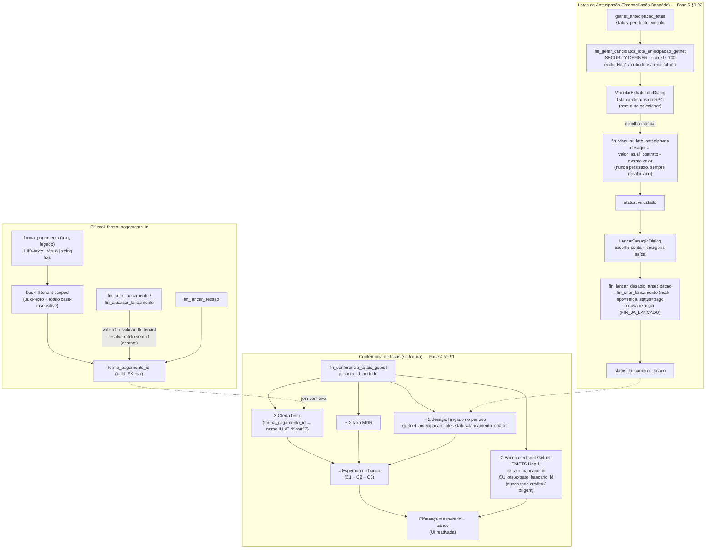
```mermaid
flowchart TD
    subgraph FK["FK real: forma_pagamento_id"]
        TXT["forma_pagamento (text, legado)\nUUID-texto | rótulo | string fixa"]
        BACK["backfill tenant-scoped\n(uuid-texto + rótulo case-insensitive)"]
        TXT --> BACK
        BACK --> FPID["forma_pagamento_id (uuid, FK real)"]
        CRIAR["fin_criar_lancamento /\nfin_atualizar_lancamento"] -->|"valida fin_validar_fk_tenant\nresolve rótulo sem id (chatbot)"| FPID
        SESSAO["fin_lancar_sessao"] --> FPID
    end

    subgraph LOTES["Lotes de Antecipação (Reconciliação Bancária) — Fase 5 §9.92"]
        LISTA["getnet_antecipacao_lotes\nstatus: pendente_vinculo"]
        CAND["fin_gerar_candidatos_lote_antecipacao_getnet\nSECURITY DEFINER · score 0..100\nexclui Hop1 / outro lote / reconciliado"]
        VDLG["VincularExtratoLoteDialog\nlista candidatos da RPC\n(sem auto-selecionar)"]
        LISTA --> CAND --> VDLG
        VDLG -->|"escolha manual"| VINC2["fin_vincular_lote_antecipacao\ndeságio = valor_atual_contrato - extrato.valor\n(nunca persistido, sempre recalculado)"]
        VINC2 --> VINCULADO["status: vinculado"]
        VINCULADO --> LDLG["LancarDesagioDialog\nescolhe conta + categoria saída"]
        LDLG --> LANC["fin_lancar_desagio_antecipacao\n→ fin_criar_lancamento (real)\ntipo=saida, status=pago\nrecusa relançar (FIN_JA_LANCADO)"]
        LANC --> CRIADO["status: lancamento_criado"]
    end

    subgraph CONF["Conferência de totais (só leitura) — Fase 4 §9.91"]
        RPC3["fin_conferencia_totais_getnet\np_conta_id, período"]
        RPC3 --> C1["Σ Oferta bruto\n(forma_pagamento_id → nome ILIKE '%cart%')"]
        RPC3 --> C2["− Σ taxa MDR"]
        RPC3 --> C3["− Σ deságio lançado no período\n(getnet_antecipacao_lotes.status=lancamento_criado)"]
        C1 --> ESP["= Esperado no banco\n(C1 − C2 − C3)"]
        C2 --> ESP
        C3 --> ESP
        RPC3 --> BCO["Σ Banco creditado Getnet:\nEXISTS Hop 1 extrato_bancario_id\nOU lote.extrato_bancario_id\n(nunca todo crédito / origem)"]
        ESP --> DIFF["Diferença = esperado − banco\n(UI reativada)"]
        BCO --> DIFF
    end

    FPID -.->|"join confiável"| C1
    CRIADO -.-> C3
```

## Fase 1 — Hop 2 candidatos Oferta ↔ Venda Getnet (§9.88)

Só leitura. CSV real do portal fechou: `valor_venda` repete o bruto por
parcela (usar 1× por NSU); `bandeira_modalidade` é texto com Crédito/
Débito (`ILIKE` / regex). Writer do vínculo = Fase 2.

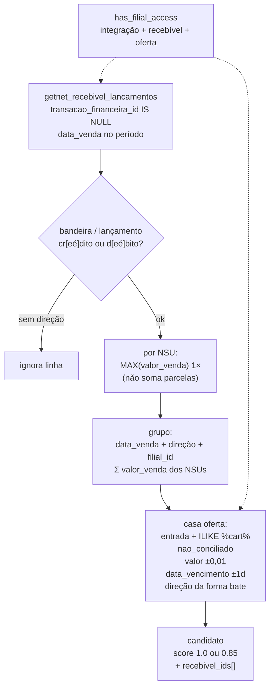
```mermaid
flowchart TD
    CSV["getnet_recebivel_lancamentos\ntransacao_financeira_id IS NULL\ndata_venda no período"]
    CSV --> DIR{"bandeira / lançamento\ncr[eé]dito ou d[eé]bito?"}
    DIR -->|sem direção| SKIP["ignora linha"]
    DIR -->|ok| NSU["por NSU:\nMAX(valor_venda) 1×\n(não soma parcelas)"]
    NSU --> GRP["grupo:\ndata_venda + direção + filial_id\nΣ valor_venda dos NSUs"]
    GRP --> MATCH["casa oferta:\nentrada + ILIKE %cart%\nnao_conciliado\nvalor ±0,01\ndata_vencimento ±1d\ndireção da forma bate"]
    MATCH --> OUT["candidato\nscore 1.0 ou 0.85\n+ recebivel_ids[]"]
    HFA["has_filial_access\nintegração + recebível + oferta"] -.-> CSV
    HFA -.-> MATCH
```

## Fase 2 (+2b) — Hop 2 confirmação Oferta ↔ Venda Getnet (§9.89)

Writer: grava `transacao_financeira_id`, atualiza oferta, marca
`conciliado_manual`. Parcelado exige 1..N completo.

```mermaid
flowchart TD
    IN["fin_vincular_venda_getnet_oferta\np_transacao_id + p_recebivel_ids"]
    IN --> CTX["fin_resolver_contexto\n+ FOR NO KEY UPDATE ORDER BY id"]
    CTX --> G["guards:\nentrada · nao_conciliado\nhas_filial_access\nrecebível livre\nfilial mista só c/ âncora"]
    G --> P{"mesmo NSU com N>1?"}
    P -->|não · à vista| AV["bruto 1×/NSU ≈ oferta ±0,01\nΣ taxas/líquido das linhas\nlink todos → oferta\nfin_atualizar_lancamento\n(taxas · líquido · data · pago)"]
    P -->|sim · 2b| COMP{"conjunto 1..N\ncompleto?"}
    COMP -->|não| REJ["FIN_VALIDACAO"]
    COMP -->|sim| PAR["oferta → parcela 1/N\nINSERT irmãs 2..N\n(lancamento_pai_id)\nlink 1:1 CSV→parcela"]
    AV --> CM["conciliacao_status =\nconciliado_manual"]
    PAR --> CM
    CM --> AUD["fin_registrar_auditoria\ntipo_match=oferta_venda_getnet"]
```

## Fase 3 — Hop 1 Venda ↔ Banco Getnet (§9.90)

Sem antecipação. Coluna `extrato_bancario_id` independente do Hop 2.
Discrepância de valor: score 0.5 nos candidatos; warning no writer.

```mermaid
flowchart TD
    CSV["getnet_recebivel_lancamentos\ncontrato_registradora IS NULL\nextrato_bancario_id IS NULL"]
    CSV --> GRP["grupo: data_vencimento + filial\nΣ líquido por linha"]
    GRP --> MATCH["casa crédito da conta:\ntipo=credito · reconciliado=false\nNOT IN getnet_antecipacao_lotes\ndata ±1d · valor ±0,01 (1.0/0.85)\nou discrepância ≤5%/R$1 (0.5)"]
    MATCH --> CAND["candidato + recebivel_ids[]"]
    CAND --> VIN["fin_vincular_venda_banco_getnet"]
    VIN --> G["guards: HFA · livre · sem contrato\nfilial mista só c/ âncora"]
    G --> W["grava extrato_bancario_id\nextrato.reconciliado=true\ndelta>0,01 → warning"]
    HFA["has_filial_access\nintegração · conta · recebível · extrato"] -.-> CSV
    HFA -.-> MATCH
```

## Fase 6 — UI consolidada Conciliação Cartão (§9.93)

Sem migration. A aba “Lotes de Antecipação” vira “Conciliação Cartão”:
filtros por período + 3 seções. Hop 1/2 confirmam em lote (checkbox);
lotes de antecipação seguem dialog por item.

```mermaid
flowchart TD
    TAB["Aba Conciliação Cartão\n(Reconciliacao · value=antecipacao)"]
    TAB --> FILT["Filtros: integração · conta · período · filial contexto"]
    FILT --> H2["Hop 2 candidatos\nfin_gerar_candidatos_oferta_venda_getnet"]
    FILT --> H1["Hop 1 candidatos\nfin_gerar_candidatos_venda_banco_getnet"]
    FILT --> LOTES["Lotes antecipação\n(tabela existente)"]
    FILT --> CONF["ConferenciaTotaisGetnetCard\nfiltros controlados"]
    H2 -->|"checkbox + confirmar N"| W2["fin_vincular_venda_getnet_oferta"]
    H1 -->|"checkbox + confirmar N"| W1["fin_vincular_venda_banco_getnet"]
    LOTES -->|"dialog por lote"| W3["fin_vincular_lote_antecipacao\n+ fin_lancar_desagio_antecipacao"]
    W2 -.-> CONF
    W1 -.-> CONF
    W3 -.-> CONF
```

## Fase 7a — Ledger unificado (RPCs de leitura) (§9.94)

Só leitura. UI do ledger = Fase 7b. Writers inalterados.

```mermaid
flowchart TD
    LED["fin_listar_ledger_conciliacao_cartao\nintegração · conta · período · filial"]
    LED --> RAIZ["raízes cartão\nconta_id + lancamento_pai_id IS NULL"]
    RAIZ --> GRP["grupo = raiz ∪ filhas"]
    GRP --> REC["recebíveis\nintegracao_id + HFA"]
    REC --> ST{"status linha"}
    ST -->|sem recebível| S2["sem_hop2\n+ sugestão Hop 2\n1 call/período DISTINCT ON"]
    ST -->|batidas ≥ membros| FE["fechado"]
    ST -->|parcial| AG["aguardando_banco"]
    ST -->|Σ líquido ≠ extrato >0,01| DIV["divergencia"]
    REC --> PAR["hop1_status:\nfechado · antecipada · aguardando"]
    LED --> LOT["lotes integracao_id\nextrato só c/ HFA"]
    LOT --> VO["vendas_origem\nlíquido parcela\noferta meta c/ HFA"]
    BUS["fin_buscar_recebiveis_getnet_oferta\np_integracao_id + p_busca"] --> LIV["livres do EC\nscore 0..100"]
    LIV -.->|"confirma"| W2["fin_vincular_venda_getnet_oferta"]
```

## Fase 7b — UI do ledger unificado (§9.95)

Substitui Hop 2 / Hop 1 / tabela de lotes empilhados por uma linha
expansível por lançamento. Writers inalterados.

```mermaid
flowchart TD
    TAB["LotesAntecipacaoTab\nfiltros + ConferenciaTotais"] --> LEDGER["ConciliacaoCartaoLedger"]
    LEDGER -->|"1 call"| LRPC["fin_listar_ledger_conciliacao_cartao"]
    LEDGER -->|"1 call/período"| H1["fin_gerar_candidatos_venda_banco_getnet"]
    H1 --> MATCH{"rematch UI:\ndata_vencimento_real + filial\nignora parcela com lote_id"}
    MATCH -->|"aguardando_banco"| BTN1["Confirmar sugestão Hop 1"]
    LEDGER -->|"sem_hop2 + sugestão"| BTN2["Confirmar / bulk"]
    LEDGER -->|"Buscar manualmente"| BUSCA["BuscaManualDialog\nfin_buscar_recebiveis_getnet_oferta"]
    BTN2 --> W2["fin_vincular_venda_getnet_oferta"]
    BUSCA --> W2
    BTN1 --> W1["fin_vincular_venda_banco_getnet"]
    LEDGER --> LOTES["lotes do período"]
    LOTES --> W3["fin_vincular_lote_antecipacao\n+ fin_lancar_desagio_antecipacao"]
    W2 -.-> INV["invalidate:\nledger · Hop1 · conferência · lotes"]
    W1 -.-> INV
    W3 -.-> INV
```

## Hotfix — drift `parcelas` text→integer (§9.96)

Tudo numa migration **nova** (`20260807100000`): `supabase db push` não
reaplica migrations históricas já aplicadas.

```mermaid
flowchart TD
    DRIFT["prod: parcelas integer\ngit: assumia text"] --> BUG["COALESCE(parcelas, '1 de 1')\n22P02 no planejamento"]
    BUG --> HOP2["fin_vincular_venda_getnet_oferta"]
    BUG --> LED["fin_listar_ledger_conciliacao_cartao"]
    FWD["20260807100000 forward"] --> ALTER["ALTER COLUMN integer\nUSING text|integer"]
    FWD --> R1["CREATE OR REPLACE Hop 2\nv_parcelado := false"]
    FWD --> R2["CREATE OR REPLACE ledger\nparcela via oferta ou 1"]
    FWD --> R3["CREATE OR REPLACE importar\n'N de M' → NULL"]
```

## Competência de grupo em lançamentos parcelados — D10 (jul/2026)

Ver §9.19 do `arquitetura-financeiro.md`. Fecha o cenário B ("Despesa
Parcelada", acima): `fin_criar_lancamento` já materializava todas as
parcelas com a mesma competência na criação; faltava impedir que uma
edição posterior (isolada ou em lote) fizesse uma parcela divergir do
grupo sem que ninguém notasse.

```mermaid
flowchart TD
    EDIT["fin_atualizar_lancamento\np_patch com data_competencia"]
    CHECK{"tipo_lancamento='parcelado'\ne tem irmãs (lancamento_pai_id\nou total_parcelas>1)?"}
    EDIT --> CHECK
    CHECK -->|não| APLICA["aplica normalmente\n(inclui recorrente — competência\nprópria por ocorrência)"]
    CHECK -->|"sim, sem _permitir_divergencia_competencia"| BLOQ["rejeita:\nFIN_COMPETENCIA_GRUPO"]
    CHECK -->|"sim, com _permitir_divergencia_competencia=true"| ESCAPE["aplica só nesta parcela\n(exceção pontual, não exposta na UI)"]

    BLOQ --> UI["TransacaoDialog.tsx\ncatch detecta o erro nomeado"]
    UI --> CONFIRMA["AlertDialog:\nsincronizar competência do grupo?"]
    CONFIRMA -->|confirma| SYNC["fin_alterar_competencia_grupo\np_lancamento_id, p_nova_competencia"]

    SYNC --> CONCILIADA{"alguma parcela do grupo\njá conciliada?"}
    CONCILIADA -->|sim| REJ["rejeita: FIN_CONCILIADO\n(lista os ids)"]
    CONCILIADA -->|não| UPDATE["UPDATE em todas as parcelas\n(id=pai OU lancamento_pai_id=pai)\nnuma única transação"]
    UPDATE --> WARN{"alguma parcela\njá paga?"}
    WARN -->|sim| AVISO["warning: revisar DRE por\ncompetência do período afetado"]
    WARN -->|não| OK["ok"]

    RECLASS["reclass-transacoes\n(lote)"] -->|"data_competencia\nem updateFields"| GRUPO{"todas as parcelas\nirmãs estão na seleção?"}
    GRUPO -->|não| REJ2["409 GRUPO_PARCELADO_INCOMPLETO\n(lista ids_irmas_faltantes)"]
    GRUPO -->|sim| APLICA2["aplica no lote normalmente"]
```

## RLS de `extratos_bancarios` ganha `has_filial_access` — Fase 3/4 pós-#67
(§9.85 do `arquitetura-financeiro.md`)

```mermaid
flowchart TD
    Q["supabase.from(\"extratos_bancarios\")\n.select(...) — 15 call-sites, 11 arquivos"]
    Q --> RLS{"policy SELECT:\nrole IN (admin*,tesoureiro)\nAND has_filial_access(igreja_id, filial_id)"}
    RLS -->|"filial do JWT\nou user_filial_access"| VE["vê a linha"]
    RLS -->|"outra filial,\nsem permissão explícita"| INV["linha invisível\n(RLS filtra, sem erro)"]
    RLS -->|"filial_id IS NULL\n(registro global)"| VE
    RLS -->|"has_role(admin)"| VEALL["vê tudo do tenant\n(e de outros tenants —\ngap herdado, fora de escopo)"]

    subgraph "Único caso intencionalmente cross-filial"
      VLD["VincularExtratoLoteDialog.tsx"]
      VLD -->|"lote com filial própria"| C1["eq(filial_id, lote.filial_id)"]
      VLD -->|"lote global + filial restrita"| C2["or(filial_id.eq.X,\nfilial_id.is.null)"]
      VLD -->|"todas as filiais"| C3["sem filtro client-side"]
    end
```

`fin_confirmar_conciliacao` (Fase 4/4, PR separada) segue o mesmo padrão
de `has_filial_access`, mas dentro de 2 loops (N extratos × N transações).

## `fin_confirmar_conciliacao` ganha `has_filial_access` — Fase 4/4, última
(§9.86 do `arquitetura-financeiro.md`)

```mermaid
flowchart TD
    CALL["fin_confirmar_conciliacao\np_vinculo: extrato_ids[], transacao_ids[], divisoes[]?"]
    CALL --> LE["loop extratos: ORDER BY id, FOR UPDATE\n+ filial_id no SELECT"]
    LE --> HFAE{"has_filial_access\npor item?"}
    HFAE -->|não| REJ1["FIN_TENANT"]
    HFAE -->|sim| ACE["filial_id NULL? marca âncora compartilhada\nfilial_id concreta? acumula em v_filiais_distintas"]
    ACE --> LT["loop transações: ORDER BY id, FOR UPDATE\n+ filial_id no SELECT"]
    LT --> HFAT{"has_filial_access\npor item?"}
    HFAT -->|não| REJ1
    HFAT -->|sim| ACT["mesma acumulação\n(âncora / v_filiais_distintas)"]

    ACT --> MISTA{"≥2 filiais concretas\nDISTINTAS?"}
    MISTA -->|"sim, SEM âncora compartilhada"| REJM["FIN_VALIDACAO:\nfiliais diferentes"]
    MISTA -->|"sim, COM âncora (filial_id IS NULL\nem algum item)"| NULO["v_filial_efetiva = NULL\n(espelha o motor F4)"]
    MISTA -->|não, só 1 filial| UNICA["v_filial_efetiva = essa filial"]

    NULO --> FORMATO
    UNICA --> FORMATO{"1:1 / N:1 (lote) /\n1:N (divisão)"}

    FORMATO -->|"1:N"| BYPASS{"divisoes[].transacao_id\n≡ transacao_ids?"}
    BYPASS -->|não| REJD["FIN_VALIDACAO:\ndivergência divisoes×transacao_ids\n(fecha bypass de tenant/filial)"]
    BYPASS -->|sim| WRITE

    FORMATO -->|"1:1 / N:1"| WRITE["conciliacoes_lote/divisao:\nfilial_id = v_filial_efetiva (RECURSO)\n\nreconciliacao_audit_logs/\nconciliacao_ml_feedback:\nfilial_id = v_ctx (ATOR — RelatorioCobertura\nfiltra por isso, .or(eq,is.null))"]
```

Achado pelo review multi-agente, não pela filial-access em si: o ramo 1:N
inseria `conciliacoes_divisao_transacoes` a partir de `p_vinculo->
'divisoes'`, campo separado de `transacao_ids` (o único array travado/
checado) — um item só em `divisoes` nunca passava por tenant/filial.
Bypass de isolamento de TENANT, mais grave que o gap de filial que
motivou esta fase.

Fecha o backlog de `has_filial_access` nas 8 RPCs/policies `SECURITY
DEFINER` de §11 — Fases 1-3 já mergeadas (RPCs triviais, transferência/
ajuste/reembolso, RLS de `extratos_bancarios`).

## Ciclo 2 (C2-1) — Modo Clássico como estado derivado (§9.99)

`ConciliacaoManual` (aba "Por Extrato") deixa de listar todo extrato
`reconciliado=false` e passa a mostrar só o que sobrou depois dos motores
Cartão (Getnet) e Inteligente (F4) já terem tentado. C2-0 (period-picker
único no Modo Inteligente) está documentado na seção F7 acima (§9.98).

```mermaid
flowchart TD
    E["extratos_bancarios\nreconciliado=false"] --> F4["fin_gerar_candidatos_conciliacao\n(motor F4)"]
    E --> LOTE{"getnet_antecipacao_lotes.\nextrato_bancario_id preenchido?"}
    F4 -->|tem candidato| INT["fica no Modo Inteligente\n(sugestão a confirmar)"]
    LOTE -->|sim, vinculado| CARTAO["já tomado pelo Cartão\n(reconciliado NÃO marcado — achado C2-1)"]
    F4 -->|sem candidato| CLASSICO["fin_listar_extratos_sem_candidato"]
    LOTE -->|não| CLASSICO
    CLASSICO --> UI["Modo Clássico — 'Por Extrato'\ncom campo motivo"]
```

## Ciclo 2 (C2-2) — Card "Cartão" em Extratos/Histórico (§9.100)

Identidade da venda = `(data_venda, filial_id, nsu)` — não `nsu` sozinho.
"Vinculadas ao banco" inclui Hop 1 direto **e** lote de antecipação.

```mermaid
flowchart TD
    G["getnet_recebivel_lancamentos\n(1 linha por parcela)"] --> D{"COUNT(*) ingenuo"}
    D --> BUG["venda 3x = 3\n(inflado)"]
    G --> FIX["COUNT DISTINCT\n(data_venda, filial_id, nsu)"]
    FIX --> OK["venda 3x = 1\n(correto)"]
    FIX --> VINC["vinculada banco =\nextrato_bancario_id\nOU lote antecipação\n(contrato_registradora)"]
```

## Ciclo 2 (C2-3) — `valor_liquido_cobranca`: coluna + INSERT + backfill histórico (§9.101)

Parser já capturava `valorLiquidoCobranca`/`idBaixaCobrancaServico` (tipo
1, seq 29/32) desde sempre — INSERT descartava os dois campos antes de
chegar em `getnet_resumo`. `backfill_resumo_cobranca` reprocessa arquivo
já importado direto do bucket (sem SFTP live), paginado por marcador
persistente.

```mermaid
flowchart TD
    IMPORT["import_extrato/sync\n(arquivo novo)"] --> BRR["buildResumoRow"]
    BRR --> INS["INSERT getnet_resumo\nvalor_liquido_cobranca + id_baixa_cobranca_servico"]
    INS --> IGN{"upsertChunks\nignorou linha\n(ON CONFLICT)?"}
    IGN -->|não| STAMP["getnet_arquivos.\nresumo_cobranca_backfilled_at = now()"]
    IGN -->|sim| SKIP["marcador NÃO carimbado\n(elegível pro backfill)"]

    ADMIN["action=backfill_resumo_cobranca\n(operador, fora do SFTP)"] --> SEL["getnet_arquivos\nWHERE resumo_cobranca_backfilled_at IS NULL\nAND storage_path IS NOT NULL\nORDER BY data_referencia LIMIT batchSize"]
    SEL --> BEP["baixarEParsearDoBucket"]
    BEP --> UPD["UPDATE getnet_resumo\npor rv+data_rv+indicador+arquivo_nome"]
    UPD --> OUT{"outcome por linha"}
    OUT -->|atualizada| OK["conta pra completo"]
    OUT -->|pulada\n(chave em outro arquivo)| OK
    OUT -->|nao_encontrada / erro| RETRY["reselecionado na próxima chamada\n(arquivos_restantes > 0)"]
    OK --> COMPLETO{"todas resolvidas\nsem lacuna real?"}
    COMPLETO -->|sim| MARK["UPDATE marcador\n(checa error antes de contar)"]
    MARK -->|ok| STAMP
    MARK -->|erro| RETRY
    COMPLETO -->|não| RETRY
```

## Ciclo 2 (C2-4) — RPCs de leitura de ajustes/CI Getnet + tela "Ajustes Getnet" (§9.102)

`getnet_ajustes`/`getnet_resumo` (linhas CI) eram gravadas pelo import
desde sempre e nunca lidas por nenhuma tela. `getnet_ajustes` não tem
`filial_id` — `p_filial_id` na RPC de ajustes só valida acesso, não filtra
linha; `getnet_resumo` tem, então a RPC de CI filtra de verdade. Filtro/
ordenação das 2 RPCs usam `COALESCE(data_pagamento_rv, data_rv)` (data
financeira do extrato, não a origem do RV).

```mermaid
flowchart TD
    ADJ[(getnet_ajustes\nmotivo_ajuste bruto)] --> RPC1["fin_listar_ajustes_getnet"]
    MOT[(getnet_motivos_ajuste\n22 códigos, seed)] -->|LEFT JOIN| RPC1
    RPC1 --> DEC["motivo_descricao decodificado\nCOALESCE('?') se motivo_ajuste NULL"]

    RES[(getnet_resumo\nindicador_tipo_pagamento)] --> RPC2["fin_listar_resumo_ci_getnet"]
    RPC2 --> FILT{"indicador_tipo_pagamento\n= CI?"}
    FILT -->|sim| CI["linha CI\n(valor_liquido_cobranca\nsem filtrar NULL)"]

    DEC --> UI["AjustesGetnetCard\n(aba Conciliação Cartão)"]
    CI --> UI

    DT["COALESCE(data_pagamento_rv, data_rv)\nfiltro + ORDER BY"] -.-> RPC1
    DT -.-> RPC2

    HFA["has_filial_access\n(filial EFETIVA da integração)"] -.->|valida acesso, não filtra ajustes| RPC1
    HFA -.->|valida + filtra via v_scope| RPC2
```

## Ciclo 2 (C2-5) — Parser: campos de participante tipo5/tipo6 (§9.103)

Gap de bytes 149-255 (tipo5) e 155-261 (tipo6) nunca extraído. Tabelas
`getnet_financeiro_resumo`/`detalhe` vazias em produção hoje — sem amostra
real pra verificar empiricamente, implementação segue o manual V10.1
(decisão explícita do usuário), auditada linha a linha por agente
independente contra o PDF.

```mermaid
flowchart TD
    LINHA["linha posicional 400 bytes\ntipoRegistro = 5 ou 6"] --> TIPO{"charAt(0)"}
    TIPO -->|"5"| RESUMO["LAYOUT_FIN_RESUMO\nparticipanteCnpjCpf 171-184\nparticipanteBanco 187-189\nparticipanteAgencia 190-195\nparticipanteContaCorrente 196-215\nparticipanteRazaoSocial 231-255"]
    TIPO -->|"6"| DETALHE["LAYOUT_FIN_DETALHE\nparticipanteCnpjCpf 177-190\nparticipanteRazaoSocial 237-261\n(SEM banco/agência/conta —\nZEROS/ESPAÇO no manual)"]

    RESUMO --> INS1["INSERT getnet_financeiro_resumo\n(vazia em produção — 0 linhas até hoje)"]
    DETALHE --> INS2["INSERT getnet_financeiro_detalhe\n(vazia em produção — 0 linhas até hoje)"]

    INS1 --> RPC["fin_buscar_financeiro_participante_getnet\n(by numero_operacao)"]
    INS2 --> RPC
    RPC -.->|reaproveitada quando destravar| C210["C2-10 (bloqueada — evento AC real)"]
```

## Ciclo 2 (C2-6) — Separação extrato/cartão: nova estrutura, aditivo (§9.104)

Primeira etapa da separação estrutural do espelho sintético em
`extratos_bancarios` (causa raiz do `possivel_duplicata_de`, PR #55).
`getnet_credito_disponivel` é uma VIEW (`security_invoker=true`, não
tabela própria) sobre `getnet_resumo`/`getnet_financeiro_resumo`, mesmas
tabelas já alimentadas pelo pipeline que hoje escreve o espelho — sem
cópia derivada nova que possa divergir do dado bruto. Puramente aditivo: nenhum consumidor migra ainda
(C2-7).

```mermaid
flowchart TD
    ARQ["getnet_arquivos.espelho_origem\n(travado por arquivo, F6)"] --> LOCK{"origem?"}
    LOCK -->|"NULL ou getnet_sftp_txt"| T1["getnet_resumo\nindicador_tipo_pagamento = 'LQ'"]
    LOCK -->|"getnet_sftp_tipo5"| T5["getnet_financeiro_resumo\ntipo_operacao = 'PG'"]

    T1 --> VIEW["getnet_credito_disponivel\n(view, security_invoker=true)"]
    T5 --> VIEW
    CONTA["conta_id: coluna própria,\ncongelada no import,\nFK composta (conta_id,igreja_id)->contas"] -.->|"gravada por buildResumoRow/\nfinResRows, NUNCA relida"| T1
    CONTA -.-> T5
    INT["integracoes_financeiras\n(só filial_id)"] --> VIEW

    VIEW -.->|"comparado no harness\ncontra o espelho atual"| EB["extratos_bancarios\n(origem getnet_sftp_txt/tipo5)\nespelho legado, ainda em uso"]
    VIEW -.->|"cutover dos consumidores"| C27["C2-7 (fin_venda_banco_getnet_hop1,\nfin_conferencia_totais_getnet_hop1,\ngetnet_antecipacao_lotes)"]
```

