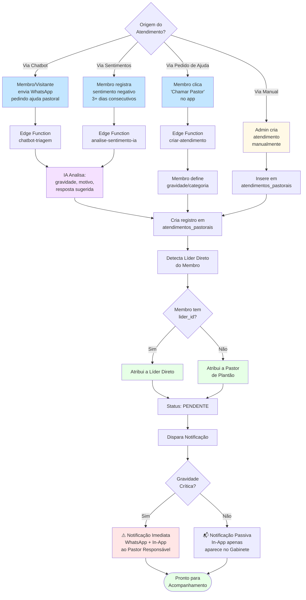
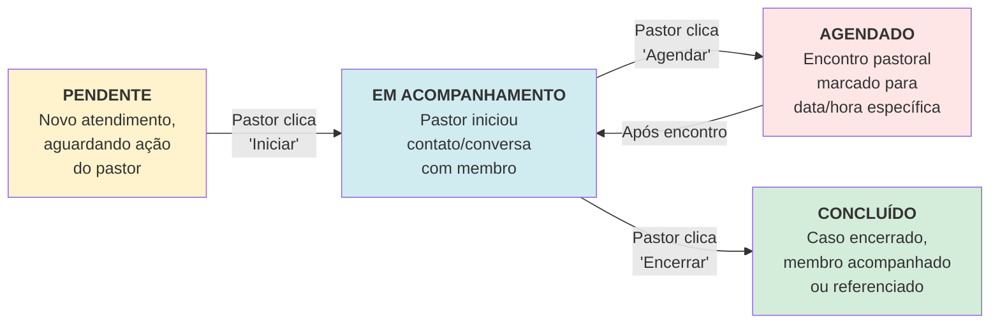
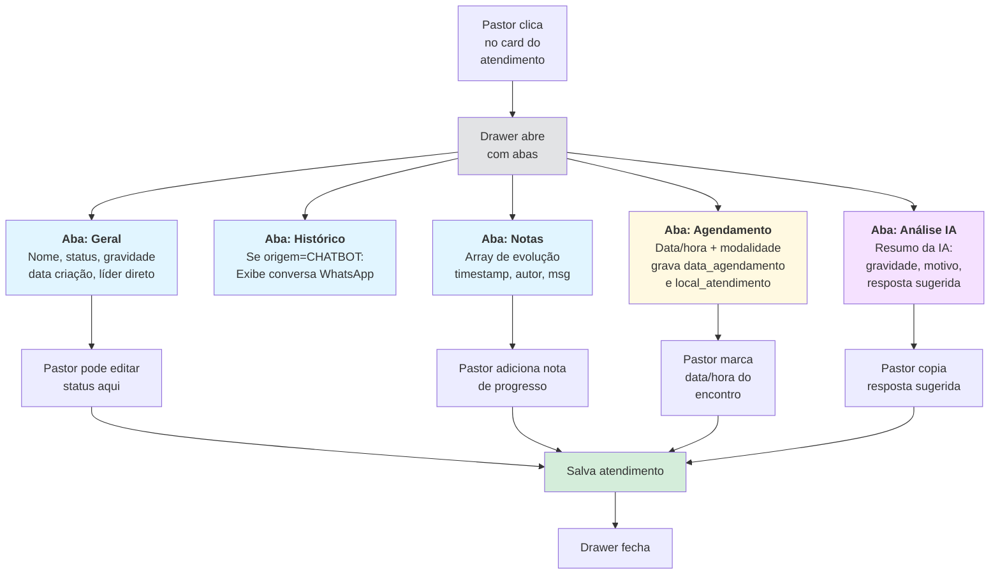
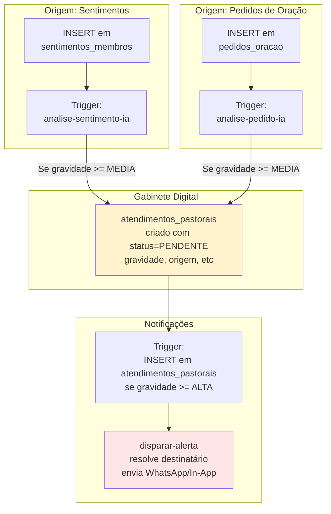
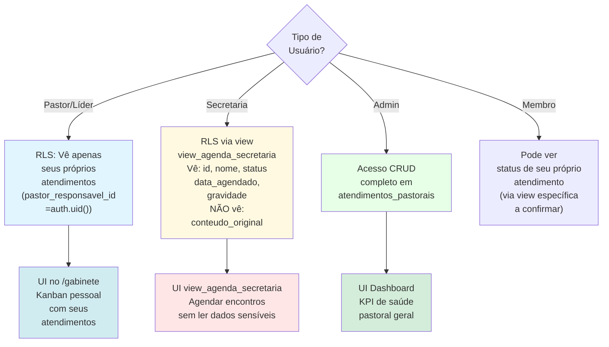
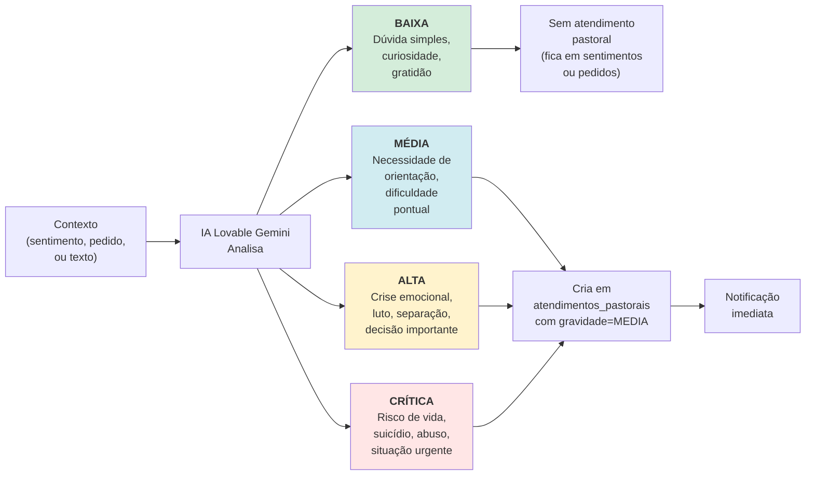

# Fluxo — Gabinete Digital e Cuidado Pastoral

Diagrama visual (Mermaid) do fluxo completo do **Gabinete Digital**, desde a criação automática de atendimentos até o acompanhamento e conclusão.

## 1. Fluxo Principal: Criação e Roteamento de Atendimentos

## 2. Fluxo de Estado: Kanban do Gabinete

## 3. Fluxo: Prontuário (Detalhe do Atendimento)

## 4. Fluxo: Integração com Outras Automações

## 5. Fluxo: RLS e Permissões

## 6. Critérios de Gravidade Automática (IA)

---

## Notas de Implementação

- **Dual-Write**: `analise-sentimento-ia` e `analise-pedido-ia` continuam escrevendo em `sentimentos_membros` e `pedidos_oracao` (compatibilidade legado) **E** criam `atendimentos_pastorais` para casos >= MÉDIA
- **Agendamento guiado**: Wizard exige nome/telefone e sugere membro/visitante existentes; grava `pessoa_id` ou `visitante_id`, `data_agendamento`, `local_atendimento` e `gravidade` manual; evita conflitos considerando `atendimentos_pastorais` e `agenda_pastoral`
- **Resolução de identidade no chatbot**: Se o telefone tem múltiplos `profiles`, ordena por data de nascimento mais antiga e criação mais antiga antes de vincular; caso não exista, cria `visitantes_leads`
- **Configuração Dinâmica**: Prompts e modelos buscados em `chatbot_configs`, não hardcoded nas edge functions
- **RLS Privacidade**: View `view_agenda_secretaria` permite secretaria agendar sem ler `conteudo_original`
- **Notificações Híbridas**: Imediatas para CRITICA, passivas para MEDIA/ALTA (só in-app, sem WhatsApp automático)
- **Referências**:
  - ADR-014: [`docs/adr/ADR-014-gabinete-digital-e-roteamento-pastoral.md`](../adr/ADR-014-gabinete-digital-e-roteamento-pastoral.md)
  - Funcionalidades: [`docs/funcionalidades.md#4-gabinete-digital-e-cuidado-pastoral`](../funcionalidades.md#4-gabinete-digital-e-cuidado-pastoral)
