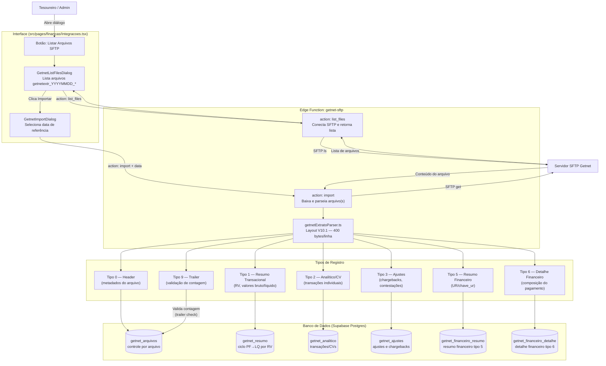
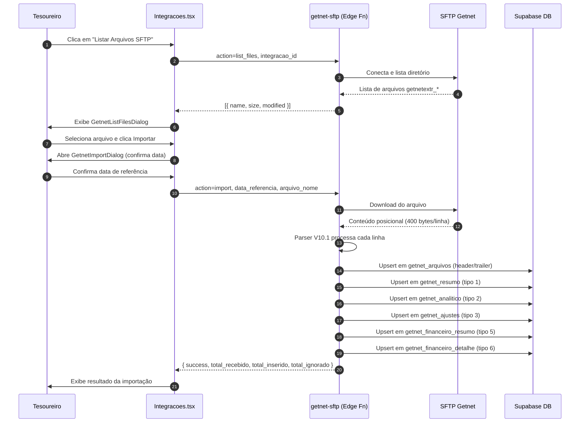

# Fluxo Getnet SFTP — Importação de Extrato Eletrônico V10.1

## Objetivo

Documentar o ciclo completo de importação dos arquivos de extrato eletrônico Getnet via SFTP, desde a listagem dos arquivos disponíveis até a persistência dos registros no banco de dados, cobrindo os 7 tipos de registro do layout V10.1.

## Contexto

A Getnet disponibiliza extratos eletrônicos posicionais (400 bytes por linha) via SFTP no padrão `getnetextr_YYYYMMDD_*`. O sistema conecta ao servidor SFTP da Getnet, lista os arquivos disponíveis, faz o download e processa cada linha com o parser V10.1, distribuindo os registros pelas tabelas correspondentes.

## Fluxo de Importação

## Ciclo de Vida PF → LQ

O mesmo RV pode aparecer duas vezes no tipo 1, diferenciado pelo campo `indicador_tipo_pagamento`:

- **PF** (Previsto de Pagamento): agendamento do crédito
- **LQ** (Liquidação): confirmação do pagamento efetivo

O constraint `UNIQUE(integracao_id, rv, data_rv, indicador_tipo_pagamento)` garante que cada linha seja única e permite reimportações idempotentes.

## Diagrama de Sequência — Importação de Arquivo

## Tabelas Envolvidas

| Tabela | Tipo de Registro | Descrição |
|---|---|---|
| `getnet_arquivos` | 0 e 9 | Controle por arquivo (header + validação de trailer) |
| `getnet_resumo` | 1 | Resumo transacional por RV; ciclo PF→LQ como linhas distintas |
| `getnet_analitico` | 2 | Transações individuais (CVs) vinculadas ao RV |
| `getnet_ajustes` | 3 | Ajustes, chargebacks e contestações |
| `getnet_financeiro_resumo` | 5 | Resumo financeiro com chave UR para junção 1↔5↔6 |
| `getnet_financeiro_detalhe` | 6 | Detalhe financeiro da composição de cada pagamento |

## Referências

- **Funcionalidades detalhadas**: [funcionalidades.md — Seção Getnet SFTP](../funcionalidades.md#getnet-sftp)
- **Migration**: `supabase/migrations/20260617000001_getnet_schema_expand.sql`
- **Edge Function**: `supabase/functions/getnet-sftp/`
- **Parser**: `supabase/functions/getnet-sftp/getnetExtratoParser.ts`
- **UI**: `src/components/financas/GetnetListFilesDialog.tsx`, `src/components/financas/GetnetImportDialog.tsx`
- **Fluxo Financeiro**: [fluxo-financeiro.md](fluxo-financeiro.md)
