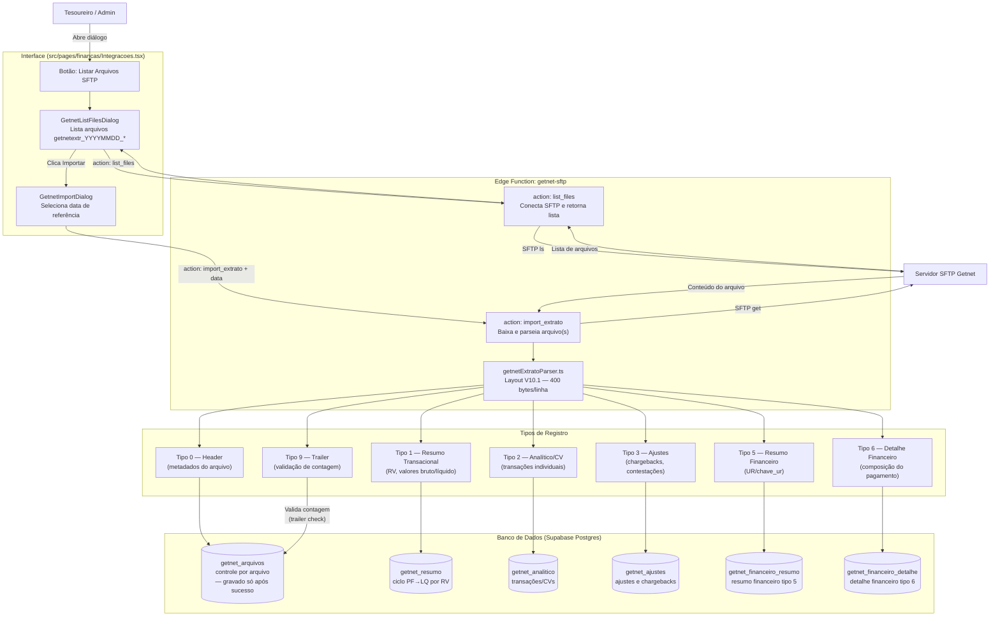
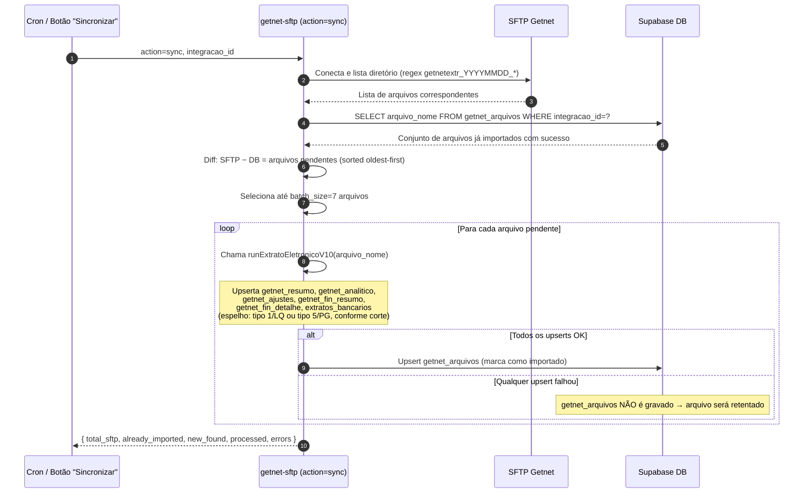
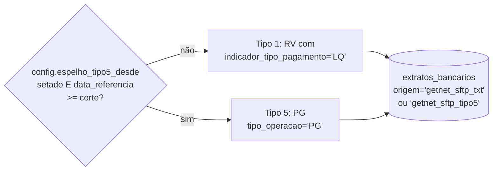
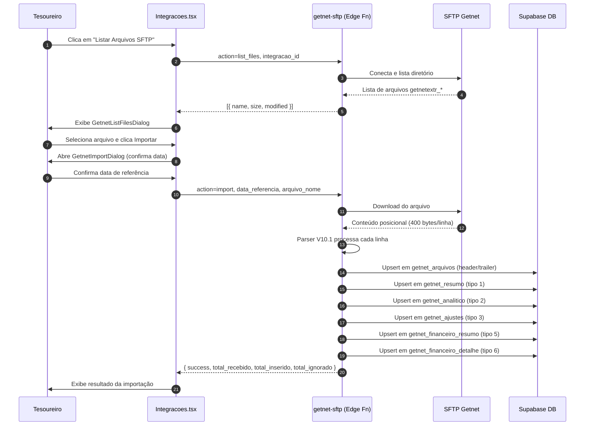

# Fluxo Getnet SFTP — Importação de Extrato Eletrônico V10.1

> **Atualizado em 2026-06-19**: adicionado fluxo de `sync` automático (action: sync) disparado por cron e pelo botão "Sincronizar" na UI.
> **Atualizado em 2026-07 (F6/D5)**: o espelho em `extratos_bancarios` agora pode nascer do tipo 5 (`PG`, dinheiro real) em vez do tipo 1 (`LQ`), por integração, via `config.espelho_tipo5_desde` — ver seção "Espelho: tipo 1 (LQ) vs tipo 5 (PG)" abaixo.

## Objetivo

Documentar o ciclo completo de importação dos arquivos de extrato eletrônico Getnet via SFTP, desde a listagem dos arquivos disponíveis até a persistência dos registros no banco de dados, cobrindo os 7 tipos de registro do layout V10.1. Inclui sincronização automática via cron que detecta e importa arquivos pendentes.

## Contexto

A Getnet disponibiliza extratos eletrônicos posicionais (400 bytes por linha) via SFTP no padrão `getnetextr_YYYYMMDD_*`. O sistema conecta ao servidor SFTP da Getnet, lista os arquivos disponíveis, faz o download e processa cada linha com o parser V10.1, distribuindo os registros pelas tabelas correspondentes.

A action `sync` automatiza o processo: lista todos os arquivos do SFTP, compara com `getnet_arquivos` (que só recebe registros após importação bem-sucedida), e importa os arquivos pendentes em lotes de até 7 por execução.

## Fluxo de Importação Manual

## Fluxo de Sincronização Automática (action: sync)

O sync detecta e importa arquivos pendentes com segurança de reprocessamento: `getnet_arquivos` só é gravado **após** todas as tabelas de dados serem inseridas com sucesso. Se a importação falhar no meio, o arquivo não constará em `getnet_arquivos` e será retentado na próxima execução do cron.

## Ciclo de Vida PF → LQ

O mesmo RV pode aparecer duas vezes no tipo 1, diferenciado pelo campo `indicador_tipo_pagamento`:

- **PF** (Previsto de Pagamento): agendamento do crédito
- **LQ** (Liquidação): confirmação do pagamento efetivo

O constraint `UNIQUE(integracao_id, rv, data_rv, indicador_tipo_pagamento)` garante que cada linha seja única e permite reimportações idempotentes.

## Espelho: tipo 1 (LQ) vs tipo 5 (PG) — F6/D5

O espelho em `extratos_bancarios` (usado pela conciliação) pode nascer de
duas fontes distintas, escolhida por integração:

Regra geral #10 do manual técnico da Getnet (V10.1/V6.2024): só
`tipo_operacao='PG'` no registro tipo 5 é dinheiro NOVO creditado na conta —
os demais tipos (CS/CF/AC/CL/GL/GF/AL) são liquidação contábil de valores já
adiantados em contrato numa data anterior. Por isso o tipo 5/PG é a fonte
mais precisa: o tipo 1/LQ mistura esse dinheiro real com os ajustes
contratuais (`AJUSTE 18`, `AJUSTE 20` etc. nos registros 1/3).

Sem `config.espelho_tipo5_desde` setado na integração, o comportamento é o
legado (tipo 1). Função pura `selecionarEspelhoTipo5` em
`getnetExtratoParser.ts` filtra as linhas PG e constrói o `external_id` de
dedupe a partir de `linhaNum` (não de `numero_operacao`, que o manual
confirma vir vazio para PG, nem de `chave_ur`, que pode não ser 1:1 por
linha).

## Diagrama de Sequência — Importação de Arquivo

## Tabelas Envolvidas

| Tabela | Tipo de Registro | Descrição |
|---|---|---|
| `getnet_arquivos` | 0 e 9 | Controle por arquivo (header + validação de trailer) |
| `getnet_resumo` | 1 | Resumo transacional por RV; ciclo PF→LQ como linhas distintas |
| `getnet_analitico` | 2 | Transações individuais (CVs) vinculadas ao RV |
| `getnet_ajustes` | 3 | Ajustes, chargebacks e contestações |
| `getnet_financeiro_resumo` | 5 | Resumo financeiro com chave UR para junção 1↔5↔6 |
| `getnet_financeiro_detalhe` | 6 | Detalhe financeiro da composição de cada pagamento |

## Referências

- **Funcionalidades detalhadas**: [funcionalidades.md — Seção Getnet SFTP](../funcionalidades.md#getnet-sftp)
- **Migration**: `supabase/migrations/20260617000001_getnet_schema_expand.sql`
- **Edge Function**: `supabase/functions/getnet-sftp/`
- **Parser**: `supabase/functions/getnet-sftp/getnetExtratoParser.ts`
- **UI**: `src/components/financas/GetnetListFilesDialog.tsx`, `src/components/financas/GetnetImportDialog.tsx`
- **Fluxo Financeiro**: [fluxo-financeiro.md](fluxo-financeiro.md)
