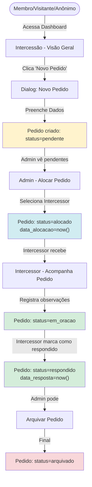
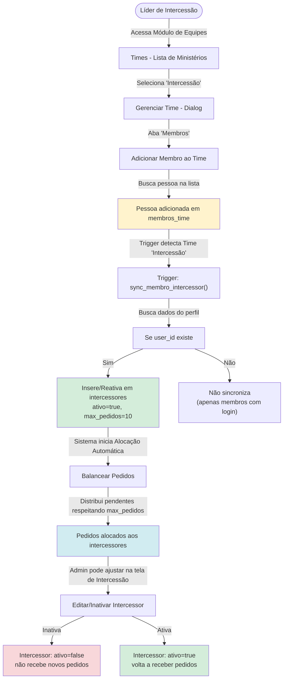
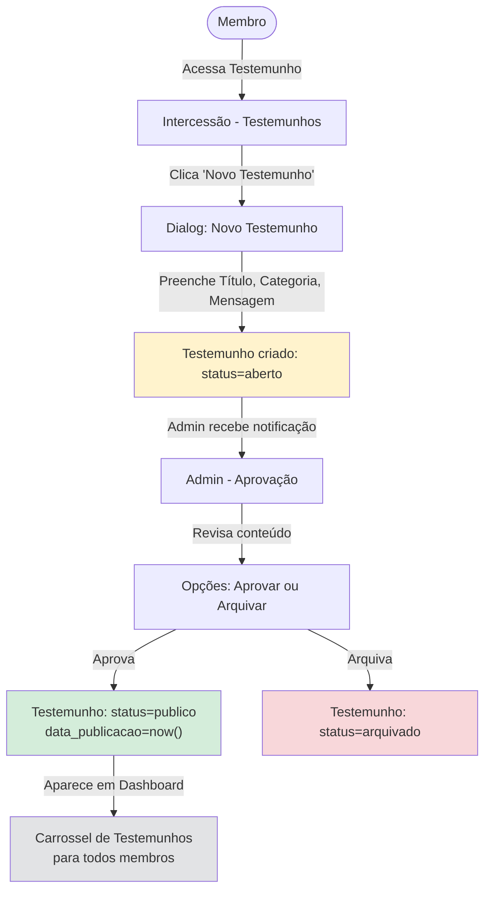
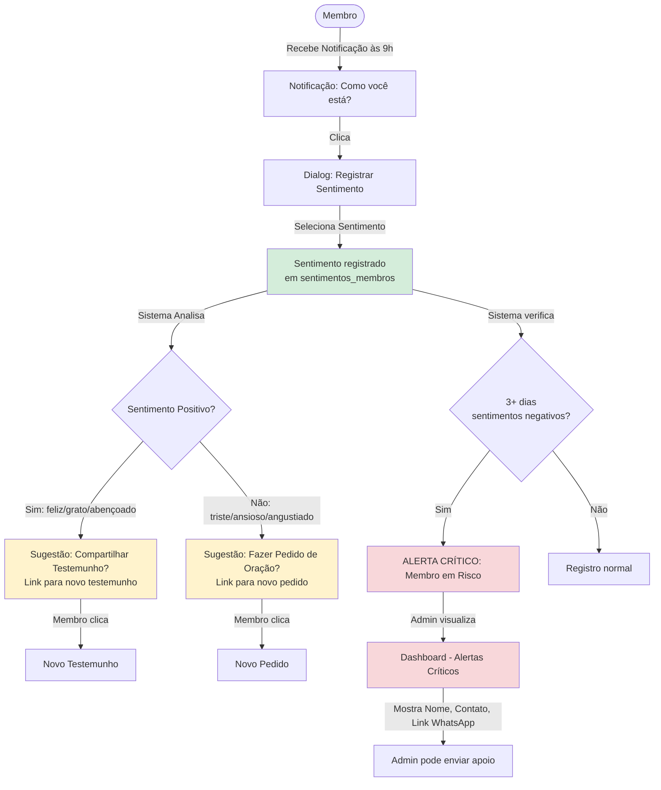
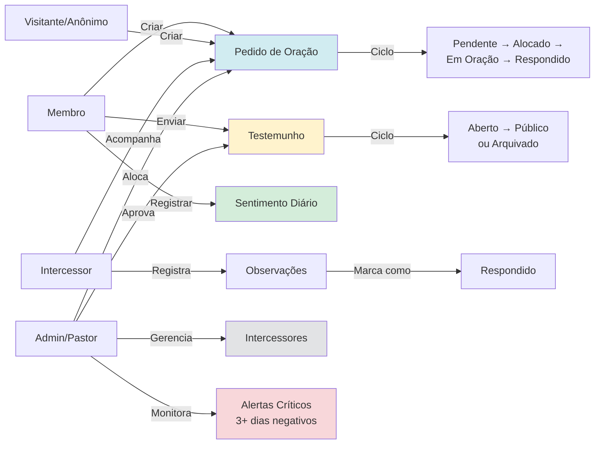

# Fluxo — Intercessão, Oração e Testemunhos

Diagrama visual (Mermaid) do fluxo do módulo Intercessão, cobrindo os 4 sub-módulos principais: Pedidos de Oração, Intercessores, Testemunhos e Sentimentos.

## 1. Fluxo Geral: Pedidos de Oração

## 2. Fluxo: Intercessores (Equipe) — Entrada no Ministério

> **Atualização (2025-12-17)**: Intercessão agora é gerenciada como **Time** padrão.  
> Entrada/saída unificada no módulo de Times. Trigger sincroniza automaticamente com tabela `intercessores`.  
> Ver [ADR-011](../adr/ADR-011-evolucao-ministerio-intercessao.md).

**Mudança de comportamento:**
- **Antes**: Líder adicionava intercessor via tela específica "Novo Intercessor" (campos manuais).
- **Depois**: Líder adiciona membro ao Time "Intercessão" (módulo de Equipes) → Trigger sincroniza automaticamente.
- **Lógica de negócio**: Mantida na tabela `intercessores` para distribuição de pedidos.

## 3. Fluxo: Testemunhos

## 4. Fluxo: Sentimentos & Alertas Críticos

## 5. Diagrama de Casos de Uso (Visão Geral)

## Legenda de Cores

- **Azul claro** (`#d1ecf1`): Pedidos de oração
- **Amarelo** (`#fff3cd`): Testemunhos / Sugestões
- **Verde claro** (`#d4edda`): Ações positivas / Registros normais
- **Vermelho claro** (`#f8d7da`): Alertas críticos / Arquivamentos
- **Cinza claro** (`#e2e3e5`): Dados/exibições genéricas

---

**Referências**:
- Manual do Usuário (Seção 6): [`../manual-usuario.md#6-intercessão`](../manual-usuario.md#6-intercessão)
- Funcionalidades: [`../funcionalidades.md#4-intercessão-oração-e-testemunhos`](../funcionalidades.md#4-intercessão-oração-e-testemunhos)
- Arquitetura: [`../01-Arquitetura/01-arquitetura-geral.MD#módulo-intercessão-oração-e-testemunhos-visão-técnica`](../01-Arquitetura/01-arquitetura-geral.MD#módulo-intercessão-oração-e-testemunhos-visão-técnica)
