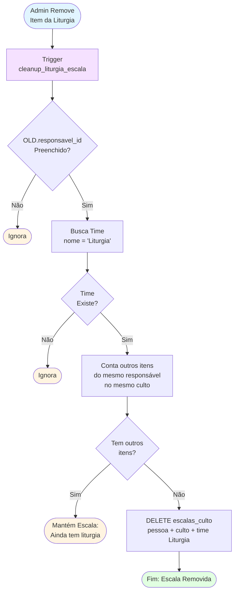
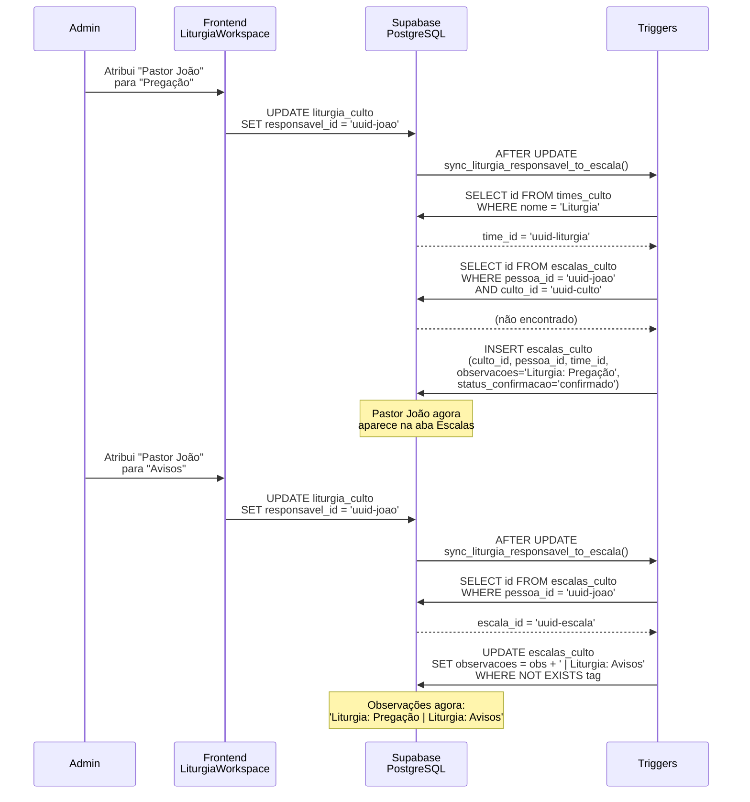

# Fluxo — Integração Liturgia ↔ Escalas

Este diagrama representa o fluxo de **sincronização automática entre itens de liturgia e escalas de voluntários**, garantindo que responsáveis por itens da liturgia apareçam automaticamente na equipe escalada.

## Fluxo de Sincronização (INSERT/UPDATE)

```mermaid
flowchart TD
    Start([Admin Atribui<br/>Responsável na Liturgia]) --> Trigger[Trigger<br/>sync_liturgia_responsavel_to_escala]
    
    Trigger --> CheckResponsavel{responsavel_id<br/>Preenchido?}
    
    CheckResponsavel -->|Não| End1([Ignora:<br/>Convidado Externo])
    CheckResponsavel -->|Sim| BuildTag[Monta Tag:<br/>'Liturgia: {titulo}']
    
    BuildTag --> FindTime[Busca Time<br/>nome = 'Liturgia']
    
    FindTime --> TimeExists{Time<br/>Existe?}
    
    TimeExists -->|Não| End2([Ignora:<br/>Time Não Cadastrado])
    TimeExists -->|Sim| CheckExisting[Busca escala_culto<br/>pessoa + culto]
    
    CheckExisting --> EscalaExists{Escala<br/>Existe?}
    
    EscalaExists -->|Não| InsertEscala[INSERT escalas_culto<br/>time = Liturgia<br/>status = confirmado<br/>obs = tag]
    
    EscalaExists -->|Sim| CheckDuplicate{Tag já<br/>existe em obs?}
    
    CheckDuplicate -->|Sim| End3([Ignora:<br/>Já Cadastrado])
    CheckDuplicate -->|Não| AppendTag[UPDATE escalas_culto<br/>obs = obs + ' | ' + tag]
    
    InsertEscala --> End4([Fim: Escala Criada])
    AppendTag --> End5([Fim: Tag Adicionada])
    
    style Start fill:#e1f5ff
    style End1 fill:#fff4e1
    style End2 fill:#ffe1e1
    style End3 fill:#fff4e1
    style End4 fill:#e1ffe1
    style End5 fill:#e1ffe1
    style Trigger fill:#f5e1ff
```

## Fluxo de Limpeza (DELETE)



## Cenário Completo



## Componentes

| Componente | Tipo | Path/Nome |
|------------|------|-----------|
| Trigger Sync | Database | `trigger_sync_liturgia_to_escala` |
| Trigger Cleanup | Database | `trigger_cleanup_liturgia_escala` |
| Function Sync | Database | `sync_liturgia_responsavel_to_escala()` |
| Function Cleanup | Database | `cleanup_liturgia_escala()` |
| Frontend | React | `src/components/cultos/LiturgiaWorkspace.tsx` |

## Estrutura de Tags

```
observacoes: "Liturgia: Pregação | Liturgia: Avisos | Liturgia: Oração Final"
```

- Tags separadas por ` | `
- Formato: `Liturgia: {titulo_do_item}`
- Verificação de duplicidade antes de adicionar
- Título vazio usa fallback "Item"

## Pré-requisitos

1. **Time "Liturgia" cadastrado**: O trigger busca `times_culto WHERE nome = 'Liturgia'`
2. **Responsável interno**: `responsavel_id` deve referenciar `profiles.id` (não funciona para convidados externos com apenas nome texto)

## Regras de Negócio

| Cenário | Comportamento |
|---------|---------------|
| Novo responsável sem escala prévia | Cria nova escala no time Liturgia |
| Novo responsável com escala prévia | Adiciona tag nas observações |
| Remove item, pessoa tem outros itens | Mantém escala |
| Remove item, pessoa não tem outros | Remove escala do time Liturgia |
| Responsável externo (nome texto) | Ignora sincronização |
| Time "Liturgia" não existe | Ignora sincronização |

## Referências

- [Fluxo de Cultos](fluxo-cultos.md)
- [Sequência de Cultos](sequencia-cultos.md)
- [Manual do Usuário - Liturgia](../manual-usuario.md#4-cultos-liturgia)
