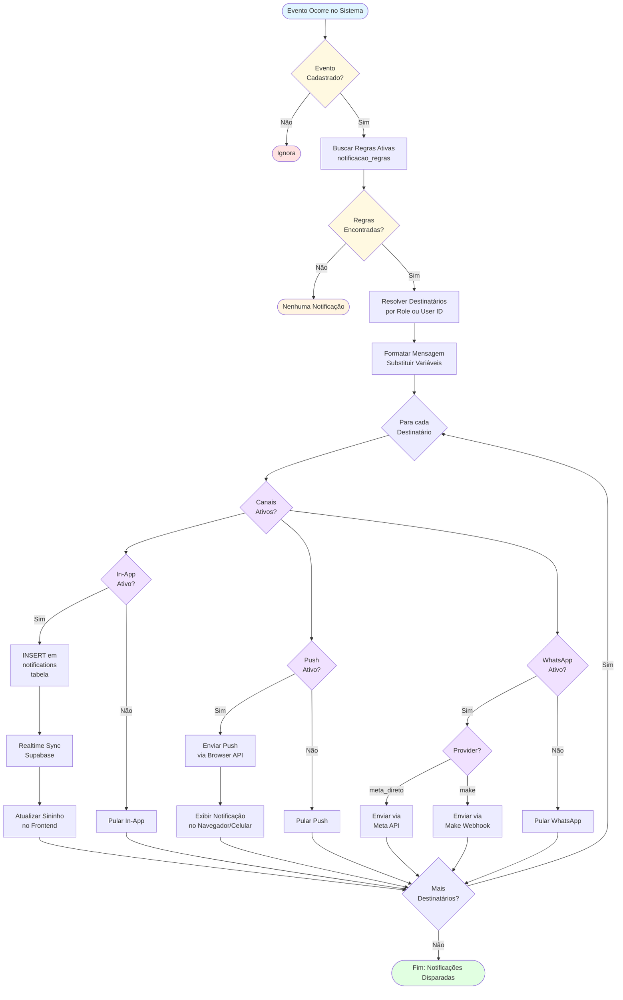
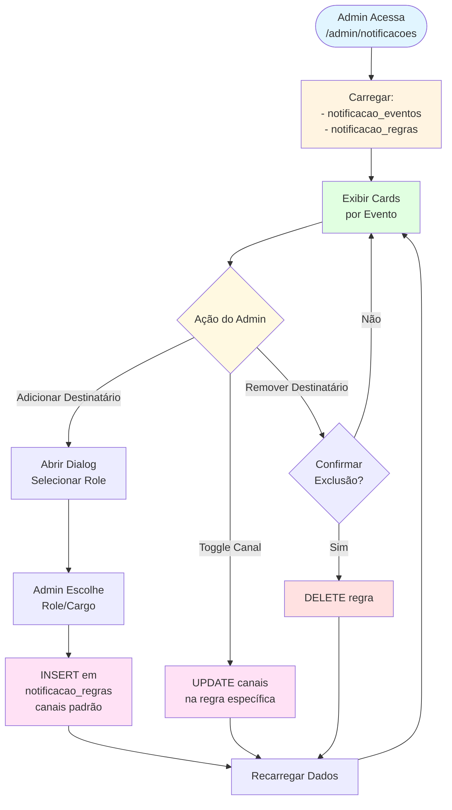
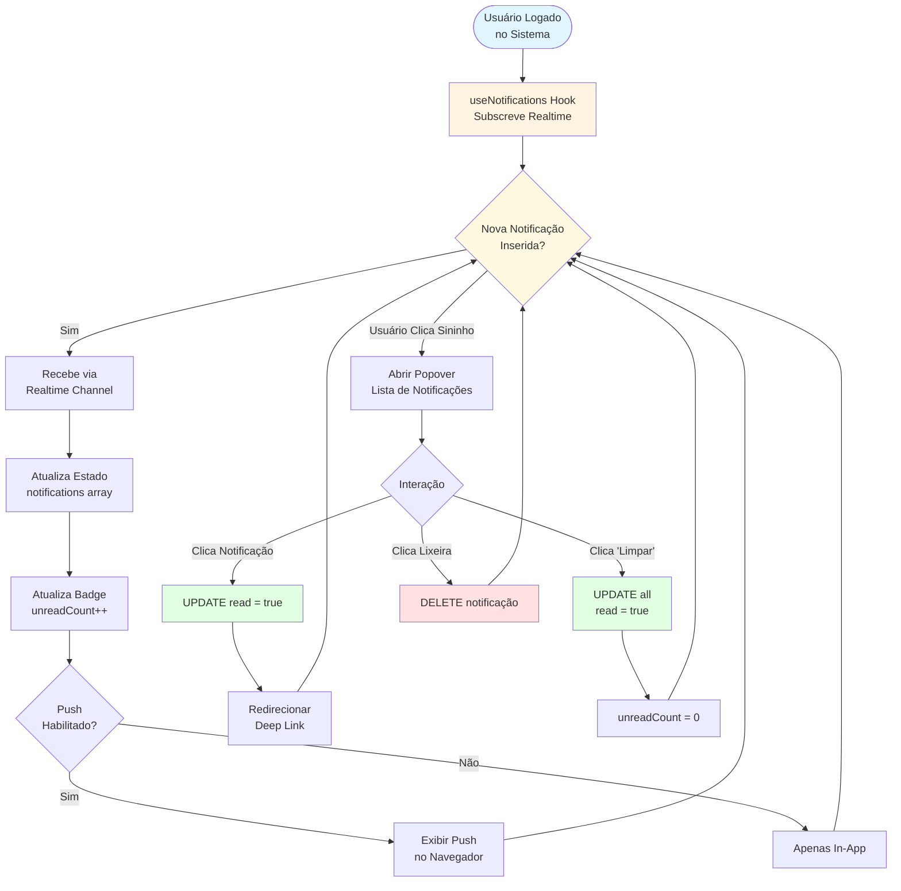
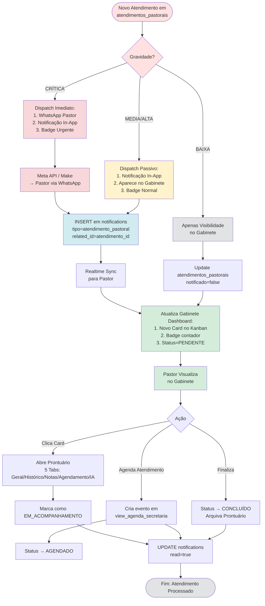

# Diagrama de Fluxo — Módulo Notificações

Este diagrama representa o fluxo completo de **notificações automáticas** do sistema, desde o evento disparador até a entrega multi-canal.

## Fluxo Geral

## Fluxo de Configuração (Admin)

## Fluxo de Consumo (Usuário Final)

## Fluxo: Notificações Gabinete Digital (Atendimentos Pastorais)

> **Novo (ADR-014)**: Notificações de atendimentos pastorais com integração ao Gabinete Digital.

## Observações

### Componentes Principais
- **Edge Function**: `disparar-alerta` (função central de disparo)
- **Frontend**: `NotificationBell.tsx`, `useNotifications.tsx`
- **Admin**: `Notificacoes.tsx` (configuração de regras)
- **Tabelas**: `notifications`, `notificacao_eventos`, `notificacao_regras`

### Decisões Importantes
- **Disparo Imediato**: notificações não têm fila ou agendamento; são disparadas imediatamente ao evento
- **Multi-Canal**: sistema suporta 3 canais simultâneos (in-app, push, WhatsApp) configuráveis por regra
- **Resolução de Destinatários**: baseado em `role` (cargo) via `user_roles` table ou `user_id_especifico`
- **Templates Automáticos**: mensagens são geradas via substituição de variáveis `{{chave}}` no template do evento
- **Sem Estados Intermediários**: notificações são sempre finais (criadas → lidas/não lidas → excluídas)

### Integrações Externas
- **Meta API**: WhatsApp via Meta Business API (provider = `meta_direto`)
- **Make/n8n**: WhatsApp via webhooks (provider = `make`)
- **Browser API**: Push notifications via `Notification` API do navegador

### Referências
- **Produto**: [docs/produto/README_PRODUTO.MD](../produto/README_PRODUTO.MD#notificações-visão-de-produto)
- **Manual**: [docs/manual-usuario.md](../manual-usuario.md#10-notificações)
- **Funcionalidades**: [docs/funcionalidades.md](../funcionalidades.md#módulo-notificações)
- **Gabinete Digital**: [docs/funcionalidades.md#4-gabinete-digital-e-cuidado-pastoral](../funcionalidades.md#4-gabinete-digital-e-cuidado-pastoral)
- **Fluxo Gabinete**: [fluxo-gabinete-pastoral.md](fluxo-gabinete-pastoral.md)
- **ADR-014**: [docs/adr/ADR-014-gabinete-digital-e-roteamento-pastoral.md](../adr/ADR-014-gabinete-digital-e-roteamento-pastoral.md)
- **Sequência**: [sequencia-notificacoes.md](sequencia-notificacoes.md)
