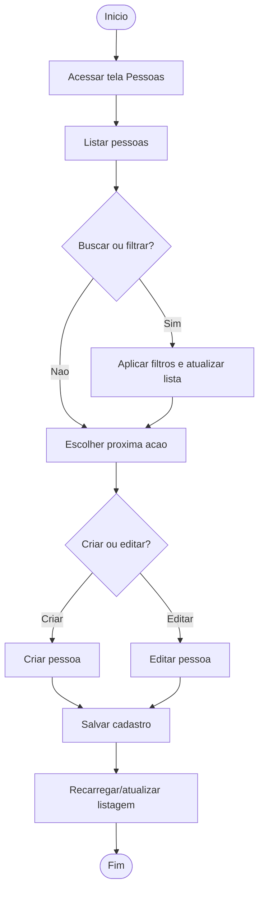

# Fluxo do Modulo Pessoas

Objetivo: visualizar o caminho principal na tela Pessoas conforme o uso atual — acessar, listar, buscar/filtrar, cadastrar, editar e salvar, como descrito na avaliação de UX da tela.

