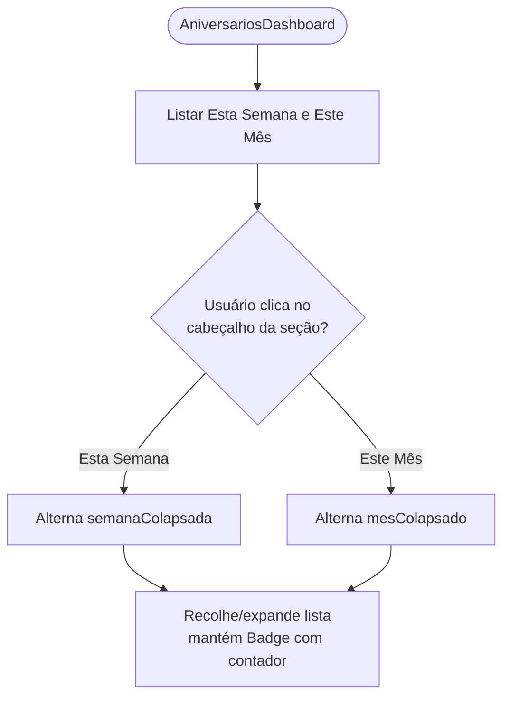
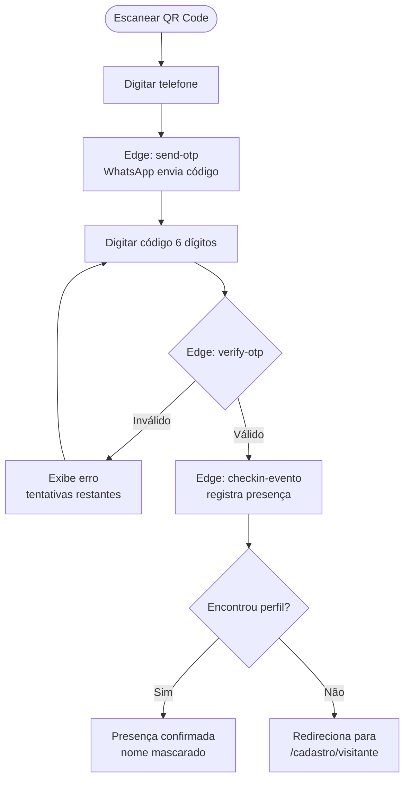
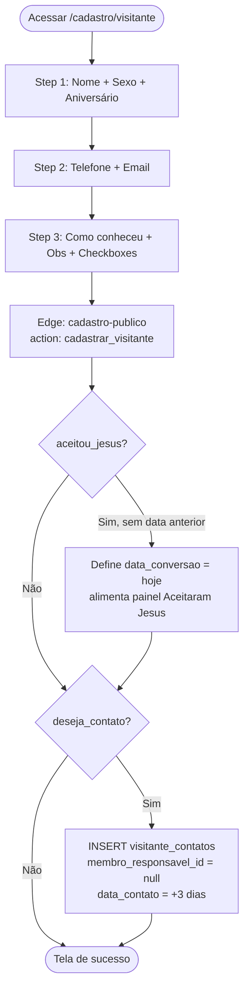
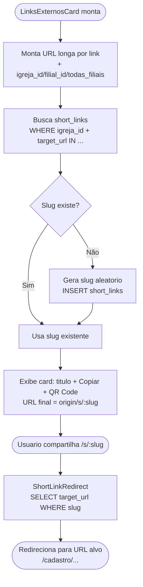

# Fluxo do Modulo Pessoas

Objetivo: visualizar o caminho principal na tela Pessoas conforme o uso atual — acessar, listar, buscar/filtrar, cadastrar, editar e salvar, como descrito na avaliação de UX da tela. **Todas as operações são automaticamente filtradas por `igreja_id`** do usuário logado.

```mermaid
flowchart TD
    A([Inicio]) --> B[Acessar tela Pessoas]
    B --> C[Obter igreja_id do usuário<br/>useIgrejaId()]
    C --> D[Listar pessoas<br/>WHERE igreja_id = ?]
    D --> E{Buscar ou filtrar?}
    E -->|Sim| F[Aplicar filtros adicionais<br/>+ igreja_id]
    E -->|Nao| G[Escolher proxima acao]
    F --> G
    G --> H{Criar ou editar?}
    H -->|Criar| I[Navegar para /pessoas/cadastrar<br/>PessoaWizard]
    H -->|Editar| J[Editar pessoa<br/>validar igreja_id]
    I --> I1{Selecionar tipo}
    I1 -->|Visitante/Frequentador| I2[Step 1: Dados básicos<br/>Step 2: Complementar<br/>Step 3: Finalizar]
    I1 -->|Membro| I3[Step 1: Dados básicos<br/>Step 2: Dados do membro<br/>Step 3: Complementar<br/>Step 4: Finalizar]
    I2 --> VAL{Email preenchido<br/>e válido?}
    I3 --> VAL
    VAL -->|Inválido| ERR[Exibe erro<br/>Email inválido]
    ERR --> I2
    VAL -->|Ok / vazio| K[Salvar cadastro<br/>INSERT profiles]
    J --> K
    K --> L[Recarregar/atualizar listagem<br/>scoped por igreja]
    L --> M([Fim])
```

## Aniversariantes — Seções Colapsáveis

```mermaid
flowchart TD
    A([AniversariosDashboard]) --> B[Listar Esta Semana e Este Mês]
    B --> C{Usuário clica no<br/>cabeçalho da seção?}
    C -->|Esta Semana| D[Alterna semanaColapsada]
    C -->|Este Mês| E[Alterna mesColapsado]
    D --> F[Recolhe/expande lista<br/>mantém Badge com contador]
    E --> F
```

## Fluxo de Check-in com OTP (QR Code do Evento)

```mermaid
flowchart TD
    QR([Escanear QR Code]) --> T[Digitar telefone]
    T --> OTP[Edge: send-otp<br/>WhatsApp envia código]
    OTP --> C[Digitar código 6 dígitos]
    C --> V{Edge: verify-otp}
    V -->|Inválido| E[Exibe erro<br/>tentativas restantes]
    E --> C
    V -->|Válido| CI[Edge: checkin-evento<br/>registra presença]
    CI --> S{Encontrou perfil?}
    S -->|Sim| OK[Presença confirmada<br/>nome mascarado]
    S -->|Não| NF[Redireciona para<br/>/cadastro/visitante]
```

## Fluxo de Cadastro Público de Visitante

```mermaid
flowchart TD
    A([Acessar /cadastro/visitante]) --> S1[Step 1: Nome + Sexo + Aniversário]
    S1 --> S2[Step 2: Telefone + Email]
    S2 --> S3[Step 3: Como conheceu + Obs + Checkboxes]
    S3 --> SUB[Edge: cadastro-publico<br/>action: cadastrar_visitante]
    SUB --> CONV{aceitou_jesus?}
    CONV -->|Sim, sem data anterior| DC[Define data_conversao = hoje<br/>alimenta painel Aceitaram Jesus]
    CONV -->|Não| CT
    DC --> CT{deseja_contato?}
    CT -->|Sim| AG[INSERT visitante_contatos<br/>membro_responsavel_id = null<br/>data_contato = +3 dias]
    CT -->|Não| OK
    AG --> OK([Tela de sucesso])
```

> `membro_responsavel_id` é `null` no cadastro público pois não há membro autenticado para assumir o contato.
> A atribuição a um líder/departamento responsável é uma rotina de roteamento futura (ainda não implementada).

## Links Externos de Cadastro (Shortlinks)

```mermaid
flowchart TD
    A([LinksExternosCard monta]) --> B[Monta URL longa por link<br/>+ igreja_id/filial_id/todas_filiais]
    B --> C[Busca short_links<br/>WHERE igreja_id + target_url IN ...]
    C --> D{Slug existe?}
    D -->|Sim| E[Usa slug existente]
    D -->|Não| F[Gera slug aleatorio<br/>INSERT short_links]
    F --> E
    E --> G[Exibe card: titulo + Copiar + QR Code<br/>URL final = origin/s/:slug]
    G --> H([Usuario compartilha /s/:slug])
    H --> I[ShortLinkRedirect<br/>SELECT target_url WHERE slug]
    I --> J([Redireciona para URL alvo<br/>/cadastro/...])
```

> Link "Aceitou Jesus" aponta para `/cadastro/visitante?aceitou=true` (não mais para `/cadastro`):
> abre direto o formulário de visitante, com a saudação de aceite e o checkbox
> "Aceitei Jesus hoje" pré-marcado e bloqueado — sem passar pela tela `/cadastro`
> com os botões de Visitante/Café V&P.
