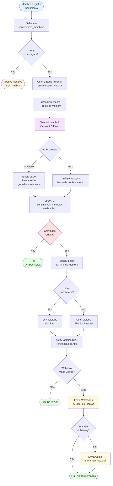
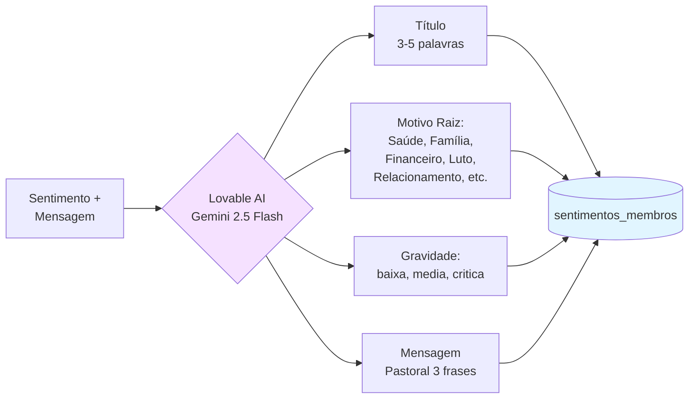
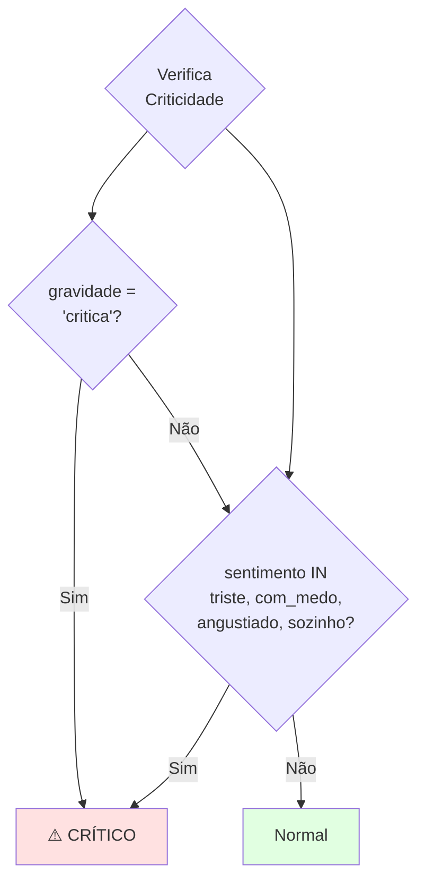

# Fluxo — Análise de Sentimentos via IA

Este diagrama representa o fluxo completo de **análise de sentimentos via Inteligência Artificial**, desde o registro do membro até o disparo de alertas pastorais.

## Fluxo Principal



## Fluxo de Classificação da IA



## Critérios de Gravidade Crítica



## Componentes

| Componente | Tipo | Path |
|------------|------|------|
| Edge Function | Backend | `supabase/functions/analise-sentimento-ia/index.ts` |
| Dialog Registro | Frontend | `src/components/sentimentos/RegistrarSentimentoDialog.tsx` |
| Lista Admin | Frontend | `src/pages/intercessao/Sentimentos.tsx` |
| Tabela | Database | `sentimentos_membros` |
| RPC | Database | `notify_admins()` |

## Campos de Análise IA

| Campo | Tipo | Descrição |
|-------|------|-----------|
| `analise_ia_titulo` | TEXT | Título curto gerado pela IA |
| `analise_ia_motivo` | TEXT | Categoria raiz do problema |
| `analise_ia_gravidade` | TEXT | baixa, media, critica |
| `analise_ia_resposta` | TEXT | Mensagem pastoral empática |

## Payload do Webhook Make

```json
{
  "membro_nome": "Nome do Membro",
  "membro_telefone": "(11) 99999-9999",
  "sentimento": "Angustiado",
  "gravidade": "critica",
  "ai_resumo": "Título - Motivo",
  "ai_mensagem_membro": "Mensagem pastoral...",
  "pastor_telefone": "(11) 88888-8888",
  "link_admin": "https://app/intercessao/sentimentos"
}
```

## Referências

- [Fluxo de Notificações](fluxo-notificacoes.md)
- [Manual do Usuário - Intercessão](../manual-usuario.md#7-intercessão)
- [Funcionalidades - Sentimentos](../funcionalidades.md#sentimentos)
