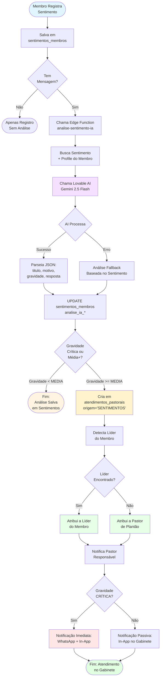
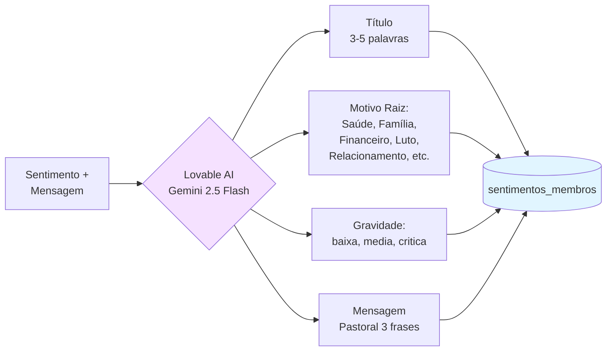
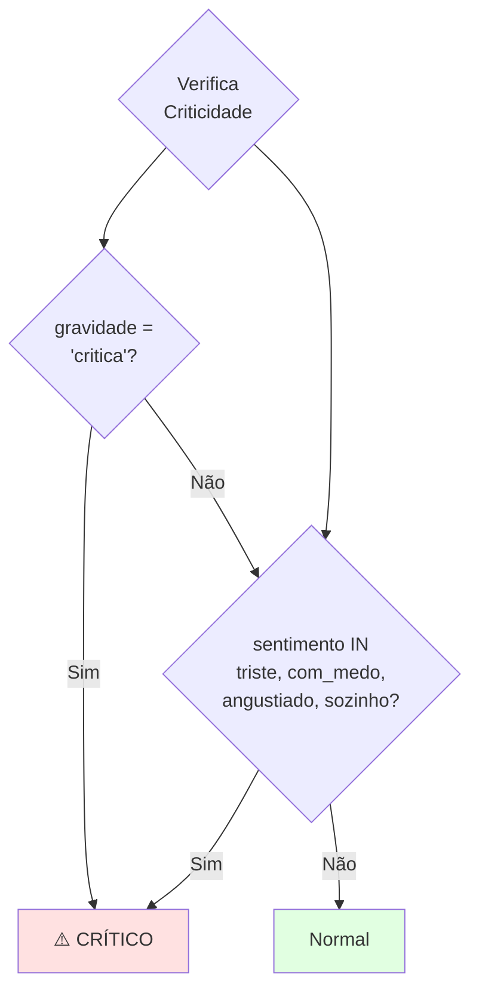

# Fluxo — Análise de Sentimentos via IA

Este diagrama representa o fluxo completo de **análise de sentimentos via Inteligência Artificial**, desde o registro do membro até o disparo de alertas pastorais.

## Fluxo Principal

## Fluxo de Classificação da IA

## Critérios de Gravidade Crítica

## Componentes

| Componente | Tipo | Path |
|------------|------|------|
| Edge Function | Backend | `supabase/functions/analise-sentimento-ia/index.ts` |
| Dialog Registro | Frontend | `src/components/sentimentos/RegistrarSentimentoDialog.tsx` |
| Lista Admin | Frontend | `src/pages/intercessao/Sentimentos.tsx` |
| Gabinete | Frontend | `src/pages/GabinetePastoral.tsx` |
| Tabela Sentimentos | Database | `sentimentos_membros` |
| Tabela Atendimentos | Database | `atendimentos_pastorais` |
| RPC Notificação | Database | `notify_admins()` |

## Campos de Análise IA

| Campo | Tipo | Descrição |
|-------|------|-----------|
| `analise_ia_titulo` | TEXT | Título curto gerado pela IA |
| `analise_ia_motivo` | TEXT | Categoria raiz do problema |
| `analise_ia_gravidade` | TEXT | baixa, media, critica |
| `analise_ia_resposta` | TEXT | Mensagem pastoral empática |

## Referências

- [Fluxo do Gabinete Digital](fluxo-gabinete-pastoral.md)
- [Fluxo de Notificações](fluxo-notificacoes.md)
- [ADR-014: Gabinete Digital](../adr/ADR-014-gabinete-digital-e-roteamento-pastoral.md)
- [Manual do Usuário - Intercessão](../manual-usuario.md#5-intercessão-oração-e-testemunhos)
- [Funcionalidades - Sentimentos](../funcionalidades.md#55-sentimentos)
