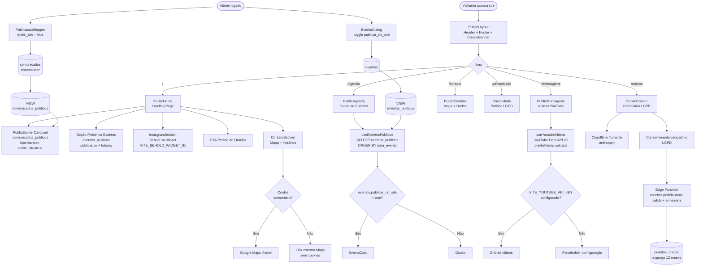

# Fluxo do Site Público (Landing Page)

Representa a arquitetura do site institucional público acessível sem autenticação em `igrejacarvalho.com.br`. O conteúdo é alimentado pelas views `eventos_publicos` e `comunicados_publicos` no Supabase, controladas pelo painel admin. Redes sociais (YouTube e Instagram) são integradas via APIs externas.

Baseado nos componentes `src/pages/public/`, `src/components/public/`, migrações `20260622*` e hooks `useEventosPublicos`, `useYoutubeVideos`.

## Variáveis de ambiente necessárias

| Variável | Obrigatória | Uso |
|---|---|---|
| `VITE_YOUTUBE_API_KEY` | Não | Busca vídeos do canal na página /mensagens |
| `VITE_YOUTUBE_CHANNEL_ID` | Não | ID do canal (ex: `UCxxxxxxx`) |
| `VITE_BEHOLD_WIDGET_ID` | Não | Feed do Instagram na Home |
| `VITE_TURNSTILE_SITE_KEY` | Recomendado | Anti-spam no formulário de oração |

## Como publicar conteúdo

- **Banners/Carrossel**: Comunicação → Nova Publicação → tipo Banner → ativar "Exibir no site"
- **Eventos na Agenda**: Eventos → editar evento → ativar "🌐 Publicar na agenda do site"
