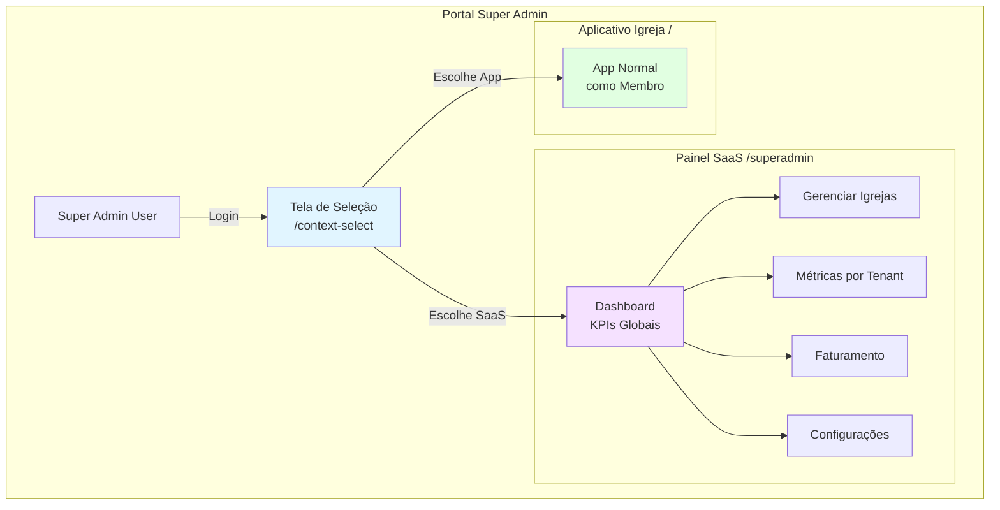
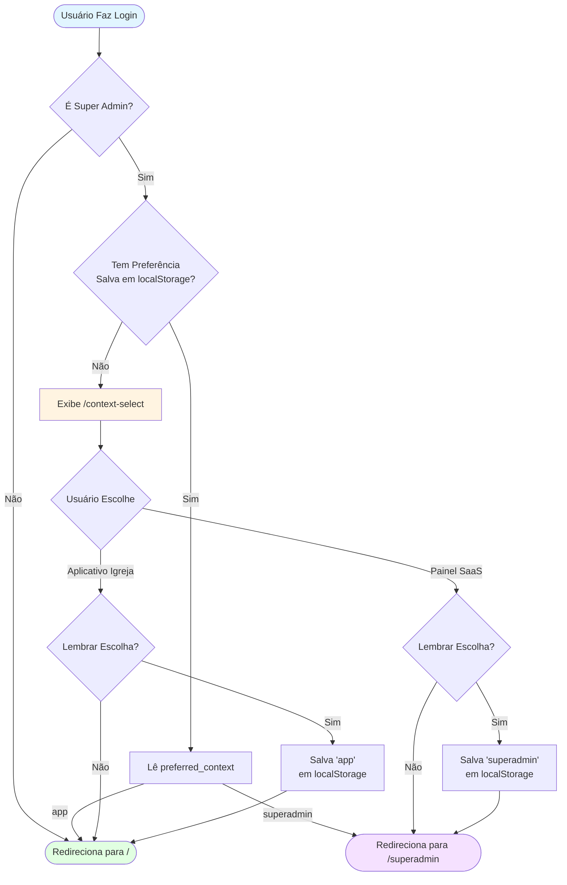
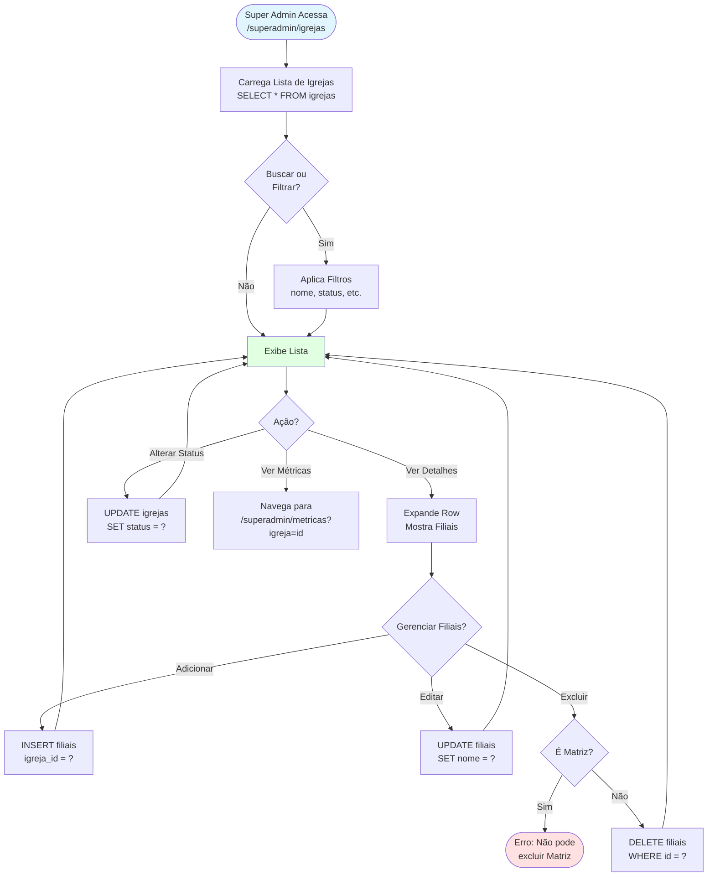
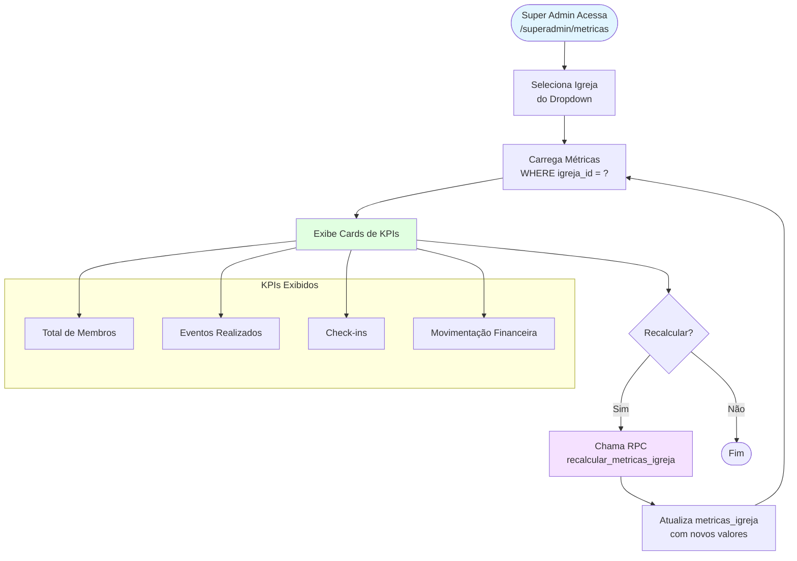
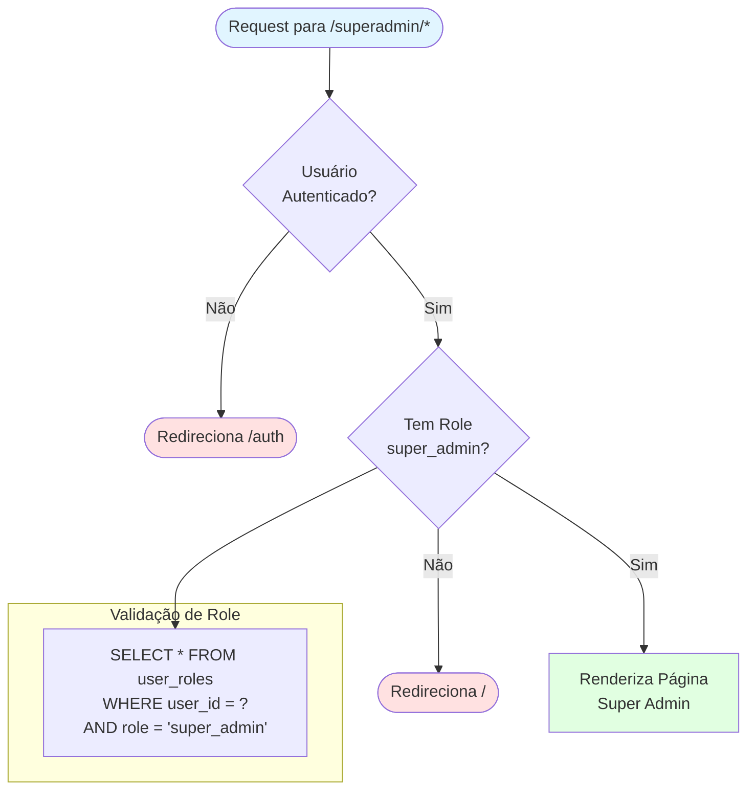

# Fluxo — Super Admin Portal

Este documento descreve os fluxos principais do portal Super Admin (SaaS), que gerencia múltiplas igrejas (tenants) no sistema.

## Visão Geral da Arquitetura



## Fluxo de Login e Seleção de Contexto



## Fluxo de Gestão de Igrejas



## Fluxo de Métricas por Tenant



## Navegação entre Contextos

```mermaid
flowchart LR
    subgraph "Super Admin Layout"
        Header1[Header com Shield Icon]
        Nav1[Dashboard | Igrejas | Métricas | Billing | Config]
        BtnApp[Botão: Ir para App Igreja]
    end
    
    subgraph "Main Layout (App)"
        Header2[Header Normal]
        Nav2[Dashboard | Módulos...]
        IndicatorSA[Shield Icon<br/>para Super Admins]
    end
    
    BtnApp --> |Click| Header2
    IndicatorSA --> |Click| Header1
    
    style Header1 fill:#f5e1ff
    style Header2 fill:#e1ffe1
    style BtnApp fill:#fff4e1
    style IndicatorSA fill:#fff4e1
```

## Componentes Principais

| Componente | Caminho | Descrição |
|------------|---------|-----------|
| `SuperAdminLayout` | `src/components/layout/SuperAdminLayout.tsx` | Layout dedicado para rotas /superadmin/* |
| `SuperAdminGate` | `src/components/auth/SuperAdminGate.tsx` | Gate de proteção que verifica role super_admin |
| `ContextSelect` | `src/pages/ContextSelect.tsx` | Tela de seleção de contexto pós-login |
| `SuperAdminIndicator` | `src/components/layout/SuperAdminIndicator.tsx` | Indicador no MainLayout para super admins |
| `FilialManager` | `src/components/shared/FilialManager.tsx` | Componente reutilizável para CRUD de filiais |

## Permissões e Segurança



## RLS Policies

O Super Admin tem acesso global via políticas RLS específicas:

```sql
-- Exemplo: Política para filiais
CREATE POLICY "Super admin has full access to filiais"
ON filiais FOR ALL
TO authenticated
USING (
  EXISTS (
    SELECT 1 FROM user_roles
    WHERE user_id = auth.uid()
    AND role = 'super_admin'
  )
);
```

---

**Última atualização:** 2026-01-04
