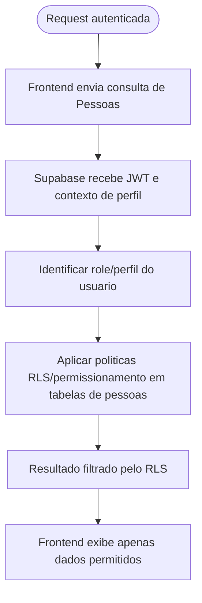

# Permissoes do Modulo Pessoas

Fluxo de aplicacao de controle de acesso no modulo Pessoas: uma request autenticada tem o perfil/role identificado, as politicas RLS sao aplicadas no Supabase/Postgres e o resultado retornado ja vem filtrado conforme permissoes.

