# Sequência — Criação e Publicação de Comunicado

Este diagrama representa a sequência temporal de interações entre usuário, frontend, Supabase e banco de dados PostgreSQL durante a criação e publicação de um comunicado institucional. O fluxo é síncrono e direto, sem filas ou serviços de notificação externos.

Baseado nos componentes `ComunicadoDialog.tsx`, `PublicacaoStepper.tsx`, `Comunicados.tsx` e tabela `comunicados` com RLS.

```mermaid
sequenceDiagram
    actor Usuario as Usuário<br/>(Admin/Secretaria)
    participant FE as Frontend<br/>(React/TypeScript)
    participant SB as Supabase<br/>(Auth + Client)
    participant DB as PostgreSQL<br/>(RLS + Triggers)
    participant Storage as Storage Bucket<br/>comunicados

    Note over Usuario,Storage: Fluxo de Criação de Comunicado

    %% Autenticação e carregamento inicial
    Usuario->>FE: Acessa /comunicados
    FE->>SB: auth.getSession()
    SB->>FE: Retorna sessão + JWT
    FE->>SB: SELECT * FROM comunicados<br/>ORDER BY created_at DESC
    SB->>DB: Verifica RLS comunicados_gestao_admin<br/>(auth.role = 'authenticated')
    DB->>SB: Retorna lista de comunicados
    SB->>FE: { data: comunicados[], error: null }
    FE->>Usuario: Exibe dashboard com lista

    Note over Usuario,Storage: Usuário cria novo comunicado

    Usuario->>FE: Clica "+ Novo Comunicado"
    FE->>Usuario: Abre wizard (step 1/3)
    
    %% Passo 1: Conteúdo
    Usuario->>FE: Preenche título, tipo (banner/alerta),<br/>descrição, seleciona imagem
    FE->>FE: Valida campos obrigatórios<br/>(título, mensagem se alerta)
    Usuario->>FE: Avança para step 2

    %% Passo 2: Canais
    Usuario->>FE: Seleciona canais:<br/>☑ exibir_app<br/>☑ exibir_telao<br/>☐ exibir_site
    Usuario->>FE: Avança para step 3

    %% Passo 3: Agendamento
    Usuario->>FE: Define data_inicio, data_fim,<br/>tags, categoria_midia, culto_id
    FE->>FE: Valida datas (inicio <= fim)
    Usuario->>FE: Clica "Publicar"

    %% Upload de imagem
    alt Tem imagem para upload
        FE->>Storage: storage.from('comunicados')<br/>.upload(filePath, file)
        Storage->>DB: Verifica policy comunicados_admin_insert<br/>(auth.role = 'authenticated')
        DB->>Storage: Autorizado
        Storage->>FE: { data: { path }, error: null }
        FE->>FE: Define imagem_url = publicURL(path)
    end

    %% Insert no banco
    FE->>SB: INSERT INTO comunicados<br/>{titulo, tipo, descricao, imagem_url,<br/>exibir_app, exibir_telao, exibir_site,<br/>data_inicio, data_fim, tags, ativo: true,<br/>created_by: auth.uid, ...}
    SB->>DB: Verifica RLS comunicados_gestao_admin
    DB->>DB: INSERT comunicados
    DB->>DB: Trigger update_comunicados_updated_at<br/>SET updated_at = NOW()
    DB->>SB: Retorna novo registro
    SB->>FE: { data: comunicado, error: null }
    FE->>FE: Atualiza lista local
    FE->>Usuario: Toast "Comunicado publicado com sucesso"

    Note over Usuario,Storage: Exibição nos Canais

    %% Canal: App/Dashboard
    rect rgb(219, 234, 254)
        Note over FE,DB: Canal: App/Dashboard (membros)
        participant Member as Membro<br/>(App)
        Member->>FE: Acessa dashboard
        FE->>SB: SELECT * FROM comunicados<br/>WHERE ativo = true<br/>AND exibir_app = true<br/>AND data_inicio <= NOW()<br/>AND (data_fim IS NULL OR data_fim >= NOW())
        SB->>DB: Verifica RLS comunicados_leitura_publica<br/>(público, sem auth necessária)
        DB->>SB: Retorna comunicados ativos
        SB->>FE: { data: comunicados[] }
        FE->>Member: Exibe carrossel BannerCarousel
    end

    %% Canal: Telão
    rect rgb(243, 232, 255)
        Note over FE,DB: Canal: Telão/Projetor
        participant Operator as Operador<br/>(Telão)
        Operator->>FE: Acessa /telao
        FE->>SB: SELECT * FROM comunicados<br/>WHERE ativo = true<br/>AND exibir_telao = true<br/>AND data_inicio <= NOW()<br/>AND (data_fim IS NULL OR data_fim >= NOW())<br/>ORDER BY ordem_telao
        SB->>DB: Verifica RLS comunicados_leitura_publica
        DB->>SB: Retorna comunicados para telão
        SB->>FE: { data: comunicados[] }
        FE->>Operator: Carrossel automático (Telao.tsx)
    end

    Note over Usuario,Storage: Fluxo de Edição/Exclusão

    %% Edição
    Usuario->>FE: Clica "Editar" em comunicado
    FE->>SB: SELECT * FROM comunicados WHERE id = ?
    SB->>DB: Verifica RLS comunicados_gestao_admin
    DB->>SB: Retorna comunicado
    SB->>FE: { data: comunicado }
    FE->>Usuario: Abre wizard preenchido
    Usuario->>FE: Modifica campos e salva
    FE->>SB: UPDATE comunicados SET ... WHERE id = ?
    SB->>DB: Verifica RLS + executa update
    DB->>SB: Retorna registro atualizado
    SB->>FE: { data: comunicado, error: null }
    FE->>Usuario: Toast "Comunicado atualizado"

    %% Exclusão
    Usuario->>FE: Clica "Excluir" em comunicado
    FE->>Usuario: Confirma exclusão?
    Usuario->>FE: Confirma
    
    alt Comunicado tem imagem_url
        FE->>Storage: storage.from('comunicados')<br/>.remove([imagePath])
        Storage->>DB: Verifica policy comunicados_admin_delete
        DB->>Storage: Autorizado
        Storage->>FE: { data: {}, error: null }
    end
    
    FE->>SB: DELETE FROM comunicados WHERE id = ?
    SB->>DB: Verifica RLS comunicados_gestao_admin
    DB->>SB: Registro deletado
    SB->>FE: { error: null }
    FE->>FE: Remove da lista local
    FE->>Usuario: Toast "Comunicado excluído"

    Note over Usuario,Storage: Não há disparos automáticos de push/email/WhatsApp
```

## Atores e Componentes

### Atores
- **Usuário (Admin/Secretaria)**: cria e gerencia comunicados
- **Membro**: visualiza comunicados no app
- **Operador (Telão)**: opera a exibição em projetor

### Componentes
- **Frontend**: React/TypeScript com `supabase-js` client
  - `src/pages/Comunicados.tsx`: listagem e gestão
  - `src/components/comunicados/ComunicadoDialog.tsx`: wizard de criação/edição
  - `src/components/publicacao/PublicacaoStepper.tsx`: wizard alternativo
  - `src/components/BannerCarousel.tsx`: visualização no app
  - `src/pages/Telao.tsx`: visualização no telão
- **Supabase**: Auth + Client (valida JWT e encaminha queries)
- **PostgreSQL**: banco com RLS habilitado
  - Policies: `comunicados_leitura_publica` (SELECT público), `comunicados_gestao_admin` (ALL admin)
  - Trigger: `update_comunicados_updated_at` (atualiza `updated_at` automaticamente)
- **Storage Bucket**: `comunicados` (público para leitura, upload restrito)

## Pontos-chave

1. **Autenticação**: JWT em todas as requisições; RLS valida role no server-side
2. **Upload síncrono**: imagem é enviada antes do INSERT; se falhar, operação é abortada
3. **Sem fila/workers**: tudo síncrono; comunicado é publicado instantaneamente após INSERT
4. **Leitura pública**: membros e operadores de telão não precisam de autenticação para ler comunicados ativos (policy `comunicados_leitura_publica`)
5. **Sem notificações automáticas**: este módulo não dispara push/email/WhatsApp; apenas publica conteúdo nos canais

## Observações

- **Expiração passiva**: comunicados com `data_fim` passada são filtrados nas queries, mas não desativados automaticamente
- **Sem analytics**: não há rastreamento de visualizações ou cliques
- **Sem segmentação por usuário**: todos os membros/operadores veem os mesmos comunicados ativos por canal

## Referências

- Componentes: `src/pages/Comunicados.tsx`, `src/components/comunicados/ComunicadoDialog.tsx`, `src/components/BannerCarousel.tsx`, `src/pages/Telao.tsx`
- RLS Policies: `supabase/migrations/20251203182759_...sql`
- Manual: [Comunicação](../manual-usuario.md#9-comunicação)
- Fluxo: [Fluxo Comunicação](fluxo-comunicacao.md)
