# Sequência — Cultos e Liturgia (Telão)

## Objetivo
Descrever a ordem de eventos quando um admin prepara um culto (liturgia + recursos) e o operador de telão exibe a playlist em tempo real.

---

## Cenário: Preparação de Culto e Exibição em Telão

```mermaid
sequenceDiagram
    participant Admin as Admin/Pastor
    participant FE as Frontend (React)
    participant DB as Supabase (Postgres)
    participant Realtime as Supabase Realtime
    participant Operator as Operador Telão
    participant Telao as Telão (Navegador)

    %% Fase 1: Admin prepara culto
    rect rgb(51, 65, 85)
    note over Admin,DB: Fase 1 — Admin prepara o culto
    
    Admin->>FE: Acessa /cultos/geral<br/>navega para Eventos
    FE->>DB: SELECT cultos WHERE status IN (planejado, confirmado)
    DB-->>FE: Lista de cultos
    FE-->>Admin: Exibe dashboard (próximos cultos)
    
    Admin->>FE: Clica em culto específico<br/>ou cria novo
    FE->>DB: SELECT/INSERT cultos (id, titulo, data_culto, status)
    DB-->>FE: Culto carregado/criado
    FE-->>Admin: Abre editor de culto
    end

    %% Fase 2: Admin cria/edita liturgia
    rect rgb(55, 65, 81)
    note over Admin,DB: Fase 2 — Admin cria itens de liturgia
    
    Admin->>FE: Clica "+ Adicionar Item" em Liturgia
    FE->>FE: Abre LiturgiaItemDialog
    Admin->>FE: Preencha: tipo, título, duração,<br/>responsável
    FE->>FE: Valida dados
    Admin->>FE: Clica "Salvar Item"
    FE->>DB: INSERT liturgia_culto<br/>(culto_id, ordem, tipo, titulo,<br/>duracao_minutos, responsavel_id)
    DB-->>FE: Item criado com ID
    FE-->>Admin: Item aparece na timeline
    end

    %% Fase 3: Admin adiciona recursos (mídias)
    rect rgb(59, 67, 87)
    note over Admin,DB: Fase 3 — Admin vincula mídias/recursos
    
    Admin->>FE: Clica em item de liturgia<br/>"Adicionar Recursos"
    FE->>FE: Abre RecursosLiturgiaSheet
    Admin->>FE: Seleciona mídia do catálogo<br/>OU faz upload nova
    FE->>DB: SELECT midias (listagem)<br/>OU INSERT nova mídia
    DB-->>FE: Mídia disponível
    Admin->>FE: Configura duração_segundos<br/>para recurso
    Admin->>FE: Clica "Vincular"
    FE->>DB: INSERT liturgia_recursos<br/>(liturgia_item_id, midia_id,<br/>ordem, duracao_segundos)
    DB-->>FE: Recurso vinculado
    FE-->>Admin: Playlist do item atualizada
    end

    %% Fase 4: Admin termina preparação
    rect rgb(63, 69, 93)
    note over Admin,DB: Fase 4 — Admin confirma culto pronto
    
    Admin->>FE: Revisa liturgia completa
    Admin->>FE: Clica "Confirmar Culto"<br/>ou navega para Geral
    FE->>DB: UPDATE cultos SET status = confirmado
    DB-->>FE: Culto confirmado
    FE-->>Admin: Culto exibido em "Próximos Cultos"
    end

    %% Fase 5: Operador abre telão
    rect rgb(67, 71, 99)
    note over Operator,Telao: Fase 5 — Operador abre telão de projeção
    
    Operator->>FE: Acessa /telao-liturgia/:cultoId
    FE->>DB: Query cultos: SELECT titulo, data_culto
    DB-->>FE: Dados do culto
    FE->>DB: Query liturgia_culto: SELECT id, ordem, titulo, tipo
    DB-->>FE: Lista de itens de liturgia
    FE->>DB: Query liturgia_recursos:<br/>SELECT * com join midias
    DB-->>FE: Todos os recursos da liturgia
    FE->>FE: Constrói playlist linear<br/>(flatten itens + recursos)
    FE-->>Telao: Exibe Recurso[0] (primeiro item)
    FE->>FE: Inicia Realtime Subscription<br/>(liturgia_culto, liturgia_recursos)
    Telao-->>Operator: Primeira imagem/vídeo da liturgia
    end

    %% Fase 6: Telão exibe e responde a controles
    rect rgb(71, 73, 105)
    note over Operator,Telao: Fase 6 — Operador controla telão durante culto
    
    Operator->>Telao: Pressiona Seta Direita (→)
    Telao->>FE: onClick event
    FE->>FE: Avança currentIndex++
    FE->>FE: Se duração_segundos > 0:<br/>calcula progresso automático
    FE-->>Telao: Exibe Recurso[1]
    
    Operator->>Telao: Pressiona P (pausa)
    Telao->>FE: Pausa auto-avance
    FE->>FE: isPaused = true
    
    Operator->>Telao: Pressiona F (fullscreen)
    Telao->>FE: Ativa fullscreen mode
    
    Operator->>Telao: Pressiona B (tela preta)
    Telao->>FE: screenMode = 'black'
    FE-->>Telao: Exibe overlay preto
    
    Operator->>Telao: Pressiona C (tela limpa)
    Telao->>FE: screenMode = 'clear'
    FE-->>Telao: Exibe tela sem conteúdo
    end

    %% Fase 7: Admin altera liturgia em tempo real
    rect rgb(75, 75, 111)
    note over Admin,Telao: Fase 7 — Admin altera liturgia durante projeção
    
    Admin->>FE: (Volta a /cultos/geral/liturgia)<br/>Edita um recurso
    Admin->>FE: Muda duração_segundos,<br/>reordena, ou vincula novo
    FE->>DB: UPDATE liturgia_recursos
    DB-->>DB: Notifica Realtime (postgres_changes)
    Realtime-->>Telao: Evento 'UPDATE' em liturgia_recursos
    Telao->>FE: Callback refetch
    FE->>DB: Recarrega recursos
    DB-->>FE: Dados atualizados
    FE->>FE: Reconstrói playlist
    FE-->>Telao: Playlist atualizada (próximos recursos<br/>refletem alterações)
    
    note over Telao: Recurso atual continua exibindo<br/>até navegação manual ou auto-avance
    end

    %% Fase 8: Telão encerra
    rect rgb(79, 77, 117)
    note over Operator,Telao: Fase 8 — Encerramento da projeção
    
    Operator->>Telao: Navega para fora<br/>ou fecha /telao-liturgia/:id
    Telao->>FE: Cleanup
    FE->>FE: Unsubscribe Realtime
    FE->>FE: Limpa estado (playlist, index, timers)
    end
```



---

## Fluxo de Dados — Detalhes Técnicos

### 1. **Consultas Síncronas (Carregamento Inicial)**

Ao acessar `/telao-liturgia/:cultoId`:

```typescript
// 1. Fetch culto
SELECT titulo, data_culto FROM cultos WHERE id = :cultoId;

// 2. Fetch itens de liturgia
SELECT id, ordem, titulo, tipo FROM liturgia_culto 
  WHERE culto_id = :cultoId 
  ORDER BY ordem;

// 3. Fetch recursos (com join de mídias)
SELECT 
  liturgia_recursos.id,
  liturgia_recursos.ordem,
  liturgia_recursos.duracao_segundos,
  liturgia_recursos.liturgia_item_id,
  midias.id, midias.titulo, midias.tipo, midias.url
FROM liturgia_recursos
JOIN midias ON liturgia_recursos.midia_id = midias.id
WHERE liturgia_recursos.liturgia_item_id IN (:liturgiaIds)
ORDER BY liturgia_recursos.ordem;

// Resultado: Playlist linear construída no frontend
```

### 2. **Realtime (Mudanças em Tempo Real)**

Subscription nos canais:

```typescript
supabase
  .channel('telao-realtime')
  .on('postgres_changes', {
    event: '*', // INSERT, UPDATE, DELETE
    schema: 'public',
    table: 'liturgia_recursos'
  }, () => {
    refetch(); // Recarrega playlist
  })
  .on('postgres_changes', {
    event: '*',
    schema: 'public',
    table: 'liturgia_culto',
    filter: `culto_id=eq.${cultoId}`
  }, () => {
    refetch(); // Recarrega itens
  });
```

**O que dispara atualização**:
- Admin **insere** novo recurso → evento INSERT → refetch
- Admin **reordena** recurso → evento UPDATE → refetch
- Admin **muda duração** → evento UPDATE → refetch
- Admin **deleta** recurso → evento DELETE → refetch
- Admin **insere/atualiza** item de liturgia → evento INSERT/UPDATE → refetch

**Latência**: ~100-500ms dependendo da conexão WebSocket (Realtime).

### 3. **Navegação no Telão**

Controles (local, sem Supabase):

```typescript
// Setas/Espaço: avança índice
currentIndex++ → currentRecurso = playlist[currentIndex]

// Auto-avance (se duracao_segundos > 0)
setTimeout(() => {
  if (!isPaused && currentDuration > 0) {
    currentIndex++;
  }
}, currentDuration * 1000);

// F: fullscreen (browser API)
// P: pause (local state)
// B/C: screen mode (local state)
```

---

## Regras e Comportamentos

| Ação | Estado Atual | Resultado |
|------|:--------:|----------|
| Operador clica → | Qualquer | Avança para recurso seguinte (índice++) |
| Operador clica ← | Qualquer | Recua para recurso anterior (índice--) |
| Operador clica P | Qualquer | Pausa auto-avance (isPaused = true) |
| Operador clica P novamente | Pausado | Retoma auto-avance |
| Auto-avance termina (duração) | Exibindo recurso | Avança automaticamente se não pausado |
| Admin altera recurso (Realtime) | Telão exibindo | Próximos recursos refletem mudança; atual não muda |
| Playlist vazia | Carregamento | Exibe "Sem recursos" ou tela em branco |
| Conexão Realtime cai | Qualquer | Telão continua funcionando (local state); refetch manual não funciona |

---

## Arquivos Relacionados

- **Frontend**: `src/pages/TelaoLiturgia.tsx` (lógica de carregamento, Realtime, controles)
- **Editor**: `src/pages/cultos/*`, `src/components/cultos/*` (preparação de liturgia)
- **Schema**: `database-schema.sql` (tabelas: cultos, liturgia_culto, liturgia_recursos, midias)
- **Fluxo**: [`fluxo-cultos.md`](fluxo-cultos.md)

---

## Referências

- Módulo Cultos (visão de produto): [`../produto/README_PRODUTO.MD#cultos-visão-de-produto`](../produto/README_PRODUTO.MD#cultos-visão-de-produto)
- Arquitetura (visão técnica): [`../01-Arquitetura/01-arquitetura-geral.MD#módulo-cultos-visão-técnica`](../01-Arquitetura/01-arquitetura-geral.MD#módulo-cultos-visão-técnica)
