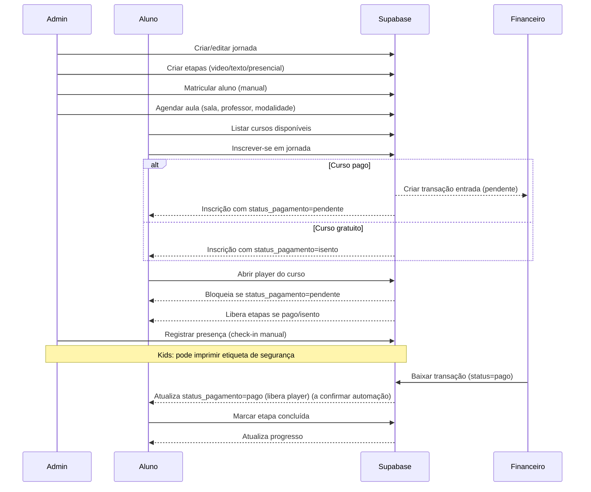

# Sequência — Jornadas e Ensino

Notas:
- A liberação automática do player após a baixa financeira depende da atualização do `status_pagamento` na inscrição (automação a confirmar).
- O fluxo não inclui integrações de pagamento no app do aluno; a baixa ocorre no módulo financeiro.
