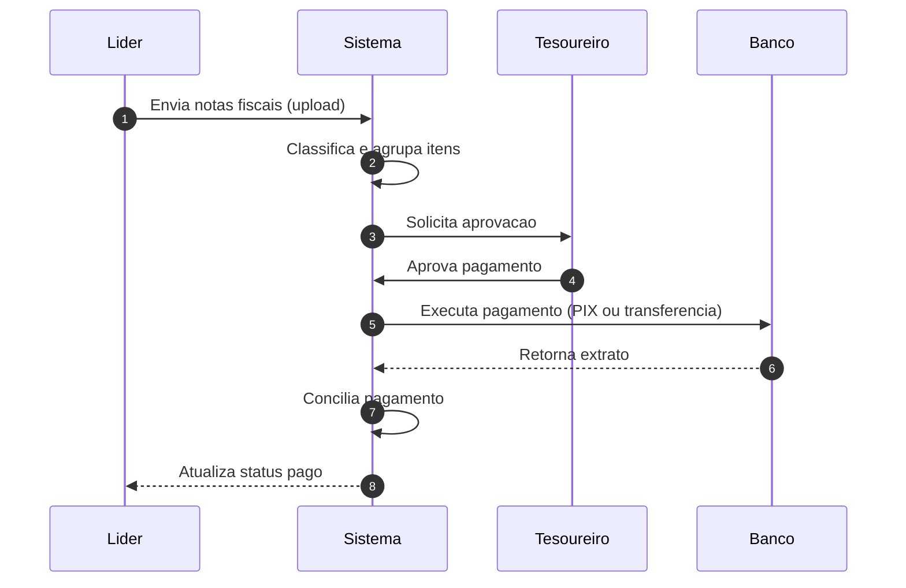
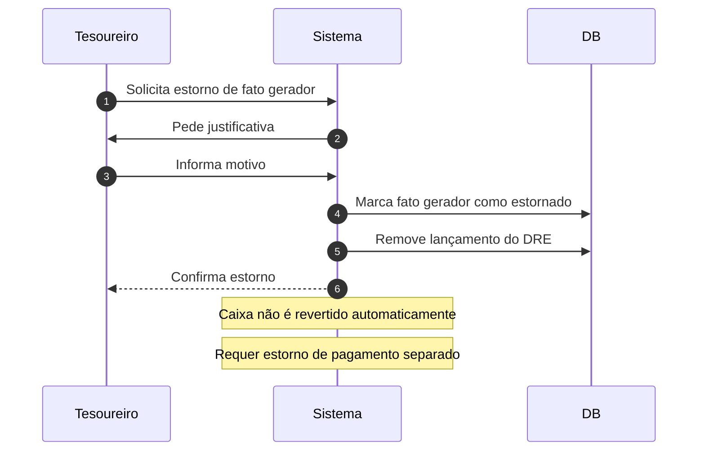
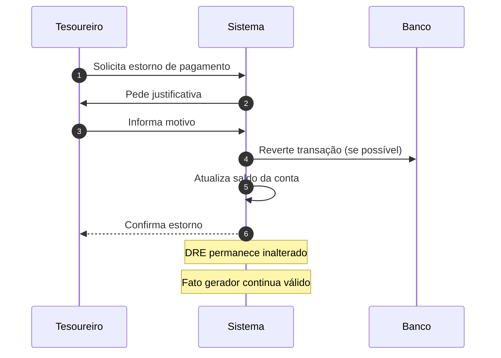
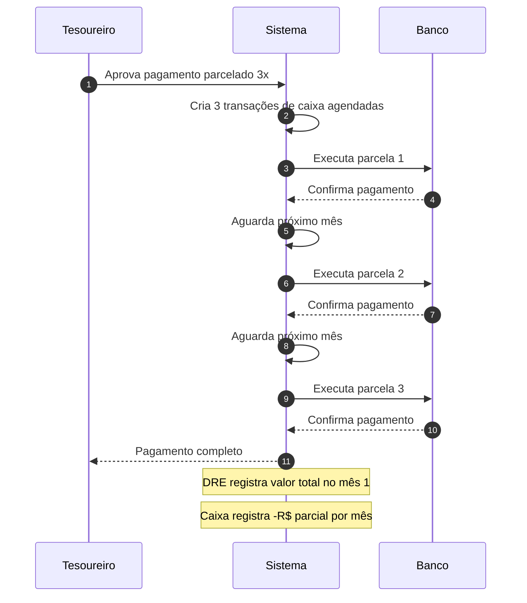
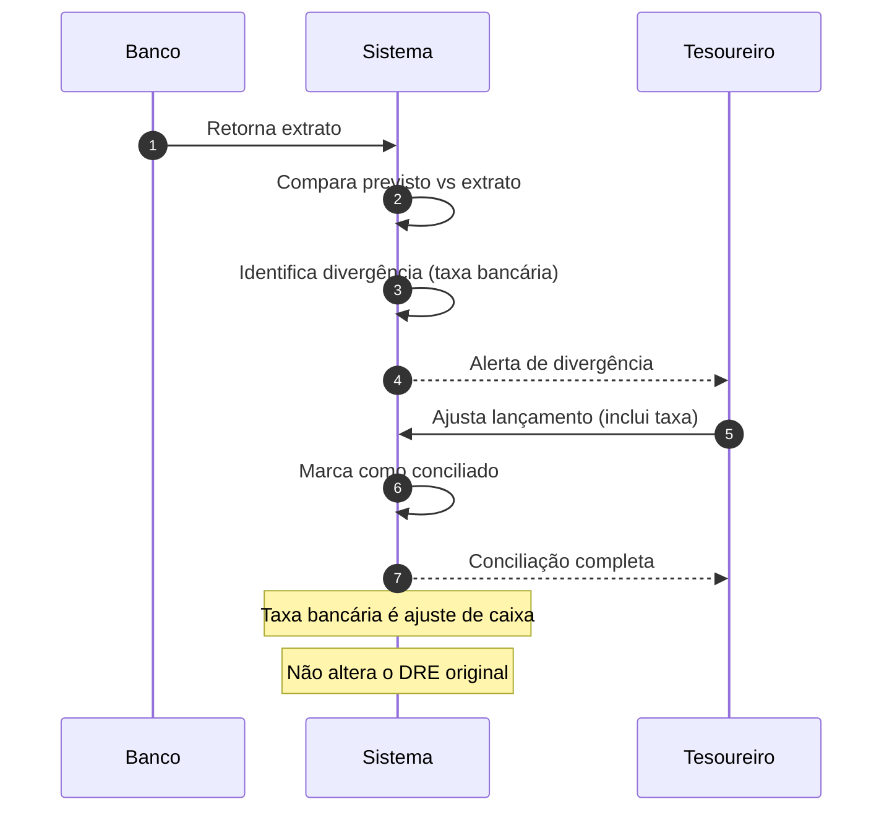

# Diagrama de Sequencia - Processo Financeiro

## Objetivo
Detalhar a ordem cronológica dos eventos em um ciclo financeiro completo, desde o registro do fato gerador até a conciliação bancária e atualização do DRE.

## Contexto
Este diagrama representa o fluxo feliz (sem erros) de uma despesa com reembolso. Para variações (estornos, parcelamentos, conciliação com divergência), consulte os cenários na seção abaixo.

## Sequência Padrão (Fluxo Feliz)

Sequência temporal dos eventos financeiros, do upload até a conciliação, seguindo o modelo do ADR-001. Referências: [`../adr/ADR-001-separacao-fato-gerador-caixa-dre.md`](../adr/ADR-001-separacao-fato-gerador-caixa-dre.md) e [`../manual-usuario.md`](../manual-usuario.md).

---

## Detalhamento dos Passos

### 1. Upload de Notas Fiscais
- **Ator**: Líder ou membro que fez a compra
- **Ação**: Upload de imagem/PDF da nota fiscal
- **Sistema**: IA (Gemini) extrai dados automaticamente
- **Resultado**: Fato gerador criado com categoria, fornecedor e valor

### 2. Classificação e Agrupamento
- **Sistema**: Agrupa múltiplas notas em uma solicitação
- **Sistema**: Sugere categoria com base em histórico do fornecedor
- **Resultado**: Solicitação de reembolso pronta para aprovação

### 3. Aprovação do Tesoureiro
- **Ator**: Tesoureiro ou administrador financeiro
- **Ação**: Revisa categoria, valor e fornecedor
- **Decisão**: Aprova, rejeita ou solicita ajuste
- **Resultado**: Se aprovado, avança para pagamento

### 4. Execução do Pagamento
- **Sistema**: Gera transação de caixa
- **Tesoureiro**: Escolhe forma de pagamento e conta origem
- **Banco**: Processa transferência/PIX
- **Resultado**: Dinheiro sai da conta da igreja

### 5. Retorno do Extrato Bancário
- **Banco**: Envia extrato (API ou importação manual)
- **Sistema**: Compara lançamento previsto vs extrato
- **Resultado**: Transação marcada como "Pendente de Conciliação"

### 6. Conciliação
- **Sistema**: Valida se valor e data batem
- **Se bate**: Marca como "Conciliado" e atualiza status para "Pago"
- **Se não bate**: Alerta tesoureiro para verificação manual

### 7. Atualização de Status
- **Sistema**: Notifica líder que o reembolso foi pago
- **Sistema**: Atualiza DRE com o valor na categoria correta
- **Resultado**: Ciclo completo

---

## Variações do Fluxo

### Variação A: Estorno de Fato Gerador

### Variação B: Estorno de Pagamento (sem alterar fato gerador)

### Variação C: Pagamento Parcelado

### Variação D: Conciliação com Divergência

---

## Referências

- **Decisão Arquitetural**: [ADR-001 - Separação Fato Gerador vs Caixa vs DRE](../adr/ADR-001-separacao-fato-gerador-caixa-dre.md)
- **Funcionalidades Detalhadas**: [Módulo Financeiro](../funcionalidades.md#2-módulo-financeiro)
- **Guia do Usuário**: [Manual - Seção Financeiro](../manual-usuario.md#4-módulo-financeiro)
- **Fluxo Macro**: [Diagrama de Fluxo Financeiro](fluxo-financeiro.md)
- **Composição do DRE**: [Diagrama DRE](dre.md)
