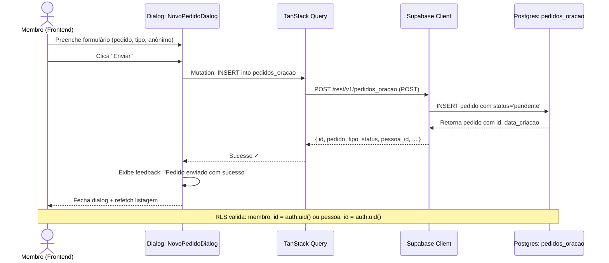
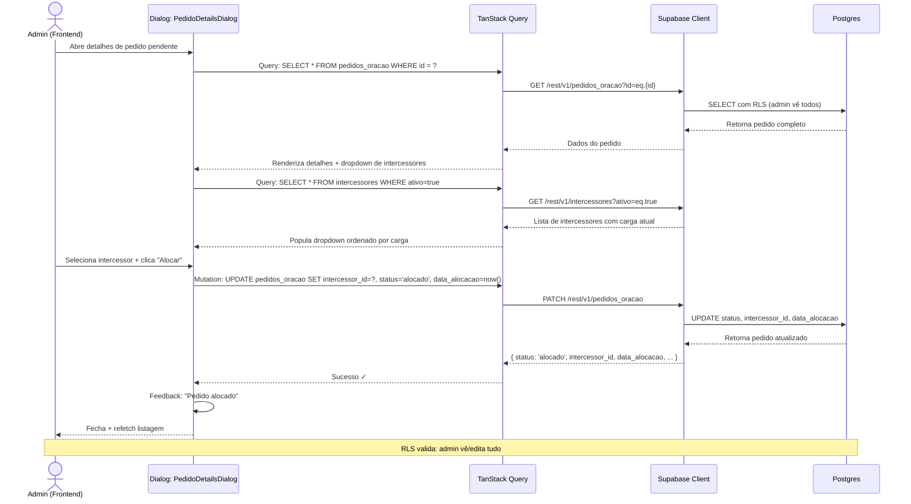
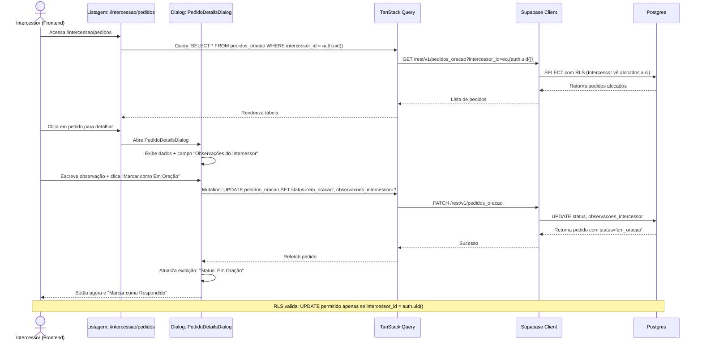
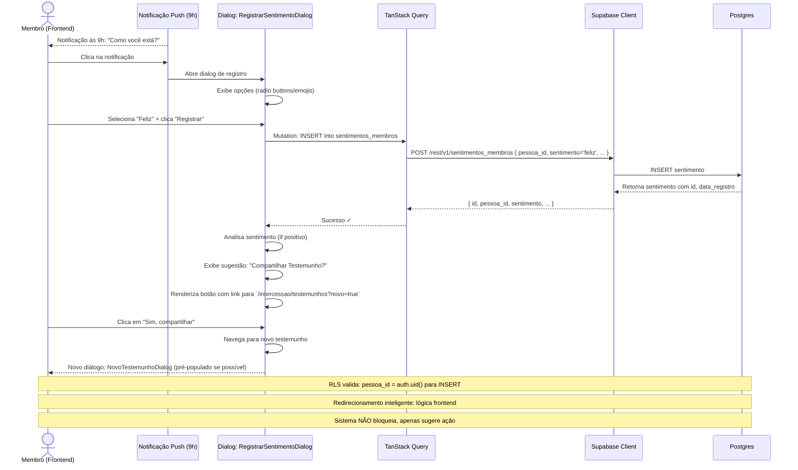
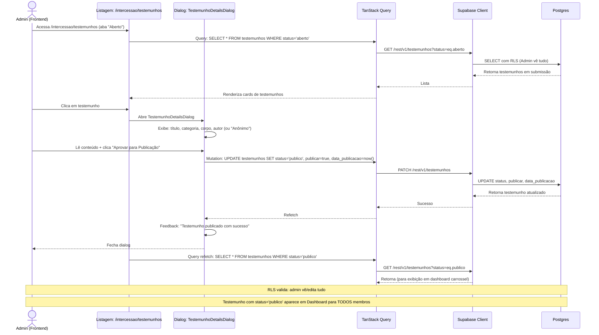
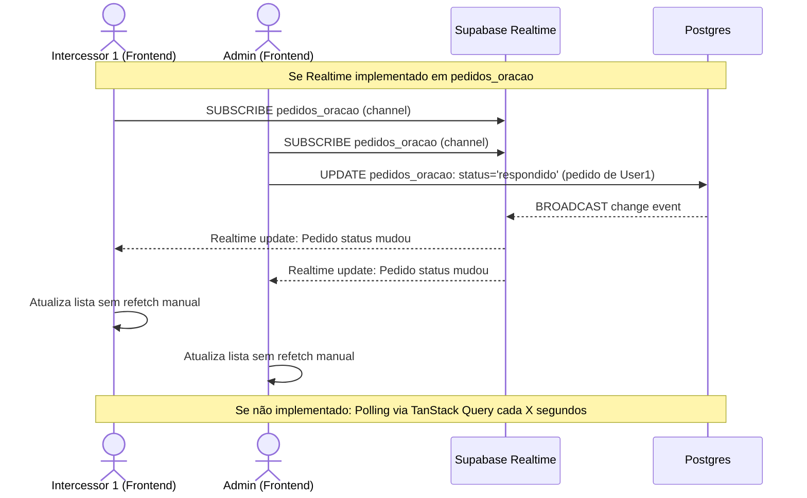

# Sequência — Intercessão, Oração e Testemunhos

Diagrama de sequência (Mermaid) mostrando a troca de mensagens entre Frontend, Supabase e banco de dados para as operações principais do módulo.

## 1. Sequência: Criar Pedido de Oração (Membro)



## 2. Sequência: Admin Aloca Pedido a Intercessor



## 3. Sequência: Intercessor Atualiza Observações e Status



## 4. Sequência: Registrar Sentimento + Redirecionamento Inteligente



## 5. Sequência: Admin Aprova Testemunho para Publicação



## 6. Sequência: Sistema Detecta Alerta Crítico (3+ Dias Negativos)

```mermaid
sequenceDiagram
    participant Backend as Backend (Edge Function?)<br/>(a confirmar)
    participant DB as Postgres
    participant Cache as Cache/Dashboard
    actor Admin as Admin (Frontend)
    
    Note over Backend,Admin: A cada novo registro de sentimento negativo
    
    Backend->>DB: Query: SELECT COUNT(*) FROM sentimentos_membros<br/>WHERE pessoa_id = ? AND sentimento IN ('triste','ansioso','angustiado')<br/>ORDER BY data_registro DESC LIMIT 3
    
    DB-->>Backend: Retorna últimas 3 registros
    
    Backend->>Backend: Analisa: Se 3 consecutivos negativos?
    
    alt Sim: 3+ consecutivos negativos
        Backend->>DB: INSERT INTO alertas_criticos (pessoa_id, tipo, criado_em)
        OR UPDATE exibição de alerta em cache/tabela
        
        Backend->>Cache: Sinaliza: Membro X em risco
        Cache-->>Admin: Dashboard recarrega/Realtime push
        
        Admin->>Cache: Visualiza "Alertas Críticos" card
        Admin->>Admin: Vê: Nome, Contato, Link WhatsApp
        Admin->>Admin: Clica em membro ou WhatsApp para enviar mensagem
    else Não: menos de 3 ou misturado com positivos
        Backend->>Backend: Sem alerta
    end
    
    Note over Backend,Admin: RLS: Alertas privados por pessoa/admin
    Note over Backend,Admin: Redirecionamento: Link direto para perfil + histórico Sentimentos
    Note over Backend,Admin: Notificação: Automática (a confirmar implementação)
```

## 7. Sequência: Realtime (a confirmar se implementado)



## 8. Resumo das Operações RLS

| Tabela | Membro | Intercessor | Admin |
|--------|--------|-------------|-------|
| `pedidos_oracao` | SELECT próprios (membro_id = auth.uid()), INSERT próprio | SELECT alocados (intercessor_id = auth.uid()), UPDATE próprios | SELECT/INSERT/UPDATE/DELETE todos |
| `testemunhos` | SELECT/INSERT próprios, SELECT públicos (status='publico') | SELECT próprios + públicos | SELECT/INSERT/UPDATE/DELETE todos |
| `sentimentos_membros` | SELECT/INSERT próprios | N/A (não acessa) | SELECT/UPDATE todos |
| `intercessores` | SELECT ativos apenas (ativo=true) | SELECT próprio perfil | SELECT/INSERT/UPDATE/DELETE todos |

---

**Referências**:
- Manual do Usuário (Seção 6): [`../manual-usuario.md#6-intercessão`](../manual-usuario.md#6-intercessão)
- Funcionalidades: [`../funcionalidades.md#4-intercessão-oração-e-testemunhos`](../funcionalidades.md#4-intercessão-oração-e-testemunhos)
- Fluxo: [`fluxo-intercessao.md`](fluxo-intercessao.md)
- Arquitetura: [`../01-Arquitetura/01-arquitetura-geral.MD#módulo-intercessão-oração-e-testemunhos-visão-técnica`](../01-Arquitetura/01-arquitetura-geral.MD#módulo-intercessão-oração-e-testemunhos-visão-técnica)
