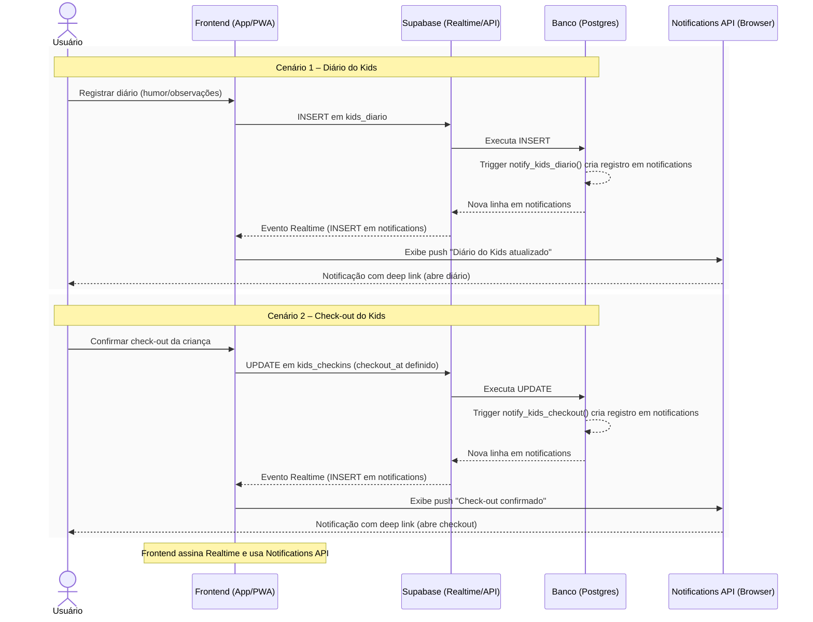

# Sequência – Notificações do Ministério Kids

Este diagrama descreve a sequência de eventos que gera e entrega notificações do Kids para os responsáveis, cobrindo os dois cenários implementados: registro de diário e confirmação de check-out. Baseado em `docs/NOTIFICACOES_KIDS.md` e no código (`useNotifications.tsx`, `NotificationBell.tsx`, triggers SQL mencionadas no guia).

Referência detalhada: [../NOTIFICACOES_KIDS.md](../NOTIFICACOES_KIDS.md)

Se algum componente intermediário adicional vier a ser adotado (ex.: serviço dedicado de push), ele poderá ser representado no diagrama como “Serviço de Notificações (a confirmar)”.