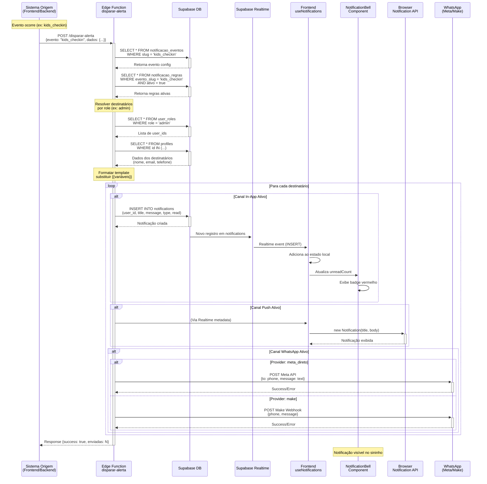
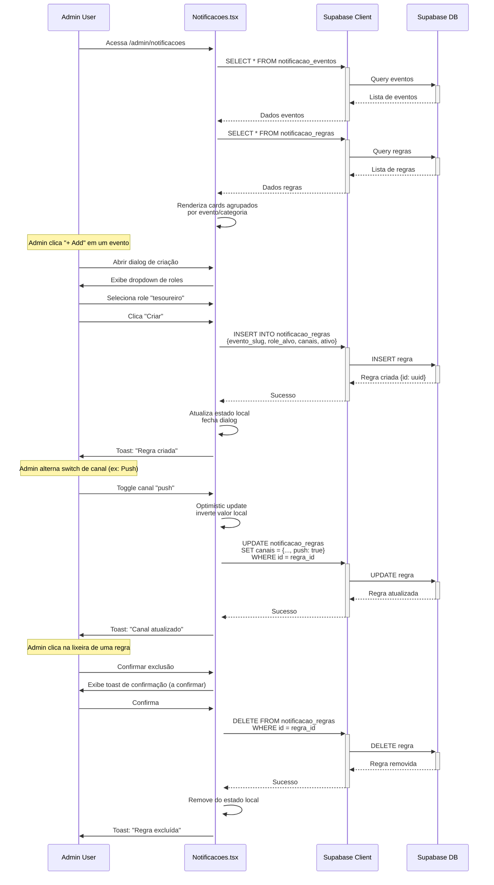
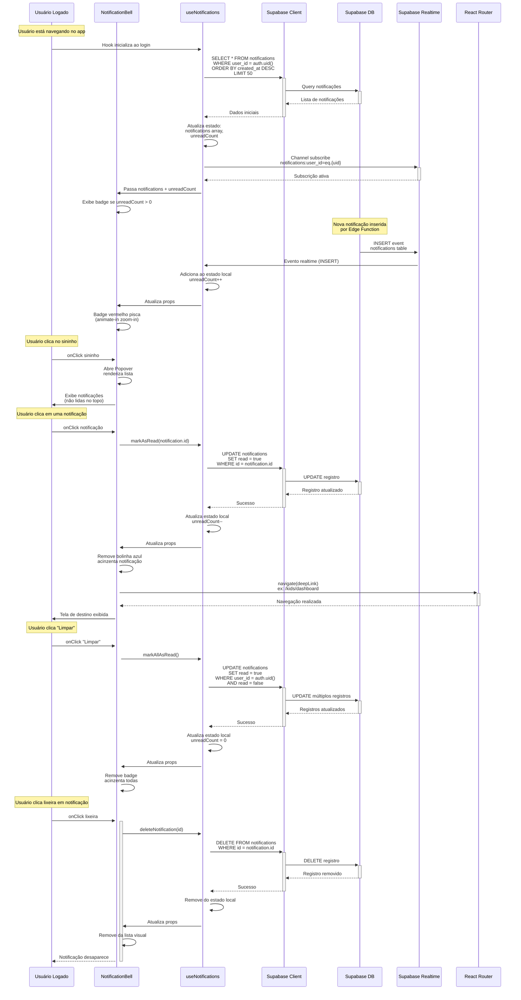

# Diagrama de Sequência — Módulo Notificações

Este diagrama mostra a interação temporal entre os componentes do sistema de notificações, desde o disparo do evento até a entrega multi-canal.

## Fluxo Principal: Disparo de Notificação

## Fluxo de Configuração: Admin Gerencia Regras

## Fluxo de Consumo: Usuário Visualiza e Interage

## Observações

### Componentes e Atores
- **Sistema Origem**: qualquer parte do sistema que detecta evento (frontend ao criar visitante, backend ao inserir conta a pagar, etc.)
- **Edge Function `disparar-alerta`**: orquestrador central de disparo de notificações
- **Supabase DB**: armazena eventos, regras e notificações enviadas
- **Supabase Realtime**: propaga notificações em tempo real via WebSocket
- **useNotifications Hook**: gerencia estado local, subscrição realtime e interações
- **NotificationBell Component**: UI do sininho e popover de notificações
- **Browser Notification API**: API nativa do navegador para push notifications
- **WhatsApp (Meta/Make)**: integrações externas para WhatsApp

### Decisões Arquiteturais
- **Sincronização**: operações síncronas (INSERT → Realtime → Frontend), sem filas ou workers
- **Optimistic Update**: frontend atualiza estado antes de confirmar UPDATE (melhor UX)
- **Realtime Subscription**: um único canal por usuário (`notifications:user_id=eq.{uid}`)
- **Deep Linking**: cada tipo de notificação tem rota de destino mapeada no `NotificationBell`
- **RLS**: todas operações respeitam Row Level Security (usuários só veem/atualizam suas notificações)

### Integrações Externas
- **Meta API**: WhatsApp Business API (autenticação via token, POST direto)
- **Make Webhook**: disparo via HTTP POST para workflow n8n/Make (processa envio WhatsApp)
- **Browser API**: `new Notification(title, options)` requer permissão do usuário (`Notification.requestPermission()`)

### Referências
- **Arquitetura**: [docs/01-Arquitetura/01-arquitetura-geral.MD](../01-Arquitetura/01-arquitetura-geral.MD)
- **Fluxo**: [fluxo-notificacoes.md](fluxo-notificacoes.md)
- **Funcionalidades**: [docs/funcionalidades.md](../funcionalidades.md#módulo-notificações)
- **Database**: [docs/database-er-diagram.md](../database-er-diagram.md)
