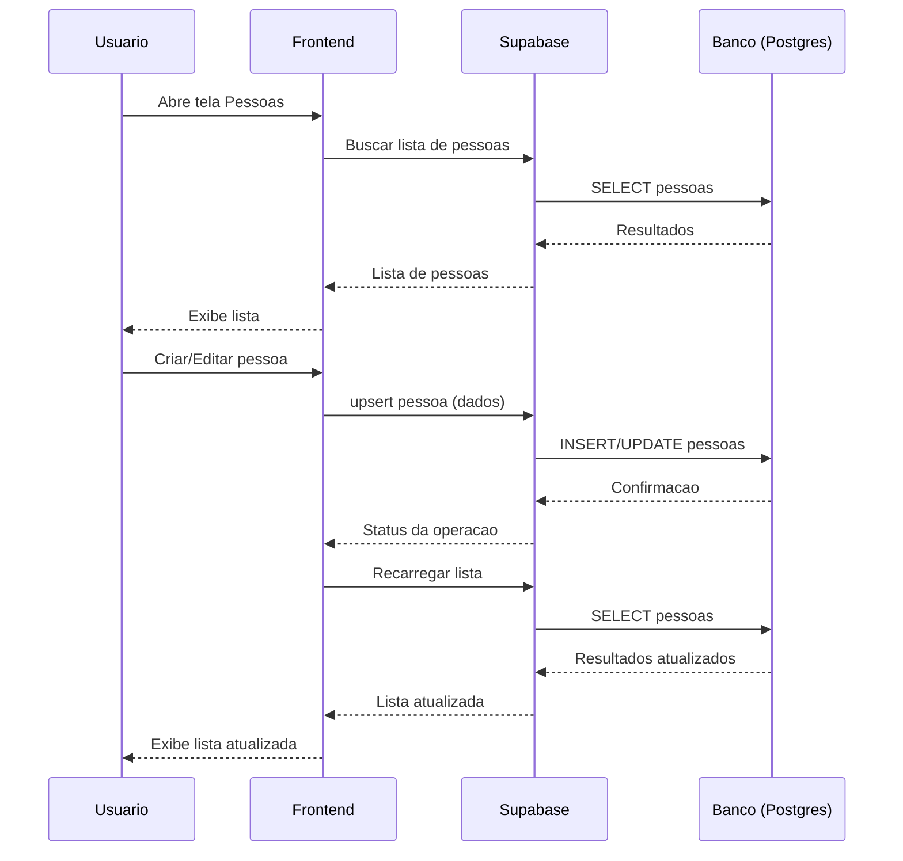

# Sequencia do Modulo Pessoas

Fluxo sequencial basico do modulo Pessoas: abertura da tela, carregamento da lista, criacao/edicao, persistencia no banco e recarregamento.

```mermaid
sequenceDiagram
    participant Usuario
    participant Frontend
    participant Supabase
    participant Banco as Banco (Postgres)

    Usuario->>Frontend: Abre tela Pessoas
    Frontend->>Supabase: Buscar lista de pessoas
    Supabase->>Banco: SELECT pessoas
    Banco-->>Supabase: Resultados
    Supabase-->>Frontend: Lista de pessoas
    Frontend-->>Usuario: Exibe lista

    Usuario->>Frontend: Criar/Editar pessoa
    Frontend->>Supabase: upsert pessoa (dados)
    Supabase->>Banco: INSERT/UPDATE pessoas
    Banco-->>Supabase: Confirmacao
    Supabase-->>Frontend: Status da operacao
    Frontend->>Supabase: Recarregar lista
    Supabase->>Banco: SELECT pessoas
    Banco-->>Supabase: Resultados atualizados
    Supabase-->>Frontend: Lista atualizada
    Frontend-->>Usuario: Exibe lista atualizada
```
