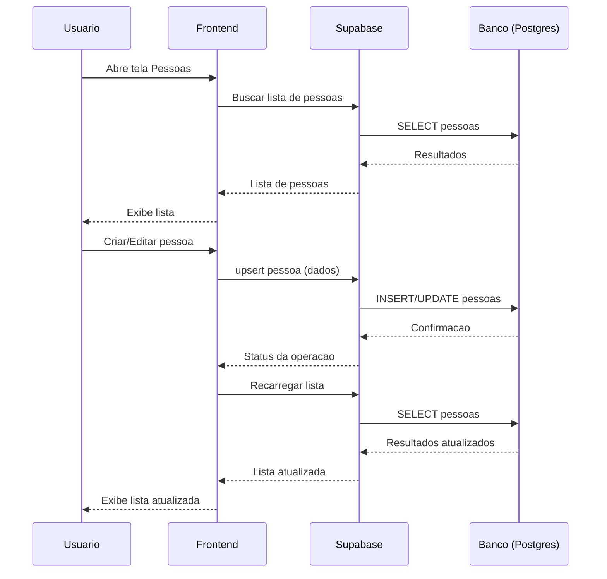
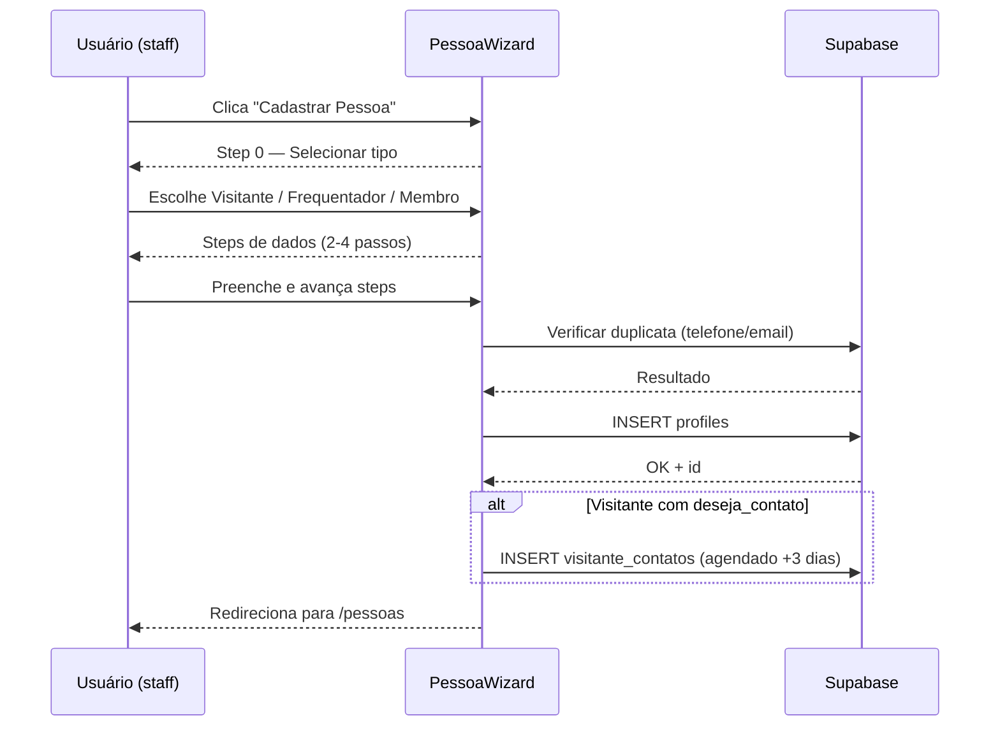
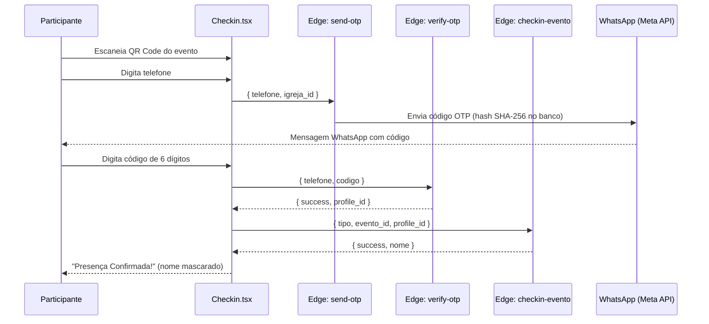
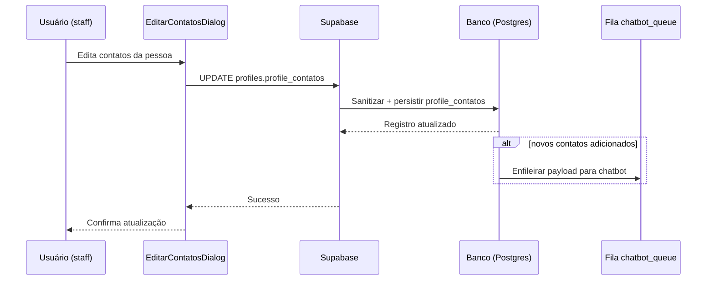

# Sequencia do Modulo Pessoas

Fluxo sequencial basico do modulo Pessoas: abertura da tela, carregamento da lista, criacao/edicao, persistencia no banco e recarregamento.

## Sequência: Wizard Interno de Cadastro (/pessoas/cadastrar)

## Sequência: Check-in com OTP WhatsApp

## Sequência: Atualização de Contatos (sanitização + fila de chatbot)

